# NeoPi repository process

Workspace-wide branch, commit, PR, babysitting, comment-identity, and autonomy rules live in the workspace AGENTS.md (parent of this repository). These files add NeoPi specifics; read the one for your question.

| Question | Read |
| --- | --- |
| Which branches exist, how are they protected, which hooks run? | [branches.md](branches.md) |
| What is NeoPi-specific about commits and agent identity? | [commits.md](commits.md) |
| Which labels exist and who merges into `neopi`? | [pull-requests.md](pull-requests.md) |
| How do I integrate an upstream release? | [upstream-sync.md](upstream-sync.md) |
| How do I build, install, tag, or promote? | [builds.md](builds.md) |
| How do I request Codex or run the sentinel panel? | [review-bots.md](review-bots.md) |
| Which document should an agent load? | [agents.md](agents.md) |

```mermaid
flowchart LR
    issue[Issue] --> worktree[Worktree from origin/nightly]
    worktree --> pr[PR into nightly]
    pr --> bot[Scoped bot review]
    bot --> ready[ready-for-merge]
    ready --> nightly[Auto-merge nightly]
    nightly --> build[Build / tag]
    build --> promote[promote/tag PR]
    promote --> sentinel[Sentinel panel]
    sentinel --> neopi[Owner merges neopi]
```

