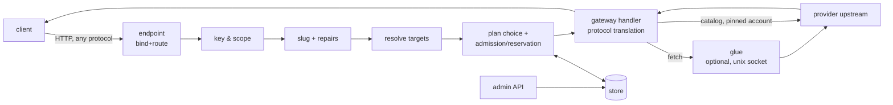

# Marineris v3: the npi switch — accounting-closure candidate 2.3

Status: **complete proposed design, awaiting independent review; not implemented and not approved for production**. Date: 2026-09-28. Revision owner: Astra (`openai-codex/gpt-6-astra`), authorized by the Captain to unblock the backend. Earlier design authorship remains Fable and Opus; this revision does not overwrite their working document or saved reviews.

The Captain has selected **npi-deck hosting** for the dashboard. This is an explicit amendment of M9, not a second standalone UI. Design competition selection is independent of backend semantics. No runtime readiness, test pass, critic satisfaction or deployment is asserted here.

Basis: the complete preserved mixed revision-2.2/pending-2.3 source, SHA-256 `11e9bc97298674a1da18193adb1ecdda2cfe0928b931d6af845f7168db76e061`, plus saved `astra-r2.md`, `grok-r2b.md`, and `marineris-dashboard-integration-design.md`. The accompanying `marineris-backend-resolution-ledger-accounting-closed-candidate.md` maps all saved findings and subsequent independent reviews to this complete candidate. The prior `marineris-v3-astra-proposed.md` and its ledger remain frozen and unchanged. The third security/lifecycle review was SATISFIED for its specification scope with nonblocking SEC-N1; the third accounting review remained NOT SATISFIED because video job completion could charge after submit recovery. This candidate preserves the accepted security contracts, corrects SEC-N1 and proposes one shared Attempt/job financial owner plus a closed writer inventory for that remaining ACC-03 asynchronous-job overlap. All three predecessor pairs remain frozen. The filename’s “accounting-closed-candidate” is a requested handoff label, not an accounting acceptance or implementation claim. The original source and all reviews remain unchanged.

Authority order: Captain's decisions Q1–Q12 and current ownership/hosting directions; this complete proposed normative text once approved; previously decided MoA behavior except the explicit host-seam amendment in §13.4; existing source APIs as implementation evidence, not proof of unbuilt switch behavior. Historical revision summaries in §28 are non-normative. Generic source citations are relative to the NeoPi repository unless prefixed `npi-deck:`. Example addresses, identities and amounts are synthetic; no site configuration or credentials are reproduced.

RFC 2119 keywords are normative. Closed lists may be changed only by a reviewed spec amendment. All new API examples use JSON property names as specified; TOML configuration remains snake_case. An API/interface described here is a required change unless identified as existing. The normal gateway's existing credential cascade is not silently redefined for its other consumers.

## 0. Summary and the invariants everything follows from

The **switch** is npi serving inference. One process (`npi switch serve`,
started only by systemd) reads a TOML configuration, binds one or more HTTP
endpoints, and forwards every request to a provider the operator declared, in
whatever protocol the provider speaks, using credentials npi already holds.
Clients authenticate with minted **Keys** whose scopes and **Allotments** the
operator edits live through an authenticated admin API (the CLI and the future
dashboard are its two clients). Every request that reaches a subscription is
pinned to one explicitly chosen **Plan**, and the choice is visible to the key
holder, the operator and the decision log. It replaces the Python Marineris
0.5–0.7. `npi auth-gateway serve` stays, unchanged for its users, beside it
(§20).

Eight invariants, each traced to a directive, a decision, or an existing
property of the code:

1. **The switch is not omniscient.** Nothing is routable unless a
   `[[provider]]` block declares it, and nothing is served unless an
   `[[endpoint]]` block connects it (`connect`, §5.4, REQUIRED, never
   defaulted). An empty configuration serves nothing. This is Shayna's ground
   rule ("the proxy does not even know what providers it has, you do") and the
   MoA decision "opt-in for everything" (`docs/specs/mixture-of-agents.md:2745-2747`).
2. **One endpoint, every provider, every protocol.** The existing gateway
   already routes chat in three wire formats plus embeddings, rerank, images,
   speech, transcription, video and judgments (`packages/ai/src/auth-gateway/server.ts:11-24`,
   route table `:814-878`). The switch mounts that handler under
   operator-declared endpoints; it adds no second translation layer.
3. **Credentials never move.** Catalog providers resolve credentials through
   `AuthStorage.keys` (ordinary `get`; Plans require `getPinned`, §12.3), locally
   or through the broker, whose snapshots replace every OAuth refresh token
   with `REMOTE_REFRESH_SENTINEL` (`packages/ai/src/auth/pool.ts:706`,
   `packages/ai/src/auth/types.ts:268`). Foreign providers' keys are read from
   references the operator writes (§5.12) and are never echoed.
4. **No silent plan choice.** A request that reaches a provider with declared
   Plans is pinned to exactly one Plan per upstream attempt, chosen by the
   Key's explicit plan order and gates (§12.9). Account fallback inside
   `AuthStorage` is disabled for pinned attempts (§12.3). Every attempt's plan
   is in the response headers and the decision log. This is Q2: v0.5 drained a
   $20 team plan to 99% while a $200 plan idled, and the only notice was the
   body of a last-minute 403.
5. **Fail loudly, never silently.** Every rejection names the rule, the value
   and the reset time; every approaching limit warns the key holder (headers,
   `/switch/me`) and the operator (events, notifications) before it bites
   (§16). A rule the switch cannot evaluate denies with its own code; it never
   admits by default (§12.7). Unknown configuration is an error (Q5, §5.13).
6. **Intent over form.** A request whose intent is clear is repaired, never
   rejected; every repair is named, logged, and reported in a response header
   (§8; on everywhere, Q7). A request whose repair would change what the model
   sees is rejected in the caller's own protocol.
7. **Policy in data, quirks in glue, state in the store.** Model and provider
   policy stays in KDL (`packages/catalog/src/compat/rules/`, compiled by
   `packages/catalog/scripts/compat-compiler/index.ts:42-60`); the TOML
   declares *infrastructure* (providers, endpoints, plans, virtual models);
   the **Store** (one SQLite file, §12.13) holds *live state* (keys,
   allotments, grants, usage, decisions), mutated only through the admin API
   in single transactions. Provider misbehaviour that policy cannot express is
   handled by an executable **Glue** (§10).
8. **The slug carries the dials.** `provider/model:dials` (§6): everything
   before the first `/` is the provider; a trailing `:` segment that parses as
   dials sets effort and sampling for clients that cannot set them any other
   way (Honcho). An unknown provider prefix is 404 `unknown_provider` (Q8).



## 1. Vocabulary (closed)

| Term | Meaning |
|---|---|
| **Switch** | The `npi switch serve` process and the code under `packages/ai/src/switch/` and `packages/coding-agent/src/switch/`. |
| **Config** | The TOML documents of §5, loaded from one Config Dir. Infrastructure only; no keys. |
| **Config Dir** | A directory holding `switch.toml`, optionally `providers.d/`, `glue/`, `notify/` and secret files (§5.1). |
| **Generation** | One immutable snapshot of Config + catalog + provider table + endpoint set, swapped as a unit (§4.6). |
| **Store** | The SQLite database `<state_dir>/switch.db`: keys, allotments, grants, usage buckets, attributions, meter snapshots, decisions, events, audit (§12.13). |
| **Provider** | A `[[provider]]` block: one upstream the switch may talk to, either a **catalog provider** (npi's own, credentials from `AuthStorage`) or an **http provider** (foreign base URL, operator-supplied key). |
| **Plan** | A `[[plan]]` block: one subscription or billing account of a Provider, identified by an account selector, with the Meters its provider reports (§5.7, §12.3). A Provider with at least one Plan is **planned**. |
| **Meter** | One `UsageLimit` row (`packages/ai/src/usage.ts:62-72`) of a Plan's account, identified by its window id (`5h`, `7d`, …). |
| **Window Instance** | One period of a Meter or Budget window, from its start to its reset (§12.5). |
| **Endpoint** | An `[[endpoint]]` block: one listening `bind` + `route` pair, identified by its **Endpoint Id** (§5.4). |
| **Connection** | An entry of an Endpoint's `connect` list: a Provider, a Provider/model glob, a Virtual Model, or a mixture. The set of Connections is the endpoint's publication allow-list. |
| **Glue** | An executable the switch supervises, attached to a Provider, speaking HTTP over a unix socket (§10). The **built-in glue** is the gateway's own `streamSimple` path. |
| **Virtual Model** | A `[[model]]` block: an operator-invented model id resolved to an ordered list of **Targets** by a **Strategy** (§13). |
| **Target** | One `targets` entry of a Virtual Model: a Provider model slug, another Virtual Model, or `mixture/<name>`. |
| **Key** | A Store record: a minted bearer token with a **Scope**, a **Plan List** and **Budgets** (§12.2). |
| **Plan List** | A Key's ordered list of Plans it may use, each with its **Gates** (§12.6). |
| **Gate** | A per-Key ceiling on a Plan's Meter: the Key may use the Plan while the Meter is below it (§12.6). |
| **Budget** | A per-Key consumption cap by unit/window/scope/policy. A **Share** is a plan-window plan_pct Budget for proportional/declared Plans, or a tokens Budget for tokens Plans (§12.5). |
| **Grant** | A one-off addition to one Budget's cap, expiring at a Window Instance end or a timestamp (§12.10). |
| **Adjustment** | One reviewed live Plan List, Gate, Budget or Grant operation from the closed fifteen-operation list (§12.10). |
| **Attempt** | One call of the gateway handler for one (Target, Plan) pair; zero or one billed upstream response (§12.8). |
| **Reservation** | The estimated consumption an Attempt holds against every Budget and Gate in scope while in flight (§12.8). |
| **Principal** | The Key a request authenticated with, or the literal `anonymous` on an Endpoint with `auth = "none"`. |
| **Slug** | The client's `model` string, decomposed into provider, model id and **Dials** (§6). |
| **Dial** | One `key=value` or effort word in a Slug's trailing `:` segment. |
| **Repair** | A named, logged rewrite of a request whose intent is clear (§8, closed list). |
| **Decision** | The recorded outcome of the pipeline for one request, with its Attempts (§16.1). |
| **Event** | A persisted notification record (threshold crossed, denial, plan fallback, …) (§16.2). |
| **Well-known route** | A path in the closed table of §5.4.2. |

## 2. Traceability

### 2.1 Directives

Every line of intent in the directives note, with the section that satisfies
it. "Msg" is the message letter; operating-order items are "OO n".

| # | Directive (paraphrased) | Section |
|---|---|---|
| D1 | OO 1: MoA first; anything in npi's catalog is servable, including custom MoA models | §13.4, §24.10; MoA M1 is merged (`955b7b385f`) |
| D2 | Original Fable design ownership, superseded by current Captain authorization | Astra owns this backend correction proposal; original Fable/Opus draft and saved reviews preserved; independent review required |
| D3 | OO 2: Grok and Astra critique until "good enough"; Opus implements; critics review every milestone | §23 (milestones end with critic review), §28 |
| D4 | OO 2: decisions with no objectively right answer go to Shayna as asks | §25 |
| D5 | OO 2: create the GitHub repository if missing; every checkpoint as a PR | §3.2, §23 |
| D6 | OO 2: personal vs office versions: two branches, stable and nightly | §3.2, §21.1 (Q1) |
| D7 | Dashboard with independent design/review integration | §19 and M9: Captain-selected Deck host and Astra presentation with selected Muse/Grok refinements; backend semantics independent |
| D8 | OO 3: reconcile intents (not codebases) of the Marineris drafts and deployments | §3, §24, and the Marineris lineage notes in §7, §11, §12 |
| D9 | Msg A: sign every comment with the model slug | §21.4 |
| D10 | Msg A: a switch, like a network switch, for any kind of model request incl. STT/TTS/image | §0 invariant 2, §9 |
| D11 | Msg A: mint keys, choose who gets them and which models they see | §12.2, §17 |
| D12 | Msg A: invent virtual models (the note names examples), possibly classifier-routed, KV-cache aware | §13, §13.5 (classify, M10), §13.1 sticky |
| D13 | Msg A: xAI cross-model continuation by `previous_response_id` | §13.3 (measured before relied on), §26 |
| D14 | Msg B: npi becomes the proxy; every npi install on the LAN meshes and shares pools without handing over a refresh token | §0 invariant 3, §4.4, §9.1, §15.3 |
| D15 | Msg B: internal access to auth and refresh as the harness does it | §4.4 (AuthStorage), §12.3 (pinned resolver) |
| D16 | Msg B: per-person usage trackable natively; sharing MoAs | §12.12, §13.4 |
| D17 | Msg C: a single localhost port serving everything, all providers combined | §5.4 (`route = "/v1/*"`), §23 M1 |
| D18 | Msg C: ask for a model on a specific host (GLM on Z.ai, Kimi on OpenCode) | §6 (provider prefix), §11 |
| D19 | Msg C: every format that exists, audio, embeddings, everything OMP supports incl. Hermes portal | §9 |
| D20 | Msg C: survive bad requests when intent is clear (ground rule) | §8 |
| D21 | Msg C: TOML instead of a dashboard, editable over SSH in Vim | §5 (infrastructure stays TOML); superseded for live state by Q2 (§2.2): allotments are edited through the admin API, from the CLI over SSH or the dashboard, and keys export to and import from TOML (§17.9) |
| D22 | Msg C: not omniscient; the operator defines each provider (name, endpoint, protocol, auth kind, metadata, category: routing/direct/rehost/special) | §5.3 |
| D23 | Msg C: providers as a double-bracketed array | §5.3 (`[[provider]]`) |
| D24 | Msg C: define an endpoint: listen on a port, at a route (`/v1/chat/completions` or `/v2/hello-world`) | §5.4 |
| D25 | Msg C: identify an endpoint by a hash of port and route (an explicit id also acceptable) | §5.4.1 |
| D26 | Msg C: connect providers to an endpoint by an array of references | §5.4 (`connect`) |
| D27 | Msg C: a `serve` key pointing at an executable (Python or any) as a middleman glue layer; three-step, possibly four | §10 (`glue` on the provider; naming in §3.4), §13 (the fourth step) |
| D28 | Msg C: the glue adapts provider quirks (stale `/v1/models`, wrong context windows, missing reasoning levels) | §10, §11.4 (`[[provider.model]]` overrides for the data-only cases) |
| D29 | Msg C: glue lifetime: load once, keep in memory, hot reload when the TOML or the file changes | §10.3, §5.14 |
| D30 | Msg C: default is three routes on one port; more endpoints for per-endpoint keys, other interfaces (overlay networks, internet) | §5.4, §15.1 |
| D31 | Msg C: at least one provider block per subscription or key; combine all into one source of inference | §5.10 example, §5.7 (one `[[plan]]` per subscription), §11 |
| D32 | Msg C: Marineris 0.7 is fault tolerant in ways a standard router is not; keep that | §7 stage 10, §13.2, §8 |
| D33 | Msg D: full scope: proxy, router, switch, hub; scoped keys; plan-percentage allotment per key; virtual models; MoA | §12, §13 |
| D34 | Msg D: provider-specific configuration options exposed | §5.3 (`[provider.options]`), §11.5 |
| D35 | Msg D: convert the request to the right upstream format no matter what | §7 stage 8, §9 |
| D36 | Msg D: Honcho needs an OpenAI-compatible endpoint + embeddings model and cannot set dials | §6, §9.2 |
| D37 | Msg D: dials encoded in the slug; split at the first `/`: provider before, model after, dials after the colon; provider names may nest (`cursor/anthropic/...`) | §6 |
| D38 | Msg D: `[[model]]` array to announce models on `/v1/models`, merging discovery with manual rows | §11.4, §5.4 (`connect` globs decide announcement) |
| D39 | Msg D: keep "Marineris" as the code name for the sub-model | §3.4 (Q6) |
| D40 | Msg D: npi will merge upstream things; T3 code fork is separate | out of scope; §27 |
| D41 | Msg C/D: the deployed office instance stays working during the move | §21.3 (migration), §23 M8 |

### 2.2 Round-1 decisions

| Decision | Ruling | Applied in |
|---|---|---|
| Q1 | A `stable` branch in neopi. The in-repo Nix piece is only a generic flake/module that builds the package and exposes service options; host configurations stay private and import it. No site data in the repo. | §3.2, §21.1, §21.2, document conventions |
| Q2 | Plan allotment is the core feature: mintable keys with scopes and allotments edited live at any time; provider-style windows per key, each addable, removable, raisable, lowerable; every interpretation of "N% more"; plan selection never silently drains the wrong plan; OmniRoute as reference; a dashboard with good UX (current selected presentation/host in §19). | §12 (model and algorithm), §14, §16, §17 (admin API), §19 (dashboard contract) |
| Q3 | An interactive session never starts the switch; it runs only as a systemd unit. | §3.1, §4.2, §21.2 |
| Q4 | Keep `npi auth-gateway serve` beside the switch; it is the backup path. | §3.3, §4.5, §20, §23 (every milestone keeps it green) |
| Q5 | Unknown `[provider.options]` keys are an error unless the provider has glue. | §11.5, §5.13 (E-OPTION) |
| Q6 | `npi switch`; Marineris is the code name. | §3.4, §18 |
| Q7 | Repairs on everywhere by default. | §5.2, §8 |
| Q8 | Unknown provider prefix → 404 `unknown_provider`. | §6.3 |
| Process | Current Captain authorization: Astra corrects backend specification; independent review before implementation. Retain small readable code and coordinated implementation ownership. | header, §4.7, §19.5 |
| Q9 (round 2) | Key requests to an unplanned provider with two or more accounts are 403 `plan_required`; loopback anonymous keeps the harness behaviour. | §12.3, §12.9 |
| Q10 (round 2) | All three share measurements are supported, chosen per Plan: `proportional` (default where nothing is declared), `declared` sizes, `tokens` shares. | §5.7, §12.5, §14.2 |
| Q11 (round 2) | A stale Meter denies that Plan and falls through to the next, **after** a staleness grant proportional to the last reading's remaining headroom, capped, fail-loud (header + Event); the request fails only when no Plan has a usable reading or a live grant. | §12.4, §12.7, §12.9, §14.4, §12.15 step 8 |
| Q12 (round 2) | Key holders learn their state from `x-npi-notice` past thresholds plus `GET /switch/me`. | §12.11, §16.3, §17.8 |

## 3. Reconciliation of the directives with each other and with the harness

### 3.1 "Fold into the harness" versus "its own process"

Both hold, at different layers:

- **Code** lives in the npi monorepo. PRs land in `PsychedelicShayna/neopi`,
  one per milestone (§23).
- **Runtime** is its own process: `npi switch serve` is a subcommand of the
  same binary, started **only** by systemd: a system unit on the office host,
  a user unit (`systemctl --user`) on a personal machine (Q3). No code path in
  the interactive harness starts, forks or embeds the switch: there is no
  slash command, no autostart, and no in-process mode. `npi switch serve`
  run by hand (development, tests) works, and logs W-UNSUPERVISED at boot
  when `INVOCATION_ID` (set by systemd for every unit it starts) is absent.
  Rationale: the office endpoint must survive every interactive session
  ending, and a bad nightly build on a laptop must not take the office down.
- **Pinned version** is a deployment property: the office host's private Nix
  configuration pins a commit on the `stable` branch through the generic
  module of §21.2. A personal machine runs the nightly branch.

### 3.2 Repository, branches, PRs

- Repository: `PsychedelicShayna/neopi` (public). Branch `neopi` is the
  nightly (personal) line. The long-lived branch `stable` (Q1) receives
  milestone merges after critic review and acceptance on a staging unit
  (D3, D6).
- Every milestone in §23 is one PR from `feat/marineris-v3-mN` into `neopi`,
  then merged into `stable` once its acceptance passed.
- The repository carries only generic deployment artifacts (§21.2): the Nix
  module, a generic systemd unit, example configurations using documentation
  addresses. Host configurations, real addresses, host names, user names,
  keys and overlay-network ids MUST NOT be committed (Q1).

### 3.3 The broker, the gateway, and the switch

- The **broker** (`packages/ai/src/auth-broker/`) receives the compatibility-preserving `ingestHeadersPinned` operation and authoritative immutable-binding compare+merge transaction (§14.3). Existing clients, pool visibility and refresh-token secrecy remain unchanged. Apart from that explicit extension, the switch uses the existing broker-client/storage boundary
  (`packages/coding-agent/src/cli/auth-gateway-cli.ts:248-277`), or a local
  SQLite client when no broker is configured, through `discoverAuthStorage`
  (`packages/ai/src/auth-broker/discover.ts:464-491`) which already chooses
  between the two (`:454-456` local, `:445-451` remote).
- The **gateway server** (`packages/ai/src/auth-gateway/server.ts`) is
  refactored into a handler factory (§4.5) that both `startAuthGateway` and
  the switch call. `npi auth-gateway serve` is **kept** (Q4): same flags,
  same token file, same routes, same behaviour for its users, its tests green
  at every milestone. It is the backup WAN path when the switch is down (§20).
- The **switch** owns: Config, Generations, endpoints, key auth, slugs,
  repairs, virtual models, glue supervision, plans, allotments, the Store,
  the admin API, events.

### 3.4 Names

- The subsystem is **the switch** in code and CLI (`npi switch …`,
  `packages/*/src/switch/`) (Q6). **Marineris** remains the project's code
  name and the conventional name of the office service unit (D39).
- Shayna's spoken `serve` key for the executable middleman (D27) is named
  **`glue`** in the TOML, because `gateway.serve` already means "publication
  allow-list" (MoA §4.10 item 3, decided). The endpoint's allow-list is
  `connect` (D26), the same concept as `gateway.serve` at endpoint
  granularity.
- Response headers and environment variables use the `x-npi-` / `NPI_`
  prefix. Minted tokens keep the `mrn_` prefix so existing Marineris clients
  (the office omp extension) need only a base-URL change.

## 4. Architecture

### 4.1 Nouns and ownership

```
Config Dir ─┬─ switch.toml      [switch], [admin], [[notify]], [[provider]], [[plan]], [[endpoint]], [[model]]
            ├─ providers.d/     extra [[provider]] and [[plan]] blocks, one file each
            ├─ glue/            executables referenced by provider.glue          (0755)
            ├─ notify/          executables referenced by [[notify]] kind=exec   (0755)
            └─ *.key, *.token   secret files referenced by file: refs           (0600)

State Dir ──┬─ switch.db        the Store (§12.13)                               (0600)
            ├─ admin.sock       admin API unix socket (§17.1)                    (0600)
            └─ glue/*.sock      glue sockets (§10.2)

Switch process
  ConfigLoader        read every source into one document, validate, digest (§5.13, §5.14)
  Generation          immutable: config + ProviderTable + PlanTable + EndpointSet + publication cache (§4.6)
  ProviderTable       provider id → ResolvedProvider (Model objects, credential source, glue, options)
  PlanTable           plan id → ResolvedPlan (provider, pinned account, meters) (§12.3)
  EndpointSet         one Bun.serve per distinct bind; route → Endpoint
  Store               bun:sqlite; the only writer of live state (§12.13)
  KeyIndex            token digest → Key; in-memory mirror of the Store's key tables
  Ledger              usage buckets, reservations, attributions; admission (§12.7, §12.8)
  MeterCache          plan id → Meter snapshots (§14)
  SlugParser          model string → Slug (§6)
  Repairer            request → repaired request + Repair[] (§8)
  Resolver            Slug + Principal + Endpoint → ResolvedTarget[] (§7 stage 6)
  PlanRouter          (Target, Principal) → ordered admissible Plans (§12.9)
  GlueSupervisor      provider id → running glue process + socket (§10)
  Events              persisted events + notify sinks (§16.2)
  AdminApi            authenticated live-mutation and read-model API (§17)
  GatewayHandler      createAuthGatewayHandler(...) per Endpoint (§4.5)
```

### 4.2 Process model

- `npi switch serve [--config <dir|file>]` is the only server entry point
  and is the `ExecStart` of a systemd unit (§3.1, §21.2). Default Config Dir:
  `<agentDir>/switch/` where `agentDir` is `getAgentDir()`
  (`packages/utils/src/dirs.ts:590-591`, normally `~/.omp/agent`). A file
  argument is treated as `switch.toml` and its parent as the Config Dir.
- Credentials: `discoverAuthStorage()` (`discover.ts:464-491`). With
  `auth.broker.url` configured (`packages/coding-agent/src/config/model-settings.ts:30-34`)
  the switch is a broker client; otherwise it opens the local SQLite
  credential store. The switch never writes credentials; `npi login`
  (interactive) or the broker remain the writers.
- Models: one `ModelRegistry` constructed with
  `{ ignoreLocalModelConfig: true }` exactly as the gateway does
  (`auth-gateway-cli.ts:290`), so the host's `models.yml` never leaks into a
  served catalog. The switch reads catalog providers from it and **never
  calls `registerProvider`/`unregisterProvider`** on it: those mutate
  registry-wide state and reload static models underneath concurrent
  readers (`packages/coding-agent/src/config/model-registry.ts:2942-2956`,
  `:2980-3056`). Http-provider models are built as plain `Model` objects
  owned by a Generation (§11.2).
- Catalog rebuilds follow the gateway's schedule: initial, every 15 minutes,
  and a forced rebuild whenever `storage.credentials.poll()` reports a change
  (`auth-gateway-cli.ts:335-361`), serialized by `createSerializedRebuilder`
  (`:222-245`). Each completed rebuild produces a new Generation (§4.6) the
  way the gateway swaps its `modelById` map today (`:300-311`).
- The Store is opened by the serving process only. Every other process (the CLI,
  dashboard) reaches live state through the admin API (§17). **Startup is gated:**
  open/migrate Store, recover every durable unfinished Attempt through §12.8's
  once-only settlement transaction, apply due system transitions and rebuild the
  accounting/key mirrors, then complete Generation preparation and enable listeners.
  No listener accepts, no admission/preview runs and no used/reserved/inflight read
  is exposed before recovery commits completely. Recovery requires no provider call;
  failure leaves serving disabled, never a partially restored allowance view.
- Shutdown: on SIGINT/SIGTERM the main switch stops listener acceptance and forbids
  new Attempts. Retained requests use the sole request-controller sequence (§4.6):
  allow at most the active startup drain_ms, then abort/output termination and at
  most5000ms cancellation acknowledgement, with normal or forced **§12.8 step3
  settlement** for each Attempt. Reservation removal is part of that transaction;
  there is no separate release/refund pass. Finalize detached pending-job owners
  through the same transaction before closing Store, using their frozen estimates
  and once-only requestCounted/settled markers (§12.8.1), without waiting on remote
  generation or resurrecting old Generation leases. Keep the main process alive until request
  leases finish, all zero-ref glue resources stop (SIGTERM, up to5000ms grace, then
  SIGKILL; stops run concurrently), gateway session-state close completes, and Store
  checkpoint/close plus storage close complete. The generated unit sends its initial
  SIGTERM only to this main process, not glue (KillMode=mixed, §21.2), and gives an
  additional explicit10000ms closure margin after the two5000ms phases. Do not report
  clean shutdown or exit early while child cleanup/Store closure remains outstanding;
  the unit's eventual whole-cgroup kill is an exceptional failsafe, with crash
  recovery on the next boot.

### 4.3 Module layout (target)

```
packages/ai/src/switch/
  config/
    types.ts        SwitchConfig and block types (§5.11)
    parse.ts        Bun.TOML.parse → typed document; snake_case → camelCase; secret refs (§5.12)
    validate.ts     rules E-*/W-* (§5.13); endpoint id hashing (§5.4.1)
    watch.ts        fs.watch on the Config Dir → reload request (§5.14)
  generation.ts     build + swap + refcount of Generations (§4.6)
  slug.ts           parseSlug / formatSlug (§6)
  repairs.ts        Repair ids, detect + apply (§8)
  store.ts          bun:sqlite schema, migrations, typed statements (§12.13)
  keys.ts           KeyIndex, lookup (constant-time), scope checks (§12.2)
  plans.ts          PlanTable resolution, pinned credential resolver (§12.3)
  meters.ts         MeterCache + attribution (§14)
  allot.ts          Budgets, Gates, Grants, admission, reservations, charging (§12.5–§12.8)
  adjust.ts         Adjustment ops and the "N% more" reading table (§12.10)
  router.ts         PlanRouter (§12.9)
  glue/
    supervisor.ts   spawn, readiness, restart, drain-and-replace (§10.3)
    fetch.ts        fetch over the unix socket; header contract (§10.2)
  virtual.ts        strategy evaluation, health, failover set (§13)
  providers.ts      http-provider rows → `Model` objects via `buildModel` (§11.2); discovery merge (§11.4)
  jobs.ts           sealed asynchronous job ids (video) bound to principal and plan (§15.4)
  pipeline.ts       the ordered stages of §7 as one function
  events.ts         Events + notify sinks (§16.2)
  admin.ts          admin API routes and read models (§17, §19)
packages/ai/src/auth-gateway/
  server.ts         createAuthGatewayHandler (new), startAuthGateway (thin wrapper) (§4.5)
  dispatch.ts       resolveDispatch / resolveDispatchCredential helpers (§4.5)
packages/ai/src/auth/
  cascade.ts        `KeysApi.getPinned(credentialId, …)`: resolve one stored row, no cascade (§12.3)
  usage.ts          `ingestHeadersPinned(binding, headers, options)` plus authoritative local/broker compare+merge (§14.3)
  types.ts          pinned resolution, explicit-identity ingestion and filtered probe signatures (§12.3, §14.3, §15.7)
packages/coding-agent/src/switch/
  catalog.ts        catalog providers → registry views; local token-count callback (§8) and request-bound MoA host (§13.4)
  serve.ts          boot: storage, registry, store, config, endpoints, timers (§4.2)
packages/coding-agent/src/cli/switch-cli.ts   `npi switch …` (§18), an admin API client
packages/coding-agent/src/commands/switch.ts  command registration (precedent: commands/auth-gateway.ts)
nix/switch-module.nix                         generic NixOS + user-unit module (§21.2)
```

`packages/ai` holds everything that does not need the `ModelRegistry`
(inverse-dependency rule stated at `dispatch.ts:26-30`); `packages/coding-agent`
holds registry wiring and the CLI, mirroring `auth-gateway-cli.ts`.

### 4.4 Existing building blocks reused through explicit seams

| Need | Existing code | Citation |
|---|---|---|
| Chat in three wire formats, translated through pi-ai | `FORMAT_ROUTES`, `handleFormatEndpoint` | `server.ts:79-83`, `:249-478` |
| Native pi stream | `handlePiNative` | `server.ts:494-687` |
| Embeddings, rerank, images, speech, transcriptions, video, judgments | `routes/*.ts` | `server.ts:61-67`, e.g. `routes/embeddings.ts:16-98` |
| Option mapping from wire to `SimpleStreamOptions`, Codex sampling strip | `buildStreamOptions` | `server.ts:135-223` |
| Conversation-stable session id for prompt caching and sticky accounts | `deriveSessionId` | `server.ts:114-133` |
| Credential per request, mid-stream 401 refresh, account rotation | `resolveGatewayApiKey`, `buildGatewayApiKeyResolver` | `dispatch.ts:86-107`, `:196-237` |
| Account choice: sticky session, usage ranking, `accountIds` from `Model.accountAccess` | `CredentialSelector.resolveOAuth`, `modelKeyOptions` | `packages/ai/src/auth/select.ts:499-833`, `dispatch.ts:176-179` |
| Per-client usage ledger | `recordGatewayUsage`, `ClientUsageIdentity`, SQLite `client_usage` | `dispatch.ts:246-262`, `packages/ai/src/usage.ts:243-247`, `packages/ai/src/auth/sqlite-credential-store.ts:604` |
| Plan meters | `UsageLimit`/`UsageReport`, `storage.usage.reports` | `usage.ts:62-72,139-154`, `server.ts:695-702` |
| Provider session state (strict-tools, transports) | `AuthGatewaySessionStateStore` | `server.ts:359-365`, `session-state.ts` |
| Constant-time bearer compare | `timingSafeEqual` | `http.ts:65-78` |
| Passthrough header allow-list | `captureRequestHeaders` | `http.ts:104-142` |
| Non-chat kinds and their routes | `KIND_ROUTES`, `chatRouteRejection`, `MODEL_KINDS` | `server.ts:230-245`, `packages/catalog/src/types.ts:28-41` |
| Effort ladder and clamping | `Effort`, `THINKING_EFFORTS`, `clampThinkingLevelForModel` | `packages/catalog/src/effort.ts:2-18`, `packages/catalog/src/model-thinking.ts:35-65` |
| Foreign OpenAI/Anthropic-compatible upstreams | `Model.baseUrl`, `Model.headers`, `registerProvider` | `types.ts:1246`, `:1313`, `model-registry.ts:2980` |
| Custom stream functions (glue-in-process, tests) | `registerCustomApi`, dispatch order | `packages/ai/src/api-registry.ts:73-85`, `packages/ai/src/stream.ts:1716-1721` |
| Keyless providers (mixtures) | `allowsMissingApiKey` path | `stream.ts:1732-1738`, `packages/ai/src/registry/types.ts:61-94` |
| Mixtures as models | `MIXTURE_PROVIDER`, `registerMixtureApi`, `MixtureCatalog` | `packages/coding-agent/src/moa/provider.ts:18-24,64-67,72-113` |
| Bind parsing | `parseBind` | `packages/ai/src/utils/parse-bind.ts:38-56` |
| TOML parsing | `Bun.TOML.parse` | precedent `packages/coding-agent/src/moa/config.ts:412` |
| Unix-socket HTTP client and server | Bun `fetch(url, { unix })`, `Bun.serve({ unix })` | `node_modules/bun-types/globals.d.ts:2031`, `serve.d.ts:885` |
| Hard account selector type and matcher | `AuthAccountSelector`, `matchesAuthAccountSelector` | `packages/ai/src/auth/types.ts:49-55`, `packages/ai/src/auth/policy.ts:13-20` |
| Plan meter windows and fractions | `UsageWindow`, `UsageAmount`, `UsageScope.accountId`, `resolveUsedFraction` | `usage.ts:14-59`, `:161` |
| Meter reads and header ingest | `UsageApi.reports`, `UsageApi.ingestHeaders` | `packages/ai/src/auth/types.ts:1065-1076` |
| Cost of a `Usage` at list price (estimates, weights) | `calculateCost` | `packages/catalog/src/models.ts:155` |
| Http-provider `Model` objects without registry mutation | `buildModel(spec)` (spreads the spec, so `kind`, `requestModelId`, `baseUrl`, `cost`, `thinking` survive) | `packages/catalog/src/build.ts:303-325`, `ModelSpec` `packages/catalog/src/types.ts:1426-1439` |
| Socket peer address | Bun `Server.requestIP(req)` | `node_modules/bun-types/serve.d.ts:1137` |
| Embedded transactional store | `bun:sqlite` `Database`, WAL, `db.transaction` | precedent `packages/ai/src/auth/sqlite-credential-store.ts:7`, `:570`, `:979` |
| Stable job id codec (video) | `encodeGatewayJobId`, `decodeGatewayJobId` | `packages/ai/src/providers/video-server.ts:225-240` |

### 4.5 The gateway handler factory and integration boundary

`startAuthGateway` (`server.ts:770-912`) binds `Bun.serve` and routes by
`pathname` inside its `fetch`. The switch needs the routing and the handlers
without the socket, with per-request authorization, resolution, credentials
and transport supplied by the switch. Change:

```ts
// packages/ai/src/auth-gateway/server.ts
export interface GatewayRequestContext {
  req: Request;                       // the switch passes a re-materialized Request (§7 stage 4); its body is unread
  peer: string;                       // supplied by the caller. The switch passes the normalized socket peer (§15.1);
                                      //   startAuthGateway passes resolvePeer(req) as today (log-only there)
  pathname: string;
  route: GatewayRouteKind;            // (closed) "openai-chat" | "openai-responses" | "anthropic-messages" | "pi-native"
                                      //   | "embeddings" | "rerank" | "images" | "images-edits" | "speech"
                                      //   | "transcriptions" | "video" | "video-poll" | "video-content"
                                      //   | "systemone" | "models" | "usage" | "credentials-check" | "healthz" | "me"
  modelId?: string;                   // the route's model field (§7 stage 4 table), read by the route's own parser
}
export type GatewayCredential =
  | { mode: "explicit"; apiKey: ApiKey; account: string }   // string or ApiKeyResolver (packages/ai/src/types.ts:682):
                                      //   the switch's pinned resolver for planned providers (§12.3), its pool pick
                                      //   for http providers (§11.3); `account` labels session-state leases
  | { mode: "keyless"; account: "keyless" };                // allowsMissingApiKey providers (mixtures): no storage
                                      //   lookup, no apiKey (MoA §4.10 item 1, stream.ts:1732-1738)
export interface GatewayDecision {
  model: Model<Api>;
  requestedId: string;                // echoed to the client (encodeResponse/encodeStream already take it)
  credential?: GatewayCredential;     // present → the route MUST NOT call resolveGatewayApiKey/buildGatewayApiKeyResolver;
                                      //   absent → ordinary NON-SWITCH gateway default only; switch supplies explicit/keyless binding
  fetch?: FetchImpl;                  // present → replaces bootOpts.fetch for this call on every route (glue, egress)
  decodeWith?: AuthGatewayFormatModule;   // chat routes only: parse the body with this module instead of the
                                      //   route's own (R-WRONG-ROUTE, §8); the route's module still encodes
  prepare?: (opts: SimpleStreamOptions) => SimpleStreamOptions;   // dials, key policy on the final options (§6.2),
                                      //   timeouts, loopGuard (MoA §4.10 item 2); chat + pi-native only
  sessionNamespace?: string;          // present → prefixed onto every session/cache/state identity (§15.4)
  staged?: boolean;                   // present → a route returns GatewayFailover instead of a Response when the
                                      //   upstream fails before the commit point (§7 stage 10)
  identity?: ClientUsageIdentity;     // replaces resolveClientIdentity(req.headers) when present
  abort?: AbortSignal;                // switch-owned upstream abort; not the client-output cancellation signal
  onOutputTerminal?: () => void;      // terminal enqueue/EOF/cancel; request lease also waits for all work
  billing?: "upstream" | "orchestration" | "retrieval"; // video GETs authenticate/finish output, but create no financial Attempt
  settle?: (s: GatewaySettlement) => void;   // one transport outcome; Store transaction owns financial finalization/job handoff, not this callback
}
export type GatewayDeny = { status: number; type: string; message: string };
export interface GatewayFailover { failover: true; cause: FailoverCause; status: number; error: string }
export interface CredentialBinding {
  readonly provider: string;           // canonical auth-provider id, not the switch alias
  readonly credentialId: number;
  readonly fingerprint: string;        // shared getPinned identity algorithm, includes backing-store identity
}
export interface GatewaySettlement {
  requestId: string; status: number; stopReason?: string; usage?: Usage; costUsd?: number;
  provider: string; model: string; elapsedMs: number; error?: string; cause?: FailoverCause;
  upstreamCalled: boolean;            // copied from durable launch-boundary record, never first discovered at settlement
  committed: boolean;                 // response handed to transport; no subsequent failover, not proof of client receipt
  sessionId: string;                  // the namespaced session id the credential and lease were resolved with
  account: string;                    // internal lease label; never serialized to tenant/admin Decisions
  credentialBinding?: CredentialBinding; // immutable Attempt snapshot; required for catalog Plan ingestion, never public
  attemptId: string;                  // sole financial owner id, also referenced by any resulting video Job
  asyncJob?: { id: string; status: "queued" | "processing" | "pending" | "in_progress" | "completed" | "failed" | "cancelled" | "expired" }; // trusted submit result, never client input
  upstreamHeaders?: Record<string, string>;   // the upstream response headers of this call, from pi-ai's onResponse
                                      //   hook (types.ts:556-574) or the route runner; for §14.3 ingestion
}
export interface GatewayJobBinder {   // video identity adapter, never an independent switch charge owner
  seal(identity: GatewayJobIdentity, ctx: GatewayRequestContext, originAttemptId: string): string;
  open(id: string, ctx: GatewayRequestContext): GatewayJobIdentity | GatewayDeny;
  complete(id: string, terminal: { status: "completed" | "failed" | "cancelled" | "expired"; usage?: Usage; costUsd?: number }): boolean; // switch: delegate to origin Attempt transaction; true only when its unsettled consumption is finalized
  urlPrefix(ctx: GatewayRequestContext): string;   // where follow-up URLs point (`<endpoint prefix>/videos`)
}
export interface AuthGatewayHandlerOptions extends AuthGatewayBootOptions {
  /** Present → replaces `resolveModel` for every route that resolves a model. */
  decide?: (ctx: GatewayRequestContext) => Promise<GatewayDecision | GatewayDeny>;
  /** Present → replaces `isAuthorized(req, tokens)`. */
  authorize?: (ctx: GatewayRequestContext) => GatewayDeny | undefined;
  /** Per-principal catalog for `GET /v1/models`; falls back to `listModels`. */
  listModelsFor?: (ctx: GatewayRequestContext) => Iterable<Model<Api>>;
  /** Ordinary gateway default: existing codec plus its bounded observer deduplication. Switch requires its Store-backed adapter; no fallback to that independent observer. */
  jobs?: GatewayJobBinder;
  /** Local token count for `count_tokens` (§8 R-COUNT-TOKENS); absent → the route is 501. */
  countTokens?: (context: Context) => number;
  /** Default `true` (today's wildcard CORS, http.ts:222-255). */
  cors?: boolean;
}
export function createAuthGatewayHandler(opts: AuthGatewayHandlerOptions): {
  fetch: (req: Request, peer: string) => Promise<Response | GatewayFailover>;
  close: () => void;                  // drains the session-state store
};
export function startAuthGateway(opts: AuthGatewayBootOptions): AuthGatewayServerHandle;
  // unchanged signature and behaviour: Bun.serve + createAuthGatewayHandler(opts).fetch(req, resolvePeer(req))
```

Mechanics:

- `dispatch.ts` gains `resolveDispatch(bootOpts, ctx): Promise<GatewayDecision | GatewayDeny>`
  which calls `opts.decide` when present and otherwise wraps
  `opts.resolveModel(ctx.modelId)` in a decision. Every `bootOpts.resolveModel(...)`
  call site is replaced by it: `server.ts:281` (format routes), `:524`
  (pi-native), `routes/embeddings.ts:38`, `routes/images.ts:57`,
  `routes/rerank.ts:34`, `routes/speech.ts:39`, `routes/systemone.ts:53`,
  `routes/transcriptions.ts:38`, `routes/video.ts:132` (submit) and `:43`
  (poll/content, through `jobs.open`). `ctx.modelId` is whatever the route's
  own parser produces: top-level `model` for the format routes
  (`server.ts:273-276`), `parsed.modelId` from `piNative.parseRequest` for
  pi-native (`:515-524`), and the parsed model of each `routes/*` request
  (`routes/embeddings.ts:27-38`).
- `dispatch.ts` gains `resolveDispatchCredential(bootOpts, decision, model, sessionId, signal, peer, onResolvedKey)`:
  explicit returns the supplied identity-fixed binding; keyless performs no storage
  lookup and supplies no apiKey, with lease account keyless. The absent-field
  `resolveGatewayApiKey` + `buildGatewayApiKeyResolver` default is **ordinary
  non-switch auth-gateway only**. Its existing assembly order remains compatible.
  Every switch invocation must supply explicit or keyless credential mode; a missing
  switch binding is an internal dispatch error before upstream launch, not permission
  to fall into the gateway's rotating resolver.

  For switch chat/native/member calls, the required order is: parse effective model
  and body; merge all option/member/provider sources; run final prepare/dial policy,
  raw cachedContent rejection and session/cache namespacing; **then** select/refresh
  credentials; apply configured auth/checked transport; recheck live authority and
  prepared-policy dependencies after any await; admit/reserve; persist launch evidence;
  invoke upstream (§7/12.8). Native headers cannot be merged a second time after this
  final preparation. Reuse existing buildStreamOptions(parsed,api,signal), which has no credential argument (server.ts:135); attach the selected apiKey/identity only after final prepare. Non-chat runners likewise finish parsing/validation and policy
  before credential selection. The old pre-option-assembly resolveGatewayApiKey call
  sites are not the switch ordering contract.

  Planned catalog calls supply getPinned; http pools supply the selected fixed key;
  permitted unplanned catalog calls first use the existing cascade/selector for
  initial selection and then construct an identity-fixed resolver. Only same-identity
  unbilled precommit refresh can occur inside it; changing identity returns to the
  outer new-Attempt admission path (§11.3/12.3). MoA orchestration stays keyless.
  Wire secret placement follows §11.2; no later client-controlled merge may overwrite
  authorization/account/transport fields. No upstream probe or credential refresh is
  performed for a cachedContent-rejected switch request.
- `decision.decodeWith` splits the one `route.module` that today both parses
  and encodes (`server.ts:249-255`, `:297`, `:411`, `:454`) into a decoder
  and an encoder for the format routes: `parseRequest` runs on
  `decodeWith ?? route.module`; `encodeResponse`, `encodeStream` and
  `formatError` always run on `route.module`. The other routes have one wire
  format each and ignore the field.
- `decision.fetch ?? bootOpts.fetch` is what every route passes as the
  transport: `server.ts:352`, `:566`, `routes/embeddings.ts:79`,
  `routes/images.ts:103`, `routes/rerank.ts:67`, `routes/speech.ts:83`,
  `routes/systemone.ts:88`, `routes/transcriptions.ts:79`,
  `routes/video.ts:76` and `:165`. This is how glue (§10) and egress
  pinning (§15.5) reach the non-chat runners, which have no
  `SimpleStreamOptions` and therefore no `prepare`.
- **Transports that ignore `fetch`.** pi-ai documents that Bedrock's AWS SDK
  transport and Cursor's HTTP/2 channel silently ignore the override
  (`packages/ai/src/types.ts:622-629`). A `decision.fetch` therefore cannot
  wrap every API. The switch attaches glue or an egress wrapper only to
  models whose `api` is in the closed set `FETCH_APIS` =
  `openai-completions`, `openai-responses`, `openai-codex-responses`,
  `anthropic-messages`, `openai-embeddings`, `openrouter-rerank`,
  `openai-images`, `openai-speech`, `openai-transcriptions`, `openrouter-video`
  (members of `KnownApi`/`RUNNER_APIS`, `packages/catalog/src/types.ts:9-25`,
  `:48-62`). A provider with `glue` whose models' `api` falls outside the set
  is E-GLUE-TRANSPORT at load (catalog providers: at every Generation build).
  Each member of `FETCH_APIS` has a contract test proving a fake `fetch`
  observes its upstream call (§22); a member without one MUST be removed.
  Codex with `preferWebsockets` is forced to HTTP when glue is attached
  (`[INFERENCE]` that the WebSocket path bypasses `fetch`; the M6 test decides).
- `decision.prepare` is applied after `buildStreamOptions` (`server.ts:351`)
  and after the pi-native handler's own options assembly (`:559-592`); it
  is MoA §4.10 item 2's `prepareStreamOptions`, generalized. It carries only
  option fields (dials, the Key's policy over the merged options, timeouts,
  `loopGuard`, `conversationKey`); it MUST NOT carry credentials or
  transport, which have their own fields above. It runs on the **final**
  options, after the body's own controls have become options
  (`server.ts:143-198`; native options are accepted at
  `providers/pi-native-server.ts:48-90`), which is what lets §6.2 enforce
  `effort_max`/`allow` whether the client asked through the slug, the body,
  an Anthropic budget or a native option.
- `decision.sessionNamespace` is applied by one helper,
  `namespaceSession(ns, parsed)`, at the two points where the handlers
  finalize a session identity, **before** the credential and the session-state
  lease consume it: immediately after `server.ts:339-341` (format routes:
  `clientKey`, `sessionId`, `parsed.options.promptCacheKey`) and after
  `:536-538` (pi-native: `clientKey`, `sessionId`, `parsed.options.sessionId`
  **and `parsed.options.promptCacheKey`**, which the native parser accepts
  independently, `providers/pi-native-server.ts:65-66`, and which
  OpenAI-family transports prefer over `sessionId`). The sources it covers
  are exactly those `resolvePromptCacheKey` enumerates (`http.ts:211`: body
  `prompt_cache_key`, `metadata.{prompt_cache_key,session_id,conversation_id}`,
  then the five headers) plus the two native options; the helper namespaces
  the *resolved* value, so a source added to the gateway later is covered as
  long as it flows through the same two points. `deriveSessionId`'s derived
  UUID is namespaced too (it is keyed by model + system + tools + first
  message, `server.ts:114-133`, and two tenants can send identical
  prefixes). Non-chat routes derive their session ids deterministically from
  the model (`routes/video.ts:58` is the pattern) and are namespaced the
  same way.
- **Outgoing identities are namespaced once more after every merge.** The
  captured passthrough headers `session_id`, `conversation_id`,
  `x-session-id`, `x-conversation-id`, `x-prompt-cache-key`
  (`http.ts:104-125`) are merged under the parser's own values on the
  format routes (`server.ts:307-310`) and **under native `options.headers`**
  on pi-native (`:590-591`), so a tenant's native headers can re-introduce
  an un-namespaced identity after the captured set was namespaced. Therefore
  a second helper, `namespaceOutgoing(ns, streamOpts)`, runs on the final
  `SimpleStreamOptions` immediately before dispatch (after `prepare`): it
  namespaces streamOpts.sessionId, streamOpts.promptCacheKey and every session/cache header spelling case-insensitively, after native headers merge. Encoding is namespace + ":" + base64url(raw UTF-8 value). Internal tagged identities already processed by namespaceSession pass through; **a client-controlled string prefix is never accepted as proof it is already namespaced**. Newly merged header/option values are always encoded. Delete chatgpt-account-id for every planned/key-authenticated call; only server credential handling may restore a correct account value.
- **Provider-owned content references are not cache hints.** Before credentials, estimation or dispatch, every switch-native/member prepared options object with `cachedContent !== undefined` is rejected 403 `cache_reference_forbidden`; do not forward or HMAC-prefix it. This revision supplies no creation/import/ownership API for Google context-cache resources, so no switch caller (including anonymous or same-account callers) can supply one. Other Google/native requests remain supported. Repeat the guard on final prepared options so a member/provider override cannot reintroduce the reference. Ordinary auth-gateway behavior is unchanged. Generated session/prompt-cache hints use the namespacing rules above; they are a different class of input.
- `decision.identity` replaces the `resolveClientIdentity(req.headers)` calls
  (`server.ts:287`, `:530`, `routes/embeddings.ts:50` and the same line of
  every `routes/*` module, `routes/video.ts:110`) so usage lands in the
  ledger under the Key (§12.12).
- `decision.staged` changes the streaming path. Today `encodeStream` is
  wrapped in a 200 `Response` immediately (`server.ts:454-474`), before any
  upstream event exists, and the chat encoder writes a synthetic
  assistant-role chunk before it consumes the first upstream event
  (`providers/openai-chat-server.ts:592-593`), so an upstream 429 becomes an
  SSE error frame on an already-committed response and nothing can fail
  over. With `staged`, the handler does not construct the encoder until the
  **commit point** (§7 stage 10) has passed on the
  `AssistantMessageEventStream`: it buffers nonterminal events until the first
  `text_delta`, `thinking_delta`, `toolcall_delta` or `done` (the closed commit-event set).
  Other nonterminal events, including `start`, `thinking_start`, `thinking_end`,
  `toolcall_start` and `toolcall_end`, do not commit. An `error` is failure, not a commit.
  Two independent bounds have different outcomes:
  - **Commit deadline:** the staged invocation owns a monotonic wall-clock deadline
    `launchTime + resolvedFirstEventMs`, beginning at actual physical Attempt launch,
    not when response headers/first iterator item arrive. It is armed independently
    of pi-ai's first-item/idle watchdogs. Noncommit progress, local-work flags and
    lower-layer retries never reset, satisfy or cancel it. On expiry before commit,
    atomically latch timeout, abort upstream, settle (with the bounded cancellation
    path of §4.6 if acknowledgement stalls), and return GatewayFailover with cause
    timeout **without constructing the encoder**. Event handling checks the clock
    before commit: at `now >= deadline`, timeout wins over a same-turn commit event.
  - **Buffer size:** crossing 64 KiB of serialized buffered noncommit events commits
    only while `now < deadline` (or the time bound is explicitly disabled). Once
    committed, clear the staging deadline, replay the bounded buffer and stream live.
    No time expiry forces commitment.

  Resolve the bound once from the **resolved model and final caller controls** with
  the shared exported signature:

  ```ts
  function resolveStreamTimeouts(
    model: Model<Api>,
    options: Pick<StreamOptions, "streamFirstEventTimeoutMs" | "streamIdleTimeoutMs">,
  ): { firstEventMs: number; idleMs: number };
  ```

  The model input is required: api alone cannot distinguish models with different
  compatibility defaults. Retain both `model.compat.streamIdleTimeoutMs` and
  `model.compat.streamFirstEventTimeoutMs` where the effective provider path supports
  them. They are **fallback metadata**, never copied into options as explicit caller
  overrides. Extract/reuse the existing provider registration and provider-owned
  resolution paths (`register-builtins.ts:119–142`, `openai-completions.ts:781–785`,
  `utils/idle-iterator.ts:27–90`) behind this one resolver, keyed by model.api:
  - idle fallback is model compatibility's idle value, then that provider path's
    registered default, then the existing helper default;
  - first-event fallback is that provider path's supported model compatibility value,
    then its registered default, then the existing helper default;
  - explicit finite nonnegative per-call options win, including0 disable; absent
    options go through the existing generic/OpenAI environment helpers with those
    fallbacks and that provider path's idle-floor rule. Preserve provider-specific
    precedence: do not introduce OpenAI floors into a generic path or let a compat
    fallback defeat an environment override. The actual helper baseline is currently
    300000ms, not the stale value in a type comment; reuse it rather than copy it.

  Model-specific defaults therefore reach both the ordinary provider watchdog and
  the independent switch commit deadline without changing their different meanings.
  The extraction must preserve existing ordinary-gateway resolved durations. Normalize
  helper-disabled undefined to0 at this interface. Provider-handled watchdog flags
  suppress redundant lower-layer timers only; they do not suppress the switch deadline.
  Provider timeouts may fail earlier but semantic progress/retries cannot extend the
  fixed launch-to-commit deadline. Persist the resulting numeric bounds on the Attempt.
  Explicit0 permits indefinite precommit waiting until another bound/cancel/drain;
  do not silently replace it with a default. Two same-api models with empty options
  and no env overrides may legitimately resolve300000 versus600000ms: e.g. the latter
  model's OpenAI-compatible600000ms idle fallback also floors its first-event bound.
  A first commit at400000ms is too late for the first model, not the second.

  The request terminal arbiter orders cancellation/drain before further work: a
  disconnected-client or draining state prohibits commit/fallback; otherwise the
  first latched provider error or commit deadline wins. Before any commit/failover
  action recheck request state and deadline synchronously. Once terminal/committed,
  clear the losing timer and ignore late callbacks. A provider timeout is classified
  normally and may happen earlier than the staging deadline; it cannot renew it. A failure before the commit point returns
  `GatewayFailover { cause }` with the cause classified from the error, not
  from an HTTP status (`classifyGatewayError`, `packages/ai/src/error/gateway.ts:23`,
  plus the usage-limit predicates, `packages/ai/src/error/rate-limit.ts:358`).
  After the commit point the encoder is created, the buffered events are
  replayed into it, and the live stream follows; the `Response` is returned
  then, with the headers of §16.3 already known (all of them are known at
  Attempt start except cost, which streaming never had, `http.ts:25-33`).
  Backpressure and client cancellation are unchanged: the client's abort
  still mirrors into the Attempt's signal (`server.ts:456-461`).
  Non-streaming requests already settle before responding
  (`completeSimple`, `:391-408`) and return `GatewayFailover` on a
  failover-class error when staged.
- **Two abort signals and one structured termination input.** The encoder's
  `control.signal` is only client-output cancellation; upstream receives the OR of
  client cancellation and `decision.abort`. A server drain aborts upstream without
  aborting the encoder signal. Extend the existing AuthGatewayStreamControl
  (`auth-gateway/types.ts:124–129`) with this optional switch-only field:

  ```ts
  interface GatewayStreamTermination { code: "draining"; message: string }
  interface AuthGatewayStreamControl {
    signal?: AbortSignal;                // existing client-output cancellation
    onCancel?: (reason?: unknown) => void; // existing callback
    termination?: () => Readonly<GatewayStreamTermination> | undefined;
  }
  ```

  This getter reads a request-owned immutable latch; it is not accepted from native
  options or any client payload. Normal auth-gateway leaves it absent and preserves
  its existing error envelopes. On drain the producer first latches
  `{code:"draining",message:"Switch generation is draining"}`, rejects later normal
  upstream events, and pushes one canonical error with `reason:"aborted"` and an
  AssistantMessage whose `stopReason="aborted"`, `errorMessage` is that message,
  and whose partial content/usage are the actual observed values. End the private
  event stream after this terminal event; do not wait for the upstream iterator.
  The encoders explicitly consult `control.termination?.()` on this error path and
  use the following wire amendment (it is **not** claimed to exist already):

  | Protocol | Chosen terminal envelope | End marker |
  |---|---|---|
  | Chat completions | SSE data `{error:{message:"Switch generation is draining",type:"upstream_error",code:"draining"}}` | EOF; no `[DONE]`, matching the current error-path convention |
  | Responses | `event: response.failed`, data `{type:"response.failed",sequence_number:N,response:{...normal failed response snapshot,error:{message:"Switch generation is draining",code:"draining"}}}` | `data: [DONE]`, then EOF; never `response.completed` or `response.incomplete` |
  | Messages | `event: error`, data `{type:"error",error:{type:"api_error",message:"Switch generation is draining",code:"draining"}}` | EOF; no message_stop/success delta |
  | Pi-native | SSE data `{type:"error",reason:"aborted",error:AssistantMessage,code:"draining"}` with the message above | `data: [DONE]`, then EOF; no canonical done event |

  N is the encoder's next sequence number, not a new counter. Responses may close
  already-open item envelopes from previously accumulated content before the failure,
  as its current closeAllOpenItems path does; those are structural closures, not a
  successful response outcome. The native wire error gains only the additive code
  field; global canonical error reason stays aborted. `[DONE]` is a protocol stream
  sentinel where listed, not a success outcome. Exactly one failure outcome is
  emitted, followed by only the listed sentinel/EOF. Normal completion is suppressed.
  The output-owner callback reports terminal enqueue/EOF or cancellation once.
  A disconnected client receives no terminal write. Before commit, drain instead
  returns HTTP503 draining through the route's ordinary JSON error encoder; no staged
  SSE encoder is constructed. Cancellation/deadline ownership and forced settlement
  are fixed in §4.6, not delegated to an independently timed glue supervisor.
- `decision.settle` is called exactly once per upstream Attempt invocation, from the places
  `recordGatewayUsage` is called today (`server.ts:392`, `:448`, `:608`,
  `:660`, `routes/embeddings.ts:82` and siblings) and from every error and
  failover return, with `committed = true` once the `Response` has been
  returned. The callback submits the transport outcome to §12.8’s sole accounting transaction; it does not write usage/observe directly. Ordinary inference finalizes its Attempt there. A nonterminal accepted video job instead counts the submit request once and durably transfers the remaining consumption hold to the same Attempt’s job claim (§12.8.1), without marking consumption settled or freeing that allowance. Outer mixture is orchestration-only; video GET is retrieval. No accounting transition releases a Generation reference.
- `jobs` replaces the direct `encodeGatewayJobId`/`decodeGatewayJobId` calls
  (`routes/video.ts:38`, `:168-172`) and the fixed `/v1/videos` follow-up
  URLs (`providers/video-server.ts:242-245`, replaced by `jobs.urlPrefix`);
  Switch seal receives the actual submitting Attempt id and creates only a unique Job→Attempt identity link, never a new billing latch. The submission outcome then commits the §12.8.1 acceptance/finalization transaction before exposing its job id in HTTP202. recordCompletedUsage delegates trusted terminal status/usage/cost to jobs.complete, which calls the **same originating Attempt transaction**; there is no Job completion-billed flag or direct usage.observe on the switch route. A true return means that transaction finalized consumption; neither caller nor generic poll settlement emits another charge or broker observation. Normal non-switch gateway keeps its separate compatible observer adapter. Switch polls use the stored concrete credential and the same Attempt principal, not the polling request’s client identity.
- Existing `packages/ai/test/auth-gateway-*.test.ts` behavior MUST remain compatible because
  `startAuthGateway` keeps its signature, peer source and behavior; this requires verification, not a claimed test result.

The factory is introduced incrementally: M1 extracts routing and explicit credential/transport/namespace ownership; M3 adds final option policy; M4 adds request completion/settlement hooks; M5 adds staged multi-Attempt dispatch and drain behavior; M7 adds request-bound MoA dispatch. Existing gateway defaults remain stable throughout. Required non-gateway seams are `KeysApi.getPinned` and its selector implementation, explicit-credential meter ingestion, filtered credential probes, shared numeric thinking-budget resolution, and the MoA member/judge dispatcher (§13.4). Do not claim an exhaustive “exactly three files” restriction. Broker refresh-token secrecy and existing pool authorization remain unchanged; any broker-mediated operation must preserve the supplied concrete credential identity or fail closed. `gateway.serve` governs the gateway; `connect` governs the switch.

### 4.6 Generations, live authorization and request leases

A Generation owns immutable Config, catalog/provider/Plan tables, EndpointSet and their resources. Its id combines bootEpoch, config digest and catalog epoch, so a restarted process cannot accidentally reuse a stale resource ETag. Live keys, grants, usage and authorization are not frozen into it.

`Generation.published` is a bounded cache keyed by `(endpointId, principalKind, principalId, keyRev)`; anonymous uses its Generation's endpoint identity. Entries contain announced/invocable sets. After any key mutation the mirror and cached entries for that key are updated/invalidated in every retained Generation before the admin response. A key's enabled/revoked/expiry/network/endpoint/model/dial state is re-read synchronously at **every Attempt admission**, including failover and MoA helpers. A stale Principal object is not authority. A removed/disabled key cannot dispatch another Attempt from an old request. A stream already admitted retains its Reservation; revocation does not retroactively un-send bytes.

Each incoming request acquires exactly one `RequestLease` on its Generation at stage 1. The request controller is the sole owner. Attempt settlement never decrements Generation refs. Returning a Response is not request completion.

- Nonstreaming release: response construction/return completed and all dispatched work settled, or for an accepted asynchronous video submit its transport completed and the §12.8.1 durable same-Attempt consumption-hold handoff committed. A handoff is not financial settlement or free allowance.
- Streaming release: output reached terminal enqueue/EOF or client cancellation, **and** all upstream/member/helper work settled. Track these two conditions separately. Late MoA work keeps the same lease alive until settled or drained. Video polling/content is billing=retrieval, not a new financial Attempt; omit decision.settle and use jobs.complete only for a trusted terminal observation of the original submit. Its transport/output lifetime still owns one normal request lease.
- Each video poll/content retrieval also owns a **nonfinancial upstream-work terminal latch**, separate from output completion and the originating submit's financial Attempt. Normal poll completion or content-body completion closes that work latch exactly once. Client cancellation, Generation drain and shutdown abort the retrieval transport and arm the same fixed `abortAt+5000ms` cancellation-ack bound. If acknowledgement does not arrive, the request controller force-terminates/cancels its local transport and body reader, closes the work latch once, and suppresses all late output and callbacks. This is bounded local work termination, not a claim that a provider's remote job was cancelled. The request lease releases once only after both work and output are terminal.
- Retrieval cancellation/forced termination MUST NOT call step3 or jobs.complete, alter the originating job's settled/requestCounted/pendingJobHold state, release its consumption hold, or emit usage. Only a trusted terminal job observation may invoke jobs.complete under §12.8.1. The separate service-shutdown sweep of pending jobs retains its existing financial settlement ownership; a cancelled poll is not that sweep. Acceptance must cover a stalled poll and stalled content reader that ignore the initial abort: after the fixed bound, late callbacks cannot write output/accounting, the request lease is released exactly once, and the original job's accounting state is unchanged.
- Failover retains the one lease across all candidates. Every error path converges on an idempotent request `finish()`; a second finish does not decrement again.
- A superseded Generation stops accepting new requests. Shared listeners route new requests to `current`; removed listeners stop accepting immediately but retain active connections. Resources shared with newer Generations have separate resource references and are not killed by re-parenting.
- The request-drain controller is the **only** owner of the superseded Generation's `drain_ms` deadline. At expiry it synchronously marks its retained requests draining, forbids new Attempts, latches the drain outcome, aborts each upstream signal and requests the §4.5 output terminal operation. Before commit return503 draining; after commit retain status and enqueue the exact selected protocol failure/sentinel/EOF. No drain failover; a disconnected client receives no attempted write.
- Each interrupted Attempt gets one fixed cancellation-ack deadline `abortAt + 5000ms`, also owned by the request controller. If a final upstream terminal callback arrives first, settle normally using its reported usage under the already-latched drain cause. If no final callback arrives by that deadline, call the **same §12.8 step3 settlement transaction**, not merely a row-label update: latch settled, remove its Reservation, book principal-owned usage/provisional attribution/Meter debt from the persisted Estimate with `actual.source="interrupted-estimate"`, billed iff the durable upstreamCalled flag is true. A prelaunch cancellation is unbilled. This is an explicit conservative exception to precommit-no-usage billing, shared with restart reconciliation (§12.8), never a claim of measured usage. Late callbacks cannot bill or release again. The same bounded ack path is used after a staging timeout/client abort; it may not wait forever to settle before failover/finish.
- Output completion is a separate latch. Normal terminal enqueue/EOF reports it immediately; it never waits for the client to read bytes. If an encoder has not acknowledged termination by `abortAt+5000ms`, the controller cancels/errors that response body and marks output terminal. It does not enqueue a second error. This failure is recorded as output-cancelled; no claim that an undelivered terminal frame reached the client.
- Only after all work has settled normally or through that bounded path (or an accepted video submit has durably handed off its consumption hold under §12.8.1) **and** output is terminal/cancelled does idempotent RequestLease.finish release its one Generation reference. Resource release then permits teardown; neither the supervisor nor a separate drain timer may bypass it. Shared resources remain referenced by newer Generations. Shutdown uses this exact sequence before closing Store/storage: request quiescence allowance drain_ms+5000ms, concurrent glue stop grace5000ms, then explicit closure margin10000ms. The main process stays alive through all phases; generated KillMode=mixed and TimeoutStopSec include them (§21.2). No separate shutdown Reservation release exists.

Generation preparation validates every source and acquires new listeners, changed glue and discovery before one atomic current-reference swap. Rejection disposes only prepared resources. Catalog rebuilds are serialized and use the same preparation. Runtime live-policy checks use retained Generation model identities plus the current key record; no authorization cache may authorize a removed scope merely because its Generation is old.

### 4.7 Size budget and reuse discipline (DX)

The switch MUST stay small enough to read in a sitting. Targets, excluding
tests: config ≈ 700 lines, generation + pipeline ≈ 500, keys + plans +
allot + adjust + router ≈ 1 100, meters ≈ 300, store ≈ 400, admin ≈ 600,
glue ≈ 300, virtual ≈ 250, CLI ≈ 450, gateway refactor ≈ 300: about 5 000
lines in total. A module more than 25% over its target explains why in its
PR. No npm dependency is added (§27); new code reuses the workspace pieces of
§4.4 rather than re-implementing them.

## 5. Configuration (TOML)

### 5.1 Location, discovery, layering

- The Config Dir is `--config` if given, else `$NPI_SWITCH_CONFIG`, else
  `<agentDir>/switch/`. Exactly one Config Dir is read; there is no
  user/project layering (a server has no project).
- `switch.toml` is REQUIRED. Every `providers.d/*.toml` is parsed as a
  document that MAY contain only `[[provider]]` and `[[plan]]` blocks,
  appended to `switch.toml`'s lists in file-name order; a duplicate id across
  files is E-DUP-PROVIDER / E-DUP-PLAN.
- Files are parsed with `Bun.TOML.parse` (precedent `moa/config.ts:412`).
  TOML keys are `snake_case` (MoA decision §15.13); TypeScript types are
  camelCase; the loader maps between them.
- The switch never writes any file in the Config Dir. Keys are not
  configuration: they live in the Store (§12.13) and are managed through the
  admin API (§17). A TOML export/import of keys exists for review and bulk
  edits over SSH (§17.9); the exported file is never read at boot.
- Every table and key not defined in this section is E-UNKNOWN-KEY (Q5's
  fail-loud rule applied to the whole document), except inside
  `[provider.options]` of a provider with glue (§11.5).

### 5.2 `[switch]`

```toml
[switch]
name            = "office"                # synthetic label; default="npi-switch", never automatic host-name disclosure
state_dir       = "/var/lib/npi-switch"   # Store, sockets; default = $STATE_DIRECTORY (systemd) else <config dir>/state
drain_ms        = 20000                   # shutdown / reload drain budget
meters_ttl_s    = 60                      # background meter refresh (§14)
meters_min_s    = 10                      # minimum spacing of attempt-triggered refreshes per plan (§14)
repairs         = "on"                    # default for endpoints: "on" | "log-only" | "off" (closed); "on" per Q7
timezone        = "UTC"                   # IANA zone for calendar windows (§12.5)
max_attempts    = 4                       # upstream Attempts per request across targets and plans (§7 stage 10)
warn_at         = [80, 95]                # default warning thresholds, percent of a limit (§12.11)
decision_days   = 30                      # Decision and Attempt retention in the Store
```

### 5.3 `[[provider]]`

```toml
[[provider]]
id        = "demo-http"                  # REQUIRED slug prefix; synthetic foreign-provider example
kind      = "http"                       # catalog | http; default catalog when catalog/id names a catalog provider
# catalog = "anthropic"                  # catalog providers only; use instead of this http configuration
name      = "Example provider"           # display; default=id
category  = "direct"                      # (closed) "direct" | "router" | "rehost" | "special"; metadata only
enabled   = true
protocol  = "openai-chat"                 # kind=http REQUIRED: (closed) "openai-chat" | "openai-responses" | "anthropic-messages"
base_url  = "https://api.provider.example/v1"   # kind=http REQUIRED; catalog: OPTIONAL override of the catalog base URL
auth      = { scheme = "bearer", key = "file:provider.key" }
                                          # kind=http REQUIRED. scheme (closed): "bearer" | "header" | "query" | "none"
                                          #   header: `header = "x-api-key"`; query: `param = "key"`
                                          #   key: a secret reference (§5.12) or an inline literal (W-INLINE-SECRET)
# keys    = ["file:a.key", "file:b.key"]  # optional pool INSTEAD OF auth.key; never both
pool      = { strategy = "ordered", cooldown_s = 60 }   # strategy (closed): "ordered" | "round-robin" | "least-used"
headers   = { "User-Agent" = "npi-switch" }   # added to every upstream request (kind=http)
discovery = "static"                      # catalog | models | static | glue; this example uses explicit rows
                                          #   catalog: npi's registry (default for kind=catalog)
                                          #   models:  GET <base_url>/models, OpenAI list shape (default for kind=http)
                                          #   static:  only [[provider.model]] rows
                                          #   glue:    GET /models on the glue socket (§10.2)
egress    = ["api.provider.example"]                  # host allow-list for upstream connections; default = [host of base_url]
glue      = "glue/provider.py"                 # OPTIONAL executable, relative to the Config Dir (§10)
glue_ready_ms = 5000                      # readiness budget for the glue process
timeouts  = { first_event_ms = 120000, idle_ms = 120000 }   # map to streamFirstEventTimeoutMs / streamIdleTimeoutMs (types.ts:594,603)

[provider.options]                        # provider-specific options (§11.5); unknown keys are E-OPTION unless `glue` is set
betas = ["interleaved-thinking-2025-05-14"]

[provider.protocols]                      # kind=http OPTIONAL per-kind protocol map (§9.2)
embedding = "openai-embeddings"
stt       = "openai-transcriptions"

[[provider.model]]                        # declarations and overrides (§11.4)
id             = "glm-5.3"                # the id clients use after the provider prefix
upstream_id    = "glm-5.3-coding"         # id sent upstream; default = id
kind           = "chat"                   # (closed) MODEL_KINDS, packages/catalog/src/types.ts:28-39
name           = "GLM 5.3"
context_window = 200000
max_output     = 32768
reasoning      = true
efforts        = ["low", "medium", "high"]         # ordered; sets thinking.efforts
effort_map     = { high = "high" }                 # effort → wire value
input          = ["text", "image"]
supports_tools = true
cost           = { input = 0.6, output = 2.2 }     # USD per million tokens; OPTIONAL; feeds usd Budgets (§12.5)
hidden         = false                    # true: routable when named explicitly, never announced
aliases        = ["glm"]                  # extra ids that resolve to this row (within this provider)
```

Semantics:

- **catalog providers** take their model list, auth flow, and quirks from npi.
  Their `[[provider.model]]` rows are *overrides* merged over the registry's
  rows by `id` (§11.4); a row whose `id` is unknown to the registry is an
  *addition* and requires `upstream_id`, `kind`, `context_window`,
  `max_output` (E-MODEL-INCOMPLETE otherwise).
- **http providers** are materialized as Generation-owned `Model` objects
  (§11.2) with `api` derived from `protocol`:
  `openai-chat → "openai-completions"`, `openai-responses → "openai-responses"`,
  `anthropic-messages → "anthropic-messages"` (`KnownApi`,
  `packages/catalog/src/types.ts:9-25`), and per-kind APIs from
  `[provider.protocols]`. That map's value set is the switch's own closed
  subset of `RUNNER_APIS` (`packages/catalog/src/types.ts:48-62`), one
  OpenAI-compatible transport per kind: `openai-embeddings`,
  `openrouter-rerank`, `openai-images`, `openai-speech`,
  `openai-transcriptions`, `openrouter-video`. The gateway's routes accept
  more transports for catalog models (for instance `routes/images.ts:16-22`
  also drives `openrouter-images` and Google image APIs); those stay
  reachable through catalog providers only and are not declarable on an http
  provider. The credential is never placed on a `Model`; the switch supplies
  it per Attempt as `decision.credential` (§4.5).
- `discovery = "models"` fetches `GET <base_url>/models` with the pool's
  first healthy credential at Generation build and on an unknown-model
  request for that provider (at most once per `meters_ttl_s`; Marineris 0.7
  behaviour, `marineris/transport.py:493-496`). The last good list is kept in
  the Store (`discovery` table, §12.13) and survives restarts; a failure keeps
  it and raises W-DISCOVERY-FAILED.

### 5.4 `[[endpoint]]`

```toml
[[endpoint]]
id       = "main"                         # OPTIONAL; default = hash of (bind, route) (§5.4.1)
bind     = "127.0.0.1:8800"               # REQUIRED; parseBind forms (parse-bind.ts:29-31): "port", "host:port", "[v6]:port"
route    = "/v1/*"                        # REQUIRED; exact path, or "<prefix>/*" = every Well-known route under prefix (§5.4.2)
protocol = "auto"                         # (closed) "auto" | one GatewayRouteKind (§4.5); REQUIRED when route is exact and not Well-known
auth     = "key"                          # (closed) "key" | "none"; "none" only when bind host is loopback (E-REMOTE-NO-AUTH)
keys     = ["*"]                          # key names admitted here; default ["*"] (every key whose own scope admits this endpoint)
connect  = ["anthropic", "codex/gpt-6-astra", "zai/*", "atlas", "mixture/*"]
                                          # REQUIRED (E-CONNECT-REQUIRED when absent; never defaulted).
                                          # [] is legal, serves nothing and warns (W-EMPTY-CONNECT). Entry forms (closed):
                                          #   "<provider>"            every non-hidden model of that provider
                                          #   "<provider>/<glob>"     models of that provider matching the glob (`*`, `?`)
                                          #   "<virtual model id>"    a [[model]] block
                                          #   "mixture/<name>" | "mixture/*"
                                          #   "*"                     everything declared (explicit opt-in to everything)
anonymous_plans = [ { plan = "codex-pro", gates = [{ meter = "*", ceiling = 90 }] } ]
                                          # auth="none" only: the anonymous Principal's ordered Plan List, the SAME shape
                                          #   as a key's (PlanEntry[], §12.6): `{ plan, gates? }`; a bare string is an entry
                                          #   with no Gate. DEFAULT: [] — a planned provider is unreachable anonymously
                                          #   unless listed here; every uncovered Meter warns W-ANON-UNGATED and denies at admission
trusted_proxies = []                      # CIDRs; a socket peer inside one is a reverse proxy whose single
                                          #   X-Forwarded-For hop is honoured (§15.1); default [] = headers ignored
allowed_origins = []                      # auth="none" only: exact `Origin` values a browser client may send (§15.2);
                                          #   default [] = any request carrying an Origin header is 403 origin_forbidden
repairs  = "on"                           # overrides [switch].repairs
cors     = false                          # CORS headers on responses; default false (the gateway's default is wildcard)
diagnostics = "standard"                  # (closed) "standard" | "minimal"; minimal drops x-litellm-model-api-base (§15.6)
max_in_flight = 256                       # concurrent requests on this endpoint; excess → 503 overloaded
```

#### 5.4.1 Endpoint Id

`id`, when omitted, is `"ep-" + hex(sha256(normalizedBind + "\n" + route))[0:12]`
where `normalizedBind = lowercase(hostname) + ":" + port` after `parseBind`.
Two endpoint blocks with the same `(normalizedBind, route)` are E-DUP-ENDPOINT
whatever their explicit ids. An explicit `id` MUST match
`^[a-z0-9][a-z0-9._-]{0,63}$` and be unique. Endpoint Ids appear in key
scopes, logs, and `/healthz`; they are the address of an endpoint from
anywhere else in the Config, which is what Shayna asked the hash for (D25).

#### 5.4.2 Well-known routes (closed)

| Suffix under the prefix | `GatewayRouteKind` | Handler |
|---|---|---|
| `/chat/completions` | `openai-chat` | `handleFormatEndpoint` |
| `/responses` | `openai-responses` | `handleFormatEndpoint` |
| `/messages` | `anthropic-messages` | `handleFormatEndpoint` |
| `/messages/count_tokens` | `anthropic-messages` | answered locally (§8, R-COUNT-TOKENS) |
| `/pi/stream` | `pi-native` | `handlePiNative` |
| `/embeddings` | `embeddings` | `routes/embeddings.ts` |
| `/rerank` | `rerank` | `routes/rerank.ts` |
| `/images/generations`, `/images` | `images` | `routes/images.ts` |
| `/images/edits` | `images-edits` | `routes/images.ts` |
| `/audio/speech` | `speech` | `routes/speech.ts` |
| `/audio/transcriptions` | `transcriptions` | `routes/transcriptions.ts` |
| `/videos`, `/videos/:id`, `/videos/:id/content` | `video`, `video-poll`, `video-content` | `routes/video.ts` |
| `/systemone` | `systemone` | `routes/systemone.ts` |
| `/models`, `/models/:id` | `models` | `handleModelsList` + one-row variant |
| `/usage` | `usage` | `handleUsage` |
| `/credentials/check` | `credentials-check` | `handleCredentialsCheck` |
| `/switch/me` | `me` | the Principal's own allotment status (§12.11, §17.8) |

`/healthz` is served on every bind regardless of endpoints, unauthenticated,
returning the public-safe shape of §16.5. `/alpha/decisions` (the
OpenRouter-SDK alias at `server.ts:829`) is served only when a `/v1/*`
endpoint exists on that bind. A `route = "/v2/hello-world"` endpoint with
`protocol = "openai-chat"` is legal (D24): the handler is chosen by
`protocol`, not by path.

Precedence on one bind: exact routes first, then the longest matching
wildcard prefix. Two wildcard endpoints on one bind with nested prefixes are
legal; identical prefixes are E-DUP-ENDPOINT.

### 5.5 Glue is a provider attribute

There is no `[[glue]]` table. The middleman is declared on the provider it
adapts (`provider.glue`), because a glue's whole purpose is that provider's
quirks (D28). Two providers MAY point at the same executable; the supervisor
owns reference-counted process resource instances (§10.3), not a singleton per path. A same-path executable-digest/provider-config replacement creates a new resource/socket while the old instance remains alive for retained requests; unchanged resources may be shared.

### 5.6 `[[model]]` (Virtual Models)

```toml
[[model]]
id        = "atlas"                       # REQUIRED; ^[a-z0-9][a-z0-9._/-]{0,127}$ (no ":"); MAY contain "/" (e.g. "mine/atlas") (§6)
name      = "Atlas"
kind      = "chat"                        # (closed) MODEL_KINDS; every target MUST be of this kind (E-TARGET-KIND)
strategy  = "ordered"                     # (closed) "ordered" | "round-robin" | "least-used" | "weighted" | "sticky" | "classify"(M10)
sticky    = "conversation"                # (closed) "conversation" | "none"; default "conversation" (§13.1)
failover  = ["429", "5xx", "connect", "timeout", "reauth", "model-missing"]   # (closed) default as shown
targets   = [
  { to = "xai/grok-4.7:high", weight = 2 },
  { to = "codex/gpt-6-astra", weight = 1, when = { kind = "reasoning" } },   # `when` is M10 (classify)
  { to = "mixture/draft-then-edit" },
]
[model.dials]                             # defaults applied when the client's slug names none
effort = "high"
```

### 5.7 `[[plan]]`

A Plan is one subscription or billing account the operator pays for: two
Codex subscriptions are two Plans of one provider. Plans are infrastructure
(which account is which) and therefore TOML; what each Key may take from a
Plan is live state in the Store (§12).

```toml
[[plan]]
id          = "codex-team"                # REQUIRED; ^[a-z0-9][a-z0-9._-]{0,63}$
provider    = "codex"                     # REQUIRED; a [[provider]] id
account     = { email = "team@example.com" }
                                          # catalog: AuthAccountSelector (email | account_id | project_id | org_id),
                                          #   packages/ai/src/auth/types.ts:49-55. OPTIONAL only when the provider has
                                          #   exactly one credential; MUST match exactly one credential (§12.3)
                                          # http: MUST be absent; the Plan is the whole provider (its key pool)
name        = "Team Codex"                # display
meters      = ["5h", "7d"]                # OPTIONAL filter of Meter window ids used; default = every Meter the provider reports
attribution = "proportional"              # (closed) "proportional" | "declared" | "tokens" (§14.2); default proportional
# size = { "7d" = { usd = 50 } }          # attribution=declared REQUIRED, otherwise absent;
                                          #   exactly one of usd | tokens | requests per enabled Meter (§14.2)
# share_capacity = { "7d" = 2000000 }     # tokens attribution ONLY: optional token allocation pool per Meter;
                                          #   REQUIRED for normalize/deny, not a percent conversion (§12.5)
overcommit  = "allow"                     # allow | normalize | deny; percentage capacity100 for plan_pct,
                                          #   declared token share_capacity for tokens (§12.5)
meter_grace_s = 600                       # snapshot age (from the provider fetch time) that still counts as fresh (§14.1);
                                          #   default 600, MUST exceed the credential store's report cache lifetime
                                          #   (5 min ± 25 %, sqlite-credential-store.ts:43) or every cache hit looks stale
stale_max_s = 3600                        # cap on the staleness grant beyond meter_grace_s (§14.4); 0 disables the grant
stale_burn_floor = 4                      # the assumed burn rate is at least this multiple of the window's nominal rate (§14.4)
warn_at     = [80, 95]                    # plan-level Meter thresholds for operator events; default [switch].warn_at
```

A provider with at least one `[[plan]]` is **planned**: every Attempt to it
is pinned to one of its Plans (§12.3, §12.9). A planned provider's
credentials that no Plan selects are never used by the switch
(`unplanned_account` event at every Generation build, §16.2).

### 5.8 `[admin]`

```toml
[admin]
bind         = "127.0.0.1:8899"           # OPTIONAL TCP listener; a non-loopback host is E-ADMIN-REMOTE unless
                                          #   `allow_remote = true`, which then warns W-ADMIN-REMOTE (§15.8)
socket       = true                       # listen on <state_dir>/admin.sock (mode 0600); default true
cors_origins = []                         # exact origins allowed to call the admin API from a browser (dashboard, §19)
allow_remote = false
backup_dir = "backups"                    # relative to state_dir; default state_dir/backups; confined outputs

[[admin.token]]
name   = "owner"                          # REQUIRED; ^[a-z0-9][a-z0-9._-]{0,63}$; the audit actor
secret = "file:admin-owner.token"         # REQUIRED secret reference (§5.12); `sha256:<hex>` allowed
role   = "write"                          # (closed) "read" | "write"
```

`[admin]` absent → the admin API is off, W-ADMIN-OFF at boot, and every
`npi switch status|models|key|allot|plans|events|decisions` command fails with
`admin API disabled in <config>`; the data plane still serves existing keys.
`npi switch init` writes an `[admin]` block and a fresh 0600 token file.

### 5.9 `[[notify]]`

```toml
[[notify]]
kind   = "exec"                           # (closed) "exec" | "webhook"
path   = "notify/chat.sh"                 # exec: executable in the Config Dir; one Event JSON on stdin; 10 s timeout
url    = "https://hooks.example.com/x"    # webhook: POST application/json, 10 s timeout, no redirects
events = ["threshold_crossed", "denied", "plan_fallback", "meter_unavailable"]
                                          # Event kinds (§16.2, closed); default = every kind of severity ≥ warn
min_interval_s = 60                       # per (kind, key, plan) suppression window; suppressed count carried forward
```

A sink failure is itself an Event (`notify_failed`) and never affects
request handling.

### 5.10 Complete example (a personal machine, M1 shape)

```toml
[switch]
name = "personal-host"

[[provider]]
id = "anthropic"
[[provider]]
id = "codex"
catalog = "openai-codex"
[[provider]]
id = "xai"
catalog = "xai-oauth"
[[provider]]
id = "openai"                            # API key already in npi's auth store; embeddings for Honcho

[[endpoint]]
bind = "127.0.0.1:8800"
route = "/v1/*"
auth = "none"                            # loopback only
connect = ["*"]
```

Office shape (M8): the same providers plus an http `zai` provider; two
`[[plan]]` blocks for two Codex subscriptions (`codex-pro`, `codex-team`);
an endpoint `bind = "192.0.2.10:8800" route = "/v1/*" auth = "key"
connect = ["anthropic", "codex", "xai", "zai", "atlas"]`; a loopback endpoint
`bind = "127.0.0.1:8800" route = "/v1/*" auth = "none" connect = ["*"]
anonymous_plans = [{ plan = "codex-pro", gates = [{ meter = "*", ceiling = 90 }] }]`
(the team plan is not reachable without a key); `[admin]` on the unix
socket; keys and allotments in the Store (§12.15 walks the allotment side).

### 5.11 Types

```ts
// packages/ai/src/switch/config/types.ts
export type ProviderKind = "catalog" | "http";
export type ProviderCategory = "direct" | "router" | "rehost" | "special";
export type ChatProtocol = "openai-chat" | "openai-responses" | "anthropic-messages";
export type KindProtocol = "openai-embeddings" | "openrouter-rerank" | "openai-images" | "openai-speech" | "openai-transcriptions" | "openrouter-video";
export type AuthScheme = "bearer" | "header" | "query" | "none";
export type Discovery = "catalog" | "models" | "static" | "glue";
export type PoolStrategy = "ordered" | "round-robin" | "least-used";
export type SecretRef = { kind: "file"; path: string } | { kind: "env"; name: string } | { kind: "inline"; value: string } | { kind: "sealed"; sha256: string };
export type DialName = "effort" | "temp" | "top_p" | "top_k" | "min_p" | "max_tokens" | "budget" | "verbosity" | "tier";   // (closed, §6.2)
export interface ModelRow {
  id: string; upstreamId: string; kind: ModelKind; name?: string;
  contextWindow?: number; maxOutput?: number; reasoning?: boolean;
  efforts?: Effort[]; effortMap?: Partial<Record<Effort, string>>;
  input?: ("text" | "image")[]; supportsTools?: boolean; cost?: { input: number; output: number };
  hidden: boolean; aliases: string[];
}
export interface ProviderConfig {
  id: string; kind: ProviderKind; catalog?: string; name: string; category: ProviderCategory; enabled: boolean;
  protocol?: ChatProtocol; baseUrl?: string;
  auth?: { scheme: AuthScheme; header?: string; param?: string; key?: SecretRef };
  keys?: SecretRef[]; pool: { strategy: PoolStrategy; cooldownS: number };
  headers: Record<string, string>; discovery: Discovery; egress: string[];
  glue?: string; glueReadyMs: number; timeouts: { firstEventMs?: number; idleMs?: number };
  options: Record<string, unknown>; protocols: Partial<Record<KindApiKind, KindProtocol>>;
  models: ModelRow[];
}
export type ConnectEntry =
  | { kind: "provider"; provider: string }
  | { kind: "provider-glob"; provider: string; glob: string }
  | { kind: "virtual"; id: string }
  | { kind: "mixture"; name: string | "*" }
  | { kind: "all" };
export interface EndpointConfig {
  id: string; explicitId: boolean; bind: { hostname: string; port: number }; route: string; wildcard: boolean;
  protocol: "auto" | GatewayRouteKind; auth: "key" | "none"; keys: string[]; connect: ConnectEntry[];
  anonymousPlans: PlanEntry[]; trustedProxies: Cidr[]; allowedOrigins: string[];   // anonymousPlans default []
  repairs: "on" | "log-only" | "off"; cors: boolean; diagnostics: "standard" | "minimal"; maxInFlight: number;
}
export type Strategy = "ordered" | "round-robin" | "least-used" | "weighted" | "sticky" | "classify";
export type FailoverCause = "429" | "5xx" | "connect" | "timeout" | "reauth" | "model-missing" | "plan-exhausted" | "draining";
                                                    // "draining" is recorded only (§4.6 rule 3); it never triggers a failover
export interface TargetConfig { to: string; weight: number; when?: Record<string, string> }
export interface VirtualModelConfig {
  id: string; name: string; kind: ModelKind; strategy: Strategy; sticky: "conversation" | "none";
  failover: FailoverCause[]; targets: TargetConfig[]; dials: Dials;
}
export type MeterId = string;                       // a UsageWindow.id the provider reports ("5h", "7d", "monthly", …)
export interface PlanConfig {
  id: string; provider: string; account?: AuthAccountSelector; name: string; meters?: MeterId[];
  attribution: "proportional" | "declared" | "tokens";
  size?: Record<MeterId, { usd: number } | { tokens: number } | { requests: number }>;
  shareCapacity?: Record<MeterId, number>; // tokens allocation capacity, not percentage conversion
  overcommit: "allow" | "normalize" | "deny"; meterGraceS: number; staleMaxS: number; staleBurnFloor: number; warnAt: number[];
}
export interface AdminConfig {
  bind?: { hostname: string; port: number }; socket: boolean; corsOrigins: string[]; allowRemote: boolean; backupDir: string;
  tokens: { name: string; secret: SecretRef; role: "read" | "write" }[];
}
export interface NotifyConfig { kind: "exec" | "webhook"; path?: string; url?: string; events: EventKind[]; minIntervalS: number }
export interface SwitchConfig {
  switch: {
    name: string; stateDir: string; drainMs: number; metersTtlS: number; metersMinS: number;
    repairs: "on" | "log-only" | "off"; timezone: string; maxAttempts: number; warnAt: number[]; decisionDays: number;
  };
  admin?: AdminConfig; notify: NotifyConfig[];
  providers: ProviderConfig[]; plans: PlanConfig[]; endpoints: EndpointConfig[]; models: VirtualModelConfig[];
  sources: { path: string; sha256: string }[];      // every file that contributed, as read
  digest: string;                                   // sha256 over the canonical JSON; the config part of Generation.id
}
```

### 5.12 Secret references (closed)

A secret-valued field (`auth.key`, `keys[]`, `admin.token.secret`) accepts:

| Form | Meaning |
|---|---|
| `file:<path>` | Contents of the file, trimmed; relative to the Config Dir. Mode MUST NOT be group/world readable (W-SECRET-MODE). |
| `env:<NAME>` | Environment variable at boot and at every reload (systemd `EnvironmentFile` or `LoadCredential` are the intended sources). |
| `sha256:<hex>` | Only `admin.token.secret`: sealed token; only its digest is stored. |
| any other string | Inline literal. Allowed (Shayna: "or you directly paste the API key if you want"), W-INLINE-SECRET once per file. |

`switch.toml` and `providers.d/` MAY be world-readable (Nix store); every
`file:` target MUST be 0600 or the loader warns.

### 5.13 Validation (closed codes)

`validateSwitchConfig(doc, store): { errors: Issue[]; warnings: Issue[] }`,
`Issue = { code; path; message }` (the MoA shape, `docs/specs/mixture-of-agents.md:2426-2430`).
Errors reject the whole document (at boot: exit 2; at reload: keep the
current Generation, record `config_rejected`). The Store is consulted only
for the in-use checks marked "(store)".

| Code | Level | Rule |
|---|---|---|
| E-TOML | error | file does not parse; message carries the TOML parser's position |
| E-UNKNOWN-KEY | error | a table or key not defined in §5 (Q5's fail-loud rule); the message names the closest defined key |
| E-UNSUPPORTED | error | a key this spec defines whose milestone has not landed; the message names the milestone (the MoA capability-gate pattern, `docs/specs/mixture-of-agents.md:2457-2465`) |
| E-RELOAD-UNSTABLE | error | three consecutive read passes saw a source change mid-read (§5.14) |
| E-ID | error | an `id`/`name` fails its regex |
| E-DUP-PROVIDER, E-DUP-PLAN, E-DUP-ENDPOINT, E-DUP-MODEL, E-DUP-ADMIN-TOKEN | error | duplicate identity (endpoint: by `(normalizedBind, route)` or explicit id) |
| E-PROVIDER-REQ | error | http provider lacks `protocol`, `base_url` or `auth`; catalog provider names an unknown `catalog` id (`getProviderDefinition`, `packages/ai/src/registry/registry.ts:37-39`) |
| E-AUTH-EXCL | error | both `auth.key` and `keys` |
| E-SECRET-MISSING | error | a `file:` target is absent or an `env:` is unset at load |
| E-MODEL-INCOMPLETE | error | an added model row lacks the fields §5.3 requires |
| E-OPTION | error | an unknown `[provider.options]` key on a provider without `glue` (Q5, §11.5) |
| E-BIND | error | `parseBind` rejects `bind` |
| E-REMOTE-NO-AUTH | error | `auth = "none"` on a bind whose host is not loopback (`127.0.0.0/8`, `::1`, `localhost`) |
| E-ROUTE | error | route is not an absolute path, or exact non-well-known route without `protocol` |
| E-CONNECT-REQUIRED | error | an `[[endpoint]]` has no `connect` key (an explicit `[]` is W-EMPTY-CONNECT, never `*`) |
| E-CONNECT-REF | error | a `connect`/`to` entry names an unknown provider, virtual model, or a mixture when MoA M6 is not built |
| E-ANON-PLANS | error | `anonymous_plans` on an `auth = "key"` endpoint, naming a Plan of a provider the endpoint does not connect, or a Gate outside `(0, 100]` |
| W-ANON-UNGATED | warn | each enabled Meter of an anonymous Plan entry without an exact/wildcard Gate; admission denies anonymous_gate_required (§12.6) |
| E-TARGET-KIND | error | a virtual model's target kind differs from the model's `kind` |
| E-TARGET-CYCLE | error | virtual models reference each other cyclically |
| E-VIRTUAL-SHADOW | error | a virtual model id equals `<provider>/<anything>` for a declared provider id, or equals a bare id that a declared provider row also uses; virtual ids never shadow physical ones |
| E-ORIGINS | error | `allowed_origins` on an `auth = "key"` endpoint, or an entry that is not `scheme://host[:port]` |
| E-CIDR | error | malformed CIDR in `trusted_proxies` |
| E-PLAN-PROVIDER | error | a Plan names an unknown provider; an http Plan has `account`; a catalog Plan omits `account` while the provider has two or more credentials at load |
| E-PLAN-SIZE | error | declared lacks positive size for every enabled Meter, or size is supplied for proportional/tokens |
| E-PLAN-OVERCOMMIT | error | tokens normalize/deny lacks positive integer share_capacity for every shared Meter, or share_capacity supplied outside tokens mode |
| E-ACTIVE-TRANSFER | error (store/reload) | prospective allocation/capacity/mode change makes an active transfer donor capEff negative; reject whole candidate and list keys/Budgets/groups (§12.5) |
| E-PLAN-ACCOUNT-DUP | error | two Plans overlap the same concrete credential/account and enabled Meter, which would duplicate capacity/debit accounting |
| E-MOA-DISPATCH | error | served mixture has a member/judge/helper call path that bypasses the mandatory request-bound dispatcher |
| E-PLAN-IN-USE | error (store) | a Plan removed from the Config is still in some Key's Plan List or Budget scope; the message lists the keys and the `npi switch allot … remove` command |
| E-GLUE | error | `glue` path missing or not executable |
| E-GLUE-TRANSPORT | error | a provider with `glue` or `egress` serves a model whose `api` is outside `FETCH_APIS` (§4.5) |
| E-GLUE-UNREADY | error | runtime (reload): the Generation's new glue process did not become ready within `glue_ready_ms`; the Generation is rejected as a whole (§10.3) |
| E-ADMIN-REMOTE | error | `[admin].bind` on a non-loopback host without `allow_remote = true` |
| E-NOTIFY | error | an exec sink path missing/not executable, or a webhook URL that is not `https://` or loopback `http://` |
| W-EMPTY-CONNECT, W-NO-KEYS | warn | an endpoint that serves nothing / an `auth = "key"` endpoint no Key admits (store) |
| W-INLINE-SECRET, W-SECRET-MODE | warn | inline secret; secret file readable by group/world |
| W-DISCOVERY-FAILED | warn | runtime, not load: discovery kept the last good list |
| W-UNUSED | warn | a provider or virtual model no endpoint connects |
| W-VIRTUAL-UNUSABLE | warn | a Virtual Model an endpoint connects has no Target whose provider that endpoint connects; it is omitted from that endpoint's announced set instead of being advertised unusable (§7 stage 6) |
| W-ADMIN-OFF, W-ADMIN-REMOTE | warn | no `[admin]`; admin API reachable off-host |
| W-UNSUPERVISED | warn | runtime: `npi switch serve` started without `INVOCATION_ID` (not under systemd, §3.1) |
| W-UNPLANNED-MULTI | warn | runtime: an unplanned catalog provider has two or more credentials; its account choice is the harness selector's, not a Plan's (§12.3) |
| W-RESTART | warn | restart-only switch key changed; authenticated config shows active/requested values, public health only pendingRestart boolean (§5.14) |
| W-UNWATCHED | warn | a `file:` secret or `glue` path outside the Config Dir; changes to it are picked up only by the next reload (§5.14) |
| W-KEY-DANGLING | warn (store) | runtime (Generation build): a Key's `scope.models` or Plan List references a provider, virtual model or Plan the new Generation no longer declares; the reference is inert, never widened (§17.4) |

### 5.14 Hot reload

- The watcher (`fs.watch` on the Config Dir, recursive) only marks the
  Config dirty and (re)starts a 250 ms debounce. When the debounce fires, the
  loader reads **every** source (`switch.toml`, every `providers.d/*.toml`,
  every referenced `file:` secret, and the digest of every glue executable)
  into memory, recording each file's sha256. If any file's content changed
  between the start and the end of the read pass (re-stat after reading), the
  pass is discarded and retried; after three unstable passes the reload fails
  with E-RELOAD-UNSTABLE and the current Generation stays.
- The in-memory document is validated as a whole and a new Generation is
  **prepared** from it (§4.6): every fallible resource the Generation needs
  is acquired before publication, in this order: listeners for new binds
  (a bind failure rejects the Generation, E-BIND at runtime), glue processes
  for providers whose glue path, glue digest or provider block changed
  (readiness within `glue_ready_ms`, else E-GLUE-UNREADY), discovery for
  http providers (a failure keeps the last list, W-DISCOVERY-FAILED, never a
  rejection). A rejected preparation releases what it acquired and changes
  nothing observable. There is exactly one swap per reload: a new
  `switch.toml` can never be observed beside a stale `providers.d/` file,
  and a request never sees a new provider block served by an old glue. Immediately before the swap, synchronously validate the candidate Plan capacities/modes against current Store allocations and active transfer pairs (§12.5), in the same critical section/transaction as publication. E-ACTIVE-TRANSFER rejects the whole candidate and preserves current configuration; preparation-time validation cannot substitute after awaited IO.
- Reloads are serialized and coalesced: a dirty mark that arrives while a
  preparation is running schedules exactly one further pass after it,
  whatever the number of marks.
- Reload effects (closed), all applied by the Generation swap: provider
  table rebuilt; endpoints added → listener bound during preparation;
  endpoints removed or bind changed → the old listener is closed when the old
  Generation drains, and a listener shared by several endpoints on one bind
  stays open as long as any endpoint of the new Generation uses that bind;
  glue changed → the new Generation's process serves new requests, the old
  one drains with its Generation (§10.3); `[switch]` changes other than
  `name`, `warn_at`, `max_attempts`, `decision_days` need a restart
  (W-RESTART names them; they are part of the digest, so the Generation id
  changes; authenticated config lists active/requested values, while public
  `/healthz` reports only a pendingRestart boolean) and the rest of the reload still applies.
- Watched paths are the Config Dir tree (which includes `file:` secrets and
  glue executables under it); a `file:` or `glue` path outside the Config Dir
  is legal but re-read only on the next reload triggered from inside it or
  by `npi switch reload` (W-UNWATCHED at load names the path).
- /healthz reports only generation and non-sensitive reload/pending-restart booleans (§16.5); authenticated config/health expose the issue list (§17.7).
- `npi switch reload` (admin API `POST /config/reload`) runs the same pass
  immediately, and returns the Issues.

## 6. Model slugs and Dials

### 6.1 Grammar

```
slug     := virtual-id dials? | provider "/" model dials?
provider := [^/:]+                      ; everything before the FIRST "/"
model    := text up to the dials        ; MAY contain "/" and ":"
dials    := ":" dial ("," dial)*
dial     := effort | name "=" value
effort   := "minimal" | "low" | "medium" | "high" | "xhigh" | "max" | "off" | synonym
synonym  := "none"→off | "min"→minimal | "mid"|"med"→medium | "ultra"|"extra-high"|"extra_high"|"xh"→xhigh
name     := "effort" | "temp" | "top_p" | "top_k" | "min_p" | "max_tokens" | "budget" | "verbosity" | "tier"   (closed)
```

Parsing (`parseSlug(raw, ctx)`), deterministic, in this order:

1. Trim. If the whole string equals a Virtual Model id in `ctx.virtualIds`
   (case-sensitive exact), return `{ virtual: id, dials: {} }`.
2. Find the rightmost `:` whose suffix parses completely as `dials`. If found,
   split there into `rest` and `dials`; else `rest` is the whole string and
   there are no dials. Hence `llama3:8b` keeps its colon,
   `kimi-k2:free:temp=0.2` yields model `kimi-k2:free` and one dial, and
   `gpt-6-astra:xhigh` yields effort `xhigh`.
3. If `rest` equals a Virtual Model id exactly, return
   `{ virtual: rest, dials }`. This is how `atlas:high` reaches the virtual
   model `atlas` with effort `high`, and `mine/atlas:temp=0.2` reaches
   `mine/atlas`; virtual ids cannot contain `:` (§5.6), so steps 1 and 3
   cannot disagree.
4. Split `rest` at the first `/`: `provider` before, `model` after. A
   string with no `/` has `provider = undefined` (bare id, §6.3).
5. Dials are validated: unknown name → the whole `:` segment is not dials (step
   2 fails for that colon), never an error. A dial named twice → last wins,
   recorded as repair R-DIAL-DUP.

A Virtual Model's `[model.dials]` fills missing body controls. Target slug dials override those values; caller slug dials override the Target field by field. Final key/model policy then restricts the result (§6.2).

`formatSlug` is the inverse and is what the switch echoes in responses:
`encodeResponse(message, requestedId)` (`packages/ai/src/auth-gateway/types.ts:133-139`)
already echoes the caller's id verbatim, so the client sees exactly what it
sent.

### 6.2 Dial semantics and final policy (closed)

| Dial | Accepted value | SimpleStreamOptions mapping |
|---|---|---|
| effort / effort word | `off`, `minimal`, `low`, `medium`, `high`, `xhigh`, `max` | reasoning; off disables reasoning where model permits |
| temp | finite number 0–2 | temperature |
| top_p | finite number >0 and ≤1 | topP |
| top_k | integer ≥1 | topK |
| min_p | finite number 0–1 | minP |
| max_tokens | integer ≥1 | maxTokens, bounded by resolved model maxTokens |
| budget | integer ≥0 tokens | explicit thinking budget for the effective effort |
| verbosity | low / medium / high | textVerbosity |
| tier | auto / default / flex / priority / fast | serviceTier |

Per ordinary Attempt, precedence is body/native controls, virtual defaults only for missing fields, Target slug controls, then caller slug controls. Caller slug wins over the Target. A changed body value is R-DIAL-OVERRIDE; duplicate slug control is last-wins R-DIAL-DUP. MoA first builds a member's effective controls according to its own member/outer precedence, then uses the same final policy below; a member slug never bypasses that policy.

The final policy runs after **all** options/header/provider/member sources merge and before estimation, credential selection or upstream dispatch:

1. Map every equivalent wire/native field to its canonical Dial. `dials.allow`, when set, removes every representation of a disallowed control, including explicit budget and all `thinkingBudgets` entries. Effort policy is independent of whether callers may customize the effort. Disallowing a Dial never removes the server's safety ceiling.
2. Resolve the canonical **requested/default effort r** from the merged controls before applying the model ladder or key ceiling. Preserve off for optional-reasoning/non-reasoning models. Let c be effort_max, or the top effort when absent; let b=min(r,c) in the canonical effort order. If r is supported and r≤c, preserve r exactly. Otherwise choose the greatest supported effort≤b. Do not first call a helper that rounds an unsupported request upward. If no supported value≤b exists, optional-reasoning models use off; mandatory-reasoning models deny403 dial_policy. For models without a controllable effort surface, use their defined on/off capability and reject an incompatible key ceiling rather than inventing a level. Thus supported low under a medium ceiling stays low; high may reduce to medium, never the reverse. Provider defaults supply r when absent and are restricted by the same rule.
3. Numeric ceiling: extract/export one pure `resolveThinkingBudgetLimit(model, effort)` from the **same provider/model mapping that constructs actual provider requests**. It returns that model's uncapped default numeric budget at the **final effective effort r_eff from step2**, never at a larger key ceiling, bounded by the model's transport output constraints, or `undefined` when the transport is purely effort-based. Do not duplicate provider budget constants in the switch. For numeric-budget transports, clamp every explicit budget (including a large value under `thinkingBudgets.medium`) to this ceiling, remove entries above permitted effort, and enforce the ceiling again on the final provider request construction. For effort-only transports, explicit numeric budgets are unsupported and are dropped with R-DIAL-DROPPED; they cannot be smuggled via native extras. If a transport accepts numeric budgets but cannot expose its ceiling, reject conflicting customization with 403 `dial_policy`, not fail open.
4. Model max output and transport thinking/output constraints apply after clamping. The estimator sees the resulting effective total token allowance, including reasoning tokens where billed. Key effort caps apply to provider defaults too, not just to explicit user values.
5. Reject provider-owned `cachedContent` references with 403 cache_reference_forbidden (§4.5); scrub client credential, transport, base-URL and account-selector fields; namespace final session/cache hints (§15.4). Configured provider auth is applied after all client header sources (§11.2). Record R-EFFORT-CAP for either symbolic or numeric restriction, R-MAXTOK-CLAMP for output reduction, R-DIAL-DENIED for removed controls, and R-DIAL-DROPPED for unsupported controls.

For Anthropic, existing `stream.ts` chooses `options.thinkingBudgets[reasoning]` before its default table. Therefore pruning only high-named entries is explicitly insufficient. The shared resolver must cover Anthropic budget/adaptive modes, Bedrock's equivalent and every enabled transport accepting numeric overrides. Contract proof inspects actual outbound fields for slug, body and native forms.

### 6.3 Bare ids and unknown providers

A slug without `/` (and not a Virtual Model) resolves by this order over the
request's published set (§7 stage 3): (1) exactly one provider lists the id
or an alias → that provider; (2) more than one → 404 `ambiguous_model` whose
message lists every qualified `provider/id` (the intent is *not* clear; the
operator disambiguates with a `[[model]]` alias or the client qualifies);
(3) none → 404 `unknown_model`. Case-insensitive and `-`/`_`-insensitive
matching is attempted before (2)/(3) and recorded as R-MODEL-CASE when it
succeeds.

A provider prefix that names no declared provider is 404 `unknown_provider`
naming the declared provider ids (Q8). It is *not* stripped (unlike
Marineris 0.7's `marineris/slug.py:49-51`, which treated an unknown prefix as
part of the model). This keeps "everything before the first slash is the
provider" literal (D37); operators wanting `moonshotai/kimi-k2` on OpenRouter
write `openrouter/moonshotai/kimi-k2`, and the nested Cursor case is
`cursor/anthropic/claude-opus-5` (D37).

## 7. The request pipeline (algorithm)

`pipeline(req, server)` records one Decision per outer HTTP request. Errors use the route's encoder plus `x-npi-decision`; a route not yet known uses the standard JSON error envelope.

1. **Bind and route.** Acquire one RequestLease on `current`. Exact route precedes longest wildcard prefix. Apply enabled path repairs and enforce endpoint max_in_flight. Stop removed listeners accepting new work immediately on swap; existing Requests retain their Generation.
2. **Identify.** On anonymous endpoints apply Origin/Host/content-type gates before reading body. Determine normalized socket peer; trusted proxies supply only the permitted final forwarded hop. Authenticate bearer/x-api-key through constant-time lookup; disabled/revoked/expired or unknown denies 401. Check current network, endpoint and endpoint.keys scopes. Anonymous comes only from an explicitly keyless loopback Endpoint.
3. **Authorize publication.** Build/cache P (announced) and I (invocable) with current key rev (§4.6). P is Endpoint.connect intersected with current Principal.models, excluding hidden rows. I adds canonical hidden/alias identities where both scopes admit and internal expansion reachable **only through** an authorized virtual/mixture. Internal expansion never grants direct invocation. Empty connect serves no models. Listing revalidates key authority on every request.
4. **Own body.** Read bounded bytes once: JSON ≤32 MiB, multipart ≤128 MiB; otherwise 413 request_too_large. Each Attempt receives a fresh Request from the same repaired bytes. Format model is top-level model; native is parsed modelId; multipart model is the form field; video polling uses the bound job. Non-model routes skip dispatch.
5. **Parse slug.** §6 determines provider/model/virtual and explicit dials; canonical resolved identity, not raw spelling, is used for scope. Unknown prefix never strips silently.
6. **Resolve targets.** Expand virtuals recursively, reject cycles at build, retain kind. Virtual provider targets require the Endpoint's provider connection; an unusable virtual is omitted with W-VIRTUAL-UNUSABLE. A served mixture is an authorized orchestration root whose internal members use the request-bound admission seam (§13.4), not public model publication.
7. **Kind and protocol.** Route/model kind mismatch is 400 with the correct route named. Decoder repair changes only parsing; encoder remains the route chosen by the client.
8. **Repair and prepare.** Apply only the closed repairs. Build each candidate's effective options and final key policy (§6.2) before estimating. Log-only leaves original request semantics untouched. Final key safety policy is mandatory even when repairs are off.
9. **Candidate scan.** Produce the finite target-major, Plan-minor list from the configured target graph and the Principal's explicit Plan Lists. Do **not** truncate it by max_attempts. Admission denials, missing credentials and skipped unhealthy targets are recorded but consume no dispatched-Attempt allowance. max_attempts counts upstream Attempts actually launched, including billable failures; it is not a candidate-count limit. If the dispatch limit is reached, remaining candidates are recorded skipped with reason attempt_limit. A key with no allotted Plan for any planned target gets 403 plan_not_allotted.
10. **Admit and dispatch.** For each candidate finish final option preparation/policy and cachedContent rejection before selecting/refreshing its identity-fixed credential (§4.5), then finalize auth/transport and Estimate. Credential IO may await only before admission; immediately afterward recheck live authority/prepared-policy/Meter dependencies. Synchronously admit+reserve, then cross the durable launch boundary (§12.8) before invoking the upstream runner. No await occurs between final validation/reservation, the synchronous launch-record commit and invocation; a failed launch-record commit never invokes upstream. Dispatch through the shared invocation primitive; HTTP encoding is only one caller of it. Mixture orchestration dispatches no billed outer Attempt; its member/helper calls use that primitive individually. Transport is the configured-auth transform composed with glue or checked network fetch (§11.2), never an either/or choice that drops authentication.
11. **Settle / fail over / encode.** Each launched upstream Attempt settles once, charges its own Plan/accounting principal and releases its own Reservation. An admission denial scans onward without health penalty. A provider usage-limit cause tries the next admissible listed Plan; other precommit causes obey the virtual failover set. First-event timeout is a failure, not forced commit. Once the Response is handed to transport there is no failover. Draining and client cancellation never trigger fallback. If no candidate succeeds, return the first denial/failure with every candidate's reason, redacted to caller authority. An exhausted dispatch allowance reports attempt_limit, not “all Plans exhausted.”
12. **Non-model routes and request finish.** models uses P; usage/me reveal only caller-owned scoped data; credential checks require the authority in §15.7. Headers are chosen before response commit. Decision's mutable lifecycle records completion only after output terminal/cancel and all work settles. Request controller releases the one Generation lease then (§4.6), never while merely wrapping/returning a live Response.

`Principal` carries identity (`key` name or anonymous endpoint), not authoritative cached policy. The same discriminated identity is the accounting owner (§12.12): anonymous is representable without creating a KeyRecord. `Candidate` carries resolved Target/Plan and prepared effective options/estimate; admission validates those against the current key revision. A request's Generation fixes infrastructure, not mutable authorization.

Every upstream Attempt id is allocated before dispatch and correlates one Reservation, one terminal settlement, optional Meter debit and one ledger observation. Both streaming and nonstreaming invocations use §12.8's durable launch-boundary wrapper: persist the id, frozen principal/Estimate/Plan context and upstreamCalled=true before any upstream inference operation can outlive the process. This is not postponed until a Response exists or terminal callback arrives. No credential probe, local token count, preview or dry explain increments it. Same-identity auth refresh/retry is permitted inside an invocation only for an unbilled precommit failure; a failure reporting consumption must settle and any subsequent inference is a distinct Attempt. No hidden retry can conceal a billed upstream response.

Internal types used by this document:

```ts
type Principal = { kind: "key"; name: string } | { kind: "anonymous"; endpoint: string };
type Dials = Partial<{ effort: Effort | "off"; temp: number; topP: number; topK: number; minP: number; maxTokens: number; budget: number; verbosity: "low"|"medium"|"high"; tier: "auto"|"default"|"flex"|"priority"|"fast" }>;
interface Slug { raw: string; virtual?: string; provider?: string; model?: string; dials: Dials }
interface ResolvedTarget { provider: ResolvedProvider; model: Model<Api>; dials: Dials; via?: { virtual: string; index: number } }
interface Candidate { target: ResolvedTarget; plan?: ResolvedPlan; estimate: Estimate; prepared: SimpleStreamOptions; keyRev?: number }
interface Repair { id: RepairId; detail?: string }
```

KeyRecord is the Store's internal aggregate of key row+Plan List+Budgets+Grants, including private digest/token fields; KeyView (§17.4) is a deliberate secret-free serialization, never a spread of that aggregate.

## 8. Repairs (closed list)

A Repair is applied only when the switch can name the intended request
without guessing at content. Every applied Repair is (a) listed in the
response header `x-npi-repairs: <id>[;<id>…]`, (b) in the decision log with
its `detail`, and (c) counted per endpoint for `/healthz`. The endpoint's
`repairs` mode: `on` applies; `log-only` records what *would* apply and
forwards the request untouched; `off` skips detection. The default is `on`
on every endpoint, loopback or not (Q7).

| Id | Trigger | Action |
|---|---|---|
| R-ROUTE-CASE | path differs from a route only by case | serve the route |
| R-ROUTE-SLASH | trailing `/` | strip |
| R-ROUTE-V1 | path is a Well-known suffix without the endpoint's prefix (`/chat/completions` on a `/v1/*` endpoint) | prefix it |
| R-BODY-JSON | body has a UTF-8 BOM, or a trailing comma before `}`/`]`, with `Content-Type: application/json` (a form-encoded body is never accepted: a browser can post one cross-origin without a preflight, §15.2) | strip and parse |
| R-WRONG-ROUTE | body shape identifies another chat protocol unambiguously: `input` + no `messages` → Responses; `messages` + top-level `system` string/array, or `max_tokens` + `anthropic-version` header → Messages; `messages` + `max_completion_tokens`/`reasoning_effort` → Chat | **decode** with the detected protocol's parser (`decision.decodeWith`, §4.5) and **encode** the reply, the stream and any error with the module of the route the client posted to: a Responses-shaped body on `/chat/completions` is answered as chat completions, because the SDK that chose that URL parses that shape |
| R-MODEL-CASE | model id matches a published id only case/`-`/`_`-insensitively | substitute |
| R-MODEL-ALIAS | model id matches a `[[provider.model]].aliases` entry | substitute |
| R-EFFORT-SYNONYM | effort word is a synonym (§6.1) | canonicalize |
| R-EFFORT-CLAMP | effort not in the model's ladder | greatest supported effort no higher than the requested/default effort and key ceiling; optional off/mandatory denial per §6.2, not the helper's upward fallback |
| R-EFFORT-CAP, R-DIAL-DENIED, R-DIAL-OVERRIDE, R-DIAL-DUP, R-DIAL-DROPPED, R-MAXTOK-CLAMP | §6.2 | as stated there |
| R-STREAM-ACCEPT | `stream: true` with `Accept: application/json` (or vice versa) | follow the body's `stream` and set the content type accordingly |
| R-MAXTOK-MISSING | Anthropic route without `max_tokens` | fill `model.maxTokens` (`types.ts:1300`) |
| R-TOOLCHOICE-ORPHAN | `tool_choice` names a tool absent from `tools` | drop `tool_choice` |
| R-EMPTY-MESSAGE | a trailing assistant message with empty content (Anthropic rejects) | drop it |
| R-COUNT-TOKENS | `POST …/messages/count_tokens` | answer locally through the injected `countTokens(context)` (§4.5), never forwarded. The callback is supplied by `packages/coding-agent/src/switch/catalog.ts` from `Tokenizer.countMessages` (`packages/agent/src/tokenizer.ts:203`) plus the same count over one synthetic `user` message holding the joined system prompt and the tools JSON, because `packages/ai` cannot import `packages/agent` (it imports pi-ai, `tokenizer.ts:1`) and `countMessages` counts messages only |
| R-DUP-HEADER | both `authorization` and `x-api-key` present | prefer the one the route's protocol defines |

**Never repaired** (reject with 400 `invalid_request_error`, or the auth
status): ambiguous bare model ids (§6.3); a body whose repair would drop
tools, drop messages other than R-EMPTY-MESSAGE, change the model family, or
change the kind (chat ↔ embeddings); authentication and scope failures;
non-JSON bodies not covered by R-BODY-JSON; `stream: true` on a route whose
handler cannot stream (none today).

Provider-quirk shaping that the gateway already performs is *not* a Repair
and is not reported: Codex sampling strip (`server.ts:142-151`), passthrough
header filtering (`http.ts:104-142`), prompt-cache key derivation
(`server.ts:177-183`). Marineris 0.7 quirks that pi-ai already covers
(`normalization.py:29-74`: Codex `store=false`, `system→developer`,
`web_search_preview` rename, `service_tier` mapping, xAI composer effort
drop) are the built-in path's job; the switch does not re-implement them.

## 9. Protocols and modalities

### 9.1 Chat

Any of the three chat protocols in, any provider out: the gateway parses to
pi-ai `Context` and encodes back (`types.ts:117-146`), streaming through
`encodeStream` with the client's abort mirrored (`server.ts:454-461`). The
switch adds nothing to translation. The pi-native route is served for npi
clients (`transport: "pi-native"` providers, `models-config-schema-bundle.ts:347-354`),
which is how a second npi install on the LAN consumes the switch (D14).

### 9.2 Non-chat kinds

Embeddings, rerank, images, speech, transcriptions, video, judgments are
routed by `modelKind` (`MODEL_KINDS`, `types.ts:28-41`) to the existing
`routes/*` handlers. For catalog providers the kind APIs come from KDL
`kind-apis` (`packages/catalog/src/compat/rules/providers/openai.kdl:3-10`);
for http providers from `[provider.protocols]` (§5.3). The Honcho case (D36)
is `openai/text-embedding-3-small` on a `/v1/*` endpoint: `/v1/embeddings`
with an OpenAI-shaped body, `Authorization: Bearer mrn_…`.

### 9.3 Providers npi supports natively

Every provider with a KDL entry, including the Hermes portal added in the
fork (D19), is a catalog provider here; declaring `[[provider]] id = "hermes"`
with `catalog = "<its KDL id>"` is the whole integration. WebSocket
passthrough (Marineris 0.7 `transport.py:475-477,528-531`) is not carried
into v3 (§27).

## 10. Glue (the executable middleman)

### 10.1 What glue is

Glue is an HTTP server the switch launches, listening on a unix socket, that
sits between the built-in client and the provider's upstream. The switch's
built-in client (pi-ai) still owns protocol translation, credentials and
retries; the glue sees the exact bytes pi-ai would send upstream and returns
what pi-ai expects from upstream. It can therefore rewrite requests
(reasoning fields, unsupported parameters), rewrite responses (missing usage,
wrong `model`), and serve discovery (`GET /models`) for providers whose
`/v1/models` lies (D28). It is any executable (Python, shell, a compiled
binary); no npm, no SDK.

### 10.2 Wire contract

- Launch: `spawn(path, [], { env })` with `cwd = Config Dir` and:

  | Variable | Value |
  |---|---|
  | `NPI_GLUE_SOCKET` | absolute unique resource socket `<state_dir>/glue/<resourceId>.sock`; the supervisor allocates a fresh opaque id per new process resource (§10.3) |
  | `NPI_GLUE_PROVIDER` | provider id |
  | `NPI_GLUE_CONFIG` | JSON of the provider block with `auth`, `keys` removed |
  | `NPI_GLUE_UPSTREAM` | the provider's effective base URL |
  | `NPI_GLUE_GENERATION` | creating Generation id (boot epoch + config digest + catalog epoch); unchanged shared resources retain their original value |

- Readiness: the socket accepts a `GET /healthz` returning 2xx within
  `glue_ready_ms`; otherwise the process is killed and the provider's
  requests fail 503 `glue_unavailable` until the next attempt.
- Request: the switch passes `decision.fetch` (§4.5; it becomes `opts.fetch`,
  `packages/ai/src/types.ts:629`, on every route) implemented as
  `fetch(sameUrl, { ...init, unix: socketPath, headers })` where `sameUrl`
  is the URL pi-ai built for the upstream (the glue reads the intended
  upstream from it and from `NPI_GLUE_UPSTREAM`) and the added headers are:

  | Header | Value |
  |---|---|
  | `x-npi-request-id` | the gateway request id (`server.ts:257`) |
  | `x-npi-provider` | provider id |
  | `x-npi-model` | `upstream_id` of the resolved model |
  | `x-npi-requested` | the client's raw slug |
  | `x-npi-kind` | model kind |
  | configured header or query auth | finalized by the shared auth transform (§11.2); identical to direct upstream placement |

- Response: the glue answers as the upstream would (status, headers, body,
  SSE streaming). Non-2xx propagates through the gateway's error
  classification (`classifyGatewayError`, `server.ts:406`).
- Discovery: `discovery = "glue"` → `GET /models` on the socket returning
  the OpenAI list shape; rows are merged as `[[provider.model]]` rows would
  be (§11.4). With `discovery = "models"` on a provider that has glue, the
  `GET <base_url>/models` fetch also goes through the glue (it is an
  upstream call the glue is contracted to see).
- Boundary (closed): **inside** the glue are every upstream inference call
  of the provider's models and the discovery fetches above; **outside** are
  OAuth refresh and login traffic (owned by `AuthStorage`/the broker, never
  by a provider transport), usage-report fetches (§14), and the
  `/healthz` probe. A glue therefore never sees a refresh token.
- Egress: the glue is responsible for its own outbound connections; the
  switch's `egress` list is enforced on the built-in client only (§15.5).
- Transport: glue is reachable only through `decision.fetch`, so it can be
  attached only to models whose `api` is in `FETCH_APIS` (§4.5,
  E-GLUE-TRANSPORT). It cannot wrap Bedrock or Cursor transports.
  The credential reaches glue in exactly the configured header **or query location** used upstream; none means none. This is the operator-accepted trust boundary (§15.3).

### 10.3 Lifecycle

- A glue process is a reference-counted **resource**, initially owned by its creating Generation and optionally shared unchanged with later Generations. A new resource gets a fresh opaque resourceId and `<state_dir>/glue/<resourceId>.sock`; the launch environment names that exact path (§10.2). Allocate exclusively and reject/reallocate a collision before spawn. Never share a `.next` or provider-only socket between concurrent processes. A reused unchanged resource retains its existing process/socket/creation metadata; do not re-parent it or rename its socket.
- Changed glue path, executable digest or provider block creates a new resource during Generation preparation. It must become ready within glue_ready_ms or preparation rejects with E-GLUE-UNREADY and disposes only that candidate resource. Old resources keep serving retained requests. At boot, discovery=glue starts during preparation; other glue resources start on first request, using the reserved resource identity. New/old processes can coexist on different sockets throughout prepare/swap/drain.
- Crashes while a resource is actively serving restart with backoff1s×2^n, capped60s, reset after five healthy minutes. Requests during backoff receive503 glue_unavailable. A resource retiring with no future users is never restarted merely to continue its shutdown.
- **No independent drain_ms kill.** A superseded Generation drops resource ownership only after its request refs reach zero through §4.6's request-controller completion/forced-settlement sequence. The supervisor merely observes the resulting resource refcount. Only at total resource refs=0 may it send SIGTERM; send SIGKILL if still running5000ms later. Remove this resource's socket after process exit, not at the drain deadline. An unexpected crash remains a transport failure, not permission for a supervisor timer to skip settlement/output ordering.
- Provider deletion/glue removal retires the old resource through the same rule. Explicit glue restart prepares a replacement resource/socket, then switches new dispatch to it and drains retained users using the same controller; it is not a kill-under-active-requests shortcut. A rejected preparation can stop its unexposed zero-request resource directly.
- Isolation: a glue failure is a5xx for that provider only; supervisor exceptions never escape into another listener. Logs retain resourceId/creating Generation for diagnosis without exposing credentials.

### 10.4 In-process alternative

For TypeScript-native adaptations the same seam is available without a
process: `ProviderConfigInput.streamSimple` + `registerCustomApi`
(`model-registry.ts:2999-3003`, `api-registry.ts:73-85`), which the stream
dispatcher consults before the built-in APIs (`stream.ts:1716-1721`). This is
the extension path, not a TOML feature; it is mentioned so implementers do
not build a second one.

## 11. Providers in depth

### 11.1 Catalog providers

The provider's models are `registry.getAll(kind)` for the gateway's kinds
(`gatewayRoutableModels`, `auth-gateway-cli.ts:188-192`) filtered to
`model.provider === catalog`, further filtered to credentialed providers as
`indexModelsByRequestId` does (`:200-211`), then merged with
`[[provider.model]]` overrides (§11.4). Planned catalog Attempts use the complete getPinned boundary (§12.3), never the ordinary cascade. Only the permitted unplanned case uses the existing gateway cascade/selector for **initial** credential selection: CredentialSelector ranks usage/session affinity, Model.accountAccess narrows candidates and the broker pool restricts visibility. Switch invocation still freezes the selected identity for that Attempt; a cross-identity retry becomes a distinct admitted/settled Attempt under §7, never a hidden rotation. The ordinary non-switch auth-gateway keeps its existing behavior. No second credential ranking algorithm is introduced.

### 11.2 Http providers

The switch builds each http provider's `Model` objects itself in
`packages/ai/src/switch/providers.ts` with `buildModel(spec)`
(`packages/catalog/src/build.ts:303-325`), which spreads the spec into the
`Model` and resolves the KDL compat cascade for it (`resolveModelPolicy`,
`:304`). The registry's custom-model helpers are **not** used: their overlay
drops `kind` and `requestModelId`
(`packages/coding-agent/src/config/custom-models.ts:79-104`) and they live
in `packages/coding-agent`. The exact row → spec mapping (closed):

| `ModelRow` field | `ModelSpec` field (`packages/catalog/src/types.ts:1426-1439`, i.e. `Model` minus resolved fields) |
|---|---|
| `id` | `id` |
| `upstreamId` | `requestModelId` (`types.ts:1229`; transports serialize `requestModelId ?? id`) |
| `kind` | `kind` (`types.ts:1195`; absent ⇒ chat) |
| `name` | `name` (default `id`) |
| provider `id` | `provider` |
| provider `protocol` / `protocols[kind]` | `api` (§5.3 mapping) |
| provider `base_url` | `baseUrl` (`types.ts:1246`) |
| provider `headers` | `headers` (`types.ts:1313`); never the credential |
| `contextWindow`, `maxOutput` | `contextWindow`, `maxTokens` |
| `reasoning`, `efforts`, `effortMap` | `reasoning`; `thinking = { mode: <by api>, efforts, effortMap }` (`ThinkingConfig`, `types.ts:78-94`) |
| `input`, `supportsTools` | `input` (default `["text"]`), `supportsTools` |
| `cost` | `cost` (`cacheRead`/`cacheWrite` default to `input`); absent ⇒ zero cost and `unpriced` in Budget views |

Credentials never live on a `Model`. The Models belong to the Generation
(§4.6) and are never registered on the shared `ModelRegistry` (§4.2).
`Model.cost` is what `calculateCost` prices usd Budgets with.

Auth schemes (closed) are implemented by a dedicated final request transform independent of the transport. pi-ai may receive the selected secret as apiKey for its encoder, but immediately before any socket/network request the transform removes all encoder/client credential headers and configured query-auth occurrences, then applies exactly the configured scheme: bearer sets Authorization: Bearer; header sets the configured header; query sets exactly one named query parameter; none supplies no credential anywhere (the internal keyless placeholder never reaches wire). Model/provider headers may not override this transform. Anthropic-compatible http uses header=x-api-key; bearer is E-PROVIDER-REQ.

Composition is **encode body/options → final identity/header scrub → configured auth transform → validate destination → glue socket OR checked direct network fetch**. The glue receives exactly the URL/headers/body that direct transport would send, including query auth, not default Bearer in its place. Destination validation still checks the intended upstream URL; socket transport does not remove auth semantics. Egress enforcement and auth rewriting are separate functions. Do not log credential-bearing URLs. Discovery uses the same transform/transport composition. Actual refresh/login remains outside glue.

### 11.3 Pools for http providers

`keys=[...]` with pool.strategy chooses the initial eligible key: ordered (first healthy), round-robin (per-provider counter), least-used (fewest requests in the last hour per key). Freeze the selected key-reference identity and resolved secret fingerprint on that upstream Attempt; client data cannot choose it. A key receives cooldown_s on401/403/429/5xx/transport failure.

A different pool key is **always a new Attempt**, never a return value from the old Attempt's ApiKeyResolver. Settle the previous invocation first, preserving billed/unbilled usage and releasing its Reservation. If precommit and the request has not cancelled/drained, the outer invocation loop may consider the next healthy not-yet-tried key in this provider/Plan, recheck live authority, recalculate any credential-dependent preparation, admit/reserve, allocate a new Attempt id and launch. Each launch counts against max_attempts, even when the prior401 was unbilled. Same-key unbilled precommit refresh/retry alone may remain inside one invocation (§7). Reporting consumption always terminates that Attempt before another call.

For a configured http Plan, all its declared pool keys are one Plan identity as before; changing the key never changes the allowed Plan, Gate, Principal or Budget. For a virtual target, non-usage-limit fallback still obeys its configured cause policy. After response commit, no pool-key retry is allowed. If the dispatch limit is reached, expose attempt_limit rather than selecting another key secretly. Unplanned catalog initial selection uses its existing selector, but any cross-identity retry in the switch follows this same Attempt separation; non-switch auth-gateway is unchanged.

### 11.4 Model rows: declarations, overrides, discovery merge

Effective rows for a provider = discovery rows (catalog / `models` / glue)
merged with `[[provider.model]]` rows by `id`: override fields replace, `hidden`
removes from announcement, `aliases` add ids, `upstream_id` sets
`requestModelId` (`types.ts:1229`). Override rows for ids discovery does not
return are additions. This replaces Marineris's `MODEL_OVERRIDES`
(`marineris-switch/marineris/model_overrides.py`) and `overrides.json`, and
answers the Grok 4.7 / z.ai cases with data instead of code (D28).

### 11.5 Provider-specific options (Q5)

`[provider.options]` holds options only that provider understands. For a
provider **without** glue, the switch accepts exactly the closed set below
for its catalog id and rejects every other key with E-OPTION, naming the
accepted keys; for a provider **with** glue, every key is passed to the glue
in `NPI_GLUE_CONFIG` and keys from the closed set are also applied (the glue
owns the rest, Q5).

| Catalog id | Option | Type | Maps to |
|---|---|---|---|
| `anthropic` | `betas` | `string[]` | `opts.headers["anthropic-beta"]` (joined with `,`) |
| `anthropic` | `cache_retention` | `"none" \| "short" \| "long"` | `opts.cacheRetention` (`CacheRetention`, `types.ts:124`, field `:431`) |
| `openai-codex` | `prefer_websockets` | `boolean` | `opts.preferWebsockets` (`types.ts:742`); forced `false` with glue (§4.5) |
| `openai-codex` | `text_verbosity` | `"low" \| "medium" \| "high"` | `opts.textVerbosity` (`types.ts:702`) |
| `openrouter` | `variant` | `string` | `opts.openrouterVariant` (`types.ts:752`) |
| `kimi-code` | `api_format` | `"openai" \| "anthropic"` | `opts.kimiApiFormat` (`types.ts:738`) |
| every provider | `headers` | `table of strings` | merged into `opts.headers` |

An http provider without glue accepts only `headers`.

### 11.6 `/v1/models`

Rows are the published set `P` for the request's Principal, in the shape the
gateway emits today (`ModelListRow`, `server.ts:730-741`) with the switch's
additions: `id = "<provider>/<id>"`, `owned_by = provider id`,
`provider_category`, `efforts` (from `thinking.efforts`), `dials` (the closed
Dial names the key may use), and for virtual models `owned_by = "virtual"`,
`kind`. `hidden` rows are omitted. `GET /v1/models/<id>` returns one row or
404. The omp extension's `mapModel` (`omp-extension/index.ts:83-113` in the private Marineris tree)
reads `efforts` from this row and drops its prefix heuristics (0.8
`DESIGN.md:355-362` intent).

## 12. Keys, plans and allotments (Q2, the core feature)

### 12.1 The model at a glance

```
Plan (TOML)            one paid account of a provider; pinned by account selector; has Meters (5h, 7d, …)
Key (Store)            minted bearer; Scope (network, endpoints, models, dials)
 ├─ Plan List          ordered Plans the key may use, each with Gates on the Plan's Meters
 ├─ Budgets            caps on the key's own consumption: unit × window × scope × policy
 └─ Grants             one-off additions to one Budget, expiring at a window reset or a time
Attempt                one (Target, Plan) call: admit + reserve → dispatch → charge + release
```

Two independent questions are asked of every Attempt, and both must say yes:

1. **Gates: may this key touch this Plan right now?** A Gate is a ceiling on
   the Plan's own Meter as the provider reports it ("this key may use the team
   plan until its weekly meter reaches 80%"). A reserve ("keep 20% for me")
   is the same rule written from the other side.
2. **Budgets: has this key consumed its own allowance?** A Budget caps what
   this key alone consumed, in `requests`, `tokens`, `usd`, or `plan_pct`
   (percentage points of one Plan Meter's Window Instance: a **Share**, "30%
   of the plan's weekly window"), over a plan-aligned, rolling, anchored or
   calendar window.

Keys, Plan Lists, Gates, Budgets and Grants are edited live through the admin API in single Store transactions. Declared provider/account infrastructure remains TOML/Generation state. Every interpretation of N% more is one explicit previewed Adjustment (§12.10).

### 12.2 Keys

**Record.** Internal KeyRecord (§12.13 storage, never serialized as-is) holds: `name` (unique,
`^[a-z0-9][a-z0-9._-]{0,63}$`, the usage identity), token digest, plaintext
token when unsealed, `enabled`, `expires_at?`, `note?`, the Scope (`network`
CIDRs, default `["0.0.0.0/0", "::/0"]`; `endpoints` Endpoint Ids, default
`["*"]`; `models`, REQUIRED at mint, same entry forms as `connect`, no
default; `dials` = `{ effort_max?, allow? }`), `plan_order`
(`"priority" | "headroom"`, default `priority`), the Plan List, Budgets,
Grants, and `rev` (incremented by every mutation, §17.3).

**Minting.** `POST /admin/v1/keys` (CLI `npi switch key mint`) generates
`mrn_` + 32 random bytes base64url (`crypto.randomBytes`, as
`auth-gateway-cli.ts:121-123`) and returns it once. `sealed: true` stores
only `sha256:<hex>` (the 0.7 "sealed" option); otherwise the plaintext is
stored and revealable by a `write` admin (`POST …/reveal`, audited) —
plaintext is the default per Marineris 0.8 decision 1, confirmed 2026-09-17
(the switch mints, so hash-only protects nothing on the same box and costs
the re-deliver workflow). `from_key: "<name>"` copies another key's Scope,
Plan List and Budgets (not Grants) in the same transaction ("mint like
this one").

**Rotation, revocation.** `rotate` replaces the token (old digest invalid at
commit; optional `grace_s ≤ 3600` keeps the old digest valid for that long,
listed on the key). `DELETE` revokes: the key is disabled, its token digests
removed, and its record, usage and history kept (a revoked name cannot be
reused, E: 409 `name_taken`).

**Lookup.** Tokens are indexed by `sha256(token)`; the request token is
hashed and compared constant-time against every enabled key's digest, never
exiting early (`http.ts:89-95` pattern, `timingSafeEqual` `http.ts:65-78`).

**Scope.** Evaluate network/endpoints during identification and again before dispatch, models at publication/canonical invocation, dials after final option assembly; repeat live authority checks at every Attempt including failover/member calls. Denials name the field in the Decision and response message
(`permission_error: key coworker-a: model codex/gpt-6-astra not in scope`).

### 12.3 Plans and account pinning

**Resolution.** At every Generation build, each `[[plan]]` of a catalog
provider is resolved against `storage.credentials.list(provider)`
(`packages/ai/src/auth/types.ts:780`, rows `StoredAuthCredential { id, provider, credential, disabledCause }`,
`:91-96`): the selector is matched with `matchesAuthAccountSelector`
(`packages/ai/src/auth/policy.ts:13-20`) against the identity
`AccountPolicies.forCredential` uses (`policy.ts:159`); a Plan whose `account`
is omitted (legal only while the provider has exactly one credential,
E-PLAN-PROVIDER) matches that one row. Exactly one match → `resolved`, and
the ResolvedPlan records concrete row id credentialId, canonical credentialProvider and credentialFingerprint plus internal identity label; zero or several → `unresolved` with the reason, event
`plan_unresolved`, and every Attempt on the Plan is denied 503
`plan_unresolved`. The pin is the row id, never the selector: a credential
added after the build cannot be used by that Generation even when the
selector was omitted, and the next build with two rows and no selector is
E-PLAN-PROVIDER. An http Plan is the provider itself (its key pool) and is
always resolved.

**Why a pin is needed.** Today `AuthApiKeyOptions.accountIds` is a
preference, not a pin: `resolveOAuth` "prefers them and tries other accounts
only as a last resort" (`types.ts:463`), adding an unfiltered pass
(`select.ts:808`); a usage-limit error rotates the session to a sibling
account (`dispatch.ts:144-164`); and `KeyCascade.get` (`cascade.ts:287-352`)
returns a runtime or config override **before** the OAuth selector and falls
through to login API keys, the environment variable and other stored keys
**after** it, so filtering `resolveOAuth` alone would still let an
unavailable pinned account dispatch through some other credential of the
provider. Any of those paths, used by a plan-aware switch, is the silent
drain Q2 forbids.

**The pin.** `KeysApi` gains
`getPinned(credentialId: number, sessionId: string, options: { expectedProvider: string; expectedFingerprint: string; modelId?: string; signal?: AbortSignal; forceRefresh?: boolean }): Promise<string | undefined>`
(`packages/ai/src/auth/types.ts:841`; implemented in `cascade.ts` beside
`get`). It resolves **only** the stored row `credentialId`: an OAuth row goes
through the selector's single-credential path (`tryOAuth`, `select.ts:816`)
for that row alone, with expiry refresh and the row's block/usage-limit
state honoured; an `api_key` row resolves that key. It consults no runtime
override, no config override, no environment variable, no other row, and no
relaxed pass; it returns undefined when the row is gone, disabled, blocked, model/account policy-ineligible, fingerprint/provider changed or refresh fails. Fingerprint binds the underlying storage identity and stable OAuth account identity (not rotating access/refresh token bytes); an API-key row binds the selected resolved key hash. Replacement/reuse of a row for another identity therefore cannot redirect a retained Generation; a changed API key requires a new Generation before use. Resolve omitted-selector one-row Plans to this same concrete binding. Validate it again immediately before admission/launch; report model/account incompatibility without trying another row. This replaces the `pinAccount` option of revision 2
and is an explicit credential-resolution API change, alongside account-bound ingestion and filtered probes. The complete integration also includes provider budget and MoA dispatch seams (§4.5).

**The pinned resolver.** For every Attempt on a resolved catalog Plan the
switch supplies `decision.credential` (§4.5) built by `pinnedCredential(storage,
plan, model, sessionId, signal)`:

```ts
const opts = { expectedProvider: plan.credentialProvider, expectedFingerprint: plan.credentialFingerprint, modelId: model.id, signal };
const initial = await storage.keys.getPinned(plan.credentialId, sessionId, opts);   // undefined → deny 503 plan_unresolved
const apiKey: ApiKeyResolver = async ({ lastChance, error, signal: s }) => {
  if (error === undefined) return initial;
  if (!lastChance) return storage.keys.getPinned(plan.credentialId, sessionId, { ...opts, signal: s ?? signal, forceRefresh: true }); // same row
  if (AIError.isUsageLimit(error) || isUsageLimitOutcome(extractHttpStatusFromError(error), String(error)))
    await storage.limits.markReached(plan.credentialProvider, sessionId, { modelId: model.id, apiKey: initial, signal: s ?? signal }); // keep harness state true
  return undefined;                   // never another row: the PlanRouter decides what happens next (§12.9)
};
```

The refresh step (b) is the same-account refresh of
`buildGatewayApiKeyResolver` (`dispatch.ts:213-220`); step (c)'s sibling
switch (`:222-235`) is exactly what the pin removes. The settlement's error
class becomes the Attempt's cause (`plan-exhausted` for a usage-limit).
The Attempt freezes `credentialBinding={provider:plan.credentialProvider,credentialId:plan.credentialId,fingerprint:plan.credentialFingerprint}` at dispatch and retains it with sessionId through onResponse, settlement, late completion and broker forwarding. Header ingestion receives that saved object, never a current Plan lookup (§14.3).

**Unplanned providers.** A catalog provider with no `[[plan]]` uses the existing gateway cascade/selector for initial credential selection; responses carry `x-npi-plan: none`. Inside the switch its selected identity is then fixed for the Attempt: only same-identity unbilled precommit refresh may remain within that invocation. A cross-identity retry is a separately admitted/settled Attempt (§7/11.3), not hidden selector rotation. The ordinary non-switch gateway remains unchanged.
When such a provider has two or more credentials, W-UNPLANNED-MULTI fires
at every Generation build and on authorized `/admin/v1/health`, and on `auth = "key"`
endpoints its Attempts are denied 403 `plan_required` (a key can reach a
multi-account provider only through declared Plans); loopback anonymous
Attempts proceed with the harness selector (§25 Q9).

### 12.4 Meters

A Meter is one account-bound UsageLimit window, resolved to Plan+concrete credential+window id, filtered by Plan.meters. The canonical snapshot/DTO fields are §14.1; `providerUsedPct=100*resolveUsedFraction(limit)`, with overage above100 retained. `accountingBasePct` is the admission high-water basis in the current instance, not a second provider measurement. Missing fraction/report is unavailable, not zero.

Freshness uses actual provider fetchedAt; age>meter_grace_s is stale. A stale Plan may admit only under §14.4's headroom-proportional capped grant, with header/Event/DTO markers. Beyond it deny meter_unavailable and scan the next listed Plan. No other account is tried inside a pinned resolver. Meter-less http providers can use requests/tokens/USD Budgets but cannot promise Gate or plan-window percentage behavior without real usage descriptors; that remains M10.

### 12.5 Budgets, units, windows and effective caps

```ts
export type Unit = "requests" | "tokens" | "usd" | "plan_pct";
export type WindowSpec =
  | { kind: "plan"; meter: MeterId }
  | { kind: "rolling"; ms: number }
  | { kind: "anchored"; ms: number }
  | { kind: "calendar"; period: "day" | "week" | "month" };
export interface Budget {
  id: string; unit: Unit; cap: number; window: WindowSpec;
  scope: { plan?: string; meter?: MeterId; provider?: string; models?: string[] };
  policy: "hard" | "soft" | "burst"; burstBelow?: number; warnAt: number[];
}
```

IDs use the Key name regex. cap is finite and >0. Percent-point/USD operator amounts are quantized to 0.1; token/request amounts to integers, except backend-measured usage retains its full precision. Public numeric quantities must be finite. Durations are positive integer `m|h|d|w`; calendar month is not a duration. A Budget's fields are required in the canonical API; forms may use server-returned defaults but must send the resulting complete object.

`requests` counts billed upstream Attempts. `tokens` is input+output+cacheRead+cacheWrite; `usd` is list-price usage.cost.total, including cache pricing and effective request timestamp. Unpriced models charge zero USD and explicitly say unpriced. `plan_pct` is percentage points of one Plan Meter instance, never percent of remaining allowance.

All set scope fields are conjunctive. `plan`/provider/models match the resolved physical upstream Attempt. A plan window requires scope.plan. plan_pct requires scope.plan plus scope.meter unless the plan window supplies it; if both meter fields exist they must agree. A scope.meter without a Plan is invalid. Model filters use canonical target identities, including mixture members, not the outer mixture name.

**Shares and overcommit.** For proportional/declared Plans, a Share is a plan_pct plan-window Budget and allocation capacity C=100 points per `(plan,meter)`. For tokens Plans, a Share is a tokens plan-window Budget; plan_pct is 422 attribution_tokens. A tokens Plan may declare `share_capacity = { meterId = positiveIntegerTokens }`: this is the operator's token allocation pool, not a provider percentage conversion. `normalize` or `deny` on tokens Plans requires that capacity for every shared Meter (E-PLAN-OVERCOMMIT); `allow` works without one and displays allocation capacity unknown rather than inventing 100 tokens.

For every `(plan,meter,Share unit)`, let S be the sum of **base** caps of existing Share Budgets, including disabled/expired/revoked key records until the Budget is explicitly removed. Token/key lifecycle alone changes admission authority, not allocation ownership; retaining a tombstone must not silently redistribute a Share. Administrative removal of a revoked key's Budget is allowed without resurrecting the key. For normalize, norm=1 when S=0 and otherwise min(1,C/S); other modes use1. For each Budget b:

`capEff_b = baseCap_b * norm_b + positiveGrants_b + incomingTransfers_b - outgoingTransfers_b`.

Every term uses the proposed transaction's same effective instant/state. deny rejects S>C with409 overcommit. Grants are temporary additions, never normalized; report baseSum and effectiveSum separately and flag transient overcommit. Gates remain binding. A million-token Share with C=2,000,000 stays1,000,000; absent C is valid only with allow. Non-Share norm=1.

**Global active-transfer invariant (not just transfer creation).** Every allocation-changing transaction must compute the full resulting connected allocation/transfer state and require capEff_b≥0 for every remaining Budget. This includes mint/mint-like with Budgets, all Budget/Grant/transfer edits/removals, import, any key mutation that changes its allocations, and Plan capacity/overcommit-mode/config changes. Ordinary enable/disable/expiry/revoke retains Budgets/Grants and S, so it cannot bypass the invariant or donate a revoked key's allocation implicitly. Every active paired debit must still be a complete matching group; no amount may be truncated. Evaluate after prospective removals of both sides required by a removed Budget/Grant, including effects on other transfer recipients/donors.

For an **operator-requested base/capacity/addition change**, reject the entire proposed change with409 `active_transfer_conflict` if any resulting capEff_b<0. Return detail `{affected:[{key,budget,proposedCapEff,transferGroups}],allocationVersion}` and no ready preview token; no implicit rebalance/unwind makes that change succeed. The operator can explicitly revoke implicated transfers, preview/confirm the complete effects and retry. No requested policy/key/allocation mutation commits on rejection. A config prepare/reload uses E-ACTIVE-TRANSFER and the same affected list; at publication re-evaluate against the current Store inside the swap transaction. Failure preserves current Generation and discards candidate resources. Boot with incompatible stored allocation/config fails explicitly instead of serving negative caps.

Explicit `grant.revoke` or `budget.remove` is a deliberate withdrawal: its preview first removes the selected Grant/Budget and every directly paired side, then computes the deterministic whole-pair fixed-point unwind below for any newly unsupported onward transfers. Show every additional removed group and affected key under reason `support_removed`; bind every key whose Grants change in the preview revision map. Apply that exact reviewed closure in one transaction. This also handles cycles of mutually supporting transfers without inventing a multi-op API or making every individual revoke impossible. An import that explicitly removes a Budget uses this same reviewed removal closure; merely lowering a base/capacity or adding another Share does not. If a mixed import still violates the invariant after its explicit removal effects, reject the whole import.

**Mandatory time/window expiry is not rejectable.** Before reads/preview/admission/operator preconditions, the server's system-maintenance transaction first expires due positive Grants/suspensions and both sides of due transfer groups at the same now/instance boundary. Then while any Budget would have negative capEff, remove a complete outgoing transfer group from a negative donor, choosing global `(createdAt,id)` ascending order among such groups, and recompute. Removing its recipient credit may expose another negative donor, so repeat to a fixed point. This terminates because each pass removes a group and with no transfers only nonnegative bases/positive Grants remain. Never partially remove/clip a group. Record every automatic removal with reason `support_expired`, affected keys, before/after caps, both Grant ids and system actor; bump each changed key rev and allocation/policy versions once and emit normal allotment_changed/audit/invalidation records. System expiry commits independently before an operator transaction, even if the requested edit is then rejected/stale. It is clock maintenance, not authority delegated to a read preview. There is no interval where admission/read state exposes negative caps. Preview of an operator edit includes its explicit pair removals and all connected effects, never an unannounced system fallback.

Counterexample contract: C100, bases80/20, transfer60 gives effective20/80. Adding base100 would make norm.5 and donor−20: reject active_transfer_conflict, leave20/80 and existing records unchanged. Explicitly revoking that pair first then adding the new Budget yields40/10/50. If a duration credit supporting an onward transfer expires, apply the deterministic whole-pair unwind above before any new admission.

**Usage and instances.** Used is backend-accounted usage under this scope/window. For proportional plan_pct it is confirmed attribution plus unconfirmed provisional balance (§14.2), never confirmed alone. Reserved is the actual frozen Reservation amount held for this Budget, including the remaining durable consumption hold of accepted unfinished video jobs; a completed submit HTTP response does not remove it. Last-request clamping means this amount may differ from the full frozen Estimate. `remaining = max(0,capEff-used-reserved)`; `unspent=max(0,capEff-used)` is also returned so preview top-up semantics cannot be confused with unreserved headroom. `overage=max(0,used-capEff)`. Negative capEff is forbidden by the global allocation invariant on every mutation and expiry transition, not only at transfer creation (§12.5).

- Plan windows bind the provider Meter's stable instance. A reset closes that instance and opens a new one; active Requests/Reservations are not cancelled. Remaining live Reservations and durable pending-job holds on plan-window Budgets are moved to the new instance for admission visibility; already settled charges remain in the old one. Settlement charges the current instance, retaining admissionInstance and settlementInstance for explanation. This is a bookkeeping convention, not a claim about the provider's hidden per-token billing split. Gate inflight always includes all unfinished live and durable pending-job consumption holds on the account; detached HTTP transport does not make a job disappear from it.
- Rolling windows sum 1-minute buckets whose minute start lies in the rounded-down rolling interval; duration is a whole number of minutes. They have no instance or single reset. Retry time is the first minute boundary expiring enough charge/reservation headroom; unknown future settlement cannot promise a retry.
- Anchored windows open at that Budget’s first **billed unit charge** when no instance exists (request-unit charge at async acceptance, consumption-unit charge at finalization), close after ms, and do not slide. Before the first charge, all admissions share one pending window and its Reservations; the first billed unit charge opens it and adopts those live/durable Reservations. If all calls end unbilled, discard the pending window. This avoids a concurrent first-call bypass without opening an unused window.
- Calendar windows use [switch].timezone, Monday-start weeks and actual timezone transitions. Their boundaries are computed once by the backend. Unknown provider reset stays unknown; inferred expected end is labeled inferred, never an authoritative reset.

hard rejects exhausted admission. soft continues accounting and emits over_budget_soft. burst requires a Plan and a Meter and admits over cap only when that Meter's projected usage is below burstBelow; missing/unusable Meter denies. Suspension temporarily applies soft policy; it does not erase usage, change the configured policy or bypass any other Budget/Gate. Removing a Budget deletes its active Grants (and both sides of a paired transfer) atomically but never historical usage. Existing Requests and accepted pending jobs keep their admitted live/durable Reservations; new policy applies at next admission.

### 12.6 Gates

```ts
export interface Gate { meter: MeterId | "*"; ceiling?: number; reserve?: number; warnAt?: number[] } // omitted thresholds inherit Plan.warnAt; preview/read returns resolved values
export interface PlanEntry { plan: string; gates: Gate[] }          // a Key's Plan List is PlanEntry[] in priority order;
                                                                    // an Endpoint's `anonymous_plans` has the same shape (§5.4)
```

- For a Meter `m` of the Plan, the applicable Gate is the entry with
  `meter = m`, else the entry with `meter = "*"`, else none.
- `gateLimit(g) = min(g.ceiling ?? 100, 100 − (g.reserve ?? 0))`, in percent
  of the Plan Meter. `0 < ceiling ≤ 100`, `0 ≤ reserve < 100`, at least one
  of the two set.
- A Gate reads the Plan's Meter, which counts everyone's usage of the
  account: it is the tool for "never let anyone but me push the $200 plan
  past 70%" (every other key's entry for that Plan gets `ceiling = 70`, or
  `reserve = 30`). The Budget `plan_pct` is the tool for "this key may use at
  most 30% of it".
- A Gate is checked **with the Attempt about to be admitted counted in**:
  the comparison is against `accountingBasePct + selfSince + inflight + estimate`
  (§12.7), so a request that starts at 79 % of an 80 % Gate with a 2-point
  estimate is denied, not admitted and finished past the line. A Gate is
  never clamped the way a Budget Reservation is (§12.8): it denies when the
  Estimate would meet the limit. Because the Estimate is conservative
  (`max_tokens`-based, §12.8), crossing a Gate requires actual usage above
  the Reservation; when the next fresh reading shows that happened, Event
  `gate_overshoot` (warn) names the Plan, the Meter and the keys whose
  Attempts landed in the interval, so the operator sees exactly when the
  estimate was too small.
- Anonymous uses its Endpoint's explicit Plan List, default empty. **Every enabled Meter** must have an exact or wildcard Gate. Each uncovered Meter produces W-ANON-UNGATED at build and denies 403 anonymous_gate_required at admission, including Meters discovered after build. A Gate only on 7d does not authorize 5h. Wildcard coverage is the simple complete configuration.

### 12.7 Admission: synchronous composition

Admission reads the current key mirror, the request's retained infrastructure Generation, current accounting observations and Reservations. Final reads, validation and Reservation creation occur synchronously inside one Store transaction/event-loop critical section; no await is permitted. Credential refresh/IO occurs before this step. Disabled/revoked/expired key or changed network/endpoint/model/dial authority denies before dispatch. Policy checks may rebuild prepared options/estimates if the key revision changed.

For every Meter on a Plan:

1. Unresolved Plan denies 503 plan_unresolved. Missing/unusable reading denies 503 meter_unavailable. Anonymous missing an applicable exact or wildcard Gate denies 403 anonymous_gate_required; a Gate on one Meter never authorizes another.
2. `limit=gateLimit` when a Gate applies, otherwise 100 for a key. `base=accountingBasePct` (provider high-water within the instance, §14.1), `debt=selfSince=sum(unobserved meter debit balances)`, `inflight=sum(current live Reservation and durable pendingJobHold planPct)`, `est=candidate.estimate.planPct[m]`.
3. For stale data, require the capped headroom grant (§14.4); add `burnRate * max(0,age-grace)/3600` to projection. `projected=base+debt+inflight+est+staleBurn`.
4. projected≥100 denies 429 plan_exhausted; an applicable Gate with projected≥gateLimit denies 429 plan_ceiling. Gate estimates are never clamped. A stale reading outside its grant denies 503 meter_unavailable rather than asserting quota exhaustion.

For every in-scope Budget, use `used,reserved,capEff` from §12.5. Requests: full when used+reserved+1>capEff. Other units: full when used+reserved≥capEff. hard denies 429 allotment_exhausted; soft admits and warns; burst additionally checks its projected Meter. A non-request Budget with positive headroom may admit one Attempt whose estimate exceeds the remaining allowance: reserve min(estimate,headroom). This is the explicit last-request overshoot policy, not a hidden hard-dollar guarantee. In soft/burst overflow reserve the full estimate so other constraints/read models still see it. Gate Reservations always use the full estimate.

Create one Reservation with immutable Attempt id, principal, Plan/credential binding, prepared options fingerprint, per-Budget amounts and per-Meter planPct. Increment the accounting version and emit a state invalidation after commit. Request counters increase only on billed settlement. A denial creates no Reservation and consumes no upstream-attempt allowance.

Denial DTO: `{code,constraint:{kind,id,key?,plan?,meter?},used,limit,unit,resetsAt?,retryAfterS?}`. Key-visible errors redact other key/account identities. Codes: plan_not_allotted/plan_required/anonymous_gate_required (403); plan_unresolved/meter_unavailable (503); plan_exhausted/plan_ceiling/allotment_exhausted (429), plus authentication/permission/dial-policy errors. For known fixed/plan resets, retry-after is seconds to the boundary; for rolling it is the first calculable bucket release; if unknown omit it. Every actual deny emits a Decision reason and denied Event. Dry admission returns identical evaluation without mutation, reservation, counters, health changes or notification.

### 12.8 Estimates and once-only settlement

```ts
interface Estimate { requests: 1; tokens: number; usd: number; weight: number; planPct: Record<MeterId, number>; source: "estimate" }
```

An Estimate is the immutable per-Attempt prepared forecast. Compute inTok=ceil(effective serialized context/body bytes/4), outTok=effective provider output+reasoning allowance bounded by the resolved model/transport maximum (0 for non-token output kinds unless a runner supplies its existing usage estimate). Unsupported monetary prediction is explicitly unpriced, not a fabricated charge. Internal MoA calls estimate their actual prepared member context, not the outer HTTP body's size.

Construct a complete Usage before calculateCost:

```ts
const usage: Usage = {
  input: inTok, output: outTok, cacheRead: 0, cacheWrite: 0,
  totalTokens: inTok + outTok,
  cost: { input: 0, output: 0, cacheRead: 0, cacheWrite: 0, total: 0 },
};
calculateCost(model, usage, attemptStartedAt);
```

Use the repository's canonical Usage constructor if available, preserving the same required fields. calculateCost mutates usage.cost and returns the cost object; no incomplete `{input,output}` object is passed. `weight=usd>0?usd:tokens/1e6`; zero-weight billed work still receives the cold Meter debit below.

Meter estimate and settlement debit are defined for **all modes**:

- declared: points=100*(usage in declared capacity unit)/size; use requests=1 for the requests capacity. This is also the exact key Share charge.
- proportional: points=weight*meterRatio when a valid ratio exists, else COLD_PCT=1 per billed Attempt.
- tokens: Gate points=tokens*tokensToMeterRatio when valid, else COLD_PCT=1. This is a shared-Meter estimate only; the key Share remains an exact token count and no percentage Share is created.

If empirical input/ratio gives zero for billed work with unknown size, use COLD_PCT; never authorize unlimited unmeasurable work through zero Meter estimates. Ratios and their sampling are §14.2. Freeze the ratio/version used by each Reservation; later calibration does not rewrite an in-flight reservation.

Once-only lifecycle:

1. **Admit and record the launch boundary.** Allocate Attempt id; parsing, cachedContent/policy checks, credential selection/refresh and other fallible preflight finish first. Admission synchronously creates the Reservation and a durable prepared Attempt with frozen accounting principal, provider/model/Plan/internal credential binding, Estimate (all Budget-unit amounts and per-Meter points/calibration/mode), instance references, the actual reserved amounts (which may be smaller than Estimate under the last-request rule), and upstreamCalled=false/committed=false/requestCounted=false/transportSettled=false/settled=false. Merely preparing/reserving never sets upstreamCalled or bills a call. The shared runner's launch wrapper then, after checking cancellation/drain, synchronously commits upstreamCalled=true plus launchAt and that complete frozen payload **before** calling the provider inference runner. No await, queued callback, worker message or external inference operation precedes this commit inside the wrapper. Immediately invoke the runner after commit; if the commit fails, do not invoke it and settle the prelaunch record unbilled. Thus the flag is written at launch, not guessed later from a Response. The wrapper is used by every physical HTTP/member/helper Attempt and every separate pool-key Attempt.
2. **Record transport outcome, without rewriting launch evidence.** The transport owner reads the durable upstreamCalled flag and records reported Usage/cost, terminal error or trusted asyncJob status. An accepted nonterminal video result uses the step3 handoff and is not yet final consumption (§12.8.1). For ordinary final outcomes, the following billing rule applies. Persist committed=true separately before handing a streaming/nonstreaming Response to transport; never delay the launch record until this commit point. In the ordinary terminal-callback path, billed iff upstreamCalled and (positive reported token/cost consumption, successful2xx completion, or committed response). A precommit429/401/transport failure with no usage is unbilled. A committed abort/drain/error without final usage uses the frozen Estimate and source=estimate; a late zero-usage error cannot erase already-visible work. The bounded forced/restart path below uses source=interrupted-estimate when the true terminal outcome is unknown.
3. **One accounting transaction and one consumption latch, every path.** All route/forced/recovery/job outcomes enter the same Store transaction keyed by the originating Attempt id (§12.8.1). `settled` is the sole final-consumption latch; `requestCounted` is its same-row once-only requests counter marker, not a Job billing flag. If settled is already true, return the recorded financial result without touching counters, debt, holds or accounting revisions. For an accepted nonterminal video job, the transaction adds requests=1 only if requestCounted=false, marks requestCounted/billed/transportSettled, and atomically hands off the unchanged non-request/Meter Reservation to a durable same-Attempt job hold; **leave settled=false**. This handoff does not release consumption allowance or write tokens/USD/weight/Meter debt. For every final outcome, atomically set settled=true and transportSettled=true, add requests=1 only when billed && !requestCounted, then iff billed add the chosen actual/frozen tokens/USD/weight, proportional provisional attribution and all-mode Meter debt exactly once. Remove the remaining live/durable hold in that transaction. Record requestCounted only when its one request was added; record settledAt and final consumption source. An unbilled final outcome adds zero and releases its hold.

   Persist Attempt, any Job link/handoff state, counter changes and change_log together. Stage memory-mirror/Reservation changes until successful SQL commit and publish in the same no-await critical section; rollback retains old hold/views. No allowance disappears between live-to-durable handoff or hold-to-charge conversion. This is the same transaction for ordinary terminal/errors, async acceptance, job completion/failure/expiry, live5000ms force, shutdown and startup recovery—not a second Job billing protocol. A live Reservation absent after restart is an empty handle; persisted pending job holds are removed only by this winning final transition. Job metadata may later record the upstream result, but may not bypass settled or write financial deltas.
4. Only the winning **final-consumption** transition schedules the broker observation, using its frozen key/anonymous principal and chosen actual/Estimate; request-only async acceptance emits no resource-usage observation. The shared post-commit emitter handles cost-only video usage even when every token count is0; do not route it through recordGatewayUsage’s existing zero-token early return. Route callbacks, MoA observers, job polls and losing/duplicate transitions cannot emit again. Store exactly-once ownership does not strengthen existing broker delivery guarantees into a distributed protocol (§12.8.2). Outer aggregate/replayed output is never charged (§13.4).
5. Fresh Meter observations reconcile only eligible pending debit rows (§14.2), not usage buckets or unrelated pending work. Non-percentage token/USD charges stand. Settlement never decrements Generation refs; request completion owns that lease.

**Startup barrier and crash recovery.** Open/migrate Store and read its durable unfinished Attempts **before any listener accepts or any admission, preview, snapshot or used/reserved/inflight read becomes available** (§4.2). For each upstreamCalled=true && settled=false record, invoke step3’s **final** transition with billed=true, the persisted frozen Estimate and actual.source=interrupted-estimate, even if committed=false or transportSettled=true. This includes a video submit with a durable Job row, both before and after async acceptance; Job lookup is by its originAttemptId, never a separate completion flag. If requestCounted is already true, add zero requests; finalize its tokens/USD/weight/Meter debt once and consume the same settled latch used by jobs.complete. This books principal-owned unit usage/provisional attribution/Meter debt and latches settlement in the same transaction; it is the replacement for the lost memory Reservation. Use the saved principal/provider/model/Plan/Estimate/mode/calibration and persisted instance rules, not a new credential choice or freshly recalculated estimate. No provider/broker response is needed to restore the Store. Rows with upstreamCalled=false are finalized unbilled by step3; prepared-only work is never charged. Already-settled rows are skipped, including by every later jobs.complete call; the Job cannot create a new financial owner.

Do not open serving/read readiness until **all** recoveries and due system transitions commit and mirrors are rebuilt. On an error remain unavailable; do not expose a partly restored allowance pool. A second process crash during recovery is safe: each successful row's settled latch and charges committed together, so the next startup skips it and resumes only unfinished rows. Recovery cannot cause a duplicate lease release because old process leases no longer exist. Persisted existing attributions/debits are retained, never globally erased to make the startup loop easy.

The live5000ms force path calls the same step3 transaction with the same frozen data, not a separate “mark estimated” update followed by releasing Reservations. Late callbacks after either live force or startup recovery return the recorded settled result; they cannot charge twice or refund a conservative interrupted estimate. Example: cap30, used10, launched reservations5+2 gives remaining13; after both are recovered exactly once, used17/reserved0 still gives13. A prepared-only reservation whose durable upstreamCalled remained false is instead unbilled and legitimately ceases to reserve capacity.

**Handoff uncertainty, not provider receipt proof.** upstreamCalled=true means the durable runner launch boundary has been crossed; it is not proof that a network byte reached or was billed by the provider. The record commit and external transport cannot be one atomic transaction. A crash in the immediate commit-to-invocation handoff gap is therefore included in interrupted-estimate uncertainty and may conservatively charge work that never reached the provider. This does not authorize charging prepared/upstreamCalled=false rows. An observed ordinary precommit failure before process loss still follows step2's unbilled rule. This explicit crash/forced-settlement exception preserves allowance safety without inventing a provider receipt or a distributed transaction.

A failover with two billed Attempts charges requests=2 and both consumptions. Video submit and its eventual completion share **one originating Attempt**, one requestCounted marker and one settled latch. Poll/content retrieval creates no new financial Attempt or request-Budget charge; its trusted terminal observation may only finalize that original owner (§12.8.1/15.4). There is no independent completion-billed flag on the Job.

#### 12.8.1 Asynchronous video: transport handoff, not a second financial owner

The existing video submit returns202 with a job id before generation completes (`auth-gateway/routes/video.ts:155–177`), and polling can later return cost-only Usage (`:98–110,199–206`). Preserve this capability rather than pretending all job usage is known at submission. The following is an outcome mode of step3, not a separate accounting protocol.

**Durable identity and state.** `jobs.originAttemptId` is a required unique foreign key to the submitting Attempt; the stored principal/Plan/credential binding must equal that Attempt’s frozen binding. One submit Attempt cannot attach different upstream jobs. seal persists the opaque public id/link and provider metadata, but no request/usage charge and no fresh billing flag. Normal gateway adapters may use their request correlation as origin id; a switch adapter requires the real durable Attempt id and fails closed if absent. Job lookup never invents an Attempt from the polling client. `jobs.complete` delegates to step3 by originAttemptId. Attempt `settled=true` is definitive for both paths, regardless of whether the Job exists yet or its provider status is still processing.

**Accepted nonterminal submit.** After persisting the Job link, submit the trusted queued/processing/pending/in_progress outcome to step3 **before releasing HTTP202/job id**. In that transaction, if not already settled or accepted:
1. Set transportSettled=true, billed=true and requestCounted=true; add requests=1 once to every applicable request-unit bucket. This is the accepted submission’s request count, not a poll count.
2. Remove only the request-unit portion of its Reservation. Move all remaining token/USD/plan_pct Budget amounts and all Gate planPct amounts, unchanged, into `Attempt.pendingJobHold` with the existing owner/instance references and deadline=Job.createdAt+24h. Move means one atomic ownership transfer, not release then re-admit. Preserve the actually reserved/clamped amounts separately from the full frozen Estimate. `Budget.reserved` and Gate inflight include this durable hold exactly once.
3. Leave settled=false. Do not yet add tokens, USD, weight, provisional attribution or Meter debt, and do not emit a broker resource observation. A queued job’s optional preliminary usage is not treated as final.

Repeated submit callbacks cannot count another request, recreate/reset the hold, extend its deadline or reopen a settled owner. A completed/failed/cancelled/expired status already returned at submit uses the final transition directly, with no pending handoff.

**Final consumption.** The first trusted terminal job observation calls jobs.complete(id,{status,usage?,costUsd?}), which uses the originating Attempt’s step3 transaction:
- If settled=true (ordinary finalization, force, recovery, expiry or a concurrent completed poll already won), return false. Updating nonfinancial last-observed Job status/usage for the wire response is allowed; no new usage bucket, debit, attribution, request, refund or broker observation follows.
- Otherwise use a complete supplied final Usage/cost, including a valid zero-usage report. Terminal status with no final usage/cost uses the saved Estimate with source=estimate; expiry without an observation and live-force/shutdown/recovery use interrupted-estimate. Never fabricate measured consumption.
- If the submit request was not yet counted (e.g. Job row persisted before its submit outcome), the same winning transition adds that one request; otherwise request delta=0. Then set settled=true, remove the live/durable consumption hold and book its token/USD/weight and Meter/proportional amounts once. For a Plan declared in requests, Meter-point conversion uses the physical submit’s billed request count1 even when the request **delta** is0; it must not create a second request bucket entry. Cold percentage fallback is likewise applied at this single final-consumption transition, not at both acceptance and completion.
- All counters use the frozen principal/model/Plan and existing instance rules. The request-unit bucket timestamp is when that request was first counted; final token/USD/Meter booking uses the finalization timestamp. A job may span those two times without becoming two inference Attempts. Pricing uses existing final Usage/cost semantics; no second price calculation is performed by the poll route.

**No unbounded free or orphaned hold.** RequestLease may finish after output terminal/cancel plus a successful durable async handoff, once its submission transport is complete. That is not financial settled=true and does not release held allowance. Detached job work holds no Generation/glue-process lease; future retrieval must use an available declared route and the saved account binding or fail, never another account. A client disconnect after accepted handoff does not forgive the job or reopen its claim. At the24h job expiry, system maintenance finalizes any unsettled owner through step3 before the id returns410 or the hold disappears. Startup recovery and service shutdown also final-settle all unfinished launched owners through step3, including accepted pending jobs; they do not wait for remote generation. This may conservatively use an Estimate instead of later provider actuals, explicitly shown as interrupted-estimate. Store closes only after those transitions; no independent shutdown hold-release loop exists. Ordinary hot reload does not expire a successfully detached job hold just because its originating RequestLease has finished.

**Race cases (normative).**

| Ordering | Required financial result |
|---|---|
| Job link durable; submit not yet financially handled; crash; recovery; later completed poll | Recovery counts request1 and frozen consumption E, sets Attempt.settled. Poll observes final status but charges0, not E+actual |
| Accepted202; requests1 counted, consumption hold E durable; completed poll with actual A | Completion counts requests0, releases hold E and books A once; total requests1 and consumption A |
| Accepted202; live force/shutdown/recovery/expiry wins before completed poll | Final transaction counts requests0, releases hold and books E once; later actual is observational only, no second charge/refund |
| Terminal job result wins before generic submit callback | Same owner counts request1 and A once; late submit callback cannot recreate a hold or another request |
| Two terminal polls race, or process dies during finalization | Single Attempt settled transition wins atomically; rollback leaves the hold/old counters, committed winner is not repeated |
| Prepared/upstreamCalled=false | No valid accepted-job handoff; finalize unbilled, with zero request/resource charge |

#### 12.8.2 Closed accounting-writer inventory

This inventory covers **every switch-owned request, usage/USD, attribution, claim and Reservation writer**, including reused gateway seams. Adding another charge/claim writer requires a reviewed amendment; a new observer callback is not permission to bill. “Resource charge” means token/USD/weight plus its one Meter debit/proportional provisional initialization. Gate observations/reconciliation are a different operation, not a second USD writer.

| Entry point / evidence | Permitted owner and writes | Explicit exclusion |
|---|---|---|
| Admission (§12.7), all inference kinds | Store admission transaction creates frozen prepared Attempt and live Reservation; no await | No request/resource charge; denial creates neither |
| Launch wrapper (§7/12.8 step1) | Same Attempt’s durable upstreamCalled/launchAt/frozen data | No counter increment, no second Reservation |
| Chat/Responses/Messages completion and stream callbacks; native completion/stream (`server.ts:392,448,608,660`) | Route sends outcome only to step3; its winning final transition counts request and resource once | With switch settlement installed, do not also call recordGatewayUsage |
| Embeddings (`routes/embeddings.ts:82`), rerank (`rerank.ts:70`), images/edits (`images.ts:106–107`), speech (`speech.ts:86`), transcription (`transcriptions.ts:82`), System One (`systemone.ts:107–108`) | Same step3 owner for all non-chat Usage; existing calculateCost may fill the result before submission | calculateCost mutates a Usage value, not Store counters; route-level observe/record calls are replaced on switch path |
| MoA member/judge/summary/slicer/retry (§13.4; existing moa/host.ts:180–194) | Physical dispatcher → same step3 and post-commit observer; each separate billed Attempt has its own id | Switch onSettlement does not inherit the ordinary host’s direct usage.observe; aggregate outer output/replay/client statistics do not write usage or observe again |
| Ordinary MoA late session history (moa/host.ts:196–214) | appendModelUsage records host-owned conversation totals under its existing run/session guard; the switch host can expose diagnostic late outcome metadata only | Session totals are not switch USD/Budget/Meter writes; they cannot re-emit the dispatcher’s broker observation or create another Attempt |
| Http pool/failover/new target (§11.3/12.9) | New physical Attempt id → same admission/step3 per launched call | No hidden cross-identity call inside one charge owner; denied candidate has no charge |
| Video seal/identity binding (`routes/video.ts:168–172`, §15.4) | Persist unique Job→originAttemptId link plus nonfinancial metadata | No Job completion-billed flag, counters, debit or independent financial owner |
| Video202 nonterminal acceptance | Step3 async-accepted mode counts request once and atomically hands off remaining Reservation to pendingJobHold on that Attempt | No resource charge/observation, no consumption release, no final settled latch yet |
| Video terminal observation (`recordCompletedUsage`, `video.ts:98–110,200`) | jobs.complete delegates solely to the linked Attempt’s step3 final transition | Remove direct storage.usage.observe on the switch path; no second job latch or generic poll charge |
| Video poll/content transport (`video.ts:195–209,225–240`) | billing=retrieval; authorization, separate nonfinancial work/output terminal latches under §4.6, and optional trusted terminal job observation | No new inference Attempt, request count, Reservation or resource writer; cancellation closes only retrieval work/output and never settles the originating job |
| Normal error, client cancel, staging timeout, Generation drain, shutdown5s fallback | Financial Attempts use the same step3; finalized owners return recorded result. Nonfinancial retrievals use only the §4.6 bounded work/output termination latches | No cleanup refund/release; detached accepted jobs keep their hold until an explicit final-consumption transition; cancelled retrievals cannot trigger that transition |
| Startup recovery, pending-job shutdown sweep and24h expiry | Same step3 final transition, same persisted settled/requestCounted markers | No recovery-only usage insertion, unbilled prepared charge, separate Job flag or release-only pass |
| Broker/client usage observation (`dispatch.ts:246–261`; old video direct observe) | One shared post-commit resource observer selected only by winning final step3; frozen submitting identity, including cost-only video | Not a switch Store writer. No route/MoA/job duplicate emission; delivery retains existing broker guarantees |
| Provider reports/explicit pinned-header ingest → Meter refresh (§14.1/14.3) | Snapshot transaction updates verified account observation/high-water/source and initiates §14.2 reconciliation | Never edits tokens/USD/requests, requestCounted, settled or job holds merely because provider usage changed |
| Meter reconciliation/calibration (§14.2) | Allocation transaction reduces eligible debt/provisional balances and adds observed confirmed/external allocations; updates ratios | No fresh resource charge, no USD/token true-up, no reopening finalized Attempt/Job claim |
| Window reset/instance transition (§12.5/14.2) | Existing window transaction moves unfinished live **and durable job** holds to applicable instances and closes old-instance debit/attribution | No loss of a hold, new request/usage charge or force settlement merely from changing instance |
| Key/allotment edits, Grants/transfers/expiry, config/reload, import | Policy transactions change caps/authority/Grants and their documented transfer closures; request/claim history retained | Cannot zero usage, clear pending consumption holds, reset requestCounted/settled or create refund; Budget deletion does not forgive admitted work |
| Preview/explain/model listing/token count/probe/reveal/export/backup and UI/CLI/SSE | Reads, policy/diagnostic effects expressly defined elsewhere; no inference charge | No usage/USD writer; heartbeat, display aggregation and API response status never settle an Attempt |
| Retention/restore | Prune only after dependent job/claim and accounting retention is complete; restore retains claims then runs gated recovery | Never delete pendingJobHold or its owner to free capacity; no separate accounting replay protocol |

Ordinary non-switch auth-gateway observers retain their existing compatibility behavior. They never touch switch.db. Switch handler construction requires the injected settlement/Job adapters; silently falling back to the ordinary observer is an internal configuration error. Outside-switch harness/broker traffic may change a provider Meter and be allocated as external under §14, but has no authority to mutate the switch’s per-Attempt financial claims.

### 12.9 Plan routing

`PlanRouter.candidates(principal, target, prepared): { candidates: Candidate[]; skipped: { plan, reason }[] }`: resolve explicit Plan bindings and each Plan-specific Estimate before dry-admission sorting; do not use a model-only estimate for every Plan.

1. Unplanned provider → one unplanned candidate (subject to `plan_required`,
   §12.3).
2. The **list**: for a Key, its Plan List entries whose Plan belongs to the
   target's provider, in list order; for `anonymous`, the Endpoint's
   `anonymous_plans` entries for that provider, in their order, with their
   own Gates (§5.4, §12.6). There is no default: an Endpoint that lists no
   Plan of a planned provider cannot reach it anonymously (logged at boot
   per endpoint: `anonymous plans: codex-pro (gate *:90)`). Empty →
   `plan_not_allotted`.
3. plan_order=headroom sorts by descending minimum normalized remaining fraction across the candidate's projected Gate readings and in-scope hard Budgets, using the same dry evaluation as admission; unusable candidates sort last with their reason. Ties preserve list order. priority keeps declared order. No UI or second router recalculates a different score.
4. **Affinity**: when the request carries a client cache key
   (`resolvePromptCacheKey`, `http.ts:211`) and that key (namespaced, §15.4)
   was last served by Plan `a` of this provider within the last hour, and `a`
   passes a dry admit (no Reservation), affinity may move a to the front **only for headroom ordering**. Explicit priority order is never reordered by cache affinity. This preserves declared primary/fallback intent; affinity stabilizes otherwise dynamic headroom routing.
5. The attempt loop (§7 stage 10) walks the list: a denied `admit` moves to
   the next Plan with the denial recorded (a `meter_unavailable` denial
   past the staleness grant of §14.4 is one such denial: the Plan is
   skipped, not the request); an Attempt failing with `plan-exhausted` (the
   provider's own usage-limit although the Meter said otherwise) marks the
   Meter stale, forces a refresh (§14.3), emits `plan_fallback`, and moves
   to the next Plan, subject to remaining dispatched-Attempt allowance. The request fails when every candidate has denied/failed **or** max_attempts has been consumed. In the latter case remaining candidates are recorded skipped:attempt_limit, not falsely described as exhausted; return the collected redacted reasons (§7).

Nothing else chooses a Plan: no round-robin across Plans, no hidden account
fallback, no plan outside the list. Every Plan decision is in the Decision
(`plans: [{ plan, outcome, reason }]`) and in the response headers
(`x-npi-plan`, `x-npi-plan-fallback`, §16.3).

### 12.10 Adjustments and preview-before-apply (closed operations)

Every Adjustment is applied through POST `/admin/v1/keys/{name}/adjust` as `{ adjustment: Adjustment, preview: string }`, with the target key's strong If-Match ETag (§17.3). A valid operator-bound preview is required, including for CLI use. Preview never mutates, reserves, dispatches, refreshes a Meter or changes health. If a fresh reading is needed it returns an actionable unavailable result; explicit Plan refresh is a separate write operation.

```ts
export type Adjustment =
  | { op: "plan.add"; plan: string; gates: Gate[]; position?: number }
  | { op: "plan.remove"; plan: string }
  | { op: "plan.reorder"; plans: string[] }
  | { op: "gate.set"; plan: string; meter: MeterId | "*"; ceiling?: number; reserve?: number; warnAt?: number[] }
  | { op: "gate.raise"; plan: string; meter: MeterId | "*"; by: number }
  | { op: "gate.remove"; plan: string; meter: MeterId | "*" }
  | { op: "budget.add"; budget: Budget }
  | { op: "budget.remove"; budget: string }
  | { op: "budget.set"; budget: string; cap?: number; policy?: Budget["policy"]; burstBelow?: number; warnAt?: number[] }
  | { op: "budget.raise"; budget: string; by: number }
  | { op: "budget.scale"; budget: string; percent: number }
  | { op: "budget.suspend"; budget: string; until: Until; reason?: string }
  | { op: "grant.add"; budget: string; until: Until; reason?: string;
      amount?: number; percent_of_cap?: number; percent_of_plan_remaining?: number; to_remaining_percent?: number }
  | { op: "grant.revoke"; grant: string }
  | { op: "transfer"; from: string; to: string; budget: string; amount: number; until: Until; reason?: string };
export type Until = "window" | string; // validated positive m/h/d/w duration or future ISO-8601 instant
export type AdjustmentPreviewRequest =
  | { mode: "operation"; adjustment: Adjustment }
  | { mode: "number"; subject: { budget: string } | { plan: string; meter: string }; number: number;
      duration?: string; donor?: string; newBudget?: Budget };
```

POST `/keys/{name}/adjust/preview` accepts either preview mode. Numeric mode returns all ten catalog entries in stable meaning-id order, each `ready`, `needs_input`, `invalid` or `not_applicable`. It never silently omits an interpretation or chooses one for the operator. operation mode validates one of the same fifteen operations and returns one choice. A ready choice contains its **complete** canonical Adjustment; before/after records and allocation effects; base/effective cap, used, reserved, remaining and unspent with units; Gate limits; affected keys; lifetime; warnings; and signed preview token. Other choices name their missing fields or structured validation issue and contain no apply token. Defaults such as Budget policy/warnAt come from the backend and are returned explicitly, not guessed in Deck.

Synthetic fixture: `team-plan/7d` provider used=62, key `member-a`, hard Budget week cap=capEff=30 points, used=27, reserved=0, norm=1, Gate ceiling=80, no Grants, known current reset. Number=30:

| meaningId | Meaning | Canonical operation | Computed effect |
|---|---|---|---|
| permanent-points | 30 more points permanently | budget.raise, by=30 | base/effective cap 60; remaining 33; every future window |
| permanent-percent | 30 percent more than current base cap | budget.scale, percent=30 | base/effective cap 39; remaining 12; permanent |
| window-points | 30 more points this window | grant.add, amount=30, until=window | base 30, effective 60; remaining 33; current instance only |
| plan-remaining-percent | 30 percent of shared Plan remaining | grant.add, percent_of_plan_remaining=30, until=window | (100−62)*0.3=11.4 Grant; effective 41.4; remaining 14.4 |
| restore-free-percent | restore unused balance to 30 percent of base cap | grant.add, to_remaining_percent=30, until=window | target unspent 9; Grant 6; effective 36; remaining 9 |
| gate-points | go 30 further on shared Meter | gate.raise, by=30 | ceiling 80→100; Budget unchanged; provider exhaustion remains binding |
| duration-points | 30 more points for selected duration | grant.add, amount=30, until=6h | effective 60 for six hours, irrespective of reset |
| transfer-points | give 30 of selected donor's allowance | transfer, from=donor-a,to=member-a,budget=week,amount=30,until=window | paired −30/+30 Grants, common expiry, both records shown; requires compatible donor |
| suspend-enforcement | temporary soft enforcement | budget.suspend, until=6h | usage still counted; soft warnings; no Gate bypass; number is not a duration |
| new-window | add 30-point allowance on another Meter | budget.add with complete Budget id=burst, unit=plan_pct,cap=30,window=plan:5h,scope=team-plan/5h,policy=hard,warnAt=[80,95] | second simultaneous Budget; weekly constraint remains |

The fixture's selected hard policy/warning thresholds in new-window are examples, not implicit client defaults. For a Gate subject the backend finds its associated Share choices only when unambiguous; otherwise it returns needs_input for budget. Numeric duration/donor/newBudget values are required only for the relevant meanings. Token/USD/request Budgets use their own units; incompatible percentage/window readings remain visible as not_applicable with reason. A user must select a meaning; no AI/NL inference chooses the operation.

Operation rules:

- plan.reorder supplies each current Plan exactly once. plan.add is unique and refers to a configured Plan; omitted position appends. plan.remove is 409 plan_in_use while dependent Budgets remain. No implicit cascading permission removal.
- gate.set requires ceiling or reserve, validates 0<ceiling≤100 and 0≤reserve<100; warnAt is bounded 0–100. gate.raise adjusts the **effective limit** by by, clamps its upper value to 100, rejects a result ≤0 (422 gate_limit), and canonicalizes to ceiling=result with reserve removed. No undefined epsilon clamps. Negative by lowers. Preview shows any change of representation.
- budget.raise adds by in the Budget's unit; budget.scale multiplies its base cap by 1+percent/100 with round-half-up to the unit quantum. Result must be positive. budget.set must change at least one supported field; unit/window/scope changes are explicit remove/add, never a hidden history rewrite.
- grant.add has exactly one amount selector. amount and percentage values must be finite and positive. percent_of_cap uses the base cap. percent_of_plan_remaining requires a plan_pct Budget and a fresh usable provider Meter, uses max(0,100−providerUsedPct), **not** Gate headroom. No stale arithmetic or implicit refresh. to_remaining_percent uses max(0,used+cap*p/100−capEff), targeting unspent rather than subtracting Reservations; preview shows both unspent and remaining. Nonpositive computed Grant is 200 applied:false with no mutation/rev/audit/event.
- Grants store one positive amount; negative Grants exist only as transfer's paired donor debit. A window Grant binds an instance id, with expiresAt known only if that boundary is authoritative. An unknown reset is legal for a plan/anchored instance and displayed “until this instance ends; reset unknown.” Rolling has no instance and returns 422 no_window_instance; choose duration/instant instead. Duration Grants retain absolute expiry across window changes.
- transfer target path must equal to and from≠to. Both keys must be live and hold the same Budget id, unit, complete scope and complete window definition. Plan windows must share Plan/Meter/current instance; calendar windows the same timezone/boundaries; anchored windows require the same actual boundaries; rolling transfer requires duration/instant, never window. Donor amount cannot exceed current remaining and resulting capEff cannot be negative (409 transfer_unavailable). Exactly one transferGroup joins both Grants; revoke either Grant, remove either Budget or reach group expiry revokes/expires both in one transaction. No orphan donor debit. Both key revs and normalized-allocation dependencies are checked atomically (§17.3). This operation and every later allocation change must also preserve §12.5's global active-transfer invariant; automatic expiry uses its deterministic complete-pair unwind, never a clipped donor debit.
- Suspension is explicit overlay `{until,previousPolicy}`; repeated suspend updates its end with preview, never stacks ambiguous policy restores. On expiry restore the configured current policy; a deliberate budget.set policy change updates that underlying policy. Existing Reservations remain intact.
- Reasons are optional plain text ≤512 code points, never prompt/credential material. Every non-no-op mutation appends redacted audit plus allotment_changed and a change-log invalidation in the same transaction, bumps affected key revs/policy version, and is visible at next admission. Grant expiry/pair unwind is a system-authored mutation with the same visibility; no background timer gap can keep an expired Grant effective because admission checks time synchronously.

Preview basis and write semantics are defined in §17.3. A preview grants neither quota nor future admission. Raising a Budget cannot bypass a Gate; adding a second window can only add a constraint. CLI commands internally preview, display exact consequences and obtain explicit confirmation, or accept an explicitly supplied preview token from the preview command; they do not bypass the dashboard's safety contract.

### 12.11 Warnings and key-holder notices

Nothing bites without warning. Thresholds are percent of the effective
limit (`warn_at`, default `[80, 95]`, per Budget, per Gate through its Plan's
`warn_at`, per Plan Meter):

- **Operator**: crossing a threshold upward emits `threshold_crossed`
  (§16.2) once per (constraint, threshold, Window Instance); a denial emits
  `denied`; a Plan fallback emits `plan_fallback`. `[[notify]]` sinks
  deliver them (§5.9).
- **Key holder**: every response on a key-authenticated Endpoint carries
  `x-npi-notice` when any of the key's constraints is at or above its first
  threshold: `x-npi-notice: week 90% (27/30 pts, resets 2026-10-01T09:00Z); codex-team/7d 62% of ceiling 80`,
  one clause per constraint, most binding first, at most 512 bytes. A denial
  response carries the same header plus the body message. The key holder
  reads the full state at `GET /switch/me` (§17.8) with the same bearer.
  This is Q12's recommendation and the answer to "the only notice was the
  body text of an emergency 403".

### 12.12 Accounting principals and the harness ledger

Every physical Attempt freezes its accounting principal at identification/dispatch:

```ts
type AccountingPrincipal =
  | { kind: "key"; id: string }        // immutable KeyRecord.name
  | { kind: "anonymous"; id: string }; // stable configured Endpoint.id
```

The Store key is the tuple `(serviceId,kind,id)`; serviceId is implicit within one switch.db. Kind is a separate discriminant, not a parseable string prefix, so a key named like an endpoint never collides. An anonymous endpoint's identity survives Generation reload and retains historical attribution when the endpoint is removed; reusing that configured endpoint id means the same local anonymous accounting identity. It creates **no** KeyRecord, digest, bearer, Scope, Share, rev or operator-editable synthetic allowance. It cannot be selected by key APIs or become a minted key. Anonymous permission is still only that endpoint's explicit Plan List, every-Meter Gates and loopback security (§12.6/15.2).

The frozen principal accompanies all usage buckets, Meter debits, attribution rows, reservations, Attempts/jobs and late member/helper settlements. A keyed Budget aggregates only principal.kind=key with its exact name. Anonymous has no per-key Budget charge but retains its full Plan Meter debt and confirmed/provisional attribution; it is tracked switch traffic, **not external traffic**. Gate selfSince/inflight sum both principal kinds. Mixture members inherit the outer request principal, never a new anonymous/key identity.

The existing broker ledger remains an observer: keyed calls use `decision.identity={installId:"key:"+name,hostname:peer,app:"switch"}`, anonymous calls `{installId:"switch:"+endpointId,app:"switch"}`. These existing broker strings are not Store primary keys and are not credentials. recordGatewayUsage lands each billed physical Attempt in existing client_usage (`sqlite-credential-store.ts:604`, broker POST/v1/usage/observed), beside harness installs. Switch Store is the allotment/attribution authority; broker install ids need not be reverse-parsed into an accounting principal.

### 12.13 The Store and authoritative versions

One `<state_dir>/switch.db`, opened by the serving process only, `bun:sqlite`, WAL, synchronous=NORMAL, forward-only migrations in PRAGMA user_version. No Deck or browser copy of domain state. All writes are synchronous transactions; no await inside a transaction. The key mirror is refreshed before committed mutations become externally visible.

Tables (closed; JSON columns hold the typed values defined in this spec):

| Table | Required key and payload |
|---|---|
| meta | serviceId (durable UUID), policyVersion, next change sequence, HMAC secrets for job/preview domains (separate derived keys) |
| keys / key_tokens | immutable unique name; digest/sealed/plaintext policy; enabled/revoked/expiry/note/scope/plan order; rev/timestamps; rotated digests with grace expiry |
| key_plans / budgets | ordered key+Plan rows with Gates; key+Budget id and complete Budget plus suspension overlay |
| grants / transfer_groups | Grant id,key,budget,amount,expiry descriptor,actor,reason,group?; group id,createdAt and both Grant ids/common expiry; closed/unwind reason retained in history |
| usage_buckets | principalKind,principalId,Plan?,provider,model,minute,instance attribution references; requests,tokens,USD,weight; anonymous needs no keys foreign row |
| instances | Plan+Meter+instance identity, start, authoritative/inferred end, source, close time |
| meter_snapshots | Plan+credential binding+Meter+instance, providerUsedPct, accountingBasePct, fetchedAt, observationCutoff,source,version; timestamped history |
| meter_debits | Attempt+Plan+Meter+instance,principalKind,principalId,weight,tokens,estimated points,remaining unobserved points,settledAt,calibration version |
| attributions | Attempt+Plan+Meter+instance+principalKind+principalId: confirmedPct,provisionalRemainingPct; principalKind is key or anonymous, with no required KeyRecord for anonymous; external baseline/deltas use separate external rows |
| affinity | principal-scoped model/Plan affinity key, Target and/or Plan, lastAt |
| attempts | durable id,Decision,parent dispatch/run?,frozen principalKind/principalId,provider/model/Plan/internal credential binding,admission/settlement instances,frozen Estimate with unit amounts/Meter points/mode/calibration,actual reserved amounts,upstreamCalled,launchAt?,committed,requestCounted,requestCountedAt?,transportSettled,transportSettledAt?,pendingJobHold? (exact per-Budget/per-Meter reserved amounts,instance refs,deadline),settled,settledAt?,actual,billed,cause,status,timings; one final-consumption owner (§12.8/12.8.1) |
| decisions | id,at,endpoint,principal,peer,requested/target,repairs,dials,Plan outcomes,stage timings,status,error,generation,completion state |
| events | id,at,kind,severity,key?,plan?,meter?,canonical redacted detail,notification status |
| audit | immutable id,at,actor,op,target ids,redacted before/after,request correlation,result |
| change_log | ordered seq,boot epoch,at,generation,kind,resource invalidations,event id?; SSE source (§17.6) |
| jobs | id,originAttemptId (unique required FK),submitting principal,Plan/provider/model,concrete credential binding,upstream id,createdAt,last observed status/usage (nonfinancial); no independent billing flag, all charges delegate to originating Attempt.settled |
| discovery | provider,last good rows,fetchedAt |

A KeyRecord read DTO excludes digest and token; token material is confined to mint/rotate/reveal, successful import-createdTokens delivery and explicitly authorized token-export responses. `rev` changes on key policy mutation, including Grants/expiry, but not on every request/usage sample. policyVersion changes on any key-policy/admin-configuration mutation relevant to import or allocation; accounting versions change on admission/settlement/Meter/reset. Generation digest changes infrastructure. No one version substitutes for another.

Ordinary active-transport Reservations have a memory mirror and durable recovery evidence; accepted pending video consumption holds are explicitly durable on the same Attempt, not memory-only. Before external inference, the durable Attempt has upstreamCalled=true plus its frozen principal, complete Estimate/Plan context, actual reserved amounts and launchAt; committed is separate. Async handoff atomically replaces the memory-held resource portions with the exact pendingJobHold and counts requests once; both representations cannot count simultaneously. Startup’s §4.2 barrier runs the same final settlement for every unfinished launched Attempt, including transportSettled pending jobs; requestCounted avoids repeating the submit count. Consume any durable hold and replace lost live holds with once-only interrupted-estimate charges before readiness. Prepared/upstreamCalled=false remains unbilled; already-settled owners cannot be billed by late jobs.complete. Every final hold removal and charge is one transaction, never a separate shutdown cleanup. Reservation-visible changes append ordered invalidations; restart changes boot epoch and forces resnapshot only after recovery. Settled Meter debt/provisional attribution survive. This durability covers process death with committed SQLite WAL state, not atomicity with a remote provider or underlying storage loss.

Retention: an unsettled Attempt, its linked Job and pendingJobHold cannot be pruned. At job expiry, finalize through §12.8 before returning410/removing its hold; retain the shared owner/link for late-result deduplication and existing accounting retention. Otherwise decisions/attempts/events/change_log use decision_days; attributions/debits and unfinished job/Attempt records required by an open Budget/instance are retained regardless until reconciliation/window close plus seven days. usage_buckets retain the longest Budget window plus seven days; Meter snapshots at least 48 hours and any boundary needed to explain open debit state. Audit is never removed by the switch. Hourly pruning must not break active preview dependencies or a documented resume range; expired cursors resync.

Backup uses VACUUM INTO through the admin API. Backup and restore include meta/job keys and domain state. Restore is a service-stopped operation and creates a new boot/stream epoch; previews from an earlier boot are invalid. No client reads SQLite directly, and no runtime data is written into Config Dir.

### 12.14 What OmniRoute's quota sharing does, and what is taken (untrusted reference)

OmniRoute's engine (`docs/routing/QUOTA_SHARE.md`, read only) tracks each
key's rolling consumption per dimension (percent, requests, tokens, dollars),
applies a "fair-share, work-conserving" rule with a generous mode below a
saturation threshold and a strict mode above it, a hard `cap`, three
policies (`hard`, `soft`, `burst`), and a two-bucket sliding window.

Taken, because they are the right shape for Shayna's requirements: the four
units (§12.5 `Unit`); the three policies with `burst` gated on plan
headroom; the absolute per-key cap; multi-dimension "any dimension blocks";
per-key rolling windows next to plan-aligned ones.

Not taken, deliberately: the fail-open `enforceQuotaShare` path (a rule that
cannot be evaluated admits there; here it denies, §12.7); the 2-bucket
approximation (here 1-minute buckets, exact to the minute, §12.5); generous
mode borrowing computed from `consumedByOtherKeys` (here the Plan Meter is
the shared truth and a Gate is the borrowing limit, so "borrowing" needs no
second accounting); the automatic plan catalog (Plans are declared, §5.7);
the dashboard (§19 is a contract for a new one). Its code was never run.

### 12.15 Synthetic team walkthrough and drain-incident replay

Infrastructure declares provider codex with two concrete account Plans, owner-plan and team-plan, and a key endpoint connecting it. Anonymous loopback lists only owner-plan behind a wildcard90 Gate; it cannot reach team-plan. No real deployment configuration is reproduced.

| Key | Ordered Plan List | Budgets |
|---|---|---|
| owner | owner-plan first; team-plan with7d ceiling95 second | operator-selected independent limits |
| member-a | team-plan with7d ceiling80 and5h ceiling90 | week30-point hard Share |
| member-b | team-plan with wildcard80 Gate | week20-point hard Share; calendar-day USD5 soft Budget |
| embedding-client | no Plans; one explicitly scoped single-credential embedding provider | rolling-hour requests2000 hard |

1. At team7d used40, member-a's prepared estimate passes both Plan Meters/Gates and its Share. Reservation and subsequent provisional charge are visible immediately; the concrete team credential is used and x-npi-plan names team-plan.
2. Owner uses owner-plan while admissible. Priority affinity cannot silently prefer the fallback team-plan. A missing owner credential yields a named Plan denial and only explicit listed fallback can be considered.
3. At week used27/cap30, the member's notice reports90% plus current Gate pressure and reset. Operator receives upward threshold Event. Budget.used includes outstanding provisional charges, so repeated sequential calls cannot hide between Meter polls.
4. On exhaustion, next request gets429 allotment_exhausted naming week and known reset/retry. No upstream call occurs.
5. Operator enters30, sees all ten meanings, selects window-points, and applies the signed fresh preview with current ETag. One transaction grants30 for that instance; next admission sees capEff60. In-flight Reservations are neither cancelled nor retroactively forgiven.
6. When projected team Meter reaches its ceiling80, both members deny plan_ceiling regardless of Grants. Owner may use the fallback only below its95 Gate and only when owner-plan is unavailable/exhausted; Plan choice remains explicit.
7. A provider usage-limit response on owner-plan refreshes that account's Meter and emits plan_fallback before trying the owner's listed team-plan. It never rotates the pinned resolver to team credentials. member-a cannot reach owner-plan because it is not allotted.
8. During a usage-endpoint outage, the last owner reading with sufficient headroom keeps admitting only within the capped loud stale grant. Persisted unobserved debits and in-flight estimates reduce headroom. A fresh sample reconciles only eligible observed usage; it never erases all selfSince by timestamp alone. Beyond grant, every unusable Plan's reason is returned.

This prevents the original silent-small-plan drain through explicit pin/list/order, independent shared Gates and key Budgets, early notices, deterministic previewed live changes, and visible fallback/staleness. It does not claim exact upstream consumption or provider permission to pool subscriptions; those risks remain §26.

## 13. Virtual Models, strategies, failover, health

### 13.1 Strategies (closed)

| Strategy | Target order for a request |
|---|---|
| `ordered` | declared order; failover walks it |
| `round-robin` | rotate a per-model counter; failover continues from the next |
| `least-used` | descending by admissible **normalized headroom**: for each Plan, minimum remaining fraction across its projected Meter Gates and in-scope hard Budgets; take the maximum across admissible Plans for that Target. Larger headroom wins; ties preserve declared order. Unplanned or Meter-less targets without a comparable value are last, in declared order |
| `weighted` | weighted random by `weight`; failover re-draws without the failed target |
| `sticky` | `xxhash32(sessionId) % n` where `sessionId` is the gateway's namespaced derived session id (`deriveSessionId`, `server.ts:114-133`, or the client's namespaced cache key); failover falls to `ordered` |
| `classify` | M10 (§13.5): a judge call labels the request; the first target whose `when` matches wins; no match → `ordered` |

`sticky = "conversation"` (default) applies to every strategy except
`sticky` itself: once a conversation (namespaced session id) has been served
by a Target, subsequent requests reuse it while healthy and admissible; the
memory is the `affinity` table (§12.13), one row per cache key, one hour.
Rationale: prompt caches are per model on every provider Shayna uses;
switching mid-conversation is a cold cache (draft §5). A Target's dials
(`to = "xai/grok-4.7:high"`) and the model's `[model.dials]` merge per §6.2.

### 13.2 Failover and health

Per Target: consecutive failures, `unhealthyUntil` (backoff `5s · 2^n`,
cap 5 min), last error, last latency, kept in memory per Generation. A
Target is skipped while unhealthy (`target_unhealthy` on the Decision). A
request fails over on a cause in the model's `failover` set only before the
commit point (§7 stage 10). Causes (closed, `FailoverCause`) map from the
gateway's classification and the settlement's error, never from a bare
status: `429` (rate-limit classification that is **not** a usage limit),
`plan-exhausted` (usage-limit classification, `isUsageLimitOutcome`,
`packages/ai/src/error/rate-limit.ts:358`), `5xx`, `connect` (transport),
`timeout` (first-event/idle, `types.ts:594,603`), `reauth` (401 after the
resolver's same-account refresh), `model-missing` (404/`invalid_model`
upstream, the `RETRYABLE_MODEL_ERROR_RE` class at
`auth-gateway-cli.ts:560-561`). Detailed health is exposed only by authenticated admin health and npi switch status. A `plan-exhausted` cause changes the **Plan** first
(§12.9 step 5) and the Target only when no admissible Plan remains.

### 13.3 Cache affinity and xAI continuation

`sticky = "conversation"` and Plan affinity (§12.9 step 4) are the only
cache-aware behaviours in v3. Shayna's report that xAI continues across model
slugs by `previous_response_id` (D13) is not relied upon: `previousResponseId`
is currently dropped by the gateway (`server.ts:204-221`), so a `classify`
router that switched xAI models would lose it either way. M10 measures it
before any strategy uses it (§26).

### 13.4 Mixtures: request-bound dispatch, not a credential-only hook

Serving mixture/name requires MoA M6 and explicit mixture publication. Before it lands reject E-CONNECT-REF; no fake mixture model. The outer mixture is keyless orchestration and has `billing:"orchestration"`: no upstream Attempt Reservation, request-Budget charge, aggregate token/USD charge or broker record is generated for its aggregate output. Each real member, judge, summary, slicer and retry Attempt is independently admitted and billed exactly once, including late settlements and failures whose outer response never commits.

The following is an explicit amendment to the headless MoA host seam, not a claim that its current resolver/onSettlement callbacks already do this:

```ts
interface MixtureMemberCall {
  model: Model<Api>; context: Context; options: SimpleStreamOptions;
  memberId: string; purpose: "member" | "judge" | "summary" | "slicer";
  runId: string; callId: string;
}
type MixtureMemberDispatcher = (call: MixtureMemberCall) => AssistantMessageEventStream;
// MixtureHost gains optional dispatchMember. The ordinary session/gateway
// host retains its existing resolver+stream behavior when absent.
```

When dispatchMember exists, the engine **does not pre-resolve credentials** through host.resolver. After it has prepared the member Context, member slug controls, tool requirements, metadata and per-member session-state scope, it submits the complete call to dispatchMember. No later engine spread may override credentials, fetch, policy-capped options or namespace. The switch binds this dispatcher to the outer request's principal identity, Endpoint, retained Generation, RequestLease, Decision correlation and cancellation. These bindings are not JSON options a tenant can forge.

The dispatcher performs canonical member authorization, resolves declared provider and explicit allowed Plan candidates, builds final options under the current key policy (§6.2), estimates the actual member Context, resolves only that Plan's credential, synchronously admits/reserves, installs that Generation's auth/glue/egress transport, and invokes the same physical upstream invocation primitive used by HTTP routes. It forwards member stream events and correlates every terminal settlement with its Attempt/Reservation id. Precommit member failover may choose another allowed Plan subject to that logical call's max_attempts. There is no inherited unpinned ApiKeyResolver, stale outer fetch or post-admission member-effort override.

Member models need not be publicly listed: an authorized mixture grants internal invocation of its configured roster/helper models through that mixture only. Their providers must be explicitly declared; their physical Attempts still require the key's Plan List, endpoint provider connectivity, Budget scopes and current dial caps. Before advertising a mixture, validate that every required member/helper provider has a connected declared route; absent member infrastructure makes the mixture unusable rather than expanding Endpoint.connect. A changed live key model scope removing the mixture denies later member dispatch; explicit physical model restrictions are evaluated under the mixture's authorized expansion, never bypassing Plan permission.

The judge path must also use this seam. Extend judge construction to accept the same injected member dispatcher; the Judge's candidate loop invokes it for each actual model request after context/options preparation, then performs existing judge result decoding. If a helper path cannot use it, serving that mixture is rejected E-MOA-DISPATCH; no default streamSimple fallback is allowed. The ordinary MoA session host remains unchanged when the injection is absent.

onSettlement remains an observation callback for the MoA run's reported usage, **not a second switch billing writer**. Switch dispatch owns both Store settlement and broker record and supplies the resulting immutable Settlement to MoA. The outer aggregate usage is for client display/cursors only. Late work holds the request lease until it settles or drain aborts it. Explicit replay of a pending outer response reuses recorded results and creates no upstream Attempt.

max_attempts bounds each logical upstream dispatch chain; it does not cap an entire multi-member mixture to four member calls. MoA's own hop/step limits plus the key's shared Reservations/Budgets bound total work. All simultaneous members see the same atomic key/account accounting state. Nested mixture expansion must honor existing MoA cycle/recursion limits and use the same dispatcher for eventual physical calls.

Acceptance requires a hidden member with glue, two account Plans, a small Budget and member effort above key cap; prove denial before dispatch when exhausted, correct account/transport/numeric cap otherwise, exactly one charge per member/helper Attempt, no outer charge, and retained Generation lifetime during late settlement. MoA spec and all member/judge/helper call sites must be amended together before this capability is advertised.

### 13.5 Classifier routing (M10, recorded)

`strategy = "classify"` with `when = { kind = "code" }` uses the judge route's
machinery (`routes/systemone.ts`) with a switch-owned rubric over closed axes
(`kind`, `difficulty`, `length`, `tools`), a `[switch].classifier` model, and
a per-request budget; the classifier is one input, cache affinity (§13.1) and
health (§13.2) are the others. The rubric, the axes and the cost accounting
of the judge call (it is an Attempt on the classifier's own Plan) are
specified in the M10 revision of this document, not here.

### 13.6 What OmniRoute does, and what is deliberately not copied

OmniRoute's combos are virtual model names over ordered targets with one of
nineteen strategies, most of them single-winner failover variants
(`OmniRoute:README.md:339-400`, untrusted); resilience is three layers
(provider breaker, per-key cooldown, per-model lockout, `:476-480`). Kept
here: per-target health with backoff, per-key cooldown in http pools,
model-level `model-missing` failover. Not copied: the `auto` catalog of
zero-config providers (violates invariant 1), token "compression" engines
(alters what the model sees; violates invariant 6), a control plane over
MCP/A2A, and its dashboard (§19 is a contract for a new one).

## 14. Meters: authoritative observations and conservative reconciliation

### 14.1 Snapshots, account identity and instances

MeterCache fetches storage.usage.reports in the background every meters_ttl_s (±10% jitter), never awaiting it inside admission. Resolve each report to the exact credential/account that produced it and then to Plan+Meter. A missing or ambiguous identity never updates some other Plan by provider-only fallback. Multiple aliases of the same concrete account/Meter share one accounting source and debit pool; configuration of overlapping Plans for one account is rejected E-PLAN-ACCOUNT-DUP to avoid counting capacity twice.

A snapshot contains `{plan,meter,instance,credentialBinding,providerUsedPct,accountingBasePct,fetchedAt,observationCutoff,durationMs?,resetsAt?,source,version}`. fetchedAt is the provider observation/fetch timestamp, never the cache-read timestamp. source is fresh/cache/failed; failed retains the last good value and timestamp. resolveUsedFraction supplies percent; undefined is unavailable. A cache hit does not reset debt, calibration, stale age or replay sequence unless state actually changed.

A new provider-defined window id is preferred when available. Otherwise resetsAt advancing beyond a reached prior reset or a decrease >5 points signals a reset; without authoritative reset, a >5-point decrease infers a new instance and is labeled inferred. A small reset-time correction before the old boundary updates the same instance and invalidates previews rather than expiring Grants early. durationMs supplies an expected, explicitly inferred end, not permission to fabricate a provider reading after silence. Until a reset is observed, old data becomes stale and may exhaust its grant.

Within an instance accountingBasePct is the high-water provider reading. Small downward corrections never erase already booked charges or create new Gate headroom; expose raw providerUsedPct and the correction separately. New instance baseline is its first observed reading, attributed to external; historical instance data remain. For a new provider sample, observationCutoff is the time the underlying fetch began (or response time of an account-bound header observation), bounded no later than fetchedAt. If the source cannot provide a trustworthy earlier start, use fetchedAt and mark attribution precision estimated. This determines **eligibility for reconciliation**, not a promise that delayed provider metering already includes all earlier calls.

### 14.2 One representation for provisional and confirmed charges

Provider percentages do not identify which request caused a delta or distinguish external traffic simultaneous with switch traffic. This spec makes that uncertainty explicit. **Never claim both exact key attribution and perfect external detection.** Confirmed here means allocated from an observed Meter increase, not provider-certified per-key consumption.

At each winning billed **final-consumption** transition of §12.8 step3 (never the request-only async-accepted handoff):

- Persist one Meter debit per affected Meter with points from the mode-specific rule in §12.8 and remainingUnobserved=points. These rows exist for proportional, declared and tokens modes; `selfSince` is their remaining sum for the current instance. They are conservative shared-account debt, not necessarily percentage Share charges.
- proportional additionally books an attribution row under the Attempt's AccountingPrincipal with provisionalRemainingPct=points, confirmedPct=0. This includes anonymous endpoint owners without a KeyRecord. Keyed Budget.used sums only that key principal's confirmed+provisional amounts; anonymous amounts appear separately in Plan/Meter views and protect the same shared Gate.
- declared books exact principal-owned percentage from declared capacity immediately; keyed Shares use their own principal rows. Anonymous declared usage is separately displayed without inventing a Share. These unit charges never change with Meter samples. A separate Meter debit protects Gates.
- tokens books exact principal-owned token usage; no percentage Share is created. Keyed Shares use only their own principal rows; anonymous token usage is separately displayed. A separate Meter debit protects Gates/stale grants.

For a newer fresh snapshot in the **same instance**, let Δ=max(0,new accountingBasePct−old accountingBasePct). In the snapshot transaction select pending debit rows settled by observationCutoff, from **both key and anonymous principals**; do not select later settlements, live Reservations or pendingJobHold work whose consumption remains unsettled. Preserve each selected row's frozen principal through allocation. Δ=0 leaves all pending balances unchanged. A newer fetchedAt alone is not proof to erase debt.

If Δ>0 and eligible rows exist, distribute Δ among them proportionally to their frozen settlement weights (tokens weight for tokens mode; equal weights if all are zero), deterministic Attempt-id tie order. For each row allocation a:

1. reduction=min(a,remainingUnobserved); subtract exactly reduction from Meter debt.
2. proportional: on the same Attempt+instance+principal attribution row, add a to confirmedPct and subtract min(a,provisionalRemainingPct) from provisionalRemainingPct. This applies identically to anonymous and keyed rows. Observed delta replaces rather than duplicates pending amount; excess observed usage increases that principal's attributed charge.
3. declared/tokens: do not touch their exact principal-owned unit charges.

If no eligible pending row of either principal kind exists, allocate Δ to external. Simultaneous external usage may be apportioned to key or anonymous principals when eligible work exists; label it estimated attribution. An initial sample's baseline is external. For proportional mode, `sum(key.confirmedPct)+sum(anonymous.confirmedPct)+externalPct=accountingBasePct`. Booked principal usage additionally includes its own displayed provisional balance. Anonymous is never relabeled external merely because it has no KeyRecord. Unconfirmed residual estimates are **not** discarded merely because another sample arrived. They can conservatively remain until more observed increase absorbs them or the instance closes. This avoids sequential Share bypass and avoids pretending provider reporting lag is zero. Downward “true-up” without coverage evidence is forbidden; operators see the pending amount. This is the deliberate correction to the old contradictory claim that next refresh both erases provisional usage and preserves admission safety.

At reset, close old-instance debit/attribution records and open new baseline; never credit old pending debt against a new window's delta. Move still-running live Reservations and durable pending-job holds to the current plan instance (§12.5), without removing or double-counting either. Settlement after reset creates a current-instance debit and records both instance ids. All operations atomically increment accounting versions and publish invalidations.

**Calibration:** Keep the last five qualifying positive-delta intervals with newly settled eligible work. proportional ratio sample=Δ/sum(new eligible weights of both principal kinds); tokens sample=Δ/sum(new eligible tokens of both principal kinds); ignore intervals with zero denominator and nonpositive Δ. Apply EMA α=0.3 in chronological order, first sample as seed, reset at new instance. These are estimates contaminated by undistinguished external usage, explicitly labeled. Freeze each Attempt's rate at admission for reservations and use its mode's corresponding actual usage at settle; a changed ratio does not rewrite already charged balances. declared needs no empirical conversion. Cold estimates are COLD_PCT=1 until valid calibration exists.

Plan DTOs return providerUsedPct, accountingBasePct, meterDebt, inflight, freshness, separately grouped keyed and anonymous confirmed/provisional attribution, external allocation and precision. Declared mode returns declaredPct, providerPct and signed drift (declared−provider). Tokens mode returns keyed and separately grouped anonymous tokens, optional token allocation capacity and calibrated tokens-per-point; never chart tokens as percent without a defined conversion. Gate estimates and Share units remain distinct.

### 14.3 Refresh and immutable-account response-header ingestion

Background cadence and explicit write refresh are joined by rate-limited early refresh after plan-exhausted or 429 settlement; while stale, retry at meters_min_s. `invalidate(provider)` then reports may await outside transactions; apply resulting observations synchronously. Concurrent requests coalesce one refresh per provider and preserve per-account outcomes. A failed report for one account does not make its sibling fresh.

Add a separate concrete method to UsageApi, keeping existing unpinned `ingestHeaders(provider,headers,options?)` compatible:

```ts
type BoundHeaderIngestResult =
  | { status: "applied" }
  | { status: "ignored"; reason: "unsupported" | "unparseable" | "throttled" }
  | { status: "binding_mismatch"; reason: "missing" | "provider" | "fingerprint" | "visibility" };
ingestHeadersPinned(
  binding: CredentialBinding,
  headers: Record<string,string>,
  options?: { sessionId?: string; baseUrl?: string; responseStatus?: number },
): Promise<BoundHeaderIngestResult>;
```

`CredentialBinding` is the same immutable provider/id/fingerprint tuple captured before the Attempt launch (§4.5/12.3). Its fingerprint uses exactly getPinned's shared identity function, not a second hash convention. Planned switch ingestion calls only ingestHeadersPinned, with the Attempt's saved binding, namespaced session and allow-listed upstream rate-limit headers/status. The current Plan or current session affinity never reconstructs or replaces that tuple.

The store owning the authoritative credential performs **one synchronous critical section/transaction**: check row visibility and canonical provider, load the exact row, compare its computed fingerprint to the supplied fingerprint, parse headers, apply throttle, derive the report key from that verified row, then merge/persist the report. No await or mutable-row relookup occurs between comparison and merge. Missing/replaced/rebound rows return binding_mismatch with no report, account metadata or throttle-state write; no fallback to another OAuth row/ambient affinity. Normal OAuth access-token refresh preserves the stable fingerprint. Parsing unsupported headers returns ignored rather than claiming freshness.

For broker-backed storage this new method is a required identity-preserving remote operation: authenticated `POST /v1/usage/headers/pinned` with JSON `{binding,headers,options?}` returns BoundHeaderIngestResult. The broker enforces client pool visibility and performs the same comparison+merge transaction against its authoritative row. The client forwards the captured fingerprint unchanged and does not ingest locally into a replacement snapshot. A broker lacking the operation returns an explicit unsupported capability failure; never silently use provider/id-only ingestion. Refresh-token sentinels and the ordinary broker visibility model stay unchanged. Local callers use the same Promise interface with a synchronous transaction underneath; no await happens while holding that transaction.

On binding_mismatch (or unavailable pinned-ingest capability), mark the **Attempt's original Plan+binding** Meter uncertain and request binding re-resolution; do not mark a replacement account fresh, transfer old debt to it, or select a sibling. Retained Generation identity remains unresolved until a legitimate new Generation binds a row. Independent valid observations for a replacement Plan are not overwritten. Keep the binding in internal Attempt/job state for late callbacks; it is never included in public DTOs/Decisions/audit. Carry sanitized headers via onResponse/GatewaySettlement, never auth/cookie/arbitrary headers.

Previewing percent_of_plan_remaining never triggers write/refresh under a read token. If no fresh sample exists, return meter_unavailable with explicit refresh affordance; operator/CLI requests `/plans/{id}/refresh` with write authority and previews again. Gate denial alone does not hammer the provider.

### 14.4 Staleness grant (Q11)

For each Meter at admission: age=(now−fetchedAt) seconds; fresh while age≤meter_grace_s. grace defaults 600, above the provider cache lifetime. Missing reading has no grant. `limit=applicable Gate or 100`; `headroom=limit−(accountingBasePct+selfSince+inflight+currentEstimate)`. Window hours=durationMs/3.6e6, else authoritative reset−instance start, else 168. `floor=stale_burn_floor*100/hours`, default multiplier 4. ema is α=.3 EMA of positive provider high-water increase per hour across fresh samples ≥60s apart in the same instance. burnRate=max(ema or 0,floor). `allowed=min(stale_max_s,max(0,headroom/burnRate*3600))`, default cap3600.

For stale age>grace admit only while age−grace≤allowed **and** accountingBasePct+selfSince+inflight+estimate+burnRate*(age−grace)/3600<limit. Equality at limit denies. New debit/reservation can shorten the grant; a fetchedAt advance cannot wipe outstanding selfSince. At an observed reset the new instance supplies a new basis. Each admission marks x-npi-stale and Decision stale=true; stale_admitted Events aggregate once per Plan/Meter per 60 seconds with suppressed count. Outside the grant deny meter_unavailable for that candidate and try the next allowed Plan, not a hidden account.

Synthetic cases with grace600, cap3600:

| Case | reading / limit | debt+inflight+estimate | headroom | burnRate points/hour | allowed seconds |
|---|---|---|---|---|---|
| A, 7d | 62 / 80 | 1.5+.5+.5 | 15.5 | 3 | 3600 (raw18600) |
| B, 7d | 10 / 100 | 2+0+.5 | 87.5 | 5 | 3600 |
| C, 5h | 70 / 90 | 3+1+.5 | 15.5 | 80 | 697.5, displayed 698 |
| D, 7d | 79 / 80 | 0+.5+.2 | .3 | 3 | 360 |
| E | any, stale_max_s=0 | — | — | — | 0 |

A+C together are governed by **697.5 seconds beyond grace** (rounded display 698), not 720. Case C admits at age1200 (projection≈87.83) and denies at age1297.5 when projection reaches90. Never use the rounded display duration for admission.

## 15. Security model

### 15.1 Peers and binds

- The peer of a request is the **accepted socket's remote address**,
  `server.requestIP(req)` (`node_modules/bun-types/serve.d.ts:1137`),
  normalized: an IPv4-mapped IPv6 address (`::ffff:a.b.c.d`) becomes
  `a.b.c.d`; a zone id (`%eth0`) is stripped; anything unparseable, or a
  `null` result, rejects the request (403 `peer_unknown`), never a
  permissive `"unknown"`. `resolvePeer` (`http.ts:54-58`) is not used for
  authorization anywhere in the switch.
- Forwarding headers are honoured only when the socket peer is inside the
  Endpoint's `trusted_proxies`, and then only the **last** entry of
  `X-Forwarded-For` (the one that proxy appended); `X-Real-IP` is ignored.
  With the default `[]` every forwarding header is ignored. The reverse
  proxy is expected to overwrite, not append to, client-supplied
  `X-Forwarded-For` (documented in `docs/switch.md`).
- `auth = "none"` is legal only on a bind whose host is loopback
  (E-REMOTE-NO-AUTH is decided on the **bind**, never on a peer). A
  non-loopback `auth = "key"` Endpoint that admits no key serves nobody
  (W-NO-KEYS); it never falls open.
- Binding to `0.0.0.0`/`::` is legal and logged at boot as `endpoint <id> is
  reachable from every interface`.
- One `Bun.serve` per bind; `idleTimeout: 255` as the gateway sets
  (`server.ts:895`) for long thinking calls.

### 15.2 Request-side gate for unauthenticated loopback endpoints

Loopback plus `cors = false` is not authorization: a browser page can send a
"simple" cross-origin `POST` to `127.0.0.1` without a preflight and cause a
billed upstream call even though it cannot read the answer, and the gateway
parses JSON without requiring a JSON content type (`server.ts:261-266`).
On every `auth = "none"` Endpoint, before the body is read (§7 stage 2):

1. A request carrying an `Origin` header is rejected 403 `origin_forbidden`
   unless the value is in `allowed_origins` (exact match, `scheme://host[:port]`).
   Non-browser clients (SDKs, curl, npi) send no `Origin` and are unaffected;
   an operator who runs a browser client on loopback lists its origin.
2. `Host` MUST equal the bind's `host:port`, or `localhost:<port>` /
   `127.0.0.1:<port>` / `[::1]:<port>` for a loopback bind; anything else is
   403 `host_mismatch` (DNS rebinding lands here).
3. `POST` bodies MUST declare `Content-Type: application/json` (JSON routes)
   or `multipart/form-data` (the two multipart routes); `text/plain` and
   form-encoded bodies, the ones a browser can send without a preflight, are
   415 `unsupported_media_type`.

Key-authenticated Endpoints rely on the bearer (a cross-origin page cannot
attach one without CORS) and skip rules 1 and 2; rule 3 applies everywhere.
`cors = true` adds the response headers a legitimate browser client needs
and does not weaken any of the above.

### 15.3 Secrets and trust boundaries

- `switch.toml` and `providers.d/` SHOULD contain only secret references; inline
  literals remain allowed with a warning and MUST be redacted from diagnostics.
  Secret-bearing source contents/digests are not exposed through ConfigView.
  `file:` targets, admin token files and Store are 0600; the Store holds unsealed
  key tokens. The state dir is the service user's alone (`StateDirectoryMode=0700`, §21.2).
- Catalog credentials never enter the switch's config; OAuth refresh tokens
  never leave the broker (`REMOTE_REFRESH_SENTINEL`, `pool.ts:706`,
  `wire-schemas.ts`), which is what lets other npi installs share pools
  without receiving one (D14).
- Bearer layers, each with one job: switch keys (client → switch, §12.2);
  admin tokens (operator → admin API, §17.1); the gateway's own token when
  `npi auth-gateway serve` runs beside the switch (§20); the broker bearer
  (switch → broker, `auth.broker.token`, `model-settings.ts:37-42`). Broker
  account pools are visibility filters, not authorization
  (`remote-store.ts:42-49`).
- Glue receives upstream credentials in request headers; installing a glue
  is an operator act equivalent to editing the switch's code (Marineris 0.8
  made the same statement for its Python hatch). The Config Dir MUST NOT be
  writable by the service user (systemd `ReadOnlyPaths`, §21.2); only the
  state dir is.

### 15.4 Multi-tenant isolation

- **Principal namespace.** `decision.sessionNamespace =
  HMAC-SHA256(storeNamespaceKey, serviceId + ":" + kind + ":" + name)` (`key:<name>` or `anon:<endpoint id>`) is
  applied by `namespaceSession` to every resolved session and cache identity
  (§4.5) and, additionally, to the provider session-state identity: the
  `AuthGatewaySessionStateStore` request gains a `namespace` field that
  `sessionKeys` (`session-state.ts:157-178`) prepends to its `scope`, so
  neither the explicit-key entry (`:160`) nor the inferred-history chain
  (`:163-177`) can be shared across Principals, including two Principals
  with byte-identical histories and no hints. Virtual-model stickiness
  (§13.1), Plan affinity (§12.9), mixture `conversationKey` (§13.4) all
  key on the namespaced value.
- **Provider-owned cache resources.** Raw native/member `cachedContent` is unsupported and rejected before dispatch with 403 `cache_reference_forbidden` (§4.5). A provider-issued cache-resource name conveys account-level access, not switch-principal ownership. No namespace-prefix transformation makes it safe. This rejects only that option, not Google models or native serving.
- **Server-owned headers.** After every inbound header source is merged
  (captured HTTP headers and, on pi-native, `options.headers`,
  `server.ts:307-310`, `:590-591`), the switch deletes `chatgpt-account-id`
  from the outgoing set on every key-authenticated or planned Attempt, including a planned anonymous loopback call: the account is the Plan's, never the tenant's. Only unplanned loopback anonymous retains the legacy gateway behavior. Attribution headers
  (`x-omp-install-id`, `x-omp-hostname`, `x-omp-app`) are ignored on
  key-authenticated Endpoints; identity is the key (§12.12).
- **Asynchronous jobs** (video). Public job ids are opaque random ids plus an HMAC, not base64-encoded account/credential records. Store rows bind submitting principal, Plan, concrete credential id, provider/model, upstream id and issuedAt. Opening validates signature, current principal authority and ownership: tampered400, other principal404, age>24h410. Knowing the id is not authorization. Poll/content reuses the stored concrete credential through getPinned; deleted/unresolved identity fails rather than moving accounts. The same originating endpoint prefix builds follow-up URLs. GET retrieval creates no request-Budget charge. Store row additionally binds the unique originAttemptId. Accepted submit request counting and durable consumption hold follow §12.8.1. jobs.complete has no independent financial flag: it uses the originating Attempt’s one final-consumption settled latch. A completion already won by recovery/force/expiry is observational only and adds no usage/USD; a normal first completion atomically replaces the hold with actual consumption. No generic retrieval settlement duplicates it. Store/job secret survives process restart; restore creates a new boot epoch but preserves job validity within retention. Bodies and token/account identities never appear in the public id.
- Bodies are never logged. The Decision holds ids, sizes, statuses,
  repairs, targets, plans, timings (§16.1).
- Every error message names the caller's own constraint, never another
  key's name or another Plan's account identity.

### 15.5 Egress and auth composition

For http-provider inference and discovery, validate the final intended URL against provider.egress (default base_url host) before opening either the direct network connection or the glue socket. Only HTTPS, or explicitly configured loopback HTTP, is allowed; redirects are manual and produce 502 upstream_redirect without following or forwarding credentials. Off-list hosts produce 502 egress_denied. Auth transformation precedes transport selection (§11.2); using glue never bypasses header/query/none semantics.

The glue is trusted operator code and is responsible for its own outbound policy. The switch's allow-list constrains intended requests at its boundary, not arbitrary network behavior inside that executable. Catalog providers use their established transport endpoints and credential handling; attaching glue requires a fetch-capable transport. FETCH_APIS is closed and every enabled entry must have actual transport proof. Bedrock/Cursor paths that ignore fetch cannot acquire glue/egress wrappers; configuration rejects E-GLUE-TRANSPORT rather than pretending to constrain them. Native clients cannot replace fetch, base URL, socket destination, TLS/proxy options or credentials through options/header fields.

### 15.6 Diagnostics headers

`gatewayResponseHeaders` (`http.ts:35-52`) exposes
`x-litellm-model-api-base` (the upstream base URL). `diagnostics = "minimal"`
drops it; `standard` keeps today's behaviour. The switch always adds
`x-npi-provider`, `x-npi-target` (`provider/model` actually used),
`x-npi-plan`, `x-npi-plan-fallback` (when a Plan changed within the
request), `x-npi-repairs`, `x-npi-decision` (the Decision id), and
`x-npi-notice` when a warning threshold is crossed (§12.11). Account ids,
key names other than the caller's own, and Plan account identities never
appear in headers. `diagnostics` is about header verbosity only; it grants
nothing (§15.7).

### 15.7 Diagnostic authority

- `GET …/credentials/check` runs `storage.health.check` over **every**
  stored credential and returns account identities
  (`server.ts:715-718`, `packages/ai/src/auth/health.ts:268-295`). It is an
  administrative probe: the switch serves it only to `anonymous` on a
  loopback bind, never to a key and never off-host; keys receive 403. The
  admin API exposes the same probe scoped to one Plan
  (`POST /admin/v1/plans/{id}/check`), for `write` tokens only. The probe
  today iterates `store.listAuthCredentials()` with no filter
  (`health.ts:270`; `CheckCredentialsOptions`, `auth/types.ts:236-257`, has
  none), so M5 adds one optional `credentialIds?: readonly number[]` to
  `CheckCredentialsOptions` that filters `stored` at `:270` **before** any
  upstream call; the switch passes the Plan's resolved `credentialId`
  (§12.3). The complete set of affected integration seams is §4.5; no exactly-three-files restriction applies.
- `GET …/usage` for a key returns the Meters of the Plans in its Plan List
  (`usedPct`, window, reset, staleness) with account identity, email,
  organization and `raw` removed; `anonymous` on loopback sees the Plans of
  its `anonymous_plans`. Nothing about Plans the Principal does not hold is
  returned, including their existence.
- /healthz uses only the public-safe shape in §16.5. Detailed reload errors, glue/provider/Target health and counters require authenticated admin health/status; no private configuration issue text is public.

### 15.8 Admin transport and the authenticated Deck operator boundary

The canonical admin service listens on a mode-0600 Unix socket by default. Optional TCP binds are loopback unless allow_remote=true; remote transport requires an explicitly configured SSH tunnel/overlay with encryption or HTTPS termination, never a public unauthenticated port. Exact cors_origins govern any direct browser origin. Bearer authentication and endpoint authorization apply regardless of transport, including SSE.

The Captain selected npi-deck hosting. Deck adds an allow-listed same-origin proxy at `/api/marineris/admin/v1/*` to one server-configured admin connection. It does not open switch.db, start the switch, use AgentBridge, or attach a server-owned ambient write credential. Every browser request supplies its **own operator admin bearer** in Authorization; Deck forwards that header unchanged and derives no role locally. Missing bearer is 401 without forwarding. A forged actor/role header is discarded; the switch derives actor from the matching configured token. GET /session reports authenticated name and role. There is no new password database, session-cookie authentication, SSO impersonation or token-issuance service.

Operator entry: paste one admin token into an explicit masked field; it lives only in tab/component memory until logout, navigation outside the Marineris dashboard, or page reload; moving between its key/Plan subviews retains the same in-memory bearer. GET /session validates it before rendering authenticated data. Use fetch streaming so SSE carries Authorization. No token in local/sessionStorage, IndexedDB, cookie, URL, event payload, telemetry or notification; no automatic clipboard writes. A read token cannot mutate even when the caller forges a method. Each human/automation actor gets its own named configured token so audit is attributable. Losing the tab requires one fresh paste, not repeated typing per action. Revocation/role change is enforced on every request and closes now-unauthorized streams at config publication.

Deck proxy is enabled only with an explicit fixed upstream connection: server configuration accepts exactly one of `NPI_DECK_MARINERIS_ADMIN_SOCKET` (absolute Unix socket path) or `NPI_DECK_MARINERIS_ADMIN_URL` (HTTPS origin, or loopback HTTP origin; no userinfo/query/fragment/path beyond /), plus `NPI_DECK_MARINERIS_ORIGIN` (the exact browser-facing Deck origin). Missing/conflicting/invalid configuration keeps the mount disabled with an explicit unavailable result. These are connection metadata only, never tokens. The allow-list compares the canonical configured origin/host and rejects untrusted forwarded host data. It rejects foreign/missing-invalid browser Origin on unsafe methods, checks expected Host (including trusted reverse-proxy configuration), accepts JSON bodies only, never arbitrary URL/path passthrough, strips cookies/forwarded actor headers, disallows redirects, and does not cache authenticated or token-bearing responses. Native CLI connects to canonical admin directly. Remote browser use of Deck must be HTTPS or an encrypted tunnel presenting a loopback origin; plain LAN HTTP is not an accepted credential-delivery path. CORS is not authorization. No cookie means CSRF cannot manufacture the bearer; request-side Origin/JSON checks remain defense in depth.

The current Deck source does not establish this authority boundary. It is required new work before enabling its route; the UI competition cannot substitute for it. Existing Deck origin scripts share the browser trust boundary, so no new remote scripts/assets/fonts or unaudited packages are introduced. The selected presentation stays within Deck's existing stack (§19); the transport never upgrades a read token or synthesizes success.

### 15.9 Rate limiting and abuse

Per-key `limits` are Budgets with `unit = "requests"` (§12.5); `max_in_flight`
per Endpoint (default 256) returns 503 `overloaded`; unauthenticated
requests on a key Endpoint are answered after the constant-time lookup with
no early exit (§12.2), and the Decision log records them with the peer so a
brute-force is visible (`auth_failed` Event above 20 per minute per peer).

## 16. Observability

### 16.1 Decisions and Attempts

One Decision per outer request records `{id,at,endpoint,key?,peer,route,requested,target?,repairs,dials,plans,attempts,status,error?,elapsedMs,generation,state,outcome}`; outcome is running/succeeded/denied/failed and distinguishes policy refusal from upstream failure. state is running/completed/interrupted. plans is an ordered array of `{plan?,target,outcome:admitted|denied|failed|skipped,reason?}`. Attempts record `{id,parentCallId?,purpose?,plan?,provider,model,estimate,actual?,actualSource?,billed,cause?,status,elapsedMs,committed,admissionInstance?,settlementInstance?,stale}`; actual contains requests/tokens/USD/weight. A mixture orchestration is a parent correlation record, not a billed upstream Attempt.

No bodies, provider credential identities, tokens or raw auth/header/URL data are serialized. A Decision can be visible as running after commit and finalized after all work ends; late settlements update it with a higher data version, never charge twice. Tenant responses expose only their own authorized reasons. Admin filters/pagination are §17.

### 16.2 Events and canonical detail shapes

Every Event is `{id,at,kind,severity,key?,plan?,meter?,detail}`. Severity is info/warn/error. The following is the complete kind→detail contract; optional fields are explicitly marked with ?. IDs/labels are safe domain ids, not account identities.

| Kind(s) | detail |
|---|---|
| threshold_crossed | `{constraint,threshold,used,limit,unit,instanceId?,resetsAt?}` |
| denied | `{decisionId,code,constraint,used?,limit?,unit?,resetsAt?}` |
| plan_fallback | `{decisionId,from,to,cause}` |
| plan_exhausted | `{decisionId?,usedPct,instanceId}` |
| meter_unavailable, meter_stale | `{ageS?,fetchedAt?,reason,instanceId?}` |
| plan_unresolved | `{reason}` |
| unplanned_account | `{provider,count}`; no account labels |
| gate_overshoot | `{instanceId,limit,observedPct,attemptIds,keyIds}`; operator-only details |
| over_budget_soft, burst_used | `{attemptId,budget,used,reserved,capEff,unit,instanceId?}` |
| stale_admitted | `{ageS,allowedS,headroom,attemptIds,suppressed}` |
| allotment_changed | `{operation,affectedKeys,policyVersion,auditId,system:boolean}` |
| key_minted, key_rotated, key_revoked, key_changed | `{key,rev,policyVersion,auditId,graceUntil?}`; no token/digest |
| key_revealed | `{key,auditId}` |
| config_applied, config_rejected | `{generation,issues,pendingRestart}`; secret-safe issue text |
| glue_crashed, glue_unready, glue_restarted | `{provider,generation,reason?,auditId?}` |
| discovery_failed | `{provider,keptPrevious:boolean,reason}` |
| auth_failed | `{peer,count,intervalS}`; no supplied bearer |
| notify_failed | `{sinkId,eventId,reason}`; sink secrets/URLs redacted |
| import_applied | `{mode,created,updated,revoked,policyVersion,auditId}` |
| backup_created | `{backupId,auditId}`; no arbitrary host path in shared notification |
| admin_action | `{action:plan_refresh\|plan_check\|export,resourceId?,auditId,result:ok\|failed}` |

Every write producing a real domain mutation emits the corresponding Event, audit and change record in its commit. A failed external action (probe/refresh/backup preparation) records a redacted audit outcome/admin_action event without pretending the requested state change succeeded. No-op Adjustments produce no misleading allotment_changed. Expiry/reconciliation state invalidations use system actor; Grant expiration emits allotment_changed. notify sinks suppress delivery per kind/key/Plan with count, not persistence; failure never blocks inference.

### 16.3 Response headers

Every response carries x-npi-decision. Model responses carry provider,target,plan (none for unplanned) and fallback reason when applicable; repairs/notices/stale markers follow §§8,12,14. All are fixed at commit. Streaming cost headers are not invented after commit. Diagnostics minimal removes upstream-base metadata; account identities and other key names never appear in tenant headers. Retry-After is emitted only when computable.

### 16.4 Explain

POST /admin/v1/explain is read-authorized and accepts `{model,key?,anonymous?,endpoint,peer?,route?,tokens?}`; exactly one of key/anonymous. endpoint is mandatory so publication cannot be inferred globally. It executes parse/resolve/prepare and **dry** admission under a coherent observed snapshot, returning candidates, reasons, P/I sizes, option restrictions, estimates, Meter/Budget observations and generation/key/data versions. No credential refresh, provider probe, Reservation, counters, health mutation or live request is dispatched. Unavailable credentials/Meters remain unavailable. tokens, when supplied, changes only the synthetic estimate. Explain is not a guarantee that later live admission succeeds.

### 16.5 Health

Public /healthz contains only `{ok,version,name,generation,pendingRestart:boolean,endpoints:[id]}` and a boolean lastReloadFailed; no key/Plan/account counts or validation text. Authorized /admin/v1/health includes glue/Target health, repair counters, reload issues and capabilities. The dashboard distinguishes server connection health from provider Meter freshness and account resolution.

## 17. Admin API: complete v1 wire contract

### 17.1 Authentication, serialization and endpoint authorization

Every canonical request requires Authorization: Bearer. Compare against every configured digest constant-time, no early exit; missing/invalid token is 401 authentication_error. Actor is the configured token name. Role write includes read. Authorization is **per endpoint**, not per HTTP method: POST adjust/preview and POST explain are read operations. GET identity=1 or export?tokens=1 requires write. Probe, refresh, reveal, import preview/apply, backup and reload require write. Unauthorized is 403 permission_error. Unknown operation is 404 no_route; unsupported milestone capability is 501 capability_unavailable with required milestone. No role fallback, ambient Deck credential or cookie authority exists (§15.8).

Bodies are JSON only, Content-Type application/json required (415 unsupported_media_type); unknown fields and invalid shapes are 422 validation. JSON keys are exactly those shown by DTOs; configuration/export TOML remains snake_case. Timestamps are Unix milliseconds in DTOs, except Until accepts an ISO instant/duration. Every JSON response is Cache-Control:no-store. SSE is text/event-stream; export remains a JSON envelope containing TOML, so JSON-only requests have no exception.

```ts
interface ReadEnvelope<T> {
  apiVersion: 1; serviceId: string; bootEpoch: string; generation: string;
  observedAt: number; cursor: string; policyVersion: number; data: T;
}
interface ApiError {
  error: { code: string; message: string; detail?: {
    issues?: { code: string; path: string; message: string }[];
    current?: unknown; requiredMilestone?: string; changed?: string[];
  } };
}
interface MutationResult<T> {
  applied: boolean; current: T; policyVersion: number; auditIds: string[]; eventIds: string[];
}
```

All success read/mutation responses except SSE use ReadEnvelope; mutations put MutationResult in data. Exact operation-specific current types are in §17.2. Invalid/inapplicable preview choices are a successful preview DTO, not silent empty arrays; authentication/transport errors remain errors. Parameter validation issues are complete and deterministic.

### 17.2 Resources (closed)

Paths below are under /admin/v1. Each resource's ETag/precondition is §17.3.

| Method/path | Minimum role | Request and response data |
|---|---|---|
| GET /session | read | `{actor,role,capabilities:string[],serviceLabel,metersTtlS}`; no tokens |
| GET /snapshot | read | consistent `{overview,keys,plans,config,health}` snapshot plus common cursor; initial UI bootstrap |
| GET /overview | read | Overview (§17.5) |
| GET /keys, GET /keys/{name} | read | KeyView[] / KeyView; ?usage=1 includes Budget/Gate usage views |
| POST /keys | write | `{name,note?,expires_at?,sealed?,from_key?,scope,plans?,budgets?,sourceEtag?}` → `{key,token}`; token once. If-None-Match:* required; duplicate name409 |
| PATCH /keys/{name} | write | `{enabled?,note?,expires_at?,scope?,plan_order?}` → KeyView; note/expiry null clears; no unsupported field or empty patch |
| POST /keys/{name}/rotate | write | `{grace_s?:number}` 0–3600 → `{key,token}` |
| POST /keys/{name}/reveal | write | `{}` → `{key,token}` for unsealed; sealed409; audited, no key-policy bump |
| DELETE /keys/{name} | write | no body → KeyView tombstone; revoke, not physical delete |
| POST /keys/{name}/adjust/preview | read | AdjustmentPreviewRequest (§12.10) → Preview (§17.3) |
| POST /keys/{name}/adjust | write | `{adjustment,preview}` → `{keys:KeyView[],allocations:AllocationView[]}`; affected donor/recipient/shared keys included |
| GET /keys/{name}/usage?window=… | read | `{window,unitSeries,attributionSeries,precision,from,to}`; explicit buckets/instances, no interpolation |
| GET /plans, GET /plans/{id} | read | PlanView[] / PlanView; identity=1 requires write and is explicitly sensitive |
| POST /plans/{id}/refresh | write | `{}` → `{plan:PlanView,refresh:updated\|unchanged\|failed,issues}` after attempted refresh; not “fresh” merely because request succeeded |
| POST /plans/{id}/check | write | `{}` → `{planId,results:[{status,reason?}]}` for that concrete credential only; secret-safe |
| GET /decisions | read | filters since,key,plan,status,limit,cursor → Page<Decision> |
| GET /events | read | filters since,kind,key,plan,limit,cursor → Page<Event> |
| GET /events/stream | read | authorized SSE with snapshot/replay contract (§17.6) |
| GET /audit | read | filters since,key,limit,cursor → Page<AuditView>; never token/digest/header material |
| GET /config | read | ConfigView |
| POST /config/reload | write | `{}` → `{config:ConfigView,applied,issues}`; failed preparation keeps current Generation |
| POST /explain | read | §16.4 → ExplainView (Decision-like dry result plus observations) |
| GET /models?endpoint=&key= or &anonymous=1 | read | authorized announced model rows plus current principal/generation versions; backs CLI models, no fake inference call |
| GET /keys/export | read | tokens=1 requires write; `{format:toml,content,policyEtag,secretsIncluded}` (§17.9) |
| POST /keys/import/preview | write | `{format:toml,content,mode:merge\|replace}` → ImportPreview |
| POST /keys/import | write | same plus preview token → `{keys:KeyView[],createdTokens:[{name,token}],changes}` |
| POST /backup | write | `{path:string}` → `{backupId,path,bytes}`; path constrained below; no browser download |
| GET /health | read | HealthView |
| GET /glue | read | `{providers:[{id,state,generation,lastError?}]}` |
| POST /glue/{provider}/restart | write | `{}` → same provider health; lifecycle-safe supervised restart, closes CLI API gap |

Page<T> is `{items:T[],nextCursor?:string}`; limit defaults50, max500. Ordering is (at,id) descending; cursor is server-encoded boundary bound to filters. since is Unix milliseconds; CLI converts durations. Key/Plan list responses are complete at current office-scale scope; if later pagination is added it needs a contract revision. Static paths export/import/snapshot match before `{name}` to prevent route capture.

### 17.3 Versions, preconditions, preview binding and conflicts

Strong ETags are returned as opaque strings; clients copy them verbatim:

- KeyView.etag = `"key:<name>:<rev>"`. Existing-key PATCH/rotate/reveal/DELETE/adjust require this If-Match. Key rev changes only on relevant policy mutation, never every usage tick.
- PlanView.etag = `"plan:<id>:<generation>"`. refresh/check require it; a Plan's credential binding or configuration change invalidates it, ordinary Meter movement does not.
- ConfigView.etag = `"generation:<generation>"`; reload/glue restart require it. Reload compares captured current Generation immediately before publication; preparation of an older basis cannot overwrite a newer Generation.
- policyEtag = `"policy:<policyVersion>"`; import and backup require it. Any intervening policy mutation rejects import; usage may continue during backup and is snapshotted by VACUUM INTO.
- Mint requires If-None-Match:* and unique immutable name; mint-like additionally checks sourceEtag in the same transaction. No invented target revision exists before creation.
- Read previews require no If-Match; their response supplies the relevant ETags/basis. Reveal checks current ETag but only appends audit/key_revealed, without changing allowance. Export tokens=1 is audited admin_action; default secret-free export is a pure read.

Missing required condition →428 precondition_required; malformed →400 invalid_precondition; existing-key mismatch →409 stale_rev with current KeyView; Plan/Generation/policy mismatch →409 stale_resource with current relevant view. Never overwrite or retry relative operations automatically. Resource missing →404 not_found. Closed mutation conflict codes additionally: name_taken, sealed, plan_in_use, overcommit, transfer_unavailable, active_transfer_conflict, stale_preview. Validation422 includes unknown_plan,unknown_model_ref,budget_scope,attribution_tokens,no_window_instance,gate_limit,validation; missing/stale required Meter503 meter_unavailable. Response errors always use ApiError; issue arrays live in detail. No-op returns applied:false and unchanged revisions, with no audit/Event implying a mutation.

Preview DTO:

```ts
interface Preview {
  subject: { key: string; budget?: string; plan?: string; meter?: string };
  number?: number; observedAt: number; generation: string;
  choices: {
    meaningId: string; status: "ready" | "needs_input" | "invalid" | "not_applicable";
    label: string; adjustment?: Adjustment; requiredFields?: string[];
    issues: { code: string; path: string; message: string }[];
    before?: KeyView[]; after?: KeyView[]; allocationEffects?: AllocationView[];
    lifetime?: { kind: "permanent" | "instant" | "instance"; expiresAt?: number; instanceId?: string };
    warnings: string[]; preview?: string; expiresAt?: number;
  }[];
}
```

A ready choice's `preview` is an HMAC-authenticated opaque token over schema version, boot epoch, actor, target key, canonical operation hash, key revision map, Generation and semantic dependency versions, effect hash, issued/expiry times. Default validity five minutes; no server-side preview datastore. Tokens contain no credentials/body text. Changing actor, operation, target or boot invalidates the basis. Signature uses a dedicated derived key distinct from job ids. Duration inputs are resolved **at preview** to a canonical absolute Until instant; UI shows that exact expiry and the approximate duration. Applying later preserves the shown instant; preview again to obtain a later full interval. Window inputs bind the exact instance and observed expiry semantics.

Semantic dependencies are operation-specific and server-owned: both key revs for transfer; every affected key rev for an explicit removal's complete transfer-unwind closure; current instance/reset for window Grants; Meter version/freshness for percent-of-plan-remaining; scoped used/reserved/accounting version for top-up/transfer eligibility; all affected Share caps/Grants and allocation version for normalization; Generation for Plan/provider/model policy. Fixed +30 does not become a different +31 because usage moves. Preview before/after usage is explicitly an observed snapshot, not a reservation.

Before the operator transaction, commit due system expiry/transfer-unwind transitions as §12.5 requires. Apply transaction: authenticate write; validate If-Match and all **key revision** dependencies against that resulting state; verify token and canonical operation; recompute validation, global active-transfer invariants and normalized operation effects under current accounting/Generation. If Generation/instance changed, reject stale_preview. If moving-data version changed but the exact effect and eligibility remain equal, apply may proceed; if Grant amount, recipient/donor delta, effective caps, normalized allocations, expiry or admissibility differs, return409 stale_preview with fresh current records/changed dependencies. Pure usage display fields are excluded from effect hash, so continuous traffic does not make a fixed cap edit unusable. Never silently recompute a relative amount for the operator.

Transfer checks both revs/eligibility and writes both Grants/revisions in **one** transaction. Every allocation mutation additionally validates the full resulting active-transfer graph (§12.5); preview/import/reload may not skip this check. Shared normalization returns all affected keys/allocation values and invalidates their read models; a shared allocation version protects effects even when another key changed. Import checks policyEtag and its complete reviewed diff. Every successful policy mutation updates mirror, policy/key/allocation versions, audit, Events and change_log before returning; events publish only after commit.

An uncertain network outcome is not permission to retry. Client reloads current record/audit correlation and asks again; same stale ETag prevents double application of committed key changes. Mint collisions prevent duplicate names; lost sealed mint token requires explicit rotation, never a secret recovery fallback. No generic automatic mutation retry or undocumented idempotency API is added.

### 17.4 Keys, authority and token lifecycle

KeyView contains name,rev,etag,enabled,revoked,expiresAt?,note?,sealed,createdAt,updatedAt,scope,planOrder,plans,budgets,grants,rotationGraceUntil?,dangling:string[],state. It contains **no digest or token**. Key state is a **constraint summary**, not a claim that every possible model request has the same result: disabled when disabled/revoked/expired; otherwise exhausted if any hard Budget is full or an applicable Gate has no headroom; otherwise warn if any warning threshold, soft overflow, unresolved/stale/unavailable Meter or dangling ref exists; otherwise ok. reasons carries each constraint's scope and condition, and UI labels exhausted as “constraint exhausted” rather than “all models denied.” Candidate-specific permission is explain/admission. Wire scope is `{network:string[],endpoints:string[],models:string[],dials:{effort_max?:Effort,allow?:DialName[]}}`; models uses the same string entry grammar as connect. The loader parses those strings to internal ConnectEntry values. Read and write scope use this same wire shape, not internal AST objects. Unknown refs are422 on mutation; removed infrastructure marks them inert/dangling, never broadens scope. All retained Generations honor current key authority (§4.6).

Tokens are returned only by mint/rotate/reveal, successful import-createdTokens delivery or explicit token export. Import-created tokens have the same explicit reveal/copy/clear lifecycle: display only in the acknowledged import result, never ordinary KeyViews/query caches/events/audit; clear on close/navigation/logout, no automatic copy or persistence. A lost sealed import-created token cannot be revealed and requires rotation. New unsealed tokens are stored under mode0600 Store policy; sealed records store digest only. Rotation grace≤3600; all valid digests invalidate on revoke. Revoked names cannot be reused. mint-like copies Scope/Plan List/Budgets, not Grants, usage, suspension, tokens or history. Field-name mapping: mint/PATCH use documented expires_at and plan_order; read DTO uses expiresAt and planOrder. No alternate aliases are accepted.

### 17.5 Exact dashboard read models

BudgetView extends Budget with `{norm,grants,capEff,used,reserved,remaining,unspent,overage,unpriced,policyEffective,suspendedUntil?,instance?:{id,startedAt,resetsAt?,endSource},warnAt,state,accountingVersion}`. state is ok/warn/exhausted/suspended; policyEffective is the actual admission policy. GrantView is `{id,key,budget,amount,reason?,actor,expiry:{kind:instant|instance,expiresAt?,instanceId?},transferGroup?}`. GateView is `{meter,ceiling?,reserve?,warnAt,gateLimit,providerUsedPct?,accountingBasePct?,debt,inflight,remaining,projectedWithoutCandidate?,state,fetchedAt?,resetsAt?,staleAllowedS?,dataVersion}`; no generic future request estimate is invented. Gate remaining is max(0,limit−base−debt−inflight−current stale burn), while candidate-specific prediction belongs in explain. Budget.reserved and Meter/Gate.inflight include accepted unfinished jobs’ durable holds exactly once, even after the submit RequestLease is gone. Request-unit usage may precede resource-unit usage; late observed job actuals after an interrupted-estimate finalization never masquerade as newly charged UsageView points.

PlanView is `{id,provider,name,resolution:resolved|unresolved,reason?,accountLabel,etag,attributionMode,meters:MeterView[],allocationVersion,warnings}`. Account label is redacted to domain for email, masked otherwise; identity=1 requires write and returns the explicit identity in that response only. MeterView exposes snapshot fields safe for administration (not raw credential binding), freshness state, instance, debt,inflight, `attribution:{keys:[{key,confirmedPct?,provisionalPct?,declaredPct?,tokens?}],anonymous:[{endpoint,confirmedPct?,provisionalPct?,declaredPct?,tokens?}],externalPct,precision}`, declared drift when applicable, calibration status, Gates/Shares/AllocationView. No anonymous row appears in AllocationView.keys or as a fabricated Share. AllocationView is `{plan,meter,unit,capacity?:number,baseSum,effectiveSum,overcommit,mode,version,keys:[{key,baseCap,norm,grants,capEff}]}`. No 100-token fiction.

Overview is `{plans:PlanView[],keys:[{name,state,reasons}],denialsToday:{count,timezone,from,to},health:HealthView,config:ConfigView}`. It is server-aggregated; denialsToday counts final outer Decisions with outcome=denied within the switch-timezone day, not individual candidate denials on requests that eventually succeed. UsageView's unitSeries is an array of `{budget,unit,points:[{from,to,used,reserved?,source}]}`; attributionSeries records `{instance,principal:{kind:"key",id:keyName},confirmed,provisional,mode,precision}` for the requested key only; it never folds anonymous or external usage into that key. Global Plan/Meter DTOs carry the separate anonymous and external series; an absent sample remains absent. Never interpolate absent samples to pretend enforcement values existed.

ConfigView is `{generation,etag,sources:[{label,sha256}],issues,pendingRestart:[{field,active,requested}],plans:[{id,state,reason?}],capabilities}`. Source labels/digests include non-secret TOML/glue sources only, not secret-file contents/digests or credential-bearing URLs. HealthView contains status,service uptime,glue state,Target state,repair counters,reload issues and capability list; no upstream token/account identity. AuditView is `{id,at,actor,operation,targets,before,after,result,correlationId}` with policy-safe snapshots, never sensitive credentials.

### 17.6 Consistent snapshots, SSE ordering and replay

All ReadEnvelopes expose a consistent `cursor` taken with their data in the same synchronous read critical section. GET /snapshot atomically captures the complete initial overview/keys/plans/config/health set plus that cursor. In-memory reservation/meter mirrors participate in this event-loop snapshot; do not await between reading resources and cursor.

Every admission, live-to-durable job hold handoff, final hold replacement/release, settlement, Meter reconciliation/reset, policy mutation, system expiry, Generation swap or reload failure that changes a read model appends one or more change_log rows in its owning transaction. Each row gets a monotonically increasing durable seq and current bootEpoch. Format cursor is opaque `bootEpoch:seq`. The serving process assigns a new random bootEpoch on startup; restart requires a snapshot, so vanished in-flight reservations cannot be mistaken for continuous live state.

SSE frames have `id: <cursor>`, `event: state|meter|reload|event`, and JSON `{cursor,at,generation,resources:[{kind,id?,version}],event?:Event}`. state covers key/usage/health changes; meter names Plan/Meter invalidations; reload names configuration/health invalidations; event embeds one canonical Event and affected resource invalidations. One row/sequence per frame; multiple frames from a transaction are persisted before publication and ordered. Resource kinds are overview,key,plan,usage,decisions,events,audit,config,health,allocation. Versions are opaque server values; clients do not compare unrelated resources' versions.

Client bootstrap: GET /snapshot, then GET /events/stream?after=<cursor> with Authorization. Last-Event-ID is accepted instead of after, but conflicting values400 invalid_cursor. Server validates epoch/range, registers the live subscriber and captures high-water mark atomically, replays retained rows after cursor through that mark, then releases buffered later rows in order. This closes the snapshot/subscription race. Duplicate delivery is allowed after reconnect; dedup by cursor and Event.id. Never let an older fetch overwrite data observed at a newer cursor.

Unknown/expired/future cursor or different boot epoch returns409 resync_required before stream headers. If an active subscriber falls behind retention/buffer bounds, emit `event: resync` with `{reason}` then close; it has no fake data cursor. Client marks disconnected, obtains a fresh snapshot and resubscribes. Heartbeat is an SSE comment every15s and updates only connection liveness, never Meter fetchedAt. Finite queue limits close/resync slow clients rather than block inference or silently discard rows. Token removal/role loss closes its streams immediately at config swap; reconnect reauthenticates.

Frames are authoritative invalidations plus persisted Events, not computed quota deltas. Client refetches affected visible models, coalescing bursts, or resnapshots when multiple dependencies changed. This is event-driven refresh, not polling. Periodic fallback polling must be no faster than the returned metersTtlS; no silent high-frequency loop. Disconnect retains last observed values labeled stale/unavailable, never zeros. Deck forwards SSE byte framing/cursors without converting it to global BroadcastBus frames. Tokens stay in Authorization via fetch streaming.

### 17.7 Configuration, external actions and backup

Reload runs the same serialized prepare/swap algorithm as watched reload, using the submitted Generation ETag. Response reports actual applied state/issues and pendingRestart; no UI button claims to restart the service. Plan check is credential-row filtered before any network call. Refresh reports updated/unchanged/failed with actual fetchedAt; an API200 is not a freshness claim. These IO actions authorize and capture resource ETag before awaiting, then recheck before publishing results; a changed binding returns stale_resource and never assigns the old result to a new account.

Backup path must resolve beneath `[admin].backup_dir` (default `<state_dir>/backups`), a service-owned mode0700 directory. A relative name or absolute path inside that root is accepted; symlinks, traversal, existing destination and non-regular output are rejected422 backup_path. No arbitrary server-file overwrite. VACUUM INTO produces a consistent committed Store snapshot while serving; response reports the service-side path, not a browser file. Backup audit/Event is appended after successful completion. Failed output is removed by the owner and never reported as a valid backup. Read role cannot create one.

### 17.8 /switch/me: separate key-holder authority

GET `<endpoint prefix>/switch/me` authenticates the key's own data-plane bearer and returns its name/scope/Plan List/Gate readings/BudgetViews/active Grants/last ten own Events/notice. No admin token, other key, account identity, audit or global Plan data. Token rotation/grace and expiry obey normal key auth. Internal admin DTOs are explicitly projected to this restricted view; do not reuse an unfiltered PlanView.

### 17.9 JSON-envelope TOML export and atomic import

GET /keys/export returns JSON ReadEnvelope data `{format:"toml",content,policyEtag,secretsIncluded:false}`. CLI writes content to stdout; browser downloads only on explicit operator request. The TOML schema is closed: `schema=1` plus `[[key]]` tables with name,enabled,note?,expires_at?,sealed,scope,plan_order,plans,budgets. It exports current non-revoked policy records only; no Grants/suspensions, usage/history, admin tokens, upstream credentials or token-rotation grace. Those belong to backup, not policy export. Default output contains no token/digest. tokens=1 requires write, audits, and includes each key's current `token` when unsealed or `digest` when sealed; never an unavailable sealed plaintext. This output is explicitly sensitive.

Import preview accepts the same TOML in JSON `{format:"toml",content,mode:"merge"|"replace"}`. Parse/validate entire document, resolve references and calculate all create/update/revoke effects and shared allocations without applying. Validate every surviving paired transfer against those allocations under §12.5; active_transfer_conflict supplies affected keys/Budgets/groups and no ready token. Return `{changes,issues,policyEtag,preview?}`. preview token binds actor,boot,Generation,policyVersion,normalized content hash,mode and complete effect hash; invalid input has no token. No arbitrary TOML tables or inline command/filesystem execution. Browser need not parse TOML to validate policy.

Apply adds preview and If-Match:policyEtag. Recompute and compare the reviewed diff and global active-transfer invariant under one transaction; reject the whole import if any resulting capEff would be negative. merge updates included live records and leaves others; replace additionally **revokes**, not deletes, omitted live keys. Revoked names cannot be reused. Existing keys preserve token when no token/digest is supplied; explicit credential replacement invalidates prior grace tokens and is included prominently in preview. New rows without token/digest mint a token and return it once in createdTokens (sealed controls storage). Imported digest must be sha256 syntax; imported token must be a valid minted-token shape; duplicates of live digests are rejected. No policy import resets usage, deletes history, reopens a revoked key or silently imports Grants. Current-key grant dependencies affected by a removed Budget are shown and unwound as in §12.10.

Any issue or stale preview aborts the **whole** import, returning complete issues/current policy version. Success updates affected key revs and shared allocation/policy versions once, rebuilds the mirror, audits a secret-redacted diff and emits import_applied plus resource invalidations after commit. Round-trip acceptance compares exported policy fields, not omitted usage/Grants/plaintext of sealed keys. The schema-specific TOML emitter is the only serializer; Deck does not implement a second one.

## 18. CLI (closed)

serve/init/check are local lifecycle/config commands; all other commands are canonical admin API clients (Unix socket by default, explicit URL/token-file for approved remote transport). None opens switch.db. Interactive harness sessions never launch the switch.

| Command family | Operations and canonical API |
|---|---|
| npi switch serve | --config dir/file; systemd ExecStart; unsupervised warning for deliberate development invocation |
| init | writes commented infrastructure with connect=[], loopback anonymous endpoint and, from M1, minimal authenticated admin configuration plus mode0600 token file; never auto-starts service |
| check | parses/validates enabled milestone capabilities; errors exit2; no serve --check alias |
| status / models | GET health+overview; GET models with explicit endpoint and key/anonymous |
| reload | POST config/reload with current Generation ETag |
| explain | POST explain, explicit endpoint and key/anonymous, model, optional peer/route/tokens; read authorization |
| key | mint/list/show/edit/rotate/reveal/revoke/usage via corresponding key endpoints; token output only when explicitly produced |
| allot plan | add/remove/order via plan.add/remove/reorder preview+adjust |
| allot gate | set/raise/remove via gate.set/raise/remove preview+adjust |
| allot budget | add/set/raise/scale/remove/suspend via corresponding operations; complete Budget fields |
| allot grant | --amount / --percent-of-cap / --percent-of-plan-remaining / --to-remaining-percent (exactly one), --until, --reason?; revoke-grant; transfer --from/--to/--budget/--amount/--until |
| allot preview | `KEY --budget B NUMBER` or `KEY --plan P --meter M NUMBER`, optional duration/donor/new Budget; displays all ten meaning ids, unavailable reasons, exact effects/expiry and operation preview token |
| allot apply | explicit selected operation + preview token + copied ETag; convenience subcommands run operation-preview, show outcome, require confirmation before apply |
| plans | list/show/refresh/check; resource ETags for writes |
| decisions / events / audit | filters and cursor paging; events --follow uses SSE cursor/recovery |
| keys export | outputs JSON envelope's TOML content; --tokens needs write and explicit sensitive-output selection |
| keys import | reads TOML, --replace or merge; import/preview, display full diff, confirmation, then import with policyEtag and token |
| glue | status/restart provider via explicit admin routes |
| backup | path under configured backup root; current policyEtag; prints service-side result |

The RSI path stays one number plus a deliberate interpretation: `npi switch allot preview member-a --budget week 30`, then select/apply the returned exact meaning. Noninteractive automation supplies a freshly obtained preview token and ETag; no --force switch bypasses preview/revision/role checks. A conflict reprints current state and requires a fresh preview/confirmation; it never automatically repeats the prior relative change. Unknown capability is reported with its required milestone, not a simulated success. Command help includes only supported milestones.

## 19. Dashboard in npi-deck: accepted host and presentation boundary

### 19.1 Hosting and semantic ownership

The Captain selected **npi-deck hosting** and the **Astra high structure**, refined with Muse's distinctive typography/contrast and Grok's simpler confirmations where an extra review is redundant. This is an approved presentation direction, not approval of prototype backend formulas or a claim that the prototype is production. The specification owner did not inspect or copy competition entries. The separate competition verdict belongs to the parent integration owner.

M9 explicitly replaces the old standalone /admin/ui application. Deck's existing React/Vite/Tailwind/theme/component stack may be reused; no new package installation, CDN asset or second app shell is authorized. The switch remains the separately supervised backend. Deck mounts `/marineris` views and `/api/marineris/admin/v1/*` transport (§15.8), owns only transient UI/cache/drafts, and does not persist or calculate policy. It never uses AgentBridge, session resume or routine budgets to implement switch administration. Chat backend switching cannot silently change the administered service.

### 19.2 Read models and live state

The UI consumes the exact §17 DTOs: Overview, Key list/detail/usage/history, Plan detail with attribution/drift, Decisions, Events/audit, Configuration/health, Explain. GET snapshot+SSE cursor establishes coherent initial/live state. Every enforcement number originates in backend data/preview; formatting/countdown is allowed, allowance/normalization/freshness policy inference is not. Distinguish no data, zero, stale admitted, meter unavailable, unresolved Plan and disconnected browser.

Always separate shared Plan/Gate consumption from a key's own Budgets/Grants, with units, base/effective cap, used/reserved/provisional, reset/expiry and explicit Plan order/fallback. Tokens are not percentage points; soft suspension still counts. Raising a Budget while a Gate denies must say that the Gate remains binding. Lists/history keep reading position; SSE cannot move an active selection or steal focus. No admin Event reaches Deck's all-clients BroadcastBus.

### 19.3 Actions and signature interaction

Implement every write-capable action in §17.2 and all fifteen Adjustment operations, without infrastructure authoring that the API lacks. Read operators may preview/explain but cannot apply, probe, reveal, import or backup. All Grants/removals/reorders/transfer use operation preview; the number flow exposes all ten meanings (§12.10), including unavailable/missing-input explanations. The operator selects the meaning; no default or inferred interpretation.

Ordinary flow: open the named Budget/Gate → enter/dictate one number → preview computed meanings → select meaning/necessary donor-duration-window data → one clearly named Apply. The selected outcome, affected keys, unit and exact lifetime must be visible at Apply. Remove redundant confirmation screens, **not preview-before-write**. A destructive/transfer/sensitive-token action still exposes its material consequence explicitly. Conflict retains the draft but obtains a new preview and fresh confirmation; no automatic rebase/retry or reuse of the previously clicked grant amount. Display applied:false honestly and uncertain transport outcomes as unknown until reconciled.

Mint-like copies policy, not usage/Grants; mint/rotate/reveal and successful import-created token views are ephemeral, explicit-copy only and cleared on close/navigation/logout. Import has backend-authored full-diff preview and one deliberate confirmation; replacement revocations are not hidden. Backup is a service-side artifact. Config is inspect/reload, not a browser editor or restart button. No button invents an unimplemented adapter or returns demo success.

### 19.4 Accessibility and RSI acceptance

- Complete key/Plan browsing, all ten meanings/all fifteen adjustments, reorder, conflict recovery and sensitive copy with keyboard only. Reorder offers move controls/position, never drag-only. No precision slider is required.
- Stable visible/accessibility labels include key/Budget/Plan context and units, work with voice dictation and do not submit on partial dictation. Number entry is retained when collecting missing inputs or refreshing after conflict. No essential timed action or complex global chord.
- Primary action targets at least44×44 CSS pixels or equivalent generous spacing; no hover-only critical label, expiry, error or copy control. 200% text zoom and narrow mobile viewport preserve action flow without horizontal scrolling.
- Named modal, focus containment, inert background, focus restoration, predictable initial focus and topmost Escape behavior. Existing Deck Modal lacks these guarantees and must be improved by the shared component owner, not assumed accessible. Existing Collapsible gains aria-expanded/controls where used; Buttons need adequate focus contrast/hit size.
- WCAG AA contrast, readable typography, non-color status text and visible keyboard focus. Honor reduced motion; no essential animation. Charts have equivalent text/tables and explicit units, do not smooth missing enforcement values.
- Stream follow/pause, stable scroll/draft/selection and grouped live announcements. Provider fetchedAt is not a heartbeat. A lost stream is labeled; repeated warning toasts cannot substitute for persistent constraint/error information.
- Form errors are associated with fields and reachable through an error summary. Failed clipboard copy stays failed; no automatic clipboard write/erase. Never store bearer or revealed tokens in browser persistent state, screenshots/fixtures, URL or global notifications.
- Respect Deck/global voice shortcuts. Marineris must not overload existing chat abort shortcuts. CLI has identical semantics and remains fully usable over SSH.

### 19.5 Reuse and integration ownership

Reuse Deck's router/NavRail, domain-neutral shell slots, theme tokens, Button/Badge and coordinated accessible dialog/disclosure primitives. Do not represent Deck chat WS status as switch connectivity. A dedicated typed Marineris client preserves structured conflict detail, ETags, JSON export and SSE; the existing generic api.ts text-error helper is insufficient unchanged. Existing view-local cache conventions are preferable to extending the chat reducer with a second domain Store.

Implementation uses independent branches/worktrees after contract approval: backend/spec owner controls switch/auth/gateway/MoA seam changes and canonical schemas; transport/security owner controls new Deck server marineris module; dashboard owner binds the selected design under marineris view/component/client files; one integration owner controls shared router/navigation/Layout/modal/styles/protocol exports. Negotiate shared shell with the MoA side-panel owner. Existing dirty bridge/routine/StepForms/protocol work remains untouched. UI branch cannot change canonical algorithms to fit its design, and no branch is production-ready before the assembled real browser/backend acceptance is exercised.

## 20. `npi auth-gateway serve` beside the switch (Q4)

The gateway stays, unchanged for its users: same flags, token file, routes
and behaviour; its tests are green at every milestone (§23). It is the
backup WAN path when the switch is down ("if the switch breaks and you
don't have a gateway, you don't have access to the WAN"). Both call
`createAuthGatewayHandler` (§4.5): the gateway with today's defaults (no
`decide`, `resolvePeer` as its log-only peer, its bearer set), the switch
with its hooks. MoA M6's publication gate (`gateway.serve`) applies to the
gateway; the switch's equivalent is `connect`. The two may run on one host
on different binds; they share the broker and nothing else. The gateway
mints no keys and has no allotments; that is the switch's reason to exist.

## 21. Deployment

### 21.1 Branches

`neopi` = nightly (personal). `stable` (Q1) = office. A milestone PR merges
into `neopi`; after its acceptance runs on a staging unit it is merged into
`stable`. The office host's private Nix configuration pins a `stable`
commit through the generic module below.

### 21.2 The generic Nix module and units (repo-public, site-free)

`nix/switch-module.nix` in the repository builds the npi package and exposes
`services.npi-switch` (system) and `home`-style user-unit options:
`enable`, `package`, `configDir` (path, mounted read-only), `stateDir`
(default `/var/lib/npi-switch`), `user`/`group` (default `npi-switch`),
`environmentFile` (for `env:` secrets and the broker token), `extraArgs`.
The unit it generates:

```
[Service]
ExecStart=<package>/bin/npi switch serve --config <configDir>
User=npi-switch
Group=npi-switch
StateDirectory=npi-switch
StateDirectoryMode=0700
ReadOnlyPaths=<configDir>
ProtectHome=true
ProtectSystem=strict
PrivateTmp=true
NoNewPrivileges=true
# Emit EnvironmentFile only when configured:
EnvironmentFile=<environmentFile>
Restart=on-failure
RestartSec=2
KillMode=mixed
KillSignal=SIGTERM
SendSIGKILL=yes
TimeoutStopSec=<ceil((drain_ms + 5000 + 5000 + 10000)/1000)>s
```

The unit generator uses the **effective startup** drain_ms from the deployment
configuration; this restart-only value and the generated stop allowance must be
updated together. Emit each directive on its own line. KillMode=mixed preserves
main-only initial SIGTERM but whole-cgroup final SIGKILL, so the switch—not systemd—
orders graceful glue shutdown. Keep SendSIGKILL=yes; neither KillMode=process nor
KillMode=none may leave orphan glue. With drain_ms=20000, request abort is due by20s,
forced settlement by25s, glue hard-stop grace by30s, and systemd's exceptional hard
stop is40s. The final10000ms is explicit closure margin, not another request grace.
Storage failure/hang beyond it is an unclean stop recovered under §12.8, not a claim
that the checkpoint succeeded. The same generated stop policy applies to the user-unit
variant. SIGTERM addressed to the main process invokes the same application-owned
request/settlement/cleanup sequence, but **only a systemd stop/restart job arms the
manager’s TimeoutStopSec failsafe**. Direct signalling alone does not promise that
external40s enforcement. Do not advertise untargeted systemctl kill as equivalent:
its --kill-whom default may signal all unit processes rather than main only.
Authoritative systemd semantics:
[KillMode](https://www.freedesktop.org/software/systemd/man/latest/systemd.kill.html#KillMode=)
and [TimeoutStopSec](https://www.freedesktop.org/software/systemd/man/latest/systemd.service.html#TimeoutStopSec=).

The module contains **no** address, host name, user name, network id or
key; examples in `docs/switch.md` use `192.0.2.0/24` and `example.com`. The
office host's real configuration imports the module and stays private (Q1).
The Marineris 0.5 unit's hardening set (`User`, `ProtectHome`,
`ProtectSystem=strict`, `StateDirectory`, `ReadOnlyPaths`) is preserved
field for field.

### 21.3 Migration from the deployed Marineris (M8)

Marineris 0.5's `[[backend]]` blocks become `[[provider]]` blocks
(`type = "xai"` → `catalog = "xai-oauth"`, `codex` → `openai-codex`,
`anthropic`, `opencode-go`, `zai`, `kimi-code`); its `listen` list becomes
Endpoints; each subscription account becomes a `[[plan]]`; its v2
`keys.json` records are exported by a one-off script in the private
Marineris tree to the §17.9 import shape (name, token or digest, peers →
`network`, models, efforts → `dials.effort_max`, limits → `requests`/`tokens`
Budgets, `plan` gates → Gates). Clients change base URL from the old port to
the new Endpoint. Marineris stays up until the switch's M8 acceptance
passes on the same host, then is disabled.

### 21.4 Team conventions

Every PR description, review comment and commit trailer carries the
author's model slug (D9), as this document does. Commits are signed with
the agents' signing key per the repository rule.

## 22. Consumer-visible verification contract

This document reports no tests run. Implementation proof must use deterministic controlled upstream/broker/meter inputs and actual HTTP/stream/browser behavior, preserving the existing gateway suite. Prefer existing behavioral suites; do not add source-text/wiring/mock-echo tests. Integration owner runs the coordinated full verification after branches land, not while siblings edit.

| Surface | Required observable proof |
|---|---|
| Credential pin | OAuth A selected while B, env and config overrides exist; remove/block A and observe no B/override request. Account-less single-row Plan remains pinned after another credential appears; new Generation rejects ambiguous omission |
| Final namespace/cache reference | Two principals with identical native promptCacheKey, sessionId, headers and inferred histories produce disjoint upstream/state identities; forged prefix/account header cannot override binding. Raw cachedContent from either principal is403 cache_reference_forbidden before dispatch even when both share the account; ordinary Google/native request still works |
| Live authority | Warm listing/invocation cache, PATCH scope or revoke, retain old Generation; next listing and next failover/member dispatch deny removed authority |
| Accounting | Settle sequential calls while Meter unchanged until Share denies; positive/zero snapshots replace only eligible provisional balance, without double charge/debt loss; restart preserves debt. Anonymous gated proportional call produces anonymous-owned provisional/confirmed rows without KeyRecord; base40/debt1 then delta1 yields base41/debt0/anonymousConfirmed1/external40, never charges a named key. Mixed key/anonymous allocation and calibration preserve owner kinds |
| Crash recovery | Kill after durable launch but before commit/terminal callback: no listener/read/preview/admission becomes ready until same settlement transaction charges frozen Estimate once. Cap30/used10/launched reservations5+2 recovers used17/reserved0/remaining13. Kill during recovery and restart: settled rows do not rebill. Prepared/upstreamCalled=false row is unbilled; live force and shutdown never separately release Reservations |
| Async job shared charge owner | Exercise normal accepted submit→completed job (requests1, actual A once, hold removed); persist Job link then crash before submit settlement (startup requests1+Estimate E before readiness, later actual adds0); crash after accepted handoff (request not repeated); completion-first versus force/recovery/expiry-first, duplicate terminal polls and rollback. Pending resource/Meter holds remain visible after202/lease release and across reset; no free headroom interval, TTL or pruning bypass. Cost-only video invokes one post-commit observer despite zero tokens, with submitting identity, not polling client. Snapshot ingestion/reconciliation cannot clear/reopen pending or settled job claims |
| Closed writer cutover | Every §12.8.2 entry point routes through its sole permitted writer. Existing gateway chat/native/non-chat direct recordGatewayUsage and video direct usage.observe are suppressed only on switch-injected paths; MoA host/late observers add no duplicate. Poll/content creates no inference Attempt; ordinary non-switch gateway/host retains compatibility |
| Units/modes | Million-token Share under allow and configured-capacity normalize/deny; no 100-token normalization. Gate/debt/stale arithmetic works before/after calibration in proportional/declared/tokens modes |
| Request lease/drain/service stop | Reload and stop the actual generated unit during glued streams/precommit failover. Distinct resource sockets; initial systemd SIGTERM reaches main only (KillMode=mixed), no active-glue early signal. With drain20000ms: force settlement≤25s, glue grace≤30s, unit hard stop40s including closure margin. Main stays alive through cleanup/Store close. Delayed cancellation exercises exact once-only settlement and protocol failure/sentinel; no success completion or second charge |
| Dials | Supported low with cap medium remains low; high reduces no higher than medium. Actual numeric budget follows final effective effort, not ceiling, despite oversized native thinkingBudgets.medium. Unsupported optional effort can turn off; mandatory incompatibility denies; prepared MoA options follow same rule |
| Routing/timeouts | max_attempts1 with first Plan denied still reaches second. Noncommit starts/trickle below64KiB cannot renew the independent launch-to-commit deadline; only the successful fallback reaches client. Same-turn deadline wins, postcommit no failover. Same-api models with compat defaults300000/600000ms and no explicit/env controls retain different deadlines; first commit400000ms fails only shorter one. Explicit options/env/zero preserve precedence. Pool identity changes count separate Attempts; least-used prefers greater comparable headroom |
| Glue/auth | Header/query/none credentials arrive at pass-through glue exactly as direct upstream, without stray Bearer; discovery same; redirects/egress reject; each FETCH_APIS path actually uses supplied transport |
| MoA | Hidden member/judge/helper calls all admit before dispatch under caller's Plan/budget/cap and proper glue; concurrent members cannot over-admit; no outer aggregate charge; replay/late output never rebills |
| Meter identity | Distinct headers from second account update only its Plan. Replace/rebind/delete selected row during request, then deliver headers: immutable ingest tuple mismatch updates neither replacement nor sibling; original binding becomes uncertain. Exercise authoritative local and broker transactions, late callbacks and unsupported broker capability; no id-only fallback. Cache fetchedAt, corrections/reset and cross-reset Reservations remain correct |
| Preview/apply | All ten meanings/fifteen ops through API/CLI; no-op/top-up, expiries, rolling rejection, paired transfer revoke/unwind and cross-key effects. After80/20 bases transfer60, adding100/importing it rejects409 active_transfer_conflict; reducing configured capacity rejects E-ACTIVE-TRANSFER and preserves current Generation/Store. No clipping. Explicit removal previews full support_removed closure; expiry applies deterministic system support_expired closure with revisions/audit before admission |
| Concurrency | Two operators/CLI race key rev, donor rev, allocation version, Meter-dependent Grant and window reset; stale action never changes effect silently. Fixed-cap edit tolerates display-only usage movement. No-op produces no mutation event |
| Auth boundary | Canonical and Deck-proxied read bearer can POST preview/explain but cannot mutate/check/reveal; write-sensitive GET variants enforce write; no bearer means no ambient privilege; exact Origin/Host/JSON and URL allow-list gates; token removal closes stream |
| Events | Snapshot-to-subscribe mutation is replayed; duplicates/order/gap/slow subscriber/restart reconcile; heartbeat cannot freshen Meter; structured DTOs and token-free event/audit exports |
| Import/backup | JSON/TOML policy roundtrip; invalid/stale/active-transfer-conflicting bulk import changes nothing; replace revokes without erasing history. Import-createdTokens are one-shot explicit sensitive output, absent from normal DTOs/events/audit and cleared on close/navigation/logout; lost sealed tokens require rotate. Backup stays beneath configured root and is consistent |
| Public boundary | Empty/missing connect behavior; loopback Origin/Host attacks; canonical hidden/virtual scope; bodies/tokens absent from Decisions; all anonymous Meters have Gate coverage |
| Deployment/UI | M1 init output accepted by M1 check/serve and every advertised CLI works; existing auth-gateway behavior unchanged. M9 real browser runs all major flows, keyboard/zoom/mobile/focus/reconnect; prototype screenshot is not proof |

Each milestone's required smoke exercises the real changed public surface against controlled data. A backend unit suite alone does not establish production UI readiness; a UI fixture alone does not establish backend readiness. Critics review observed evidence and code independently before rollout.

## 23. Milestones and dependency closure

Each milestone is a reviewable usable PR, capability-gates future config/API with E-UNSUPPORTED/501, retains existing gateway compatibility and receives independent review. Source-spec approval precedes implementation. Existing implementation is not inferred from this list.

### M1: localhost serving plus minimal authenticated administration

Extract the gateway route factory without changing default behavior; catalog providers, explicit connect, loopback anonymous, body replay, peer/browser gate, basic slug effort, Generation prepare/swap and request-lease lifetime. Implement minimal [admin] socket/tokens and **read** routes session,health,overview,config,models,snapshot with capability-aware empty key/Plan lists. Admin read transport is not deferred to M4. init generates only supported M1 fields plus this minimal admin block; serve/check/init/status/models are actually runnable. A write-role token may read but unsupported mutation routes remain501. Decision/Attempt lifecycle persistence needed for these surfaces is real, not placeholders.

Proof: generated init config passes check and serves nothing until explicit connect; enabled catalog chat/Responses/Messages/native/embeddings/audio/image paths run through existing handlers; status/models authenticate; malformed config leaves old Generation; foreign Origin/form requests cannot bill; existing gateway suite stays compatible. M1 does not advertise unimplemented staging/jobs/allotments.

### M2: foreign providers, discovery and model data

Add http models via buildModel, auth-transform/transport composition, static/models discovery, headers/egress/timeouts/key pools, provider overrides/aliases/hidden/upstream id/cost, per-kind APIs, provider.options validation, providers.d and catalog rebuilds. Exercise protocol translation, actual wire auth and egress/redirect rejection, last-good discovery persistence and hidden-versus-announced scope. No shared ModelRegistry mutation.

### M3: repairs, complete dials and read-only explain

Implement closed repairs, decoder/encoder separation, local count_tokens, final provider numeric ceiling/policy, full option precedence and explain. Explain can use anonymous endpoint scope at this milestone; a key selection is capability_unavailable until M4, not fake state. Read token can POST explain. Actual outbound controls and wrong-route responses prove semantics.

### M4: live keys, atomic budgets and complete admin control plane

Add key lifecycle/scope/live rev cache invalidation, Store/audit/Events/change_log, requests/tokens/USD rolling/anchored/calendar Budgets, synchronous Reservations/settlement, preview for every currently supported Adjustment, structured versions, token-free DTOs, import/export/backup, notification sinks, coherent snapshot/SSE replay and me scope/budgets. Unsupported Plan-related choices are explicit capability_unavailable. Introduce generic prepared invocation primitive and request/Attempt terminal ownership; future Plan behavior is not faked. Video jobs share their submitting Attempt’s final-consumption latch, requestCounted marker and durable pending hold (§12.8.1); cut over every current gateway/observer writer listed in §12.8.2, not only chat.

Proof: two-request Budget admits only two concurrent calls, sequential settlement updates immediately, durable launch/startup-barrier recovery preserves allowance before serving, prelaunch rows are unbilled, duplicate/forced/recovery/job settlements share the same owner and are idempotent; normal video final usage remains actual, pending holds never disappear between202 and finalization, crash after durable Job creation then completed poll never adds Estimate+actual; live scope reduction works in retained Generation, read/write matrix holds including POST reads, cursor race/gap/restart behavior, all-or-nothing policy import and sensitive-token discipline. CLI and API share preview/concurrency behavior.

### M5: Plans, all three attribution modes and the complete allotment core

Add concrete getPinned across the complete credential boundary, immutable-binding ingestHeadersPinned including authoritative broker comparison, filtered probes, Plans/Meters/instances, all three share modes, token allocation capacities, principal-owned provisional/debit accounting and conservative reconciliation, Gates, anonymous all-Meter coverage and attribution identity, staleness grant, PlanRouter and independently timed staged multi-Attempt failover. Complete all ten meanings/all fifteen Adjustment ops, cross-key previews/transfers/global allocation invariants, me and Plan DTOs. Do not retain pinAccount-only/id-only-ingestion assertions or omit tokens mode.

Proof: synthetic two-account walkthrough and never-sibling pin; all mode/unit/accounting scenarios in §22, including pending-job Gate holds, one final Meter/proportional charge and cross-reset durable hold movement; +30 variants; stale C boundary697.5 seconds beyond600 grace; no debt loss on unchanged/newer observation; grant/reset/transfer lifecycle; max_attempts denial scan; terminal error/once-only settlement/reload lease across every supported stream protocol; same-api model-compat timeout distinctions and proof that final option/cachedContent rejection precedes every switch credential selection/refresh.

### M6: supervised glue

Implement ready-before-swap changed glue, reference-counted shared processes, unique resource-instance sockets (including same-path replacements), auth-transform composition, discovery, crash backoff/drain and admin glue status/restart. FETCH_APIS proof includes forced HTTP for Codex when its WebSocket mode would bypass fetch; unsupported transports reject. Unready replacement leaves old Generation serving. No future usage-descriptor feature is fabricated.

### M7: virtual models and complete MoA member dispatch

Implement all non-classify strategies, health/affinity/precommit failover, numeric policy per Target and MoA request-bound dispatcher across members/judges/helpers. Requires actual MoA M6 and the companion MixtureHost amendment (§13.4); if absent reject configuration. Two billed Attempts count **two requests**, never one. Prove hidden member authorization, account/glue/admission/cap, no outer double billing and late-request lease ownership. least-used prefers greatest admissible headroom.

### M8: staged deployment and migration

Generic public-safe Nix/module/unit, operator docs, private migration export into reviewed JSON/TOML import, stable branch. Prove actual generated KillMode=mixed service stop, full drain+ack+glue+closure allowance and main-process liveness through Store close; reload alone is insufficient. Preserve deployed fallback until same-host acceptance. No site/host/credential data in public repo. Verify each subscription maps to a concrete Plan, scoped clients see correct ledger/allotments and no unwanted Plan is touched. Dashboard work may be developed in isolated parallel branches after its backend dependencies are approved, but production rollout cannot bypass these backend safety proofs.

### M9: npi-deck dashboard, explicit hosting amendment

Deliver the selected Astra-structure/Muse-type-contrast/Grok-confirmation direction inside npi-deck, through the real authenticated operator-bearer proxy. This **replaces** former /admin/ui static serving; no second standalone app or new npm dependency. Implement every §19 read/action flow using canonical §17 contracts. Reuse existing stack and coordinated accessible shared primitives; no duplicate policy/Store.

Acceptance: actual browser with controlled real backend completes all ten meanings, all fifteen adjustments and key/Plan/config/import/export/backup flows; preserves revision/preview safety, fresh conflict confirmation and role separation; SSE coherent/recoverable; token-free shared state; keyboard/voice labels, low-precision targets, focus containment/return, contrast, reduced motion, zoom/mobile. No prototype “apply” arithmetic survives into production. Independent backend and UI reviews remain required.

### M10: explicitly deferred scope

Classifier routing, provider usage descriptors for http providers, xAI cross-model previous_response_id measurement and any future WebSocket passthrough require another reviewed specification. Unsupported declarative fields fail E-UNSUPPORTED; no classifier, usage adapter or continuation promise is stubbed into M1–M9.

## 24. Decided (do not reopen)

1. The gateway and the switch serve nothing by default; `connect` is a
   REQUIRED opt-in allow-list and `gateway.serve` is the gateway's; `*` is an
   explicit opt-in to everything. (MoA §15.6, §15.16; Grok r1 #4.)
2. YAML is banned for anything new; configuration is TOML, `snake_case`
   keys. (MoA §15.1, §15.13.)
3. The model slug is `provider/model:dials`; everything before the first `/`
   names the provider; dials after the rightmost dial-parsing colon; an
   unknown provider prefix is 404 (Q8).
4. Providers are declared in TOML; the switch is not omniscient. (Msg C.)
5. One localhost endpoint serves every provider in every protocol,
   including embeddings, audio and images, so tools like Honcho can use it.
6. The switch tolerates bad requests whenever the intent is clear; every
   repair is named and reported; repairs are on everywhere (Q7).
7. Endpoints are identified by a hash of bind and route (explicit id
   allowed).
8. An executable glue layer sits between endpoint and provider and
   hot-reloads with the Generation.
9. Scoped API keys, plan allotments per key, virtual and MoA models,
   provider-specific options (unknown ones are errors unless glue owns
   them, Q5).
10. MoA (#94) is implemented first and its models are servable; anything in
    npi's catalog is servable. MoA M1 is merged; M6 is the switch's
    dependency for mixtures over HTTP.
11. The broker stays the credential mesh; the gateway handler is the
    built-in glue; the switch runs as its own systemd-only process (Q3);
    `npi auth-gateway serve` stays as the backup path (Q4); code lives in
    the npi monorepo with a `stable` branch (Q1); `npi switch` is the
    command and Marineris the code name (Q6).
12. Plan allotment is the core feature (Q2): Plans are TOML infrastructure,
    keys and allotments are live Store state edited through the admin API,
    every reading of "N% more" is one closed Adjustment with a preview, a
    planned provider's Attempts are pinned to one Plan the key lists, and
    nothing chooses a Plan silently.
13. Plaintext tokens in the Store (0600) with `sealed` as the hash-only
    option. (Marineris 0.8 decision 1, confirmed 2026-09-17.)
14. Dials in the slug win over the same field in the body; the key's policy
    is applied to the merged options of every Attempt.
15. The repository is public: no real host names, addresses, user names or
    network ids anywhere in it; the Nix piece is a generic module (Q1).
16. Preserve the original small-readable-code DX objective (≈5,000 backend lines excluding tests, §4.7); the assigned implementer/integration owners explain justified scope, never omit behavior to meet a number.
17. Q9: unplanned multi-account providers are 403 `plan_required` for keys
    (§12.3).
18. Q10: `proportional`, `declared` and `tokens` attribution are all
    supported, per Plan, `proportional` by default (§14.2).
19. Q11: the staleness grant of §14.4: deny and fall through only after a
    headroom-proportional, capped, loud grace period.
20. Q12: x-npi-notice plus GET /switch/me (§12.11, §17.8).
21. Current Captain direction: Astra owns backend correction; independent review precedes implementation.
22. Current Captain direction: dashboard is hosted in npi-deck; Astra high structure with selected Muse typography/contrast and Grok confirmation simplification. Preview-before-write and fresh confirmation after conflicts remain mandatory.

## 25. Approval boundary

Q1–Q12 remain decided. The Captain additionally authorized Astra backend correction and selected npi-deck hosting plus the presentation direction in §19. The first two proposed versions received NOT SATISFIED verdicts. On the preserved final-review predecessor, the third security review is SATISFIED **only for its assigned specification-level security/lifecycle scope**, with nonblocking SEC-N1; the accounting review remains NOT SATISFIED because Job completion could independently rebill a recovered submitting Attempt. This accounting-closure candidate corrects SEC-N1 and unifies every video submit/completion/force/recovery/expiry under the originating Attempt’s one financial owner, with a closed writer inventory. Earlier corrections remain intact. Its sufficiency remains for independent re-review; the filename does not claim review cleanliness, implementation proof, production readiness or broader reviewer approval.

Independent review must assess these choices before implementation, especially conservative provisional accounting under provider-report lag, token allocation capacities, stateless semantic preview preconditions, operator-supplied ephemeral bearer transport and the MoA dispatch amendment. “Specified here” is not “proven in code.” The parent places the complete proposal on an isolated branch and arranges review; this artifact does not authorize a live shared-worktree edit or production rollout.

## 26. Explicit risks and limits

- Provider terms may prohibit pooled consumer subscriptions. Traceability and quotas do not grant permission or prevent account bans.
- Provider metering has unknown lag and no universal per-request coverage proof. Gate estimates can overshoot when true use exceeds estimates; gate_overshoot remains visible. Conservative unconfirmed debit/Share balances may temporarily overcharge or deny until observed deltas/reset. This is preferable to silently erasing known work; DTOs expose the uncertainty. No promise of exact per-key provider billing or exact external detection is made.
- Declared capacity can be wrong; signed drift is exposed. Token allocation capacity is an operator's sharing pool, not proof of upstream percent equivalence. Unpriced models do not support meaningful USD enforcement; that state is explicit.
- Last-request Budget admission can exceed a non-request cap by actual cost of already admitted work. It is not a strict money-spend guarantee. All concurrent work nevertheless holds Reservations.
- Crashes or a transport failing to acknowledge cancellation within the bounded shutdown/drain interval can leave uncertain billing. Persisted interrupted estimates prevent free consumption but may overstate work that never reached the provider; record that source explicitly. Broker delivery follows its existing observer guarantees, not an invented distributed exactly-once protocol.
- An accepted asynchronous job retains a durable resource/Meter hold until finalization. Normal terminal actuals are booked once; expiry, shutdown or recovery can instead finalize the frozen Estimate before those actuals arrive. Later observed actuals do not retroactively correct this conservative charge in this revision; discrepancy/estimate provenance remains explicit. No silent second charge, refund or new true-up protocol is authorized.
- Provider window identification may be inferred; small corrections, real resets and cross-reset in-flight work are distinguished as in §14.1. Unknown reset times remain unknown.
- Operator browser tokens live on the Deck origin: existing origin scripts are trusted at the same privilege. No package/CDN expansion, persistent token cache or ambient server write-token proxy. HTTPS/tunnel and exact Origin/Host controls are required but do not fix a compromised origin.
- Glue is trusted executable code, not a sandbox. It sees selected access credentials and query auth, never OAuth refresh tokens; its own egress is its responsibility. Double protocol translation can be lossy.
- Rapid reloads keep retained resources until requests settle/drain; reference counting and fixed drain deadlines bound lifetime. Streaming cancellation and terminal output are distinct; forced teardown cannot claim client receipt.
- Affinity is secondary to permission and explicit priority order. xAI cross-model previous_response_id and classifier routing remain unmeasured/deferred to M10.
- Implementation size remains a maintainability target, not a reason to omit actual contracts. A module exceeding its budget explains the design, deletes dead code and reuses canonical infrastructure rather than shipping stubs.

## 27. Non-goals (this revision)

Classifier routing, usage descriptors for http-provider Meter integration, WebSocket passthrough and unmeasured cross-model continuation remain M10. No new rule language, token compression/content rewriting, provider-terms evasion, glue security sandbox, interactive switch autostart, second dashboard host, duplicated Deck policy datastore, browser-side quota calculator or new npm dependency. Existing Deck dependencies are reused only for the selected host; no installation or trust audit is implied by this specification.

Visual competition artifacts remain design evidence, not backend implementations. Detailed styling selection is outside this backend proposal except the approved host/presentation direction and accessibility/semantic requirements of §19.

## 28. Revision log and preserved provenance

### Proposed revision 2.3 — Astra, 2026-09-28

Authorized backend correction, awaiting independent review. Explicitly adopts Deck hosting and selected presentation direction; replaces contradictory admin/read/write/preview/live-event/import contracts; closes all saved Astra-R2-01–16, C1–C3 and Grok-r2b findings **at proposal level**, mapped in the companion resolution ledger. No finding is called implementation-verified or independently satisfied here.

Substantive amendments: concrete complete-boundary credential pin and explicit-account ingestion; final effective namespace/policy; one request-owned Generation lease and output/upstream cancellation split; atomic provisional accounting with conservative observation reconciliation across all attribution modes; unit-aware token allocation capacities; all ten preview meanings/all fifteen operations with multi-resource semantic dependencies; endpoint-level roles and operator-owned ephemeral Deck bearer; coherent snapshots/replay/resync; JSON-envelope TOML export/import; correct candidate scan/timeout/headroom/MoA dispatch/billing; incremental runnable milestones and public-safe diagnostics.

### Earlier source history (non-normative)

Revision2.2, Fable: anonymous Plan List/gates, current-estimate Gate checks, drain billing changes after Grok round2. Saved Astra round2 and Grok r2b subsequently found remaining defects; earlier “fixed” language is not carried forward as proof.

Revision2.1, Fable: Captain decisions Q9 (unplanned multi-account key denial), Q10 (all three attribution modes), Q11 (capped headroom-proportional stale grant), Q12 (notice header plus me).

Revision2, Fable with Opus drafting through §12.9: Plan/Gate/Budget/Grant redesign, handler seams, live Store/admin API, Generation prepare/swap, tenant isolation, scope, deployment and first-review dispositions.

Revision1, Fable: original directives and legacy Marineris intents, no imported legacy code. The original complete mixed draft, exact provenance hash in this header, and full saved reviews remain untouched outside this artifact; consult those for historical wording. This proposal is a full standalone replacement specification, not a patch requiring readers to reconcile old contradictory clauses.

— Astra (`openai-codex/gpt-6-astra`), proposed design via npi


### Review-response provenance (non-normative)

This revision responds to `marineris-astra-proposal-security-review.md` (SEC-01–06 plus four consistency corrections) and `marineris-astra-proposal-accounting-review.md` (two blockers named ACC-01/02 in the revised ledger). Both reviews remain NOT SATISFIED until their owners independently re-review this artifact. The frozen predecessor hashes are proposal `6dd90b00894226071d2414c235704a627acc7da3a14171bb89ee097081e7d477` and ledger `16e0f3c6ce2a676cc098c8f79736d17567aaf5217bdba1938e2c92bbc952daad`. No source implementation, runtime proof or reviewer approval is implied.

### Second re-review response (non-normative)

This candidate responds to `marineris-astra-revised-security-review.md` and `marineris-astra-revised-accounting-review.md`. Remaining SEC-03, SEC-05 and ACC-03 contracts and specified residuals are amended; no review-clean verdict is asserted. Frozen revised predecessor hashes: spec `3026ff46a0f1627df00fb940b0dc7663091ee70456f5a67a732feb2b8379a955`, ledger `cd232f5f782c555b8fef7e7e0bb9d928e06856fab9f432f8b7baa9bc9204f28a`. Only specification edits and cheap scalar/document checks were used after the reported OOM; no service, build, repository test or source implementation ran.

### Third-review accounting ownership response (non-normative)

Sources: `marineris-final-security-review.md` is SATISFIED for its assigned specification-only security/lifecycle scope, with SEC-N1; `marineris-final-accounting-review.md` remains NOT SATISFIED. The former is not accounting, implementation or production approval. This complete candidate corrects SEC-N1: main-directed SIGTERM invokes the application sequence, while only systemd stop/restart jobs arm manager TimeoutStopSec; untargeted systemctl kill is not equivalent. It closes the *proposed contract* for the reported Attempt/Job double-charge gap via shared settled/requestCounted state, durable pending consumption holds, generic-retrieval exclusion and the §12.8.2 closed writer inventory. No independent closure is asserted.

The immediately preserved predecessor hashes are spec `0d061cc0f9d4adae8977803cd7c87abdf54f3052bb929e57203d15dea8b63284`, ledger `9817052818d476d5939080a3ea18562e2bc7527546d3051536b8929427a802d0`. Earlier frozen proposed/revised hashes above are unchanged. Only static source/document inspection and cheap scalar/document checks were performed. No service, build, lint, test suite, formatter, Git mutation or implementation ran.
