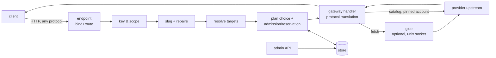

# Marineris v3: the npi switch (proxy, router, hub) — design specification

Status: revision 2.2 (2026-09-28), design only, nothing implemented. Author:
Fable (anthropic/claude-fable-5-1) via npi; the first half of revision 2
(header through §12.9) was drafted by Opus (anthropic/claude-opus-5-5) while
Fable was rate-limited and is adopted here with the amendments logged in §28.
Fable also designs the dashboard's visuals later, in a separate pass (§19.5).
Branch `feat/marineris-v3` from `origin/neopi` at `955b7b385f`. Critics:
Grok 4.7 xhigh and Astra xhigh; implementer: Opus, who owns DX (§4.7).
Shayna decides §25.

Sources, in order of authority:

1. Shayna's round-1 decisions of 2026-09-28 (answers to revision 1's
   Q1–Q8). Q2, the plan allotment, is the core feature and non-negotiable.
   §2.2 maps every decision to the section that applies it.
2. Shayna's verbatim directives of 2026-09-27 (messages A–D and the operating
   order). §2.1 maps every directive line to the section that satisfies it.
   Both notes live in a private repository and are not reproduced here.
3. Decisions already taken in the Mixture of Agents specification
   (`docs/specs/mixture-of-agents.md` §15, revision 6.8), restated in §24.
4. Marineris as it exists (the deployed 0.5, 0.6, 0.7 and the unbuilt 0.8
   design), in a private source tree. Intents were reconciled; no code is
   carried over (Shayna: "written from scratch, hosted in npi"). Citations of
   that tree name the file inside it (for example `marineris/transport.py`)
   and never a host path.
5. OmniRoute, read as untrusted reference only (§12.14, §13.6). Nothing from
   it is run, installed or copied as code.

Conventions: every path is relative to the repo root on the branch above;
`file:line` citations were read from that tree; `[INFERENCE]` marks a claim
not verified against code. RFC 2119 keywords are literal. Defined terms (§1)
are capitalized on first use per section and used with one meaning
throughout. Closed lists are marked "(closed)" and MUST NOT be extended by an
implementer without a spec revision. Example addresses are RFC 5737
documentation addresses (`192.0.2.0/24`) and example host names are generic
(`office-host`, `personal-host`); no site data appears in this document.

## 0. Summary and the invariants everything follows from

The **switch** is npi serving inference. One process (`npi switch serve`,
started only by systemd) reads a TOML configuration, binds one or more HTTP
endpoints, and forwards every request to a provider the operator declared, in
whatever protocol the provider speaks, using credentials npi already holds.
Clients authenticate with minted **Keys** whose scopes and **Allotments** the
operator edits live through an authenticated admin API (the CLI and the future
dashboard are its two clients). Every request that reaches a subscription is
pinned to one explicitly chosen **Plan**, and the choice is visible to the key
holder, the operator and the decision log. It replaces the Python Marineris
0.5–0.7. `npi auth-gateway serve` stays, unchanged for its users, beside it
(§20).

Eight invariants, each traced to a directive, a decision, or an existing
property of the code:

1. **The switch is not omniscient.** Nothing is routable unless a
   `[[provider]]` block declares it, and nothing is served unless an
   `[[endpoint]]` block connects it (`connect`, §5.4, REQUIRED, never
   defaulted). An empty configuration serves nothing. This is Shayna's ground
   rule ("the proxy does not even know what providers it has, you do") and the
   MoA decision "opt-in for everything" (`docs/specs/mixture-of-agents.md:2745-2747`).
2. **One endpoint, every provider, every protocol.** The existing gateway
   already routes chat in three wire formats plus embeddings, rerank, images,
   speech, transcription, video and judgments (`packages/ai/src/auth-gateway/server.ts:11-24`,
   route table `:814-878`). The switch mounts that handler under
   operator-declared endpoints; it adds no second translation layer.
3. **Credentials never move.** Catalog providers resolve credentials through
   `AuthStorage.keys.get` (`packages/ai/src/auth/types.ts:852`), locally
   or through the broker, whose snapshots replace every OAuth refresh token
   with `REMOTE_REFRESH_SENTINEL` (`packages/ai/src/auth/pool.ts:706`,
   `packages/ai/src/auth/types.ts:268`). Foreign providers' keys are read from
   references the operator writes (§5.12) and are never echoed.
4. **No silent plan choice.** A request that reaches a provider with declared
   Plans is pinned to exactly one Plan per upstream attempt, chosen by the
   Key's explicit plan order and gates (§12.9). Account fallback inside
   `AuthStorage` is disabled for pinned attempts (§12.3). Every attempt's plan
   is in the response headers and the decision log. This is Q2: v0.5 drained a
   $20 team plan to 99% while a $200 plan idled, and the only notice was the
   body of a last-minute 403.
5. **Fail loudly, never silently.** Every rejection names the rule, the value
   and the reset time; every approaching limit warns the key holder (headers,
   `/switch/me`) and the operator (events, notifications) before it bites
   (§16). A rule the switch cannot evaluate denies with its own code; it never
   admits by default (§12.7). Unknown configuration is an error (Q5, §5.13).
6. **Intent over form.** A request whose intent is clear is repaired, never
   rejected; every repair is named, logged, and reported in a response header
   (§8; on everywhere, Q7). A request whose repair would change what the model
   sees is rejected in the caller's own protocol.
7. **Policy in data, quirks in glue, state in the store.** Model and provider
   policy stays in KDL (`packages/catalog/src/compat/rules/`, compiled by
   `packages/catalog/scripts/compat-compiler/index.ts:42-60`); the TOML
   declares *infrastructure* (providers, endpoints, plans, virtual models);
   the **Store** (one SQLite file, §12.13) holds *live state* (keys,
   allotments, grants, usage, decisions), mutated only through the admin API
   in single transactions. Provider misbehaviour that policy cannot express is
   handled by an executable **Glue** (§10).
8. **The slug carries the dials.** `provider/model:dials` (§6): everything
   before the first `/` is the provider; a trailing `:` segment that parses as
   dials sets effort and sampling for clients that cannot set them any other
   way (Honcho). An unknown provider prefix is 404 `unknown_provider` (Q8).



## 1. Vocabulary (closed)

| Term | Meaning |
|---|---|
| **Switch** | The `npi switch serve` process and the code under `packages/ai/src/switch/` and `packages/coding-agent/src/switch/`. |
| **Config** | The TOML documents of §5, loaded from one Config Dir. Infrastructure only; no keys. |
| **Config Dir** | A directory holding `switch.toml`, optionally `providers.d/`, `glue/`, `notify/` and secret files (§5.1). |
| **Generation** | One immutable snapshot of Config + catalog + provider table + endpoint set, swapped as a unit (§4.6). |
| **Store** | The SQLite database `<state_dir>/switch.db`: keys, allotments, grants, usage buckets, attributions, meter snapshots, decisions, events, audit (§12.13). |
| **Provider** | A `[[provider]]` block: one upstream the switch may talk to, either a **catalog provider** (npi's own, credentials from `AuthStorage`) or an **http provider** (foreign base URL, operator-supplied key). |
| **Plan** | A `[[plan]]` block: one subscription or billing account of a Provider, identified by an account selector, with the Meters its provider reports (§5.7, §12.3). A Provider with at least one Plan is **planned**. |
| **Meter** | One `UsageLimit` row (`packages/ai/src/usage.ts:62-72`) of a Plan's account, identified by its window id (`5h`, `7d`, …). |
| **Window Instance** | One period of a Meter or Budget window, from its start to its reset (§12.5). |
| **Endpoint** | An `[[endpoint]]` block: one listening `bind` + `route` pair, identified by its **Endpoint Id** (§5.4). |
| **Connection** | An entry of an Endpoint's `connect` list: a Provider, a Provider/model glob, a Virtual Model, or a mixture. The set of Connections is the endpoint's publication allow-list. |
| **Glue** | An executable the switch supervises, attached to a Provider, speaking HTTP over a unix socket (§10). The **built-in glue** is the gateway's own `streamSimple` path. |
| **Virtual Model** | A `[[model]]` block: an operator-invented model id resolved to an ordered list of **Targets** by a **Strategy** (§13). |
| **Target** | One `targets` entry of a Virtual Model: a Provider model slug, another Virtual Model, or `mixture/<name>`. |
| **Key** | A Store record: a minted bearer token with a **Scope**, a **Plan List** and **Budgets** (§12.2). |
| **Plan List** | A Key's ordered list of Plans it may use, each with its **Gates** (§12.6). |
| **Gate** | A per-Key ceiling on a Plan's Meter: the Key may use the Plan while the Meter is below it (§12.6). |
| **Budget** | A per-Key cap on the Key's own consumption in one unit over one window (§12.5). A **Share** is a Budget in unit `plan_pct`. |
| **Grant** | A one-off addition to one Budget's cap, expiring at a Window Instance end or a timestamp (§12.10). |
| **Adjustment** | One live change to a Gate, Budget or Grant through the admin API, from the closed op list of §12.10. |
| **Attempt** | One call of the gateway handler for one (Target, Plan) pair; zero or one billed upstream response (§12.8). |
| **Reservation** | The estimated consumption an Attempt holds against every Budget and Gate in scope while in flight (§12.8). |
| **Principal** | The Key a request authenticated with, or the literal `anonymous` on an Endpoint with `auth = "none"`. |
| **Slug** | The client's `model` string, decomposed into provider, model id and **Dials** (§6). |
| **Dial** | One `key=value` or effort word in a Slug's trailing `:` segment. |
| **Repair** | A named, logged rewrite of a request whose intent is clear (§8, closed list). |
| **Decision** | The recorded outcome of the pipeline for one request, with its Attempts (§16.1). |
| **Event** | A persisted notification record (threshold crossed, denial, plan fallback, …) (§16.2). |
| **Well-known route** | A path in the closed table of §5.4.2. |

## 2. Traceability

### 2.1 Directives

Every line of intent in the directives note, with the section that satisfies
it. "Msg" is the message letter; operating-order items are "OO n".

| # | Directive (paraphrased) | Section |
|---|---|---|
| D1 | OO 1: MoA first; anything in npi's catalog is servable, including custom MoA models | §13.4, §24.10; MoA M1 is merged (`955b7b385f`) |
| D2 | OO 2: Fable designs the spec with full autonomy over the TOML | this document; Fable owns it through the critic loop (Opus drafted part of revision 2 while Fable was rate-limited, §28) |
| D3 | OO 2: Grok and Astra critique until "good enough"; Opus implements; critics review every milestone | §23 (milestones end with critic review), §28 |
| D4 | OO 2: decisions with no objectively right answer go to Shayna as asks | §25 |
| D5 | OO 2: create the GitHub repository if missing; every checkpoint as a PR | §3.2, §23 |
| D6 | OO 2: personal vs office versions: two branches, stable and nightly | §3.2, §21.1 (Q1) |
| D7 | OO 2: after the TOML spec and prototype, a dashboard with the same loop | §19 (data and actions contract), §19.5 (Fable hand-off), §23 M9 |
| D8 | OO 3: reconcile intents (not codebases) of the Marineris drafts and deployments | §3, §24, and the Marineris lineage notes in §7, §11, §12 |
| D9 | Msg A: sign every comment with the model slug | §21.4 |
| D10 | Msg A: a switch, like a network switch, for any kind of model request incl. STT/TTS/image | §0 invariant 2, §9 |
| D11 | Msg A: mint keys, choose who gets them and which models they see | §12.2, §17 |
| D12 | Msg A: invent virtual models (the note names examples), possibly classifier-routed, KV-cache aware | §13, §13.5 (classify, M10), §13.1 sticky |
| D13 | Msg A: xAI cross-model continuation by `previous_response_id` | §13.3 (measured before relied on), §26 |
| D14 | Msg B: npi becomes the proxy; every npi install on the LAN meshes and shares pools without handing over a refresh token | §0 invariant 3, §4.4, §9.1, §15.3 |
| D15 | Msg B: internal access to auth and refresh as the harness does it | §4.4 (AuthStorage), §12.3 (pinned resolver) |
| D16 | Msg B: per-person usage trackable natively; sharing MoAs | §12.12, §13.4 |
| D17 | Msg C: a single localhost port serving everything, all providers combined | §5.4 (`route = "/v1/*"`), §23 M1 |
| D18 | Msg C: ask for a model on a specific host (GLM on Z.ai, Kimi on OpenCode) | §6 (provider prefix), §11 |
| D19 | Msg C: every format that exists, audio, embeddings, everything OMP supports incl. Hermes portal | §9 |
| D20 | Msg C: survive bad requests when intent is clear (ground rule) | §8 |
| D21 | Msg C: TOML instead of a dashboard, editable over SSH in Vim | §5 (infrastructure stays TOML); superseded for live state by Q2 (§2.2): allotments are edited through the admin API, from the CLI over SSH or the dashboard, and keys export to and import from TOML (§17.9) |
| D22 | Msg C: not omniscient; the operator defines each provider (name, endpoint, protocol, auth kind, metadata, category: routing/direct/rehost/special) | §5.3 |
| D23 | Msg C: providers as a double-bracketed array | §5.3 (`[[provider]]`) |
| D24 | Msg C: define an endpoint: listen on a port, at a route (`/v1/chat/completions` or `/v2/hello-world`) | §5.4 |
| D25 | Msg C: identify an endpoint by a hash of port and route (an explicit id also acceptable) | §5.4.1 |
| D26 | Msg C: connect providers to an endpoint by an array of references | §5.4 (`connect`) |
| D27 | Msg C: a `serve` key pointing at an executable (Python or any) as a middleman glue layer; three-step, possibly four | §10 (`glue` on the provider; naming in §3.4), §13 (the fourth step) |
| D28 | Msg C: the glue adapts provider quirks (stale `/v1/models`, wrong context windows, missing reasoning levels) | §10, §11.4 (`[[provider.model]]` overrides for the data-only cases) |
| D29 | Msg C: glue lifetime: load once, keep in memory, hot reload when the TOML or the file changes | §10.3, §5.14 |
| D30 | Msg C: default is three routes on one port; more endpoints for per-endpoint keys, other interfaces (overlay networks, internet) | §5.4, §15.1 |
| D31 | Msg C: at least one provider block per subscription or key; combine all into one source of inference | §5.10 example, §5.7 (one `[[plan]]` per subscription), §11 |
| D32 | Msg C: Marineris 0.7 is fault tolerant in ways a standard router is not; keep that | §7 stage 10, §13.2, §8 |
| D33 | Msg D: full scope: proxy, router, switch, hub; scoped keys; plan-percentage allotment per key; virtual models; MoA | §12, §13 |
| D34 | Msg D: provider-specific configuration options exposed | §5.3 (`[provider.options]`), §11.5 |
| D35 | Msg D: convert the request to the right upstream format no matter what | §7 stage 8, §9 |
| D36 | Msg D: Honcho needs an OpenAI-compatible endpoint + embeddings model and cannot set dials | §6, §9.2 |
| D37 | Msg D: dials encoded in the slug; split at the first `/`: provider before, model after, dials after the colon; provider names may nest (`cursor/anthropic/...`) | §6 |
| D38 | Msg D: `[[model]]` array to announce models on `/v1/models`, merging discovery with manual rows | §11.4, §5.4 (`connect` globs decide announcement) |
| D39 | Msg D: keep "Marineris" as the code name for the sub-model | §3.4 (Q6) |
| D40 | Msg D: npi will merge upstream things; T3 code fork is separate | out of scope; §27 |
| D41 | Msg C/D: the deployed office instance stays working during the move | §21.3 (migration), §23 M8 |

### 2.2 Round-1 decisions

| Decision | Ruling | Applied in |
|---|---|---|
| Q1 | A `stable` branch in neopi. The in-repo Nix piece is only a generic flake/module that builds the package and exposes service options; host configurations stay private and import it. No site data in the repo. | §3.2, §21.1, §21.2, document conventions |
| Q2 | Plan allotment is the core feature: mintable keys with scopes and allotments edited live at any time; provider-style windows per key, each addable, removable, raisable, lowerable; every interpretation of "N% more"; plan selection never silently drains the wrong plan; OmniRoute as reference; a dashboard with good UX (designed by Fable). | §12 (model and algorithm), §14, §16, §17 (admin API), §19 (dashboard contract) |
| Q3 | An interactive session never starts the switch; it runs only as a systemd unit. | §3.1, §4.2, §21.2 |
| Q4 | Keep `npi auth-gateway serve` beside the switch; it is the backup path. | §3.3, §4.5, §20, §23 (every milestone keeps it green) |
| Q5 | Unknown `[provider.options]` keys are an error unless the provider has glue. | §11.5, §5.13 (E-OPTION) |
| Q6 | `npi switch`; Marineris is the code name. | §3.4, §18 |
| Q7 | Repairs on everywhere by default. | §5.2, §8 |
| Q8 | Unknown provider prefix → 404 `unknown_provider`. | §6.3 |
| Process | Fable carries the spec through the critic loop and later designs the dashboard's visuals at high effort; Opus implements and owns DX (small, readable code). | header, §4.7, §19.5 |
| Q9 (round 2) | Key requests to an unplanned provider with two or more accounts are 403 `plan_required`; loopback anonymous keeps the harness behaviour. | §12.3, §12.9 |
| Q10 (round 2) | All three share measurements are supported, chosen per Plan: `proportional` (default where nothing is declared), `declared` sizes, `tokens` shares. | §5.7, §12.5, §14.2 |
| Q11 (round 2) | A stale Meter denies that Plan and falls through to the next, **after** a staleness grant proportional to the last reading's remaining headroom, capped, fail-loud (header + Event); the request fails only when no Plan has a usable reading or a live grant. | §12.4, §12.7, §12.9, §14.4, §12.15 step 8 |
| Q12 (round 2) | Key holders learn their state from `x-npi-notice` past thresholds plus `GET /switch/me`. | §12.11, §16.3, §17.8 |

## 3. Reconciliation of the directives with each other and with the harness

### 3.1 "Fold into the harness" versus "its own process"

Both hold, at different layers:

- **Code** lives in the npi monorepo. PRs land in `PsychedelicShayna/neopi`,
  one per milestone (§23).
- **Runtime** is its own process: `npi switch serve` is a subcommand of the
  same binary, started **only** by systemd: a system unit on the office host,
  a user unit (`systemctl --user`) on a personal machine (Q3). No code path in
  the interactive harness starts, forks or embeds the switch: there is no
  slash command, no autostart, and no in-process mode. `npi switch serve`
  run by hand (development, tests) works, and logs W-UNSUPERVISED at boot
  when `INVOCATION_ID` (set by systemd for every unit it starts) is absent.
  Rationale: the office endpoint must survive every interactive session
  ending, and a bad nightly build on a laptop must not take the office down.
- **Pinned version** is a deployment property: the office host's private Nix
  configuration pins a commit on the `stable` branch through the generic
  module of §21.2. A personal machine runs the nightly branch.

### 3.2 Repository, branches, PRs

- Repository: `PsychedelicShayna/neopi` (public). Branch `neopi` is the
  nightly (personal) line. The long-lived branch `stable` (Q1) receives
  milestone merges after critic review and acceptance on a staging unit
  (D3, D6).
- Every milestone in §23 is one PR from `feat/marineris-v3-mN` into `neopi`,
  then merged into `stable` once its acceptance passed.
- The repository carries only generic deployment artifacts (§21.2): the Nix
  module, a generic systemd unit, example configurations using documentation
  addresses. Host configurations, real addresses, host names, user names,
  keys and overlay-network ids MUST NOT be committed (Q1).

### 3.3 The broker, the gateway, and the switch

- The **broker** (`packages/ai/src/auth-broker/`) is untouched. The switch is
  a broker client exactly as the gateway is today
  (`packages/coding-agent/src/cli/auth-gateway-cli.ts:248-277`), or a local
  SQLite client when no broker is configured, through `discoverAuthStorage`
  (`packages/ai/src/auth-broker/discover.ts:464-491`) which already chooses
  between the two (`:454-456` local, `:445-451` remote).
- The **gateway server** (`packages/ai/src/auth-gateway/server.ts`) is
  refactored into a handler factory (§4.5) that both `startAuthGateway` and
  the switch call. `npi auth-gateway serve` is **kept** (Q4): same flags,
  same token file, same routes, same behaviour for its users, its tests green
  at every milestone. It is the backup WAN path when the switch is down (§20).
- The **switch** owns: Config, Generations, endpoints, key auth, slugs,
  repairs, virtual models, glue supervision, plans, allotments, the Store,
  the admin API, events.

### 3.4 Names

- The subsystem is **the switch** in code and CLI (`npi switch …`,
  `packages/*/src/switch/`) (Q6). **Marineris** remains the project's code
  name and the conventional name of the office service unit (D39).
- Shayna's spoken `serve` key for the executable middleman (D27) is named
  **`glue`** in the TOML, because `gateway.serve` already means "publication
  allow-list" (MoA §4.10 item 3, decided). The endpoint's allow-list is
  `connect` (D26), the same concept as `gateway.serve` at endpoint
  granularity.
- Response headers and environment variables use the `x-npi-` / `NPI_`
  prefix. Minted tokens keep the `mrn_` prefix so existing Marineris clients
  (the office omp extension) need only a base-URL change.

## 4. Architecture

### 4.1 Nouns and ownership

```
Config Dir ─┬─ switch.toml      [switch], [admin], [[notify]], [[provider]], [[plan]], [[endpoint]], [[model]]
            ├─ providers.d/     extra [[provider]] and [[plan]] blocks, one file each
            ├─ glue/            executables referenced by provider.glue          (0755)
            ├─ notify/          executables referenced by [[notify]] kind=exec   (0755)
            └─ *.key, *.token   secret files referenced by file: refs           (0600)

State Dir ──┬─ switch.db        the Store (§12.13)                               (0600)
            ├─ admin.sock       admin API unix socket (§17.1)                    (0600)
            └─ glue/*.sock      glue sockets (§10.2)

Switch process
  ConfigLoader        read every source into one document, validate, digest (§5.13, §5.14)
  Generation          immutable: config + ProviderTable + PlanTable + EndpointSet + publication cache (§4.6)
  ProviderTable       provider id → ResolvedProvider (Model objects, credential source, glue, options)
  PlanTable           plan id → ResolvedPlan (provider, pinned account, meters) (§12.3)
  EndpointSet         one Bun.serve per distinct bind; route → Endpoint
  Store               bun:sqlite; the only writer of live state (§12.13)
  KeyIndex            token digest → Key; in-memory mirror of the Store's key tables
  Ledger              usage buckets, reservations, attributions; admission (§12.7, §12.8)
  MeterCache          plan id → Meter snapshots (§14)
  SlugParser          model string → Slug (§6)
  Repairer            request → repaired request + Repair[] (§8)
  Resolver            Slug + Principal + Endpoint → ResolvedTarget[] (§7 stage 6)
  PlanRouter          (Target, Principal) → ordered admissible Plans (§12.9)
  GlueSupervisor      provider id → running glue process + socket (§10)
  Events              persisted events + notify sinks (§16.2)
  AdminApi            authenticated live-mutation and read-model API (§17)
  GatewayHandler      createAuthGatewayHandler(...) per Endpoint (§4.5)
```

### 4.2 Process model

- `npi switch serve [--config <dir|file>]` is the only server entry point
  and is the `ExecStart` of a systemd unit (§3.1, §21.2). Default Config Dir:
  `<agentDir>/switch/` where `agentDir` is `getAgentDir()`
  (`packages/utils/src/dirs.ts:590-591`, normally `~/.omp/agent`). A file
  argument is treated as `switch.toml` and its parent as the Config Dir.
- Credentials: `discoverAuthStorage()` (`discover.ts:464-491`). With
  `auth.broker.url` configured (`packages/coding-agent/src/config/model-settings.ts:30-34`)
  the switch is a broker client; otherwise it opens the local SQLite
  credential store. The switch never writes credentials; `npi login`
  (interactive) or the broker remain the writers.
- Models: one `ModelRegistry` constructed with
  `{ ignoreLocalModelConfig: true }` exactly as the gateway does
  (`auth-gateway-cli.ts:290`), so the host's `models.yml` never leaks into a
  served catalog. The switch reads catalog providers from it and **never
  calls `registerProvider`/`unregisterProvider`** on it: those mutate
  registry-wide state and reload static models underneath concurrent
  readers (`packages/coding-agent/src/config/model-registry.ts:2942-2956`,
  `:2980-3056`). Http-provider models are built as plain `Model` objects
  owned by a Generation (§11.2).
- Catalog rebuilds follow the gateway's schedule: initial, every 15 minutes,
  and a forced rebuild whenever `storage.credentials.poll()` reports a change
  (`auth-gateway-cli.ts:335-361`), serialized by `createSerializedRebuilder`
  (`:222-245`). Each completed rebuild produces a new Generation (§4.6) the
  way the gateway swaps its `modelById` map today (`:300-311`).
- The Store is opened by the serving process only. Every other process (the
  CLI, the dashboard) reaches live state through the admin API (§17).
- Shutdown: SIGINT/SIGTERM close every listener, drain in-flight requests
  (bounded by `[switch].drain_ms`), release their Reservations, stop glue
  processes, checkpoint and close the Store, close storage; the gateway
  handler's `close()` drains provider session state (`server.ts:904-910`).

### 4.3 Module layout (target)

```
packages/ai/src/switch/
  config/
    types.ts        SwitchConfig and block types (§5.11)
    parse.ts        Bun.TOML.parse → typed document; snake_case → camelCase; secret refs (§5.12)
    validate.ts     rules E-*/W-* (§5.13); endpoint id hashing (§5.4.1)
    watch.ts        fs.watch on the Config Dir → reload request (§5.14)
  generation.ts     build + swap + refcount of Generations (§4.6)
  slug.ts           parseSlug / formatSlug (§6)
  repairs.ts        Repair ids, detect + apply (§8)
  store.ts          bun:sqlite schema, migrations, typed statements (§12.13)
  keys.ts           KeyIndex, lookup (constant-time), scope checks (§12.2)
  plans.ts          PlanTable resolution, pinned credential resolver (§12.3)
  meters.ts         MeterCache + attribution (§14)
  allot.ts          Budgets, Gates, Grants, admission, reservations, charging (§12.5–§12.8)
  adjust.ts         Adjustment ops and the "N% more" reading table (§12.10)
  router.ts         PlanRouter (§12.9)
  glue/
    supervisor.ts   spawn, readiness, restart, drain-and-replace (§10.3)
    fetch.ts        fetch over the unix socket; header contract (§10.2)
  virtual.ts        strategy evaluation, health, failover set (§13)
  providers.ts      http-provider rows → `Model` objects via `buildModel` (§11.2); discovery merge (§11.4)
  jobs.ts           sealed asynchronous job ids (video) bound to principal and plan (§15.4)
  pipeline.ts       the ordered stages of §7 as one function
  events.ts         Events + notify sinks (§16.2)
  admin.ts          admin API routes and read models (§17, §19)
packages/ai/src/auth-gateway/
  server.ts         createAuthGatewayHandler (new), startAuthGateway (thin wrapper) (§4.5)
  dispatch.ts       resolveDispatch / resolveDispatchCredential helpers (§4.5)
packages/ai/src/auth/
  cascade.ts        `KeysApi.getPinned(credentialId, …)`: resolve one stored row, no cascade (§12.3)
  usage.ts          `credentialId` option on `ingestHeaders` (§14.3)
  types.ts          the two signatures above and `credentialIds` on CheckCredentialsOptions (§15.7); the only changes outside auth-gateway/
packages/coding-agent/src/switch/
  catalog.ts        catalog providers → registry views; the `countTokens` callback (§8 R-COUNT-TOKENS) (§11.1)
  serve.ts          boot: storage, registry, store, config, endpoints, timers (§4.2)
packages/coding-agent/src/cli/switch-cli.ts   `npi switch …` (§18), an admin API client
packages/coding-agent/src/commands/switch.ts  command registration (precedent: commands/auth-gateway.ts)
nix/switch-module.nix                         generic NixOS + user-unit module (§21.2)
```

`packages/ai` holds everything that does not need the `ModelRegistry`
(inverse-dependency rule stated at `dispatch.ts:26-30`); `packages/coding-agent`
holds registry wiring and the CLI, mirroring `auth-gateway-cli.ts`.

### 4.4 What is reused, verbatim

| Need | Existing code | Citation |
|---|---|---|
| Chat in three wire formats, translated through pi-ai | `FORMAT_ROUTES`, `handleFormatEndpoint` | `server.ts:79-83`, `:249-478` |
| Native pi stream | `handlePiNative` | `server.ts:494-687` |
| Embeddings, rerank, images, speech, transcriptions, video, judgments | `routes/*.ts` | `server.ts:61-67`, e.g. `routes/embeddings.ts:16-98` |
| Option mapping from wire to `SimpleStreamOptions`, Codex sampling strip | `buildStreamOptions` | `server.ts:135-223` |
| Conversation-stable session id for prompt caching and sticky accounts | `deriveSessionId` | `server.ts:114-133` |
| Credential per request, mid-stream 401 refresh, account rotation | `resolveGatewayApiKey`, `buildGatewayApiKeyResolver` | `dispatch.ts:86-107`, `:196-237` |
| Account choice: sticky session, usage ranking, `accountIds` from `Model.accountAccess` | `CredentialSelector.resolveOAuth`, `modelKeyOptions` | `packages/ai/src/auth/select.ts:499-833`, `dispatch.ts:176-179` |
| Per-client usage ledger | `recordGatewayUsage`, `ClientUsageIdentity`, SQLite `client_usage` | `dispatch.ts:246-262`, `packages/ai/src/usage.ts:243-247`, `packages/ai/src/auth/sqlite-credential-store.ts:604` |
| Plan meters | `UsageLimit`/`UsageReport`, `storage.usage.reports` | `usage.ts:62-72,139-154`, `server.ts:695-702` |
| Provider session state (strict-tools, transports) | `AuthGatewaySessionStateStore` | `server.ts:359-365`, `session-state.ts` |
| Constant-time bearer compare | `timingSafeEqual` | `http.ts:65-78` |
| Passthrough header allow-list | `captureRequestHeaders` | `http.ts:104-142` |
| Non-chat kinds and their routes | `KIND_ROUTES`, `chatRouteRejection`, `MODEL_KINDS` | `server.ts:230-245`, `packages/catalog/src/types.ts:28-41` |
| Effort ladder and clamping | `Effort`, `THINKING_EFFORTS`, `clampThinkingLevelForModel` | `packages/catalog/src/effort.ts:2-18`, `packages/catalog/src/model-thinking.ts:35-65` |
| Foreign OpenAI/Anthropic-compatible upstreams | `Model.baseUrl`, `Model.headers`, `registerProvider` | `types.ts:1246`, `:1313`, `model-registry.ts:2980` |
| Custom stream functions (glue-in-process, tests) | `registerCustomApi`, dispatch order | `packages/ai/src/api-registry.ts:73-85`, `packages/ai/src/stream.ts:1716-1721` |
| Keyless providers (mixtures) | `allowsMissingApiKey` path | `stream.ts:1732-1738`, `packages/ai/src/registry/types.ts:61-94` |
| Mixtures as models | `MIXTURE_PROVIDER`, `registerMixtureApi`, `MixtureCatalog` | `packages/coding-agent/src/moa/provider.ts:18-24,64-67,72-113` |
| Bind parsing | `parseBind` | `packages/ai/src/utils/parse-bind.ts:38-56` |
| TOML parsing | `Bun.TOML.parse` | precedent `packages/coding-agent/src/moa/config.ts:412` |
| Unix-socket HTTP client and server | Bun `fetch(url, { unix })`, `Bun.serve({ unix })` | `node_modules/bun-types/globals.d.ts:2031`, `serve.d.ts:885` |
| Hard account selector type and matcher | `AuthAccountSelector`, `matchesAuthAccountSelector` | `packages/ai/src/auth/types.ts:49-55`, `packages/ai/src/auth/policy.ts:13-20` |
| Plan meter windows and fractions | `UsageWindow`, `UsageAmount`, `UsageScope.accountId`, `resolveUsedFraction` | `usage.ts:14-59`, `:161` |
| Meter reads and header ingest | `UsageApi.reports`, `UsageApi.ingestHeaders` | `packages/ai/src/auth/types.ts:1065-1076` |
| Cost of a `Usage` at list price (estimates, weights) | `calculateCost` | `packages/catalog/src/models.ts:155` |
| Http-provider `Model` objects without registry mutation | `buildModel(spec)` (spreads the spec, so `kind`, `requestModelId`, `baseUrl`, `cost`, `thinking` survive) | `packages/catalog/src/build.ts:303-325`, `ModelSpec` `packages/catalog/src/types.ts:1426-1439` |
| Socket peer address | Bun `Server.requestIP(req)` | `node_modules/bun-types/serve.d.ts:1137` |
| Embedded transactional store | `bun:sqlite` `Database`, WAL, `db.transaction` | precedent `packages/ai/src/auth/sqlite-credential-store.ts:7`, `:570`, `:979` |
| Stable job id codec (video) | `encodeGatewayJobId`, `decodeGatewayJobId` | `packages/ai/src/providers/video-server.ts:225-240` |

### 4.5 The gateway handler factory (the one refactor the switch needs)

`startAuthGateway` (`server.ts:770-912`) binds `Bun.serve` and routes by
`pathname` inside its `fetch`. The switch needs the routing and the handlers
without the socket, with per-request authorization, resolution, credentials
and transport supplied by the switch. Change:

```ts
// packages/ai/src/auth-gateway/server.ts
export interface GatewayRequestContext {
  req: Request;                       // the switch passes a re-materialized Request (§7 stage 4); its body is unread
  peer: string;                       // supplied by the caller. The switch passes the normalized socket peer (§15.1);
                                      //   startAuthGateway passes resolvePeer(req) as today (log-only there)
  pathname: string;
  route: GatewayRouteKind;            // (closed) "openai-chat" | "openai-responses" | "anthropic-messages" | "pi-native"
                                      //   | "embeddings" | "rerank" | "images" | "images-edits" | "speech"
                                      //   | "transcriptions" | "video" | "video-poll" | "video-content"
                                      //   | "systemone" | "models" | "usage" | "credentials-check" | "healthz" | "me"
  modelId?: string;                   // the route's model field (§7 stage 4 table), read by the route's own parser
}
export type GatewayCredential =
  | { mode: "explicit"; apiKey: ApiKey; account: string }   // string or ApiKeyResolver (packages/ai/src/types.ts:682):
                                      //   the switch's pinned resolver for planned providers (§12.3), its pool pick
                                      //   for http providers (§11.3); `account` labels session-state leases
  | { mode: "keyless"; account: "keyless" };                // allowsMissingApiKey providers (mixtures): no storage
                                      //   lookup, no apiKey (MoA §4.10 item 1, stream.ts:1732-1738)
export interface GatewayDecision {
  model: Model<Api>;
  requestedId: string;                // echoed to the client (encodeResponse/encodeStream already take it)
  credential?: GatewayCredential;     // present → the route MUST NOT call resolveGatewayApiKey/buildGatewayApiKeyResolver;
                                      //   absent → today's broker-backed path (unplanned catalog providers)
  fetch?: FetchImpl;                  // present → replaces bootOpts.fetch for this call on every route (glue, egress)
  decodeWith?: AuthGatewayFormatModule;   // chat routes only: parse the body with this module instead of the
                                      //   route's own (R-WRONG-ROUTE, §8); the route's module still encodes
  prepare?: (opts: SimpleStreamOptions) => SimpleStreamOptions;   // dials, key policy on the final options (§6.2),
                                      //   timeouts, loopGuard (MoA §4.10 item 2); chat + pi-native only
  sessionNamespace?: string;          // present → prefixed onto every session/cache/state identity (§15.4)
  staged?: boolean;                   // present → a route returns GatewayFailover instead of a Response when the
                                      //   upstream fails before the commit point (§7 stage 10)
  identity?: ClientUsageIdentity;     // replaces resolveClientIdentity(req.headers) when present
  settle?: (s: GatewaySettlement) => void;   // exactly once per handler call (= one Attempt, §12.8)
}
export type GatewayDeny = { status: number; type: string; message: string };
export interface GatewayFailover { failover: true; cause: FailoverCause; status: number; error: string }
export interface GatewaySettlement {
  requestId: string; status: number; stopReason?: string; usage?: Usage; costUsd?: number;
  provider: string; model: string; elapsedMs: number; error?: string; cause?: FailoverCause;
  upstreamCalled: boolean;            // false when the call ended before any upstream request (credential, parse)
  committed: boolean;                 // whether any byte reached the client
  sessionId: string;                  // the namespaced session id the credential and lease were resolved with
  account: string;                    // the lease account label (GatewayCredential.account or the resolved one)
  upstreamHeaders?: Record<string, string>;   // the upstream response headers of this call, from pi-ai's onResponse
                                      //   hook (types.ts:556-574) or the route runner; for §14.3 ingestion
}
export interface GatewayJobBinder {   // asynchronous job ids (video, §15.4); default = today's codec + a billed-once set
  seal(identity: GatewayJobIdentity, ctx: GatewayRequestContext): string;
  open(id: string, ctx: GatewayRequestContext): GatewayJobIdentity | GatewayDeny;
  markBilled(id: string): boolean;    // true exactly once per job id
  urlPrefix(ctx: GatewayRequestContext): string;   // where follow-up URLs point (`<endpoint prefix>/videos`)
}
export interface AuthGatewayHandlerOptions extends AuthGatewayBootOptions {
  /** Present → replaces `resolveModel` for every route that resolves a model. */
  decide?: (ctx: GatewayRequestContext) => Promise<GatewayDecision | GatewayDeny>;
  /** Present → replaces `isAuthorized(req, tokens)`. */
  authorize?: (ctx: GatewayRequestContext) => GatewayDeny | undefined;
  /** Per-principal catalog for `GET /v1/models`; falls back to `listModels`. */
  listModelsFor?: (ctx: GatewayRequestContext) => Iterable<Model<Api>>;
  /** Default: today's stateless codec plus an in-memory billed-once set (bounded, 10 000 ids). */
  jobs?: GatewayJobBinder;
  /** Local token count for `count_tokens` (§8 R-COUNT-TOKENS); absent → the route is 501. */
  countTokens?: (context: Context) => number;
  /** Default `true` (today's wildcard CORS, http.ts:222-255). */
  cors?: boolean;
}
export function createAuthGatewayHandler(opts: AuthGatewayHandlerOptions): {
  fetch: (req: Request, peer: string) => Promise<Response | GatewayFailover>;
  close: () => void;                  // drains the session-state store
};
export function startAuthGateway(opts: AuthGatewayBootOptions): AuthGatewayServerHandle;
  // unchanged signature and behaviour: Bun.serve + createAuthGatewayHandler(opts).fetch(req, resolvePeer(req))
```

Mechanics:

- `dispatch.ts` gains `resolveDispatch(bootOpts, ctx): Promise<GatewayDecision | GatewayDeny>`
  which calls `opts.decide` when present and otherwise wraps
  `opts.resolveModel(ctx.modelId)` in a decision. Every `bootOpts.resolveModel(...)`
  call site is replaced by it: `server.ts:281` (format routes), `:524`
  (pi-native), `routes/embeddings.ts:38`, `routes/images.ts:57`,
  `routes/rerank.ts:34`, `routes/speech.ts:39`, `routes/systemone.ts:53`,
  `routes/transcriptions.ts:38`, `routes/video.ts:132` (submit) and `:43`
  (poll/content, through `jobs.open`). `ctx.modelId` is whatever the route's
  own parser produces: top-level `model` for the format routes
  (`server.ts:273-276`), `parsed.modelId` from `piNative.parseRequest` for
  pi-native (`:515-524`), and the parsed model of each `routes/*` request
  (`routes/embeddings.ts:27-38`).
- `dispatch.ts` gains `resolveDispatchCredential(bootOpts, decision, model, sessionId, signal, peer, onResolvedKey)`:
  `decision.credential.mode = "explicit"` → returned untouched;
  `mode = "keyless"` → no storage lookup, no `apiKey` on the options, lease
  account `"keyless"` (MoA §4.10 item 1; `streamSimpleRequest` already
  dispatches such providers without a key, `stream.ts:1732-1738`); absent →
  today's `resolveGatewayApiKey` + `buildGatewayApiKeyResolver`
  (`dispatch.ts:86-107`, `:196-237`). Every route calls it **where it calls
  `resolveGatewayApiKey` today**, which on every route precedes option
  assembly: `server.ts:347`, `:540`, `routes/embeddings.ts:52`,
  `routes/images.ts:78`, `routes/rerank.ts:42`, `routes/speech.ts:58`,
  `routes/systemone.ts:70`, `routes/transcriptions.ts:52`,
  `routes/video.ts:59` and `:142`. Without this an http provider would 401
  at `dispatch.ts:101-106` before any hook ran, and a planned provider would
  get an unpinned account. Where the secret is encoded on the wire is fixed
  per auth scheme (§11.2) and no later assembly step touches
  `authorization` again: `buildStreamOptions` never sets it
  (`server.ts:135-223`), and the passthrough allow-list does not contain it
  (`http.ts:104-125`).
- `decision.decodeWith` splits the one `route.module` that today both parses
  and encodes (`server.ts:249-255`, `:297`, `:411`, `:454`) into a decoder
  and an encoder for the format routes: `parseRequest` runs on
  `decodeWith ?? route.module`; `encodeResponse`, `encodeStream` and
  `formatError` always run on `route.module`. The other routes have one wire
  format each and ignore the field.
- `decision.fetch ?? bootOpts.fetch` is what every route passes as the
  transport: `server.ts:352`, `:566`, `routes/embeddings.ts:79`,
  `routes/images.ts:103`, `routes/rerank.ts:67`, `routes/speech.ts:83`,
  `routes/systemone.ts:88`, `routes/transcriptions.ts:79`,
  `routes/video.ts:76` and `:165`. This is how glue (§10) and egress
  pinning (§15.5) reach the non-chat runners, which have no
  `SimpleStreamOptions` and therefore no `prepare`.
- **Transports that ignore `fetch`.** pi-ai documents that Bedrock's AWS SDK
  transport and Cursor's HTTP/2 channel silently ignore the override
  (`packages/ai/src/types.ts:622-629`). A `decision.fetch` therefore cannot
  wrap every API. The switch attaches glue or an egress wrapper only to
  models whose `api` is in the closed set `FETCH_APIS` =
  `openai-completions`, `openai-responses`, `openai-codex-responses`,
  `anthropic-messages`, `openai-embeddings`, `openrouter-rerank`,
  `openai-images`, `openai-speech`, `openai-transcriptions`, `openrouter-video`
  (members of `KnownApi`/`RUNNER_APIS`, `packages/catalog/src/types.ts:9-25`,
  `:48-62`). A provider with `glue` whose models' `api` falls outside the set
  is E-GLUE-TRANSPORT at load (catalog providers: at every Generation build).
  Each member of `FETCH_APIS` has a contract test proving a fake `fetch`
  observes its upstream call (§22); a member without one MUST be removed.
  Codex with `preferWebsockets` is forced to HTTP when glue is attached
  (`[INFERENCE]` that the WebSocket path bypasses `fetch`; the M6 test decides).
- `decision.prepare` is applied after `buildStreamOptions` (`server.ts:351`)
  and after the pi-native handler's own options assembly (`:559-592`); it
  is MoA §4.10 item 2's `prepareStreamOptions`, generalized. It carries only
  option fields (dials, the Key's policy over the merged options, timeouts,
  `loopGuard`, `conversationKey`); it MUST NOT carry credentials or
  transport, which have their own fields above. It runs on the **final**
  options, after the body's own controls have become options
  (`server.ts:143-198`; native options are accepted at
  `providers/pi-native-server.ts:48-90`), which is what lets §6.2 enforce
  `effort_max`/`allow` whether the client asked through the slug, the body,
  an Anthropic budget or a native option.
- `decision.sessionNamespace` is applied by one helper,
  `namespaceSession(ns, parsed)`, at the two points where the handlers
  finalize a session identity, **before** the credential and the session-state
  lease consume it: immediately after `server.ts:339-341` (format routes:
  `clientKey`, `sessionId`, `parsed.options.promptCacheKey`) and after
  `:536-538` (pi-native: `clientKey`, `sessionId`, `parsed.options.sessionId`
  **and `parsed.options.promptCacheKey`**, which the native parser accepts
  independently, `providers/pi-native-server.ts:65-66`, and which
  OpenAI-family transports prefer over `sessionId`). The sources it covers
  are exactly those `resolvePromptCacheKey` enumerates (`http.ts:211`: body
  `prompt_cache_key`, `metadata.{prompt_cache_key,session_id,conversation_id}`,
  then the five headers) plus the two native options; the helper namespaces
  the *resolved* value, so a source added to the gateway later is covered as
  long as it flows through the same two points. `deriveSessionId`'s derived
  UUID is namespaced too (it is keyed by model + system + tools + first
  message, `server.ts:114-133`, and two tenants can send identical
  prefixes). Non-chat routes derive their session ids deterministically from
  the model (`routes/video.ts:58` is the pattern) and are namespaced the
  same way.
- **Outgoing identities are namespaced once more after every merge.** The
  captured passthrough headers `session_id`, `conversation_id`,
  `x-session-id`, `x-conversation-id`, `x-prompt-cache-key`
  (`http.ts:104-125`) are merged under the parser's own values on the
  format routes (`server.ts:307-310`) and **under native `options.headers`**
  on pi-native (`:590-591`), so a tenant's native headers can re-introduce
  an un-namespaced identity after the captured set was namespaced. Therefore
  a second helper, `namespaceOutgoing(ns, streamOpts)`, runs on the final
  `SimpleStreamOptions` immediately before dispatch (after `prepare`): it
  prefixes `streamOpts.sessionId`, `streamOpts.promptCacheKey` and each of
  the five header spellings in `streamOpts.headers` with the namespace when
  the value does not already carry it, and deletes `chatgpt-account-id`
  (§15.4). The prefix is idempotent (`<ns>:` is never applied twice), so a
  value namespaced at the first point passes through unchanged.
- `decision.identity` replaces the `resolveClientIdentity(req.headers)` calls
  (`server.ts:287`, `:530`, `routes/embeddings.ts:50` and the same line of
  every `routes/*` module, `routes/video.ts:110`) so usage lands in the
  ledger under the Key (§12.12).
- `decision.staged` changes the streaming path. Today `encodeStream` is
  wrapped in a 200 `Response` immediately (`server.ts:454-474`), before any
  upstream event exists, and the chat encoder writes a synthetic
  assistant-role chunk before it consumes the first upstream event
  (`providers/openai-chat-server.ts:592-593`), so an upstream 429 becomes an
  SSE error frame on an already-committed response and nothing can fail
  over. With `staged`, the handler does not construct the encoder until the
  **commit point** (§7 stage 10) has passed on the
  `AssistantMessageEventStream`: it consumes events into a bounded buffer
  (`start`, `thinking_*`, `toolcall_start` are not commit events; the first
  `text_delta`, `thinking_delta`, `toolcall_delta` or `done` is). Two
  bounds, with different outcomes: **time**, the Attempt's
  `streamFirstEventTimeoutMs` (which pi-ai already enforces, `types.ts:594`),
  whose expiry before a commit event **fails** the Attempt with cause
  `timeout` and returns `GatewayFailover` (a target that never says anything
  useful is the case failover exists for); **size**, 64 KiB of buffered
  non-commit events (thinking summaries), whose overflow **commits** (the
  upstream is clearly answering; buffering more would only delay the
  client). A failure before the commit point returns
  `GatewayFailover { cause }` with the cause classified from the error, not
  from an HTTP status (`classifyGatewayError`, `packages/ai/src/error/gateway.ts:23`,
  plus the usage-limit predicates, `packages/ai/src/error/rate-limit.ts:358`).
  After the commit point the encoder is created, the buffered events are
  replayed into it, and the live stream follows; the `Response` is returned
  then, with the headers of §16.3 already known (all of them are known at
  Attempt start except cost, which streaming never had, `http.ts:25-33`).
  Backpressure and client cancellation are unchanged: the client's abort
  still mirrors into the Attempt's signal (`server.ts:456-461`).
  Non-streaming requests already settle before responding
  (`completeSimple`, `:391-408`) and return `GatewayFailover` on a
  failover-class error when staged.
- **Two abort signals, not one.** The encoder's `control.signal`
  (`server.ts:454-461`) is the *client-output* cancellation: when it fires
  the encoder sets `cancelled` and stops writing (`openai-chat-server.ts:588-591`,
  `:730`), which is right for a client that went away and wrong for a drain
  or timeout, where the client is still listening and owed a terminal
  frame. So the handler builds `upstreamSignal = AbortSignal.any([clientSignal, decision.abort])`
  for pi-ai's `opts.signal` and keeps `clientSignal` alone for the encoder;
  `decision.abort` is the switch's per-Attempt controller (drain §4.6,
  shutdown). When `decision.abort` fires after the commit point, the handler
  does not touch the encoder's signal: it pushes one terminal
  `{ type: "error", reason: "aborted", error: { …, errorMessage: "draining" } }`
  event into the pass-through stream the encoder reads (the staged handler
  already owns that stream, since it replays the buffer through it), so each
  format module's own `error` case writes its protocol's error frame and
  closes: chat completions writes `{ error: { message, type: "upstream_error" } }`
  then closes (`openai-chat-server.ts:709-713`); the Responses and Messages
  encoders write their own error events (`openai-responses-server.ts`,
  `anthropic-messages-server.ts`; the exact frames are asserted by the M1
  test, §22); pi-native forwards the event itself. The upstream call is
  aborted through `upstreamSignal` at the same moment. Exactly one error
  frame, then EOF, then one settlement.
- `decision.settle` is called exactly once per handler call, from the places
  `recordGatewayUsage` is called today (`server.ts:392`, `:448`, `:608`,
  `:660`, `routes/embeddings.ts:82` and siblings) and from every error and
  failover return, with `committed = true` once the `Response` has been
  returned. One handler call is one Attempt (§12.8): the switch calls the
  handler once per (Target, Plan) and therefore sees every billed upstream
  response.
- `jobs` replaces the direct `encodeGatewayJobId`/`decodeGatewayJobId` calls
  (`routes/video.ts:38`, `:168-172`) and the fixed `/v1/videos` follow-up
  URLs (`providers/video-server.ts:242-245`, replaced by `jobs.urlPrefix`);
  `recordCompletedUsage` (`routes/video.ts:98-112`) observes cost only when
  `jobs.markBilled(id)` returns true. Today every completed poll observes the
  job's cost again; the default binder fixes that for gateway users with no
  interface change. The switch's binder (§15.4) seals principal and Plan into
  the id and re-uses the submitting Attempt's credential on poll.
- Tests in `packages/ai/test/auth-gateway-*.test.ts` keep passing because
  `startAuthGateway` keeps its signature, peer source and behaviour.

This refactor is M1 scope. Outside `auth-gateway/` the harness changes are
exactly three, all at M5 and all in `packages/ai/src/auth/`: `getPinned` on
`KeysApi` (§12.3), `credentialId` on `ingestHeaders` (§14.3) and
`credentialIds` on `CheckCredentialsOptions` (§15.7). MoA M6 (gateway
publication gate, headless host) builds on the same factory; its
`gateway.serve` setting applies to `npi auth-gateway serve`, while the
switch uses `connect`.

### 4.6 Generations

A **Generation** is the unit of configuration change:

```ts
// packages/ai/src/switch/generation.ts
export interface Generation {
  id: string;                         // `${configDigest.slice(0, 12)}.${catalogEpoch}`
  config: SwitchConfig;               // §5.11, frozen
  providers: ReadonlyMap<string, ResolvedProvider>;   // Model objects, never shared with the registry's mutation path
  plans: ReadonlyMap<string, ResolvedPlan>;           // §12.3
  endpoints: EndpointSet;
  published: Map<string, PublishedSet>;               // cache keyed by `${endpointId}\n${principal}`; per Generation
  refs: number;                       // in-flight requests holding this Generation
}
```

Rules (closed):

1. A Generation is built completely (every source read, validated, provider
   table and plan table resolved) before it becomes current. A failed build
   changes nothing and records `config_rejected` (§16.2).
2. `current` is replaced by one reference assignment. Stage 1 of every
   request captures `current`, increments `refs`, and uses that Generation
   for every later stage and every Attempt of the request; settlement
   decrements `refs`.
3. A superseded Generation's own resources (listeners it alone binds, glue
   processes it alone uses) are closed when `refs` reaches 0 or after
   `drain_ms`, whichever is first. A request still holding it after
   `drain_ms` is **drained**, and every one of its Attempts settles exactly
   once (§12.8 step 7): an Attempt that has not passed its commit point
   (§7 stage 10) is aborted and answered 503 `draining`, settled with
   `cause: "draining"` and unbilled unless the upstream already reported
   usage; an Attempt whose stream is committed cannot change its status,
   so its upstream call is aborted, the client's stream ends with the
   protocol's error frame `draining` (the same path a client disconnect
   takes, `server.ts:456-461`), and it settles as billed with the usage the
   upstream reported, or with its Estimate when the abort preceded any usage
   event (§12.8 step 3), so the Plan and the key's Budgets always see the
   charge. No abort path skips `settle`.
4. Two triggers build Generations: a Config change (§5.14) and a completed
   catalog rebuild (§4.2). A catalog rebuild reuses the current `config` and
   bumps `catalogEpoch`.
5. Live state (keys, allotments, grants, usage) is not part of a
   Generation. It lives in the Store and changes by admin transaction (§17.3);
   an Attempt reads it at admission (§12.7).

### 4.7 Size budget and reuse discipline (DX)

The switch MUST stay small enough to read in a sitting. Targets, excluding
tests: config ≈ 700 lines, generation + pipeline ≈ 500, keys + plans +
allot + adjust + router ≈ 1 100, meters ≈ 300, store ≈ 400, admin ≈ 600,
glue ≈ 300, virtual ≈ 250, CLI ≈ 450, gateway refactor ≈ 300: about 5 000
lines in total. A module more than 25% over its target explains why in its
PR. No npm dependency is added (§27); new code reuses the workspace pieces of
§4.4 rather than re-implementing them.

## 5. Configuration (TOML)

### 5.1 Location, discovery, layering

- The Config Dir is `--config` if given, else `$NPI_SWITCH_CONFIG`, else
  `<agentDir>/switch/`. Exactly one Config Dir is read; there is no
  user/project layering (a server has no project).
- `switch.toml` is REQUIRED. Every `providers.d/*.toml` is parsed as a
  document that MAY contain only `[[provider]]` and `[[plan]]` blocks,
  appended to `switch.toml`'s lists in file-name order; a duplicate id across
  files is E-DUP-PROVIDER / E-DUP-PLAN.
- Files are parsed with `Bun.TOML.parse` (precedent `moa/config.ts:412`).
  TOML keys are `snake_case` (MoA decision §15.13); TypeScript types are
  camelCase; the loader maps between them.
- The switch never writes any file in the Config Dir. Keys are not
  configuration: they live in the Store (§12.13) and are managed through the
  admin API (§17). A TOML export/import of keys exists for review and bulk
  edits over SSH (§17.9); the exported file is never read at boot.
- Every table and key not defined in this section is E-UNKNOWN-KEY (Q5's
  fail-loud rule applied to the whole document), except inside
  `[provider.options]` of a provider with glue (§11.5).

### 5.2 `[switch]`

```toml
[switch]
name            = "office"                # instance label in logs and /healthz; default = system hostname
state_dir       = "/var/lib/npi-switch"   # Store, sockets; default = $STATE_DIRECTORY (systemd) else <config dir>/state
drain_ms        = 20000                   # shutdown / reload drain budget
meters_ttl_s    = 60                      # background meter refresh (§14)
meters_min_s    = 10                      # minimum spacing of attempt-triggered refreshes per plan (§14)
repairs         = "on"                    # default for endpoints: "on" | "log-only" | "off" (closed); "on" per Q7
timezone        = "UTC"                   # IANA zone for calendar windows (§12.5)
max_attempts    = 4                       # upstream Attempts per request across targets and plans (§7 stage 10)
warn_at         = [80, 95]                # default warning thresholds, percent of a limit (§12.11)
decision_days   = 30                      # Decision and Attempt retention in the Store
```

### 5.3 `[[provider]]`

```toml
[[provider]]
id        = "anthropic"                   # REQUIRED. ^[a-z0-9][a-z0-9._-]{0,63}$ ; the slug prefix
kind      = "catalog"                     # (closed) "catalog" | "http". Default: "catalog" when `catalog` is set or id is a catalog id, else "http"
catalog   = "anthropic"                   # kind=catalog: the npi provider id (KDL `provider "…"`); default = id
name      = "Anthropic (Claude Max)"      # display; default = id
category  = "direct"                      # (closed) "direct" | "router" | "rehost" | "special"; metadata only
enabled   = true
protocol  = "anthropic-messages"          # kind=http REQUIRED: (closed) "openai-chat" | "openai-responses" | "anthropic-messages"
base_url  = "https://api.z.ai/api/coding/paas/v4"   # kind=http REQUIRED; catalog: OPTIONAL override of the catalog base URL
auth      = { scheme = "bearer", key = "file:zai.key" }
                                          # kind=http REQUIRED. scheme (closed): "bearer" | "header" | "query" | "none"
                                          #   header: `header = "x-api-key"`; query: `param = "key"`
                                          #   key: a secret reference (§5.12) or an inline literal (W-INLINE-SECRET)
keys      = ["file:a.key", "file:b.key"]  # kind=http OPTIONAL pool of credentials (§11.3); exclusive with auth.key
pool      = { strategy = "ordered", cooldown_s = 60 }   # strategy (closed): "ordered" | "round-robin" | "least-used"
headers   = { "User-Agent" = "npi-switch" }   # added to every upstream request (kind=http)
discovery = "catalog"                     # (closed) "catalog" | "models" | "static" | "glue"
                                          #   catalog: npi's registry (default for kind=catalog)
                                          #   models:  GET <base_url>/models, OpenAI list shape (default for kind=http)
                                          #   static:  only [[provider.model]] rows
                                          #   glue:    GET /models on the glue socket (§10.2)
egress    = ["api.z.ai"]                  # host allow-list for upstream connections; default = [host of base_url]
glue      = "glue/zai.py"                 # OPTIONAL executable, relative to the Config Dir (§10)
glue_ready_ms = 5000                      # readiness budget for the glue process
timeouts  = { first_event_ms = 120000, idle_ms = 120000 }   # map to streamFirstEventTimeoutMs / streamIdleTimeoutMs (types.ts:594,603)

[provider.options]                        # provider-specific options (§11.5); unknown keys are E-OPTION unless `glue` is set
betas = ["interleaved-thinking-2025-05-14"]

[provider.protocols]                      # kind=http OPTIONAL per-kind protocol map (§9.2)
embedding = "openai-embeddings"
stt       = "openai-transcriptions"

[[provider.model]]                        # declarations and overrides (§11.4)
id             = "glm-5.3"                # the id clients use after the provider prefix
upstream_id    = "glm-5.3-coding"         # id sent upstream; default = id
kind           = "chat"                   # (closed) MODEL_KINDS, packages/catalog/src/types.ts:28-39
name           = "GLM 5.3"
context_window = 200000
max_output     = 32768
reasoning      = true
efforts        = ["low", "medium", "high"]         # ordered; sets thinking.efforts
effort_map     = { high = "high" }                 # effort → wire value
input          = ["text", "image"]
supports_tools = true
cost           = { input = 0.6, output = 2.2 }     # USD per million tokens; OPTIONAL; feeds usd Budgets (§12.5)
hidden         = false                    # true: routable when named explicitly, never announced
aliases        = ["glm"]                  # extra ids that resolve to this row (within this provider)
```

Semantics:

- **catalog providers** take their model list, auth flow, and quirks from npi.
  Their `[[provider.model]]` rows are *overrides* merged over the registry's
  rows by `id` (§11.4); a row whose `id` is unknown to the registry is an
  *addition* and requires `upstream_id`, `kind`, `context_window`,
  `max_output` (E-MODEL-INCOMPLETE otherwise).
- **http providers** are materialized as Generation-owned `Model` objects
  (§11.2) with `api` derived from `protocol`:
  `openai-chat → "openai-completions"`, `openai-responses → "openai-responses"`,
  `anthropic-messages → "anthropic-messages"` (`KnownApi`,
  `packages/catalog/src/types.ts:9-25`), and per-kind APIs from
  `[provider.protocols]`. That map's value set is the switch's own closed
  subset of `RUNNER_APIS` (`packages/catalog/src/types.ts:48-62`), one
  OpenAI-compatible transport per kind: `openai-embeddings`,
  `openrouter-rerank`, `openai-images`, `openai-speech`,
  `openai-transcriptions`, `openrouter-video`. The gateway's routes accept
  more transports for catalog models (for instance `routes/images.ts:16-22`
  also drives `openrouter-images` and Google image APIs); those stay
  reachable through catalog providers only and are not declarable on an http
  provider. The credential is never placed on a `Model`; the switch supplies
  it per Attempt as `decision.credential` (§4.5).
- `discovery = "models"` fetches `GET <base_url>/models` with the pool's
  first healthy credential at Generation build and on an unknown-model
  request for that provider (at most once per `meters_ttl_s`; Marineris 0.7
  behaviour, `marineris/transport.py:493-496`). The last good list is kept in
  the Store (`discovery` table, §12.13) and survives restarts; a failure keeps
  it and raises W-DISCOVERY-FAILED.

### 5.4 `[[endpoint]]`

```toml
[[endpoint]]
id       = "main"                         # OPTIONAL; default = hash of (bind, route) (§5.4.1)
bind     = "127.0.0.1:8800"               # REQUIRED; parseBind forms (parse-bind.ts:29-31): "port", "host:port", "[v6]:port"
route    = "/v1/*"                        # REQUIRED; exact path, or "<prefix>/*" = every Well-known route under prefix (§5.4.2)
protocol = "auto"                         # (closed) "auto" | one GatewayRouteKind (§4.5); REQUIRED when route is exact and not Well-known
auth     = "key"                          # (closed) "key" | "none"; "none" only when bind host is loopback (E-REMOTE-NO-AUTH)
keys     = ["*"]                          # key names admitted here; default ["*"] (every key whose own scope admits this endpoint)
connect  = ["anthropic", "codex/gpt-6-astra", "zai/*", "atlas", "mixture/*"]
                                          # REQUIRED (E-CONNECT-REQUIRED when absent; never defaulted).
                                          # [] is legal, serves nothing and warns (W-EMPTY-CONNECT). Entry forms (closed):
                                          #   "<provider>"            every non-hidden model of that provider
                                          #   "<provider>/<glob>"     models of that provider matching the glob (`*`, `?`)
                                          #   "<virtual model id>"    a [[model]] block
                                          #   "mixture/<name>" | "mixture/*"
                                          #   "*"                     everything declared (explicit opt-in to everything)
anonymous_plans = [ { plan = "codex-pro", gates = [{ meter = "*", ceiling = 90 }] } ]
                                          # auth="none" only: the anonymous Principal's ordered Plan List, the SAME shape
                                          #   as a key's (PlanEntry[], §12.6): `{ plan, gates? }`; a bare string is an entry
                                          #   with no Gate. DEFAULT: [] — a planned provider is unreachable anonymously
                                          #   unless listed here (never "every Plan"); an entry without a Gate is W-ANON-UNGATED
trusted_proxies = []                      # CIDRs; a socket peer inside one is a reverse proxy whose single
                                          #   X-Forwarded-For hop is honoured (§15.1); default [] = headers ignored
allowed_origins = []                      # auth="none" only: exact `Origin` values a browser client may send (§15.2);
                                          #   default [] = any request carrying an Origin header is 403 origin_forbidden
repairs  = "on"                           # overrides [switch].repairs
cors     = false                          # CORS headers on responses; default false (the gateway's default is wildcard)
diagnostics = "standard"                  # (closed) "standard" | "minimal"; minimal drops x-litellm-model-api-base (§15.6)
max_in_flight = 256                       # concurrent requests on this endpoint; excess → 503 overloaded
```

#### 5.4.1 Endpoint Id

`id`, when omitted, is `"ep-" + hex(sha256(normalizedBind + "\n" + route))[0:12]`
where `normalizedBind = lowercase(hostname) + ":" + port` after `parseBind`.
Two endpoint blocks with the same `(normalizedBind, route)` are E-DUP-ENDPOINT
whatever their explicit ids. An explicit `id` MUST match
`^[a-z0-9][a-z0-9._-]{0,63}$` and be unique. Endpoint Ids appear in key
scopes, logs, and `/healthz`; they are the address of an endpoint from
anywhere else in the Config, which is what Shayna asked the hash for (D25).

#### 5.4.2 Well-known routes (closed)

| Suffix under the prefix | `GatewayRouteKind` | Handler |
|---|---|---|
| `/chat/completions` | `openai-chat` | `handleFormatEndpoint` |
| `/responses` | `openai-responses` | `handleFormatEndpoint` |
| `/messages` | `anthropic-messages` | `handleFormatEndpoint` |
| `/messages/count_tokens` | `anthropic-messages` | answered locally (§8, R-COUNT-TOKENS) |
| `/pi/stream` | `pi-native` | `handlePiNative` |
| `/embeddings` | `embeddings` | `routes/embeddings.ts` |
| `/rerank` | `rerank` | `routes/rerank.ts` |
| `/images/generations`, `/images` | `images` | `routes/images.ts` |
| `/images/edits` | `images-edits` | `routes/images.ts` |
| `/audio/speech` | `speech` | `routes/speech.ts` |
| `/audio/transcriptions` | `transcriptions` | `routes/transcriptions.ts` |
| `/videos`, `/videos/:id`, `/videos/:id/content` | `video`, `video-poll`, `video-content` | `routes/video.ts` |
| `/systemone` | `systemone` | `routes/systemone.ts` |
| `/models`, `/models/:id` | `models` | `handleModelsList` + one-row variant |
| `/usage` | `usage` | `handleUsage` |
| `/credentials/check` | `credentials-check` | `handleCredentialsCheck` |
| `/switch/me` | `me` | the Principal's own allotment status (§12.11, §17.8) |

`/healthz` is served on every bind regardless of endpoints, unauthenticated,
returning `{ ok, version, name, endpoints: [id…] }`. `/alpha/decisions` (the
OpenRouter-SDK alias at `server.ts:829`) is served only when a `/v1/*`
endpoint exists on that bind. A `route = "/v2/hello-world"` endpoint with
`protocol = "openai-chat"` is legal (D24): the handler is chosen by
`protocol`, not by path.

Precedence on one bind: exact routes first, then the longest matching
wildcard prefix. Two wildcard endpoints on one bind with nested prefixes are
legal; identical prefixes are E-DUP-ENDPOINT.

### 5.5 Glue is a provider attribute

There is no `[[glue]]` table. The middleman is declared on the provider it
adapts (`provider.glue`), because a glue's whole purpose is that provider's
quirks (D28). Two providers MAY point at the same executable; the supervisor
runs one process per `(provider id, path)`.

### 5.6 `[[model]]` (Virtual Models)

```toml
[[model]]
id        = "atlas"                       # REQUIRED; ^[a-z0-9][a-z0-9._/-]{0,127}$ (no ":"); MAY contain "/" (e.g. "mine/atlas") (§6)
name      = "Atlas"
kind      = "chat"                        # (closed) MODEL_KINDS; every target MUST be of this kind (E-TARGET-KIND)
strategy  = "ordered"                     # (closed) "ordered" | "round-robin" | "least-used" | "weighted" | "sticky" | "classify"(M10)
sticky    = "conversation"                # (closed) "conversation" | "none"; default "conversation" (§13.1)
failover  = ["429", "5xx", "connect", "timeout", "reauth", "model-missing"]   # (closed) default as shown
targets   = [
  { to = "xai/grok-4.7:high", weight = 2 },
  { to = "codex/gpt-6-astra", weight = 1, when = { kind = "reasoning" } },   # `when` is M10 (classify)
  { to = "mixture/draft-then-edit" },
]
[model.dials]                             # defaults applied when the client's slug names none
effort = "high"
```

### 5.7 `[[plan]]`

A Plan is one subscription or billing account the operator pays for: two
Codex subscriptions are two Plans of one provider. Plans are infrastructure
(which account is which) and therefore TOML; what each Key may take from a
Plan is live state in the Store (§12).

```toml
[[plan]]
id          = "codex-team"                # REQUIRED; ^[a-z0-9][a-z0-9._-]{0,63}$
provider    = "codex"                     # REQUIRED; a [[provider]] id
account     = { email = "team@example.com" }
                                          # catalog: AuthAccountSelector (email | account_id | project_id | org_id),
                                          #   packages/ai/src/auth/types.ts:49-55. OPTIONAL only when the provider has
                                          #   exactly one credential; MUST match exactly one credential (§12.3)
                                          # http: MUST be absent; the Plan is the whole provider (its key pool)
name        = "Team Codex"                # display
meters      = ["5h", "7d"]                # OPTIONAL filter of Meter window ids used; default = every Meter the provider reports
attribution = "proportional"              # (closed) "proportional" | "declared" | "tokens" (§14.2); default proportional
size        = { "7d" = { usd = 50 } }     # attribution="declared" REQUIRED: meter id → capacity per Window Instance,
                                          #   exactly one of usd | tokens | requests (§14.2); forbidden otherwise
overcommit  = "allow"                     # (closed) "allow" | "normalize" | "deny": Σ of Share caps on one Meter over
                                          #   all keys above 100 (§12.5)
meter_grace_s = 600                       # snapshot age (from the provider fetch time) that still counts as fresh (§14.1);
                                          #   default 600, MUST exceed the credential store's report cache lifetime
                                          #   (5 min ± 25 %, sqlite-credential-store.ts:43) or every cache hit looks stale
stale_max_s = 3600                        # cap on the staleness grant beyond meter_grace_s (§14.4); 0 disables the grant
stale_burn_floor = 4                      # the assumed burn rate is at least this multiple of the window's nominal rate (§14.4)
warn_at     = [80, 95]                    # plan-level Meter thresholds for operator events; default [switch].warn_at
```

A provider with at least one `[[plan]]` is **planned**: every Attempt to it
is pinned to one of its Plans (§12.3, §12.9). A planned provider's
credentials that no Plan selects are never used by the switch
(`unplanned_account` event at every Generation build, §16.2).

### 5.8 `[admin]`

```toml
[admin]
bind         = "127.0.0.1:8899"           # OPTIONAL TCP listener; a non-loopback host is E-ADMIN-REMOTE unless
                                          #   `allow_remote = true`, which then warns W-ADMIN-REMOTE (§15.8)
socket       = true                       # listen on <state_dir>/admin.sock (mode 0600); default true
cors_origins = []                         # exact origins allowed to call the admin API from a browser (dashboard, §19)
allow_remote = false

[[admin.token]]
name   = "owner"                          # REQUIRED; ^[a-z0-9][a-z0-9._-]{0,63}$; the audit actor
secret = "file:admin-owner.token"         # REQUIRED secret reference (§5.12); `sha256:<hex>` allowed
role   = "write"                          # (closed) "read" | "write"
```

`[admin]` absent → the admin API is off, W-ADMIN-OFF at boot, and every
`npi switch key|allot|plan|events|decisions` command fails with
`admin API disabled in <config>`; the data plane still serves existing keys.
`npi switch init` writes an `[admin]` block and a fresh 0600 token file.

### 5.9 `[[notify]]`

```toml
[[notify]]
kind   = "exec"                           # (closed) "exec" | "webhook"
path   = "notify/chat.sh"                 # exec: executable in the Config Dir; one Event JSON on stdin; 10 s timeout
url    = "https://hooks.example.com/x"    # webhook: POST application/json, 10 s timeout, no redirects
events = ["threshold_crossed", "denied", "plan_fallback", "meter_unavailable"]
                                          # Event kinds (§16.2, closed); default = every kind of severity ≥ warn
min_interval_s = 60                       # per (kind, key, plan) suppression window; suppressed count carried forward
```

A sink failure is itself an Event (`notify_failed`) and never affects
request handling.

### 5.10 Complete example (a personal machine, M1 shape)

```toml
[switch]
name = "personal-host"

[[provider]]
id = "anthropic"
[[provider]]
id = "codex"
catalog = "openai-codex"
[[provider]]
id = "xai"
catalog = "xai-oauth"
[[provider]]
id = "openai"                            # API key already in npi's auth store; embeddings for Honcho

[[endpoint]]
bind = "127.0.0.1:8800"
route = "/v1/*"
auth = "none"                            # loopback only
connect = ["*"]
```

Office shape (M8): the same providers plus an http `zai` provider; two
`[[plan]]` blocks for two Codex subscriptions (`codex-pro`, `codex-team`);
an endpoint `bind = "192.0.2.10:8800" route = "/v1/*" auth = "key"
connect = ["anthropic", "codex", "xai", "zai", "atlas"]`; a loopback endpoint
`bind = "127.0.0.1:8800" route = "/v1/*" auth = "none" connect = ["*"]
anonymous_plans = [{ plan = "codex-pro", gates = [{ meter = "*", ceiling = 90 }] }]`
(the team plan is not reachable without a key); `[admin]` on the unix
socket; keys and allotments in the Store (§12.15 walks the allotment side).

### 5.11 Types

```ts
// packages/ai/src/switch/config/types.ts
export type ProviderKind = "catalog" | "http";
export type ProviderCategory = "direct" | "router" | "rehost" | "special";
export type ChatProtocol = "openai-chat" | "openai-responses" | "anthropic-messages";
export type KindProtocol = "openai-embeddings" | "openrouter-rerank" | "openai-images" | "openai-speech" | "openai-transcriptions" | "openrouter-video";
export type AuthScheme = "bearer" | "header" | "query" | "none";
export type Discovery = "catalog" | "models" | "static" | "glue";
export type PoolStrategy = "ordered" | "round-robin" | "least-used";
export type SecretRef = { kind: "file"; path: string } | { kind: "env"; name: string } | { kind: "inline"; value: string } | { kind: "sealed"; sha256: string };
export type DialName = "effort" | "temp" | "top_p" | "top_k" | "min_p" | "max_tokens" | "budget" | "verbosity" | "tier";   // (closed, §6.2)
export interface ModelRow {
  id: string; upstreamId: string; kind: ModelKind; name?: string;
  contextWindow?: number; maxOutput?: number; reasoning?: boolean;
  efforts?: Effort[]; effortMap?: Partial<Record<Effort, string>>;
  input?: ("text" | "image")[]; supportsTools?: boolean; cost?: { input: number; output: number };
  hidden: boolean; aliases: string[];
}
export interface ProviderConfig {
  id: string; kind: ProviderKind; catalog?: string; name: string; category: ProviderCategory; enabled: boolean;
  protocol?: ChatProtocol; baseUrl?: string;
  auth?: { scheme: AuthScheme; header?: string; param?: string; key?: SecretRef };
  keys?: SecretRef[]; pool: { strategy: PoolStrategy; cooldownS: number };
  headers: Record<string, string>; discovery: Discovery; egress: string[];
  glue?: string; glueReadyMs: number; timeouts: { firstEventMs?: number; idleMs?: number };
  options: Record<string, unknown>; protocols: Partial<Record<KindApiKind, KindProtocol>>;
  models: ModelRow[];
}
export type ConnectEntry =
  | { kind: "provider"; provider: string }
  | { kind: "provider-glob"; provider: string; glob: string }
  | { kind: "virtual"; id: string }
  | { kind: "mixture"; name: string | "*" }
  | { kind: "all" };
export interface EndpointConfig {
  id: string; explicitId: boolean; bind: { hostname: string; port: number }; route: string; wildcard: boolean;
  protocol: "auto" | GatewayRouteKind; auth: "key" | "none"; keys: string[]; connect: ConnectEntry[];
  anonymousPlans: PlanEntry[]; trustedProxies: Cidr[]; allowedOrigins: string[];   // anonymousPlans default []
  repairs: "on" | "log-only" | "off"; cors: boolean; diagnostics: "standard" | "minimal"; maxInFlight: number;
}
export type Strategy = "ordered" | "round-robin" | "least-used" | "weighted" | "sticky" | "classify";
export type FailoverCause = "429" | "5xx" | "connect" | "timeout" | "reauth" | "model-missing" | "plan-exhausted" | "draining";
                                                    // "draining" is recorded only (§4.6 rule 3); it never triggers a failover
export interface TargetConfig { to: string; weight: number; when?: Record<string, string> }
export interface VirtualModelConfig {
  id: string; name: string; kind: ModelKind; strategy: Strategy; sticky: "conversation" | "none";
  failover: FailoverCause[]; targets: TargetConfig[]; dials: Dials;
}
export type MeterId = string;                       // a UsageWindow.id the provider reports ("5h", "7d", "monthly", …)
export interface PlanConfig {
  id: string; provider: string; account?: AuthAccountSelector; name: string; meters?: MeterId[];
  attribution: "proportional" | "declared" | "tokens";
  size?: Record<MeterId, { usd: number } | { tokens: number } | { requests: number }>;
  overcommit: "allow" | "normalize" | "deny"; meterGraceS: number; staleMaxS: number; staleBurnFloor: number; warnAt: number[];
}
export interface AdminConfig {
  bind?: { hostname: string; port: number }; socket: boolean; corsOrigins: string[]; allowRemote: boolean;
  tokens: { name: string; secret: SecretRef; role: "read" | "write" }[];
}
export interface NotifyConfig { kind: "exec" | "webhook"; path?: string; url?: string; events: EventKind[]; minIntervalS: number }
export interface SwitchConfig {
  switch: {
    name: string; stateDir: string; drainMs: number; metersTtlS: number; metersMinS: number;
    repairs: "on" | "log-only" | "off"; timezone: string; maxAttempts: number; warnAt: number[]; decisionDays: number;
  };
  admin?: AdminConfig; notify: NotifyConfig[];
  providers: ProviderConfig[]; plans: PlanConfig[]; endpoints: EndpointConfig[]; models: VirtualModelConfig[];
  sources: { path: string; sha256: string }[];      // every file that contributed, as read
  digest: string;                                   // sha256 over the canonical JSON; the config part of Generation.id
}
```

### 5.12 Secret references (closed)

A secret-valued field (`auth.key`, `keys[]`, `admin.token.secret`) accepts:

| Form | Meaning |
|---|---|
| `file:<path>` | Contents of the file, trimmed; relative to the Config Dir. Mode MUST NOT be group/world readable (W-SECRET-MODE). |
| `env:<NAME>` | Environment variable at boot and at every reload (systemd `EnvironmentFile` or `LoadCredential` are the intended sources). |
| `sha256:<hex>` | Only `admin.token.secret`: sealed token; only its digest is stored. |
| any other string | Inline literal. Allowed (Shayna: "or you directly paste the API key if you want"), W-INLINE-SECRET once per file. |

`switch.toml` and `providers.d/` MAY be world-readable (Nix store); every
`file:` target MUST be 0600 or the loader warns.

### 5.13 Validation (closed codes)

`validateSwitchConfig(doc, store): { errors: Issue[]; warnings: Issue[] }`,
`Issue = { code; path; message }` (the MoA shape, `docs/specs/mixture-of-agents.md:2426-2430`).
Errors reject the whole document (at boot: exit 2; at reload: keep the
current Generation, record `config_rejected`). The Store is consulted only
for the in-use checks marked "(store)".

| Code | Level | Rule |
|---|---|---|
| E-TOML | error | file does not parse; message carries the TOML parser's position |
| E-UNKNOWN-KEY | error | a table or key not defined in §5 (Q5's fail-loud rule); the message names the closest defined key |
| E-UNSUPPORTED | error | a key this spec defines whose milestone has not landed; the message names the milestone (the MoA capability-gate pattern, `docs/specs/mixture-of-agents.md:2457-2465`) |
| E-RELOAD-UNSTABLE | error | three consecutive read passes saw a source change mid-read (§5.14) |
| E-ID | error | an `id`/`name` fails its regex |
| E-DUP-PROVIDER, E-DUP-PLAN, E-DUP-ENDPOINT, E-DUP-MODEL, E-DUP-ADMIN-TOKEN | error | duplicate identity (endpoint: by `(normalizedBind, route)` or explicit id) |
| E-PROVIDER-REQ | error | http provider lacks `protocol`, `base_url` or `auth`; catalog provider names an unknown `catalog` id (`getProviderDefinition`, `packages/ai/src/registry/registry.ts:37-39`) |
| E-AUTH-EXCL | error | both `auth.key` and `keys` |
| E-SECRET-MISSING | error | a `file:` target is absent or an `env:` is unset at load |
| E-MODEL-INCOMPLETE | error | an added model row lacks the fields §5.3 requires |
| E-OPTION | error | an unknown `[provider.options]` key on a provider without `glue` (Q5, §11.5) |
| E-BIND | error | `parseBind` rejects `bind` |
| E-REMOTE-NO-AUTH | error | `auth = "none"` on a bind whose host is not loopback (`127.0.0.0/8`, `::1`, `localhost`) |
| E-ROUTE | error | route is not an absolute path, or exact non-well-known route without `protocol` |
| E-CONNECT-REQUIRED | error | an `[[endpoint]]` has no `connect` key (an explicit `[]` is W-EMPTY-CONNECT, never `*`) |
| E-CONNECT-REF | error | a `connect`/`to` entry names an unknown provider, virtual model, or a mixture when MoA M6 is not built |
| E-ANON-PLANS | error | `anonymous_plans` on an `auth = "key"` endpoint, naming a Plan of a provider the endpoint does not connect, or a Gate outside `(0, 100]` |
| W-ANON-UNGATED | warn | an `anonymous_plans` entry with no Gate: every keyless local process may drive that Plan to 100 % (§12.6) |
| E-TARGET-KIND | error | a virtual model's target kind differs from the model's `kind` |
| E-TARGET-CYCLE | error | virtual models reference each other cyclically |
| E-VIRTUAL-SHADOW | error | a virtual model id equals `<provider>/<anything>` for a declared provider id, or equals a bare id that a declared provider row also uses; virtual ids never shadow physical ones |
| E-ORIGINS | error | `allowed_origins` on an `auth = "key"` endpoint, or an entry that is not `scheme://host[:port]` |
| E-CIDR | error | malformed CIDR in `trusted_proxies` |
| E-PLAN-PROVIDER | error | a Plan names an unknown provider; an http Plan has `account`; a catalog Plan omits `account` while the provider has two or more credentials at load |
| E-PLAN-SIZE | error | `attribution = "declared"` without `size` for every used Meter, or `size` with `proportional` |
| E-PLAN-IN-USE | error (store) | a Plan removed from the Config is still in some Key's Plan List or Budget scope; the message lists the keys and the `npi switch allot … remove` command |
| E-GLUE | error | `glue` path missing or not executable |
| E-GLUE-TRANSPORT | error | a provider with `glue` or `egress` serves a model whose `api` is outside `FETCH_APIS` (§4.5) |
| E-GLUE-UNREADY | error | runtime (reload): the Generation's new glue process did not become ready within `glue_ready_ms`; the Generation is rejected as a whole (§10.3) |
| E-ADMIN-REMOTE | error | `[admin].bind` on a non-loopback host without `allow_remote = true` |
| E-NOTIFY | error | an exec sink path missing/not executable, or a webhook URL that is not `https://` or loopback `http://` |
| W-EMPTY-CONNECT, W-NO-KEYS | warn | an endpoint that serves nothing / an `auth = "key"` endpoint no Key admits (store) |
| W-INLINE-SECRET, W-SECRET-MODE | warn | inline secret; secret file readable by group/world |
| W-DISCOVERY-FAILED | warn | runtime, not load: discovery kept the last good list |
| W-UNUSED | warn | a provider or virtual model no endpoint connects |
| W-VIRTUAL-UNUSABLE | warn | a Virtual Model an endpoint connects has no Target whose provider that endpoint connects; it is omitted from that endpoint's announced set instead of being advertised unusable (§7 stage 6) |
| W-ADMIN-OFF, W-ADMIN-REMOTE | warn | no `[admin]`; admin API reachable off-host |
| W-UNSUPERVISED | warn | runtime: `npi switch serve` started without `INVOCATION_ID` (not under systemd, §3.1) |
| W-UNPLANNED-MULTI | warn | runtime: an unplanned catalog provider has two or more credentials; its account choice is the harness selector's, not a Plan's (§12.3) |
| W-RESTART | warn | runtime (reload): a `[switch]` key that needs a restart changed; the value is listed on `/healthz` under `pendingRestart` until the process restarts (§5.14) |
| W-UNWATCHED | warn | a `file:` secret or `glue` path outside the Config Dir; changes to it are picked up only by the next reload (§5.14) |
| W-KEY-DANGLING | warn (store) | runtime (Generation build): a Key's `scope.models` or Plan List references a provider, virtual model or Plan the new Generation no longer declares; the reference is inert, never widened (§17.4) |

### 5.14 Hot reload

- The watcher (`fs.watch` on the Config Dir, recursive) only marks the
  Config dirty and (re)starts a 250 ms debounce. When the debounce fires, the
  loader reads **every** source (`switch.toml`, every `providers.d/*.toml`,
  every referenced `file:` secret, and the digest of every glue executable)
  into memory, recording each file's sha256. If any file's content changed
  between the start and the end of the read pass (re-stat after reading), the
  pass is discarded and retried; after three unstable passes the reload fails
  with E-RELOAD-UNSTABLE and the current Generation stays.
- The in-memory document is validated as a whole and a new Generation is
  **prepared** from it (§4.6): every fallible resource the Generation needs
  is acquired before publication, in this order: listeners for new binds
  (a bind failure rejects the Generation, E-BIND at runtime), glue processes
  for providers whose glue path, glue digest or provider block changed
  (readiness within `glue_ready_ms`, else E-GLUE-UNREADY), discovery for
  http providers (a failure keeps the last list, W-DISCOVERY-FAILED, never a
  rejection). A rejected preparation releases what it acquired and changes
  nothing observable. There is exactly one swap per reload: a new
  `switch.toml` can never be observed beside a stale `providers.d/` file,
  and a request never sees a new provider block served by an old glue.
- Reloads are serialized and coalesced: a dirty mark that arrives while a
  preparation is running schedules exactly one further pass after it,
  whatever the number of marks.
- Reload effects (closed), all applied by the Generation swap: provider
  table rebuilt; endpoints added → listener bound during preparation;
  endpoints removed or bind changed → the old listener is closed when the old
  Generation drains, and a listener shared by several endpoints on one bind
  stays open as long as any endpoint of the new Generation uses that bind;
  glue changed → the new Generation's process serves new requests, the old
  one drains with its Generation (§10.3); `[switch]` changes other than
  `name`, `warn_at`, `max_attempts`, `decision_days` need a restart
  (W-RESTART names them; they are part of the digest, so the Generation id
  changes and `/healthz` lists them under `pendingRestart`) and the rest of
  the reload still applies.
- Watched paths are the Config Dir tree (which includes `file:` secrets and
  glue executables under it); a `file:` or `glue` path outside the Config Dir
  is legal but re-read only on the next reload triggered from inside it or
  by `npi switch reload` (W-UNWATCHED at load names the path).
- `/healthz` reports `config: { generation, lastError, pendingRestart }`; the
  admin API exposes the issue list (§17.7).
- `npi switch reload` (admin API `POST /config/reload`) runs the same pass
  immediately, and returns the Issues.

## 6. Model slugs and Dials

### 6.1 Grammar

```
slug     := virtual-id dials? | provider "/" model dials?
provider := [^/:]+                      ; everything before the FIRST "/"
model    := text up to the dials        ; MAY contain "/" and ":"
dials    := ":" dial ("," dial)*
dial     := effort | name "=" value
effort   := "minimal" | "low" | "medium" | "high" | "xhigh" | "max" | "off" | synonym
synonym  := "none"→off | "min"→minimal | "mid"|"med"→medium | "ultra"|"extra-high"|"extra_high"|"xh"→xhigh
name     := "effort" | "temp" | "top_p" | "top_k" | "min_p" | "max_tokens" | "budget" | "verbosity" | "tier"   (closed)
```

Parsing (`parseSlug(raw, ctx)`), deterministic, in this order:

1. Trim. If the whole string equals a Virtual Model id in `ctx.virtualIds`
   (case-sensitive exact), return `{ virtual: id, dials: {} }`.
2. Find the rightmost `:` whose suffix parses completely as `dials`. If found,
   split there into `rest` and `dials`; else `rest` is the whole string and
   there are no dials. Hence `llama3:8b` keeps its colon,
   `kimi-k2:free:temp=0.2` yields model `kimi-k2:free` and one dial, and
   `gpt-6-astra:xhigh` yields effort `xhigh`.
3. If `rest` equals a Virtual Model id exactly, return
   `{ virtual: rest, dials }`. This is how `atlas:high` reaches the virtual
   model `atlas` with effort `high`, and `mine/atlas:temp=0.2` reaches
   `mine/atlas`; virtual ids cannot contain `:` (§5.6), so steps 1 and 3
   cannot disagree.
4. Split `rest` at the first `/`: `provider` before, `model` after. A
   string with no `/` has `provider = undefined` (bare id, §6.3).
5. Dials are validated: unknown name → the whole `:` segment is not dials (step
   2 fails for that colon), never an error. A dial named twice → last wins,
   recorded as repair R-DIAL-DUP.

A Virtual Model's own `[model.dials]` are defaults; slug dials override
them field by field; the merged dials apply to every Target (a Target's own
slug dials, such as `xai/grok-4.7:high`, override both for that Target).

`formatSlug` is the inverse and is what the switch echoes in responses:
`encodeResponse(message, requestedId)` (`packages/ai/src/auth-gateway/types.ts:133-139`)
already echoes the caller's id verbatim, so the client sees exactly what it
sent.

### 6.2 Dial semantics (closed)

| Dial | Type / range | Maps to | Notes |
|---|---|---|---|
| effort word | `Effort` or `off` | `opts.reasoning`; `off` → `opts.disableReasoning = true` | clamped per model by `clampThinkingLevelForModel` (`model-thinking.ts:35-65`), recorded as R-EFFORT-CLAMP when changed |
| `temp` | number `[0, 2]` | `opts.temperature` | |
| `top_p` | `(0, 1]` | `opts.topP` | |
| `top_k` | integer `≥ 1` | `opts.topK` | |
| `min_p` | `[0, 1]` | `opts.minP` | |
| `max_tokens` | integer `≥ 1` | `opts.maxTokens` | capped at the model's `maxTokens` (R-MAXTOK-CLAMP) |
| `budget` | integer tokens | `opts.thinkingBudgets[effort]` (`types.ts:704`) | pins the budget on the resolved effort, as `explicitThinkingBudgetTokens` does (`server.ts:187-198`) |
| `verbosity` | `low|medium|high` | `opts.textVerbosity` (`types.ts:702`) | |
| `tier` | `auto|default|flex|priority|fast` | `opts.serviceTier` | |

**Precedence (closed, later wins), per Attempt.** The effective
`SimpleStreamOptions` of an Attempt are assembled in this order and then
policed once:

1. the request body's own controls as the gateway maps them
   (`buildStreamOptions`, `server.ts:143-198`: `temperature`, `reasoning`,
   `thinkingBudgets`, `explicitThinkingBudgetTokens`, …) or the native
   options the pi-native parser accepts (`providers/pi-native-server.ts:48-90`);
2. the Virtual Model's `[model.dials]` defaults (only fields the body did not
   set, §5.6);
3. the Target's own slug dials (`to = "xai/grok-4.7:high"`);
4. the caller's slug dials, which win over everything (the slug is the
   client's most explicit intent, and the Honcho case has no body field to
   set); a body field they override is recorded as R-DIAL-OVERRIDE.

Then, in `decision.prepare` (§4.5), on the **merged** options and for the
**resolved Target model**: the Key's `dials.allow` removes every field whose
Dial name is not allowed, whatever source set it (R-DIAL-DENIED, and the
Decision names the key); `dials.effort_max` lowers `reasoning` and drops any
`thinkingBudgets` entry above the cap (R-EFFORT-CAP); the model's ladder
clamps (`clampThinkingLevelForModel`, R-EFFORT-CLAMP); `max_tokens` is
capped at `model.maxTokens` (R-MAXTOK-CLAMP). The policy is therefore
identical for `model:xhigh`, `reasoning_effort: "xhigh"`, an Anthropic
`thinking.budget_tokens`, and a native `options.reasoning`, and it is applied
again for every failover Target because each Attempt builds its own options.
Dials the resolved provider cannot honour are dropped by the existing
silent-strip policy (`server.ts:90-96`, Codex strip `:142-151`) and
recorded as R-DIAL-DROPPED.

### 6.3 Bare ids and unknown providers

A slug without `/` (and not a Virtual Model) resolves by this order over the
request's published set (§7 stage 3): (1) exactly one provider lists the id
or an alias → that provider; (2) more than one → 404 `ambiguous_model` whose
message lists every qualified `provider/id` (the intent is *not* clear; the
operator disambiguates with a `[[model]]` alias or the client qualifies);
(3) none → 404 `unknown_model`. Case-insensitive and `-`/`_`-insensitive
matching is attempted before (2)/(3) and recorded as R-MODEL-CASE when it
succeeds.

A provider prefix that names no declared provider is 404 `unknown_provider`
naming the declared provider ids (Q8). It is *not* stripped (unlike
Marineris 0.7's `marineris/slug.py:49-51`, which treated an unknown prefix as
part of the model). This keeps "everything before the first slash is the
provider" literal (D37); operators wanting `moonshotai/kimi-k2` on OpenRouter
write `openrouter/moonshotai/kimi-k2`, and the nested Cursor case is
`cursor/anthropic/claude-opus-5` (D37).

## 7. The request pipeline (algorithm)

`pipeline(req, server): Promise<Response>` runs the following stages in
order. Every stage appends to a `Decision` (§16.1). "Reject" means: respond
in the caller's protocol (`route.module.formatError`, `types.ts:145`) with the
status/type given, add the `x-npi-decision` header, record the Decision, stop.

| # | Stage | Input → Output | Reject |
|---|---|---|---|
| 1 | **bind & route** | Capture `gen = current` (§4.6). `(bind, pathname, method)` → `Endpoint` + `GatewayRouteKind`: exact route, then longest wildcard prefix (§5.4.2). Path repairs R-ROUTE-CASE, R-ROUTE-SLASH, R-ROUTE-V1 apply here when `repairs ≠ off`. Endpoint `max_in_flight` is enforced here. | 404 `no_route` (plain JSON, as `server.ts:880-882`); 503 `overloaded` |
| 2 | **identify** | **Origin/Host gate first** (§15.2): on an `auth = "none"` Endpoint a request whose `Origin` is not in `allowed_origins`, or whose `Host` is not the bind's own host:port (or `localhost:<port>` for a loopback bind), is rejected before the body is read. **Peer**: `server.requestIP(req)` (`serve.d.ts:1137`), the accepted socket, normalized (§15.1: IPv4-mapped IPv6 unwrapped, zone ids stripped); `null` → reject, never `"unknown"`. When that address is inside the Endpoint's `trusted_proxies`, the peer is the **last** comma-separated entry of `X-Forwarded-For` (the hop that proxy appended), and nothing else; `X-Real-IP` is never read. **Token**: `Authorization: Bearer` or `x-api-key` → `Principal` by the constant-time lookup of §12.2. `auth = "none"` → `anonymous`. Disabled/expired/unknown → reject. The peer MUST be inside `key.network`; `endpoint.keys` and `key.endpoints` MUST both admit. | 403 `origin_forbidden` / `host_mismatch`; 401 `authentication_error`; 403 `permission_error` (peer/endpoint) |
| 3 | **publish** | Two sets, cached per `(endpoint, principal)` in `gen.published`: the **announced set** `P` = `Endpoint.connect ∩ Principal.models` expanded to non-hidden `(provider, ModelRow)` pairs ∪ virtual ids ∪ mixture names (what `/v1/models` lists); the **invocable set** `I` ⊇ `P` adds the hidden rows of every provider both sides connect, the alias ids of every row in `P`, and, for every Virtual Model in `P`, its Targets **through that Virtual Model only** (they are not in `P` and cannot be named directly unless separately connected). Scope checks in later stages run against canonical resolved identities (`provider/id`, virtual id), never against the raw string. | — |
| 4 | **read model** | The switch reads the body **once** into bytes (bounded: 32 MiB JSON, 128 MiB multipart; larger → 413) and every later consumer, including each Attempt's handler call, receives a fresh `Request` re-materialized from those bytes (`new Request(url, { method, headers, body: bytes })`), so a consumed body is never forwarded and a second Attempt sees the same bytes as the first. For chat routes: parse JSON; take top-level `model` (the three wire formats put it there, `server.ts:270-276`). For `pi-native`: the body is `{ modelId, context, options }` (`providers/pi-native-client.ts:184-189`); `parsed.modelId` from `piNative.parseRequest` (`server.ts:515-524`, `providers/pi-native-server.ts:114-123` accepts its native forms). Multipart routes (`transcriptions`, `images-edits`) take the `model` form field as their handlers do. Video poll/content: the job id's bound identity (§15.4). R-BODY-JSON repairs (§8) apply. `models`, `usage`, `me` and non-model routes skip to stage 11. | 400 `invalid_request_error`; 413 `request_too_large` |
| 5 | **slug** | `parseSlug(model, { virtualIds: gen.config.models })` → `Slug` (§6.1). | 404 `unknown_provider` / `ambiguous_model` / `unknown_model` |
| 6 | **resolve** | `Slug` + `I` → ordered `ResolvedTarget[]`: a provider model yields one target; a Virtual Model yields its Targets ordered by strategy (§13.1), each recursively resolved (cycles rejected at validation), every Target authorized by the Virtual Model's own membership in `I` (a Target whose provider the Endpoint does not connect is dropped with `target_unconnected` on the Decision, and a Virtual Model none of whose Targets survive is W-VIRTUAL-UNUSABLE at Generation build for that endpoint, so it is never advertised unusable); `mixture/<name>` yields the registry's `mixture/<name>` model (`MixtureCatalog`, `packages/coding-agent/src/moa/provider.ts:72`). | 404 `unknown_model` when nothing remains |
| 7 | **kind & route check** | The target's `modelKind` must match the route (`chatRouteRejection`, `server.ts:241-245`; the `routes/*` handlers check `model.api`, e.g. `routes/embeddings.ts:42-48`). | 400 naming the right route |
| 8 | **repairs** | Body-level repairs of §8 produce a repaired byte body and `Repair[]`; R-WRONG-ROUTE sets `decision.decodeWith` (the detected protocol's parser) while the route's own module keeps encoding. Under `log-only` the repairs are computed and logged but the original bytes are forwarded. | 400 for the never-repair list |
| 9 | **plan candidates** | For each Target: if its provider is planned, `PlanRouter.candidates(principal, target)` (§12.9) → ordered Plans with a reason for every Plan left out; else one unplanned candidate. The request's **attempt list** is target-major, plan-minor: `[(t1, p1), (t1, p2), (t2, p1), …]`, truncated to `[switch].max_attempts`. The estimate `ρ` of each candidate is computed here (§12.8). | 403 `plan_not_allotted` when every Target is planned and the Principal has no Plan for any of them |
| 10 | **attempt loop** | For each `(target, plan)` in the attempt list: **(a) admit**: `admit(principal, target, plan, ρ)` (§12.7) atomically checks every Gate and Budget in scope and records a Reservation; a denial is recorded on the Decision and the loop moves to the next candidate. **(b) dispatch**: build `GatewayDecision { model, requestedId: slug.raw, credential, fetch, decodeWith, prepare, sessionNamespace, staged: true, identity, settle }` (§4.5): `credential` is the pinned resolver of the Plan (§12.3), the http pool pick (§11.3), or `keyless` for `allowsMissingApiKey` providers (mixtures), omitted for unplanned catalog providers; `fetch` is the glue fetch (§10.2) or the egress wrapper (§15.5); `prepare` merges and polices the options per §6.2, sets `provider.timeouts`, and for mixtures `loopGuard: { enabled: false }` and `conversationKey` (MoA §4.10 item 2); the handler receives a fresh `Request` from the stage-4 bytes. **(c) settle the Attempt** from `settle` (§12.8): release the Reservation, charge billed usage, record the Attempt. **(d) continue or commit**: the handler returned `GatewayFailover` (the upstream failed before the **commit point**, the first event that would put bytes on the wire: a text, thinking or tool-call delta, or `done`) with a cause in the failover set → mark health (§13.2), continue with the next candidate. The failover set is the Virtual Model's `failover` list for a Target change, and `{ "429" classified as usage-limit, "plan-exhausted" }` for a Plan change within one Target (§12.9). Anything else, or a returned `Response`, is final: once bytes stream, nothing can be un-sent (`server.ts:462-474`). | every candidate denied or failed → the first candidate's denial or error, in the caller's protocol, with every candidate's reason in the message and the Decision |
| 11 | **non-model routes** | `models`: rows from `P` (§11.6); `usage`: the Meters of the Plans in the Principal's Plan List, account identities redacted for keys (§15.7); `me`: §17.8; `credentials-check`: `anonymous` on a loopback bind only (keys and non-loopback anonymous → 403; §15.7); `healthz` handled before auth. | 403 `permission_error` |
| 12 | **finish** | Response headers of §16.3 added by wrapping the handler's `Response` (status and body untouched), Decision written to the Store, Events emitted (§16.2), `gen.refs` decremented. | — |

Data types:

```ts
export type Principal = { kind: "key"; key: KeyRecord } | { kind: "anonymous"; endpoint: string };
export interface Slug { raw: string; virtual?: string; provider?: string; model?: string; dials: Dials; }
export type Dials = Partial<{ effort: Effort | "off"; temp: number; topP: number; topK: number; minP: number; maxTokens: number; budget: number; verbosity: "low"|"medium"|"high"; tier: string }>;
export interface ResolvedTarget { provider: ResolvedProvider; model: Model<Api>; dials: Dials; via?: { virtual: string; index: number } }
export interface Candidate { target: ResolvedTarget; plan?: ResolvedPlan; estimate: Estimate }
export interface Repair { id: RepairId; detail?: string }
```

Marineris lineage: this is 0.7's `Gateway.handle` (`marineris/transport.py:430-699`)
and 0.8's fourteen stages (`DESIGN.md:205-223`) with the dialect codecs,
credential rotation and session state replaced by the gateway's existing
implementation, and admission moved from once-per-request to once-per-Attempt.

## 8. Repairs (closed list)

A Repair is applied only when the switch can name the intended request
without guessing at content. Every applied Repair is (a) listed in the
response header `x-npi-repairs: <id>[;<id>…]`, (b) in the decision log with
its `detail`, and (c) counted per endpoint for `/healthz`. The endpoint's
`repairs` mode: `on` applies; `log-only` records what *would* apply and
forwards the request untouched; `off` skips detection. The default is `on`
on every endpoint, loopback or not (Q7).

| Id | Trigger | Action |
|---|---|---|
| R-ROUTE-CASE | path differs from a route only by case | serve the route |
| R-ROUTE-SLASH | trailing `/` | strip |
| R-ROUTE-V1 | path is a Well-known suffix without the endpoint's prefix (`/chat/completions` on a `/v1/*` endpoint) | prefix it |
| R-BODY-JSON | body has a UTF-8 BOM, or a trailing comma before `}`/`]`, with `Content-Type: application/json` (a form-encoded body is never accepted: a browser can post one cross-origin without a preflight, §15.2) | strip and parse |
| R-WRONG-ROUTE | body shape identifies another chat protocol unambiguously: `input` + no `messages` → Responses; `messages` + top-level `system` string/array, or `max_tokens` + `anthropic-version` header → Messages; `messages` + `max_completion_tokens`/`reasoning_effort` → Chat | **decode** with the detected protocol's parser (`decision.decodeWith`, §4.5) and **encode** the reply, the stream and any error with the module of the route the client posted to: a Responses-shaped body on `/chat/completions` is answered as chat completions, because the SDK that chose that URL parses that shape |
| R-MODEL-CASE | model id matches a published id only case/`-`/`_`-insensitively | substitute |
| R-MODEL-ALIAS | model id matches a `[[provider.model]].aliases` entry | substitute |
| R-EFFORT-SYNONYM | effort word is a synonym (§6.1) | canonicalize |
| R-EFFORT-CLAMP | effort not in the model's ladder | `clampThinkingLevelForModel` |
| R-EFFORT-CAP, R-DIAL-DENIED, R-DIAL-OVERRIDE, R-DIAL-DUP, R-DIAL-DROPPED, R-MAXTOK-CLAMP | §6.2 | as stated there |
| R-STREAM-ACCEPT | `stream: true` with `Accept: application/json` (or vice versa) | follow the body's `stream` and set the content type accordingly |
| R-MAXTOK-MISSING | Anthropic route without `max_tokens` | fill `model.maxTokens` (`types.ts:1300`) |
| R-TOOLCHOICE-ORPHAN | `tool_choice` names a tool absent from `tools` | drop `tool_choice` |
| R-EMPTY-MESSAGE | a trailing assistant message with empty content (Anthropic rejects) | drop it |
| R-COUNT-TOKENS | `POST …/messages/count_tokens` | answer locally through the injected `countTokens(context)` (§4.5), never forwarded. The callback is supplied by `packages/coding-agent/src/switch/catalog.ts` from `Tokenizer.countMessages` (`packages/agent/src/tokenizer.ts:203`) plus the same count over one synthetic `user` message holding the joined system prompt and the tools JSON, because `packages/ai` cannot import `packages/agent` (it imports pi-ai, `tokenizer.ts:1`) and `countMessages` counts messages only |
| R-DUP-HEADER | both `authorization` and `x-api-key` present | prefer the one the route's protocol defines |

**Never repaired** (reject with 400 `invalid_request_error`, or the auth
status): ambiguous bare model ids (§6.3); a body whose repair would drop
tools, drop messages other than R-EMPTY-MESSAGE, change the model family, or
change the kind (chat ↔ embeddings); authentication and scope failures;
non-JSON bodies not covered by R-BODY-JSON; `stream: true` on a route whose
handler cannot stream (none today).

Provider-quirk shaping that the gateway already performs is *not* a Repair
and is not reported: Codex sampling strip (`server.ts:142-151`), passthrough
header filtering (`http.ts:104-142`), prompt-cache key derivation
(`server.ts:177-183`). Marineris 0.7 quirks that pi-ai already covers
(`normalization.py:29-74`: Codex `store=false`, `system→developer`,
`web_search_preview` rename, `service_tier` mapping, xAI composer effort
drop) are the built-in path's job; the switch does not re-implement them.

## 9. Protocols and modalities

### 9.1 Chat

Any of the three chat protocols in, any provider out: the gateway parses to
pi-ai `Context` and encodes back (`types.ts:117-146`), streaming through
`encodeStream` with the client's abort mirrored (`server.ts:454-461`). The
switch adds nothing to translation. The pi-native route is served for npi
clients (`transport: "pi-native"` providers, `models-config-schema-bundle.ts:347-354`),
which is how a second npi install on the LAN consumes the switch (D14).

### 9.2 Non-chat kinds

Embeddings, rerank, images, speech, transcriptions, video, judgments are
routed by `modelKind` (`MODEL_KINDS`, `types.ts:28-41`) to the existing
`routes/*` handlers. For catalog providers the kind APIs come from KDL
`kind-apis` (`packages/catalog/src/compat/rules/providers/openai.kdl:3-10`);
for http providers from `[provider.protocols]` (§5.3). The Honcho case (D36)
is `openai/text-embedding-3-small` on a `/v1/*` endpoint: `/v1/embeddings`
with an OpenAI-shaped body, `Authorization: Bearer mrn_…`.

### 9.3 Providers npi supports natively

Every provider with a KDL entry, including the Hermes portal added in the
fork (D19), is a catalog provider here; declaring `[[provider]] id = "hermes"`
with `catalog = "<its KDL id>"` is the whole integration. WebSocket
passthrough (Marineris 0.7 `transport.py:475-477,528-531`) is not carried
into v3 (§27).

## 10. Glue (the executable middleman)

### 10.1 What glue is

Glue is an HTTP server the switch launches, listening on a unix socket, that
sits between the built-in client and the provider's upstream. The switch's
built-in client (pi-ai) still owns protocol translation, credentials and
retries; the glue sees the exact bytes pi-ai would send upstream and returns
what pi-ai expects from upstream. It can therefore rewrite requests
(reasoning fields, unsupported parameters), rewrite responses (missing usage,
wrong `model`), and serve discovery (`GET /models`) for providers whose
`/v1/models` lies (D28). It is any executable (Python, shell, a compiled
binary); no npm, no SDK.

### 10.2 Wire contract

- Launch: `spawn(path, [], { env })` with `cwd = Config Dir` and:

  | Variable | Value |
  |---|---|
  | `NPI_GLUE_SOCKET` | absolute path of the unix socket the glue MUST listen on (`<state_dir>/glue/<provider id>.sock`) |
  | `NPI_GLUE_PROVIDER` | provider id |
  | `NPI_GLUE_CONFIG` | JSON of the provider block with `auth`, `keys` removed |
  | `NPI_GLUE_UPSTREAM` | the provider's effective base URL |
  | `NPI_GLUE_GENERATION` | config digest (§5.10) |

- Readiness: the socket accepts a `GET /healthz` returning 2xx within
  `glue_ready_ms`; otherwise the process is killed and the provider's
  requests fail 503 `glue_unavailable` until the next attempt.
- Request: the switch passes `decision.fetch` (§4.5; it becomes `opts.fetch`,
  `packages/ai/src/types.ts:629`, on every route) implemented as
  `fetch(sameUrl, { ...init, unix: socketPath, headers })` where `sameUrl`
  is the URL pi-ai built for the upstream (the glue reads the intended
  upstream from it and from `NPI_GLUE_UPSTREAM`) and the added headers are:

  | Header | Value |
  |---|---|
  | `x-npi-request-id` | the gateway request id (`server.ts:257`) |
  | `x-npi-provider` | provider id |
  | `x-npi-model` | `upstream_id` of the resolved model |
  | `x-npi-requested` | the client's raw slug |
  | `x-npi-kind` | model kind |
  | `authorization` / provider auth header | already set by pi-ai; the glue forwards or replaces it |

- Response: the glue answers as the upstream would (status, headers, body,
  SSE streaming). Non-2xx propagates through the gateway's error
  classification (`classifyGatewayError`, `server.ts:406`).
- Discovery: `discovery = "glue"` → `GET /models` on the socket returning
  the OpenAI list shape; rows are merged as `[[provider.model]]` rows would
  be (§11.4). With `discovery = "models"` on a provider that has glue, the
  `GET <base_url>/models` fetch also goes through the glue (it is an
  upstream call the glue is contracted to see).
- Boundary (closed): **inside** the glue are every upstream inference call
  of the provider's models and the discovery fetches above; **outside** are
  OAuth refresh and login traffic (owned by `AuthStorage`/the broker, never
  by a provider transport), usage-report fetches (§14), and the
  `/healthz` probe. A glue therefore never sees a refresh token.
- Egress: the glue is responsible for its own outbound connections; the
  switch's `egress` list is enforced on the built-in client only (§15.5).
- Transport: glue is reachable only through `decision.fetch`, so it can be
  attached only to models whose `api` is in `FETCH_APIS` (§4.5,
  E-GLUE-TRANSPORT). It cannot wrap Bedrock or Cursor transports.
  The provider's credential reaches the glue in the request headers exactly
  as it would reach the upstream; that is the trust boundary the operator
  accepts by installing a glue (§15.3).

### 10.3 Lifecycle

- A glue process belongs to a Generation (§4.6): its socket is
  `<state_dir>/glue/<provider id>.<generation id>.sock`, never a shared
  `.next` name, so two preparations can never collide.
- Lazy within a Generation: a provider whose glue block did not change keeps
  the previous Generation's process (the supervisor re-parents it); a
  provider whose glue path, digest or block changed gets a new process,
  started **during preparation** (§5.14) and required to be ready within
  `glue_ready_ms`, else the Generation is rejected (E-GLUE-UNREADY) and the
  old process keeps serving the old Generation. At boot, a provider with
  `discovery = "glue"` starts its process during preparation; other glue
  processes start on the provider's first request.
- Crash: restart with backoff `1s · 2^n`, capped at 60 s, counter reset after
  5 minutes healthy. Requests during backoff → 503 `glue_unavailable`.
- Drain: when a Generation is superseded, its glue processes that the new
  Generation did not adopt receive SIGTERM once the Generation's `refs`
  reach 0 or `drain_ms` elapses (SIGKILL 5 s later); their socket files are
  removed.
- Removal (provider deleted or `glue` cleared): drain and stop.
- Isolation: a glue failure is a 5xx for that provider only; the supervisor
  never propagates exceptions into the listener.

### 10.4 In-process alternative

For TypeScript-native adaptations the same seam is available without a
process: `ProviderConfigInput.streamSimple` + `registerCustomApi`
(`model-registry.ts:2999-3003`, `api-registry.ts:73-85`), which the stream
dispatcher consults before the built-in APIs (`stream.ts:1716-1721`). This is
the extension path, not a TOML feature; it is mentioned so implementers do
not build a second one.

## 11. Providers in depth

### 11.1 Catalog providers

The provider's models are `registry.getAll(kind)` for the gateway's kinds
(`gatewayRoutableModels`, `auth-gateway-cli.ts:188-192`) filtered to
`model.provider === catalog`, further filtered to credentialed providers as
`indexModelsByRequestId` does (`:200-211`), then merged with
`[[provider.model]]` overrides (§11.4). Credentials: unchanged gateway path.
Multiple accounts for one provider are already a pool: `CredentialSelector`
ranks by usage and pins sessions (`select.ts:542-614`), `Model.accountAccess`
narrows candidates (`dispatch.ts:176-179`), and the broker's account-pool
file restricts visibility (`AuthBrokerAccountPool`, `remote-store.ts:40-49`).
The switch does not add a second account selector.

### 11.2 Http providers

The switch builds each http provider's `Model` objects itself in
`packages/ai/src/switch/providers.ts` with `buildModel(spec)`
(`packages/catalog/src/build.ts:303-325`), which spreads the spec into the
`Model` and resolves the KDL compat cascade for it (`resolveModelPolicy`,
`:304`). The registry's custom-model helpers are **not** used: their overlay
drops `kind` and `requestModelId`
(`packages/coding-agent/src/config/custom-models.ts:79-104`) and they live
in `packages/coding-agent`. The exact row → spec mapping (closed):

| `ModelRow` field | `ModelSpec` field (`packages/catalog/src/types.ts:1426-1439`, i.e. `Model` minus resolved fields) |
|---|---|
| `id` | `id` |
| `upstreamId` | `requestModelId` (`types.ts:1229`; transports serialize `requestModelId ?? id`) |
| `kind` | `kind` (`types.ts:1195`; absent ⇒ chat) |
| `name` | `name` (default `id`) |
| provider `id` | `provider` |
| provider `protocol` / `protocols[kind]` | `api` (§5.3 mapping) |
| provider `base_url` | `baseUrl` (`types.ts:1246`) |
| provider `headers` | `headers` (`types.ts:1313`); never the credential |
| `contextWindow`, `maxOutput` | `contextWindow`, `maxTokens` |
| `reasoning`, `efforts`, `effortMap` | `reasoning`; `thinking = { mode: <by api>, efforts, effortMap }` (`ThinkingConfig`, `types.ts:78-94`) |
| `input`, `supportsTools` | `input` (default `["text"]`), `supportsTools` |
| `cost` | `cost` (`cacheRead`/`cacheWrite` default to `input`); absent ⇒ zero cost and `unpriced` in Budget views |

Credentials never live on a `Model`. The Models belong to the Generation
(§4.6) and are never registered on the shared `ModelRegistry` (§4.2).
`Model.cost` is what `calculateCost` prices usd Budgets with.

Auth schemes (closed): `bearer` passes the secret as the Attempt's `apiKey`
(pi-ai sets `Authorization: Bearer`); `header` and `query` pass it as
`apiKey` and the Attempt's egress wrapper (§15.5) removes `authorization`
and sets `<header>: <secret>` or appends `?<param>=<secret>`; `none` passes
the literal `"none"` and the wrapper removes `authorization`. For
`protocol = "anthropic-messages"`, `bearer` is rejected (E-PROVIDER-REQ) in
favour of `header = "x-api-key"`, which is what that API sends natively.

### 11.3 Pools for http providers

`keys = [...]` with `pool.strategy`: `ordered` (first healthy), `round-robin`
(per provider counter), `least-used` (fewest requests in the last hour per
key). A key is marked unhealthy for `cooldown_s` on 401/403/429/5xx/transport
error. The pool pick is the Attempt's `decision.credential` (§4.5); a
rotation to the next key happens inside the Attempt's resolver (the
`ApiKeyResolver` retry contract, `dispatch.ts:181-195`) before any byte
reaches the client. This is Marineris 0.7's pool loop
(`transport.py:565-589`) reduced to http providers, because catalog providers
already rotate in `buildGatewayApiKeyResolver` (`dispatch.ts:196-237`).

### 11.4 Model rows: declarations, overrides, discovery merge

Effective rows for a provider = discovery rows (catalog / `models` / glue)
merged with `[[provider.model]]` rows by `id`: override fields replace, `hidden`
removes from announcement, `aliases` add ids, `upstream_id` sets
`requestModelId` (`types.ts:1229`). Override rows for ids discovery does not
return are additions. This replaces Marineris's `MODEL_OVERRIDES`
(`marineris-switch/marineris/model_overrides.py`) and `overrides.json`, and
answers the Grok 4.7 / z.ai cases with data instead of code (D28).

### 11.5 Provider-specific options (Q5)

`[provider.options]` holds options only that provider understands. For a
provider **without** glue, the switch accepts exactly the closed set below
for its catalog id and rejects every other key with E-OPTION, naming the
accepted keys; for a provider **with** glue, every key is passed to the glue
in `NPI_GLUE_CONFIG` and keys from the closed set are also applied (the glue
owns the rest, Q5).

| Catalog id | Option | Type | Maps to |
|---|---|---|---|
| `anthropic` | `betas` | `string[]` | `opts.headers["anthropic-beta"]` (joined with `,`) |
| `anthropic` | `cache_retention` | `"none" \| "short" \| "long"` | `opts.cacheRetention` (`CacheRetention`, `types.ts:124`, field `:431`) |
| `openai-codex` | `prefer_websockets` | `boolean` | `opts.preferWebsockets` (`types.ts:742`); forced `false` with glue (§4.5) |
| `openai-codex` | `text_verbosity` | `"low" \| "medium" \| "high"` | `opts.textVerbosity` (`types.ts:702`) |
| `openrouter` | `variant` | `string` | `opts.openrouterVariant` (`types.ts:752`) |
| `kimi-code` | `api_format` | `"openai" \| "anthropic"` | `opts.kimiApiFormat` (`types.ts:738`) |
| every provider | `headers` | `table of strings` | merged into `opts.headers` |

An http provider without glue accepts only `headers`.

### 11.6 `/v1/models`

Rows are the published set `P` for the request's Principal, in the shape the
gateway emits today (`ModelListRow`, `server.ts:730-741`) with the switch's
additions: `id = "<provider>/<id>"`, `owned_by = provider id`,
`provider_category`, `efforts` (from `thinking.efforts`), `dials` (the closed
Dial names the key may use), and for virtual models `owned_by = "virtual"`,
`kind`. `hidden` rows are omitted. `GET /v1/models/<id>` returns one row or
404. The omp extension's `mapModel` (`omp-extension/index.ts:83-113` in the private Marineris tree)
reads `efforts` from this row and drops its prefix heuristics (0.8
`DESIGN.md:355-362` intent).

## 12. Keys, plans and allotments (Q2, the core feature)

### 12.1 The model at a glance

```
Plan (TOML)            one paid account of a provider; pinned by account selector; has Meters (5h, 7d, …)
Key (Store)            minted bearer; Scope (network, endpoints, models, dials)
 ├─ Plan List          ordered Plans the key may use, each with Gates on the Plan's Meters
 ├─ Budgets            caps on the key's own consumption: unit × window × scope × policy
 └─ Grants             one-off additions to one Budget, expiring at a window reset or a time
Attempt                one (Target, Plan) call: admit + reserve → dispatch → charge + release
```

Two independent questions are asked of every Attempt, and both must say yes:

1. **Gates: may this key touch this Plan right now?** A Gate is a ceiling on
   the Plan's own Meter as the provider reports it ("this key may use the team
   plan until its weekly meter reaches 80%"). A reserve ("keep 20% for me")
   is the same rule written from the other side.
2. **Budgets: has this key consumed its own allowance?** A Budget caps what
   this key alone consumed, in `requests`, `tokens`, `usd`, or `plan_pct`
   (percentage points of one Plan Meter's Window Instance: a **Share**, "30%
   of the plan's weekly window"), over a plan-aligned, rolling, anchored or
   calendar window.

Everything is edited live through the admin API (§17) in single Store
transactions, and every reading of "give them N% more" is one closed
Adjustment (§12.10).

### 12.2 Keys

**Record.** `KeyRecord` (§12.13 type block) holds: `name` (unique,
`^[a-z0-9][a-z0-9._-]{0,63}$`, the usage identity), token digest, plaintext
token when unsealed, `enabled`, `expires_at?`, `note?`, the Scope (`network`
CIDRs, default `["0.0.0.0/0", "::/0"]`; `endpoints` Endpoint Ids, default
`["*"]`; `models`, REQUIRED at mint, same entry forms as `connect`, no
default; `dials` = `{ effort_max?, allow? }`), `plan_order`
(`"priority" | "headroom"`, default `priority`), the Plan List, Budgets,
Grants, and `rev` (incremented by every mutation, §17.3).

**Minting.** `POST /admin/v1/keys` (CLI `npi switch key mint`) generates
`mrn_` + 32 random bytes base64url (`crypto.randomBytes`, as
`auth-gateway-cli.ts:121-123`) and returns it once. `sealed: true` stores
only `sha256:<hex>` (the 0.7 "sealed" option); otherwise the plaintext is
stored and revealable by a `write` admin (`POST …/reveal`, audited) —
plaintext is the default per Marineris 0.8 decision 1, confirmed 2026-09-17
(the switch mints, so hash-only protects nothing on the same box and costs
the re-deliver workflow). `from_key: "<name>"` copies another key's Scope,
Plan List and Budgets (not Grants) in the same transaction ("mint like
this one").

**Rotation, revocation.** `rotate` replaces the token (old digest invalid at
commit; optional `grace_s ≤ 3600` keeps the old digest valid for that long,
listed on the key). `DELETE` revokes: the key is disabled, its token digests
removed, and its record, usage and history kept (a revoked name cannot be
reused, E: 409 `name_taken`).

**Lookup.** Tokens are indexed by `sha256(token)`; the request token is
hashed and compared constant-time against every enabled key's digest, never
exiting early (`http.ts:89-95` pattern, `timingSafeEqual` `http.ts:65-78`).

**Scope.** Evaluated at stages 2 (`network`, `endpoints`), 3 (`models`), 5
(`dials`). Denials name the field in the Decision and the response message
(`permission_error: key coworker-a: model codex/gpt-6-astra not in scope`).

### 12.3 Plans and account pinning

**Resolution.** At every Generation build, each `[[plan]]` of a catalog
provider is resolved against `storage.credentials.list(provider)`
(`packages/ai/src/auth/types.ts:780`, rows `StoredAuthCredential { id, provider, credential, disabledCause }`,
`:91-96`): the selector is matched with `matchesAuthAccountSelector`
(`packages/ai/src/auth/policy.ts:13-20`) against the identity
`AccountPolicies.forCredential` uses (`policy.ts:159`); a Plan whose `account`
is omitted (legal only while the provider has exactly one credential,
E-PLAN-PROVIDER) matches that one row. Exactly one match → `resolved`, and
the `ResolvedPlan` records the **concrete row id** `credentialId` and the
identity label; zero or several → `unresolved` with the reason, event
`plan_unresolved`, and every Attempt on the Plan is denied 503
`plan_unresolved`. The pin is the row id, never the selector: a credential
added after the build cannot be used by that Generation even when the
selector was omitted, and the next build with two rows and no selector is
E-PLAN-PROVIDER. An http Plan is the provider itself (its key pool) and is
always resolved.

**Why a pin is needed.** Today `AuthApiKeyOptions.accountIds` is a
preference, not a pin: `resolveOAuth` "prefers them and tries other accounts
only as a last resort" (`types.ts:463`), adding an unfiltered pass
(`select.ts:808`); a usage-limit error rotates the session to a sibling
account (`dispatch.ts:144-164`); and `KeyCascade.get` (`cascade.ts:287-352`)
returns a runtime or config override **before** the OAuth selector and falls
through to login API keys, the environment variable and other stored keys
**after** it, so filtering `resolveOAuth` alone would still let an
unavailable pinned account dispatch through some other credential of the
provider. Any of those paths, used by a plan-aware switch, is the silent
drain Q2 forbids.

**The pin.** `KeysApi` gains
`getPinned(credentialId: number, sessionId: string, options: { modelId?: string; signal?: AbortSignal; forceRefresh?: boolean }): Promise<string | undefined>`
(`packages/ai/src/auth/types.ts:841`; implemented in `cascade.ts` beside
`get`). It resolves **only** the stored row `credentialId`: an OAuth row goes
through the selector's single-credential path (`tryOAuth`, `select.ts:816`)
for that row alone, with expiry refresh and the row's block/usage-limit
state honoured; an `api_key` row resolves that key. It consults no runtime
override, no config override, no environment variable, no other row, and no
relaxed pass; it returns `undefined` when the row is gone, disabled, blocked
or its refresh fails. This replaces the `pinAccount` option of revision 2
and is the first of the three changes to `packages/ai/src/auth/` (with §14.3's
`credentialId` on `ingestHeaders` and §15.7's probe filter).

**The pinned resolver.** For every Attempt on a resolved catalog Plan the
switch supplies `decision.credential` (§4.5) built by `pinnedCredential(storage,
plan, model, sessionId, signal)`:

```ts
const opts = { modelId: model.id, signal };
const initial = await storage.keys.getPinned(plan.credentialId, sessionId, opts);   // undefined → deny 503 plan_unresolved
const apiKey: ApiKeyResolver = async ({ lastChance, error, signal: s }) => {
  if (error === undefined) return initial;
  if (!lastChance) return storage.keys.getPinned(plan.credentialId, sessionId, { ...opts, signal: s ?? signal, forceRefresh: true }); // same row
  if (AIError.isUsageLimit(error) || isUsageLimitOutcome(extractHttpStatusFromError(error), String(error)))
    await storage.limits.markReached(provider, sessionId, { modelId: model.id, apiKey: initial, signal: s ?? signal }); // keep harness state true
  return undefined;                   // never another row: the PlanRouter decides what happens next (§12.9)
};
```

The refresh step (b) is the same-account refresh of
`buildGatewayApiKeyResolver` (`dispatch.ts:213-220`); step (c)'s sibling
switch (`:222-235`) is exactly what the pin removes. The settlement's error
class becomes the Attempt's cause (`plan-exhausted` for a usage-limit).
The Attempt records `credentialId` and `sessionId` so that its usage
headers are ingested for that row and no other (§14.3).

**Unplanned providers.** A catalog provider with no `[[plan]]` uses the
gateway's credential path unchanged; responses carry `x-npi-plan: none`.
When such a provider has two or more credentials, W-UNPLANNED-MULTI fires
at every Generation build and on `/healthz`, and on `auth = "key"`
endpoints its Attempts are denied 403 `plan_required` (a key can reach a
multi-account provider only through declared Plans); loopback anonymous
Attempts proceed with the harness selector (§25 Q9).

### 12.4 Meters

A Plan's Meters are the `UsageLimit` rows of the provider's `UsageReport`s
(`usage.ts:62-72`, `:139-154`) whose `scope.accountId` (or identity) is the
Plan's credential, one per `window.id`, filtered by `plan.meters`. A Meter
snapshot is `{ usedPct, resetsAt?, durationMs?, fetchedAt, source }` with
`usedPct = 100 × resolveUsedFraction(limit)` (`usage.ts:161`; `> 100` is
overage). How snapshots are fetched, how Window Instances are recognized and
how usage is attributed to keys is §14. A snapshot older than
`plan.meter_grace_s` is **stale**. A stale or missing Meter never admits
silently: while the reading's age is inside the **staleness grant** of
§14.4 (a window that grows with the headroom the last good reading showed,
capped by `stale_max_s`), the Plan keeps admitting with a loud marker on
every such admission (`x-npi-stale`, Event `stale_admitted`); past the
grant, every rule that reads the Meter denies (503 `meter_unavailable`,
§12.7) and the PlanRouter moves to the next Plan (Q11).

### 12.5 Budgets and windows

```ts
export type Unit = "requests" | "tokens" | "usd" | "plan_pct";     // (closed)
export type WindowSpec =                                            // (closed)
  | { kind: "plan"; meter: MeterId }            // the Meter's own Window Instance, provider-defined
  | { kind: "rolling"; ms: number }             // sliding: (now − ms, now]
  | { kind: "anchored"; ms: number }            // opens at the first charge after the previous instance closed
  | { kind: "calendar"; period: "day" | "week" | "month" };   // [switch].timezone; week starts Monday 00:00
export interface Budget {
  id: string;                                   // key-local ^[a-z0-9][a-z0-9._-]{0,63}$
  unit: Unit;
  cap: number;                                  // > 0. plan_pct: percentage points of one Window Instance of the Meter
  window: WindowSpec;
  scope: { plan?: string; meter?: MeterId; provider?: string; models?: string[] };   // models: connect-entry forms
  policy: "hard" | "soft" | "burst";
  burstBelow?: number;                          // burst only: Plan-Meter percent below which the cap may be exceeded
  warnAt: number[];                             // percent of the effective cap; default [switch].warn_at
}
```

Rules (closed):

- **Durations** in the API and CLI are `^[1-9][0-9]*(m|h|d|w)$` (`5h`,
  `7d`, `2w`); months exist only as `calendar:month`.
- **Units.** `requests` counts billed Attempts; `tokens` counts
  `input + output + cacheRead + cacheWrite` of the Attempt's `Usage`; `usd`
  counts `usage.cost.total` (pi-ai's list-price cost, `calculateCost`,
  `packages/catalog/src/models.ts:155`; a model without a cost table charges
  0 and the Budget view says `unpriced`); `plan_pct` counts attributed
  percentage points (§14.2).
- **Scope.** A Budget applies to an Attempt when every set field matches:
  `plan` equals the Attempt's Plan (an unplanned Attempt matches no
  plan-scoped Budget), `provider` equals the Target's provider, and `models`
  matches the Target like a `connect` entry. `plan_pct` requires
  `scope.plan`, and requires `scope.meter` unless `window.kind = "plan"`
  (then the meter is `window.meter`). `window.kind = "plan"` requires
  `scope.plan` for any unit.
- **Attribution mode and Shares** (Q10). On a Plan with
  `attribution = "proportional"` or `"declared"`, a Share is a `plan_pct`
  Budget (§14.2 says how the points are computed). On a Plan with
  `attribution = "tokens"`, a Share is a `tokens` Budget with
  `window.kind = "plan"` (the key's own token count over the Meter's
  instance, exact and provider-independent); `plan_pct` Budgets on that
  Plan are rejected (422 `attribution_tokens`), Gates still read the
  provider's Meter, and the Plan view shows each key's tokens beside the
  provider's `usedPct`. The operator chooses per Plan; `proportional` is the
  default where nothing is declared.
- **Window Instances.** `plan`: the Meter's current instance (§14.1);
  `anchored`: opens at the first charge when none is open and closes `ms`
  later; `calendar`: the calendar period containing now. Instance ids are
  `plan:<meter>@<start>`, `anchored@<start>`, `calendar@<start ISO>`.
  `rolling` has no instance; its usage is the sum of 1-minute buckets in the
  last `ms`.
- **Used** is the sum of the Budget's unit over its instance (or rolling
  range), filtered by its scope, from the usage buckets and attribution rows
  of §12.13. **Reserved** is the sum of in-flight Reservations on the Budget.
- **Effective cap** `capEff(b) = b.cap × norm(b) + Σ active Grants on b`.
  `norm(b) = min(1, 100 / Σ cap)` over every key's Share on the same
  `(plan, meter)` with `window.kind = "plan"` when the Plan's
  `overcommit = "normalize"`; else 1. Under `overcommit = "deny"` a mutation
  that would make that sum exceed 100 is rejected (409 `overcommit`); under
  `allow` the Plan view flags `overcommitted`.
- **Policy.** `hard` denies when exhausted. `soft` admits past the cap and
  emits `over_budget_soft` on every such admission (loud, never silent).
  `burst` admits past the cap only while the Plan Meter of `scope.plan` /
  `scope.meter` (or `window.meter`) is below `burstBelow`; it requires a
  plan-scoped Budget (E at the API: 422). No policy bypasses a Gate.

"Provider-style windows per key, each addable, removable, raisable,
lowerable" (Q2) are Budgets: a key gets a 5-hour and a weekly Share on the
team plan by adding two Budgets, loses one by removing it, and moves either
with the Adjustments of §12.10.

### 12.6 Gates

```ts
export interface Gate { meter: MeterId | "*"; ceiling?: number; reserve?: number; warnAt: number[] }
export interface PlanEntry { plan: string; gates: Gate[] }          // a Key's Plan List is PlanEntry[] in priority order;
                                                                    // an Endpoint's `anonymous_plans` has the same shape (§5.4)
```

- For a Meter `m` of the Plan, the applicable Gate is the entry with
  `meter = m`, else the entry with `meter = "*"`, else none.
- `gateLimit(g) = min(g.ceiling ?? 100, 100 − (g.reserve ?? 0))`, in percent
  of the Plan Meter. `0 < ceiling ≤ 100`, `0 ≤ reserve < 100`, at least one
  of the two set.
- A Gate reads the Plan's Meter, which counts everyone's usage of the
  account: it is the tool for "never let anyone but me push the $200 plan
  past 70%" (every other key's entry for that Plan gets `ceiling = 70`, or
  `reserve = 30`). The Budget `plan_pct` is the tool for "this key may use at
  most 30% of it".
- A Gate is checked **with the Attempt about to be admitted counted in**:
  the comparison is against `usedPct + selfSince + inflight + estimate`
  (§12.7), so a request that starts at 79 % of an 80 % Gate with a 2-point
  estimate is denied, not admitted and finished past the line. A Gate is
  never clamped the way a Budget Reservation is (§12.8): it denies when the
  Estimate would meet the limit. Because the Estimate is conservative
  (`max_tokens`-based, §12.8), crossing a Gate requires actual usage above
  the Reservation; when the next fresh reading shows that happened, Event
  `gate_overshoot` (warn) names the Plan, the Meter and the keys whose
  Attempts landed in the interval, so the operator sees exactly when the
  estimate was too small.
- `anonymous` has Gates too: the ones on the Endpoint's `anonymous_plans`
  entry for the Plan (§5.4); an entry without a Gate is W-ANON-UNGATED at
  load, because a keyless local process would otherwise be the one
  Principal nothing bounds (Grok r2 #1).

### 12.7 Admission (composition of every rule)

`admit(principal, candidate): Admission | Denial` runs synchronously, with
no `await` between its first read and its last write, so on the
single-threaded event loop no other admission, charge or admin mutation can
interleave: the check and the Reservation are one atomic step. It reads the
Key's current Store mirror, so an Adjustment committed before the call is in
effect and one committed after it affects only later Attempts.

```
admit(principal, cand):
  plan = cand.plan
  if plan:
    if plan.state = unresolved                           → deny 503 plan_unresolved
    for each Meter m of plan:
      s = meters.snapshot(plan, m)
      g = gateFor(principal, plan, m)                    (key: its PlanEntry; anonymous: the endpoint's anonymous_plans entry)
      limit = g ? gateLimit(g) : 100
      est = cand.estimate.planPct[m]                     (§12.8; COLD_PCT while no ratio exists)
      if s missing                                       → deny 503 meter_unavailable
      age = now − s.fetchedAt
      if age > plan.meter_grace_s:                       (stale, §14.4)
        if age − plan.meter_grace_s > staleAllowedS(plan, m, limit, est)
                                                         → deny 503 meter_unavailable
        stale = true                                     (admission is marked, never silent)
      projected = s.usedPct + selfSince(plan, m) + inflightPct(plan, m) + est
                  + (stale ? burnRate(plan, m) × (age − plan.meter_grace_s) / 3600 : 0)
      if projected ≥ 100                                 → deny 429 plan_exhausted
      if g and projected ≥ limit                         → deny 429 plan_ceiling   (no clamp: a Gate is a line, §12.6)
  for each Budget b of principal in scope of cand:
    used, res, cap = used(b), reserved(b), capEff(b)
    full = (b.unit = "requests") ? used + res + 1 > cap : used + res ≥ cap
    if full:
      hard                                               → deny 429 allotment_exhausted
      soft                                               → admit, event over_budget_soft
      burst: planPct(b) < b.burstBelow                   → admit, event burst_used
             else                                        → deny 429 allotment_exhausted
  reserve cand.estimate on every in-scope Budget (clamped to cap − used − res when that is > 0)
          and on inflightPct(plan, m) for every Meter m of plan
  return Admission { id, binding: the constraint with the least remaining fraction, warnings,
                     stale: [ (m, age, allowed) … ] }    (non-empty → x-npi-stale + stale_admitted)
```

Definitions:

- `inflightPct(plan, m)` is the sum of every in-flight Reservation's
  `plan_pct` estimate on that Meter, across all Principals, because a Gate
  bounds the shared Meter.
- `selfSince(plan, m)` is the sum of the provisional `plan_pct` charges
  (§12.8 step 6, §14.2) of the switch's own billed Attempts on that Meter
  since `s.fetchedAt`: what the provider's reading cannot yet show but the
  switch already knows it spent. It is 0 immediately after a fresh reading.
- `burnRate(plan, m)` and `staleAllowedS(plan, m, limit)` are defined in
  §14.4; both are 0 for a fresh reading.
- A Budget with headroom left admits the Attempt even when the Attempt's
  estimate exceeds that headroom; the Reservation is clamped to it, so the
  next concurrent Attempt sees the Budget full. Overshoot is therefore at most
  the true cost of the Attempts already in flight when the Budget filled —
  the providers' own behaviour for the last request of a window.
- Every denial is a `Denial { code, constraint, used, limit, unit, resetsAt?, retryAfterS? }`.
  `retryAfterS`: Gates and `plan` windows → seconds to the Meter's
  `resetsAt`; `anchored`/`calendar` → to the instance end; `rolling` → to the
  first minute at which expiring buckets bring `used + res` below the cap;
  unknown → absent. Denial codes (closed): `plan_not_allotted` (403),
  `plan_required` (403), `plan_unresolved` (503), `meter_unavailable` (503),
  `plan_exhausted` (429), `plan_ceiling` (429), `allotment_exhausted` (429).
- A rule that cannot be evaluated denies with its own code; there is no
  fail-open path (invariant 5; the opposite of OmniRoute's
  `enforceQuotaShare` fail-open, `docs/routing/QUOTA_SHARE.md:217-219`).

### 12.8 Estimates, Reservations, per-Attempt charging

**Estimate** (stage 9, closed formula). `inTok = ceil(requestBodyBytes / 4)`;
`outTok` = the request's `max_tokens`/`max_output_tokens`/`max_completion_tokens`
(after dials) capped at `model.maxTokens`, else `model.maxTokens`, for chat
and pi-native; 0 for other kinds. Then
`requests = 1`, `tokens = inTok + outTok`,
`usd = calculateCost(model, { input: inTok, output: outTok, cacheRead: 0, cacheWrite: 0 }).total`,
`weight = usd > 0 ? usd : tokens / 1e6`, and per Meter `m` of the Plan
`plan_pct = weight × ratio(plan, m)` where `ratio` is the attribution ratio
of §14.2, or the constant `COLD_PCT = 1` percentage point while the Meter has
no ratio yet.

```ts
export interface Estimate { requests: 1; tokens: number; usd: number; weight: number; planPct: Record<MeterId, number> }
```

**Attempt lifecycle** (closed):

1. `admit` reserves the estimate (§12.7).
2. The handler runs once; its `settle` (§4.5) reports `upstreamCalled`,
   `status`, `usage`, `costUsd`.
3. **Billed** ⇔ `upstreamCalled ∧ (tokens(usage) > 0 ∨ 200 ≤ status < 300 ∨ committed)`.
   A 429, a transport error or a 401 with zero usage is unbilled. A
   committed Attempt whose stream was aborted (client disconnect, drain
   §4.6, `timeout`) before the upstream reported usage is billed with its
   **Estimate** as the actual (`actual.source = "estimate"`), because the
   provider has charged the account for work whose size the switch no
   longer knows; `proportional` attribution trues the `plan_pct` part up at
   the next snapshot (§14.2), the `tokens`/`usd` charge stands.
4. The Reservation is released. If billed, one usage bucket row
   `(key, plan, provider, model, minute)` gains `requests += 1`, `tokens`,
   `usd`, `weight` (actual values, weight as in the estimate but from actual
   usage), in the same synchronous step; the Attempt row (§16.1) records the
   estimate, the actual, `billed`, the Plan, the cause.
5. `recordGatewayUsage` still runs inside the handler with
   `decision.identity`, so the broker ledger sees every billed Attempt under
   the Key (§12.12).
6. `plan_pct` is charged later, when the Meter moves (§14.2); the Attempt's
   weight is what that charge is proportional to.
7. **Every Attempt settles exactly once**, on every path: normal
   completion, upstream error, failover, client disconnect, drain (§4.6),
   shutdown. A Reservation is only ever released by `settle`; a restart is
   the single exception (memory-only Reservations vanish with the process,
   which is the correct release for requests the process can no longer
   finish).

A request that fails over bills each billed Attempt once, to the Plan that
served it; the Key's Budgets see every one (Grok r1 #5). Video: submit
bills `requests`; `usd` is charged at the first completed poll only
(`jobs.markBilled`, §4.5, §15.4).

**Persistence.** Buckets, attributions and Attempt rows are written to the
Store in the settling step (WAL, `bun:sqlite` statements are synchronous).
Reservations are memory-only: a restart kills in-flight requests and with
them their Reservations, which is the correct release.

### 12.9 Plan routing

`PlanRouter.candidates(principal, target): { plans: ResolvedPlan[]; skipped: { plan, reason }[] }`:

1. Unplanned provider → one unplanned candidate (subject to `plan_required`,
   §12.3).
2. The **list**: for a Key, its Plan List entries whose Plan belongs to the
   target's provider, in list order; for `anonymous`, the Endpoint's
   `anonymous_plans` entries for that provider, in their order, with their
   own Gates (§5.4, §12.6). There is no default: an Endpoint that lists no
   Plan of a planned provider cannot reach it anonymously (logged at boot
   per endpoint: `anonymous plans: codex-pro (gate *:90)`). Empty →
   `plan_not_allotted`.
3. `plan_order = "headroom"` sorts the list by descending headroom: the
   minimum, over the Key's Gates and plan-scoped Budgets on that Plan, of
   `(limit − used − reserved) / limit`; ties keep list order. `priority`
   keeps list order.
4. **Affinity**: when the request carries a client cache key
   (`resolvePromptCacheKey`, `http.ts:211`) and that key (namespaced, §15.4)
   was last served by Plan `a` of this provider within the last hour, and `a`
   passes a dry `admit` (no Reservation), `a` moves to the front. Priority
   order needs no affinity to be stable; affinity keeps a headroom-ordered
   conversation on one Plan's prompt cache.
5. The attempt loop (§7 stage 10) walks the list: a denied `admit` moves to
   the next Plan with the denial recorded (a `meter_unavailable` denial
   past the staleness grant of §14.4 is one such denial: the Plan is
   skipped, not the request); an Attempt failing with `plan-exhausted` (the
   provider's own usage-limit although the Meter said otherwise) marks the
   Meter stale, forces a refresh (§14.3), emits `plan_fallback`, and moves
   to the next Plan. Only when every Plan in the list has denied or failed
   does the request fail, with every Plan's reason in the message (§7).

Nothing else chooses a Plan: no round-robin across Plans, no hidden account
fallback, no plan outside the list. Every Plan decision is in the Decision
(`plans: [{ plan, outcome, reason }]`) and in the response headers
(`x-npi-plan`, `x-npi-plan-fallback`, §16.3).

### 12.10 Adjustments: every reading of "give them 30% more"

Shayna's requirement: a coworker at 90 % of an important task asks for
more, and she extends it by 30, live, from wherever she is, and "30 %" may
mean any of several things. The switch therefore has a **closed list of
Adjustment ops**, each unambiguous, and a **preview** that shows the operator
what every reading of one number would do before she picks one. The
dashboard and the CLI both present the preview (§17.5, §18, §19.3); nothing
guesses.

**Running example** (used by every row below). Plan `codex-team`, Meter
`7d`, currently `usedPct = 62` with `resetsAt` in 3 days. Key `coworker-a`
holds on that Plan a Gate `{ meter: "7d", ceiling: 80 }` and one Share
Budget `week = { unit: "plan_pct", cap: 30, window: { kind: "plan", meter: "7d" }, scope: { plan: "codex-team", meter: "7d" }, policy: "hard" }`
of which she has consumed 27 points (`used = 27`, `capEff = 30`, 90 %). The
operator types **30**.

| # | Reading of "30" | Op | Effect on `coworker-a` | Lasts |
|---|---|---|---|---|
| 1 | 30 more **percentage points of the plan**, permanently | `budget.raise { budget: "week", by: 30 }` | cap 30 → **60**; 33 points left this window | every window from now on |
| 2 | **30 % more than her current allotment** | `budget.scale { budget: "week", percent: 30 }` | cap 30 → **39** (30 × 1.3); 12 left | every window |
| 3 | 30 more points **this window only** | `grant.add { budget: "week", amount: 30, until: "window" }` | `capEff` 30 → **60** until `7d` resets, then 30 again | current Window Instance |
| 4 | 30 % of **what is left in the plan** | `grant.add { budget: "week", percent_of_plan_remaining: 30, until: "window" }` | plan has 38 points left → grant **11.4**; `capEff` 41.4 | current Window Instance |
| 5 | **top her up** so 30 % of her cap is free again | `grant.add { budget: "week", to_remaining_percent: 30, until: "window" }` | needs `remaining = 9` → grant **6** (27 + 9 − 30) | current Window Instance |
| 6 | let her go **30 further on the plan meter** | `gate.raise { plan: "codex-team", meter: "7d", by: 30 }` | ceiling 80 → **100** (clamped; the Gate no longer binds) | until changed |
| 7 | 30 more points for the next **N hours** whatever the window does | `grant.add { budget: "week", amount: 30, until: "6h" }` | `capEff` 60 for 6 h; a second grant later is a second row | the duration |
| 8 | give her **30 of mine** | `transfer { from: "owner", to: "coworker-a", budget: "week", amount: 30, until: "window" }` | one transaction: grant −30 on `owner`'s `week`, +30 on hers; both expire together | current Window Instance |
| 9 | **stop counting** for a while | `budget.suspend { budget: "week", until: "6h" }` | policy `hard` → `soft` for 6 h: admitted, every admission emits `over_budget_soft` | the duration |
| 10 | a **new window**: 30 % of the 5-hour meter too | `budget.add { id: "burst", unit: "plan_pct", cap: 30, window: { kind: "plan", meter: "5h" }, scope: { plan: "codex-team", meter: "5h" } }` | a second Share alongside `week` | until removed |

The closed op list, all under `POST /admin/v1/keys/{name}/adjust` (§17.5),
one Store transaction each:

```ts
export type Adjustment =
  | { op: "plan.add";     plan: string; gates?: Gate[]; position?: number }
  | { op: "plan.remove";  plan: string }                       // fails 409 plan_in_use while a plan-scoped Budget remains
  | { op: "plan.reorder"; plans: string[] }                    // the full new order
  | { op: "gate.set";     plan: string; meter: MeterId | "*"; ceiling?: number; reserve?: number }
  | { op: "gate.raise";   plan: string; meter: MeterId | "*"; by: number }        // negative lowers; result clamped to (0, 100]
  | { op: "gate.remove";  plan: string; meter: MeterId | "*" }
  | { op: "budget.add";   budget: Budget }
  | { op: "budget.remove"; budget: string }
  | { op: "budget.set";   budget: string; cap?: number; policy?: Budget["policy"]; burstBelow?: number; warnAt?: number[] }
  | { op: "budget.raise"; budget: string; by: number }         // in the Budget's unit; negative lowers; result > 0
  | { op: "budget.scale"; budget: string; percent: number }    // cap × (1 + percent/100), rounded to 0.1 (plan_pct, usd) or 1 (others)
  | { op: "budget.suspend"; budget: string; until: Until }     // policy → "soft" until; restored automatically
  | { op: "grant.add";    budget: string; until: Until;
      amount?: number; percent_of_cap?: number; percent_of_plan_remaining?: number; to_remaining_percent?: number }   // exactly one
  | { op: "grant.revoke"; grant: string }
  | { op: "transfer";     from: string; to: string; budget: string; amount: number; until: Until };
export type Until = "window" | `${number}${"m" | "h" | "d" | "w"}` | string /* ISO-8601 instant; durations per §12.5 */;
```

Rules (closed):

- `until: "window"` is legal only on a Budget whose window has an instance
  (`plan`, `anchored`, `calendar`); on a `rolling` Budget the API answers
  422 `no_window_instance` and the preview offers the duration forms.
- A Grant is one row `{ id, key, budget, amount, expiresAt, reason, actor }`;
  `amount` MAY be negative only through `transfer` (the clawback side).
  `capEff` sums the active Grants (§12.5). A Grant never survives its
  Budget's removal.
- `percent_of_plan_remaining` reads the Plan Meter's current `usedPct`; a
  stale Meter makes the op fail 503 `meter_unavailable` rather than compute
  from old data.
- `to_remaining_percent` computes `amount = used + cap × p/100 − capEff`,
  and is a no-op (200, `applied: false`) when that is ≤ 0.
- `transfer` requires both keys to hold a Budget of the same unit, window
  kind and scope (same Plan and Meter for `plan_pct`); it never moves caps,
  only paired Grants, so the arrangement unwinds at the window reset.
- Every op records an `audit` row (actor token name, key, op JSON, before,
  after) and emits `allotment_changed` (§16.2), which reaches the key holder
  through `/switch/me` and the `x-npi-notice` header on her next response
  (§12.11). An op takes effect at the next `admit` (§12.7); in-flight
  Attempts keep their Reservations.
- `POST /admin/v1/keys/{name}/adjust/preview` takes `{ budget | gate, number }`
  and returns every applicable reading of the table above with its computed
  outcome (`cap`, `capEff`, `remaining`, `lasts_until`), so a dashboard can
  render "30 as: +30 points → 60 · ×1.3 → 39 · this week only → 60 · 30 % of
  what is left → +11.4 · …" from one call and one number.

### 12.11 Warnings and key-holder notices

Nothing bites without warning. Thresholds are percent of the effective
limit (`warn_at`, default `[80, 95]`, per Budget, per Gate through its Plan's
`warn_at`, per Plan Meter):

- **Operator**: crossing a threshold upward emits `threshold_crossed`
  (§16.2) once per (constraint, threshold, Window Instance); a denial emits
  `denied`; a Plan fallback emits `plan_fallback`. `[[notify]]` sinks
  deliver them (§5.9).
- **Key holder**: every response on a key-authenticated Endpoint carries
  `x-npi-notice` when any of the key's constraints is at or above its first
  threshold: `x-npi-notice: week 90% (27/30 pts, resets 2026-10-01T09:00Z); codex-team/7d 62% of ceiling 80`,
  one clause per constraint, most binding first, at most 512 bytes. A denial
  response carries the same header plus the body message. The key holder
  reads the full state at `GET /switch/me` (§17.8) with the same bearer.
  This is Q12's recommendation and the answer to "the only notice was the
  body text of an emergency 403".

### 12.12 Per-key usage in the harness ledger

`decision.identity = { installId: "key:" + key.name, hostname: peer, app: "switch" }`
so `recordGatewayUsage` (`dispatch.ts:246-262`) lands every billed Attempt
in the existing ledger (`client_usage`, `sqlite-credential-store.ts:604`;
broker route `POST /v1/usage/observed`, `auth-broker/server.ts:719-726`)
under the key, beside the harness's own per-install rows. Anonymous
requests use `{ installId: "switch:" + endpointId, app: "switch" }`. The
switch's own Store (§12.13) is the source of truth for allotments; the
ledger is what `npi usage` and the broker's `/v1/usage/clients` show.

### 12.13 The Store

One SQLite file, `<state_dir>/switch.db`, opened by the serving process
only (`bun:sqlite`, WAL, `synchronous = NORMAL`; precedent
`packages/ai/src/auth/sqlite-credential-store.ts:570`). Schema version in
`PRAGMA user_version`; migrations are forward-only and run at boot.

```ts
// packages/ai/src/switch/store.ts — tables (closed) and their row types
keys            { name PK, digest, token?, sealed, enabled, expires_at?, note?, scope JSON, plan_order, rev, created_at, updated_at }
key_tokens      { digest PK, key → keys.name, valid_until? }             // rotation grace (§12.2)
key_plans       { key, position, plan, gates JSON }                       // the Plan List
budgets         { key, id, unit, cap, window JSON, scope JSON, policy, burst_below?, warn_at JSON, suspended_until? }
grants          { id PK, key, budget, amount, expires_at, reason?, actor, created_at }
usage_buckets   { key, plan?, provider, model, minute, requests, tokens, usd, weight }   // PK (key, plan, provider, model, minute)
instances       { plan, meter, id PK, started_at, resets_at?, opened_by }              // Window Instances (§14.1)
attributions    { key, plan, meter, instance, pct }                                     // PK (key, plan, meter, instance)
meter_snapshots { plan, meter, used_pct, resets_at?, duration_ms?, fetched_at, source, taken_at }   // last 48 h per (plan, meter)
affinity        { cache_key PK, plan, last_at }                                         // §12.9 step 4
attempts        { id PK, decision, key?, plan?, provider, model, estimate JSON, actual JSON, billed, cause?, status, elapsed_ms, at }
decisions       { id PK, at, endpoint, key?, peer, route, requested, target?, repairs JSON, plans JSON, status, error?, stages JSON }
events          { id PK, at, kind, severity, key?, plan?, meter?, detail JSON, notified }
audit           { id PK, at, actor, key?, op JSON, before JSON, after JSON }
jobs            { id PK, key?, plan?, provider, model, upstream_id, account, created_at, billed }   // asynchronous jobs (§15.4)
discovery       { provider PK, rows JSON, fetched_at }                                  // last good discovery list (§5.3)
```

```ts
export interface KeyRecord {
  name: string; digest: string; token?: string; sealed: boolean; enabled: boolean; expiresAt?: number; note?: string;
  scope: { network: string[]; endpoints: string[]; models: ConnectEntry[]; dials: { effortMax?: Effort; allow?: DialName[] } };
  planOrder: "priority" | "headroom"; plans: PlanEntry[]; budgets: Budget[]; grants: Grant[]; rev: number;
}
export interface Grant { id: string; key: string; budget: string; amount: number; expiresAt: number; reason?: string; actor: string }
```

Rules (closed):

- **Writers.** Admission and charging (§12.7, §12.8) and the admin API
  (§17) are the only writers; both run inside `db.transaction` and never
  `await` inside one. The in-memory `KeyIndex` is rebuilt from the Store
  after every admin transaction (the Store is authoritative, the index is a
  mirror).
- **Retention.** `decisions`, `attempts` and `events` older than
  `[switch].decision_days` are deleted hourly; `usage_buckets` older than the
  longest Budget window plus 7 days; `meter_snapshots` older than 48 h;
  `audit` is never deleted by the switch.
- **Backup.** `npi switch backup <path>` runs `VACUUM INTO` through the admin
  API (`POST /admin/v1/backup`), the only copy path that is consistent while
  serving. A restore is a file copy while the service is stopped.
- **Size.** The Store is tens of megabytes at office scale (one Attempt row
  per request at 30 days retention); no other storage is used.

### 12.14 What OmniRoute's quota sharing does, and what is taken (untrusted reference)

OmniRoute's engine (`docs/routing/QUOTA_SHARE.md`, read only) tracks each
key's rolling consumption per dimension (percent, requests, tokens, dollars),
applies a "fair-share, work-conserving" rule with a generous mode below a
saturation threshold and a strict mode above it, a hard `cap`, three
policies (`hard`, `soft`, `burst`), and a two-bucket sliding window.

Taken, because they are the right shape for Shayna's requirements: the four
units (§12.5 `Unit`); the three policies with `burst` gated on plan
headroom; the absolute per-key cap; multi-dimension "any dimension blocks";
per-key rolling windows next to plan-aligned ones.

Not taken, deliberately: the fail-open `enforceQuotaShare` path (a rule that
cannot be evaluated admits there; here it denies, §12.7); the 2-bucket
approximation (here 1-minute buckets, exact to the minute, §12.5); generous
mode borrowing computed from `consumedByOtherKeys` (here the Plan Meter is
the shared truth and a Gate is the borrowing limit, so "borrowing" needs no
second accounting); the automatic plan catalog (Plans are declared, §5.7);
the dashboard (§19 is a contract for a new one). Its code was never run.

### 12.15 The office walkthrough and the drain-incident replay

**Configuration** (office host, addresses per RFC 5737):

```toml
[[plan]] id = "codex-pro"  provider = "codex" account = { email = "owner@example.com" } name = "Owner Codex ($200)"
[[plan]] id = "codex-team" provider = "codex" account = { email = "team@example.com" }  name = "Team Codex ($20)"

[[endpoint]] bind = "192.0.2.10:8800" route = "/v1/*" auth = "key"  connect = ["codex", "anthropic"]
[[endpoint]] bind = "127.0.0.1:8800"  route = "/v1/*" auth = "none" connect = ["*"]
             anonymous_plans = [ { plan = "codex-pro", gates = [{ meter = "*", ceiling = 90 }] } ]   # the team plan is NOT reachable without a key
```

Keys (Store, minted and adjusted through the admin API):

| Key | Plan List (priority order) | Budgets |
|---|---|---|
| `owner` | `codex-pro` (no gates), `codex-team` `{ 7d ceiling 95 }` | none |
| `coworker-a` | `codex-team` `{ 7d ceiling 80, 5h ceiling 90 }` | `week`: 30 pts of `codex-team/7d`, hard |
| `coworker-b` | `codex-team` `{ 7d ceiling 80 }` | `week`: 20 pts of `codex-team/7d`, hard; `usd-day`: 5 usd, calendar day, soft |
| `honcho` | none (embeddings only: `models = ["openai/text-embedding-3-small"]`) | `req-hour`: 2 000 requests, rolling 1 h, hard |

**What happens, request by request** (Meter `codex-team/7d` starts at 40 %):

1. `coworker-a` asks for `codex/gpt-6-astra:xhigh`. Stage 9: her Plan List
   for `codex` is `[codex-team]`. Stage 10: `admit` reads the Meter (fresh,
   40 %), Gate `7d` (80) and `5h` (90) pass, Budget `week` has 30 − 0 left,
   estimate reserved; Attempt pinned to the team account; response carries
   `x-npi-plan: codex-team`. The Meter cannot move to the pro account: the
   pinned resolver returns no sibling (§12.3).
2. `owner` asks for the same model. Plan List `[codex-pro, codex-team]`:
   `codex-pro` admits (no gates); `x-npi-plan: codex-pro`. The team plan is
   untouched by the owner while the pro plan has room.
3. Two days later `codex-team/7d` is at 78 %. `coworker-a`'s next response
   carries `x-npi-notice: codex-team/7d 78% of ceiling 80; week 90% (27/30 pts, resets …)`;
   the operator received `threshold_crossed` at 80 % of both constraints
   through `[[notify]]`.
4. `coworker-a` asks again: `admit` → `used + res ≥ cap` on `week` →
   429 `allotment_exhausted`, `retry-after` = seconds to the `7d` reset,
   body names the Budget, the numbers and the reset. She asks Shayna for
   more.
5. Shayna, over SSH: `npi switch allot preview coworker-a --budget week 30`
   prints the ten readings of §12.10; she picks
   `npi switch allot grant coworker-a --budget week --amount 30 --until window`.
   One transaction; `allotment_changed` event; `coworker-a`'s very next
   request admits, `x-npi-notice` now says `week 47% (27/60 pts …)`.
6. `codex-team/7d` reaches 80 %: `coworker-b`'s Gate now denies
   429 `plan_ceiling` (`retry-after` to the reset); `coworker-a`'s Gate is the
   same 80 → also `plan_ceiling`, whatever her Budget says (a Gate is never
   bypassed, §12.5). `owner` still passes on `codex-team` (ceiling 95) but
   never needs it while `codex-pro` has room.
7. `codex-pro/7d` hits the provider's own limit before the Meter shows it
   (the switch is not the only consumer of that account): the Attempt fails
   with a usage-limit error → cause `plan-exhausted`, the pinned resolver
   marks the harness's limit state and returns no sibling, the PlanRouter
   marks the Meter stale, forces a refresh (§14.3), emits `plan_fallback`,
   and moves to `codex-team` **because it is in the owner's list**, subject
   to the ceiling-95 Gate; the response carries `x-npi-plan: codex-team`,
   `x-npi-plan-fallback: codex-pro plan-exhausted`.
8. The provider's usage endpoint stops answering for 25 minutes.
   `codex-pro/7d`'s last good reading is 40 % used, no Gate for `owner`,
   `selfSince` 1 point: headroom 59, `ema` 4 /h, `floor` 2.38 /h → grant
   `min(59/4 h, cap)` = 3 600 s beyond the 600 s grace (§14.4 case B's
   shape). `owner`'s requests keep going to `codex-pro` with
   `x-npi-stale: codex-pro/7d age=1500s allowed=3600s headroom=58`, one
   `stale_admitted` Event per minute, and a refresh retried every
   `meters_min_s`. Without the grant the PlanRouter would have moved
   `owner` to the $20 team plan for the duration of a usage hiccup, which
   is exactly the wrong move (Q11). When the endpoint answers again the
   reading is fresh, `selfSince` resets, and the header disappears.

**The v0.5 incident, replayed.** On 2026-09 the deployed Marineris pooled
the two Codex accounts under one backend with least-used/round-robin
ranking and no per-key plan notion, so office traffic landed on whichever
account the ranking picked, including the $20 team plan while the $200 plan
idled, until the provider's 403 was the first thing anyone saw. Under this
design the same traffic cannot do that:

| Step in the incident | v3 mechanism that stops it | Where |
|---|---|---|
| The router chose an account per request | every Attempt on a planned provider is pinned to one Plan the key lists; `AuthStorage`'s relaxed pass and sibling rotation are disabled for pinned Attempts | §12.3, `select.ts:808`, `dispatch.ts:144-164` |
| Nothing capped the team plan | Gates bound the team Meter per key; the owner's own key needs no Gate | §12.6 |
| Nobody was told before 99 % | `threshold_crossed` at 80/95 to the operator; `x-npi-notice` and `/switch/me` to each key holder | §12.11 |
| The first signal was a provider 403 | the switch denies at its own ceilings with `retry-after` and a named constraint, before the provider ever does | §12.7 |
| The idle $200 plan was never used | the owner's Plan List puts `codex-pro` first; anonymous loopback traffic lists only it, behind a ceiling, and cannot touch the team plan at all | §12.9, §5.4 |
| A fallback would have been invisible | a Plan change within one request is a header and an event; a Plan outside the list is impossible | §12.9, §16.3 |
| "Fixing it" meant editing JSON and restarting | every allotment change is one admin API call, applied at the next request | §12.10, §17 |
| A usage hiccup would have caused the opposite drain (the big plan abandoned for the small one) | the staleness grant keeps a plan serving in proportion to its last known headroom, loudly, and only then falls through | §14.4 |

## 13. Virtual Models, strategies, failover, health

### 13.1 Strategies (closed)

| Strategy | Target order for a request |
|---|---|
| `ordered` | declared order; failover walks it |
| `round-robin` | rotate a per-model counter; failover continues from the next |
| `least-used` | ascending by the target's **plan headroom**: for a planned provider, the maximum over the Principal's admissible Plans (§12.9) of `(gateLimit − usedPct)` on the Plan's most-used Meter; unplanned or Meter-less targets last, in declared order |
| `weighted` | weighted random by `weight`; failover re-draws without the failed target |
| `sticky` | `xxhash32(sessionId) % n` where `sessionId` is the gateway's namespaced derived session id (`deriveSessionId`, `server.ts:114-133`, or the client's namespaced cache key); failover falls to `ordered` |
| `classify` | M10 (§13.5): a judge call labels the request; the first target whose `when` matches wins; no match → `ordered` |

`sticky = "conversation"` (default) applies to every strategy except
`sticky` itself: once a conversation (namespaced session id) has been served
by a Target, subsequent requests reuse it while healthy and admissible; the
memory is the `affinity` table (§12.13), one row per cache key, one hour.
Rationale: prompt caches are per model on every provider Shayna uses;
switching mid-conversation is a cold cache (draft §5). A Target's dials
(`to = "xai/grok-4.7:high"`) and the model's `[model.dials]` merge per §6.2.

### 13.2 Failover and health

Per Target: consecutive failures, `unhealthyUntil` (backoff `5s · 2^n`,
cap 5 min), last error, last latency, kept in memory per Generation. A
Target is skipped while unhealthy (`target_unhealthy` on the Decision). A
request fails over on a cause in the model's `failover` set only before the
commit point (§7 stage 10). Causes (closed, `FailoverCause`) map from the
gateway's classification and the settlement's error, never from a bare
status: `429` (rate-limit classification that is **not** a usage limit),
`plan-exhausted` (usage-limit classification, `isUsageLimitOutcome`,
`packages/ai/src/error/rate-limit.ts:358`), `5xx`, `connect` (transport),
`timeout` (first-event/idle, `types.ts:594,603`), `reauth` (401 after the
resolver's same-account refresh), `model-missing` (404/`invalid_model`
upstream, the `RETRYABLE_MODEL_ERROR_RE` class at
`auth-gateway-cli.ts:560-561`). Health is exposed on `/healthz` and in
`npi switch status`. A `plan-exhausted` cause changes the **Plan** first
(§12.9 step 5) and the Target only when no admissible Plan remains.

### 13.3 Cache affinity and xAI continuation

`sticky = "conversation"` and Plan affinity (§12.9 step 4) are the only
cache-aware behaviours in v3. Shayna's report that xAI continues across model
slugs by `previous_response_id` (D13) is not relied upon: `previousResponseId`
is currently dropped by the gateway (`server.ts:204-221`), so a `classify`
router that switched xAI models would lose it either way. M10 measures it
before any strategy uses it (§26).

### 13.4 Mixtures as targets and as connections

`mixture/<name>` resolves to the registry's mixture model
(`MIXTURE_PROVIDER`, `packages/coding-agent/src/moa/provider.ts:18`), whose
provider `allowsMissingApiKey` is true (`auth/mixture.kdl`), so its Attempts
use `credential.mode = "keyless"` (§4.5). Serving mixtures over HTTP requires
MoA M6 (headless host, `docs/specs/mixture-of-agents.md:1677-1762`); until it
lands, E-CONNECT-REF rejects mixture entries with a message naming the
milestone (the MoA capability-gate pattern, `:2457-2465`). `decision.prepare`
sets `loopGuard: { enabled: false }` and `conversationKey` for mixtures
exactly as MoA §4.10 item 2 specifies, so the two designs share one hook.
Member Attempts of a mixture are billed by the headless host's
`onSettlement` (MoA §4.10 item 5), which the switch receives as ordinary
settlements of the member models: a member on a planned provider is
admitted and pinned like any other Attempt (the switch supplies the
headless host's `resolver` from the same `pinnedCredential`, §12.3), so a
mixture cannot drain a Plan its key may not use. A `[[model]]
strategy = "ordered"` with a mixture first and a plain model second is the
"MoA with a fallback" Shayna described.

### 13.5 Classifier routing (M10, recorded)

`strategy = "classify"` with `when = { kind = "code" }` uses the judge route's
machinery (`routes/systemone.ts`) with a switch-owned rubric over closed axes
(`kind`, `difficulty`, `length`, `tools`), a `[switch].classifier` model, and
a per-request budget; the classifier is one input, cache affinity (§13.1) and
health (§13.2) are the others. The rubric, the axes and the cost accounting
of the judge call (it is an Attempt on the classifier's own Plan) are
specified in the M10 revision of this document, not here.

### 13.6 What OmniRoute does, and what is deliberately not copied

OmniRoute's combos are virtual model names over ordered targets with one of
nineteen strategies, most of them single-winner failover variants
(`/tmp/omniroute/README.md:339-400`, untrusted); resilience is three layers
(provider breaker, per-key cooldown, per-model lockout, `:476-480`). Kept
here: per-target health with backoff, per-key cooldown in http pools,
model-level `model-missing` failover. Not copied: the `auto` catalog of
zero-config providers (violates invariant 1), token "compression" engines
(alters what the model sees; violates invariant 6), a control plane over
MCP/A2A, and its dashboard (§19 is a contract for a new one).

## 14. Meters: snapshots, freshness, attribution

### 14.1 Snapshots and Window Instances

`MeterCache` reads `storage.usage.reports({ signal })`
(`UsageApi.reports`, `packages/ai/src/auth/types.ts:1067-1070`; the same
source as the gateway's `handleUsage`, `server.ts:695-702`) in the
background every `meters_ttl_s`, with ±10 % jitter, never in the request
path. From each `UsageReport` it takes every `UsageLimit` whose
`scope.accountId` (or, when absent, the credential identity the report was
fetched for) is a resolved Plan's account, keyed by `(plan, window.id)`.
Filtered by `plan.meters` when set.

**Freshness is the provider's, not the cache's.** `snapshot.fetchedAt =
report.fetchedAt`, the time the provider was actually asked, which the
credential store preserves across its 5-minute cache (`USAGE_REPORT_TTL_MS`,
`sqlite-credential-store.ts:43`; the remote store's 15 s layer,
`remote-store.ts:59`). `snapshot.source` is `fresh` when the report's
`fetchedAt` advanced since the previous snapshot, `cache` when it did not,
and `failed` when `reports()` returned no report for the Plan's provider
(the previous snapshot is kept with its old `fetchedAt`). A snapshot is
**stale** when `now − fetchedAt > plan.meter_grace_s`; the default 600 s is
above the store's maximum cache age (375 s), so a healthy cached report is
never stale and a report the provider stopped answering becomes stale after
one missed refresh. `usedPct = 100 × resolveUsedFraction(limit)`
(`usage.ts:161-170`, which already covers the percent-unit fallback);
`undefined` → the Meter is `unavailable`, the same as stale for every rule.

**Window Instances.** An instance of Meter `(plan, m)` is identified by
`resetsAt` when the provider reports one (`UsageWindow.resetsAt`,
`usage.ts:22`): a snapshot whose `resetsAt` differs from the open instance's
closes it and opens a new one. Without `resetsAt`, a new instance opens when
`usedPct` drops by more than 5 points between consecutive snapshots while
no Attempt of the switch could explain the drop, and `durationMs`
(`usage.ts:20`) sets the expected end. Instances are rows of `instances`
(§12.13) and are what `window.kind = "plan"` Budgets and `until: "window"`
Grants refer to.

### 14.2 Attribution: turning "this key used 12 % of the plan" into a number

A provider reports one percentage per account, not per key. Two closed
methods, chosen per Plan (`attribution`, §5.7):

- **`proportional`** (default). Whenever a snapshot shows `Δ = usedPct −
  previous usedPct > 0` inside one instance, `Δ` is distributed over the
  billed Attempts of the switch on that Plan since the previous snapshot, in
  proportion to their `weight` (§12.8: usd at list price, else tokens); each
  key's share is added to `attributions(key, plan, m, instance).pct`. When
  the switch made no Attempt in that interval, `Δ` is attributed to the
  pseudo-key `external` (the harness, or anyone else on that account), which
  the Plan view shows so an unexplained drain is visible rather than
  silently absorbed. The **ratio** `ratio(plan, m)` used by estimates and
  by `plan_pct` charging at settle time is an exponential moving average
  (α = 0.3) of `Δ / Σweight` over the last five intervals with Attempts;
  before the first such interval the constant `COLD_PCT` (§12.8) applies.
  Settle-time charges are provisional and are trued up at the next snapshot:
  the Budget's `used` is the sum of `attributions`, which the snapshot
  rewrites, never the sum of provisional charges.
- **`declared`**. The operator states the Meter's capacity per instance
  (`size = { "7d" = { usd = 50 } }`); each billed Attempt charges
  `100 × attemptUsage / size` points immediately and exactly, and snapshots
  are used only for Gates and staleness. Precise, but only as true as the
  declared number; the Plan view shows the drift between attributed points
  and the provider's `usedPct` so the operator can correct `size`.
- **`tokens`**. No percentage is attributed at all: Shares on this Plan are
  `tokens` Budgets over the Meter's instance (§12.5), charged exactly from
  each Attempt's `Usage`; Gates still read the provider's Meter; the Plan
  view shows each key's tokens beside the provider's `usedPct` and the
  implied tokens-per-point once at least one fresh delta exists, so the
  operator can size the Shares.

All three are supported and chosen per Plan; `proportional` is the default
where nothing is declared (Q10). `proportional` needs no number the provider
does not give, is exact in aggregate (the sum of every key's share plus
`external` equals what the provider says), and its per-key split is only as
uneven as the weights are wrong within one refresh interval; `declared` is
exact per key when the size is right; `tokens` is exact per key in a unit
the switch counts itself and needs no provider percentage.

### 14.3 Refresh triggers (closed)

Beyond the background cadence, a Plan's Meters are refreshed early, at most
once per `meters_min_s`, when: an Attempt on the Plan settles with cause
`plan-exhausted` (the Meter lied); any Attempt on the Plan settles with a
429; an admin op reads `percent_of_plan_remaining`; the operator asks
(`POST /admin/v1/plans/{id}/refresh`, CLI `npi switch plans refresh`). An
early refresh is `storage.usage.invalidate(provider)` (`auth/types.ts:1082`)
followed by `reports()`, so the store re-asks the provider instead of
replaying its cache. Every settled Attempt's upstream response headers are
also fed to `storage.usage.ingestHeaders(provider, headers, { responseStatus })`
(`auth/types.ts:1072-1076`), which updates limits for providers that
announce them per response without a fetch. `plan_exhausted` (Meter at
100 %) and a Gate denial never trigger a refresh by themselves (they would
hammer the provider during the very period it is refusing).

### 14.4 Stale readings: the staleness grant (Q11)

A missing reading usually means the usage endpoint hiccupped, not that the
plan is exhausted; falling over from a nearly-empty $200 plan to a small one
because the big one did not answer its usage query is the wrong move. So a
stale Meter keeps admitting for a while that **grows with the headroom the
last good reading showed** and shrinks with how fast the plan is known to
burn, is capped, and is never silent.

**Inputs** (per Plan `p`, Meter `m`, Principal, at admission time):

| Symbol | Definition |
|---|---|
| `s` | the last good snapshot: `usedPct`, `fetchedAt`, `durationMs?`, `resetsAt?` (§14.1) |
| `age` | `now − s.fetchedAt`, seconds |
| `grace` | `p.meter_grace_s` (§5.7); a reading is fresh while `age ≤ grace` |
| `limit` | the Principal's applicable Gate limit on `m` (`gateLimit`, §12.6), else 100 |
| `selfSince` | the switch's own provisional `plan_pct` charges on `(p, m)` since `s.fetchedAt` (§12.7) |
| `inflight` | `inflightPct(p, m)` (§12.7) |
| `est` | `cand.estimate.planPct[m]`, the Attempt being admitted (§12.8) |
| `headroom` | `limit − (s.usedPct + selfSince + inflight + est)`, percentage points; `≤ 0` ⇒ no grant |
| `hours(m)` | the window length in hours: `s.durationMs / 3.6e6`, else `(s.resetsAt − instance.startedAt) / 3.6e6`, else 168 |
| `nominal(m)` | `100 / hours(m)`, points per hour: the average rate that empties the window exactly at its reset |
| `floor(m)` | `p.stale_burn_floor × nominal(m)` (default 4×: the plan is assumed to burn at least four times its average rate) |
| `ema(p, m)` | exponential moving average (α = 0.3) of `Δ / Δt` in points per hour over consecutive **fresh** readings in the current instance with `Δ > 0` and `Δt ≥ 60 s`; undefined until two such readings exist |
| `burnRate` | `max(ema ?? 0, floor(m))` |
| `cap` | `p.stale_max_s` (default 3600; `0` disables the grant entirely) |

**Formula** (closed):

```
staleAllowedS(p, m, limit, est) = headroom > 0 ? clamp(headroom / burnRate × 3600, 0, cap) : 0

admission on a stale reading (age > grace) requires, for EVERY Meter m of p:
  age − grace ≤ staleAllowedS(p, m, limit, est)                         (the grant window)
  s.usedPct + selfSince + inflight + est + burnRate × (age − grace) / 3600 < limit   (the projected reading, §12.7)
```

The two conditions coincide at the boundary (the projection reaches `limit`
exactly when the window ends), so the second only matters when in-flight
Reservations or new provisional charges eat headroom during the window.
With several Meters the shortest grant binds. `selfSince` is what makes the
grant safe against the switch's own traffic: the grant only covers usage the
switch cannot see (other clients of the account), never usage it caused.

**Loudness** (closed): every admission on a stale reading adds
`x-npi-stale: <plan>/<m> age=<s>s allowed=<s>s headroom=<pts>` to the
response, marks the Attempt `stale: true` in the Decision, and emits Event
`stale_admitted` (severity `warn`) once per `(plan, m)` per `min_interval_s`
with a count of suppressed admissions; the operator's `[[notify]]` sinks
receive it. While any Meter is stale the early-refresh path (§14.3) retries
`invalidate` + `reports()` every `meters_min_s` until a fresh reading
arrives, which resets `selfSince` and the grant.

**Past the grant**: `meter_unavailable` for that Plan and the PlanRouter
moves to the next Plan in the key's list (§12.9 step 5); the request fails
only when no Plan in the list has a fresh reading or a live grant.

**Worked numbers** (`grace = 600`, `cap = 3600`, `stale_burn_floor = 4`):

| Case | Meter, last reading | `limit` | `selfSince + inflight + est` | `headroom` | `ema` | `floor` | `burnRate` | `staleAllowedS` | Outcome |
|---|---|---|---|---|---|---|---|---|---|
| A | `codex-team/7d` at 62 % | 80 (gate) | 1.5 + 0.5 + 0.5 | 15.5 | 3 /h | 4 × 100/168 = 2.38 /h | 3 /h | 15.5/3 h = 18 600 s → **3 600** (cap) | fresh to 10 min, stale-admitted to 70 min, then `meter_unavailable` → next Plan |
| B | `codex-pro/7d` at 10 % | 100 | 2 + 0 + 0.5 | 87.5 | 5 /h | 2.38 /h | 5 /h | 87.5/5 h = 63 000 s → **3 600** | the $200 plan keeps serving for an hour of usage-endpoint silence; never a fall-over to the team plan |
| C | `codex-team/5h` at 70 % | 90 (gate) | 3 + 1 + 0.5 | 15.5 | 25 /h | 4 × 100/5 = 80 /h | 80 /h | 15.5/80 h = **698 s** | stale-admitted to 21.6 min; at 20 min the projection is 74.5 + 80 × 10/60 = 87.8 < 90 (admit); at 21.6 min it is 90 (deny) |
| D | `codex-team/7d` at 79 % | 80 (gate) | 0 + 0.5 + 0.2 | 0.3 | 3 /h | 2.38 /h | 3 /h | 0.3/3 h = **360 s** | a nearly-full plan gets six minutes, then falls through: proportional to what is left |
| E | any, `stale_max_s = 0` | — | — | — | — | — | — | **0** | deny at `grace`, the pre-Q11 behaviour, for operators who want it |

A Plan with both the 7d and the 5h Meters of cases A and C is stale-admitted
for 720 s (the shorter grant binds).

## 15. Security model

### 15.1 Peers and binds

- The peer of a request is the **accepted socket's remote address**,
  `server.requestIP(req)` (`node_modules/bun-types/serve.d.ts:1137`),
  normalized: an IPv4-mapped IPv6 address (`::ffff:a.b.c.d`) becomes
  `a.b.c.d`; a zone id (`%eth0`) is stripped; anything unparseable, or a
  `null` result, rejects the request (403 `peer_unknown`), never a
  permissive `"unknown"`. `resolvePeer` (`http.ts:54-58`) is not used for
  authorization anywhere in the switch.
- Forwarding headers are honoured only when the socket peer is inside the
  Endpoint's `trusted_proxies`, and then only the **last** entry of
  `X-Forwarded-For` (the one that proxy appended); `X-Real-IP` is ignored.
  With the default `[]` every forwarding header is ignored. The reverse
  proxy is expected to overwrite, not append to, client-supplied
  `X-Forwarded-For` (documented in `docs/switch.md`).
- `auth = "none"` is legal only on a bind whose host is loopback
  (E-REMOTE-NO-AUTH is decided on the **bind**, never on a peer). A
  non-loopback `auth = "key"` Endpoint that admits no key serves nobody
  (W-NO-KEYS); it never falls open.
- Binding to `0.0.0.0`/`::` is legal and logged at boot as `endpoint <id> is
  reachable from every interface`.
- One `Bun.serve` per bind; `idleTimeout: 255` as the gateway sets
  (`server.ts:895`) for long thinking calls.

### 15.2 Request-side gate for unauthenticated loopback endpoints

Loopback plus `cors = false` is not authorization: a browser page can send a
"simple" cross-origin `POST` to `127.0.0.1` without a preflight and cause a
billed upstream call even though it cannot read the answer, and the gateway
parses JSON without requiring a JSON content type (`server.ts:261-266`).
On every `auth = "none"` Endpoint, before the body is read (§7 stage 2):

1. A request carrying an `Origin` header is rejected 403 `origin_forbidden`
   unless the value is in `allowed_origins` (exact match, `scheme://host[:port]`).
   Non-browser clients (SDKs, curl, npi) send no `Origin` and are unaffected;
   an operator who runs a browser client on loopback lists its origin.
2. `Host` MUST equal the bind's `host:port`, or `localhost:<port>` /
   `127.0.0.1:<port>` / `[::1]:<port>` for a loopback bind; anything else is
   403 `host_mismatch` (DNS rebinding lands here).
3. `POST` bodies MUST declare `Content-Type: application/json` (JSON routes)
   or `multipart/form-data` (the two multipart routes); `text/plain` and
   form-encoded bodies, the ones a browser can send without a preflight, are
   415 `unsupported_media_type`.

Key-authenticated Endpoints rely on the bearer (a cross-origin page cannot
attach one without CORS) and skip rules 1 and 2; rule 3 applies everywhere.
`cors = true` adds the response headers a legitimate browser client needs
and does not weaken any of the above.

### 15.3 Secrets and trust boundaries

- `switch.toml` and `providers.d/` hold no secrets by construction; the
  loader warns on inline literals. `file:` targets and the admin token files
  are 0600. The Store is 0600 and holds unsealed key tokens; the state dir
  is the service user's alone (`StateDirectoryMode=0700`, §21.2).
- Catalog credentials never enter the switch's config; OAuth refresh tokens
  never leave the broker (`REMOTE_REFRESH_SENTINEL`, `pool.ts:706`,
  `wire-schemas.ts`), which is what lets other npi installs share pools
  without receiving one (D14).
- Bearer layers, each with one job: switch keys (client → switch, §12.2);
  admin tokens (operator → admin API, §17.1); the gateway's own token when
  `npi auth-gateway serve` runs beside the switch (§20); the broker bearer
  (switch → broker, `auth.broker.token`, `model-settings.ts:37-42`). Broker
  account pools are visibility filters, not authorization
  (`remote-store.ts:42-49`).
- Glue receives upstream credentials in request headers; installing a glue
  is an operator act equivalent to editing the switch's code (Marineris 0.8
  made the same statement for its Python hatch). The Config Dir MUST NOT be
  writable by the service user (systemd `ReadOnlyPaths`, §21.2); only the
  state dir is.

### 15.4 Multi-tenant isolation

- **Principal namespace.** `decision.sessionNamespace =
  sha256(kind + ":" + name)[0:12]` (`key:<name>` or `anon:<endpoint id>`) is
  applied by `namespaceSession` to every resolved session and cache identity
  (§4.5) and, additionally, to the provider session-state identity: the
  `AuthGatewaySessionStateStore` request gains a `namespace` field that
  `sessionKeys` (`session-state.ts:157-178`) prepends to its `scope`, so
  neither the explicit-key entry (`:160`) nor the inferred-history chain
  (`:163-177`) can be shared across Principals, including two Principals
  with byte-identical histories and no hints. Virtual-model stickiness
  (§13.1), Plan affinity (§12.9), mixture `conversationKey` (§13.4) all
  key on the namespaced value.
- **Server-owned headers.** After every inbound header source is merged
  (captured HTTP headers and, on pi-native, `options.headers`,
  `server.ts:307-310`, `:590-591`), the switch deletes `chatgpt-account-id`
  from the outgoing set on every Principal except `anonymous` on loopback:
  the account is the Plan's, never the tenant's. Attribution headers
  (`x-omp-install-id`, `x-omp-hostname`, `x-omp-app`) are ignored on
  key-authenticated Endpoints; identity is the key (§12.12).
- **Asynchronous jobs** (video today). The switch's `GatewayJobBinder`
  (§4.5) seals `{ provider, modelId, upstreamId, principal, plan?, account, issuedAt }`
  with HMAC-SHA256 under a per-Store secret (generated once, kept in the
  Store), and `open` rejects a tampered id (400), an id issued to another
  Principal (404, indistinguishable from unknown), or an id older than 24 h
  (410). Poll and content re-use the sealed Plan/account through the pinned
  resolver (§12.3), so rotation cannot move a job to another account.
  `markBilled` is a row flip in `jobs` (§12.13): the first completed poll
  bills `usd` to the submitting key's Budgets and the ledger, later polls
  bill nothing. `urlPrefix` is the Endpoint's own prefix, so a `/v2/*`
  Endpoint yields `/v2/videos/<id>` follow-up URLs. Jobs survive restarts
  (Store rows), and are deleted with their retention window.
- Bodies are never logged. The Decision holds ids, sizes, statuses,
  repairs, targets, plans, timings (§16.1).
- Every error message names the caller's own constraint, never another
  key's name or another Plan's account identity.

### 15.5 Egress

For http providers the built-in client's `fetch` is wrapped
(`decision.fetch`, §4.5): the request URL's host MUST be in `provider.egress`
(default: the `base_url` host) or the Attempt fails 502 `egress_denied`
before any connection; redirects are not followed (`redirect: "manual"` →
502 `upstream_redirect`); the wrapper is also where the `header`, `query`
and `none` auth schemes are encoded (§11.2). Marineris 0.5 `egress_pin` is
the ancestor. For catalog providers the upstream is npi's own; no wrapper
unless glue is attached (then the glue socket is the only egress of the
built-in client for that provider). Transports that ignore `fetch` cannot be
wrapped and are rejected at configuration time (E-GLUE-TRANSPORT, §4.5).

### 15.6 Diagnostics headers

`gatewayResponseHeaders` (`http.ts:35-52`) exposes
`x-litellm-model-api-base` (the upstream base URL). `diagnostics = "minimal"`
drops it; `standard` keeps today's behaviour. The switch always adds
`x-npi-provider`, `x-npi-target` (`provider/model` actually used),
`x-npi-plan`, `x-npi-plan-fallback` (when a Plan changed within the
request), `x-npi-repairs`, `x-npi-decision` (the Decision id), and
`x-npi-notice` when a warning threshold is crossed (§12.11). Account ids,
key names other than the caller's own, and Plan account identities never
appear in headers. `diagnostics` is about header verbosity only; it grants
nothing (§15.7).

### 15.7 Diagnostic authority

- `GET …/credentials/check` runs `storage.health.check` over **every**
  stored credential and returns account identities
  (`server.ts:715-718`, `packages/ai/src/auth/health.ts:268-295`). It is an
  administrative probe: the switch serves it only to `anonymous` on a
  loopback bind, never to a key and never off-host; keys receive 403. The
  admin API exposes the same probe scoped to one Plan
  (`POST /admin/v1/plans/{id}/check`), for `write` tokens only. The probe
  today iterates `store.listAuthCredentials()` with no filter
  (`health.ts:270`; `CheckCredentialsOptions`, `auth/types.ts:236-257`, has
  none), so M5 adds one optional `credentialIds?: readonly number[]` to
  `CheckCredentialsOptions` that filters `stored` at `:270` **before** any
  upstream call; the switch passes the Plan's resolved `credentialId`
  (§12.3). This is the third of the three changes outside `auth-gateway/`
  (§4.5).
- `GET …/usage` for a key returns the Meters of the Plans in its Plan List
  (`usedPct`, window, reset, staleness) with account identity, email,
  organization and `raw` removed; `anonymous` on loopback sees the Plans of
  its `anonymous_plans`. Nothing about Plans the Principal does not hold is
  returned, including their existence.
- `/healthz` is unauthenticated and therefore carries no Plan, key, account
  or usage data: `{ ok, version, name, config: { generation, lastError, pendingRestart }, endpoints: [id…], glue: { <provider>: "ready" | "starting" | "backoff" } }`.
  Repair counters and per-target health live on `npi switch status`, which
  reads the admin API.

### 15.8 Admin API exposure

The admin API (§17) listens on the unix socket by default (mode 0600, the
service user only; the CLI runs as that user or through `sudo -u`). A TCP
`[admin].bind` on loopback is for a local dashboard; a non-loopback bind
requires `allow_remote = true`, warns W-ADMIN-REMOTE at every boot, and is
meant for an SSH tunnel or an overlay network, never the open internet. Its
browser surface is limited to `cors_origins`; every mutating request MUST
carry `Content-Type: application/json` (no form posts) and the bearer.
Tokens are `sha256:` sealed by default (`npi switch init` writes the
plaintext once to a 0600 file and the digest to `switch.toml`).

### 15.9 Rate limiting and abuse

Per-key `limits` are Budgets with `unit = "requests"` (§12.5); `max_in_flight`
per Endpoint (default 256) returns 503 `overloaded`; unauthenticated
requests on a key Endpoint are answered after the constant-time lookup with
no early exit (§12.2), and the Decision log records them with the peer so a
brute-force is visible (`auth_failed` Event above 20 per minute per peer).

## 16. Observability

### 16.1 Decisions and Attempts

A Decision is one row per request (`decisions`, §12.13) with its Attempts:

```ts
export interface Decision {
  id: string; at: number; endpoint: string; key?: string; peer: string; route: GatewayRouteKind;
  requested: string;                                // the raw slug
  target?: string;                                  // `provider/model` of the committed Attempt
  repairs: Repair[]; dials: Dials;
  plans: { plan: string; outcome: "admitted" | "denied" | "failed" | "skipped"; reason?: string }[];
  attempts: Attempt[]; status: number; error?: string; elapsedMs: number; generation: string;
  stages: { stage: string; ms: number; note?: string }[];   // one entry per §7 stage that ran
}
export interface Attempt {
  id: string; plan?: string; provider: string; model: string;
  estimate: Estimate; actual?: { requests: number; tokens: number; usd: number; weight: number };
  billed: boolean; cause?: FailoverCause; status: number; elapsedMs: number; committed: boolean;
}
```

Bodies, tokens and account identities are never stored. Retention:
`[switch].decision_days`. Read through the admin API (§17.6) and
`npi switch decisions`.

### 16.2 Events and notification sinks

An Event is a persisted row (`events`, §12.13) with `kind` (closed):
`threshold_crossed`, `denied`, `plan_fallback`, `plan_exhausted`,
`meter_unavailable`, `meter_stale`, `plan_unresolved`, `unplanned_account`, `gate_overshoot`,
`over_budget_soft`, `burst_used`, `stale_admitted`, `allotment_changed`, `key_minted`,
`key_rotated`, `key_revoked`, `config_applied`, `config_rejected`,
`glue_crashed`, `glue_unready`, `discovery_failed`, `auth_failed`,
`notify_failed`; `severity` (closed): `info`, `warn`, `error`. Every kind
has one canonical `detail` shape (documented in `docs/switch.md` at M5).
`[[notify]]` sinks (§5.9) receive the Event JSON with `min_interval_s`
suppression per (kind, key, plan) and a `suppressed` count. The admin API
streams Events over SSE (§17.6) for the dashboard.

### 16.3 Response headers

Every switch response carries `x-npi-decision`; model responses add
`x-npi-provider`, `x-npi-target`, `x-npi-plan` (`none` for unplanned),
`x-npi-plan-fallback` when applicable, `x-npi-repairs` when non-empty,
`x-npi-notice` when a threshold is crossed, `x-npi-stale` when an Attempt
was admitted on a stale reading (§14.4); the gateway's own
`x-request-id`/`request-id`/`x-litellm-*` headers stay (`http.ts:35-52`).
For streaming responses every value is known at the commit point (§4.5),
so no header is chosen after the response is committed; the cost headers
remain non-streaming only, as today (`http.ts:31-33`).

### 16.4 Explain

`npi switch explain --model SLUG [--key N | --anonymous --endpoint ID] [--peer IP] [--route PATH] [--tokens N]`
(admin API `POST /admin/v1/explain`) runs stages 1–9 and a **dry** `admit`
for every candidate (no Reservation, no dispatch, no counters) and returns
the Decision as it would be, with every stage's inputs, the announced and
invocable set sizes, the candidate list with each Plan's outcome and reason,
the Meter values read, the estimate, and the option policing result
(§6.2). Marineris 0.8's `explain` is the ancestor.

### 16.5 Health

`/healthz` per bind (§15.7 shape); `npi switch status` renders it plus the
admin read models (Plans with Meters, glue state, Target health, repair
counters, reload issues).

## 17. Admin API

### 17.1 Transport and authentication

`Bun.serve({ unix: "<state_dir>/admin.sock" })` (`serve.d.ts:885`) and,
when `[admin].bind` is set, a TCP listener. Every request carries
`Authorization: Bearer <admin token>`; tokens are `[[admin.token]]` entries
(§5.8) with `role = "read" | "write"`, compared constant-time against every
token digest (never early exit). `read` may call every `GET`; `write` is
required for every other method. The token `name` is the audit actor. The
API is JSON only (`Content-Type: application/json` on every request with a
body, 415 otherwise), versioned under `/admin/v1/`, and answers errors as
`{ error: { code, message, detail? } }` with the codes of this section
(closed per endpoint).

### 17.2 Resources (closed)

| Method and path | Role | Effect |
|---|---|---|
| `GET /admin/v1/overview` | read | the dashboard's landing read model (§19.2) |
| `GET /admin/v1/keys`, `GET /admin/v1/keys/{name}` | read | `KeyRecord` without `token`; with `?usage=1` the per-Budget `used`/`reserved`/`capEff`/`remaining`/`resetsAt` and the Gate readings |
| `POST /admin/v1/keys` | write | mint (§12.2): body `{ name, note?, expires_at?, sealed?, from_key?, scope, plans?, budgets? }`; returns the token once |
| `PATCH /admin/v1/keys/{name}` | write | `enabled`, `note`, `expires_at`, `scope`, `plan_order`; `If-Match: <rev>` required |
| `POST /admin/v1/keys/{name}/rotate` | write | `{ grace_s? }`; returns the new token once |
| `POST /admin/v1/keys/{name}/reveal` | write | the unsealed token; audited; 409 `sealed` otherwise |
| `DELETE /admin/v1/keys/{name}` | write | revoke (§12.2) |
| `POST /admin/v1/keys/{name}/adjust` | write | one `Adjustment` (§12.10); `If-Match` required |
| `POST /admin/v1/keys/{name}/adjust/preview` | read | every reading of one number (§12.10) |
| `GET /admin/v1/keys/{name}/usage?window=…` | read | usage buckets and attributions for charts |
| `GET /admin/v1/plans`, `GET /admin/v1/plans/{id}` | read | Plan state: resolution, account label (email redacted to its domain unless `?identity=1` with `write`), Meters with snapshots, instances, per-key attribution, `external`, overcommit sum, warnings |
| `POST /admin/v1/plans/{id}/refresh` | write | early Meter refresh (§14.3) |
| `POST /admin/v1/plans/{id}/check` | write | credential probe scoped to the Plan's account (§15.7) |
| `GET /admin/v1/decisions?since=&key=&plan=&status=&limit=` | read | Decisions with Attempts (§16.1) |
| `GET /admin/v1/events?since=&kind=&key=&plan=` | read | Events (§16.2) |
| `GET /admin/v1/events/stream` | read | SSE: every new Event, plus `meter` snapshots and `reload` notices; heartbeat every 15 s |
| `GET /admin/v1/audit?since=&key=` | read | audit rows |
| `GET /admin/v1/config` | read | the current Generation: digest, sources with sha256, issues, `pendingRestart` |
| `POST /admin/v1/config/reload` | write | run a reload pass now; returns Issues |
| `POST /admin/v1/explain` | read | §16.4 |
| `GET /admin/v1/keys/export`, `POST /admin/v1/keys/import` | read / write | §17.9 |
| `POST /admin/v1/backup` | write | `{ path }`: `VACUUM INTO` (§12.13) |
| `GET /admin/v1/health` | read | `/healthz` plus glue, Target health, repair counters |

### 17.3 Transactions, concurrency, audit

- Every write is one `db.transaction` and rebuilds the `KeyIndex` before
  returning; the response carries the new `rev`.
- Every mutating call on a key requires `If-Match: <rev>`; a stale `rev` is
  409 `stale_rev` with the current record, so two operators (or the CLI and
  the dashboard) cannot overwrite each other blindly.
- Validation errors are 422 with `{ code, path, message }` issues, the same
  shape as configuration Issues (§5.13): `unknown_plan`, `plan_in_use`,
  `budget_scope`, `overcommit` (when the Plan's `overcommit = "deny"`),
  `no_window_instance`, `meter_unavailable` (503), `name_taken` (409).
- Every write appends an `audit` row and emits its Event in the same
  transaction; the SSE stream publishes after commit.

### 17.4 Keys

Mint, rotate, reveal, revoke and scope edits per §12.2. `from_key` copies
Scope, Plan List and Budgets (not Grants). A key's `scope.models` is
validated against the current Generation (unknown providers or virtual
models → 422 `unknown_model_ref`), and re-validated at every Generation
build (a key referencing a removed provider is flagged `dangling` in its
read model and W-KEY-DANGLING on `/admin/v1/config`, never silently
widened).

### 17.5 Allotments

`adjust` and `adjust/preview` (§12.10). The read model of a key's
allotments returns, per Budget: `unit`, `cap`, `norm`, `grants[]`, `capEff`,
`used`, `reserved`, `remaining`, `policy`, `suspendedUntil?`, `window`,
`instance { id, startedAt, resetsAt? }`, `warnAt`, `state: "ok" | "warn" | "exhausted" | "suspended"`;
per Plan entry: `plan`, `position`, `gates[]` each with the Meter's
`usedPct`, `gateLimit`, `remaining`, `state`, `resetsAt`.

### 17.6 Plans, decisions, events

Read models per §17.2. The Plan read model is what §12.15's walkthrough
reads from: `meters[m] = { usedPct, resetsAt, durationMs, fetchedAt, source, stale, instance, attribution: { <key>: pct, external: pct }, gates: { <key>: gateLimit }, shares: { <key>: cap }, overcommitSum }`.

### 17.7 Configuration

`GET /admin/v1/config` returns the Generation's digest, `sources`, the
last reload's Issues (§5.13 codes), `pendingRestart`, and `plans` with their
resolution state. It never returns secrets or `file:` contents.

### 17.8 `/switch/me` (data plane, key holder)

`GET <endpoint prefix>/switch/me` with the key's own bearer returns the
key's name, scope (models, endpoints, dial policy), Plan List with each
Gate's current reading, Budgets with `used`/`capEff`/`remaining`/`resetsAt`,
active Grants with their expiry and reason, the last ten Events about this
key, and the current notice string. No other key, Plan account or
operator data is included. It is the key holder's answer to "how much do I
have left and when does it reset" without asking the operator.

### 17.9 Export and import

`GET /admin/v1/keys/export` returns a TOML document (`[[key]]` tables with
scope, plan list, gates, budgets; tokens only with `?tokens=1` and `write`)
for review over SSH or bulk editing in Vim (D21); `POST /admin/v1/keys/import`
takes the same shape with `mode = "merge" | "replace"` and applies it as
**one** transaction (all-or-nothing, 422 with every Issue on failure), never
at boot. The CLI wraps both (`npi switch keys export|import`). The TOML
emitter is schema-specific, the pattern of MoA's `serializeMixturesConfig`
(`packages/coding-agent/src/moa/toml.ts:187-197`), since Bun parses TOML but
does not serialize it.

## 18. CLI (closed)

Every command except `serve`, `init` and `check` is an admin API client
(unix socket by default; `--url` and `--token-file` for TCP); none reads the
Store directly.

```
npi switch serve    [--config <dir|file>]                       # the systemd ExecStart (Q3); W-UNSUPERVISED by hand
npi switch init     [--config <dir>] [--bind 127.0.0.1:8800]    # commented switch.toml from the credentialed catalog providers,
                                                                #   connect = [] (nothing served), a loopback auth = "none" endpoint,
                                                                #   [admin] on the socket, one write token written to a 0600 file
npi switch check    [--config …]                                # validation report (§5.13), exit 2 on errors
npi switch reload                                               # POST /config/reload
npi switch status   [--json]                                    # /admin/v1/health + overview
npi switch models   [--key N | --anonymous --endpoint ID]       # the announced set for a principal
npi switch explain  --model SLUG [--key N | --anonymous --endpoint ID] [--peer IP] [--route PATH] [--tokens N]
npi switch key      mint --name N [--from KEY] [--models …] [--network …] [--endpoints …] [--plan P[:gate,…]]… [--expires …] [--note …] [--sealed]
                    list | show N [--usage] | edit N [--enable|--disable] [--note …] [--models …] … | rotate N [--grace 10m]
                    reveal N | revoke N | usage N [--window 7d]
npi switch allot    show N                                      # Plan List, Gates, Budgets, Grants with live readings
                    plan add N --plan P [--gate 7d:80] [--position 0] | plan remove N --plan P | plan order N P1 P2 …
                    gate set N --plan P --meter M [--ceiling 80 | --reserve 20] | gate raise N --plan P --meter M --by 30 | gate remove …
                    budget add N --id B --unit plan_pct --cap 30 --window plan:7d --plan P [--meter M] [--policy hard]
                    budget set N --budget B [--cap …] [--policy …] | budget raise N --budget B --by 30 | budget scale N --budget B --percent 30
                    budget remove N --budget B | budget suspend N --budget B --until 6h
                    grant N --budget B (--amount 30 | --percent-of-cap 30 | --percent-of-remaining 30 | --to-remaining 30) --until window|6h|<ISO> [--reason …]
                    revoke-grant N --grant ID | transfer --from A --to B --budget B --amount 30 --until window
                    preview N --budget B 30                     # every reading of "30" (§12.10)
npi switch plans    list | show P | refresh P | check P
npi switch decisions [--since 1h] [--key N] [--plan P] [--status 429] [--limit 50]
npi switch events   [--since 1h] [--kind …] [--follow]
npi switch keys     export [--tokens] > keys.toml | import keys.toml [--replace]
npi switch glue     status | restart <provider>
npi switch backup   <path>
```

`npi switch allot preview coworker-a --budget week 30` is the RSI-friendly
path Shayna asked for: one number, every reading printed, then one more
command. The dashboard offers the same preview as buttons (§19.3).

## 19. Dashboard: data and actions contract (visuals designed later)

### 19.1 Scope of this section

This section fixes **what the dashboard can read and do**, so that Fable's
later design pass (§19.5) and Opus's implementation of it (M9) share one
contract. It defines no layout, colour, typography or interaction detail.
The dashboard is a client of the admin API (§17) and nothing else: it holds
no state the Store does not hold, and it encodes no policy the switch does
not enforce.

### 19.2 Read models (closed)

| Read model | Source | Contents |
|---|---|---|
| Overview | `GET /overview` | every Plan with its Meters (usedPct, reset countdown, staleness, `external`), per-key attribution stacked within each Meter, overcommit sum, warnings; every key's state (`ok`/`warn`/`exhausted`/`disabled`); today's denials count; glue and Target health; the current Generation and its Issues |
| Key detail | `GET /keys/{name}?usage=1`, `GET /keys/{name}/usage` | §17.4–§17.5 read models; usage over time per Budget window; recent Decisions and Events for the key |
| Plan detail | `GET /plans/{id}` | §17.6 read model; per-key shares and gates on each Meter; the drift view for `declared` attribution |
| Decisions | `GET /decisions` | §16.1 rows with filters |
| Events | `GET /events`, `GET /events/stream` | §16.2 rows; live |
| Configuration | `GET /config` | digest, sources, Issues, `pendingRestart`, plan resolution |
| Explain | `POST /explain` | §16.4 |

Every quantity the dashboard shows is a field of these models; it computes
nothing the switch does not also compute (so a number on screen is the
number the switch enforces).

### 19.3 Actions (closed)

Exactly the `write` calls of §17.2: mint (with "mint like this one"),
edit scope, enable/disable, rotate, reveal, revoke; every `Adjustment` op of
§12.10, always presented **through `adjust/preview`** (the operator types one
number and sees every reading with its outcome before choosing one); Plan
refresh and check; config reload; keys export/import; backup. Every action
carries `If-Match`; a `409 stale_rev` reloads the record and re-asks.

### 19.4 Live updates

The dashboard subscribes to `GET /events/stream` (SSE) and updates Meters,
key states and Event lists from it; no polling faster than `meters_ttl_s`.

### 19.5 Hand-off to the design pass (Fable, high effort, after M8)

The design pass receives: this section; §12.10's reading table (the
"extend by 30" flow is the dashboard's signature interaction); §12.11 (what
the key holder already sees, so the dashboard does not duplicate it);
§12.15 (the walkthrough is the primary scenario to design against);
Shayna's UX constraints from the decisions note: good UX matters most,
edits are live and never "edit some JSON file", provider-style windows per
key each addable/removable/raisable/lowerable, plan choice visible, RSI
(few precise clicks, keyboard-complete, no drag-only controls), Vim/SSH
users keep parity through the CLI. It delivers: screens and flows, the
interaction for the preview-then-adjust loop, and any read-model field it
finds missing, which returns to this specification as an §17 amendment
before M9 implementation. It does not add actions the admin API lacks.

## 20. `npi auth-gateway serve` beside the switch (Q4)

The gateway stays, unchanged for its users: same flags, token file, routes
and behaviour; its tests are green at every milestone (§23). It is the
backup WAN path when the switch is down ("if the switch breaks and you
don't have a gateway, you don't have access to the WAN"). Both call
`createAuthGatewayHandler` (§4.5): the gateway with today's defaults (no
`decide`, `resolvePeer` as its log-only peer, its bearer set), the switch
with its hooks. MoA M6's publication gate (`gateway.serve`) applies to the
gateway; the switch's equivalent is `connect`. The two may run on one host
on different binds; they share the broker and nothing else. The gateway
mints no keys and has no allotments; that is the switch's reason to exist.

## 21. Deployment

### 21.1 Branches

`neopi` = nightly (personal). `stable` (Q1) = office. A milestone PR merges
into `neopi`; after its acceptance runs on a staging unit it is merged into
`stable`. The office host's private Nix configuration pins a `stable`
commit through the generic module below.

### 21.2 The generic Nix module and units (repo-public, site-free)

`nix/switch-module.nix` in the repository builds the npi package and exposes
`services.npi-switch` (system) and `home`-style user-unit options:
`enable`, `package`, `configDir` (path, mounted read-only), `stateDir`
(default `/var/lib/npi-switch`), `user`/`group` (default `npi-switch`),
`environmentFile` (for `env:` secrets and the broker token), `extraArgs`.
The unit it generates:

```
[Service]
ExecStart=<package>/bin/npi switch serve --config <configDir>
User=npi-switch  Group=npi-switch
StateDirectory=npi-switch  StateDirectoryMode=0700
ReadOnlyPaths=<configDir>
ProtectHome=true  ProtectSystem=strict  PrivateTmp=true  NoNewPrivileges=true
EnvironmentFile=<environmentFile>   (optional)
Restart=on-failure  RestartSec=2
KillSignal=SIGTERM  TimeoutStopSec=<drain_ms/1000 + 5>
```

The module contains **no** address, host name, user name, network id or
key; examples in `docs/switch.md` use `192.0.2.0/24` and `example.com`. The
office host's real configuration imports the module and stays private (Q1).
The Marineris 0.5 unit's hardening set (`User`, `ProtectHome`,
`ProtectSystem=strict`, `StateDirectory`, `ReadOnlyPaths`) is preserved
field for field.

### 21.3 Migration from the deployed Marineris (M8)

Marineris 0.5's `[[backend]]` blocks become `[[provider]]` blocks
(`type = "xai"` → `catalog = "xai-oauth"`, `codex` → `openai-codex`,
`anthropic`, `opencode-go`, `zai`, `kimi-code`); its `listen` list becomes
Endpoints; each subscription account becomes a `[[plan]]`; its v2
`keys.json` records are exported by a one-off script in the private
Marineris tree to the §17.9 import shape (name, token or digest, peers →
`network`, models, efforts → `dials.effort_max`, limits → `requests`/`tokens`
Budgets, `plan` gates → Gates). Clients change base URL from the old port to
the new Endpoint. Marineris stays up until the switch's M8 acceptance
passes on the same host, then is disabled.

### 21.4 Team conventions

Every PR description, review comment and commit trailer carries the
author's model slug (D9), as this document does. Commits are signed with
the agents' signing key per the repository rule.

## 22. Testing strategy

Contract tests only (AGENTS.md "Testing Guidance"); each names what a
consumer observes on regression. Fake upstreams through the gateway's
`fetch` seam (`AuthGatewayBootOptions.fetch`, `dispatch.ts:34-35`), the
pattern of `packages/ai/test/auth-gateway-openai-chat.test.ts` and siblings;
fake broker through `RemoteAuthCredentialStore` with a scripted snapshot;
fake usage reports through `AuthStorage`'s `usage` hook. No `mock.module`.

| File | Contract |
|---|---|
| `packages/ai/test/auth-gateway-handler.test.ts` | `createAuthGatewayHandler` with `decide`/`authorize`/`credential`/`fetch`/`decodeWith`/`staged`/`jobs`/`countTokens` behaves as `startAuthGateway` for every route; `settle` fires exactly once per call including every error path; a keyless credential performs no storage lookup; each `FETCH_APIS` member's upstream call is observed by a fake `fetch`; a pre-commit 429 yields `GatewayFailover` with no byte written; a post-commit failure never does; `namespaceSession` covers every source `resolvePromptCacheKey` enumerates and pi-native `options.sessionId`; `chatgpt-account-id` supplied in native `options.headers` does not reach the upstream |
| `packages/ai/test/switch-config.test.ts` | the §5.13 codes fire on the documented inputs; endpoint id is stable across key order and whitespace; `providers.d` merge; secret refs; `connect` absent → E-CONNECT-REQUIRED; a bind failure or an unready glue rejects the whole Generation and the old one keeps serving; a reload during a reload coalesces into one further pass |
| `packages/ai/test/switch-slug.test.ts` | every row of §6.1; rightmost-dials rule; `atlas:high` and `mine/atlas:temp=0.2` resolve the Virtual Model; unknown provider is 404 not stripped; ambiguity lists candidates; E-VIRTUAL-SHADOW |
| `packages/ai/test/switch-repairs.test.ts` | each R-* fires on its trigger and appears in `x-npi-repairs`; `log-only` forwards the original bytes; a Responses body on `/chat/completions` is answered in chat-completions shape; form-encoded bodies are 415; the never-repair list rejects with the caller's error envelope |
| `packages/ai/test/switch-pipeline.test.ts` | empty `connect` → 404 and empty `/v1/models`; announced vs invocable sets (hidden rows callable, virtual targets reachable only through the virtual id, `connect = ["atlas"]` with unconnected targets → W-VIRTUAL-UNUSABLE and not listed); option precedence and policing identical for slug, body, budget and native forms; failover before the commit point and never after, with each billed Attempt charged once; sticky reuse; a second Attempt receives the same body bytes; multipart bodies replay |
| `packages/ai/test/switch-peer.test.ts` | the peer is the socket address; `X-Forwarded-For` changes nothing without `trusted_proxies` and is honoured one hop with it; IPv4-mapped IPv6 normalizes; `auth = "none"` rejects an unknown `Origin`, a foreign `Host` and a form-encoded body before parsing, and admits `allowed_origins` |
| `packages/ai/test/switch-keys.test.ts` | constant-time lookup runs over every key; sealed key; rotation grace; expiry; CIDR; per-key ledger identity reaches `recordGatewayUsage`; two keys with identical histories never share provider session state |
| `packages/ai/test/switch-allot.test.ts` | §12.7 line by line: Gate at/above denies with `retry-after`; missing/stale Meter denies `meter_unavailable`; a three-request burst against a two-request Budget admits exactly two (synchronous admission); Reservation clamping; each policy; `plan_pct` charging and true-up against a scripted snapshot sequence; overcommit modes; every §12.10 op and every preview reading reproduce the table's numbers; Grants expire at the instance end; `transfer` unwinds |
| `packages/ai/test/switch-plans.test.ts` | `pinAccount` filters before ranking and never relaxes; the pinned resolver refreshes the same account and returns no sibling on a usage limit; an unresolved Plan denies 503; `plan_required` on key Endpoints for unplanned multi-account providers; PlanRouter order, headroom sort, affinity, `plan_fallback` with header and Event; the §12.15 walkthrough as a scripted end-to-end |
| `packages/ai/test/switch-meters.test.ts` | freshness from `report.fetchedAt` (a cache hit within grace is fresh; a stalled provider is stale after grace); instance detection by `resetsAt` and by drop; proportional attribution sums to the provider's delta with `external` remainder; declared attribution drift; early refresh calls `invalidate` and is rate-limited by `meters_min_s` |
| `packages/ai/test/switch-glue.test.ts` | a shell-script glue on a unix socket receives the `x-npi-*` headers and the credential, streams SSE back; readiness timeout rejects the Generation; a crash yields 503 then recovers within the backoff; a Generation-bound socket name; discovery through the glue |
| `packages/ai/test/switch-jobs.test.ts` | a sealed job id opens only for its Principal; tampering → 400; another key → 404; repeated completed polls bill once; follow-up URLs use the Endpoint prefix |
| `packages/ai/test/switch-admin.test.ts` | every §17.2 route with `read`/`write` enforcement; `If-Match` and 409; audit rows and Events per write; export→import round-trip as one transaction; `/switch/me` shows only the caller's data |
| `packages/coding-agent/test/switch-serve.test.ts` | `npi switch serve --check` exit codes; boot with a local SQLite store (no broker) and with a fake broker; catalog rebuild produces a new Generation; `npi auth-gateway serve` unchanged (its existing suite) |

The full `packages/ai` gateway suite runs after the §4.5 refactor and after
every milestone.

## 23. Milestones

Each milestone ships behaviour that is usable on its own, adds only the
config keys and admin routes it implements (unknown keys are E-UNSUPPORTED
naming the milestone), keeps `npi auth-gateway serve` and its tests green
(Q4), ends with Grok and Astra code review (D3), and is one PR (D5). Sizes
are the §4.7 targets; Opus owns readability.

### M1: the personal localhost endpoint

Scope: §4.5 handler factory in full (`decide`, `authorize`, `listModelsFor`,
`credential` with all three modes, `fetch`, `decodeWith`, `prepare`,
`sessionNamespace` including the session-state `namespace`, `staged` with
the commit point and buffered replay, `identity`, `settle`, `jobs` with the
default binder, `countTokens`, `cors`) with the gateway suite green;
`packages/ai/src/switch/config` for `[switch]`, catalog `[[provider]]` (no
overrides yet), `[[endpoint]]` (`bind`, `route`, `protocol`, `auth = "none"`
only, `connect`, `cors`, `allowed_origins`, `max_in_flight`); Generations
with bind-before-swap and coalesced reloads; `npi switch serve|check|init|status|models`;
slug parsing with the effort Dial only; stages 1–8, 10 (single target, one
unplanned candidate, no failover), 11, 12; the request-side gate (§15.2);
peer normalization; body-bytes ownership; the Decision log to the Store
(decisions and attempts tables only); `/healthz`.

Acceptance:
- With §5.10's file, `curl -s localhost:8800/v1/chat/completions -H 'content-type: application/json' -d '{"model":"anthropic/claude-opus-5:high","stream":true,"messages":[…]}'`
  streams a reply; the same *chat-shaped* body on `/v1/chat/completions`
  with `"stream": false` returns JSON; a Responses-shaped body on
  `/v1/responses` and a Messages-shaped body on `/v1/messages` work;
  `/v1/embeddings` with `openai/text-embedding-3-small` returns vectors
  (Honcho shape); `/v1/audio/speech` and `/v1/images/generations` reach
  their catalog providers.
- `connect = []` → every model 404 and `/v1/models` is `{ data: [] }`; a
  missing `connect` fails `npi switch check` with E-CONNECT-REQUIRED;
  `connect = ["codex/gpt-6-*"]` lists only those rows and 404s the rest.
- `bind = "192.0.2.10:8800"` with `auth = "none"` fails validation with
  E-REMOTE-NO-AUTH; `/healthz` needs no bearer.
- A `POST` with `Origin: https://example.com` to the loopback endpoint is
  403 before any upstream call; the same request with the origin listed in
  `allowed_origins` succeeds; a `text/plain` body is 415.
- A second npi install pointed at the endpoint with `transport: "pi-native"`
  runs a session through it (the real pi-native body shape).
- Editing `switch.toml` to add a provider takes effect without restart; a
  syntax error keeps the previous Generation serving and `/healthz` shows
  `lastError`.
- `npi auth-gateway serve` is unchanged and its tests pass.

### M2: foreign providers and model data

Scope: http `[[provider]]` (`protocol`, `base_url`, `auth` schemes with their
wire encoding, `headers`, `discovery = models|static`, `egress`, `timeouts`,
`keys` pools with `pool.strategy`), Generation-owned `Model` objects through
`buildModel`, `[[provider.model]]` rows for both kinds (overrides,
additions, `hidden`, `aliases`, `upstream_id`, `cost`), `[provider.protocols]`,
`[provider.options]` for the closed catalog set (Q5's error rule),
`providers.d/`, the announced/invocable distinction, catalog rebuild
Generations, `GET /v1/models/:id`, the extended `/v1/models` row.

Acceptance:
- z.ai declared as http with `protocol = "openai-chat"`, one static row with
  `context_window`, `efforts` and `upstream_id`, served through
  `/v1/responses` and `/v1/messages` (cross-protocol) against a fake
  upstream that asserts the bearer, the `reasoning_effort` mapping and the
  upstream id; the row's `context_length` appears in `/v1/models`; a hidden
  row is callable and unlisted.
- A catalog override adding `efforts = ["low","medium","high"]` to a model
  that ships without a ladder changes the clamp result.
- A fake upstream answering `/models` with a stale list plus a
  `[[provider.model]]` addition yields the union; discovery failure keeps the
  last list across a restart and logs W-DISCOVERY-FAILED.
- A redirect from the upstream is 502 `upstream_redirect`; a URL outside
  `egress` never leaves the process; an `anthropic-messages` http provider
  with `scheme = "bearer"` fails validation.
- An unknown `[provider.options]` key on a provider without glue fails
  `npi switch check` with E-OPTION naming the accepted keys.

### M3: repairs, dials, explain

Scope: §8 in full, all Dials of §6.2 with the precedence chain and policing
on the merged options, `repairs` modes, `x-npi-repairs`, `npi switch explain`,
R-COUNT-TOKENS through the injected callback, R-WRONG-ROUTE through
`decodeWith`.

Acceptance: one test per R-* id; a Responses body posted to
`/v1/chat/completions` is answered in chat-completions shape with
`x-npi-repairs: R-WRONG-ROUTE`; `model:temp=0.2,max_tokens=50` overrides a
body `temperature: 1` and the fake upstream sees `0.2`; with
`dials.effort_max = "medium"`, `model:xhigh`, `reasoning_effort: "xhigh"`,
an Anthropic `thinking.budget_tokens` above the medium budget, and a native
`options.reasoning = "xhigh"` all reach the upstream as medium with
R-EFFORT-CAP; `explain` for a denied key names the field.

### M4: keys, the Store, the admin API

Scope: the Store (§12.13) with keys, tokens, scope, audit, events;
`[admin]` and tokens; the admin API for keys, config, decisions, events,
SSE, explain, export/import, backup; `auth = "key"` Endpoints with the
constant-time lookup, CIDR, `endpoints` scope, `keys`; `npi switch key …`,
`keys export|import`, `decisions`, `events`; per-key ledger identity;
`chatgpt-account-id` removal; `usage` and `credentials-check` authority
(§15.7); `/switch/me` (scope part); `[[notify]]` sinks; `requests`/`tokens`/`usd`
Budgets with `rolling`/`anchored`/`calendar` windows and synchronous
admission (no Plans yet: `plan`-window and `plan_pct` Budgets are M5).

Acceptance:
- Minting through the CLI returns a token once; the running switch accepts
  it immediately; `If-Match` with a stale `rev` is 409; every write appears
  in `audit` and as an Event on the SSE stream.
- A key with a Budget `{ requests: 2, rolling 1m, hard }` admits exactly two
  of three concurrent slow requests; the third is 429 with a numeric
  `retry-after`; an Attempt that fails before any upstream call releases
  its Reservation and counts nothing.
- Two keys sending identical histories and every explicit cache-key
  spelling get distinct provider session-state entries and distinct
  upstream session ids; `chatgpt-account-id` in a pi-native `options.headers`
  never reaches the upstream.
- `client_usage` (or the fake broker's `/v1/usage/observed`) shows
  `key:<name>` as `installId`; `credentials-check` is 403 for a key and for
  anonymous on a non-loopback bind.
- `keys export` then `keys import --replace` round-trips every record; an
  import with one bad entry changes nothing.

### M5: plans, meters, allotments (the core)

Scope: `[[plan]]` and resolution, `pinAccount` in `select.ts` and the
pinned resolver, `plan_required` (Q9), `MeterCache` with freshness,
instances, attribution (`proportional` and `declared`), refresh triggers,
Gates, `plan`-window and `plan_pct` Budgets, `capEff`/`norm`/overcommit,
Reservations on Gates, `admit` in full, per-Attempt charging and true-up,
the PlanRouter (order, headroom, affinity, fallback), `anonymous_plans`,
every Adjustment op and the preview, warnings and `x-npi-notice`, the full
`/switch/me`, Plan read models, `npi switch allot …`, `plans …`.

Acceptance:
- The §12.15 walkthrough runs end to end against two fake Codex accounts
  with scripted usage reports: every numbered step produces the stated
  status, header and Event; the pro account is never touched by
  `coworker-a`; the team account is never touched by `owner` while the pro
  plan admits; the fallback in step 7 is visible in the header and the Event
  and impossible for a key whose list lacks the team plan.
- `AuthStorage` with two credentials for one provider, a pinned Attempt, and
  a usage-limit error from the fake upstream: the resolver never returns
  the sibling; the harness's own `limits.markReached` state is still
  updated.
- Every row of §12.10's table reproduces its numbers through
  `adjust/preview` and `adjust`; a Grant `until: "window"` disappears when a
  scripted snapshot advances `resetsAt`; `transfer` unwinds at the reset.
- A cache hit within grace is fresh; a provider that stops answering makes
  the Meter stale after `meter_grace_s` and the Gate denies
  `meter_unavailable` with the next Plan tried.
- With `overcommit = "deny"`, a `budget.add` pushing the Share sum over 100
  is 409; with `normalize`, `capEff` scales.
- Every row of §14.4's worked table reproduces its numbers against scripted
  snapshots: case B keeps admitting on the big plan through an hour of
  usage-endpoint silence with `x-npi-stale` and `stale_admitted`, then
  falls through; case C denies at 22 minutes; case E denies at grace; the
  switch's own Attempts during the silence shorten the grant through
  `selfSince`; a Plan with `attribution = "tokens"` rejects a `plan_pct`
  Budget and charges a `tokens` Share exactly.

### M6: glue

Scope: §10 in full (supervisor, Generation-bound sockets, readiness as
preparation, backoff, drain, discovery through glue, the boundary rule),
`E-GLUE-TRANSPORT`, `npi switch glue status|restart`, the `FETCH_APIS`
contract tests, the Codex WebSocket check.

Acceptance: a ten-line Python glue that rewrites `reasoning_effort` and adds
a missing `usage` object is exercised through `/v1/chat/completions` against
a fake upstream; editing the script while a streamed request is in flight
completes that request on the old process and routes the next one to the
new; a script that never becomes ready leaves the old Generation serving
and reports E-GLUE-UNREADY; killing the glue yields 503 then recovers
within the backoff; a glue on a Bedrock model fails validation.

### M7: virtual models and mixtures

Scope: `[[model]]` with strategies `ordered|round-robin|least-used|weighted|sticky`,
`failover`, health and backoff, `[model.dials]`, the authorized-expansion
rule and W-VIRTUAL-UNUSABLE, `mixture/*` targets and `connect` entries
(requires MoA M6 merged; otherwise E-CONNECT-REF), keyless dispatch, the
mixture-member pinning through the headless host's resolver, `x-npi-target`.

Acceptance: `atlas` over two fake providers fails over on a pre-commit 429
and not after the first delta, and a failover that bills two Attempts counts
one request in a `requests` Budget and both Attempts' tokens in a `tokens`
Budget; `atlas:high` reaches it with effort `high`; `sticky` keeps a
conversation on one target across three turns; `least-used` follows fake
meters; with MoA M6, `connect = ["mixture/*"]` lists and serves a mixture,
its members stay unlisted, and a member on a planned provider is admitted
against the caller's Plan List.

### M8: office deployment and migration

Scope: `nix/switch-module.nix` and the generic units, `stable` branch,
`docs/switch.md` operator documentation, the keys export script in the
private Marineris tree, §21.3 migration on the office host with Marineris
kept as a fallback until acceptance.

Acceptance: the office omp extension works with only a base-URL change;
every `[[backend]]` of the deployed configuration has a working
`[[provider]]` and every subscription a `[[plan]]`; a tenant key's usage
appears on the broker and in the Plan view; Marineris 0.5 is stopped and
the LAN clients notice nothing; the repository contains no site data
(`git grep` for the private addresses and names in the deploy path is
empty).

### M9: the dashboard (after Fable's design pass, same loop)

Scope: a static web application served by the admin API's TCP listener
(`GET /admin/ui/*`, `cors_origins`), implementing §19's read models and
actions with the designs of §19.5; no npm dependency (Bun-bundled
TypeScript and hand-written CSS, per the repository's security stance).
Acceptance is written with the design pass.

### M10: backlog (revision of this document required first)

`strategy = "classify"` (§13.5), glue `GET /usage` for http-provider Meters,
the xAI `previous_response_id` measurement (§13.3), WebSocket passthrough if
still wanted.

## 24. Decided (do not reopen)

1. The gateway and the switch serve nothing by default; `connect` is a
   REQUIRED opt-in allow-list and `gateway.serve` is the gateway's; `*` is an
   explicit opt-in to everything. (MoA §15.6, §15.16; Grok r1 #4.)
2. YAML is banned for anything new; configuration is TOML, `snake_case`
   keys. (MoA §15.1, §15.13.)
3. The model slug is `provider/model:dials`; everything before the first `/`
   names the provider; dials after the rightmost dial-parsing colon; an
   unknown provider prefix is 404 (Q8).
4. Providers are declared in TOML; the switch is not omniscient. (Msg C.)
5. One localhost endpoint serves every provider in every protocol,
   including embeddings, audio and images, so tools like Honcho can use it.
6. The switch tolerates bad requests whenever the intent is clear; every
   repair is named and reported; repairs are on everywhere (Q7).
7. Endpoints are identified by a hash of bind and route (explicit id
   allowed).
8. An executable glue layer sits between endpoint and provider and
   hot-reloads with the Generation.
9. Scoped API keys, plan allotments per key, virtual and MoA models,
   provider-specific options (unknown ones are errors unless glue owns
   them, Q5).
10. MoA (#94) is implemented first and its models are servable; anything in
    npi's catalog is servable. MoA M1 is merged; M6 is the switch's
    dependency for mixtures over HTTP.
11. The broker stays the credential mesh; the gateway handler is the
    built-in glue; the switch runs as its own systemd-only process (Q3);
    `npi auth-gateway serve` stays as the backup path (Q4); code lives in
    the npi monorepo with a `stable` branch (Q1); `npi switch` is the
    command and Marineris the code name (Q6).
12. Plan allotment is the core feature (Q2): Plans are TOML infrastructure,
    keys and allotments are live Store state edited through the admin API,
    every reading of "N% more" is one closed Adjustment with a preview, a
    planned provider's Attempts are pinned to one Plan the key lists, and
    nothing chooses a Plan silently.
13. Plaintext tokens in the Store (0600) with `sealed` as the hash-only
    option. (Marineris 0.8 decision 1, confirmed 2026-09-17.)
14. Dials in the slug win over the same field in the body; the key's policy
    is applied to the merged options of every Attempt.
15. The repository is public: no real host names, addresses, user names or
    network ids anywhere in it; the Nix piece is a generic module (Q1).
16. Opus owns DX: the implementation targets ≈ 5 000 lines excluding tests
    (§4.7), readable in a sitting.
17. Q9: unplanned multi-account providers are 403 `plan_required` for keys
    (§12.3).
18. Q10: `proportional`, `declared` and `tokens` attribution are all
    supported, per Plan, `proportional` by default (§14.2).
19. Q11: the staleness grant of §14.4: deny and fall through only after a
    headroom-proportional, capped, loud grace period.
20. Q12: `x-npi-notice` plus `GET /switch/me` (§12.11, §17.8).

## 25. Open questions for Shayna

None open at revision 2.1. Q1–Q8 (round 1) and Q9–Q12 (round 2) are
answered and recorded in §2.2 and §24. The round-2 question texts, with the
options that were offered, are kept in §28 for the record. Round-2
critique findings that need a ruling will be added here with options and a
recommendation.

## 26. Risks

- **Provider terms.** Pooling consumer OAuth accounts across people risks
  bans; Plans, Gates and per-key attribution make usage traceable and
  bounded, not permitted. Decide account by account; the broker
  account-pool file and `[[plan]]` selection are the tools.
- **Meter latency.** Providers report usage on their own cadence; a Gate at
  80 can be crossed by a few points between snapshots. Reservations,
  `warn_at`, and early refresh on 429 bound the overshoot; a provider that
  never reports (http providers without glue usage) has no Gates, only
  Budgets in units the switch counts itself.
- **Attribution noise.** `proportional` splits a delta by estimated weight;
  a key that sends huge prompts with tiny outputs is over-weighted until the
  true-up. The Plan view shows `external` and the drift so the operator sees
  it; `declared` exists for Plans where the operator knows the size.
- **Double translation.** A glue that converts protocols in addition to
  pi-ai's translation is lossy; the glue contract presents the provider's
  protocol on both sides so there is exactly one translation owner.
- **Generation memory.** Each Generation holds its provider Models and
  published-set cache; a rapid series of reloads under long streams keeps
  several alive until `drain_ms`. Bounded by design (503 `draining`), and
  reloads coalesce.
- **Cache affinity vs failover.** `sticky` may keep sending to a degraded but
  not unhealthy target; health thresholds (§13.2) bound it.
- **xAI continuation** is unmeasured (§13.3). M10 measures before use.
- **Repairs hiding bugs.** `log-only` and the header exist so a client author
  can see what was rewritten; §8's never-repair list keeps content intact.
- **Bun TOML** has no serializer; the switch never rewrites TOML except the
  schema-specific keys export (§17.9).
- **Size.** §4.7's ≈ 5 000-line target is a budget, not a guess: the
  reviewers check it per milestone; a module over budget is a design smell
  to fix, not a number to move.

## 27. Non-goals (this revision)

The dashboard's visuals (Fable's later pass, §19.5; its contract is §19);
WebSocket passthrough; a rule language (Marineris 0.7's Lisp: scope fields,
dial policy, Gates, Budgets and Adjustments cover the cases Shayna listed; a
rule language returns only if these prove insufficient); usage descriptors
for http providers (M10); classifier routing (M10); token compression or
any content rewriting; evading provider terms; a security sandbox for glue;
starting the switch from an interactive session (Q3); any npm dependency
(none is added: Bun built-ins, `node:crypto`, `node:fs`, `bun:sqlite` and
workspace code only).

## 28. Revision log

### Revision 2.2 (2026-09-28, Fable): Grok round 2

Grok confirmed all nine round-1 findings fixed in the body and raised three
new ones; all three changed the design. Grok also ruled Q10 and Q11
absorbable, which revision 2.1 did.

- **#1 (major) ungated anonymous plans.** `anonymous_plans` had a default
  of every Plan and no Gates, so a keyless local process could drain both
  paid plans while keys were held at 80. Fixed: `anonymous_plans` is a
  `PlanEntry[]` with Gates, exactly a key's Plan List shape, default `[]`
  (a planned provider is unreachable anonymously unless listed); an entry
  without a Gate is W-ANON-UNGATED; `admit` applies the entry's Gates to
  `anonymous`; the office example lists only `codex-pro` behind a ceiling
  of 90 and never the team plan (§5.4, §5.10, §5.11, §5.13, §12.6, §12.7,
  §12.9 step 2, §12.15).
- **#2 (major) a Gate did not count the Attempt it was admitting.**
  Fixed: `projected` includes `cand.estimate.planPct[m]` before both the
  `plan_exhausted` and the `plan_ceiling` comparisons; a Gate is never
  clamped like a Budget Reservation and denies when the Estimate would
  meet the limit; the §14.4 `headroom` and projection include the same
  term, with the worked table recomputed (case C 720 → 698 s, case D 600
  → 360 s); `gate_overshoot` Event when a later fresh reading shows actual
  usage crossed a Gate anyway (§12.6, §12.7, §14.4, §16.2).
- **#3 (moderate) a 503 on a committed stream, and a dropped
  Reservation.** Fixed: §4.6 rule 3 distinguishes an Attempt before its
  commit point (503 `draining`, settled unbilled unless usage was reported)
  from a committed stream (upstream aborted, the protocol's error frame,
  settled as billed with the reported usage or the Estimate); `draining` is
  a recorded-only cause; §12.8 step 3 bills committed-then-aborted
  Attempts with the Estimate as actual, and step 7 states that every
  Attempt settles exactly once on every path, so a Reservation is released
  only by `settle` (§4.6, §5.11, §12.8).

Rebutted: none.

### Revision 2.1 (2026-09-28, Fable): Shayna's round-2 decisions applied

Applied while the round-2 critiques of revision 2 were in progress, so
their findings will be logged against revision 2 and disposed of in the
next entry.

- **Q9** (unplanned provider with two or more accounts, key-authenticated):
  options were (a) deny 403 `plan_required`, loopback anonymous keeps the
  harness selector; (b) allow with W-UNPLANNED-MULTI and `x-npi-plan: none`;
  (c) allow only with an explicit endpoint opt-in. Ruling: (a). Already the
  text of §12.3; recorded in §2.2 and §24.17.
- **Q10** (how a key's share of a plan is measured): options were (a)
  `proportional`; (b) `declared` only; (c) both per Plan; (d) token-count
  shares only. Ruling: **all of them**, per Plan, `proportional` where
  nothing is declared. Applied: `attribution = "tokens"` (§5.7, §5.11), the
  Shares-per-mode rule and the 422 `attribution_tokens` guard (§12.5), the
  `tokens` method (§14.2), M5 acceptance (§23).
- **Q11** (a Plan Meter the switch cannot read): options were (a) deny and
  try the next Plan; (b) admit on the last reading with events; (c) admit
  only Gate-less/Share-less keys. Ruling: (a) **with a staleness grant
  proportional to remaining headroom**, capped, fail-loud, falling through
  only past the grant. Applied: §14.4 (inputs, the closed formula
  `staleAllowedS = clamp(headroom / max(ema, floor) × 3600, 0, stale_max_s)`
  with `headroom = limit − (usedPct + selfSince + inflight)`, the projected
  reading, loudness through `x-npi-stale` and `stale_admitted`, the
  worked table A–E), `[[plan]] stale_max_s` and `stale_burn_floor` (§5.7,
  §5.11), `admit` rewritten with `selfSince`/`burnRate`/`projected` (§12.7),
  §12.4, PlanRouter step 5 (§12.9), walkthrough step 8 and a replay row
  (§12.15), the Event kind and header (§16.2, §16.3), M5 acceptance (§23).
- **Q12** (key-holder notices): options were (a) `x-npi-notice` past
  thresholds plus `GET /switch/me`; (b) `/switch/me` only; (c) headers
  always. Ruling: (a). Already the text of §12.11; recorded in §24.20.
- §25 is empty again; §24 gained items 17–20.

### Revision 2 (2026-09-28, Fable; base drafted by Opus through §12.9)

**Shayna's round-1 decisions applied** (§2.2): Q1 `stable` branch, generic
Nix module, no site data (every address is RFC 5737, every name generic;
the private notes are cited by name, never by path); Q2 the allotment
model (§12 rewritten: Plans, Gates, Budgets, Grants, Adjustments with every
reading and a preview, account pinning, PlanRouter, the Store, the admin
API, key-holder notices, the walkthrough and the drain replay); Q3
systemd-only; Q4 the gateway stays (§20); Q5 E-OPTION unless glue; Q6
`npi switch`; Q7 repairs on; Q8 404 `unknown_provider`; Opus owns DX (§4.7).

**Grok r1, all nine findings changed the design:**

- #1 peer from forwarding headers → socket peer via `server.requestIP`,
  normalized, fail-closed; `trusted_proxies` honours one hop; `X-Real-IP`
  never (§7 stage 2, §15.1).
- #2 `prepare` too late; non-chat routes had no hook → `decision.credential`
  (three modes) applied where every route resolves its key today, and
  `decision.fetch` on every route; transports that ignore `fetch` are
  rejected by `FETCH_APIS`/E-GLUE-TRANSPORT (§4.5, §10.2).
- #3 `atlas:high` never reached the virtual model → virtual match re-run
  after the dial split (§6.1 step 3); virtual ids cannot contain `:`.
- #4 `connect` could default to `*` → E-CONNECT-REQUIRED; `[]` warns;
  never defaulted (§5.4, §5.13, §24.1).
- #5 limits not enforced per failover target, tokens charged only at
  settlement → admission per Attempt with synchronous Reservations,
  per-Attempt billing, `requests` reserved at admission (§7 stage 10,
  §12.7, §12.8).
- #6 reload not one transaction → Generations: every source read into one
  document, prepared before publication, one swap; the registry is never
  mutated (§4.6, §5.14, §4.2).
- #7 namespace applied too late → `decision.sessionNamespace` applied before
  credential and lease consume the id, on the resolved value (§4.5).
- #8 video job ids as bearers, double billing → `GatewayJobBinder`, sealed
  ids, `markBilled` once (§4.5, §15.4).
- #9 D13 → §13.3 (§2.1).

**Astra r1, all sixteen findings:**

- A1 CIDR on forwarding headers → as Grok #1, plus IPv4-mapped
  normalization, `null` rejects, `auth = "none"` decided on the bind.
- A2 namespace misses paths and the session-state store → one helper on the
  resolved value covering `resolvePromptCacheKey`'s sources and pi-native
  `options.sessionId`; a `namespace` field in `sessionKeys`; server-owned
  header removal after all sources merge, including native
  `options.headers`; shipped in M1 with the handler (§4.5, §15.4, §23 M1).
- A3 a scoped key could run the global credential probe →
  `credentials-check` for loopback anonymous only; Plan-scoped probe on the
  admin API restricts the credential set before the call; usage visibility
  policy; `/healthz` carries no plan data; `diagnostics` grants nothing
  (§15.7).
- A4 `prepare` cannot carry credentials; `ProviderConfigInput.auth` cannot
  express TOML auth → `GatewayCredential` with `explicit`/`keyless`/absent
  modes, `resolveDispatchCredential` before any broker lookup on every
  route, auth schemes encoded in the egress wrapper, `registerProvider`
  no longer used for http providers (§4.5, §11.2, §15.5).
- A5 pi-native body shape; decoder/encoder not separated; consumed bodies →
  stage 4 lists each route's model field including `modelId`; body read
  once into bounded bytes and re-materialized per Attempt;
  `decision.decodeWith` splits parse from encode; R-WRONG-ROUTE answers in
  the route's shape, matching M3's acceptance (§7 stage 4, §8, §4.5).
- A6 policy before the effective options were known → the precedence chain
  and policing on the merged options in `prepare`, per Attempt; allotments
  per Attempt (§6.2, §7 stage 10).
- A7 no atomic reservation; attempts vs requests conflated; second-based
  windows → synchronous `admit` with `requests` counted at admission,
  Reservations clamped, durations in minutes and up, `retry-after` defined
  per window kind (§12.5, §12.7, §12.8).
- A8 eager streaming commit → `staged`: no encoder until the commit point,
  bounded buffer, synthetic role chunk not emitted early, structured
  `FailoverCause` from classification, headers fixed at commit, once per
  Attempt settlement vs once per request Decision (§4.5, §7 stage 10,
  §16.3).
- A9 video job contract → sealed HMAC ids bound to principal, plan and
  account; poll re-uses the pinned credential; billed once; Endpoint-prefix
  URLs; retention (§15.4).
- A10 config swap not a runtime cutover → prepared Generations (listeners,
  glue readiness, discovery) before publication, rollback on failure,
  serialized/coalesced reloads, Generation-bound glue sockets, shared
  listeners kept, restart-only keys in the digest with `pendingRestart`
  (§4.6, §5.14, §10.3).
- A11 meter identity and freshness → Meters keyed per Plan (account),
  freshness from the provider's `fetchedAt`, `meter_grace_s` default 600
  above the store's cache lifetime, `source` distinguishes fresh/cache/failed,
  `resolveUsedFraction` reused directly, early refresh through
  `invalidate` (§5.7, §12.4, §14.1, §14.3).
- A12 registration API drops `kind`/`requestModelId`; auth type mismatch;
  kind-API list overclaimed → `buildModel(spec)` with an exact row → spec
  table; switch auth is separate from registry auth; the kind list is the
  switch's own closed subset (§11.2, §5.3).
- A13 virtual connections advertised but unusable; dials; hidden aliases →
  announced vs invocable sets, authorized target expansion through the
  virtual id, W-VIRTUAL-UNUSABLE, E-VIRTUAL-SHADOW, scope on canonical
  identities (§7 stages 3 and 6, §5.13).
- A14 glue via `fetch` cannot wrap every transport → `FETCH_APIS` gate,
  E-GLUE-TRANSPORT, the closed inside/outside boundary for discovery and
  refresh traffic (§4.5, §10.2).
- A15 loopback `auth = "none"` reachable cross-origin → the request-side gate
  (Origin allow-list, Host check, JSON content type; form-encoded bodies
  removed from R-BODY-JSON) before the body is read (§15.2, §7 stage 2).
- A16 internal contradictions → provider `kind` default names catalog ids
  so the M1 example is valid; M1 acceptance names `stream` and chat-shaped
  bodies; the validation table lists every code used (E-OPTION,
  E-UNSUPPORTED, W-RESTART, E-GLUE-UNREADY, …); option spelling unified to
  `betas`; token counting through an injected callback with a defined
  system/tools contract, no inverse dependency (§5.3, §5.13, §8, §23 M1).

**Rebutted:** none. One clarification: Astra's A5 offered two readings of
R-WRONG-ROUTE; the spec chose the route's response shape because the
client's SDK is the thing that picked the URL.

**Opus's partial draft, adopted with these amendments:** authorship; module
layout (`providers.ts` and `jobs.ts` in `packages/ai`, `catalog.ts` in
`packages/coding-agent`); `GatewayCredential` modes, `decodeWith`,
`countTokens`, `jobs.urlPrefix`; staging mechanics; `allowed_origins` and
the request-side gate; `meter_grace_s` default; E-VIRTUAL-SHADOW, E-ORIGINS,
E-GLUE-UNREADY, W-RESTART, W-UNWATCHED, W-VIRTUAL-UNUSABLE; option
precedence; pipeline stages 2–4, 6–8, 10–11; repair rows; glue boundary and
Generation-bound lifecycle; `buildModel` mapping; everything from §12.10 on.

### Revision 1 (2026-09-28, Fable)

Initial specification from the directives, Marineris 0.5–0.8, the draft,
and the tree at `955b7b385f`. Open questions Q1–Q8 sent to Shayna.

— Fable (anthropic/claude-fable-5-1) via npi
