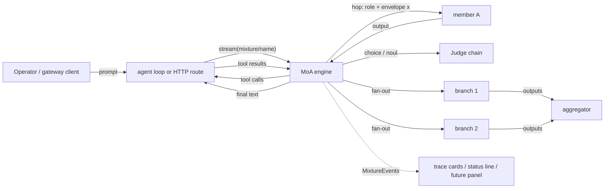

# Mixture of Agents (MoA): implementation specification

Status: revision 6.1 (2026-09-27), approved at revision 6 by both critics,
amended for M1 implementation questions. Implements
[PsychedelicShayna/neopi#94](https://github.com/PsychedelicShayna/neopi/issues/94).
Prior art: `docs/research/2026-09-26-multi-agent-orchestration.md` and the
OmniRoute read-only survey summarized in §8.4. Proxy context: Shayna's
directives of 2026-09-27 and the `npi switch` draft
(`docs/research/2026-09-27-npi-switch.md`, branch `docs/npi-switch-spec`).

Every path is relative to the repo root on branch `feat/mixture-of-agents`.
Line numbers were read from that tree; lines marked `[INFERENCE]` were not
verified against code. §15 lists what Shayna decided, §16 what is still hers
to decide (nothing, at this revision), §19 what changed in each revision and
which critique findings were rebutted.

## 0. Summary and the invariants everything else follows from

A **mixture** is a user-defined directed graph of **members** (a model plus a
role prompt). It is registered as a keyless model `mixture/<name>` so every
surface that already resolves a model id (the model hub, `/model`, role
aliases, the `task` tool's `agent=` selector, the auth-gateway's `/v1/models`
and chat routes) can select and run it without knowing what it is.

The runner is **model-shaped**: it is invoked exactly like a provider,
`(model, context, options) → AssistantMessageEventStream`, and inside one such
call it walks the graph. Each hop is a fresh, stateless call to a member's
model with `[role prompt] + [envelope(x)]`; continuity between hops is carried
only by the declared transit context `x`, which is why `x` is mandatory.

Five invariants, each forced by a verified property of the codebase:

1. **The outer assistant message contains only what the caller may replay:**
   the terminal member's text and real tool calls. No member thinking, no
   member signatures, no trace blocks. Assistant thinking is replayed to the
   next provider by `packages/ai/src/providers/transform-messages.ts:797-903`,
   which drops foreign-credential thinking (`:798`) and cannot verify a
   signature minted by another provider on a signing Anthropic target
   (`:814-826`, `400 Invalid signature in thinking block`). A trace stored as
   thinking would poison the session after any model switch.
2. **The trace is a side channel:** `MixtureEvent`s from the engine, rendered
   in the session as display-only `mixture_trace` cards that never enter the
   LLM context and never touch the live stream message, and mapped to
   reasoning content only in the gateway encoder, never persisted. Nothing in
   the engine knows about the TUI.
3. **Tools bubble up, with enforcement.** A tool-enabled member's tool calls
   are re-emitted as the outer message's tool calls (`stopReason: "toolUse"`);
   the caller, the agent loop or an HTTP client, executes them and calls the
   mixture again with the results; the engine resumes the pending hop from
   per-conversation run state. The engine never executes a tool. A call to a
   tool outside the member's effective allow-list is refused before any
   executable event is emitted, because the outer loop resolves calls against
   the session's full tool set (`packages/agent/src/agent-loop.ts:2823-2836`).
4. **Steering is a checkpoint, not an interrupt.** The agent loop dequeues
   steering only after the stream function returns
   (`packages/agent/src/agent-loop.ts:1705-1731`). The engine therefore polls
   the loop's own non-consuming steering probe at every hop boundary and, when
   a user steer is queued, ends the outer stream at a checkpoint; the loop's
   normal re-entry delivers the steering message and the engine routes it.
5. **Usage is settled once per billed attempt** and reported as a per-response
   delta with a per-member breakdown, so session stats, the broker ledger, and
   gateway cost headers each see it exactly once.



## 1. Definition schema and storage

### 1.1 Storage (decided: TOML, per scope)

Definitions live in **`MIXTURES.toml`**, one document per scope, discovered on
the same search path as `CHAINS.yml` and `WATCHDOG.yml`:

- user scope: `<agentDir>/MIXTURES.toml` (`getAgentDir()`, normally
  `~/.omp/agent`);
- project scope: every directory from `cwd` up to the repository root, probing
  both `<dir>/MIXTURES.toml` and `<dir>/.omp/MIXTURES.toml`
  (`collectConfigCandidates`, `packages/coding-agent/src/advisor/watchdog.ts:66-98`).

Later documents shadow earlier ones by mixture name (user first, then project
ancestors root→leaf), exactly as `discoverChains` merges
(`packages/coding-agent/src/chains/config.ts:119-133`). The configurator's
save path is narrower than discovery: it writes only `<repoRoot>/MIXTURES.toml`
(project) or `<agentDir>/MIXTURES.toml` (user), mirroring
`chainsConfigFilePath` (`chains/config.ts:136-138`). Ancestor and `.omp/`
files are read, never written by the editor.

Parsing uses `Bun.TOML.parse` (already used by
`packages/coding-agent/src/cli/npm-registry.ts:202` and
`packages/coding-agent/src/discovery/codex.ts:151`). Bun has no TOML
serializer, so `packages/coding-agent/src/moa/toml.ts` carries a
schema-specific emitter (`serializeMixturesConfig(doc): string`) that
round-trips every document shape below; comments in a hand-edited file are
not preserved by a configurator save (the chain editor has the same
limitation).

TOML keys are `snake_case` (decided), matching the proxy's draft TOML; the
TypeScript types are camelCase and the loader maps between them.

### 1.2 Document shape

```toml
# ~/.omp/agent/MIXTURES.toml

[envelopes]                      # shared envelope presets (Handlebars), optional
disagree = """
The topic is: {{topic}}
There are {{mixture.member_count}} participants. The previous turn was {{from.id}}.
Your role is to disagree with {{from.id}} on the merits.
{{> moa-parts}}
"""

[roles]                          # shared role (system prompt) presets, optional
prosecution = "You argue the strongest case that the proposal is wrong. Be concrete."

[[mixtures]]
name = "courtroom"               # model id `mixture/courtroom`
description = "Adversarial review with a judge"
entry = "prosecution"
serve = false                    # gateway opt-in; default false (decided)

[[mixtures.members]]
id = "prosecution"
description = "opens and presses the case against the proposal"
model = "xai/grok-4.7:high"
role = "prosecution"
tools = false
show = "always"

[[mixtures.members]]
id = "defense"
description = "rebuts the prosecution point by point"
model = "openai-codex/gpt-6-astra:xhigh"
role = "defense"
tools = false
[mixtures.members.route]         # Jev choice over defense's outgoing edges
instructions = "Has the argument been exhausted, or is there a live point to rebut?"
state = ["output"]
min_confidence = 0.6
fallback = "verdict"
[mixtures.members.terminate]     # Jev noul; true ends the run at this member
instructions = "Has the defense conceded the central claim?"
threshold = 0.8

[[mixtures.members]]
id = "judge"
description = "weighs both sides and writes the ruling"
model = "anthropic/claude-opus-5-5"
role = "judge"
tools = false
show = "final"

[[mixtures.edges]]
id = "open"
from = "prosecution"
to = "defense"
x = { output = true }
envelope = "disagree"

[[mixtures.edges]]
id = "rebut"
from = "defense"
to = "prosecution"
x = { output = true, transcript = { optimize = "compact" } }
envelope = "defend"
when = "there is a specific, unanswered point the prosecution must address"
max_traversals = 3

[[mixtures.edges]]
id = "verdict"
from = "defense"
to = "judge"
x = { transcript = { optimize = "verbatim" } }
envelope = "judge"
when = "both sides have made their case and nothing new is being said"

[mixtures.limits]
max_hops = 12
budget_usd = 4
wall_clock_minutes = 60
on_limit = "judge"
limit_target = "judge"
```

The document above is the **M2 fixture**: every member has `tools = false`
and there is no steering table, so it passes the capability gate (§11.1) at
M2. From M3 on, the same mixture may add:

```toml
[mixtures.steering]              # M3: where an unprefixed steer goes
target = "auto"
```

The smallest valid definition, and the **M1 fixture**, is two members and one
edge with concrete member selectors and tools explicitly off:

```toml
[[mixtures]]
name = "draft-then-edit"
entry = "writer"

[[mixtures.members]]
id = "writer"
model = "openai-codex/gpt-6-astra:medium"
system_prompt = "Draft a complete answer."
tools = false

[[mixtures.members]]
id = "editor"
model = "xai/grok-4.7:low"
system_prompt = "Tighten the draft. Return only the final text."
tools = false

[[mixtures.edges]]
from = "writer"
to = "editor"
x = { output = true }
```

A fan-out group (§8.3, M4) is an edge whose `to` is a list:

```toml
[[mixtures.edges]]
id = "review"
from = "planner"
to = ["security", "perf", "style"]      # branches run concurrently, read-only
x = { output = true }
envelope = "review-slice"
slices = "auto"                         # "same" | "auto" | ["…", "…", "…"]
join = "lead"                           # the single consumer (MPSC)
join_x = { output = true }
join_envelope = "aggregate"
quorum = 2
grace_ms = 15000
```

### 1.3 Types

Document types live beside the chain types so the TUI overlay can import them
without an inverse dependency: `packages/tui/src/overlays/mixture-types.ts`
(precedent: `packages/tui/src/overlays/chain-types.ts`, imported by
`packages/coding-agent/src/chains/config.ts`).

```ts
export interface MixturesConfigDoc {
  envelopes?: Record<string, string>;
  roles?: Record<string, string>;
  mixtures: MixtureDefinition[];
  warnings?: string[];
}

export interface MixtureDefinition {
  name: string;                         // [a-z0-9][a-z0-9._-]*, unique in the merged roster
  description?: string;
  entry: string;                        // id of a model member (never a verdict member, E5)
  serve?: boolean;                      // gateway opt-in; default false
  members: MixtureMember[];
  edges: MixtureEdge[];
  limits?: MixtureLimits;
  steering?: { target: "active" | "entry" | "auto" | string };
  envelopes?: Record<string, string>;   // mixture-local presets shadow document presets
  roles?: Record<string, string>;
}

export type MixtureMember = ModelMember | VerdictMember;

interface MemberBase {
  id: string;                           // [a-z0-9][a-z0-9_-]*, unique per mixture
  description?: string;                 // Jev criteria for steering `auto`; shown in the trace
  show?: "always" | "never" | "final";
}

export interface ModelMember extends MemberBase {
  kind?: "model";
  model: string;                        // `provider/id[:effort]` or `@role[:effort]`
  role?: string;                        // role preset name
  systemPrompt?: string;                // inline role prompt; wins over `role`
  inherit?: boolean;                    // prepend the outer system prompt; default = effective tools !== false
  tools?: boolean | string[];           // false | true (all caller tools) | allow-list
  maxTokens?: number;
  route?: RouteCondition;               // required with > 1 outgoing edge
  terminate?: TerminateCondition;
}

export interface VerdictMember extends MemberBase {
  kind: "verdict";                      // Jev answers; no model text is generated
  question: ChoiceQuestion | NoulQuestion | ScoreQuestion;   // packages/ai/src/judgment/types.ts:23-41
  state?: TransitPartName[];            // inbound parts that form the decision state; default all
  render?: string;                      // envelope preset for the rendered verdict; default bundled `verdict`
}

export type MixtureEdge = SequentialEdge | FanoutEdge;

interface EdgeBase {
  id?: string;                          // default `${from}->${to}` (or `${from}->[…]`); unique
  from: string;
  x: TransitSpec;                       // mandatory, non-empty
  envelope?: string;                    // preset name or inline template; default bundled `handoff`
  when?: string;                        // rubric for the source member's `route` choice
  show?: "always" | "never";            // overrides the source member's `show` on this edge
  maxTraversals?: number;
}

export interface SequentialEdge extends EdgeBase {
  to: string;
}

export interface FanoutEdge extends EdgeBase {
  to: string[];                         // ≥ 2 branch members
  join: string;                         // the single consumer
  slices?: "same" | "auto" | string[];
  joinX?: TransitSpec;                  // default { output: true }
  joinEnvelope?: string;                // default bundled `aggregate`
  quorum?: number;                      // default = branch count
  graceMs?: number;                     // default moa.fanout_grace_ms
  anonymize?: boolean;                  // "Source N" labels in the aggregate envelope; default false
}

export type TransitPartName = "output" | "input" | "reasoning" | "toolTrace" | "transcript";

export interface TransitSpec {
  output?: true;
  input?: true;
  reasoning?: true;
  toolTrace?: true;
  transcript?: true | { optimize?: "verbatim" | "compact" | "snapcompact"; budgetTokens?: number };
}

export interface RouteCondition {
  instructions: string;
  state?: ("output" | "input" | "toolTrace")[];   // default ["output"]
  minConfidence?: number;                         // default moa.judge_min_confidence
  fallback?: string | "pause";                    // outgoing edge id, or pause
}

export interface TerminateCondition {
  instructions: string;
  criteria?: { true?: string; false?: string };
  state?: ("output" | "input" | "toolTrace")[];
  threshold?: number;                             // default 0.5; fires when noul >= threshold
}

export interface MixtureLimits {
  maxHops?: number;
  budgetUsd?: number;
  wallClockMinutes?: number;
  onLimit?: "stop" | "pause" | "judge";
  limitTarget?: string;
}
```

The TOML loader maps `to` to `SequentialEdge` or `FanoutEdge` by its shape;
`join` is required only on `FanoutEdge` (E20). Loader and writer:
`packages/coding-agent/src/moa/config.ts` with `MIXTURES_FILE_NAME`,
`discoverMixtures(cwd, agentDir?)`, `mixturesConfigFilePath(scope, dirs)`,
`loadMixturesConfigFile(path)`, `parseMixturesDoc(raw, path)`,
`serializeMixturesConfig(doc)`, `saveMixturesConfigFile(path, doc)`; same
signatures and warning discipline as `chains/config.ts` (parse never throws;
malformed entries become `warnings` and are skipped). Discovery only parses;
**validation (§11) runs at registration and at save**, so a broken mixture is
reported but never becomes a selectable model.

### 1.4 Resolved definitions and revisions

A definition references things that change under it: role aliases in member
selectors, presets in the document, the judge and summary roles, the read-only
tool set. The engine never runs a raw definition; it runs a
**`ResolvedMixture`** produced by `resolveMixture(def, ctx)` at registration
and again at every run start:

```ts
export type ResolvedMember =
  | { kind: "model"; id: string; model: Model<Api>; effort?: Effort; rolePrompt: string; toolPolicy: ToolPolicy; inherit: boolean; show: "always" | "never" | "final" }
  | { kind: "verdict"; id: string; question: Question; state?: TransitPartName[]; render: string; show: "always" | "never" | "final" };

export interface ResolvedMixture {
  definition: MixtureDefinition;               // frozen copy
  members: Record<string, ResolvedMember>;
  envelopes: Record<string, string>;           // every preset the mixture references, inlined
  uses: { judge: boolean; summary: boolean; slicer: boolean };   // what the graph can actually reach
  judgePlan?: RoleChainCandidate[];            // §5; only when uses.judge; packages/coding-agent/src/config/model-resolver.ts:1531
  summaryModel?: Model<Api>;                   // moa.summary_model; only when uses.summary
  slicerModel?: Model<Api>;                    // moa.slicer_model; only when uses.slicer
  readOnlyTools: ReadonlySet<string>;          // moa.read_only_tools at resolution time
  revision: string;                            // hash of everything above; models as `provider/id:effort`
}
```

**Only reachable dependencies are resolved.** `uses.judge` is true when any
member has `route` or `terminate`, any member is a verdict, or
`steering.target = "auto"`; `uses.summary` when any edge has
`optimize = "compact"` or `"snapcompact"`; `uses.slicer` when any fan-out
edge has `slices = "auto"`. A linear graph resolves none of the helpers, so
the M1 slice never touches the judge chain, and selecting or persisting such
a mixture as `@default` cannot make it see itself.

Member and helper selectors are resolved with `resolveModelRoleValue`
(`packages/coding-agent/src/config/model-resolver.ts:1393`) against
`registry.getAvailable()`. **Recursion** is rejected on the resolved model,
not the selector string, and in two grades:

- **Explicit configuration** is an error: a member selector, or a helper
  role that `uses` names (`moa.summary_model`, `moa.slicer_model`,
  `modelRoles.judge` / `retry.fallbackChains.judge` when `uses.judge`), that
  resolves to a model whose `api === MIXTURE_API` yields
  `member.model.recursive` / `helper.unresolved` with a diagnostic naming the
  role.
- **Implicit fallback pools** are filtered, never fatal: when the judge plan
  is built (`uses.judge` only), the candidate pool passed to
  `judgeRoleChain` excludes every model whose `api === MIXTURE_API`, so the
  built-in `judge → … → @default` fallback
  (`packages/coding-agent/src/priority.json`, resolved in full by
  `resolveRoleChain`, `model-resolver.ts:1544-1568`) never carries a mixture
  even when `@default` is one. `judgeRoleChain(settings, registry, pool?)`
  gains the optional pool parameter for this (`packages/coding-agent/src/judgment/index.ts:131-136`).
  The same filter applies to the summary and slicer roles' fallback
  expansion. If filtering leaves the pool empty, that is `helper.unresolved`.

A run pins its `ResolvedMixture`; role reassignments during a run affect the
next run only. The revision is what checkpoints (§4.8) compare.

## 2. Transit-context vocabulary (`x`)

`x` is a set of **member-derived** parts. Run-level facts (topic,
conversation, roster, hop counters) are always available to envelope templates
(§3) and are not parts, so "`x` non-empty" means "something the source member
produced crosses this edge".

| Part | Definition | Source in code |
|---|---|---|
| `output` | The source hop's final assistant text: every `TextContent.text` block of the hop's last assistant message, joined. For a verdict member, the rendered verdict. For a fan-out join, the per-branch outputs (§8.3). | `AssistantMessage.content` (`packages/ai/src/types.ts:1102-1112`) |
| `input` | The rendered envelope text the source member received for its hop. Text only; images are not re-forwarded. | `HopRecord.input` (§4.1) |
| `reasoning` | Every `ThinkingContent.thinking` block across the hop's assistant messages, in order; `RedactedThinkingContent` skipped; empty when the model exposes none. | `ThinkingContent` (`packages/ai/src/types.ts`); the walk is `thinkingFromContent` in `packages/coding-agent/src/session/messages.ts:191`, module-private today: export it rather than copy it |
| `toolTrace` | For a tool-enabled hop: one line per tool call (`name`, the `intent`/`i` argument when present, else a 120-char argument preview) plus the file-operations summary. | Tool calls from `HopRecord.messages`; file ops via `extractFileOpsFromMessage` / `upsertFileOperations` (`packages/agent/src/compaction/utils.ts:100`, `:182`), rendered by `prompts/moa/tool-trace.md` |
| `transcript` | The canonical run transcript (§2.1), optimized when over budget. | `MixtureRun.hops` |

### 2.1 The canonical transcript and its optimization

The canonical transcript is, per completed hop in order, a header line
`[hop N · <member> ← <edge id | entry | steering | limit>]` followed by that
hop's `output` (for a fan-out group, one header per branch and one for the
join). It contains no envelope inputs, so re-rendering never re-embeds earlier
transit data. Steering interjections and limit notices appear inline as their
own headers. The same rendering is used everywhere the transcript is measured
or summarized: for the summarizer it is converted to `AgentMessage[]` as one
`user` message per header and one `assistant` message per output.

Budget: `transcript.budget_tokens` (default `moa.transcript_budget_tokens`,
24 000), measured with `Tokenizer.countMessages`
(`packages/agent/src/tokenizer.ts`). Under budget it is sent verbatim. Over
budget, the hops older than the last two are the **fold**; `optimize` decides
what happens to the fold. Whatever the fold becomes, the assembled hop request
is then fitted to the target model by §4.6, which may shrink the recent hops
further.

| `optimize` | Behaviour | Code |
|---|---|---|
| `verbatim` (default) | The fold is dropped and replaced by `[… N earlier hops omitted]`. No model call. | none |
| `compact` | The fold's **new** hops (those after `summaries[edge].throughHop`) are summarized by `generateSummary(newFoldMessages, summaryModel, reserveTokens, apiKey, signal, undefined, previousSummary, { completeImpl })`; the result and the new `throughHop` are stored per edge, so a traversal summarizes only hops the last traversal did not cover. `completeImpl` (`SummaryOptions.completeImpl`, `packages/agent/src/compaction/compaction.ts:716`, called at `:993-1015`) routes the request through `host.stream` and records its settlement (§4.7). `summaryModel` = `ResolvedMixture.summaryModel`. Result: `summary` + recent hops verbatim. | `generateSummary` (`compaction.ts:858-867`); `DEFAULT_RESERVE_TOKENS`, `MAX_SUMMARY_TOKENS` (`:212`, `:224`) |
| `snapcompact` | The fold is rasterized with the real archive API: `compact({ firstKeptEntryId: \`moa:${run.id}:${edge.id}:${throughHop}\`, messagesToSummarize: newFoldMessages, turnPrefixMessages: [], tokensBefore, previousPreserveData: summaries[edge].preserveData, fileOps }, { model: targetModel, includeThinking: false, maxFrames })`. `firstKeptEntryId` is a run-local boundary id; it is nonempty because `compact` rejects a falsy id (`packages/snapcompact/src/snapcompact.ts:2108-2111`). `maxFrames = min(providerFrameBudget(target.provider), floor(remainingImageTokens / FRAME_TOKEN_ESTIMATE))` (`:528-530`, `:475`, `:2139-2141`), computed by §4.6 before rendering. `archive = getPreservedArchive(result.preserveData)`; if undefined the edge degrades to `compact` with a trace warning. Otherwise `x.transcript` = `result.summary` (the bundled lead-in) + recent hops, and **every** block of `historyBlocks(archive)` (`:1911-1936`: text head, image frames, text tail, in order) is appended after the rendered envelope text. `preserveData` is stored per edge for the next traversal. Requires the **target** member's model to accept images (`model.input.includes("image")`, E14). | `compact`, `getPreservedArchive`, `historyBlocks`, `PRESERVE_KEY` (`packages/snapcompact/src/snapcompact.ts`); lead-in `packages/snapcompact/src/prompts/snapcompact-summary.md` |

This is the compaction *engine* (`packages/agent/src/compaction`) and the
snapcompact package, not the session orchestration in
`packages/coding-agent/src/session/session-maintenance.ts`, which works on
`SessionEntry[]` and writes `CompactionEntry`s. The run transcript is engine
state, not session history.

Per-edge summary state:

```ts
summaries: Record<string, { text?: string; preserveData?: Record<string, unknown>; throughHop: number }>;
```

### 2.2 The conversation is not a part

`{{conversation}}` (available to every envelope) is the operator-facing
history before the current prompt: `user` text and assistant `text` blocks
from the outer `Context.messages`, thinking and tool traffic excluded,
compaction summaries included as text (they arrive as `user` messages with
`historyRewriteAt`, `packages/agent/src/compaction/messages.ts:242-262`), and
the engine's own checkpoint and pause notices excluded (they begin with the
bundled notice marker from `prompts/moa/notices/marker.md`). It is budgeted by
`moa.conversation_budget_tokens` (default 8 000) as a verbatim tail with an
omission marker, then fitted by §4.6. It is a run-level fact because an
operator talking to a mixture across turns expects the entry member to know
what was said, independent of which edges declare what.

## 3. Envelope presets

An envelope is a Handlebars template compiled with `prompt.compile` from
`@oh-my-pi/pi-utils/prompt` (`packages/utils/src/prompt.ts:531`), as
`packages/coding-agent/src/chains/runner.ts` does for
`prompts/chains/input-with-context.md`. `compile`, not `render`, so member
output whitespace survives.

Template context:

```ts
interface EnvelopeContext {
  mixture: { name: string; member_count: number; members: { id: string; description?: string; model: string }[] };
  topic: string;                       // the run's operator prompt (text)
  conversation: string;                // §2.2
  from?: { id: string; description?: string; model: string };
  to: { id: string; description?: string; model: string };
  edge?: { id: string; traversal: number };
  hop: number;
  x: { output?: string; input?: string; reasoning?: string; tool_trace?: string; transcript?: string };
  slice?: string;                      // fan-out branches
  branches?: { id: string; label: string; description?: string; slice?: string; output: string; status: "ok" | "failed" | "timeout" }[];  // join hop
  steering?: string;                   // steering hops
  limit?: { kind: "hops" | "budget" | "wall_clock"; value: string };   // limit hops
  closing?: { tool: string };          // closing call (§4.4, forced tool choice)
}
```

The partial is registered as **`moa-parts`** (`registerPartial` is
process-global, `packages/utils/src/prompt.ts:525-527`; a generic name would
collide with other templates). It renders every declared part under a fixed
header. Bundled presets live in `packages/coding-agent/src/prompts/moa/` and
are imported with `import … with { type: "text" }`:

| File | Used for |
|---|---|
| `envelopes/entry.md` | the entry hop: topic, conversation, roster |
| `envelopes/handoff.md` | default edge envelope: one-line frame + `{{> moa-parts}}` |
| `envelopes/disagree.md`, `defend.md`, `judge.md`, `review.md` | starter presets mirroring the issue's example |
| `envelopes/review-slice.md`, `envelopes/aggregate.md` | fan-out branch and join defaults |
| `envelopes/steering.md` | steering hop: interjection plus transcript |
| `envelopes/limit.md` | limit hop (`on_limit = "judge"`) |
| `envelopes/closing.md` | closing call to satisfy a caller-forced tool (§4.4) |
| `envelopes/moa-parts.md` | the partial |
| `notices/marker.md`, `notices/checkpoint.md`, `notices/pause.md`, `notices/limit.md`, `notices/error.md` | operator-facing text the engine emits as the outer message when it stops early |
| `roles/prosecution.md`, `defense.md`, `judge.md`, `reviewer.md`, `worker.md` | role presets |
| `verdict.md` | renders a verdict member's answer (label, probabilities, confidence, judge backend) |
| `tool-trace.md` | renders the `toolTrace` part |
| `slicer.md` | the `slices = "auto"` prompt (§8.3) |

Resolution order for a name: mixture-local `envelopes` → document `envelopes`
→ bundled. A value containing a newline or `{{` is an inline template. Every
preset a mixture references is inlined into its `ResolvedMixture`, so a run is
unaffected by later preset edits.

## 4. The runner

Everything in this section is `packages/coding-agent/src/moa/` and imports
nothing from `packages/tui` or `modes/`.

### 4.1 Run identity and state

```ts
export interface MixtureRunKey {
  host: string;                 // MixtureHost.id (a session id, or a gateway instance id)
  mixture: string;
  lineage: string[];            // [] in v1; a nested member later pushes `${mixture}:${member}:${hop}`
  conversation: string;         // §4.1.1
}

export interface HopRecord {
  index: number;                        // 1-based, lifetime
  memberId: string;
  branchOf?: string;                    // fan-out group invocation id when this hop is a branch
  edgeInId?: string;                    // undefined for entry; "steering" | "limit" | "closing" for those hops
  input: string;                        // rendered envelope text
  messages: Message[];                  // the member's own hop context after the envelope (assistant/toolResult pairs, member tool-call ids)
  output: string;
  reasoning: string;
  toolTrace: string;
  truncated?: boolean;                  // member stopped with "length"
  decisions: Decision[];
  status: "running" | "awaiting_tools" | "done" | "failed" | "aborted";
  pendingToolCalls?: { outerId: string; memberId: string; name: string }[];   // §4.5 step 4
  error?: { message: string; status?: number; errorId?: number };
  visible?: boolean;                    // effective `show`, known after the decision (§7)
}

export interface Decision {
  kind: "route" | "terminate" | "steering" | "verdict";
  answer: Answer;                       // packages/ai/src/judgment/types.ts:74
  confidence?: number;
  judge: string;                        // `${result.provider}/${result.model}`
  judgeKind: "native" | "local" | "online";
}

export interface Settlement {
  attempt: string;                      // unique per billed attempt
  kind: "member" | "judge" | "summary" | "slicer";
  hop?: number;
  api: string;                          // transport that served the attempt: AssistantMessage.api, JudgmentResult.api
  provider: string;
  model: string;
  usage: Usage;                         // packages/catalog/src/types.ts
  stopReason: StopReason;               // the attempt's own terminal: "stop" | "length" | "toolUse" | "error" | "aborted"; a judgment is "stop" on an answer, "error" on a thrown failure
  errorMessage?: string;                // when stopReason is "error" | "aborted"
  failed?: boolean;                     // stopReason === "error" || stopReason === "aborted"
  /**
   * Settled after the request's outer response had already been finished
   * (§4.5 abort finalization). Never inside any outer response's report range;
   * journaled once as a `model_usage` entry instead (§4.7 "Late settlements").
   * Still counted in `run.lifetime` / `run.window` and trace headers.
   */
  late?: true;
}

export interface FanoutGroup {                           // §8.3
  invocationId: string;                 // `${edgeId}#${traversal}`
  edgeId: string;
  reservedHops: number;                 // admitted against the hard cap before start
  branches: { memberId: string; hop: number; status: "runnable" | "running" | "awaiting_tools" | "done" | "failed" | "timeout" }[];
  quorumReachedAt?: number;             // engine-active ms
  activeMs: number;                     // engine-active time; tool waits excluded
  status: "running" | "awaiting_tools" | "joined";
}

export type ToolRequirement =
  | { kind: "none" }                    // every tool removed from every hop
  | { kind: "optional" }
  | { kind: "any" }                     // the outer response must contain ≥ 1 tool call
  | { kind: "named"; name: string };    // the outer response must call this tool

export type RunPhase =
  | { kind: "hop_ready"; memberId: string; edgeInId?: string }            // a NEW hop may start (envelope rendered fresh)
  | { kind: "generating"; hop: number }                                    // member call in flight; transient, never persisted (§4.8: a checkpoint written during it stores the hop's resumable continuation instead)
  | { kind: "resume_hop"; hop: number }                                    // continue an EXISTING hop's context (tool results applied); no new envelope
  | { kind: "decision_pending"; hop: number }                               // generation complete, route/terminate not yet decided
  | { kind: "awaiting_tools"; hop: number }
  | { kind: "group_barrier"; invocationId: string }
  | { kind: "closing"; hop: number }                                        // tool-requirement closing call pending
  | { kind: "finalizing" }                                                  // answer decided and stored in `final`; outer text not yet delivered
  | { kind: "ended" };

/**
 * The immutable outer response the writer produced for one request, replayable
 * from a checkpoint: the writer-owned message's content blocks in order (text and
 * tool calls, with their outer ids) plus the terminal outcome.
 */
export interface PendingResponse {
  responseId: string;
  content: AssistantMessage["content"];   // packages/ai/src/types.ts:1104-1112; text + toolCall blocks as emitted
  stopReason: StopReason;                  // "stop" | "toolUse" | "error" | "aborted"
  errorMessage?: string;
  errorStatus?: number;
  errorId?: number;
}

export interface MixtureRun {
  id: string;
  key: MixtureRunKey;
  resolved: ResolvedMixture;            // pinned at run start
  topic: string;
  /**
   * Identity of the last request that reached this run, over its *tail* (§4.5 step 0a), checked before the cursor
   * is consulted. `outcome` is `in_progress` from classification until an outer response exists, `responded` once
   * an outer-return checkpoint has produced one (then `responseId` names it), `failed` when that response was an error.
   */
  lastRequest: { fingerprint: string; consumedCount: number; consumedHash: string; outcome: "in_progress" | "responded" | "failed"; responseId?: string };
  /** Committed input-consumption boundary: messages[0..count) hash to `hash`. Advances only when an outer response is committed. */
  cursor?: { count: number; hash: string };
  status: "running" | "awaiting_tools" | "checkpoint" | "paused" | "done" | "error";
  phase: RunPhase;                      // the next operation; what a checkpoint restores into
  hops: HopRecord[];
  group?: FanoutGroup;                  // the active fan-out group, if any
  activeMemberId?: string;              // the member running or next to run (derived from `phase`; kept for display)
  traversals: Record<string, number>;
  summaries: Record<string, { text?: string; preserveData?: Record<string, unknown>; throughHop: number }>;
  settlements: Settlement[];
  reportedThrough: number;              // settlements[0..reportedThrough) reported on a committed outer response
  appliedToolResultIds: string[];       // outer ids whose results were applied (idempotence)
  window: { hops: number; usd: number; startedAt: number };   // soft-limit window (§4.7)
  lifetime: { hops: number; usd: number; startedAt: number };
  outerResponses: { responseId: string; textHash: string; report: { from: number; to: number }; committed: boolean; pending: PendingResponse }[];
  final?: { text: string; hop: number };   // the completed answer once decided (phase `finalizing`/`ended`); replayed on restore if uncommitted
  toolRequirement?: ToolRequirement;    // caller-required tool not yet satisfied (§4.4)
  endReason?: "terminal" | "terminate" | "verdict" | "limit:hops" | "limit:budget" | "limit:wall_clock" | "hard_cap" | "aborted" | "error";
}
```

`MixtureRunStore` (`moa/run-store.ts`) is an LRU keyed by the serialized
`MixtureRunKey` with a hard entry ceiling and a TTL (`moa.run_state_ttl_minutes`),
modelled on `AuthGatewaySessionStateStore`
(`packages/ai/src/auth-gateway/session-state.ts`). Unlike that store's
eviction lease, `acquire(key)` is an **execution lock**: a second call for a
key whose run is currently executing does not wait; it ends its outer stream
with `stopReason: "error"`, `errorMessage: "mixture run <name> is busy"`. Tool
results whose outer ids are not the pending set, or whose ids are already in
`appliedToolResultIds`, are ignored when a retry re-presents them and rejected
(`"mixture run state does not match these tool results; send a new message"`)
when nothing else in the tail advances the run. Per-run, per-member
non-serializable state (provider session maps, §4.4) lives on the store entry,
never in a checkpoint.

#### 4.1.1 Conversation identity

Prompt-cache affinity is not run identity. The gateway derives its
`sessionId` from the opening prefix on purpose
(`packages/ai/src/auth-gateway/server.ts:114-133`) and documents why retained
execution state must not share it (`session-state.ts:125-156`). It also
overwrites `parsed.options.promptCacheKey` with the explicit **or derived** key
(`server.ts:339-341`) and `parsed.options.sessionId` likewise on the native
route (`:536-538`), so those fields carry no provenance. The engine therefore
uses:

- **Session host:** the session id. Branch and tree changes are handled by
  the checkpoint restore rules (§4.8), not by the key.
- **Headless host:** `options.conversationKey`, a new optional
  `SimpleStreamOptions` field (`packages/ai/src/types.ts:674`) that both
  gateway handlers set **only** from an explicit client key
  (`normalizeClientSessionKey(parsed.options.promptCacheKey)` in
  `handleFormatEndpoint`, `normalizeClientSessionKey(parsed.options.sessionId)`
  in `handlePiNative`), never from the derived id. Without it, the **history
  lineage** of the request: the running hash over (mixture, system prompt,
  tools) and then every message, exactly the `sessionKeys` construction in
  `session-state.ts:157-178`. The store indexes a run by the lineage key of the
  last history it answered and moves the entry forward when a request's chain
  contains that key as an ancestor. Two chats that open identically share a
  run only until they diverge; a continuation that is not an extension of any
  known history starts a new run. Multi-request runs (tool rounds, pause,
  checkpoint) are reliable only with an explicit client key; the
  documentation says so.

### 4.2 Host interface

```ts
export interface MixtureHost {
  id: string;                                   // MixtureRunKey.host
  registry: Pick<ModelRegistry, "getAvailable" | "find">;   // §4.10: the gateway's *internal* view
  settings: Settings;
  runs: MixtureRunStore;
  judge(plan: RoleChainCandidate[], onAttempt: (s: Settlement) => void): Judge;   // §5: pinned candidates
  /** Member and helper calls. Session: settingsAwareStreamFn; headless: streamSimple. */
  stream: StreamFn;                             // packages/agent/src/types.ts:31
  /** The credential resolver for a member model: rotation-capable, never a one-shot string. */
  resolver(model: Model<Api>, sessionId: string, signal: AbortSignal, onAccount: (account: string) => void): ApiKey | undefined;
  /** Provider-specific context preparation for a member model (§4.4). */
  prepareContext(context: Context, model: Model<Api>): Promise<Context>;
  /** Non-consuming steering probe; the session host reads the loop's own probe from the options (§6.2). */
  steeringProbe?(options: SimpleStreamOptions): SteeringQueueState | undefined;
  conversationKey(context: Context, options: SimpleStreamOptions): string;
  /**
   * Client-facing acknowledgement: the host has durably recorded or delivered
   * the outer response identified by `outerResponseId`. Advances `cursor`,
   * `reportedThrough`, and marks the response committed (§4.7, §4.8). What
   * "durably" means is host-specific and stated per host below; it is never
   * producer settlement.
   */
  readonly commit: (run: MixtureRun, outerResponseId: string) => void;   // supplied by the engine; the host invokes it
  /**
   * Upstream billed-attempt accounting, exactly once per settlement, at the
   * moment the attempt settles (member call done/error/abort, judgment,
   * summary, slicer). Independent of any outer response and of `commit`.
   * Fires for late settlements too.
   */
  onSettlement?(run: MixtureRun, settlement: Settlement): void;
  /**
   * Client-facing accounting for a settlement that no outer response will ever
   * report (`settlement.late`). The session host journals it as one
   * `model_usage` entry when the run still belongs to this conversation, and
   * drops the journal (not the broker record) otherwise; the headless host has
   * no per-conversation ledger and ignores it. See §4.7 "Late settlements".
   */
  onLateSettlement?(run: MixtureRun, settlement: Settlement): void;
  onEvent?(event: MixtureEvent): void;
}

/** Every event carries the run and the trace variant a consumer would persist or render (§7.1). */
export type MixtureEvent =
  | { type: "run_start";       run: MixtureRun; trace: Extract<MixtureTraceDetails, { kind: "run_start" }> }
  | { type: "hop_start";       run: MixtureRun; hop: HopRecord; model: Model<Api>; trace: Extract<MixtureTraceDetails, { kind: "hop" | "branch" }> }
  | { type: "hop_end";         run: MixtureRun; hop: HopRecord; trace: Extract<MixtureTraceDetails, { kind: "hop" | "branch" }> }   // after the decision; trace.output only when visible
  | { type: "decision";        run: MixtureRun; hop: HopRecord; trace: Extract<MixtureTraceDetails, { kind: "decision" }> }
  | { type: "steering";        run: MixtureRun; trace: Extract<MixtureTraceDetails, { kind: "steering" }> }
  | { type: "limit";           run: MixtureRun; trace: Extract<MixtureTraceDetails, { kind: "limit" }> }
  | { type: "checkpoint";      run: MixtureRun; reason: "hop" | "decision" | "steering" | "abort" | "pause" | "tools" | "error" | "done"; report?: { from: number; to: number }; outerResponseId?: string; trace?: Extract<MixtureTraceDetails, { kind: "checkpoint" }> }   // trace absent for "hop"/"decision"/"done" (not shown)
  | { type: "run_end";         run: MixtureRun; trace: Extract<MixtureTraceDetails, { kind: "run_end" }> };
```

Two hosts:

- **Session host** (`createSessionMixtureHost(session, agent)` in
  `moa/host.ts`, one per session, held by the primary wrapper's closure, never
  registered anywhere): `stream` = the session's `settingsAwareStreamFn`
  (`packages/coding-agent/src/sdk.ts:4076-4079`: credential redaction,
  provider concurrency, slow-mode policy, per-request `loopGuard`,
  `fitOutputTokensToContextWindow`, and the `liveSteering` off-switch,
  `packages/coding-agent/src/session/settings-stream-fn.ts:139-163`);
  `resolver` = `modelRegistry.resolver(model, sessionId)`
  (`packages/coding-agent/src/config/model-registry.ts:2856-2858`, the
  rotation-capable `ApiKeyResolver`, never `getApiKey`'s one-shot string);
  `prepareContext` = the session's full `transformProviderContext(context, model)`
  (`sdk.ts:3993-4014`) applied with the **member** model (§4.4 explains the
  outer bypass); `judge(plan, onAttempt)` = `resolveJudge({ settings, registry, sessionId, candidates: plan, onUsage: onAttempt })`
  (§5, only when `uses.judge`); `steeringProbe(options)` = the loop's
  `hasSteeringMessages` found on the options (§6.2); `conversationKey` = the
  session id; `onSettlement` = `modelRegistry.authStorage.usage.observe({ provider, model, usage, costUsd })`
  per attempt (the same call the session makes for a settled assistant
  message, `packages/coding-agent/src/session/agent-session.ts:3729-3740`;
  for a mixture message that call is **skipped**, see §4.7, so each member
  attempt is observed exactly once, including attempts whose outer response
  later errors); `commit` is invoked from the session's `message_end`
  handling (`agent-session.ts:3326-3347`, after the entry append) when the
  settled message's `responseId` names a run, **including error and aborted
  messages** (the session persists them, `:3684-3698`; they are the durable
  record that the attempt happened, and §4.7 explains how their usage stays
  in session totals after the session drops them from live state). When the
  committed response is a run's `done` response, the host then appends the
  `run_end` lifecycle record (§4.8), so it always follows the assistant
  entry in the branch; `onEvent` forwards to the session (§7, §4.8); `id` =
  the session id.
- **Headless host** (`createHeadlessMixtureHost({ id, registry, settings, storage })`,
  one per gateway instance): `stream` = `streamSimple` from `@oh-my-pi/pi-ai`;
  `resolver` = `buildGatewayApiKeyResolver(storage, model, sessionId, initialKey, signal, "mixture", "mixture", onAccount)`
  after `resolveGatewayApiKey` (`packages/ai/src/auth-gateway/dispatch.ts:86-107`,
  `:196`), so member calls rotate credentials like any gateway request;
  `prepareContext` = identity (providers normalize inside `streamSimple`);
  `judge` = the same `resolveJudge` with the gateway's registry and settings;
  no steering probe; `conversationKey` per §4.1.1; `onSettlement` =
  `recordGatewayUsage(storage, memberModel, client, settlement.usage)` per
  attempt (the request's `client` identity is bound into the host per
  request); `commit` is invoked from the SSE encoder's completion, **not**
  from `events.result()`: `result()` settles when the producer pushes the
  terminal event, before anything is consumed
  (`packages/ai/src/utils/event-stream.ts:51-58`). The encoder
  (`encodeStream` in `packages/ai/src/providers/openai-chat-server.ts` and
  its siblings) gains an `onComplete` callback fired when the terminal SSE
  frame has been enqueued into the response body **and** the request signal
  has not aborted; `onCancel` (`server.ts:456-460`, `:668-672`) is the
  negative path. For a non-streaming response, including an error envelope,
  `commit` runs when the `Response` has been returned and the request signal
  is not aborted. Neither is proof of client receipt (the transport offers
  none); the guarantee is "not known to have failed", and an explicit-key
  repeat after a lost response replays the pending response (§4.5 step 0a)
  rather than regenerating. `run_end` is recorded in the run store on commit
  of the `done` response (no persistence in the headless host).

### 4.3 The outer message writer

`moa/outer-stream.ts` owns the outer `AssistantMessage`
(`createAssistantMessage(model)` as `packages/coding-agent/src/tiny/local-inference-api.ts:159`
does) and is the only thing that pushes events on the outer
`AssistantMessageEventStream`. Member events are **never forwarded**: they
carry member-local `contentIndex` values and a `partial` that is the member's
message (`packages/ai/src/types.ts` event union; consumers index
`event.partial.content[event.contentIndex]`, `packages/agent/src/agent-loop.ts:2216-2234`,
and the gateway encoders do the same). The writer exposes:

- `text(delta)` / `endText()`: appends to the outer message's single text
  block (creating it on first delta) and emits `text_start/delta/end` with
  outer indices and `partial: outer`.
- `toolCall(memberCall, outerId)`: appends a `ToolCall` block with the outer
  id and emits `toolcall_start`, one `toolcall_delta` carrying the complete
  arguments, and `toolcall_end`. Called only from step 4 of §4.5, once the
  member's final outcome has made the calls executable; never from the
  member's own `toolcall_*` events, which are buffered.
- `finish(outcome)`: pushes exactly one terminal event: `done` with
  `reason: "stop" | "length" | "toolUse"`, or `error` with
  `reason: "aborted" | "error"`, the outer message's `usage` (§4.7),
  `stopReason`, and error fields. These are the only terminal variants the
  union allows (`packages/ai/src/types.ts:1496-1506`).

Outcome matrix, against the real event union. "Calls" are the member's
completed tool-call blocks, buffered during the call:

| Member terminal event | Calls | Engine |
|---|---|---|
| `done`, `reason: "stop"` | none | hop `done`; decide (§4.5 step 6) |
| `done`, `reason: "stop"` or `"toolUse"` | ≥ 1 | executable (the loop treats both as executable, `agent-loop.ts:1555-1560`): validate (§8.1), emit outer calls, hop `awaiting_tools` |
| `done`, `reason: "length"` | any | hop `done` with `truncated: true`; calls discarded (never executable); trace warning; decide on the text produced |
| `error`, `reason: "aborted"`, engine deadline controller fired | any | hop `aborted`; settle partial usage; §4.7 limit handling (`wall_clock`) |
| `error`, `reason: "aborted"`, caller signal fired | any | hop `aborted`; run `checkpoint` (§6.3); outer `error` with `reason: "aborted"`, `stopReason: "aborted"` |
| `error`, `reason: "error"` | any | hop `failed` with `errorMessage`, `errorStatus`, `errorId` copied from the member; run `error`; outer `error` with `reason: "error"` carrying the same classification fields and the settled partial usage; no notice text (an errored message must stay an error for the session's retry classification) |
| stream throws / ends without a terminal event | any | as `error`, `errorMessage: "member <id> stream ended without a result"` |

Member `thinking_*` events feed `hop.reasoning` only. Member text of a
non-terminal hop is buffered into `hop.output`; member text of the terminal
hop is streamed through `writer.text` live only when the member is
structurally terminal (no outgoing edges and no `terminate`); otherwise it is
buffered and emitted after the decision.

### 4.4 Member call preparation

`prepareMemberCall(outer: SimpleStreamOptions, run, hop, member, host): SimpleStreamOptions`
(`moa/member-call.ts`) is the single seam between the caller's options and a
member's request.

**Preserved** from the outer options: `signal` (combined with the run
deadline), `fetch`, `onPayload`, `onResponse`, `onSseEvent`,
`disableReasoning`, `forceReasoningOff`, `temperature` and the other sampling
fields (only when the member sets none), `thinkingBudgets`,
`hideThinkingSummary`, `maxRetryDelayMs`, `streamFirstEventTimeoutMs`,
`streamIdleTimeoutMs`, `cursorExternalToolExecutor`.

**Recomputed per member:**

- `apiKey` = `host.resolver(memberModel, memberSessionId, signal, onAccount)`.
- `sessionId` = `promptCacheKey` = `${run.key.conversation}:${run.key.mixture}:${lineage}:${member.id}`;
  the mixture name is part of the namespace so two mixtures with the same
  member ids never share credential stickiness or cache lineage.
- `providerSessionState` = the run's per-member map
  (`store.entry(run).providerState[member.id]`, created on first use), scoped
  exactly as the gateway scopes retained state (provider, model, conversation;
  `session-state.ts:210-238`); `onAccount` from the resolver resets it through
  `resetAccountScopedProviderSessionState` (`packages/ai/src/provider-session-state.ts`)
  when rotation switches accounts. The caller's map is never shared: it is
  keyed by provider and the outer conversation, which is coarser than a
  member.
- `metadata` = `outer.metadataResolver?.(memberModel.provider) ?? outer.metadata`,
  resolved after the credential (the loop resolved the outer value for
  provider `mixture`, `agent-loop.ts:1959`).
- `reasoning` = the member's `:effort` if present, else the outer value.
- `maxTokens` = the member's `maxTokens` if set, else the outer value; the
  host's stream function fits it to the member model.
- `toolChoice` is normalized at the engine boundary into one of four
  requirements, covering every shape of `ToolChoice`
  (`packages/ai/src/types.ts:113-121`):

  | Caller value | `ToolRequirement` |
  |---|---|
  | `"none"` | `{ kind: "none" }`: every tool removed from every hop regardless of policy |
  | `"auto"` / undefined | `{ kind: "optional" }` |
  | `"any"` / `"required"` | `{ kind: "any" }`: the outer response must contain at least one tool call |
  | `{ type: "tool", name }` / `{ type: "function", name }` / `{ type: "function", function: { name } }` | `{ kind: "named", name }` (the gateway already folds its decoded named form into `{ type: "tool", name }`, `packages/ai/src/auth-gateway/server.ts:155-161`) |
  | `{ type: "computer" }` or any other native marker | `toolchoice.unsupported` (error before the first hop); the engine cannot promise a native tool |

  `any` and `named` are recorded as `run.toolRequirement`, a requirement on
  the **outer response**, and enforced at every externally visible
  tool-return boundary, not only at graph termination:
  - **Intermediate hops.** While a `named` requirement is pending, the only
    tool call any member may make is the named tool; a member whose
    outcome carries any other call fails the hop with `member.tool.detour`
    (run error) before any outer tool event, so the surrounding loop never
    sees a non-compliant detour batch (which it would skip and escalate,
    `agent-loop.ts:1567-1612`). Under `any`, intermediate calls are allowed
    (any call satisfies it). A member whose policy cannot express the named
    tool simply runs without tools while the requirement is pending.
  - **Terminal hop.** The requirement is applied as the provider-level
    `toolChoice` to a structurally terminal model member whose effective
    tools satisfy it (`any`: at least one tool; `named`: that tool). The loop
    uses `named` for `requireYieldTool` and soft-required escalation
    (`agent-loop.ts:1567-1611`, `packages/coding-agent/src/task/executor.ts:3987`).
  - **Closing call.** If the run ends at a member whose terminal outcome had
    no qualifying call, the engine runs one closing call on that member
    (`phase: closing`, `edgeInId: "closing"`, `envelopes/closing.md` with
    the member's buffered output as `x.output`, the requirement applied)
    whose result becomes the outer response. Because the terminal text is
    buffered until `finalizing` whenever a requirement is pending (§4.5), the
    closing result never has to replace text a client already received.
  - **Unsatisfiable.** If the ending member cannot satisfy it (tools off, the
    named tool not allowed, or `none` was also requested), the run ends with
    `toolchoice.unsatisfiable` (error) rather than a text-only success. A
    graph with no member that could satisfy the requirement fails at step 0
    with the same error before any member runs; M1's tools-off graphs take
    exactly this path, so M1 needs only the normalization and this
    rejection, and the closing-call machinery arrives with M3.
- `loopGuard` is left to the host's stream function (session: settings
  default per member call; headless: pi-ai default).

**Dropped:** `liveSteering` (the engine never forwards it; §6),
`codexCompaction`, `anthropicCacheRefresh`, `fallbackCreditRedemption`,
`anthropicSlowMode` (session-specific, re-applied by `settingsAwareStreamFn`
where relevant), `apiKey`, `metadataResolver`, `conversationKey`, and every
`AgentLoopConfig` field the loop spread into the options
(`packages/agent/src/agent-loop.ts:2011-2024` passes `{ ...config, … }`).

**Context.** `systemPrompt = (inherit ? outer.systemPrompt : []) ++ [rolePrompt]`;
`messages = [envelope user message (text + operator images on the entry hop)] ++ hop.messages`;
`tools = effective tool set (§8.1)`; then `host.prepareContext(context, memberModel)`
**once**, against the member model.

The session's provider pipeline runs before the stream function
(`agent-loop.ts:1845-1875`) against whatever model the loop holds, which for a
mixture is the synthetic model: `transformProviderContext`
(`sdk.ts:3993-4014`) would clamp images to the unknown-provider budget of five
(`packages/snapcompact/src/snapcompact.ts:519-524`), normalize them for a
provider that does not exist, and rasterize inline snapcompact for it. That
transform is therefore split: when `isMixtureModel(transformModel)` it runs
only the model-neutral steps, obfuscation (`obfuscateProviderContext`) and the
date/cwd reminder, and skips `snapcompactInline.transform`,
`clampProviderContextImages`, `normalizeProviderContextImagesForModel`,
`dropUnreadableContextImages`, and `blobBroker.decorateContext`. The session
host's `prepareContext` runs the full pipeline for each member request. Images
attached by the operator reach the entry member with that member's real
budget.

### 4.5 The turn algorithm

`streamMixture(model, context, options, host): AssistantMessageEventStream`
(`moa/engine.ts`) pushes `start` and runs the following asynchronously.

**Step 0, classify the call.** The engine receives the post-conversion
context (`transformContext` → `convertToLlm` → `transformProviderContext`,
`packages/agent/src/agent-loop.ts:1845-1875`), so the tail is defined on
`Message[]`.

**Step 0a, repeat check, before the cursor is consulted.** The identity of a
request is separate from the committed consumption boundary. `run.lastRequest`
records, for the last request that reached this run, the fingerprint of its
tail, the prefix it was computed against (`consumedCount`, `consumedHash`),
its `outcome`, and, once an outer response exists, that response's
`responseId`. The engine first re-derives that request's tail on the
incoming messages: if `messages[0..consumedCount)` hashes to `consumedHash`,
the candidate tail is the rest, and if its fingerprint equals
`lastRequest.fingerprint`, this call is a **repeat** of the previous request.
The check reads only `lastRequest`, never the cursor, so it holds whether or
not the previous response was committed. A repeat never re-applies tool
results (they are already in `appliedToolResultIds`). What it does depends
on `lastRequest.outcome`:

- **`in_progress`** (the request was classified but no outer response was
  ever produced: a crash or eviction mid-run, before any outer return): a
  **resume**; continue at `run.phase` under the pinned definition. There is
  nothing to replay.
- **`failed`** (the request's outer response was an error): a **retry**;
  resume at `run.phase` under the pinned definition. The session's retry
  path removes the failed assistant message from live state and re-sends
  exactly the previous input
  (`packages/coding-agent/src/session/session-maintenance.ts:5125-5140`);
  the repeat matches because step 0a re-derives the tail against
  `lastRequest`, which the error response's commit does not change. The
  cursor and watermark **have** advanced on that commit (§4.2, §4.7), so the
  retry reports only settlements after the failed response; the failed
  attempt's usage is reported once, on the error response, and stays in
  session totals through the branch (§4.7). This covers a first-hop error
  and an error during the resumed member call after tool results were
  applied (phase `resume_hop`): the results stay applied, the member call is
  redone once.
- **`responded`** (the request produced a success whose delivery is not
  known to have succeeded): a **retransmission**; the engine replays the
  `PendingResponse` whose `responseId` equals `lastRequest.responseId`,
  verbatim through the writer (content blocks in order: text and tool calls
  with the same outer ids; the same `responseId`; the same reporting range,
  §4.7), and returns without touching the run. If no stored response carries
  that id (evicted), the repeat is treated as `in_progress`. A retransmitted
  request whose response produced outstanding tool calls therefore gets
  those calls again, never a regenerated hop, and the run stays in
  `awaiting_tools` until results arrive. A repeat of a committed success is
  the same replay (the client simply asked twice). A repeat that matches an
  *older* request (the client resent `[U]` after `[U, A(calls), results]`
  was already answered) is not a repeat at all: `lastRequest` describes the
  newest request only, so it falls through to step 0b.

**Step 0b, anchor.** Otherwise the anchor (the last message the run has
already consumed) is found, in order:

1. `responseId`: the last assistant message whose `responseId` is in
   `run.outerResponses` (the engine stamps `responseId = moa:<runId>:<n>` on
   every outer message, `AssistantMessage.responseId`, `packages/ai/src/types.ts:1120`).
   Works in the session; OpenAI chat and Anthropic wires do not round-trip
   the field (`packages/ai/src/providers/openai-chat-server.ts:299-315`
   rebuilds assistants without it).
2. `cursor`: `run.cursor = { count, hash }` is the **committed** boundary
   (§4.8); when the first `count` messages hash to `cursor.hash`, the anchor
   is `messages[count - 1]`. Wire-neutral; the gateway's normal path.
3. Text match: the last assistant message whose text hash equals the newest
   `outerResponses[].textHash` (history rewritten by a client, or by session
   compaction with `historyRewriteAt`).
4. None: the whole list is the tail.

`tail` = messages after the anchor. Walk it: `toolResult` messages are
collected; `developer` messages are ignored; `user` messages with
`historyRewriteAt` (compaction and branch summaries,
`packages/agent/src/compaction/messages.ts:229-262`) are ignored for
classification; a `user` message whose text unwraps through
`unwrapSteeringEnvelope` (§6.1) is a **steer**; any other `user` message is an
**operator prompt**. Steer and operator text are taken from the last such
message; earlier ones in the same tail are folded into it in order. Tool
results whose outer ids are in `appliedToolResultIds` are dropped from the
collected set (idempotence). The engine then records
`lastRequest = { fingerprint: hash(tail), consumedCount: anchorIndex + 1, consumedHash, outcome: "in_progress" }`;
`outcome` becomes `"responded"` (with `responseId`) or `"failed"` only at
the outer-return checkpoint that produces the response (§4.5 step 1, §4.8).
The cursor is **not** touched here.

| Tail | Run status | Action |
|---|---|---|
| repeat, `outcome: "in_progress"` (step 0a) | any except `done` | resume at `run.phase` under the pinned definition: `hop_ready` starts that member; `resume_hop` continues the existing hop; `decision_pending` decides without regenerating; `closing` runs the closing call; `finalizing` emits `final` |
| repeat, `outcome: "failed"` (step 0a) | `error` | retry: resume at `run.phase` as above; the retried response reports only settlements after the error response |
| repeat, `outcome: "responded"` (step 0a) | any | retransmission: replay the `PendingResponse` named by `lastRequest.responseId` with the same content, ids, and reporting range; the run does not move |
| unapplied tool results matching `hop.pendingToolCalls` | `awaiting_tools` | apply them (step 4); if the set is now complete, continue the member; then apply a steer or prompt found after them |
| tool results, none matching, nothing else | any | error: `"mixture run state does not match these tool results; send a new message"` |
| steer | `running`, `checkpoint`, `awaiting_tools` (after results) | steering hop (§6) |
| steer | `paused` | steering hop at the paused member; a new soft-limit window is granted (§4.7) |
| steer | `done`, `error` | the run is over; the steer text is an operator prompt: new run with it as topic |
| operator prompt | none, `done`, `error` (not a retry) | new run; topic = the text; images forwarded to the entry hop |
| operator prompt | `paused`, `checkpoint` | treated as a steer (the pause/checkpoint notice told the operator so); `/mixture reset` or a new conversation starts fresh. **Before M3 ships steering hops**, this row instead starts a new run and the abort/checkpoint notice says so (§14 M1); M3 replaces the row with the steer |
| operator prompt | `running` | cannot happen in the session (the lock rejects it); in the gateway it is the busy error |
| developer or notice messages only, no steer, no prompt | `checkpoint` | **continue**: resume at `run.phase` without a steering hop (a one-at-a-time steering queue can deliver a notice ahead of the user's steer, §6.2) |
| developer or notice messages only | any other | error: `"mixture received no new input"` |

A run whose `resolved.revision` differs from the currently registered
resolution finishes its pending phase under the pinned definition (a
mismatch during `awaiting_tools` is not an error) and starts a fresh run on
the next operator prompt, with a trace note.

**Step 1, phase loop.** While the run is `running`, dispatch on `run.phase`.
Every transition below is checkpointed **after** it happens, **except the
transition into `generating`**, which is never persisted: the last persisted
phase before an in-flight member call is `hop_ready` or `resume_hop`, and a
crash during the call restores into that phase (the call is redone). So a
checkpoint's `phase` is always a resumable operation, and the ordering here
is the ordering §4.8 persists:

1. **`hop_ready`.** Check the soft and hard limits (§4.7). Check the steering
   probe (§6.2); if a user steer is queued, checkpoint for steering and
   return. Build the hop request (§4.4) for the phase's member (entry member;
   an edge's `to`; a fan-out group, §8.3; the steering target;
   `limit_target`) with a fresh envelope, fit it (§4.6), create the
   `HopRecord`, set `phase: generating`.
2. **`resume_hop`.** The hop already exists and its `messages` carry the
   applied tool results; no envelope is rendered. Set `phase: generating`
   for that hop.
3. **`generating`.** Call `host.stream`. Route member events through the
   writer (§4.3), buffering text and tool calls. On an executable outcome
   with calls: validate every call against the member's policy (§8.1) **and
   against `run.toolRequirement`** (§4.4: with a pending `named`
   requirement, an intermediate member may only call that tool; any other
   call from any member is `member.tool.detour`, a run error, so a detour
   never escapes to the caller); assign outer ids (`moa_<hop>_<n>`; branches
   use the same scheme, so ids are unique across a fan-out group) and record
   `pendingToolCalls` with the member's original ids; settle usage;
   `hop.status = "awaiting_tools"`, `run.status = "awaiting_tools"`,
   `phase: awaiting_tools`; build the outer response (any buffered text
   blocks first, then the tool-call blocks), store it as the request's
   `PendingResponse` with a fresh `responseId`, set
   `lastRequest = { …, outcome: "responded", responseId }`; write an
   outer-return checkpoint (§4.8); emit the response through the writer
   (`text` blocks, then `toolCall` blocks, then `finish({ done: "toolUse" })`);
   return. On a non-executable
   final outcome: fill `output`, `reasoning`, `toolTrace`; settle usage;
   `hop.status = "done"`; `phase: decision_pending`; write a hop-boundary
   checkpoint (`reason: "hop"`). No trace is published yet.
4. **`awaiting_tools`** (entered from step 0 with results). Map outer ids
   back to member ids, append `toolResult` messages to `hop.messages`, record
   the outer ids in `appliedToolResultIds`, set `phase: resume_hop` for the
   same hop, then write a hop-boundary checkpoint (`reason: "tools"`).
5. **`decision_pending`.** Decide (§5): `terminate` first, then `route` or
   the single outgoing edge, honouring `maxTraversals`; record decisions and
   traversals. Compute the hop's effective visibility (§7) from the member's
   `show` and the taken edge's `show` and publish `hop_end` with the trace.
   Then set the next phase and write a hop-boundary checkpoint
   (`reason: "decision"`): `hop_ready` for the next member when an edge is
   taken; otherwise the hop is terminal: if `run.toolRequirement` is
   unsatisfied and satisfiable, `closing`; else `run.final = { text: hop.output, hop }`,
   `phase: finalizing`. The terminal member's text is **not** emitted here.
6. **`closing`.** Run the closing call (§4.4) as a normal generate on the
   ending member with its buffered output as `x.output`; its result becomes
   `run.final` (and its tool calls, if any, go out as the outer response the
   way step 3 does); then `phase: finalizing`, checkpointed.
7. **`finalizing`.** Build the outer response from `run.final.text` (this is
   the only place terminal text reaches the outer message, so it is
   replayable: a restore into `finalizing` rebuilds and re-emits it), store
   it as the `PendingResponse`, set `lastRequest.outcome = "responded"` with
   its `responseId`, set `run.status = "done"`, `endReason` as decided,
   `phase: ended`, write the outer-return checkpoint with the reporting
   range (§4.8), emit the text and `writer.finish({ done: "stop" })`, emit
   `run_end` (the event); return. The `run_end` **record** is written by the
   host on `commit` of this response (§4.2, §4.8), not here.
8. **`ended`.** Nothing to do; a call that reaches a run in this phase is
   classified by step 0 (a repeat replays, anything else starts a new run).

Live streaming of a structurally terminal member's text (§4.3) is an
optimization of step 7 that is taken only when no `toolRequirement` is
pending and the member has no `terminate`; in every other case the answer is
buffered until `finalizing`, so a closing call never has to replace text a
client already received (the writer is append-only and SSE encoders publish
deltas immediately, `packages/ai/src/providers/openai-chat-server.ts:595-602`).

Every outer return that ends in `error` (member failure, `context_exceeded`,
`toolchoice.*`, detour) likewise stores the error envelope as the
`PendingResponse`, sets `lastRequest.outcome = "failed"`, **normalizes the
continuation** (§4.8: a run whose phase is the transient `generating` is
checkpointed as `resume_hop` for that hop when the hop has applied tool
results, else `hop_ready` for that hop's member and edge; any other phase is
stored as is), writes the outer-return checkpoint (`reason: "error"`), and
finishes with the `error` event; the run stays retryable (no lifecycle
record). Settled usage and applied tool results are preserved; a retry
redoes only the failed call, never completed work.

Crash points and what restores: after member settlement (phase
`decision_pending`) → decide without regenerating; after routing
(`hop_ready`) → next hop; during a member call → the last persisted phase,
`hop_ready` or `resume_hop`, and the call is redone (`generating` is never
persisted); after tool results are applied but before the resumed call
starts (`resume_hop`) → the resumed call, with no new envelope; after the
terminal decision but before text emission (`finalizing`) → rebuild and emit
`final`, never an empty `ended`; after the `done` checkpoint but before the
assistant append → the checkpoint is uncommitted (§4.8), so restore takes
the preceding `finalizing` checkpoint and emits `final` again. A steer
delivered at restore time is applied after the pending decision, never
before it.

Outer `usage` on every `finish` is the delta of settlements since
`reportedThrough` (§4.7). `usage.contextTokens` is the outer conversation's
occupancy (`Tokenizer.countMessages(context.messages)` plus the system prompt
and the emitted text), not the sum of member prompts, because
`calculateContextTokens` prefers `contextTokens`
(`packages/agent/src/compaction/compaction.ts:270-280`) and the session's
auto-compaction threshold reads it through `correctedPromptTokens`
(`packages/coding-agent/src/session/session-stats.ts:47-50`).

**Abort.** `options.signal` is combined with the run deadline into every
member call and judgment. A caller abort is finalized **synchronously inside
the engine's own `abort` listener on `options.signal`**, registered while
`streamMixture` runs (before it returns the outer stream), because the agent
loop reacts to the same signal asynchronously: its listener only resolves a
race promise (`packages/agent/src/agent-loop.ts:2105-2110`), and
`finishAbortedStream` (`:2074-2094`) runs on a later microtask, spreads the
live partial it holds **by reference** (`partialMessage = event.partial`,
`:2264`, `:2363`; the writer pushes `partial: this.message`), and emits that
copy as the session's aborted assistant message (`:2648-2649`,
`:2678-2685`). Every abort listener fires synchronously within the same
`abort()` call, whether it sits on the loop's source signal or on an
`AbortSignal.any` dependent, so a listener that does its whole job without
awaiting always finishes before the loop's copy is taken. The by-reference
premise requires the **native** tool dialect: under an owned dialect the loop
wraps the stream in `wrapInbandToolStream` (`agent-loop.ts:2025-2038`), whose
projector re-seeds its own partial (`{ ...seed, content: [] }`,
`packages/ai/src/dialect/owned-stream.ts:207`), and the loop's reference is
that copy, which the finalizer's stamp never reaches. Mixture models
therefore never receive an owned dialect (§4.9). The finalizer, with no
`await`:

1. marks the current hop `aborted`, drops its partial output from the run
   (it was visible as a streaming trace only if it was the terminal hop),
   keeps settled usage and applied tool results, and normalizes the
   continuation exactly as for an error return (never `generating`);
2. sets `run.status = "checkpoint"`, allocates the response id, builds the
   `PendingResponse` from the writer's current content with
   `stopReason: "aborted"`, and records it with `lastRequest.outcome = "failed"`;
   its report range covers the settlements that exist **now**, which excludes
   the in-flight member call;
3. writes the outer-return checkpoint (`reason: "abort"`,
   `sessionManager.appendCustomEntry` is synchronous), so it precedes the
   assistant entry in the branch;
4. **mutates the writer's live message in place**: `responseId`, `usage` (the
   report range's sum), `usageBreakdown`; the loop's spread then carries them,
   so the persisted abort is identified and `commit` (§4.2) advances the
   watermark and cursor on `message_end`;
5. releases the run lease and marks the request **finalized**.

After finalization the engine's asynchronous continuation for that request is
inert: when the in-flight member's terminal event arrives, its usage (if any)
is settled **late** (`Settlement.late`, §4.7), `onSettlement` and
`onLateSettlement` fire, and nothing else happens: no second response, no
second checkpoint, no terminal event on the outer stream (the loop has left
the iterator), no trace publication. If the abort fires while no member call
is in flight (between hops), the finalizer runs the same steps with nothing
to settle later.

The next message on the same conversation resumes as a steer (§6.3) once
steering hops exist (M3); until then the abort notice states that the next
message starts a new run. The engine distinguishes its own deadline from the
caller's signal by checking which controller fired; a deadline abort is not a
caller abort and takes the §4.7 limit path, whose response is produced by the
engine in the ordinary way.

### 4.6 Fitting a hop request to the target model

`fitHopRequest(target: Model, member, parts, hopMessages, tools)` in
`moa/budget.ts` bounds the assembled request, because five individually capped
parts plus conversation, role prompt, tools, recent hops, tool rounds, and
frames can still exceed the target's window:

```
available = target.contextWindow
          - reserveOutput (member.maxTokens ?? min(target.maxTokens ?? 16384, 16384))
          - tokens(systemPrompt) - tokens(tools) - tokens(envelope frame without parts)
```

Fill in priority order, each part first capped by its own budget
(`moa.part_budget_tokens`, default 16 000, per part) and then by what remains,
keeping head and tail with an `[… truncated N tokens]` marker:

1. current hop messages (tool rounds): **irreducible**; if they alone exceed
   `available`, the hop fails with `hop.context_exceeded` (run error, notice
   names the member and suggests `max_traversals` or a smaller tool
   allow-list);
2. `x.output`;
3. `x.input`, `x.reasoning`, `x.tool_trace`;
4. `{{conversation}}`;
5. `x.transcript` recent hops (newest kept longest);
6. the fold: summary text, or frames whose count is
   `min(providerFrameBudget(target.provider), floor(remaining / FRAME_TOKEN_ESTIMATE))`;
   zero frames degrades to the text summary.

Tokens are counted with `Tokenizer` for the target model
(`packages/agent/src/tokenizer.ts`, images at `IMAGE_TOKEN_ESTIMATE`, frames at
`FRAME_TOKEN_ESTIMATE`).

### 4.7 Limits, settlement, and the limit state machine

**Two ledgers.** There are two accountings with different units and
different exactly-once boundaries, and they never feed each other:

1. **Upstream billed attempts** (the broker's observed-usage ledger,
   `AuthStorage.usage.observe`). One record per `Settlement`, written at the
   moment the attempt settles through `host.onSettlement` (§4.2), regardless
   of what happens to any outer response afterwards. Failed and aborted
   attempts are recorded because the provider billed them, exactly as
   `recordGatewayUsage` already does for a single request
   (`packages/ai/src/auth-gateway/dispatch.ts:239-262`). The session's
   per-assistant-message observation (`agent-session.ts:3729-3740`) and the
   gateway's per-response `recordGatewayUsage` (`server.ts:392`, `:448`,
   `:660`) **skip mixture models** (`isMixtureModel(model)`), so an attempt is
   observed once, by `onSettlement`, and never again when an outer response
   is repeated or replayed.
2. **Client-facing usage** (the outer `AssistantMessage.usage` and
   `usageBreakdown`, hence `SessionStatsTracker`, cost headers, and whatever
   the wire client displays). Each outer response reports the settlements in
   `[reportedThrough, settlements.length)` at the time it is produced; the
   outer-return checkpoint records that range as `report: { from, to }` and
   pushes `{ responseId, textHash, report, committed: false, pending }` onto
   `run.outerResponses`. The watermark advances in exactly one place: the
   host's `commit(run, responseId)` (§4.2), which marks the response
   committed, sets `reportedThrough = report.to`, and advances `cursor` to
   the consumption boundary the request had (`lastRequest.consumedCount` plus
   the tail it consumed). A response that was never committed (lost, or
   aborted before its terminal frame) leaves the watermark where it was, so
   the next response, or the replay of the same one, reports the same range:
   the client's view converges on the true total, and ledger 1 is untouched
   because it never read a response.

**Settlement.** Every billed attempt appends a `Settlement` and fires
`onSettlement`: member calls including each tool round and failed attempts
that reported usage, every judgment attempt (§5: through the judge's attempt
callback, including parse retries and failed candidates; the winning
`JudgmentResult.usage` is not added a second time), summarizer calls
(through `completeImpl`), slicer calls. `run.lifetime.usd` and
`run.window.usd` are sums over every settlement, late or not. Report ranges
(`[reportedThrough, settlements.length)` and `report: { from, to }`) are
computed over **non-late** settlements only. The engine writes no
`model_usage` entry for a settlement inside a report range, so
`SessionStatsTracker` (`packages/coding-agent/src/session/session-stats.ts:150-173`),
which sums assistant `usage` plus `model_usage` entries, sees each such
settlement exactly once, through the committed outer responses' deltas.

**Late settlements.** A settlement is **late** when it arrives after the
request's outer response has already been finished (today: the member call
that was in flight when a caller abort was finalized, §4.5; the rule is
general and also covers a judge or summarizer attempt that lands after its
request finished). A late settlement is never inside a report range, so no
outer response will ever carry it; the engine flags it `late: true`, fires
`onSettlement` (broker, exactly once, as for any attempt) and
`onLateSettlement`. The session host implements `onLateSettlement` by
appending **one** `model_usage` entry
(`sessionManager.appendModelUsage({ purpose: "moa", api, provider, model, usage, stopReason, errorMessage }, { sessionId, parentId: leaf })`,
every field taken from the `Settlement` itself, so the ledger records the
attempt's real transport and terminal (a late member call that ended in a
genuine `error` is journaled as `error`, not as `aborted`);
the same off-transcript ledger `journalJudgmentUsage` uses,
`packages/coding-agent/src/judgment/index.ts:77-86`), **only if the run is
still current**: `runs.owns(run)` on the host's store and
`run.key.host === sessionManager.getSessionId()`. `owns(run)` is true while
the store **entry** that executed the run is still the store's entry for its
key (identity, not key presence): the store records the owning entry when the
engine installs a run into its lease (`store.install(entry, run)`, the only
writer of `entry.run`, keeps a `WeakMap<MixtureRun, MixtureRunEntry>`), and
`owns(run)` checks `#entries.get(serializeKey(run.key)) === ownerOf(run)`.
A run replaced by a later run on the same key therefore stays owned (same
entry), while `clear()` (`/clear`, through `resetConversation()`, which runs
before the `reset_boundary` is appended) drops the entry, so a late
settlement for a cleared run is journaled nowhere (the broker already has
it) and never writes into the replacement conversation's window. `holds(run)`
(`entry.run === run`) keeps its existing meaning for `onEvent` and the A2
replay rule; it is not the ownership test.
`activeModelUsageEntries` (`session-stats.ts:63-76`) then counts the entry
in the same window as the run's committed responses. The headless host
ignores `onLateSettlement`: the gateway has no per-conversation ledger and
the broker record is the only accounting it owes.

Invariant, stated once: every settlement reaches the broker exactly once
(`onSettlement`), and reaches client-facing session statistics exactly once,
either through the committed outer response whose report range contains it
or, when `late`, through its `model_usage` entry, never both.

**Session totals: the statistics seam.** `getSessionStats()` sums assistant
usage from **live agent state** (`packages/coding-agent/src/session/session-stats.ts:114-115`,
`:150-167`) and adds only `model_usage` entries from the branch (`:173`). Live
state drops an errored or aborted outer message in two places: the retry
path (`session-maintenance.ts:5125-5140`, shake retry `:5328-5339`) and
session reload (`session-context.ts:698-723` removes error/abort assistant
turns from the rebuilt messages). An errored mixture response is committed
(§4.2) and its delta is reported on it exactly once, so after either drop
that delta would vanish from the live total while the branch still holds
the entry. The seam, generic to any aggregated model, is:

- `SessionStatsTracker` walks the same active window it already computes for
  `activeModelUsageEntries` (`session-stats.ts:63-76`: after the last
  `reset_boundary`, or from the latest compaction's first kept entry) and
  adds the `usage` of every **committed** assistant `message` entry whose
  message `api === MIXTURE_API`, keyed by `responseId` so an entry counts
  once;
- the live-state walk (`:150-167`) **skips** assistant messages whose
  `api === MIXTURE_API`: the branch is authoritative for them, and every
  committed mixture response is a branch entry (commit happens after the
  entry append, §4.2), so a live copy is never needed and can never double
  count;
- an in-flight mixture message is not in `state.messages` until
  `message_end` (`Agent.emitExternalEvent` / loop append) and is not in the
  branch until then either, so it contributes nothing until it commits, as
  today.

Consequences: the failed attempt's usage stays in the total after retry
cleanup and after reload; the retried response reports only later
settlements; the total across the error message plus the retry equals the
sum of settlements exactly once; branch navigation and `/clear` keep the
window semantics `model_usage` entries already have. The retry never rebills
the failed range. M1 proves this through the real `getSessionStats()`
across retry cleanup and a reload from the session file.

`AssistantMessage.usageBreakdown?: { provider: string; model: string; kind: string; usage: Usage }[]`
is a new optional field in `packages/ai/src/types.ts` (beside
`upstreamProvider`, `:1128`) carrying the reported delta per attempt, for
display and for `SessionStatsTracker`'s `routedModels`; it is not a ledger
input. Client-facing cost headers (`gatewayResponseHeaders`, `server.ts:412`)
show the outer delta.

**Limits.** Enforced by the engine after every settlement (member, judge,
summary, slicer, branch) and at the start of every hop and every fan-out
group, never asked of Jev:

| Limit | Definition key | Setting default | Scope |
|---|---|---|---|
| Hops | `limits.max_hops` | `moa.max_hops` (24) | window; a fan-out group counts as one |
| Per-edge traversals | `edge.max_traversals` | none | lifetime; an exhausted edge leaves the choice set and the fallback set; an empty set makes the hop terminal |
| Cost | `limits.budget_usd` | `moa.budget_usd` (0 = none) | window |
| Wall clock | `limits.wall_clock_minutes` | `moa.wall_clock_minutes` (240) | window; enforced mid-call by the run deadline signal |
| Hard cap | none | `moa.hard_max_hops` (200), `moa.hard_budget_usd` (0 = none) | lifetime; every branch counts; always stops |

State machine (decided: fresh window on resume):

- A **window** opens at run start and on every operator continuation of a
  `paused` run; its counters start at zero and its clock at the continuation.
  Lifetime counters never reset. The pause notice states both.
- Soft limit hit → `on_limit` (definition, else `moa.on_limit`; decided
  default `pause`):
  - `stop`: run ends; outer text = `notices/limit.md` + the last completed
    hop's output; `endReason: "limit:*"`.
  - `judge`: one final hop at `limit_target` with the `limit` envelope
    (transcript verbatim within budget), tools off, `show` forced to `final`,
    exempt from the soft limits but not the hard caps; then stop. If
    `limit_target` is the member that just ran, `stop` applies.
  - `pause`: run ends this turn with `notices/pause.md` as the outer text
    (which member is waiting, what was hit, that the next message resumes it
    with a fresh window); `status: "paused"`.
- Hard cap hit → `stop` regardless of `on_limit`; a paused run that has
  reached a hard cap answers the next message with the stop notice and ends.
  A fan-out group is admitted only if `reservedHops` fit under the hard hop
  cap (§8.3).
- Deadline abort mid-call: the hop is `aborted`, settled, and the soft-limit
  handling above applies (`kind: "wall_clock"`). During a fan-out group, a
  budget or hard-cap hit cancels the sibling branches, settles what they
  consumed, and then applies `on_limit`.
- A `route` fallback that is no longer eligible (traversals exhausted) is
  treated as `pause`.

### 4.8 Checkpoints and session persistence

A **checkpoint** is a versioned snapshot whose `run.phase` names the next
operation, so restore never has to infer one:

```ts
interface MixtureCheckpoint {
  v: 1;
  reason: "hop" | "decision" | "steering" | "abort" | "pause" | "tools" | "error" | "done";
  run: MixtureRun;                      // minus non-serializable fields; `run.phase` is the continuation
  committedThrough: number;             // run.reportedThrough at the time of writing (the committed watermark)
  outerResponseId?: string;             // outer-return checkpoints: the outer message this checkpoint precedes
  report?: { from: number; to: number };   // outer-return checkpoints: the settlement range that response reports
}
```

Checkpoints are written **after** each phase transition in §4.5 step 1
except the transition into `generating`, and that section is the single
statement of the ordering; this section only names the boundaries.
Hop-boundary checkpoints: after member settlement (`reason: "hop"`, phase
`decision_pending`), after tool results are applied (`reason: "tools"`,
phase `resume_hop`), after the decision (`reason: "decision"`, phase
`hop_ready` / `closing` / `finalizing`), and after a closing call
(`reason: "decision"`, phase `finalizing`). Outer-return checkpoints,
written before the response is emitted and carrying `outerResponseId`,
`report`, and the replayable `pending` response: `awaiting_tools`
(`reason: "tools"`), `steering`, `abort`, `pause`, `error`, and `done`
(phase `ended`). `generating` is never persisted: the last persisted phase
before a member call is `hop_ready` or `resume_hop`; an error or abort
checkpoint written while a call is in flight stores that continuation (§4.5),
and a crash during the call restores into it. `finalizing` is persisted by
the preceding decision checkpoint and restores by rebuilding and emitting
`run.final`.

**The terminal predicate.** A run is **complete** on a branch when the
branch contains, after the last session `reset_boundary`, a committed
terminal checkpoint for that run: a `mixture_run` checkpoint entry with
`reason: "done"` whose `outerResponseId` is the `responseId` of an assistant
`message` entry that follows it on the same branch. Written as a predicate
over the active branch:

```
complete(run) := ∃ c, a on branch, index(c) < index(a), no reset_boundary after c,
                 c.type = "custom" ∧ c.customType = "mixture_run" ∧ c.data.reason = "done" ∧ c.data.run.id = run
               ∧ a.type = "message" ∧ a.message.role = "assistant" ∧ a.message.responseId = c.data.outerResponseId
```

The lifecycle record `run_end` is **not** part of the predicate. `restoreMixtureRun`
and every trace projection (§7.2) evaluate `complete` from the checkpoint
plus its assistant entry, so a branch that ends exactly at the final
assistant (a `/tree` landing on it, `packages/coding-agent/src/session/agent-session.ts:11340-11366`
lands the leaf on a non-user node; or a crash between the assistant append
and the record append) still reads as complete. The predicate is exported
as `isMixtureRunComplete(branch, runId)` from `moa/restore.ts` for both
consumers.

Two **lifecycle records** share the same entry type and carry no card.
`{ kind: "run_end", runId, endReason, at, responseId }` is appended by the
host **on `commit` of the run's `done` response** (§4.2), so in the branch
it always follows the assistant entry it refers to; it is a convenience
marker for projections that walk forwards (they may stop at it), never the
authority. `{ kind: "run_reset", runId, at }` is appended by `/mixture reset`
(§10) unconditionally and is authoritative on its own. Errored runs get no
lifecycle record: they stay retryable. Both records are `mixture_run` custom
entries. They do not touch the session's own `reset_boundary` and clear
nothing else.

Session host: `sessionManager.appendCustomEntry("mixture_run", checkpoint)`
(`packages/coding-agent/src/session/session-manager.ts:2954`; `custom`
entries are never transcript entries, `packages/coding-agent/src/session/session-context.ts:211-216`).
An outer-return checkpoint therefore precedes, in the branch, the outer
assistant message entry the session appends on `message_end`.

Restore (`restoreMixtureRun(sessionManager)`), run on session load, on every
leaf change (tree navigation, `packages/coding-agent/src/session/agent-session.ts:11134-11158`
`[INFERENCE: line range from Astra's review; the hook is wherever the active
leaf is reassigned]`), and after `/clear` (which drops the run):

1. Scan the **active branch** (`sessionManager.getBranch()`) backwards, stop
   at the first `reset_boundary`, collect the `mixture_run` entries of the
   newest run id. If the newest lifecycle record for that run is
   `run_reset`, there is no run to restore. If `complete(run)` holds (the
   terminal predicate above; `run_end` may or may not be present), the run
   is `done`: nothing to restore, and a projection shows it as ended. An
   errored or unfinished run proceeds to step 2.
2. Take the newest checkpoint that is **committed**: a hop-boundary
   checkpoint is always committed; an outer-return checkpoint is committed
   only if the assistant message with `responseId === outerResponseId`
   follows it in the branch. An uncommitted outer-return checkpoint (crash
   between the checkpoint append and `message_end`) is skipped in favour of
   the newest committed one before it, so completed hops are not lost; the
   run resumes at that checkpoint's `phase` with `status: "checkpoint"` (its
   outer message was never delivered) and a notice. This `checkpoint` status
   is never assigned to a complete run: step 1 already returned for it.
3. Watermark: `reportedThrough = report.to` for a committed outer-return
   checkpoint; otherwise `checkpoint.committedThrough` (the watermark that was
   already committed when the hop checkpoint was written). Settlements above
   it are reported on the next outer response, never twice. `cursor` is
   restored from the checkpoint unchanged (it only ever advances on commit).
4. If the phase is `awaiting_tools`: results present in the branch for the
   pending outer ids are applied at step 0 of the next call. Session
   reconstruction strips unpaired tool calls from the persisted outer message
   (`session-context.ts:650-688`) and the loop does not re-execute them, so
   pending calls **without** results are not waited for: the engine
   synthesizes a `toolResult` per missing call (`isError: true`,
   `"tool result lost when the session was restored; call it again if
   needed"`) and feeds it to the member, which may re-issue the call. A batch
   with one completed and one missing result therefore resumes with one real
   and one synthetic result.
5. Seed the run store with the run; the next engine call proceeds from step 0
   and dispatches on the restored `phase` (§4.5 step 1).

Guarantee: completed-hop progress and settled usage survive a crash at the
hop-boundary granularity; tool side effects are at-least-once, exactly as for
any session turn (the surrounding loop offers nothing stronger); the last
in-flight member call is redone. The headless store has no persistence; a
gateway restart during a multi-request run returns the documented error and
the client resends.

### 4.9 Plugging into the session

The primary `Agent` is constructed at `packages/coding-agent/src/sdk.ts:4111`
with a `streamFn` wrapper at `:4139-4165` that calls `primaryStreamFn`. The
branch goes **inside that wrapper**, before the `primaryStreamFn` call:

```ts
if (isMixtureModel(streamModel)) return streamMixture(streamModel, context, streamOptions, sessionMixtureHost);
```

`sessionMixtureHost` is created once per session (`createSessionMixtureHost`)
and lives only in this closure: session identity is here, not in the
registry's model (§9.2). It does not go into `primaryStreamFn` (`:4083`),
which the auto-learn capture agent also uses (`:4922`,
`createAutoLearnCaptureRunner`, whose model is the session model, `:1401`);
a capture prompt must never enter the operator's run. `isMixtureModel(model)`
is `model.api === MIXTURE_API`, a structured fact of a custom API, like the
`LOCAL_INFERENCE_API` check in
`packages/coding-agent/src/tiny/local-inference-api.ts:114`.

Every side path that starts from "the current session model" excludes
mixtures through the same predicate, and the side stream functions fail
loudly as a backstop:

| Path | Change |
|---|---|
| Compaction candidates, `#getCompactionModelCandidates` (`packages/coding-agent/src/session/session-maintenance.ts:3306-3325`) | pass a `filter` that rejects `isMixtureModel`; `getApiKey` returns the truthy `kNoAuth` sentinel for keyless providers (`model-registry.ts:2790-2791`), so the existing "no key → skip" at `:3365-3366` would not skip a mixture |
| Title generation, `getTitleModels` (`packages/coding-agent/src/utils/title-generator.ts:124-147`) | skip `currentModel` when `isMixtureModel` |
| Auto-learn capture, `createAutoLearnCaptureRunner` (`sdk.ts:1395-1430`) | when `sourceAgent.state.model` is a mixture, resolve `@smol` for the capture agent; if none, skip capture |
| Provider context transform, `transformProviderContext` (`sdk.ts:3993-4014`) | model-neutral steps only for the synthetic model (§4.4) |
| Tool dialect, `dialectResolver` (`sdk.ts:4250` → `resolveDialect`, `:847-859`) | `isMixtureModel(dialectModel) ? undefined : resolveDialect(cfgToolsFormat.get(settings), dialectModel)`. A tools-off mixture registers `supportsTools: false` (a truthful capability flag, §9.2), which `tools.format = "auto"` would otherwise turn into an owned in-band dialect. The engine is the mixture's tool contract: it emits native tool-call blocks for members that may call tools (§8.1), rejects `any`/`named` requirements at step 0 when nothing can satisfy them (§4.4), and must not have the in-band tool prompt appended to the outer system prompt (which `inherit` members receive), the terminal text scanned for in-band calls, or a second abort controller merged into its signal (`agent-loop.ts:1938-1946`). It also keeps the abort finalization premise (§4.5) true. Members that need an in-band dialect for their own model get it inside the member call, from the host's stream function, as any other request would. |
| `sideStreamFn` / `advisorStreamFn` (`sdk.ts:4373-4374`) and any `completeSimple` on the live model | wrap: `if (isMixtureModel(model)) throw new ConfigurationError("mixture models cannot serve side requests")`; the process-wide dispatcher (§9.2) additionally refuses a catalog with no headless host, so a stray call fails loudly either way |
| Advisors, chains (`chains/runner.ts` resolves `@prose`), commit, judge chain | rejected by `resolveMixture`'s recursion rule when a role points at a mixture, and by the same wrapper at call time |

Nothing else in the session changes: `AgentSession.setModel` accepts the
model because the provider is keyless (§9.1); the agent loop
(`packages/agent/src/agent-loop.ts`) executes bubbled tool calls and re-enters
the stream function with the results; steering and follow-up queues deliver
operator messages at the boundaries the engine checkpoints at; auto-compaction
and retry wrap the outer message as for any model.

Subagent sessions are created through the same factory
(`runSubprocess` → `createAgentSession`, `packages/coding-agent/src/task/executor.ts:4074`)
and **share the parent's `ModelRegistry`** (`executor.ts:3964-3965` passes it;
`sdk.ts:1546-1548` uses a supplied registry). They get their own session host
and run store (`host.id` = the child session id) and only `retain`/`release`
the registry's catalog (§9.2); they never register or unregister models. So
`agent=mixture/<name>` and a role assigned to a mixture (`modelRoles.task`)
work, and a subagent's exit never removes the parent's mixture models.

### 4.10 The same engine through the auth-gateway

The gateway resolves ids through `AuthGatewayBootOptions.resolveModel`
(`packages/ai/src/auth-gateway/dispatch.ts:31`). There are **two** chat
dispatch paths, and both change the same way:

- `handleFormatEndpoint` (`packages/ai/src/auth-gateway/server.ts:249-478`;
  OpenAI chat, OpenAI responses, Anthropic messages) → `streamSimple` /
  `completeSimple` at `:438` / `:391`;
- `handlePiNative` (`:494-687`, `POST /v1/pi/stream`), which resolves the
  credential (`:540-542`), leases state (`:549-554`), and builds its own
  `SimpleStreamOptions` (`:559-565`) without `buildStreamOptions`.

`streamSimple` reaches a registered custom API at
`packages/ai/src/stream.ts:1717-1721`, inside `withThinkingLoopGuard` and
`withProviderInFlightLimit`. Gateway-side work, all generic, applied to both
paths through one shared helper (`prepareGatewayDispatch(bootOpts, model, parsed, …)`):

1. **Keyless dispatch.** `resolveGatewayApiKey` returns 401 when
   `storage.keys.get` yields nothing (`dispatch.ts:101-106`). When
   `getProviderDefinition(model.provider)?.allowsMissingApiKey` is true
   (`packages/ai/src/registry/types.ts:71`, built from `auth/*.kdl`,
   `packages/ai/src/registry/registry.ts:31-39`, `build.ts:64`), skip
   credential resolution, pass no `apiKey`, and lease session state with
   `account: "keyless"`. This is the flag `streamSimpleRequest` already
   honours for direct providers (`stream.ts:1732`) and unblocks every
   `allows-missing-api-key` provider through the gateway, not only mixtures.
2. **Pre-dispatch hook.** `AuthGatewayBootOptions.prepareStreamOptions?: (model, opts, meta: { clientKey?: string }) => SimpleStreamOptions`,
   called after `buildStreamOptions` (`server.ts:351`) and after the native
   handler's own options assembly (`:559-565`). The CLI supplies one that sets
   `loopGuard: { enabled: false }` for mixture models (the outer stream
   carries one member's already-guarded text; a second detector on the same
   bytes would abort the whole run on a legitimate inner retry,
   `packages/ai/src/utils/thinking-loop.ts:117`, `:475`) and
   `conversationKey = meta.clientKey` (§4.1.1). The `npi switch` layer wants
   the same hook for its repairs.
3. **Publication gate (decided: serve nothing by default).**
   `indexModelsByRequestId` admits every model of a credentialed provider
   (`packages/coding-agent/src/cli/auth-gateway-cli.ts:200-211`) and that map
   is both the resolver and the public catalog (`:308-321`). Replace it with
   two maps built on every rebuild:
   - **internal**: every routable model (credentialed providers plus
     `allowsMissingApiKey` providers); the headless host's `registry` view
     and member resolution use this map;
   - **published**: the subset matching the allow-list `gateway.serve`
     (setting, array, default `[]`; also `--serve <entry>`, repeatable, on
     `npi auth-gateway serve`). Entries: `provider/*`, `provider/model-id`,
     `mixture/name`; `*` is an explicit opt-in to everything. `resolveModel`
     and `listModels` read **only** the published map, so an unlisted
     physical model is a 404 even with credentials, and a served mixture's
     members stay unpublished unless listed themselves.
   The rebuild re-reads the setting, so changes apply on the next catalog
   refresh. Marineris v3 keys and scopes will replace this global floor with
   per-key publication; until then this is the smallest change that makes
   "opt-in for everything" true, and the MoA path never widens exposure.
4. **Registration.** After `registry.refresh(...)` in `rebuildCatalog`
   (`auth-gateway-cli.ts:308-311`), `MixtureCatalog.for(registry).setRoster(served)`
   with `served` = `discoverMixtures(cwd, agentDir)` filtered to `serve = true`
   **and** every member model present in the internal map, then
   `installHeadlessHost(catalog, headlessHost)` once (§9.2). A mixture with
   `serve` unset or false is never registered on the gateway; a served
   mixture whose member loses its credential drops out on the next rebuild
   (`setRoster` with an empty roster unregisters the provider), with a log
   line. It is still subject to the publication gate: `serve = true` makes it
   registrable, `gateway.serve` containing `mixture/<name>` (or `mixture/*`,
   or `*`) makes it visible.
5. **Usage.** `recordGatewayUsage` is **skipped** for mixture models on both
   paths (`server.ts:392`, `:448`, `:660`); member attempts reach the ledger
   through the headless host's `onSettlement` (§4.2, §4.7), exactly once
   per attempt, independent of response delivery and of replays.
6. **Trace on the wire.** The gateway encoders may map `mixture_trace`
   details into `reasoning_content` / thinking deltas from a
   `MixtureEvent` subscription the headless host exposes per request
   (`onEvent` bound to the request's encoder). This mapping exists only on the
   wire; nothing persists it. Deferred to M6's acceptance.

Tools over the gateway: the client sends `tools`, a tool-enabled member's
calls come back as an ordinary assistant tool-call message, the client posts
the results with the same explicit key, and step 0 resumes the hop through
the cursor. Steering over the gateway is checkpoint-by-abort (§6.3): the
client closes the request, then sends its message.

The `npi switch` layer plugs in at the same points (`resolveModel` /
`listModels`, `prepareStreamOptions`, the publication gate) and needs nothing
further from this design; a `[[route]] strategy = "moa"` is a `resolveModel`
that returns the `mixture/<name>` model.

## 5. Jev conditions

All decisions go through a `Judge` (`packages/ai/src/judgment/types.ts:99-103`)
built from the run's **pinned judge plan**, which exists only when the graph
can judge (`ResolvedMixture.uses.judge`, §1.4): `judgePlan` is the ordered
candidate list `judgeRoleChain(settings, registry, pool)` returns
(`packages/coding-agent/src/judgment/index.ts:131-136`, exported and given an
optional pool), from `modelRoles.judge`, `retry.fallbackChains.judge`, or the
built-in `packages/coding-agent/src/priority.json` chain
(`typesafe/jev-latest → openrouter/~typesafe/jev-latest → @tiny → @smol → @default`),
where `pool` = `roleCandidatePool("judge", settings, registry)`
(`packages/coding-agent/src/config/model-roles.ts:106-108`) minus every
model whose `api === MIXTURE_API`. An **explicitly configured** judge role
that resolves to a mixture is `helper.unresolved`; a mixture reached only
through the implicit fallback (`@default` being a mixture) is filtered out
silently. `JudgeDeps` gains `candidates?: RoleChainCandidate[]`; when
present, `ChainJudge` uses that list instead of `#buildCandidates()` and
skips the `CANDIDATE_TTL_MS` refresh (`judgment/index.ts:226-243`), so a role
change mid-run cannot swap the judge or introduce a mixture into the chain;
credentials are still resolved per call (`#createJudge`, `:245-248`), so a
refreshed token is picked up. `withCandidate` (`:175`) reports the candidate
kind, which the engine records on every `Decision.judgeKind`.

Without a TypeSafe credential (`TYPESAFE_API_KEY` or `/login typesafe`,
`packages/catalog/src/compat/rules/auth/typesafe.kdl`) the chain lands on the
prompted `TextJudge` over `chatTextBackend`
(`packages/ai/src/judgment/text.ts`, `chat.ts`), which returns **one-hot**
probabilities with `confidence: 1`: not calibrated. The engine treats
confidence floors as no-ops when `judgeKind !== "native"`, and every
`decision` event names the judge so the trace shows which backend decided.

Usage: `JudgeDeps.onUsage` receives every attempt, including parse retries
(`packages/ai/src/judgment/chat.ts:47-70`, `text.ts:273-305`) and failed
candidates in the cascade (`judgment/index.ts:200-218`). The engine passes an
`onUsage` that appends a `Settlement` (`kind: "judge"`, `failed` for failed
attempts) and does **not** use `journalJudgmentUsage` (which would write
`model_usage` entries, `:77-86`) and does not add `JudgmentResult.usage` a
second time.

Decision states are **narrow and typed**, never the envelope
(`moa/decisions.ts`):

| Decision | Question | State | Result handling |
|---|---|---|---|
| Edge choice (`member.route`) | `choice`; `criteria = { [edge.id]: edge.when ?? null }` over the member's outgoing edges that still have traversals | `{ topic, output }` plus any extra parts in `route.state`, each capped at `moa.decision_state_tokens` (4 000) | `answer.confidence < minConfidence` (native only) → `route.fallback` if eligible, else pause; a single remaining edge skips the judge |
| Termination (`member.terminate`) | `noul` | same shape | `answer.noul >= threshold` → run ends (`endReason: "terminate"`); evaluated before `route` |
| Steering target (`steering.target = "auto"`) | `choice`; `criteria = { [member.id]: member.description ?? null }` | `{ steering, active_member, last_output }` | chosen member receives the steering hop; low confidence → `active` |
| Verdict member | the member's own question | the inbound edge's declared parts (or `state` subset) | rendered through `verdict.md`; the run ends (`endReason: "verdict"`) |

Counts, budgets, and timestamps never enter a state (Jev does no
arithmetic). Member text in a state is the minimum the decision needs; an
adversarial member can still try to steer the judge, which is why `criteria`
are operator-authored rubrics and why `min_confidence` exists. A judgment
failure (`JudgmentParseError`, transport error after the chain's cascade)
counts as confidence 0: fallback if eligible, else pause, never a silent
default edge.

## 6. Steering

### 6.1 Recognizing a steer

In the session, a steering message reaches the engine as a `user` message
wrapped by `wrapSteeringForModel` (`packages/coding-agent/src/sdk.ts:3953-3956`
via `transformContext`) in `prompts/steering/user-interjection.md`
(`<system-notice>…</system-notice>` followed by the text). The `steering`
flag on the `UserMessage` is stripped by the wrapper
(`packages/coding-agent/src/session/messages.ts:632-636`, `:669-690`), so the
engine detects the envelope, not the flag: export
`unwrapSteeringEnvelope(text: string): string | undefined` from
`session/messages.ts` next to `renderSteeringEnvelope` (`:638-640`); it
returns the `{{message}}` body when the text begins with the rendered notice.
The `@<member>:` prefix is parsed from the unwrapped body; member ids are
validated identifiers, so the prefix is unambiguous, and it is stripped before
delivery. In the gateway there is no envelope; a user message on a
`checkpoint`/`paused` run is a steer by status (§4.5).

Target resolution: the prefix; else `steering.target` (`member id`,
`active`, `entry`, `auto` per §5); else `moa.steering_target` (`active`).

TUI (decided: both): the input controller's Enter-while-streaming path
(`packages/coding-agent/src/modes/controllers/input-controller.ts`,
`session.prompt(text, { streamingBehavior: "steer" })`) gains one branch: when
the session model is a mixture and the text has no `@member:` prefix and is
not a slash command, a `SelectList` picker (`packages/tui/src/components/select-list.ts`)
lists the members (with descriptions), `active`, and `auto`; the choice is
prefixed onto the text and the steer proceeds. Esc in the picker cancels the
send.

### 6.2 Delivery: checkpoint at the boundary

`Agent.steer` only queues (`packages/agent/src/agent.ts:1173-1178`); the loop
dequeues at the stop boundary after the stream function returns
(`packages/agent/src/agent-loop.ts:1718-1731`, "only steering forces another
turn"). The live channel is not used: the session strips `liveSteering`
unless the OpenAI live-steering setting is on
(`packages/coding-agent/src/session/settings-stream-fn.ts:159-160`), and an
accepted claim is recorded by the loop again after the message
(`agent-loop.ts:1470-1474`, `:1705-1716`). The engine never claims it.

**The probe.** The loop spreads its whole `AgentLoopConfig` into the stream
options (`agent-loop.ts:2011-2012`, `{ ...config, … }`), so the engine
receives the agent's own `hasSteeringMessages`
(`packages/agent/src/agent.ts:1727-1748`), which returns a
`SteeringQueueState` with `source: "user" | "agent" | "system"` computed with
the loop's attribution rules over the messages the next dequeue would return.
The session host's `steeringProbe(options)` reads that field
(`packages/agent/src/types.ts:294`); the engine checkpoints **only when
`queued && source === "user"`**. Advisor cards (`agent-session.ts:1308-1311`
places them in the steering queue) and other agent/system steering never end
the graph; they are delivered at the next natural return and, being `custom`
→ `developer` after conversion, are ignored by step 0. The queue length
alone is not a signal: `peekSteeringQueue()` (`agent.ts:1231-1234`) also
returns in-flight claims and notices.

At every hop boundary (step 1) the engine consults the probe. If a user steer
is queued it **checkpoints**: `run.status = "checkpoint"`, `activeMemberId` =
the member about to run, a checkpoint entry is written, and the outer message
ends with `done`/`reason: "stop"` and `notices/checkpoint.md` as its text
(`⏸ courtroom · checkpoint after hop 3 (defense): steering queued`). The loop
sees no tool calls, dequeues at the stop boundary, appends what it dequeued,
and calls the stream function again. With the default `one-at-a-time`
steering mode (`agent.ts:1254-1262`) that may be a notice queued ahead of the
user's text (attachment notices are steered first,
`agent-session.ts:7824-7826`): step 0 then finds no steer and no prompt on a
`checkpoint` run and **continues**, the boundary probe still reports the user
steer, and the engine checkpoints again with the same notice, at most once
per queued notice, until the unwrapped user body arrives. When it arrives,
step 0 runs a **steering hop** at the target: `envelopes/steering.md` renders
`{{steering}}` plus the transcript (verbatim within budget); the member's
output then flows along its own outgoing edges, so the run continues from the
steered member. Steering hops carry `edgeInId: "steering"` and count toward
the window and lifetime hop caps.

Latency is hop-granular: a steer typed during a long member call is
delivered when that call ends. Esc (abort) cuts a hop short and also lands in
a checkpoint (§6.3), so "abort, then type" is the fast path.

Tool rounds: the loop executes tools before dequeuing steering
(`agent-loop.ts:1613-1635`, then `:1718-1731`); non-interruptible tools
finish (`:3159-3172` only aborts interruptible waits). Step 0 therefore
applies matching tool results to the pending hop first, then the steer. Work
that already happened is never discarded.

### 6.3 Abort is a checkpoint (decided)

A caller abort (Esc in the session, a closed request in the gateway) marks the
in-flight hop `aborted`, keeps every completed hop, and checkpoints. The next
message on the same conversation is a steer at `activeMemberId`, so "Esc, then
redirect" is one gesture. Starting over is explicit: `/mixture reset`
(session) or a new conversation key (gateway). The session host emits an
`emitNotice` (`packages/coding-agent/src/session/agent-session.ts:2909`)
after an abort saying so.

## 7. Output routing and trace presentation

`show` decides what the operator sees; `x` decides what the next member gets.
They are independent.

- `show = "always"` (decided default): the hop's output is published in its
  trace card.
- `show = "never"`: the card carries no output body (the hop header and
  decisions still appear); the output still crosses edges as `x` declares.
- `show = "final"`: the output is shown only when the hop turns out to be
  terminal, and then as the outer text, not in the card.
- `edge.show` overrides the source member's setting when that edge is taken.
- The terminal hop's output is always the outer `text` (validation warns on
  `show = "never"` for a terminal member, E10). **The terminal hop still
  gets a card**, published like any other, but its `output` body is always
  omitted (`visible: false`): the answer is the outer text directly beneath
  it, and duplicating it would be noise. The card exists because its header
  is the run's last persisted totals (`run.usd`, `run.hops`), which
  projections read instead of summing hop usages (§7.1); without it a
  hydrated panel would miss the terminal hop's cost.

Effective visibility is therefore known only after step 6's decision, which
is why the trace is published then (`hop.visible`), while `hop_start` and the
status line report progress independently of it.

### 7.1 Trace cards (session)

The engine's events carry `MixtureTraceDetails`, a discriminated payload
shared by the live session events, the persisted cards, and any later panel.
Every variant carries the run header so a consumer can restore run state from
persisted traces alone, without `run_start`:

```ts
interface TraceHeader {
  v: 1;
  runId: string;
  mixture: string;
  seq: number;                    // monotonic per run; identity of the event; a card with the same (runId, seq) updates, never duplicates
  at: number;                     // ms since epoch
  run: {                          // run state *after* this event
    status: MixtureRun["status"];
    phase: RunPhase["kind"];
    activeMemberId?: string;
    hops: number;                 // lifetime hop count
    usd: number;                  // lifetime settled cost (authoritative total; consumers never sum hop usages)
    window: { hops: number; usd: number };
    endReason?: MixtureRun["endReason"];
  };
}

export type MixtureTraceDetails =
  | (TraceHeader & { kind: "run_start"; topic: string; members: { id: string; model?: string; description?: string }[] })
  | (TraceHeader & { kind: "hop" | "branch"; hop: number; memberId: string; model: string; edgeInId?: string; edgeOutId?: string;
      output?: string; reasoning?: string; toolTrace?: string; usage: Usage; elapsedMs: number;
      status: HopRecord["status"]; visible: boolean; branchOf?: string })
  | (TraceHeader & { kind: "decision"; hop: number; memberId: string; decision: Decision })
  | (TraceHeader & { kind: "steering"; hop: number; targetMemberId: string; text: string })
  | (TraceHeader & { kind: "limit"; limit: "hops" | "budget" | "wall_clock" | "hard_cap"; action: "stop" | "pause" | "judge"; value: string })
  | (TraceHeader & { kind: "checkpoint"; reason: "hop" | "decision" | "steering" | "abort" | "pause" | "tools" | "error"; note?: string })
  | (TraceHeader & { kind: "run_end"; endReason: NonNullable<MixtureRun["endReason"]>; usage: Usage });
```

Semantics: `hop`/`branch` `usage` is that hop's settled usage; `run.usd` is
the authoritative running total, so a consumer that displays totals reads
the header and never adds hop usages across event kinds (a `decision` event
for hop 3 and the `hop` event for hop 3 both carry `run.usd`, once each). A
`limit` event with `action: "pause"` followed by a `checkpoint` with
`reason: "pause"` is the paused state; `run.status = "paused"` on both
headers says so directly. The same payload is emitted live and persisted, so
a paused run renders identically from the event stream and from the cards.
Only `hop`, `branch`, `decision`, `steering`, `limit`, and `checkpoint`
variants become persisted cards; `run_start` and `run_end` are events only
(the status line and panel consume them). Terminal state is derived by the
**terminal predicate** of §4.8 (a committed `done` checkpoint followed by
its assistant entry, `isMixtureRunComplete`), reset state by the `run_reset`
record; the `run_end` record is a forward-walk convenience only. A
projection that hydrates from persisted entries therefore reads: cards for
history and totals (every card's header carries the totals as of that
event), the predicate for whether the run ended, the record for whether it
was reset. A committed completed run reloads as completed even though its
last card was published before `run.status` became `done` and even when the
branch ends at the final assistant; a run whose final response never
committed reloads as `finalizing` and re-emits its answer on the next call
(§4.8).

The session host turns each into a display-only custom message
`{ role: "custom", customType: "mixture_trace", display: true, content, details, attribution: "agent" }`
and persists it **directly** with
`sessionManager.appendCustomMessageEntry(MIXTURE_TRACE_MESSAGE_TYPE, content, true, details, "agent")`
(`packages/coding-agent/src/session/session-manager.ts`), so the entry sits
in the branch before the outer assistant message. It does **not** go through
`agent.emitExternalEvent({ type: "message_start" | "message_end" })`: while
the outer turn streams, that path would replace `#state.streamMessage` with
the card and append it into agent state mid-turn
(`packages/agent/src/agent.ts:1071-1080`), which is exactly what the advisor
card code avoids (`packages/coding-agent/src/session/agent-session.ts:1321-1332`).
Live rendering comes from the `mixture_hop_end` session event instead (§7.2):
the event controller (`packages/coding-agent/src/modes/controllers/event-controller.ts`)
builds the card and inserts it **before** `ctx.streamingComponent` when one
exists (extend `Container` in `packages/tui/src/tui.ts:441-487` with
`insertBefore(component, before)`), so the live order matches the reload
order: cards above the answer. `[INFERENCE]` the entry-without-in-memory-
message divergence during the turn is harmless: agent state is used for the
LLM context (where the card is excluded anyway) and the next turn; the branch
is the source on reload; M1's acceptance compares the live and reloaded
transcripts to prove it.

On reload the entry is a transcript entry, so `ui-helpers.ts` `case "custom"`
gains a branch beside the advisor card
(`packages/coding-agent/src/modes/utils/ui-helpers.ts:246-252`) that builds
`createMixtureTraceCard(details, () => ctx.toolOutputExpanded, theme)` in
`packages/tui/src/chat/mixture-trace.ts`, a sibling of
`createAdvisorMessageCard` (`packages/tui/src/chat/advisor-message.ts:140`):
a collapsible block headed
`◆ courtroom · hop 3 · defense (openai-codex/gpt-6-astra) ← open · $0.12 · 41s`,
collapsed by default (expanded with the tool-output toggle), body = output
when visible, decisions rendered as one-liners
(`route → rebut 0.71 · judge typesafe/jev-latest`).

The card is **excluded from the LLM context** by one branch in `convertOne`'s
`custom` case (`packages/coding-agent/src/session/messages.ts:1076-1096`):
`if (m.customType === MIXTURE_TRACE_MESSAGE_TYPE) return [];`, the same
shape as `excludeFromContext` for `bashExecution` (`:1014`). It is excluded
from the advisor's view the way advisor cards are
(`packages/coding-agent/src/advisor/runtime.ts:798`). `hideThinkingBlock`
(`packages/coding-agent/src/session/settings.ts:209-219`) is unrelated: these
are not thinking blocks. `moa.show_trace_cards` (default true) hides them.

### 7.2 Status line and the side-panel hook

The session host also forwards `MixtureEvent`s as `AgentSessionEvent`s
(`packages/coding-agent/src/session/agent-session-events.ts:13`):
`mixture_run_start`, `mixture_hop_start`, `mixture_hop_end`,
`mixture_decision`, `mixture_limit`, `mixture_checkpoint`, `mixture_run_end`,
each carrying the matching `MixtureTraceDetails` variant (`mixture_hop_start`
carries a `hop` variant with `status: "running"` and no output). The status
line (`packages/coding-agent/src/modes/status-line-host.ts`) shows
`◆ courtroom · hop 3/12 · defense ← open · $0.42` from the header while a run
is active. Limits, pauses, and checkpoints also `emitNotice`.

The hook for the reusable side panel Shayna wants (a separate Fable lane is
assessing it): the panel subscribes to the same `mixture_*` events and
hydrates from the **same projection the engine restore uses** (§4.8): the
active branch after the last session `reset_boundary`, the newest run id,
its `mixture_trace` cards, the terminal predicate `isMixtureRunComplete`
evaluated on that branch, and its `run_reset` record.
Live and hydrated views therefore agree on which run is current, whether it
ended, and whether it was reset. The MoA spec depends on
nothing in that panel; when it exists, `moa.show_trace_cards = false` plus
the panel is the intended configuration.

### 7.3 Trace over the gateway

Optional, wire-only: the headless host's per-request `onEvent` lets the
encoder emit hop outputs as reasoning content. Not persisted anywhere (§4.10
item 6).

## 8. Tools, fan-out, and the write policy

### 8.1 Per-member tools and enforcement

- `tools = false`: the hop context carries no tools.
- `tools = true`: every tool in the caller's `context.tools` (the session's
  active tool set, or the gateway client's declared tools).
- `tools = [names]`: allow-list by tool name; unknown names are validation
  warnings (the caller's tool set varies).
- Default: `true` for members with no outgoing edges (the ones whose output
  reaches the operator), `false` for everyone else, `false` for fan-out
  branches unless they name a read-only allow-list. The configurator shows
  the effective value.
- `inherit` defaults to the effective `tools` value: a member that can edit
  files gets the outer system prompt (AGENTS.md rules, tool conventions); a
  pure text member gets only its role prompt.
- Outer `toolChoice: "none"` removes every tool (§4.4).

Enforcement is at the engine, not the prompt. Filtering `hopContext.tools`
only changes what the member is told; the outer loop resolves calls against
the session's full tool set (`packages/agent/src/agent-loop.ts:2823-2836`), so
before any executable event is emitted the engine checks each completed
member tool call against `hop.allowedToolNames`. A disallowed name marks the
hop `failed` with `member.tool.forbidden` and ends the run with an error
naming the member and tool; no outer tool event is emitted for any call of
that hop. Member `toolcall_*` events are buffered, never forwarded (§4.3).

Tool execution is the caller's, so approvals, sandboxing, and rendering are
unchanged. Member tool calls are attributed in the transcript by the
preceding trace card.

### 8.2 Write policy (v1)

**Single writer at a time.** Exactly one non-branch hop runs at a time, and
fan-out branches are read-only, so two members never write concurrently and
there is no merge to solve. Semantic conflicts (B silently reverting A) are a
transit concern: an edge from a tool-enabled member declares `tool_trace`,
which carries the file-operations summary
(`extractFileOpsFromMessage`, `packages/agent/src/compaction/utils.ts:100`),
and the reviewer's role prompt says what to check. Concurrent writers with
per-branch isolated worktrees and a merge step at the join member (the `task`
tool's `isolated` mechanism) are v2 (decided, recorded); the fan-out schema
reserves nothing that would prevent it.

### 8.3 Fan-out groups (decided: read-only MPSC in v1)

A fan-out edge (`to` is a list) runs its branches concurrently and joins them
at one member.

- **Branches** are model members with an effective tool policy of `false`
  or an allow-list that is a subset of `ResolvedMixture.readOnlyTools`
  (`moa.read_only_tools`, default `["read", "grep", "glob"]`, the advisor's
  default set, `ADVISOR_DEFAULT_TOOL_NAMES`,
  `packages/coding-agent/src/advisor/advise-tool.ts:135`). Anything else is
  E20. Verdict members cannot be branches. A member's own `route`,
  `terminate`, and outgoing edges are **ignored in the branch role** (E22
  warns when present); the group's only exit is the join.
- **Slices.** `slices = "same"` (default): every branch gets the same
  envelope. `slices = [...]`: one string per branch, in `to` order, rendered
  as `{{slice}}`. `slices = "auto"`: one call to `ResolvedMixture.slicerModel`
  (`moa.slicer_model`, default `@smol`) with `prompts/moa/slicer.md` over
  `{{topic}}`, `{{x.output}}`, and the branch descriptions, asking for a JSON
  array of N slice strings; a parse failure degrades to `same` with a trace
  warning. The slicer is a text model, not Jev.
- **Admission.** Before the group starts, the engine reserves `N + 1` hops
  (branches plus join) against `moa.hard_max_hops`; if they do not fit, the
  run stops with `hard_cap` before any branch runs. The group counts as one
  window hop; each branch counts toward the lifetime hop cap. Group state is
  `run.group: FanoutGroup` with `invocationId = ${edge.id}#${traversal}`, so
  repeated traversals of the same edge are distinct.
- **Execution.** Branch hops run concurrently under one group deadline with
  `Promise.allSettled` semantics. `quorum` (default all) is the number of
  successful branches required; once reached, stragglers get `grace_ms`
  (`moa.fanout_grace_ms`, 30 000) of **engine-active** time (the group's
  `activeMs` clock stops while the group is `awaiting_tools`) and are then
  aborted and marked `timeout`. Fewer successes than `quorum` fails the run.
  Limits are checked after every branch settlement (§4.7): a budget or hard
  cap hit cancels the running siblings, settles them, and applies `on_limit`.
- **Tools in branches.** Read-only tool calls bubble like any other. The
  group reaches a **barrier** when every branch is `done`, `failed`,
  `timeout`, or `awaiting_tools`; only then does the engine emit the outer
  message with the union of the waiting branches' calls (distinct outer ids
  `moa_<hop>_<n>`), set `group.status = "awaiting_tools"`, checkpoint, and
  return. Step 0 demultiplexes results by outer id and resumes each waiting
  branch; branches already done wait for the group. Multiple tool rounds
  repeat the barrier. On restore, a group checkpoint carries every branch's
  status; missing results get synthetic lost-result messages (§4.8).
- **Join.** The join member runs once, after the barrier finds no branch
  waiting, with `envelopes/aggregate.md` (or `join_envelope`): `{{branches}}`
  lists each branch's id (or `Source N` when `anonymize = true`), description,
  slice, status, and its `join_x` parts. The join member is an ordinary
  member: it may have tools, `route`, `terminate`, and outgoing edges; its
  hop is a normal hop boundary (probe, limits).
- **Transcript.** The canonical transcript records one header per branch and
  one for the join.

### 8.4 What OmniRoute does (read-only survey, `/tmp/omniroute`)

OmniRoute's "combos" are virtual model names over an ordered list of targets
with a strategy (`src/shared/validation/schemas/combo.ts`,
`src/shared/constants/routingStrategies.ts`). Of its nineteen strategies,
seventeen are single-winner ordered failover with reordering (priority,
weighted, round-robin, cost, quota, and so on); the multi-model ones are
`fusion` (parallel panel with the same prompt, then a judge model synthesizes;
`open-sse/services/combo/fusion.ts`, `collectPanel` with `minPanel`,
`stragglerGraceMs`, `panelHardTimeoutMs`), `pipeline` (sequential chain, whole
prior output as the next input; tools only on the final step), an agentic
planner/executor pipeline, and `chaos` (parallel broadcast, no judge). There
is **no work slicing**: every panel member gets the identical prompt. Fusion
strips tools from the panel and bypasses synthesis entirely for tool-bearing
requests. The dashboard's flow view is linear (request → strategy → targets →
response); the documented patterns are cascade, fan-out + judge, chain,
planner loop, broadcast. Nested combos are one black-box voice. Lessons
applied here: quorum-grace collection, refusing side effects in parallel
branches, a single synthesizing consumer rather than voting, and keeping
fan-out an explicit construct rather than a routing strategy. What this spec
adds that OmniRoute lacks: slices, declared transit, Jev-gated edges, and
read-only tools in branches.

## 9. Provider integration

### 9.1 Keyless provider, without inventing a catalog entry

There is no `providers/mixture.kdl`: the compiler rejects a provider node with
catalog children and no `default-model`
(`packages/catalog/scripts/compat-compiler/compile-providers.ts:379-385`), and
`allow-unauthenticated` is a discovery flag that does not feed
`#keylessProviders` (`packages/coding-agent/src/config/model-registry.ts:1156`,
`:2124`). Two things make `mixture/<name>` selectable and servable:

1. **`packages/catalog/src/compat/rules/auth/mixture.kdl`**:

   ```kdl
   auth "mixture" {
   	name "Mixture of Agents"
   	allows-missing-api-key #true
   }
   ```

   The exact shape of `auth/local.kdl:1-4`. It yields
   `getProviderDefinition("mixture")?.allowsMissingApiKey === true`
   (`packages/ai/src/registry/registry.ts:31-39`, `build.ts:64`,
   `compile-auth.ts:704`), which the gateway keyless path (§4.10) and
   `streamSimpleRequest` (`stream.ts:1732`) read. Auth-only ids without a
   catalog provider already exist (`exa`, `llama.cpp`), so this compiles. It
   has no `login` child, so it is **not** in the `/login` roster (the roster
   is providers with `provider.login`, `packages/ai/src/registry/oauth/index.ts:22`;
   `LoginProviderId` in `packages/catalog/src/compat/auth-ids.ts:98` excludes
   `local` for the same reason): no row appears, and none is wanted.
2. **Runtime keyless registration.** `ModelRegistry.registerProvider` with
   models requires `apiKey` or `oauth`
   (`packages/coding-agent/src/config/models-config.ts:70-80`, mode
   `runtime-register`; the call at `model-registry.ts:2979-2988` does not
   forward `auth` today), `registerProvider` stores overlays and returns
   without reloading (`:3042-3065`), and `#keylessProviders` is cleared and
   rebuilt on every reload (`:787`, then `#loadModels` assigns a fresh set
   at `:868` and adds the implicit local set at `:874`). Add
   `auth?: "none"` to `ProviderConfigInput` (`:3241`):
   - `registerProvider` forwards `auth` into `validateProviderConfiguration`,
     and the **`runtime-register` arm of the `requiresAuth` ternary**
     (`models-config.ts:71-73`) changes to treat `auth === "none"` as not
     requiring a key, the way the `models-config` arm on the same ternary
     already does; without that change the forwarded field is ignored and
     the throw at `:74-79` stands;
   - `registerProvider` records the name in a new `#runtimeKeylessProviders`
     set **and adds it to `#keylessProviders` in the same call**, so
     `getAvailable` and `hasConfiguredAuth` (`:2580-2584`, `:2647-2653`)
     see the provider immediately, before any refresh; this is what M1's
     `/model` acceptance exercises;
   - **`#loadModels` re-adds `#runtimeKeylessProviders` right after
     `#addImplicitDiscoverableProviders` (`:874`)**, not at the runtime
     API-key restore (`:795-797`), which runs before `#loadModels` and would
     be overwritten at `:868`. Because the bit was already in
     `#keylessProviders` at registration, the `preserveRuntimeDiscovery`
     snapshot taken at `:782` and the comparison at `:826` (after
     `#loadModels` returns at `:802`) see it on both sides and keep the
     provider's overlays;
   - `#clearRuntimeProviderState` (`:2884-2909`) drops it from both sets.
   This is the runtime twin of `auth: none` in `models.yml`, usable by
   extensions too. `setModel` (`packages/coding-agent/src/session/model-controls.ts:228-230`)
   and `agent=` validation (`packages/coding-agent/src/task/agent-selector.ts:74-111`)
   go through the same two predicates, so the mixture is selectable
   immediately after `setRoster` and stays selectable across `refresh()`;
   `moa-provider.test.ts` proves both with an empty auth store.

### 9.2 Registration ownership and lifetime

The unit of ownership is the **`ModelRegistry`**, because that is what
sessions share: a subagent borrows its parent's registry
(`packages/coding-agent/src/task/executor.ts:3964-3965`,
`packages/coding-agent/src/sdk.ts:1546-1548`), and `registerProvider`
replaces every overlay of a provider name (`model-registry.ts:3063-3065`)
while `unregisterProvider` drops them all (`:2936-2950`). Per-session
registration on a shared registry is therefore impossible; the design is:

```ts
// moa/provider.ts
export const MIXTURE_PROVIDER = "mixture";
export const MIXTURE_API = "mixture";

/** Process-wide, once, beside registerLocalInferenceApi(): main.ts:2486, sdk.ts:1498. */
export function registerMixtureApi(): void;

/** One catalog per ModelRegistry (WeakMap<ModelRegistry, MixtureCatalog>). */
export class MixtureCatalog {
  static for(registry: ModelRegistry): MixtureCatalog;
  readonly id: string;                         // baseUrl = `mixture://catalog/${id}`
  retain(owner: string): void;                 // a session or gateway holds the catalog
  release(owner: string): void;                // last release unregisters the provider
  setRoster(mixtures: ResolvedMixture[]): void;   // empty roster → unregisterProvider; otherwise registerProvider(replace)
  roster(): readonly ResolvedMixture[];
}

/** Headless dispatch only. Sessions never install one. */
export function installHeadlessHost(catalog: MixtureCatalog, host: MixtureHost): () => void;
export function isMixtureModel(model: Model<Api>): boolean;
```

- **One stable dispatcher.** `registerMixtureApi()` calls
  `registerCustomApi(MIXTURE_API, dispatch)` with **no `sourceId`**, so
  `syncExtensionSources` / `clearSourceRegistrations`
  (`model-registry.ts:2955-2964`, `:2914-2931`) never touch it.
  `registerLocalInferenceApi` reaches the same safety a different way: it
  passes `LOCAL_INFERENCE_SOURCE`
  (`packages/coding-agent/src/tiny/local-inference-api.ts:166-168`), a
  constant that is never an extension path, so `unregisterCustomApis` never
  matches it. The
  dispatcher closes over nothing: it resolves a **headless host** from a
  module-level `Map<baseUrl, MixtureHost>` by `model.baseUrl`. Only the
  gateway installs one (`installHeadlessHost`). A model whose catalog has no
  headless host yields an error stream
  (`"mixture/<name> can only run inside a session or a gateway"`), which is
  the loud failure §4.9 relies on for stray side calls.
- **Catalog per registry.** `MixtureCatalog.for(registry).setRoster(resolved)`
  calls `registry.registerProvider(MIXTURE_PROVIDER, { baseUrl, api: MIXTURE_API, auth: "none", models })`
  with **no `sourceId`** (never enrolled in extension ownership) and no
  `streamSimple`. An empty roster calls `registry.unregisterProvider(MIXTURE_PROVIDER)`
  instead, because `registerProvider` replaces models only when the array is
  non-empty (`:3042`); `one → zero → one` is a tested transition. Overlays
  survive `refresh()` (`#runtimeModelOverlays`, `:3063-3065`, plus the
  keyless bit of §9.1).
- **Session identity is not in the registry.** A session's `MixtureHost`
  lives in the primary wrapper's closure (§4.9). `createAgentSession` calls
  `MixtureCatalog.for(registry).retain(sessionId)` and, when the catalog has
  no roster yet, `setRoster(resolveMixtures(discoverMixtures(cwd, agentDir)))`
  after extension provider registrations and runtime-provider hydration
  (`sdk.ts:2497-2512` and the following block). A child that borrows the
  registry finds a roster and only retains. Session teardown calls
  `release(sessionId)`; the provider is unregistered when the last owner
  releases. The configurator's `apply` calls `setRoster` on the session's
  registry catalog, which every session sharing that registry sees.
- **What is registered.** One model per definition that passes
  `resolveMixture` and `validateMixture` with no errors and no capability-gate
  rejection (§11.1):

| Field | Value |
|---|---|
| `id` | `definition.name` |
| `name` | `definition.description ?? definition.name` |
| `reasoning` | `true` |
| `input` | the entry member model's `input` (the entry is a model member, E5) |
| `cost` | zeros; real cost is on each response's `usage` |
| `contextWindow` | the entry member model's `contextWindow` |
| `maxTokens` | max over model members' `maxTokens` |
| `supportsTools` | `true` when any model member's effective tools are not `false` |

`ModelRegistry.find("mixture", name)` and every selector surface
(`resolveModelFromString`, `parseModelPattern`,
`packages/coding-agent/src/config/model-resolver.ts`) resolve
`mixture/<name>` with no changes. Nested mixtures are rejected in v1 by the
recursion rule (§1.4); the run key's `lineage` is the reserved slot for them.

### 9.3 The "Mixture of Agents" provider entry

`ModelHubComponent` (`packages/tui/src/overlays/model-hub.ts`) builds its
sidebar from providers that have models (`#buildSidebar`, `:422`) and shows a
login line for locked providers (`#lockedLoginLine`, `#requestLogin`,
`:1844-1849`). Add:

- `ModelHubOptions.pinnedProviders?: { id: string; label: string; action: { label: string; onSelect: () => void } }[]`
  (`ModelHubOptions`, `:139-142`); the host pins
  `{ id: "mixture", label: "Mixture of Agents", action: { label: "+ Define mixture model…", onSelect } }`.
  A pinned provider always has a sidebar entry (`SidebarEntry.kind: "provider"`,
  never `locked`, `:144-149`), even with zero models.
- The body for a pinned provider lists its models as ordinary
  `ModelBrowser` rows followed by the action row, handled like
  `#lockedLoginLine`. `Enter` on a model row selects it as usual
  (`ModelHubCallbacks.onAssign` → `session.setModel`); `Enter` on the action
  row and `e` on a model row call `ModelHubCallbacks.onDefineMixture?(name?)`
  (`ModelHubCallbacks`, `:119-137`).
- `SelectorController.showModelSelector`
  (`packages/coding-agent/src/modes/controllers/selector-controller.ts`)
  wires `onDefineMixture` to `showMixtureConfigure(name?)` (§10) and reopens
  the hub on the `mixture` entry afterwards (`initialProviderId`).

The quick picker (`ModelPickerComponent`, `model-picker.ts`) and
`/model mixture/<name>` (`packages/coding-agent/src/slash-commands/builtin-modes.ts`)
need no change.

## 10. The configurator UI

`packages/tui/src/overlays/mixture-config.ts`, class
`MixtureConfigOverlayComponent`, is a sibling of `ChainConfigOverlayComponent`
(`overlays/chain-config.ts`) and `AdvisorConfigOverlayComponent`
(`overlays/advisor-config.ts`) and reuses their parts:

| Need | Reuse |
|---|---|
| Fullscreen shell, scope switch (project/user), dirty guard, `● unsaved` title | the chain overlay's structure; `TUI.showOverlay(..., { fullscreen: true })` (`packages/tui/src/tui.ts`) |
| Mixture list, member list, edge list with reorder and delete | `SelectList` (`components/select-list.ts`) with the chain overlay's Alt+↑↓ / `[` `]` reorder handling |
| Member model | `ModelBrowser` + thinking `SelectList` (`overlays/model-browser.ts`; the chain overlay's `#showModelPicker`) |
| Member tools | the chain/advisor `#showToolsEditor` toggle checklist (off / all / allow-list); branch members are limited to the read-only set |
| Role prompt, envelope preset text, condition instructions, `when` rubrics, slices | `HookEditorComponent` (`overlays/hook-editor.ts`), with `$EDITOR` through the `externalEditor` dep as chains do |
| Scalar fields (ids, description, limits, thresholds, quorum) | `Input` (`components/input.ts`) |
| Enumerations (`show`, `optimize`, `on_limit`, `steering.target`, entry member, edge endpoints, join member, fallback edge, `serve`) | `SettingsList`/`SettingItem` value cycling (`components/settings-list.ts`) or a `SelectList` of ids |
| `x` parts | a five-row toggle checklist with `transcript` expanding to `optimize` and `budget_tokens` |
| Save vs apply | the advisor overlay's `save` / `apply` callbacks, `s` / `a` keys, `◐ saved, not applied` |

Screens: `list → mixture → (members | edges | presets | limits | steering) →
member → (model | role | tools | route | terminate) / edge → (endpoints | x |
envelope | when | fan-out)`.

Host wiring: `SelectorController.showMixtureConfigure(name?)`, copied from
`showChainConfigure` (`selector-controller.ts:496-564`): load the doc for the
initial scope with `loadMixturesConfigFile`, pass `MixtureConfigDeps`
(`getAvailableModels`, `browserSource`, `externalEditor`,
`availableToolNames`, `readOnlyToolNames`, bundled preset names and texts),
and callbacks:

- `save(scope, doc)`: `resolveMixture` + `validateMixture` for every mixture;
  **errors block the save** and show in the status line; warnings show but do
  not block. On success `saveMixturesConfigFile`, then `discoverMixtures`.
- `apply()`: `MixtureCatalog.for(registry).setRoster(resolved)` and
  `session.emitNotice("info", "N mixtures registered")`. Save-only leaves the
  running registration untouched, as advisors do.

Slash command `/mixture` (alias `/moa`, decided) in
`packages/coding-agent/src/slash-commands/builtin-collaboration.ts` beside
`chaining` (`:233`): `/mixture configure` opens the overlay, `/mixture list`
prints discovered definitions with their validation state, `/mixture use
<name>` is `/model mixture/<name>`, `/mixture reset` drops the current run
(§6.3) and appends a `run_reset` lifecycle record (§4.8) so the dropped run
cannot be restored or re-hydrated, `/mixture status` prints the active run's
hop, member, and spend.

## 11. Validation rules

`validateMixture(resolved, ctx): { errors: Issue[]; warnings: Issue[] }` in
`moa/validate.ts`, `Issue = { code: string; path: string; message: string }`,
run on the `ResolvedMixture` (so model and preset resolution has already
happened) at registration and at save. Errors make the mixture
unregisterable and block save.

| Code | Level | Rule |
|---|---|---|
| E1 `name.invalid` / `name.duplicate` | error | `name` matches `[a-z0-9][a-z0-9._-]*`, unique in the merged roster |
| E2 `member.model.unresolved` / `member.model.recursive` | error | every model member's selector resolves; the resolved model's `api` is not `mixture` (§1.4) |
| E3 `members.empty` / `member.id` | error | at least one member; ids match `[a-z0-9][a-z0-9_-]*`, unique |
| E4 `member.prompt.missing` / `member.role.unresolved` | error | a model member has `system_prompt` or a resolvable `role` |
| E5 `entry.unresolved` / `entry.verdict` | error | `entry` names a **model** member |
| E6 `edge.endpoint` / `edge.from_verdict` | error | endpoints name members; a verdict member has no outgoing edges |
| E7 `edge.x.empty` / `edge.x.unknown_part` | error | `x` declares at least one known part |
| E8 `edge.envelope.unresolved` / `edge.envelope.compile` / `edge.envelope.undeclared_part` | error | preset exists / inline template compiles / the template references only declared `x.*` parts |
| E9 `edge.id.duplicate` | error | explicit or derived ids unique |
| E10 `member.show.final` | warning | `show = "never"` on a terminal member (the final output is always shown) |
| E11 `route.required` / `route.options` / `route.fallback` | error | > 1 outgoing edge needs `route`; options are exactly the outgoing edge ids; `fallback` is an outgoing edge id or `pause` |
| E12 `route.when.missing` | warning | an outgoing edge of a routed member has no `when` rubric |
| E13 `cycle.unbounded` | warning | a cycle with no `terminate`, no `max_traversals`, and no `route` option leaving the cycle relies on `max_hops` |
| E14 `x.transcript.snapcompact.vision` | error | `optimize = "snapcompact"` on an edge whose target model lacks `"image"` in `input` |
| E15 `limits.exceeds` / `limits.target` | error | `max_hops > moa.hard_max_hops`; `on_limit = "judge"` without a valid `limit_target` |
| E16 `steering.target` | error | not a member id or `active`/`entry`/`auto` |
| E17 `unreachable` | warning | a member with no path from `entry` |
| E18 `verdict.question` | error | choice ≥ 2 options; score ≥ 2 levels |
| E19 `member.tools.unsupported` / `edge.x.reasoning.empty` / `terminate.terminal` | warning | tools on a `supportsTools === false` model; `reasoning` from a `reasoning: false` model; `terminate` on a terminal member |
| E20 `fanout.join` / `fanout.branches` / `fanout.branch.tools` / `fanout.slices` / `fanout.quorum` / `fanout.branch.verdict` | error | `join` present and names a member not in `to`; ≥ 2 branches; branch tools ⊆ read-only set; explicit `slices` length equals branch count; `1 ≤ quorum ≤ branches`; no verdict branches |
| E21 `helper.unresolved` | error | `moa.summary_model` / `moa.slicer_model` / a judge candidate needed by the definition but unresolvable, or recursive |
| E22 `fanout.branch.controls` | warning | a branch member has `route`, `terminate`, or outgoing edges; they are ignored in the branch role |

### 11.1 Capability gate

Until every milestone has shipped, a definition that uses a feature the
installed build does not implement is rejected at registration and at save
with `unsupported.feature` naming the feature and the milestone that adds it
(fan-out, `route`/`terminate`/verdict, `optimize ≠ verbatim`, tools other than
`false`, steering targets, limits other than `max_hops`, `serve`). This keeps
"valid" and "runnable" the same set at every milestone; the M1 and M2
fixtures in §1.2 pass their milestone's gate as written.

## 12. Settings

Registered in `packages/coding-agent/src/moa/settings.ts` with `register`
from `packages/coding-agent/src/config/registry.ts:786`, collected through
`packages/coding-agent/src/config/all-settings.ts`, UI tab `model`, group
`Mixture of Agents`. Each milestone registers only the keys it reads.

| Id | Type | Default | Milestone | Purpose |
|---|---|---|---|---|
| `moa.max_hops` | number | 24 | M1 | default `limits.max_hops` (window) |
| `moa.hard_max_hops` | number | 200 | M1 | lifetime cap |
| `moa.show_trace_cards` | boolean | true | M1 | render trace cards |
| `moa.part_budget_tokens` | number | 16000 | M1 | cap per transit part |
| `moa.conversation_budget_tokens` | number | 8000 | M1 | `{{conversation}}` budget |
| `moa.budget_usd` | number | 0 | M2 | default `limits.budget_usd` (window) |
| `moa.hard_budget_usd` | number | 0 | M2 | lifetime cap |
| `moa.wall_clock_minutes` | number | 240 | M2 | default `limits.wall_clock_minutes` |
| `moa.on_limit` | enum `stop|pause|judge` | `pause` | M2 | decided |
| `moa.judge_min_confidence` | number | 0.55 | M2 | default `route.min_confidence` |
| `moa.decision_state_tokens` | number | 4000 | M2 | cap per part in a decision state |
| `moa.transcript_budget_tokens` | number | 24000 | M2 | default `transcript.budget_tokens` |
| `moa.summary_model` | string | `@smol` | M2 | `optimize = "compact"` |
| `moa.steering_target` | enum `active|entry|auto` | `active` | M3 | default when the definition sets none |
| `moa.read_only_tools` | array | `["read","grep","glob"]` | M4 | fan-out branch allow-list bound |
| `moa.slicer_model` | string | `@smol` | M4 | `slices = "auto"` |
| `moa.fanout_grace_ms` | number | 30000 | M4 | straggler grace after quorum |
| `moa.run_state_ttl_minutes` | number | 120 | M6 | headless run-store TTL |
| `gateway.serve` | array | `[]` | M6 | gateway publication allow-list (§4.10 item 3); not MoA-specific |

Project scope (`.omp/config.yml`) overrides user scope as for every setting.
There is no MoA-specific gateway-serve setting: mixture serving is per
definition (`serve`) plus the global publication gate.

## 13. Testing strategy

Contract tests only (AGENTS.md "Testing Guidance"); each names what a consumer
observes on regression. Member models are faked with `registerCustomApi`
(the pattern in `packages/coding-agent/test/agent-session-message-pipeline.test.ts`),
the judge with a scripted candidate plan; no `mock.module`.

| File | Contract |
|---|---|
| `packages/coding-agent/test/moa-config.test.ts` | `parseMixturesDoc` turns a malformed member into a warning and keeps the valid mixtures; `serializeMixturesConfig` round-trips every document shape in §1.2 through `Bun.TOML.parse`; project shadows user by name in `discoverMixtures`, including an ancestor `.omp/MIXTURES.toml` |
| `packages/coding-agent/test/moa-validate.test.ts` | one fixture per error code asserts the code and path; the M2 courtroom fixture yields zero errors (an M2 test: its `defend`/`judge` presets and `route`/`terminate` arrive with M2; at M1 the validate tests use M1 fixtures only, and the courtroom fixture is asserted to carry `unsupported.feature` among its errors); a two-member cycle with no terminate/route/cap yields exactly `cycle.unbounded`; `@default` bound to a mixture yields `member.model.recursive` for a member that uses it; an explicitly configured judge role bound to a mixture yields `helper.unresolved` on a routed graph; a linear graph whose `@default` is a mixture and whose judge chain has no native candidate resolves with zero errors and no `judgePlan`; a routed graph in the same configuration resolves with a plan that excludes the mixture; a verdict entry yields `entry.verdict`; a not-yet-shipped feature yields `unsupported.feature` |
| `packages/coding-agent/test/moa-provider.test.ts` | with an empty auth store, **immediately** after `setRoster` and with no refresh: `getAvailable()` includes `mixture/<name>`, `hasConfiguredAuth` is true, `setModel` succeeds; the model survives `syncExtensionSources([])` and a forced `refresh()`; a definition with errors is absent; `setRoster` one → zero → one removes and restores the model; two sessions **sharing one registry** each `retain`, one releases, and the other still resolves `setModel(mixture/name)`; the last release unregisters; a `streamSimple` on a catalog with no headless host fails with the documented error |
| `packages/coding-agent/test/moa-engine.test.ts` | linear A→B: the outer message contains only B's text (no thinking blocks) and B's captured context contains A's output and not A's reasoning when `x` omits it; `show = "never"` on A publishes a card without an output body while B still receives it, and an edge-level `show` override on the taken edge wins; member `error` on the first hop ends the outer stream with `error`/`reason: "error"` and the member's `errorStatus`, and an **identical** retry request (`[user U]` again) is recognised as a retry, re-runs only the failed member, and does not report "no new input"; the same after a consumed tool-result request errors, with the results applied once; a repeat of a **successful** tool-producing request with zero results applied replays the same outer tool-call ids without regenerating, and a repeat after a partial batch replays the remaining ids; caller abort yields `checkpoint` and the next message steers `activeMemberId`; `terminate` ends the run; `route` picks the judged edge, takes `fallback` below `min_confidence` on a native judge, ignores the floor on a one-hot judge, and pauses when the fallback is exhausted; `max_hops` with `pause` stops with the notice and the next message resumes with a fresh window while the hard cap still stops; each outer response's `usage` equals the settlements since the previous **committed** response, a second response issued before `commit` reports from the same `from`, `commit` advances the watermark and the cursor, the delta includes a failed judge attempt and the summarizer call, `usageBreakdown` names the real providers, and `onSettlement` fires exactly once per attempt across an errored response and its retry; two successive tool rounds resume correctly through the cursor alone (no `responseId`); a call outside the allow-list fails the hop before any tool event; a `length` stop with tool calls discards them; a queued user steer at a hop boundary ends the stream at a checkpoint, an agent-source steer does not, and a notice delivered ahead of the steer produces a continue then a second checkpoint; `toolChoice` `"required"`, `"any"`, `{ type: "function", name }`, and `{ type: "function", function: { name } }` each either produce a qualifying outer tool call (via the terminal member or the closing call) or end with `toolchoice.unsatisfiable`, including on a tools-disabled graph, and `{ type: "computer" }` ends with `toolchoice.unsupported`; with a required named tool, an intermediate tool-enabled member that calls `read` fails the run with `member.tool.detour` before any outer tool event, and a terminal member that first returns text without the tool has that text buffered and the closing call's result is the only outer content; more than five operator images reach an entry member whose provider budget allows them; a fan-out group with `quorum = 2` completes after two branches and aborts the straggler after `grace_ms` of active time, its join receives both outputs, branch tool calls across two rounds are demultiplexed back to the right branch, a group admitted with fewer than `N + 1` remaining hard-cap hops stops with `hard_cap` before any branch runs, and a budget hit mid-group cancels siblings |
| `packages/coding-agent/test/moa-transit.test.ts` | `compact` summarizes only hops after `throughHop` on the second traversal and its call is settled; `verbatim` inserts the omission marker; `snapcompact` against the real package on a small transcript yields image blocks plus the archive's text head and tail on a vision target and fails validation on a non-vision target; `fitHopRequest` on a 32k-window target keeps the tool round intact and drops the fold first |
| `packages/coding-agent/test/moa-checkpoint.test.ts` | a crash immediately after member settlement restores into `decision_pending` and decides without regenerating, and an identical request after that restore resumes the phase instead of replaying (`outcome: "in_progress"`); the same after a prior tool response exists (an identical `[U, A(calls), results]` request after a crash in `resume_hop` resumes the existing hop); a crash after routing restores into `hop_ready` for the next member; a crash during a member call restores into the last persisted phase (`hop_ready` or `resume_hop`) and redoes the call; a member error and a caller abort during a call each write a checkpoint whose phase is `resume_hop` (hop with applied results) or `hop_ready` (otherwise), never `generating`, and the retry keeps the settled usage and applied results; a crash after tool results are applied but before the resumed call starts restores into `resume_hop` and continues the existing hop with no new envelope; a crash after the terminal decision but before text emission restores into `finalizing` and emits the completed answer, never an empty `ended`; a crash after the `done` checkpoint but before the assistant append restores into `finalizing` and emits the answer again, and once that response commits the `run_end` record follows it; a crash after the assistant append but before the `run_end` record, and a `/tree` navigation that lands the leaf on the final assistant entry, both restore the run as `done` through `isMixtureRunComplete` with no `run_end` present, the next prompt starts a new run, and the panel projection reports the run as ended; an errored run with no lifecycle record restores as retryable at its phase; a crash between any other outer-return checkpoint and the assistant append skips that checkpoint and resumes from the newest committed hop-boundary checkpoint; the reporting watermark is `report.to` for a committed outer response and `committedThrough` for a hop-boundary checkpoint, so no settlement is reported twice; a replayed response reproduces the original content blocks (text followed by tool calls) and ids, compared by content equality not chunk boundaries; an `awaiting_tools` checkpoint with one result in the branch and one missing resumes with one real and one synthetic result; a checkpoint on another branch is ignored; `reset_boundary` ends the scan; a committed completed run reloads as completed and renders identically live and from persisted cards; `/mixture reset` followed by reload or a leaf switch with no intervening run restores nothing and hydrates nothing; a paused run renders identically from live `mixture_*` events and from persisted `mixture_trace` cards (status, which limit, and totals) |
| `packages/ai/test/auth-gateway-keyless.test.ts` | a `resolveModel` returning an `allowsMissingApiKey` custom-API model is served with no credential on `/v1/chat/completions` **and** `/v1/pi/stream`; `prepareStreamOptions` sees the resolved model and the explicit client key on both paths, and a derived key is not reported as explicit; `/v1/models` lists it; the encoder's `onComplete` fires after the terminal SSE frame is enqueued and does not fire when the request is cancelled before it |
| `packages/coding-agent/test/moa-gateway.test.ts` | with `gateway.serve = []` the catalog is empty and a credentialed physical model is 404; `gateway.serve = ["mixture/draft-then-edit"]` serves the mixture while its members stay unlisted; `serve = false` keeps a mixture out even when listed; a tool round continues with the same explicit key; a request retransmitted with the same explicit key after its tool-call response was lost receives the same outer tool-call ids again (zero results applied), and after a partial result batch receives the remaining ids; a request with no key and a diverging history starts a new run; two concurrent requests on one running key get the busy error; cancelling a streamed response before its terminal frame is consumed (no `onComplete`, no commit), then repeating with the same explicit key on each route, replays the same response and reporting range, records every member attempt exactly once in the broker ledger, and once the replay completes its commit advances the watermark; an errored non-streaming response commits, and the client's retry reports only later settlements |
| `packages/tui/test/mixture-config.test.ts` | save with a validation error keeps the overlay dirty and shows the error; save with warnings writes the doc; the `x` editor cannot produce an empty `x`; a branch member's tool editor refuses a non-read-only tool |

Run the whole `packages/tui` suite after touching the hub or the overlay.

## 14. Phased milestones

Each milestone ships working, testable behaviour, registers only the settings
it reads, gates unshipped features (§11.1), and ends with critic review.

### M1: a 2-member linear mixture selectable as a model (session only)

Scope: `mixture-types.ts`, TOML loader and emitter, `resolveMixture`
(members, presets, `uses` analysis; helper and judge resolution only when
reachable, with the implicit-pool filter; explicit recursion rejection),
`validateMixture` (E1–E10, E17, E19, E22 plus the capability gate), bundled
`entry`/`handoff` envelopes and the `moa-parts` partial (`closing.md` ships
with the closing call in M3),
`auth/mixture.kdl`, runtime keyless registration (`auth: "none"`: the
validator ternary, the immediate `#keylessProviders` add, and the
post-`#loadModels` re-add), `registerMixtureApi`, `MixtureCatalog` with
retain/release and `setRoster` (including empty), the session host with
`commit`, the outer message writer, `prepareMemberCall` (all
preserved/recomputed/dropped rules; per-member provider state; tool-choice
normalization with `toolchoice.unsatisfiable` / `toolchoice.unsupported` at
step 0, which is every case under forced-off tools; the closing call itself
is M3), the `transformProviderContext` bypass
for the synthetic model, `fitHopRequest`, the linear engine
(`x.output`/`input`/`reasoning`, tools forced off, no conditions, no
back-edges), step 0a/0b (request identity, all four anchors, the committed
cursor), the phase loop, the primary-wrapper branch, the side-path exclusions
and the loud `sideStreamFn` guard, settlement, per-response `usage` +
`usageBreakdown` with the commit watermark, the `SessionStatsTracker` seam
that reads committed mixture responses from the branch (§4.7), hop-boundary
and outer-return checkpoints with phases, reporting ranges, and
`PendingResponse` (restore is M2), the `run_end` record on commit,
`MixtureTraceDetails` (all variants), `mixture_trace` cards persisted
directly with the `convertOne` exclusion and live insertion before the
streaming component, `mixture_hop_end`/`mixture_run_end` session events,
abort and member error handling per the outcome matrix,
`moa.max_hops`/`moa.hard_max_hops`.

Acceptance:
- With the `draft-then-edit` document in `~/.omp/agent/MIXTURES.toml`,
  `/model` lists `mixture/draft-then-edit` with no credential for the
  `mixture` provider; selecting it and sending a prompt yields the editor's
  text as the reply, one collapsible trace card per hop (the writer's with
  its output body, the editor's with header and totals only) appearing
  **above** the answer while the turn is still streaming, and an outer
  message whose content is a single text block. Reloading the session
  renders the same cards-then-answer sequence.
- Switching the session to an Anthropic model afterwards and completing a
  turn succeeds (no signature 400).
- `x = {}` on the edge is refused at registration with `edge.x.empty` in the
  log and the model absent from `/model`; a definition using `route` is
  refused with `unsupported.feature`.
- A `task` subagent spawned from that session (sharing its registry) can
  select the mixture, and its exit leaves the parent's `mixture/draft-then-edit`
  selectable.
- Auto-compaction and title generation on that session never call the
  mixture (asserted through the loud guard in the engine test).
- With no TypeSafe credential and no native judge candidate, selecting the
  mixture as the persisted default (`/model` with persist), restarting, and
  resuming the session keeps `mixture/draft-then-edit` valid and selected:
  the linear graph resolves no judge plan, so `@default` pointing at itself
  is never consulted.
- A member error on the first hop followed by the session's automatic retry
  re-runs the writer once and completes. Through the real
  `session.getSessionStats()`: after the retry has dropped the errored
  message from live state, `cost` equals the sum of both member attempts;
  after reloading the session from its file (which also drops the errored
  turn from live state), `cost` is unchanged; the broker ledger holds one
  record per attempt; the retried response's own `usage` covers only the
  second attempt.
- Esc mid-run checkpoints the run (checkpoint entry, `status: "checkpoint"`,
  aborted outer message) and the notice says the next message starts a new
  run; the next prompt does start a new run. Steering the checkpointed member
  is M3.
- Abort finalization, through a real `AgentSession` with a scripted writer
  that completes with billed usage and a scripted editor that blocks and
  reports its aborted usage only after a deliberate delay: Esc during the
  editor persists an aborted assistant message carrying the engine's
  `responseId`, `usage` equal to the writer's settlement, and its
  `usageBreakdown`; the checkpoint entry precedes it in the branch; `commit`
  advances the watermark and cursor for it; the editor's late usage appears
  as exactly one `model_usage` entry in the branch; `getSessionStats().cost`
  equals writer plus editor after the next prompt (a new run) and after a
  reload from file; the broker observed each attempt exactly once; no second
  checkpoint, response, or trace card is written after finalization; and when
  `/clear` runs before the editor's late usage arrives, the broker record
  still exists but no `model_usage` entry is written after the
  `reset_boundary`.
- Step 0b anchoring is proved with successive operator prompts after a
  completed run: the `responseId` anchor in-session; with `responseId`
  stripped from the history, the committed cursor; with rewritten history,
  the text hash; with none matching, the whole list as the tail. The
  two-tool-round cursor case is M3.
- `moa-config`, `moa-validate`, `moa-provider`, and the linear, error,
  retry, abort, usage/commit, tool-choice, image-budget, and anchor cases of
  `moa-engine` pass.

### M2: graph control, limits, pause and resume

Scope: back-edges, `route`, `terminate`, confidence floor and fallback
eligibility, verdict members, `max_traversals`, `budget_usd`,
`wall_clock_minutes`, hard caps, the limit state machine with windows,
`on_limit` (all three), pause/resume through step 0 (operator prompt on a
`paused` run), `x.transcript` (`verbatim`, `compact`, `snapcompact`) with the
coverage cursor, `tool_trace` rendering, decision trace lines, checkpoint
restore (§4.8) including the watermark and lost-result reconciliation,
`/mixture reset` and `/mixture status`.

Acceptance:
- The M2 `courtroom` fixture (tools off, no steering table) runs prosecution
  ⇄ defense and ends by `terminate` or by `verdict`; with `max_hops = 3` and
  `on_limit = "judge"` the judge hop runs and the run ends; with
  `on_limit = "pause"` the next prompt resumes with a fresh window and the
  hard cap still stops.
- Without `TYPESAFE_API_KEY` the same run completes on the chat fallback
  judge, the trace names the fallback model, and the confidence floor is
  reported as inactive.
- Killing and resuming the session while a run is paused restores it; a
  simulated crash between an outer-return checkpoint and `message_end`
  resumes from the last completed hop without double-reporting usage.
- `moa-transit`, `moa-checkpoint`, and the control cases of `moa-engine`
  pass; the snapcompact case runs the real package.

### M3: tools and steering

Scope: per-member tools and defaults, enforcement (§8.1) including the
detour rule under a pending named requirement, the closing call, the
`awaiting_tools` protocol with outer ids, `pendingToolCalls`,
`appliedToolResultIds`, and `pending` replay of a tool-call response on
retransmission, the `resume_hop` phase, restore of `awaiting_tools`
checkpoints with synthetic lost results, `unwrapSteeringEnvelope`, the
user-source steering probe and boundary checkpoint (including the
notice-then-continue case), `@member:` routing, `steering.target` including
`auto`, checkpoint-by-abort notices, the TUI member picker.

Acceptance:
- A `coder → reviewer` mixture (coder `tools = true`) edits a file through
  the session's real tools with the usual approval prompts across two tool
  rounds; the reviewer's envelope contains the coder's `tool_trace`.
- Enter during a tool-free prosecution ⇄ defense run with
  `@defense: concede nothing` reaches the defense at the next hop boundary;
  Enter without a prefix shows the picker; an advisor concern raised during
  the run renders as an advisor card and does not checkpoint the graph.
- Esc mid-run, then a message, steers the member that was running.
- Killing and resuming the session while the coder awaits two tool results,
  one of which was persisted, continues the run with one synthetic result.
- A scripted member that calls `bash` under `tools = ["read"]` fails the run
  before any tool executes.

### M4: fan-out (MPSC)

Scope: fan-out edges, `FanoutGroup` state, admission, slices (`same`,
explicit, `auto` with the slicer), quorum and active-time grace, read-only
branch enforcement, the barrier and multiplexed branch tool calls across
rounds, group checkpoints and restore, the join envelope, `anonymize`,
E20–E22.

Acceptance:
- A `planner → [security, perf, style] → lead` mixture runs the three
  reviewers concurrently with `read`/`grep`/`glob` over two tool rounds, and
  the lead's envelope contains all three outputs under their slices; with
  `quorum = 2` a stalled branch is cut after `grace_ms` of active time and
  marked `timeout`; pausing during the group and resuming restores every
  branch's status.
- A branch with `tools = ["edit"]` is refused at save and at registration;
  a group that does not fit under the hard hop cap stops before starting.

### M5: configurator and provider entry

Scope: `MixtureConfigOverlayComponent`, `showMixtureConfigure`, `/mixture
configure|list|use`, the pinned "Mixture of Agents" hub entry with "+ Define
mixture model…", save/apply through `setRoster`.

Acceptance:
- From `/model`, the entry opens the editor; creating `draft-then-edit`
  there, saving, and applying makes it selectable without restarting, in
  every session sharing the registry.
- Removing `x` from an edge blocks save with the error shown.
- `mixture-config.test.ts` and the full `packages/tui` suite pass.

### M6: headless through the auth-gateway

Scope: `registerMixtureApi` on the gateway boot path, the headless host and
`installHeadlessHost`, `conversationKey` provenance on both dispatch paths,
lineage-keyed run store with TTL and the execution lock, the publication gate
(`gateway.serve`, `--serve`, internal vs published maps), `serve` opt-in
registration, keyless dispatch and `prepareStreamOptions` on both
`handleFormatEndpoint` and `handlePiNative`, the encoder `onComplete`
callback and the headless `commit` bound to it, `onSettlement` →
`recordGatewayUsage` per attempt with the mixture-model skip on the
per-response path, wire-only trace.

Acceptance:
- `npi auth-gateway serve` with an empty `gateway.serve` lists nothing in
  `/v1/models` and answers 404 for a credentialed physical model; with
  `gateway.serve = ["mixture/draft-then-edit"]` it lists only the mixture
  (its members stay unlisted) and serves it; a `serve = false` mixture is
  never registered; a served mixture drops out when a member's credential is
  removed.
- `POST /v1/chat/completions` and `POST /v1/pi/stream` with
  `model: mixture/draft-then-edit` return the editor's text; a client with
  `tools` and an explicit key receives the coder's tool calls and, posting
  results, gets the continuation; cancelling the request checkpoints the run
  and the next message steers; two concurrent requests on one running key get
  the busy error; the broker ledger shows member providers, not `mixture`.
- `auth-gateway-keyless` and `moa-gateway` pass.

### M7: presentation and roles

Scope: the remaining `mixture_*` session events, status line, notices,
`agent=mixture/<name>` and role assignment verified end to end,
`docs/mixture-of-agents.md` user documentation.

Acceptance: the status line reflects the active hop and spend; a `task`
subagent with `agent=mixture/draft-then-edit` yields the editor's text; the
side-panel contract (`MixtureTraceDetails` + events + `mixture_trace`
entries) is documented.

## 15. Decided (Shayna, rounds 1 to 3)

1. **Storage:** `MIXTURES.toml` per scope; YAML is banned for anything new.
2. **Visibility:** every member visible as collapsible blocks (`show = "always"`).
3. **`on_limit` default:** `pause`; the next message resumes; the hard cap still stops.
4. **Command:** `/mixture`, alias `/moa`.
5. **Steering:** both: `@member:` routes directly; without a prefix a picker appears.
6. **Gateway:** opt-in for everything, nothing served implicitly. Implemented
   as the publication gate in §4.10 item 3 (`gateway.serve`, empty default)
   plus per-mixture `serve`; Marineris v3 keys and scopes will refine it.
7. **Fan-out:** yes in v1 for read-only members, MPSC with a single aggregator and slices; writes single-writer (§8.2); OmniRoute studied (§8.4).
8. **Nesting:** not in v1, wanted on record; run keys carry `lineage` for it.
9. **Trace:** v1 collapsible blocks plus status line; a clean hook for a future reusable side panel (§7.2).
10. **Soft-limit allowance on resume:** fresh window; lifetime caps still bind (§4.7).
11. **Esc:** checkpoint; the next message steers the member that was running; `/mixture reset` starts over (§6.3).
12. **Branch tool calls in fan-out:** read-only tools bubble concurrently with multiplexed ids (§8.3).
13. **TOML key casing:** `snake_case`.
14. **v2 write strategy:** per-branch isolated worktrees, the join member merges (recorded; not v1).
15. **`/login`:** accepted as a no-key row; in fact **no row appears** (§9.1: an auth policy without a `login` child is not in the roster), so the decision is a no-op.
16. **`*` in `gateway.serve`:** kept, as the explicit opt-in to everything credentialed (§4.10 item 3).

## 16. Decisions for Shayna

None open. Every question raised in rounds 1 to 3 is answered in §15.

## 17. Risks

- **Adversarial members steering Jev.** Narrow states, operator-written
  rubrics, confidence floors, and the one-hot fallback being named in the
  trace mitigate it; a member that writes "the argument is exhausted" can
  still end a loop early.
- **Outer transcript bloat from tool-heavy members.** Existing compaction
  handles it; the engine reads only the tail, so mid-turn compaction is safe;
  `{{conversation}}` after compaction is the summary.
- **Hop-granular steering latency.** A steer waits for the current member
  call; abort is the fast path. The status line shows which member is
  running. A notice queued ahead of the steer costs one extra checkpoint
  bubble.
- **Run-state loss.** Session restore covers hop-boundary checkpoints; the
  headless store is process-local with a TTL; a gateway restart mid-run
  returns the documented error.
- **Cost overshoot.** Budgets are checked after each attempt, so one
  oversized call can overshoot by that call; `max_tokens` per member bounds
  it. A fan-out group can overshoot by up to N in-flight calls before the
  cancel lands.
- **Snapcompact cost.** Frames cost `FRAME_TOKEN_ESTIMATE` (5 024) each; a
  long fold can be dearer than `compact`. Validation cannot see cost; the
  trace shows it.
- **Lineage-keyed gateway runs without a client key** share a run until two
  chats diverge; multi-request runs need an explicit key. Documented.
- **Trace cards persisted mid-turn without an in-memory message**
  `[INFERENCE]` harmless; M1 proves live and reloaded transcripts match.
- **The publication gate changes gateway defaults.** Existing gateway users
  see an empty catalog until they set `gateway.serve`; the boot log says so.
- **`packages/tui` suite fragility.** Hub changes must run the full suite.
- **Terminality known only after the decision.** Non-terminal-looking
  members are buffered, so a loop-ending member's text is not streamed token
  by token; the status line mitigates it.
- **Forced tool choice through a mixture** costs one closing call when the
  run ends at a non-terminal member; subagent mixtures must give their ending
  member the `yield` tool.

## 18. Boundaries restated

- Fallback chains (`retry.fallbackChains`,
  `packages/coding-agent/src/session/retry-fallback-chains.ts`) stay
  failure-only substitution; a mixture is never a fallback step.
- Jev never generates member text; verdicts are rendered templates; the
  slicer is a text model, not Jev.
- No task board; the `task` tool and hub messaging are untouched.

## 19. Revision log

### Amendment 6.4 (MoaImpl3: owned dialect breaks the abort premise)

- **Mixtures never take an owned tool dialect** (§4.9 table): the session's
  `dialectResolver` returns `undefined` for `isMixtureModel`. Found by
  MoaImpl3: with `tools.format = "auto"` a tools-off mixture's truthful
  `supportsTools: false` selects an owned dialect, the loop wraps the outer
  stream in `wrapInbandToolStream`, and its projector's re-seeded partial
  (`owned-stream.ts:207`) is what `finishAbortedStream` copies, so the
  6.2 finalizer's in-place stamp never reached the persisted abort (all three
  abort tests pass under `native`). The exclusion is the standing rule, not
  only the abort fix: an owned dialect would also inject the in-band tool
  prompt into the outer system prompt that `inherit` members receive, scan
  the terminal member's text for in-band calls, and merge a second abort
  controller into the engine's signal. The engine is the mixture's tool
  contract; members needing an in-band dialect get it inside their own call.
- §4.5's abort paragraph now states the native-dialect premise explicitly.
- Rejected: flipping `supportsTools` (a truthful capability flag used by the
  hub and by `agent=` validation) and any change to `packages/ai`.

### Amendment 6.3 (MoaImpl3: `model_usage` requires `api` and `stopReason`)

- `Settlement` gains `api`, `stopReason`, and optional `errorMessage`,
  populated at each settle site from the settled result (`AssistantMessage.api`
  / `.stopReason` for member, summary, and slicer attempts; `JudgmentResult.api`
  and `"stop"` / `"error"` for judgments). `failed` is now defined as
  `stopReason` being `error` or `aborted`.
- The late-settlement journal passes those fields through to
  `appendModelUsage` (`ModelUsageEntry` requires `api` and `stopReason`,
  `packages/coding-agent/src/session/session-entries.ts:81-92`).
- Rejected: deriving `api` from the hop's member model in the host (wrong for
  judge, summary, and slicer settlements, which have no hop) and deriving
  `stopReason` as `failed ? "aborted" : "stop"` (misfiles a late genuine
  `error` or `length` as an abort). The ledger records what happened.

### Amendment 6.2 (Astra M1-A1: Esc races the engine's abort)

Ruling: option (a), coding-agent only; `packages/agent` is untouched.

- **Synchronous abort finalization** (§4.5): the engine registers its own
  `abort` listener on `options.signal` while `streamMixture` runs and does
  the whole finalization without awaiting: mark the hop, normalize the
  continuation, record the aborted `PendingResponse` (report range = the
  settlements that exist at that instant), write the checkpoint, mutate the
  writer's live message with `responseId`/`usage`/`usageBreakdown`, release
  the lease. Ordering is guaranteed by the loop's own design, not by listener
  registration order: every listener fires synchronously inside `abort()`,
  while the loop's reaction (`finishAbortedStream`,
  `packages/agent/src/agent-loop.ts:2074-2094`) runs on a later microtask and
  spreads the partial it holds by reference (`:2264`, `:2363`). The persisted
  abort is therefore identified and its usage committed on `message_end`.
  After finalization the request is inert: the in-flight member's terminal
  only settles usage; no second response, checkpoint, terminal event, or card.
- **Late settlements** (§4.1 `Settlement.late`, §4.2 `onLateSettlement`,
  §4.7): a settlement arriving after its request's response was finished is
  never in a report range; the session host journals it as one `model_usage`
  entry (the existing off-transcript ledger, summed by
  `activeModelUsageEntries`) only while the run is still current; `/clear`
  empties the run store first, so nothing is written into the replacement
  conversation; the headless host ignores it. Broker: exactly once via
  `onSettlement`, unchanged. Session total: exactly once, via the committed
  response or the journal entry, never both.
- **Why not carry the settlement into the next run's first report**
  (MoaImpl2's alternative (a) as offered): it makes the next run's committed
  delta depend on a previous run, contradicts §4.7's "report ranges are this
  run's settlements", has no home when the entry was dropped by `/clear`, and
  under M3 would double-count with a later steer response unless flagged
  anyway. The `late` flag is needed in either design; once it exists, the
  existing `model_usage` ledger is the correct sink.
- **Why not option (b)** (an agent-loop handshake that awaits the stream's
  own abort terminal with a time bound): it changes `packages/agent` abort
  semantics for every provider to serve one custom API, or adds a
  model-conditional branch to the core loop; it delays Esc by up to the
  bound on every mixture abort; and it still needs the late-settlement rule
  for a member whose abort terminal outlives the bound. Option (a) meets all
  four requirements (Esc responsive, broker exactly-once, session total
  correct across the next prompt and a reload, no old-run writes into a
  replacement session) with two testable invariants and no core change.
- **Deadline abort** is unchanged: it is not a caller abort and takes the
  §4.7 limit path with an ordinary engine-produced response.

### Amendment 6.1 (M1 implementation questions from MoaImpl)

- **Abort before steering exists (Q1):** until M3 ships steering hops, an
  operator prompt on a `checkpoint` run starts a new run and the abort
  notice says so; no partial steer through the entry/handoff envelope. M3
  replaces that behaviour with the steer (§4.5 step-0 table, abort
  paragraph, M1 acceptance).
- **Closing call (Q2):** M1 carries tool-choice normalization and the
  step-0 `toolchoice.unsatisfiable` / `toolchoice.unsupported` rejection
  only; under forced-off tools every `any`/`named` requirement is rejected
  there. `closing.md` and the closing call ship together in M3 (§14 M1
  scope corrected; §4.4 already said so).
- **Courtroom validation (Q3):** the zero-error courtroom assertion is an M2
  test; M1 validate tests use M1 fixtures and assert the courtroom fixture
  carries `unsupported.feature` (§13).
- **Anchor cases (Q4):** M1 proves step 0b's four anchors with successive
  operator prompts after a completed run; the two-tool-round cursor case is
  M3 (§14 M1 acceptance).
- **Terminal hop card (Q5):** the terminal hop gets a card like any other
  hop, always without its output body (the answer is the outer text beneath
  it); the card exists because its header carries the run's final totals,
  which projections read instead of summing hop usages (§7, M1 acceptance).
- **Factual correction:** `registerLocalInferenceApi` does pass a
  `sourceId` (`LOCAL_INFERENCE_SOURCE`, `local-inference-api.ts:167`); it is
  safe because that constant is never an extension path. The mixture API
  passes none (§9.2).

### Round 6 (Astra r6; Grok satisfied at r5, endorsing both)

Changed:

- **Terminal predicate** (Astra major): completion is derived from a
  committed `done` checkpoint followed by its assistant entry on the active
  branch after the last `reset_boundary`, stated once in §4.8 as
  `complete(run)` and exported as `isMixtureRunComplete(branch, runId)`;
  `run_end` is demoted to a forward-walk convenience and `run_reset` stays
  unconditional and authoritative; restore never assigns `checkpoint` to a
  complete run; the panel projection (§7.1, §7.2) evaluates the same
  predicate. Both the `/tree` landing on the final assistant
  (`agent-session.ts:11340-11366`) and the crash between the assistant
  append and the record append are tests.
- **Error/abort continuation normalized** (Astra minor): before an error or
  abort checkpoint is written, a transient `generating` phase is stored as
  `resume_hop` (hop with applied results) or `hop_ready` (otherwise);
  settled usage and applied results are kept; the stale `RunPhase` comment
  is corrected; §4.5 and §4.8 say the same thing.

Rebutted: none.

### Round 5 (Grok r5, Astra r5)

Changed:

- **Request outcome is tri-state** (Astra M1, Grok cross-check 1):
  `lastRequest.outcome` is `in_progress` from classification until an outer
  response exists, `responded` (with `responseId`) or `failed` only at the
  outer-return checkpoint that produces the response. A repeat resumes the
  phase for `in_progress`, retries for `failed`, and replays only the
  `PendingResponse` whose id equals `lastRequest.responseId` for
  `responded`; a missing stored response degrades to resume. Tests cover an
  identical request after a crash before any outer response and after a
  prior tool response exists.
- **`run_end` follows the commit** (Astra M2, Grok cross-check 2): the host
  appends the `run_end` record on `commit` of the `done` response, so it
  always follows the assistant entry; restore treats `run_end` as terminal
  and otherwise falls through to the commit-aware checkpoint selection, so a
  crash after the `done` checkpoint but before the assistant append re-emits
  the answer from `finalizing`. Errored runs get no lifecycle record and stay
  retryable; `run_reset` stays unconditional.
- **`generating` is never persisted** (Grok G2): the checkpoint-after rule in
  §4.5 step 1 excepts the transition into `generating`; the last persisted
  phase before a member call is `hop_ready` or `resume_hop`; §4.5's crash
  points and §4.8 now say the same thing.
- **`PendingResponse` is the full outer message** (Astra M4): content blocks
  in order (text and tool calls with outer ids) plus the terminal outcome;
  replay reproduces content and ids, compared by content equality.
- **Accounting across retries** (Grok G1, Astra M3, Grok cross-check 3), one
  design chosen deliberately:
  - Errored and aborted outer responses **commit** (as revision 4 already
    said); the false sentence claiming the cursor still pointed at the failed
    request's start is deleted; the repeat is recognised because step 0a
    re-derives the tail against `lastRequest`, which a commit does not
    change; the retry reports only settlements after the error response and
    never rebills the failed range.
  - The failed attempt's usage stays in session totals through a new
    statistics seam: `getSessionStats()` reads assistant usage from live
    state (`session-stats.ts:114-115`, `:150-167`) and adds only
    `model_usage` entries from the branch (`:173`), while the retry path
    drops the errored assistant from live state
    (`session-maintenance.ts:5125-5140`, `:5328-5339`) and reload drops
    error/abort turns too (`session-context.ts:698-723`). `SessionStatsTracker`
    therefore adds committed mixture assistant entries from the active
    branch window (deduplicated by `responseId`) and skips their live
    copies. M1 proves it through the real `getSessionStats()` across retry
    cleanup and reload.
  - The alternative I proposed to Main before Astra's report, "errored
    responses never commit, so the retry reports the failed range again", is
    rejected on evidence: (1) it is exactly the rebill Astra's M3 forbids,
    and it double-counts whenever the errored message survives in live state
    (the operator sends a new prompt instead of retrying) or on a client that
    keeps error envelopes; (2) it only compensates for one of the two drops,
    because reload removes the errored turn from live state regardless of
    whether a retry happened, so a run abandoned after an error and reloaded
    would still lose the attempt; (3) it makes a response's reported range
    depend on what the caller does afterwards, whereas committed deltas must
    be immutable for replay (Astra M1/M4) and for the encoder-bound commit
    (Astra r4 M3). Reading the durable record fixes all three at once.

Rebutted: none. The pre-report plan sent to Main is withdrawn in favour of
the design above.

### Round 4 (Astra r4)

Changed:

- **Retransmission vs retry** (Astra M1): `lastRequest.outcome` decides what
  a repeated request does: a repeat of a failed request retries at
  `run.phase`; a repeat of a successful one replays the stored
  `PendingResponse` (same outer tool-call ids, text, `responseId`, and
  reporting range) and never moves the run. Zero-result and partial-batch
  cases are tests.
- **Existing-hop continuation and replayable answers** (Astra M2): new
  phases `resume_hop` (continue an existing hop after tool results, no new
  envelope) and `finalizing` (answer stored in `run.final`, emitted only
  there, re-emitted on restore); every transition is checkpointed after it
  happens and §4.5 step 1 is the single statement of the ordering; §4.8 only
  names the boundaries. Crash-after-terminal-decision and
  crash-after-results-applied are tests.
- **Two ledgers** (Astra M3): upstream billed attempts go to the broker
  through `host.onSettlement` exactly once per settlement, at settlement
  time; the per-response observers skip mixture models. Client-facing
  usage is per-response with the commit watermark. The gateway's `commit`
  is bound to a new encoder `onComplete` (terminal SSE frame enqueued and
  not cancelled), never `events.result()`, which settles on producer push
  (`event-stream.ts:51-58`). M1's retry acceptance now asserts the total
  across the errored and completed messages rather than a per-response
  claim that contradicted the session's failed-assistant persistence.
- **Requirement enforced at every tool-return boundary** (Astra M4): under
  a pending named requirement an intermediate member may call only that
  tool (`member.tool.detour` otherwise, before any outer event); terminal
  text is buffered until `finalizing` whenever a requirement is pending, so
  the closing call never replaces streamed text; M1 keeps normalization and
  upfront rejection, the closing machinery moves to M3.
- **Lifecycle records** (Astra M5): non-visual `run_end` and `run_reset`
  `mixture_run` entries; engine restore and the panel projection share the
  same boundary (active branch, session `reset_boundary`, newest run, its
  lifecycle record); a completed run reloads as completed; `/mixture reset`
  cannot resurrect.

Rebutted: none.

### Round 3 (Grok r3, Astra r3)

Changed:

- **Request identity split from the consumption boundary** (Astra F1):
  `run.lastRequest` records the previous request's tail fingerprint and the
  prefix it was computed against; step 0a re-derives the tail against that
  prefix and recognises an identical retry **before** the cursor is
  consulted; `cursor` advances only on `commit`; retries resume at
  `run.phase` and never re-apply results (`appliedToolResultIds`). Covers a
  first-hop error and an error after a consumed tool-result request.
- **Only reachable dependencies are resolved** (Astra F2):
  `ResolvedMixture.uses` gates judge, summary, and slicer resolution; a
  linear graph resolves no judge plan, so persisting the mixture as
  `@default` cannot invalidate it. Recursion is graded: explicit
  configuration errors, implicit fallback pools (`judge → … → @default`) are
  filtered of mixtures through `judgeRoleChain`'s new pool parameter. M1
  acceptance adds select-persist-restart without native judge credentials.
- **Checkpoint phases and the commit rule** (Astra F3): `RunPhase`
  (`hop_ready`, `generating`, `decision_pending`, `awaiting_tools`,
  `group_barrier`, `closing`, `ended`) is persisted and restored into; step 1
  is a phase dispatcher; checkpoints carry `committedThrough`; the host's
  `commit(run, responseId)` (session `message_end` after the entry append;
  gateway when the response finishes writing) is the one place the
  watermark and cursor advance, and a second response before commit reports
  the same range. Crash cases after settlement, after routing, and between
  outer checkpoint and assistant append are named in the tests.
- **Tool choice normalized** (Astra F4): every `ToolChoice` shape maps to
  `none | optional | any | named`; `any` and `named` are satisfied on the
  terminal member or by the closing call, else `toolchoice.unsatisfiable`
  (also on tools-disabled graphs, at step 0); native markers are
  `toolchoice.unsupported`. Nothing is dropped silently.
- **Discriminated trace payload** (Astra F5): `MixtureTraceDetails` is a
  union (`run_start`, `hop`/`branch`, `decision`, `steering`, `limit` with
  which limit and which action, `checkpoint` with reason, `run_end`) whose
  header carries run status, phase, lifetime and window totals, and a
  monotonic `seq` for identity/update semantics; totals are read from the
  header, never summed across kinds; every `MixtureEvent` carries its
  variant; a paused run renders identically live and from persisted cards.
- **Immediate keyless add** (Grok F1): `registerProvider` with
  `auth: "none"` adds the name to `#keylessProviders` in the same call, so
  selection works before any refresh and the `preserveRuntimeDiscovery`
  snapshot sees the bit on both sides; the post-`#loadModels` re-add stays;
  `#clearRuntimeProviderState` drops both; the provider test asserts
  availability with no refresh.
- **Validator citation corrected** (Grok F2): the `runtime-register` arm of
  the `requiresAuth` ternary at `models-config.ts:71-73` is the branch to
  change; forwarding `auth` alone does nothing.

Rebutted: none. Shayna's `*` decision is recorded as §15.16 (Astra agrees it
is closed).

### Round 2 (Grok r2, Astra r2; Shayna's round-2 decisions)

Changed:

- **Keyless re-add moved** (Grok F1): `#runtimeKeylessProviders` is re-added
  inside `#loadModels` after `#addImplicitDiscoverableProviders` (`:874`),
  not at the runtime API-key restore (`:795-797`), because `#loadModels`
  assigns a fresh set at `:868`; `auth` is forwarded into
  `validateProviderConfiguration`; `#clearRuntimeProviderState` drops the
  bit; a `refresh()` test with an empty auth store is required.
- **Registration ownership is per registry** (Grok F2, Astra F2, F3):
  `MixtureCatalog` per `ModelRegistry` with refcounted retain/release and
  `setRoster` (empty roster unregisters, because `registerProvider` only
  replaces non-empty lists); session identity lives in the wrapper's closure;
  subagents sharing the parent registry only retain/release; headless hosts
  are installed only by the gateway; the shared-registry subagent case and
  one → zero → one are tested.
- **Trace cards no longer use `emitExternalEvent` during a turn** (Grok F3):
  persisted directly with `appendCustomMessageEntry`, rendered live from the
  `mixture_hop_end` session event and inserted before the streaming
  component; published only after the decision so visibility is known
  (Astra F12).
- **Steering probe is the loop's own** (Grok F4): `hasSteeringMessages` read
  from the spread options; checkpoint only on `source === "user"`; a notice
  delivered ahead of the steer yields continue-then-checkpoint; agent/system
  steering never ends the graph.
- **Publication gate** (Grok F5, Astra F1): `gateway.serve` allow-list with
  an empty default, internal vs published catalogs, mixtures as one entry
  kind; §15.6 restated honestly; M6 verifies an empty default, 404 for an
  unlisted physical model, and a served mixture with unpublished members.
- **`/login` premise corrected** (Grok F6): no row appears; §15.15 is a
  no-op.
- **Conversation-key provenance** (Astra F4): new `SimpleStreamOptions.conversationKey`
  set only from an explicit client key on both gateway paths; wire-neutral
  anchoring (responseId → prefix cursor → text hash → none) and
  `appliedToolResultIds`; new step-0 rows for retry-after-results, late
  steer at `done`, and notice-only tails.
- **Restore and watermark** (Astra F5): hop-boundary checkpoints; committed
  vs uncommitted outer-return checkpoints; `report: { from, to }` and the
  watermark rule; synthetic lost results for pending calls that session
  reconstruction stripped; crash-point tests.
- **Synthetic-model transform bypass** (Astra F6): `transformProviderContext`
  runs only model-neutral steps for a mixture model; the member pipeline
  runs once per member request; the image-budget test.
- **Member request contract** (Astra F7): per-(run, member) provider state
  scoped like the gateway's, account-rotation reset, per-member metadata
  resolution, forced tool choice honoured on the terminal member or via a
  closing call (else `toolchoice.unsatisfiable`), mixture name in the member
  namespace.
- **Judge plan pinned** (Astra F8): `ResolvedMixture.judgePlan` from
  `judgeRoleChain`, `JudgeDeps.candidates`, recursion rejection on
  candidates, `Decision.judgeKind`.
- **Judge attempts settled** (Astra F9): `onUsage` appends settlements for
  every attempt; `JudgmentResult.usage` not added again; no
  `journalJudgmentUsage`.
- **Outcome matrix against the real event union** (Astra F10): `done` only
  for `stop|length|toolUse`, `error` for `aborted|error`; tool calls
  buffered until the final outcome; `stop`-with-calls executable;
  `length`-with-calls discarded.
- **Fan-out group state** (Astra F11): `FanoutGroup` with invocation id,
  admission reservation against the hard cap, active-time grace, the barrier,
  group checkpoints, branch controls ignored (E22), limits after every
  settlement.
- **Both gateway dispatch paths** (Astra F13): `handlePiNative` gets the same
  keyless, `prepareStreamOptions`, and provenance treatment through one
  helper; native smoke case.
- **Types** (Astra F14): `SequentialEdge | FanoutEdge`, discriminated
  `ResolvedMember`, entry must be a model member (E5).
- **M2 fixture** (Astra F15): the courtroom document now has `tools = false`
  on every member and no steering table; the steering table is shown as the
  M3 addition.
- Round-2 decisions moved to §15 (10–15); the round-3 question (`*` in `gateway.serve`) was answered and recorded as §15.16, leaving §16 empty.

Rebutted or corrected in the log:

- Astra's note on the round-1 steering rebuttal is accepted: the mixture
  branch does sit before the settings-aware wrapper, so `liveSteering` would
  have reached the engine; the rebuttal overstated that point. The design
  keeps the non-consuming probe, which Astra also prefers.
- Grok F2's "keep session identity in the wrapper's closed-over host, not in
  the registry model" is adopted in full; the round-1 per-host `baseUrl`
  claim is withdrawn.

### Round 1 (Grok, Astra; Shayna's round-1 decisions)

Changed:

- **Storage** YAML → TOML (`MIXTURES.toml`, `Bun.TOML.parse`, schema
  emitter, snake_case keys); discovery documents the ancestor walk and the
  narrower save path (Grok F10).
- **Keyless registration** (Grok F1, Astra F1): dropped the non-compiling
  `providers/mixture.kdl`; added `auth/mixture.kdl` with
  `allows-missing-api-key` for the gateway and `streamSimpleRequest`, and a
  generic runtime `auth: "none"` registration that persists across registry
  reloads for local availability.
- **Registration ownership** (Grok F4, Astra F2): one process-wide custom API
  dispatcher with no source id; explicit refresh/dispose; registration after
  extension providers. (Superseded in round 2 by the per-registry catalog.)
- **Session plug-in point** (Grok F3): moved from `primaryStreamFn` into the
  primary Agent's wrapper; capture, compaction, titles, and every side path
  exclude mixtures, with a loud guard.
- **Trace** (Grok F5, Astra F4): the outer message carries only terminal text
  and real tool calls; the trace is events plus display-only `mixture_trace`
  cards excluded from the LLM context; an outer message writer owns indices
  and defines every terminal outcome; member events are never forwarded.
- **Steering** (Grok F2, Astra F3): checkpoint at hop boundaries using a
  non-consuming probe; steer detection by unwrapping the interjection
  envelope; tool results applied before a steer; abort is a checkpoint;
  gateway steering is checkpoint-by-abort; TUI picker per Shayna.
- **Tool enforcement** (Astra F5): calls validated against the member policy
  before any executable event.
- **Member request preparation** (Astra F6): one seam listing what is
  preserved, translated, recomputed, dropped; rotation-capable resolvers;
  member-model context preparation.
- **Usage** (Grok F8, Astra F7): settlement per billed attempt, per-response
  deltas, `usageBreakdown`, no `model_usage` journaling, aggregated-turn rule
  in the session and gateway ledgers, summarizer captured via `completeImpl`,
  `contextTokens` = outer occupancy; the gateway gets a `prepareStreamOptions`
  hook to disable the redundant loop guard.
- **Run identity** (Astra F8): run key with host, mixture, lineage, and
  conversation; lineage hashing in the gateway; the store is an execution
  lock; duplicate/stale results rejected.
- **Checkpoints** (Astra F9, Grok F10): versioned checkpoints correlated to
  the outer message, restored from the active branch after the last reset
  boundary; definition mismatch during `awaiting_tools` finishes the hop.
- **Step 0** (Grok F7): tail defined on the post-conversion context after the
  engine's own anchor; developer, `historyRewriteAt`, steer, prompt, retry
  classification; member error handling.
- **Snapcompact** (Grok F6, Astra F10): nonempty run-local boundary id,
  `previousPreserveData` across traversals, all `historyBlocks` kept in order,
  `maxFrames` from the fitted budget, real-package test.
- **Budgeting** (Astra F11): `fitHopRequest` against the target model with a
  priority order; summary coverage cursor; canonical transcript without
  envelope inputs.
- **Limits** (Astra F12): window vs lifetime state machine, settlement around
  every attempt, deadline distinguished from operator abort, fallback
  eligibility.
- **Self-reference** (Astra F13): `ResolvedMixture` pins every executable
  dependency; recursion rejected on resolved `api`; fixture uses concrete
  selectors.
- **M1** (Grok F9, Astra F14): session-only, tools forced off, one envelope,
  capability gate; headless host, gateway, snapcompact, conditions moved to
  later milestones; pause and resume together in M2.
- **Fan-out** added per Shayna (§8.3) after the OmniRoute survey; **nesting**
  keyed via `lineage`; **gateway serving** opt-in per definition; **trace**
  hook for the side panel.
- Partial renamed `moa-parts` (Grok F10).

Rebutted in round 1:

- Astra F3's proposed mechanism (consume `options.liveSteering` at hop
  boundaries) was not used because an accepted claim is recorded again by the
  loop after the response (`agent-loop.ts:1470-1474`, `:1705-1716`); the
  `settings-stream-fn.ts:160` argument was overstated (see round 2).
- Grok F1's "add mixture to the implicit keyless list" was kept as a
  fallback, not the mechanism, because `registerProvider` with models still
  requires `apiKey` or `oauth` in `runtime-register` mode
  (`models-config.ts:70-80`); round 2 corrected where the runtime bit is
  re-added.
- Grok F8's "either the outer message holds the sum or `onUsage` is the only
  broker write": neither; the outer message holds the per-response delta with
  a breakdown, and the two existing ledger writers attribute by the breakdown
  (Astra F9 narrowed this in round 2 to keep the judge attempt callback).

— Fable (anthropic/claude-fable-5-1) via npi
