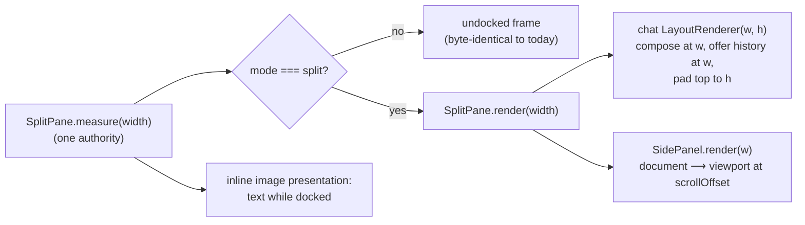

# Side panel: implementation specification

Status: draft r10 for critique, 2026-09-27. Implements the docked side panel
decided in `/home/shayna/repos/marineris-utopia/NOTES/sidebar-decisions-r1.md`
on the basis of `/home/shayna/repos/marineris-utopia/NOTES/sidebar-feasibility.md`.
Runs on its own branch (`feat/side-panel`), in parallel with
`docs/specs/mixture-of-agents.md`; the only coupling is the section hook in §9.

Every path is relative to the repo root. Symbols and line numbers were read
from the tree on 2026-09-27; every cited seam was verified against code.

## Revision log

**r10** fixes the one finding both critics agree on in r9.

| Finding | Disposition |
| --- | --- |
| G9.1 / A9.1 (major) a placement not re-emitted this paint (its APC line retired into history, written with `frameRow = −1`) never rebases its stored row after the scroll; top 5 → scroll 2 → scroll 4 leaves the stored row at 5 and `cellsArchived` false while the real top is −1, so a later dock can `d=i` archived cells | **Fixed.** After the `snapshotRow < pushed` comparison, `observeRetirement` shifts every surviving snapshot row whose id is not in this pass's re-emitted set by `−pushed` and marks it archived if the result is negative; re-emitted rows already carry their remaining-scroll value and are not shifted again (§3.3 step 6). §8.2 gains case (2c) with Astra's sequence. The remaining-scroll formula for new emits is unchanged. |

**r9** fixes the regression both critics found in r8 and adds MoA's
terminal predicate to §9 (wording supplied by the MoA lane).

| Finding | Disposition |
| --- | --- |
| G8.1 / A8.1 (major) r8 normalized rows recorded during the paint by the whole paint's `pushed`, but a row emitted at the clamped cursor has already absorbed part of that scroll (height 10, 20 history rows, 5-row image at viewport index 4: attaches at physical 5 with 5 scrolls remaining, final top 0, but `5 − 20` marked it archived and (1c) failed) | **Fixed.** New attachments are normalized by the scroll **remaining after each one's emission**, `remaining = pushed − max(0, c − (height − 1))` with `c` the unclamped running cursor (`:2903`), passed through `#lineRewriteSequence` → `#imageLineSequence` → `resolvePlacementEmit` (0 on the diff path); the stored row is `attachTopFrameRow − remaining`, negative ⇒ archived at emit. Only the paint-start snapshot compares against total `pushed` (§3.3 step 6). §8.2 gains case (1d) with the worked example and its straddling twin. |
| MoA terminal predicate (§9, wording from the MoA lane via Main) | **Applied.** The projection calls `isMixtureRunComplete(branch, runId)` from `moa/restore.ts` and quotes its definition verbatim; `run_end` is not part of the predicate and the panel never reads it for state; `run_reset` stays unconditional. Projection: `run_reset` → empty; complete → ended; otherwise → by header status (covers errored runs). §8.5 gains the `/tree`-onto-final-assistant case and reworks "completed run" around the predicate. |

**r8** makes exactly one change, requested by Grok on r7 as a
coordinate-contract rule and held by Astra: the full-rewrite viewport loop
keeps today's emission row (the running cursor clamped to `height - 1`,
`tui.ts:2918-2925`) as `screenRow`, and `frameRow` is passed in that same
space; `newTop + index` is used only on the diff path, where the write
cannot scroll. Grok's argument that the affected configuration is
unreachable (pressure retires settled components whole,
`transcript-container.ts:540-564`; `assistant-message.ts:707-712`) is
recorded here as the reason this is a no-regression rule rather than a live
bug; the rule stands either way because it leaves the encoder's crop input
untouched. The retirement comparison is restated in the same physical
space, with `observeRetirement` shifting rows recorded during the paint by
`-pushed` so stored rows are always post-scroll (§3.3 step 6). Nothing else
changed; §9's errored-run case is already the "no committed lifecycle
record → by header status" branch.

| Finding | Disposition |
| --- | --- |
| G7.1 / Astra r7 (major) r7 passed `screenRow = newTop + index` on the full-rewrite path, which the encoder reads as the physical write row for its crop; on a scrolling rewrite the APC is written at the clamped running cursor before the scroll | **Fixed.** `screenRow` unchanged on both paths; `frameRow = min(screenRow, height - 1)` on the full-rewrite path and `newTop + index` on the diff path; `:2629` unchanged; retirement compares snapshot rows against `[0, pushed)` and normalizes this paint's recorded rows by `-pushed`, flagging a row that goes negative as archived at emit (§3.3 step 6, Phase 0 acceptance, §8.2 (1)/(1c)/(2) unchanged in outcome). |

**r7** folds Grok's r6 finding (`NOTES/sidebar-reviews/`, relayed by Main)
and `NOTES/moa-reviews/astra-r5-both.md` §2 (Astra r6, S1 only). Both
accept pause-from-`run.status`, the rebuild retransmit, the SIXEL pane
fallback, the lifecycle projection, and R3.1.

| Finding | Disposition |
| --- | --- |
| G6.1 / Astra r6 S1 (major) `observeRetirement` compared against `lastAttachTopFrameRow` **after** the write overwrote it with the new epoch, and read `#providerViewportTop` **after** `:2965` replaced it; and the r6 text described the attach formula as if `frameRow` were the block's top row, so a fully visible image would have computed a negative attach top and read as unknown provenance (case (1) fails) | **Fixed.** `#emitPlanFrame` snapshots every watched placement's `lastAttachTopFrameRow` and the pre-update `#providerViewportTop` at the top of the paint; `observeRetirement(snapshot, max(0, pushed − previousViewportTop))` runs after the write and **before** `:2963-2966`; the comparison uses the snapshot, i.e. the previous epoch's attachment. The attach formula at `:2629` is stated to be unchanged and correct: the APC line is the block's **last** row (`image.ts:821-828`), so `frameRow = index`, `screenRow = newTop + index` yield the block's first visible row (§3.3 step 6). |
| Astra r6 (case) an image introduced in the same paint that scrolls old text away, then dock | **Added** as §8.2 case (1c): its placement is fully live (no snapshot entry marks it; the next paint's snapshot carries a defined attach row) and the dock issues exactly one `d=i` for it. |
| Astra r6 (note) the lifecycle projector must follow MoA's corrected commit contract (run_end tied to the response commit) | **Applied.** §9 is phrased in terms of the run's **committed lifecycle record** as MoA §4.8 defines commitment, never a raw `run_end`; an uncommitted terminal record is ignored and the run hydrates as in progress/paused by header status. |


**r6** folds `NOTES/sidebar-reviews/astra-r5.md` (A5.1–A5.3, NOT SATISFIED
on r5; Grok is SATISFIED with r5), Main's approved alignment to MoA r4
§4.8 lifecycle records (M5), and Shayna's decision on the S2 exception
(`sidebar-decisions-r1.md` "r2": allow brief overhang).

| Finding | Disposition |
| --- | --- |
| A5.1 (major) `cellsArchived` is never maintained on the provider path (`tui.ts:2880-2925` pass `-1/-1`; `observeCommitWatermark` has no production caller), so the r4/r5 `d=i` rule would delete a placement with archived cells | **Fixed.** Verified. §3.3 step 6 now specifies the accounting that makes the flag authoritative: (1) attachment — `#emitPlanFrame`'s viewport loops pass `frameRow = index`, `screenRow = newTop + index` so `resolvePlacementEmit` records `lastAttachTopFrameRow` in viewport-row space; history rows still pass `-1`; (2) retirement — a new `ImageBudget.observeRetirement(pushedViewportRows)` called once per painted frame with the count of previous-viewport rows this paint scrolled off (`max(0, pushed - #providerViewportTop)` from `:2898`; 0 on the diff path), setting `cellsArchived` when `lastAttachTopFrameRow < pushedViewportRows`. Unknown provenance (`lastAttachTopFrameRow === undefined`: pre-accounting, alt screen, resize `-1` paints) is treated as archived and never deleted. §8.2 cases (1)/(2) are now real `Composer`→`TUI` paints through `VirtualTerminal` that scroll the block before docking and observe `graphicsPlacements()`; a new case (2b) covers unknown provenance. |
| A5.2 (major) pause banner from the last `limit` card, not run status; no pause → resume → complete case | **Fixed.** Banner iff the newest trace header's `run.status === "paused"` and no `run_end`; the limit name is decoration from the newest pause-limit card. A steering resume publishes `running` headers and drops it; `run_end` marks completion. §8.5 gains pause → resume → complete, live vs hydrated (§9). |
| A5.3 (minor) §8.2 case (4) promised "no retransmit" under rebuild, but `#forgetTransmittedForPendingReset` (`tui.ts:3120-3124`) forces one | **Fixed.** Case (4) asserts the replay contains the placements and **does** retransmit (the reset opens with `d=A`, so the data must be re-sent); the "no retransmit" claim moves to case (1) under `append`/`preserve` where `d=i` keeps the data resident. §3.3 step 6 states it. |
| M5 alignment (approved by Main) | **Applied.** `projectMixtureTrace` takes, on the same branch walk, the newest `runId` from either `mixture_trace` cards or `mixture_run` entries and that run's newest `mixture_run` lifecycle record: `run_reset` → empty projection; `run_end` → hydrate + `markEnded(endReason)`; neither → in progress/paused by header status. Live `reset()` on `/mixture reset` and `markEnded` on `mixture_run_end` match. New §8.5 (MoA branch): reset never resurrects; completed run identical live and reloaded; pause → resume → complete; newest run wins (§9). |
| S2 (Shayna, `sidebar-decisions-r1.md` "r2") | **Decided: allow brief overhang.** The straddling placement is kept; its live part may overlap the new layout by at most one image height until the next rebuild or scroll-out. Deleting the whole placement and forcing a rebuild for that dock were both rejected. Recorded as Decision R3.1 (§1, §3.3 step 6, §11, §12). The accounting that makes "straddling" a known fact (A5.1) stands: unknown provenance is never deleted. |

**r5** folds `NOTES/moa-reviews/astra-r4-both.md` "Sidebar round 3" (S1, S2;
reviewed r3, so both overlap G3.1/G3.2 and are folded for what r4 still
missed) and `NOTES/sidebar-reviews/grok-r4.md` (G4.1, G4.2). Grok accepts
G3.1–G3.3; Astra closes A2.2, A2.4, and A2.3's branch/newest-run fix.

| Finding | Disposition |
| --- | --- |
| S1 (major) the r4 column-wide mask runs on the composer's assembled viewport, which is **after** the transcript has clipped a block's head (`transcript-container.ts:402-405`, `:411-413`, `:605-609`) and is not the source of history batches (`:447-464`); a clipped start row leaves continuation rows unclassifiable and history unsanitized | **Fixed, moved.** The SIXEL fallback now lives in `formatOutputPaneLines` (`render/output-pane.ts:63-115`), the one chokepoint every raw-passthrough producer renders through (`OutputPane.render`, `code-cell`, `tools/bash`, `tools/eval`, `tools/mcp`, `tools/default-renderer`), where `sixelMask` is already computed from the **full logical block** before any capping (`:66-68`). Gated on the scoped presentation mode, it turns each span into label + blanks and hands the rest of the pipeline plain text, so live viewport (clipped or not), retirement batches, and replays all see the transformed rows; the producer's raw `#outputLines` are untouched for undocked frames. The composer keeps **no** row guard. §8.2 case (5) is extended to a start clipped offscreen and to retirement/replay (§3.3 step 6). |
| S2 (major) a direct placement with some cells archived and some live | **Stated, accepted.** A Kitty placement is one object and `d=i` removes all its cells including scrollback; no primitive trims a placement to its live rows. So a straddling placement is left in place (no delete of any kind), its live rows repaint as fallback text underneath, and the graphic overhangs until a rebuild replay or full scroll-out. Bounded by one image height, `append`/`preserve` only, only when an image straddles the viewport top at dock time; recorded in §11 under Decision 6. §8.2 case (2) asserts the placement is still listed and its scrollback bytes are identical (§3.3 step 6). |
| G4.1 (major) §8.2 image case (1) required a `d=i` without naming the policy, but the default `rebuild` resets with `d=A`/`d=I` | **Fixed.** Case (1) is scoped to `append`/`preserve`. A new case (1b) under `rebuild` asserts the reset's `d=A` (`tui.ts:2831`), the `d=I`s `takeResetPurgeIds` emits (`:2836`), empty viewport placements, the text fallback in the replay, and **no** `d=i`. |
| G4.2 (minor) §9 line numbers pointed at MoA §6.2 after the MoA file moved again | **Fixed by removal.** §9 cites MoA by section name only (§7.1, §7.2, §4.8). The MoA spec is under concurrent revision; line numbers in a cross-spec citation have been wrong in three consecutive rounds and will not be reintroduced. |


**r4** folds `NOTES/sidebar-reviews/grok-r3.md` (G3.1–G3.3), NOT SATISFIED
on r3. G2.1, G2.2, and the `try/finally` image scope are accepted; the
`observe()`-before-text ordering is accepted as the reason `d=I` is not the
dock path.

| Finding | Disposition |
| --- | --- |
| G3.1 (major) the SIXEL guard tested `isSixelLine` per row and so caught only the start row of a multi-line payload | **Fixed.** The guard runs `getSixelLineMask` (`render/sixel.ts:29-41`, the span tracker `bash-execution.ts:367-373` already uses) over the whole chat column and replaces every masked row: first row of each span → label, the rest → blanks, same count. `isSixelLine`/`isImageLine` are not used for this (both match only a start marker, `sixel.ts:45-47`, `terminal-capabilities.ts:205-216`). Undocked rows take the mask's false branch untouched (§3.3 step 6). §8.2 case (4) is the regression. |
| G3.2 (major) painting fallback text does not remove a direct Kitty placement; text erases leave it painted (`terminal-capabilities.ts:1065`, `:1073`) | **Fixed.** Keep the no-`d=I` rule. When a placed image renders as text while docked, the frame emits `encodeKittyDeletePlacement(imageId, epoch)` (`d=i`, `:1081-1087`, keeps the transmitted data) for each placement whose cells are still entirely in the mutable viewport — the budget already knows both facts per image: `epoch` is the live `p=` id and `cellsArchived` says whether any attached cell entered scrollback (`image.ts:529-559`). A placement that has archived is left alone; its scrollback cells stay, which is the append/preserve rule. Unicode-placeholder terminals need no delete (the placeholder cells are overwritten); direct-placement terminals get the `d=i` (§3.3 step 6). §8.2 asserts through `VirtualTerminal.graphicsPlacements()` (`test/virtual-terminal.ts:363-372`). |
| G3.3 (minor) §9 cited MoA §4.7 for the restore scan; `MixtureTraceDetails` is now a union | **Fixed.** §9 cites §4.8 (`restoreMixtureRun`, `:1190-1197`) and states that the panel applies that branch walk to `mixture_trace` cards while the engine applies it to `mixture_run` entries; `MixtureTraceDetails` is the union at `:1562-1571`; totals read `run.usd` from the trace header (`:1574-1577`), never a sum across kinds; the pause banner is `kind === "limit" && action === "pause"` (`:1578-1579`). |

**r3** folds `NOTES/moa-reviews/astra-r3-both.md` "Sidebar round 2" (A2.1–A2.4)
and `NOTES/moa-reviews/grok-r3-both.md` "sidePanel" (G2.1–G2.3), both NOT
SATISFIED on r2 with specific cases; no redesign requested. Both accept the
single measurer, `Row`-width composition, document+viewport scrolling, the
virtual-width refresh, preserve semantics, the maintained HUD, the rect
mouse gate, targeted overlay ownership, and the G3 rebuttal.

| Finding | Disposition |
| --- | --- |
| A2.1 (major) image gate: raw SIXEL passthrough bypasses `Image`; process-global mode leaks into fullscreen overlays; budget accounting under append/preserve | **Fixed in r3, corrected in r4.** (i) The mode is no longer global state anyone reads: it is set **and restored** around the docked composition only (`try/finally` in `renderFrame`/`renderResizeFrame`), so an overlay frame (`tui.ts:3091-3102` returns before the provider runs) never sees `"text"`; the r2 risk note is withdrawn. (ii) Raw SIXEL rows, reachable only with `PI_FORCE_IMAGE_PROTOCOL=sixel` + `PI_ALLOW_SIXEL_PASSTHROUGH` (`render/sixel.ts:16-19`) through `bash-execution.ts:377` and `tool-execution.ts:1322`, are caught by a chat-column guard — r3 wrote it as a per-row `isSixelLine` test, which G3.1 showed catches only the start row; r4 uses `getSixelLineMask` over the whole span. (iii) Accounting: the `"text"` decision is applied **after** `budget.observe()` (`image.ts:311-327`) so the slot and the pass-suppression ledger are unchanged, and `#passShowsLive` (`:384-393`) still reports the image live; therefore `#retire` (`:408-412`) never issues `d=I` because of docking. r3 claimed a fallback repaint alone clears the viewport; G3.2 showed a direct placement survives a text repaint, so r4 adds the placement-scoped `d=i`. §8.0/§8.2 add raw SIXEL, image-before-dock, image-while-docked, and image-bearing-overlay-above-dock cases (§3.3 step 6). |
| A2.2 (major) fullscreen close has no controller-state transition; resize changes the toggle's meaning while it is open | **Fixed.** One idempotent `closeFullscreen()` on the controller clears the stored handle and hides exactly that overlay; the component receives it as `onClose` and calls it for Escape and the toggle key; `toggle()` checks `fullscreenOpen` **before** the wide/narrow branch (§3.4, §3.5). §8.3 exercises Escape → reopen, open narrow → widen → `alt+t`, and close with a dialog stacked above. |
| A2.3 (major) hydration boundary differs from live | **Fixed.** One projection for both: active branch (`sessionManager.getBranch()`, `session-manager.ts:3110-3112`) scanned backwards to the first `reset_boundary`, newest `runId` only, exactly MoA's `restoreMixtureRun` scan (M §4.7, `:1084-1086`); `hydrate` runs at the same three transitions as the run store (load, leaf change, `/clear`), via the same reload hook `reloadTodos` uses (`interactive-mode.ts:7526-7529`). Live `reset()` on a new `runId` matches. Product is single-run history, stated (§9). |
| A2.4 (minor) side-flip test contradicted append behaviour | **Fixed.** §8.2 expects **no** appended history for a pure side flip in any mode, and the panel at column 0. |
| G2.1 (major) `setSidePanel(undefined)` is both user undock (must replay) and teardown (must not ED3) | **Fixed.** `setSidePanel(panel, dock, { refreshHistory = true })`; `dispose()` passes `false` and requests no render; teardown order stated: controller `dispose` runs while the TUI can still paint, so the flag, not `#stopped`, prevents the ED3 (§3.3 step 5, §3.4). |
| G2.2 (major) full-height test described a non-reset write under the default rebuild policy | **Fixed.** §8.2 "full-height column" split by policy: rebuild → scrollback is one replay at the new chat width, viewport exactly `rows` rows, panel title on row 0; append → growth is the replay batch; preserve → pre-dock bytes untouched and the full-height write retires exactly the committed rows that were above the old viewport (the G3 math). |
| G2.3 (minor) §9 MoA line numbers were the previous revision | **Fixed.** §9 cites MoA §7.1/§7.2 and §4.7 by section, with the current lines (`MixtureTraceDetails` `:1424-1442`, events `:1490-1494`, hook `:1499-1504`, restore scan `:1084-1086`) noted once as of 2026-09-27. |

**r2** folds `NOTES/sidebar-reviews/grok-r1.md` (G1–G6) and
`NOTES/sidebar-reviews/astra-r1.md` (A1–A9), both NOT SATISFIED on r1.

| Finding | Disposition |
| --- | --- |
| G1 / A1 (blocker/major) two chat-width measurers; chat closure ignored `Row`'s width; settings could not update the constructed split | **Fixed.** `Composer` owns the `SplitPane`; it is the only measurer. The chat column is a `LayoutRenderer` that composes **at the width `Row` passes** and offers history at that width. `resolveSidePanelGeometry`/`SidePanel.measure` deleted; `sidePanelGeometry()` returns the rects `SplitPane.render` recorded. When `measure(width).mode !== "split"` the split is **bypassed** and the frame is the undocked frame byte-for-byte (§3.3). Sizing setters and side-change rebuild are specified (§3.3 step 5); §8.0/§8.2 add the constrained-ratio (110 cols, ratio 0.6 → 47/60), live side-flip, and narrow-with-short-viewport cases. |
| G2 / A2 (blocker/major) rebuild keyed on panel identity; virtual width changes never replayed; `preserve` given replay semantics | **Fixed.** `setSidePanel(panel, dock)` diffs the resolved `(docked, side, chatWidth)` before/after applying `dock`; any `chatWidth` change calls `TUI.refreshHistoryAfterWidthChange()`, the extracted policy body of `#prepareResizeReplay` (§3.6): rebuild clears and replays once, append replays once, **preserve repaints only**. A physical resize and a dock change coalesce: rebuild through the existing `clearScrollback` latch (`tui.ts:2151-2154`), append through `Composer.beginHistoryReplay` becoming a no-op while a replay batch is already pending (`#rerenderOfferedHistory` re-renders it at the latest width, `composer.ts:671-688`). §8.2 verifies all three policies on a live ratio edit. |
| G3 (major) fullscreen-overlay analogy; preserve/append | **Fixed** as above; full height stated as the consequence of returning exactly `rows` rows (`newTop = 0`, `tui.ts:2823`). **Rebutted** the sub-point that the dock frame must not carry a non-replay batch: an append batch of K rows on a full-height frame writes K + `rows` rows from `startTop` (`tui.ts:2898-2928`), scrolling exactly `startTop + K` rows off — old history plus the K new history rows, the designed retirement. Not suppressed. |
| G4 / A3 (major/**blocker**) image gate did not give the text fallback, missed new components, missed `splitAt` crossings, missed bash output | **Fixed, redesigned.** A module-level **inline image presentation mode** in `packages/tui/src/components/image.ts` (`"graphics" \| "text"`) that `Image.render` honours through its existing suppression branch (`image.ts:767`, `:833-835`), so every producer (`assistant-message.ts:889`, `bash-execution.ts:327`, `tool-execution.ts:1214`) and every future or rebuilt component falls back to `#fallbackLines()`. The **composer sets the mode at the top of every frame** from the same `SplitPane.measure` that decides docking, so it follows dock/undock, settings edits, and resize crossings with no controller ordering to get wrong. `terminal.showImages` is untouched (§3.3 step 6). Stale `#renderedGraphicRows` accepted as blank reserved rows (§11). |
| G5 / A9 (major) MoA hook stale; summary-only panel cannot replace cards | **Fixed.** §9 targets MoA §7.1–7.2: `MixtureTraceDetails`, all seven events including `mixture_checkpoint`, `hydrate()` from persisted `mixture_trace` entries on load, registered once and never unregistered on `run_end`. Hop rows are **mouse-expandable** through the section's `routeMouse` (retained `output`), so `moa.show_trace_cards = false` + panel is viable for `tui.mouse` users without reopening Decision 7; the default keeps cards on. Depends on the MoA event/persistence capability, not the "M6" label. |
| G6 (minor) pad + `align: "end"`; R2.2 mechanism | **Fixed.** Padding once, in the chat closure; `Row` alignment default. R2.2 states the real mechanisms (alt-screen restore for fullscreen, compositing for non-fullscreen); §8.2 tests both. |
| A4 (major) panel scrolling could not reach todo overflow | **Fixed, redesigned.** The panel is a **logical document** (every section at natural height) shown through a viewport using `packages/tui/src/components/scroll-viewport.ts` (`clampScrollOffset`, `viewportRange`, `scrollbarThumbRange`). One scroll state; wheel, `app.sidebar.scroll*`, and the fullscreen form all call `scrollBy`; row→section map for hit testing after scroll (§3.2). `SidePanelSection` loses `height/grow/minHeight/maxHeight`. §8.1 proves the last todo of a tall list becomes visible and stays clamped after shrink/collapse/resize. |
| A5 (major) HUD cleared while docked and never rebuilt; `/todo expand` reveal lost | **Fixed.** `#renderTodoList` always rebuilds the HUD container **and** updates the section; `TodoHudContainer.render` returns `[]` while `composer.sidePanelDocked`, so the hidden representation is always current. `/todo expand\|collapse` are unchanged (reveal, timer cancel, persistence at `interactive-mode.ts:7463-7507` all kept; the "existing message" claim was wrong and is withdrawn). Reconciliation paths enumerated (§6). |
| A6 (major) mouse routing lacked viewport validity, divider handling, hover clearing, fullscreen offsets, overlay handle | **Fixed** (§3.4, §3.5): hit-test only against a non-empty mutable viewport and in-range row; divider/pad columns consumed as no-ops; chat hover target cleared on entering non-chat columns; fullscreen form translates its title row and keeps its `OverlayHandle` (`tui.ts:1107-1123`) for targeted close. |
| A7 (major) collapsed-state persistence had no contract; `order` persistence bogus | **Fixed by removal.** Collapsed state is process-lifetime only; persistence is a non-goal. Todo dismissal stays the existing todo-specific concept (§2, §7 Phase 2). |
| A8 (minor) host API incomplete; detached panel misses invalidation | **Fixed.** `onChange` via constructor; controller exposes `scrollBy` and `fullscreenOpen`; host interface trimmed (no image callbacks — the composer owns the mode). `SidePanelController.invalidate()` is called from the theme/glyph handlers beside `ui.invalidate()` (`interactive-mode.ts:2033`, `:2055`) and `dispose()` at teardown (§3.4); §8.3 verifies a theme change re-renders a cached section. |
| A (verification) | §8.2 click-span test compares hit targets at painted positions; the image test uses a real `Image` under `ImageProtocol.Kitty` (pattern: `packages/tui/test/image-render.test.ts:58`). |

Consequences: r1's "no `tui.ts` change" becomes one 14-line extraction (§3.6);
`image.ts` gains a 10-line mode setter; `SidePanelSection` is simpler.

## 0. Summary and the one fact everything follows from

npi keeps the transcript in **native terminal scrollback**: the frame provider
(`Composer`, `packages/tui/src/prompt/composer.ts:208`) hands the renderer an
immutable `HistoryBatch` plus a mutable viewport each frame, and the renderer
writes history exactly once and diffs only the viewport
(`packages/tui/src/tui.ts:1-13`, `docs/tui-core-renderer.md` §1–§2). A side
panel therefore

1. lives only in the **mutable viewport**, composed **inside** the provider's
   frame with the existing `SplitPane`/`Row` layout components
   (`packages/tui/src/components/layout/`), never as an overlay;
2. changes the **width at which transcript rows retire** into history, so any
   change of the chat width (dock, undock, ratio, side) is handled exactly
   like a settled width resize: the same history-refresh entry, the same
   `tui.resizeScrollback` policy (Decision 4);
3. returns a viewport of exactly `rows` rows while docked (Decision 5), which
   pins the viewport top to screen row 0 (`newTop = max(0, min(startTop +
   history, height - rows))`, `tui.ts:2823`); the first docked frame's write
   scrolls whatever history was still on screen into scrollback
   (`tui.ts:2893-2928`).

Two per-frame facts are decided once, by one measurer, before anything is
composed: **is this frame docked** and **are inline images graphics or
text**. Everything else reads them.



## 1. Decisions applied

Round 1 (feasibility report §6), Round 2 (r1 §12), and Round 3 (the S2
exception after Astra r5), all answered in `sidebar-decisions-r1.md`.
Nothing is pending.

| # | Decision | Where it lands |
| --- | --- | --- |
| 1 | Right side, setting to flip | `sidebar.side` (§4); `SplitPane` child order and size key (§3.3 step 5) |
| 2 | Ratio with bounds ≈ 0.3 / min 32 / max 48 | `sidebar.width.*` (§4) → `SplitPaneSize` on the panel pane (§3.1) |
| 3 | `splitAt` 110, configurable; below it auto-hide, toggle opens fullscreen | `sidebar.splitAt` → `SplitPane.splitAt` + `narrowPane` (§3.3); `SidePanelController.toggle` (§3.4); fullscreen form (§3.5) |
| 4 | Rebuild scrollback, following the resize policy | `TUI.refreshHistoryAfterWidthChange()` (§3.6), called by `Composer.setSidePanel` on any chat-width change (§3.3 step 5) |
| 5 | Full terminal height while docked | chat closure pads to `h`; `SplitPane.setHeight(rows)` (§3.3 step 2) |
| 6 | Text fallback for inline images while docked | inline image presentation mode set per frame by the composer (§3.3 step 6) |
| 7 | Display-only; focusable later | No `Focusable` on `SidePanel`; keys are global listeners (§3.4); mouse expansion covers MoA output (§9); §10 names the later seam |
| 8 | Todo moves into the panel; HUD stays as the narrow fallback | `TodoSection` (§6) |
| 9 | Own lane, todo first, MoA trace once its events exist | Milestones (§7), MoA hook (§9) |
| R2.1 | Toggle key `alt+t` | `app.sidebar.toggle` (§5) |
| R2.2 | Panel stays docked under overlays | No code. Fullscreen overlays borrow the alt screen and the normal buffer with the docked frame is restored on close (`tui.ts:409-418`); non-fullscreen overlays composite over the joined viewport (`tui.ts:2673`, `2502-2528`). §8.2 tests both. |
| R2.3 | Empty panel stays docked with a dim placeholder row | `SidePanel.render` placeholder (§3.2); §8.1 "empty placeholder" |
| R3.1 | Straddling Kitty placement under `append`/`preserve` at dock time: allow brief overhang (keep the scrollback image; live part overlaps by at most one image height until the next rebuild or scroll-out); no whole-placement delete, no forced rebuild | §3.3 step 6 "otherwise" branch; §11 |

## 2. Files

New:

| File | Contents |
| --- | --- |
| `packages/tui/src/chrome/side-panel.ts` | `SidePanel`, `SidePanelSection` |
| `packages/tui/src/chrome/side-panel-fullscreen.ts` | `SidePanelFullscreenComponent` (§3.5) |
| `packages/coding-agent/src/modes/controllers/side-panel-controller.ts` | `SidePanelController` |
| `packages/coding-agent/src/modes/side-panel/todo-section.ts` | `TodoSection`, `renderTodoLines` (§6) |
| `packages/tui/test/split-pane-right-size.test.ts` | §8.0 |
| `packages/tui/test/side-panel.test.ts` | §8.1 |
| `packages/tui/test/composer-side-panel.test.ts` | §8.2 |
| `packages/coding-agent/test/side-panel-controller.test.ts` | §8.3 |
| `packages/coding-agent/test/todo-section.test.ts` | §8.4 |

Changed:

| File | Change |
| --- | --- |
| `packages/tui/src/tui.ts` | extract `refreshHistoryAfterWidthChange()` from `#prepareResizeReplay` (§3.6); `#emitPlanFrame` passes real `frameRow`/`screenRow` to viewport rewrites and snapshots attachments before the row loops, passes `frameRow` in `screenRow`'s space (`screenRow` itself unchanged) plus the per-row scroll `remaining`, and calls `ImageBudget.observeRetirement(snapshot, pushed)` after the write and before the provider-state update (§3.3 step 6) |
| `packages/tui/src/components/image.ts` | `setInlineImagePresentation` / `getInlineImagePresentation`; `Image.render` honours `"text"` after `budget.observe()`; `ImageBudget.snapshotAttachments()`, `observeRetirement(snapshot, pushed)` (paint-start snapshot vs total `pushed`, then rebases rows not re-emitted this pass by `−pushed`), `resolvePlacementEmit(…, remaining)` (stores the post-scroll row), `takeDockedPlacementDeletes()` (§3.3 step 6) |
| `packages/tui/src/components/layout/split-pane.ts` | `rightSize`, `leftMinWidth`, `setRightSize`, `setLeftMinWidth` (§3.1) |
| `packages/tui/src/prompt/composer.ts` | `SidePanelDock`, `setSidePanel(panel, dock, { refreshHistory })`, `sidePanelGeometry`, `sidePanelDocked`; chat column as a `LayoutRenderer`; join in `renderFrame`/`renderResizeFrame` with the scoped image mode; hover band on the chat column; `beginHistoryReplay` no-op while a replay is pending (§3.3) |
| `packages/tui/src/render/output-pane.ts` | `formatOutputPaneLines` renders SIXEL spans as label + blanks when the presentation mode is `"text"`; `OutputPaneFormatOptions.sixelContinuation` forwarded to `getSixelLineMask(lines, startsInside)` (§3.3 step 6) |
| `packages/tui/src/render/sixel.ts` | `getSixelLineMask(lines, startsInside = false)` (§3.3 step 6) |
| `packages/tui/src/chat/bash-execution.ts` | records SIXEL span provenance across the streaming cap and passes `sixelContinuation` to its output pane (§3.3 step 6) |
| `packages/tui/src/chrome/index.ts` | `export * from "./side-panel"` (the root barrel exports no chrome module; consumers import `@oh-my-pi/pi-tui/chrome`, the package's `"./chrome"` export) |
| `packages/tui/src/app-keybindings.ts` | `app.sidebar.toggle`, `app.sidebar.scrollUp`, `app.sidebar.scrollDown` (§5) |
| `packages/coding-agent/src/modes/settings.ts` | `cfgSidebar*` (§4) |
| `packages/coding-agent/src/modes/interactive-mode.ts` | construct controller, mount, settings-change dispatch, theme/glyph invalidate, teardown, `TodoHudContainer` gate, todo section updates (§3.4, §6) |
| `packages/coding-agent/src/modes/controllers/input-controller.ts` | column-gated inline mouse, toggle/scroll listeners (§3.4) |
| `packages/tui/README.md` | one row in the Composition table for `SidePanel` |

Non-goals: alternate-screen chat, a focusable panel, drag-to-resize,
any persistence of panel state (collapsed sections are process-lifetime),
changes to `terminal.showImages` semantics.

## 3. Design

### 3.1 `SplitPane.rightSize`

`SplitPane` constrains only the left pane (`SplitPaneSize` on `leftSize`,
`packages/tui/src/components/layout/split-pane.ts:22-28`; `measure` at
`:249-255` sizes the constrained pane from `floor(width × ratio)` of the full
width and gives the other pane the remainder of `splitAvailable`, which
excludes prefix/divider/suffix, `:231`; `:237-239` decides feasibility from
the two minimums and `:254` shrinks the constrained pane to preserve the
other pane's minimum). A right-docked panel of bounded width needs the
mirror. Add:

```ts
export interface SplitPaneOptions {
  …
  /** Constraints for the right pane. Mutually exclusive with `leftSize`. */
  rightSize?: SplitPaneSize;
  /** Minimum content width reserved for the left pane when `rightSize` is set. */
  leftMinWidth?: number;
}
```

`measure()` gains the mirrored branch: with `rightSize`, `desired =
rightSize.fixed ?? floor(width × rightSize.ratio)`, clamped to
`[rightSize.min, rightSize.max]` and to `splitAvailable - leftMinWidth`;
`leftWidth = splitAvailable - rightWidth`. `canSplit` uses `leftMinWidth +
rightMinimum`. Worked example (A1): width 110, divider 3, ratio 0.6, bounds
32–48, `leftMinWidth` 60 → `splitAvailable` 107, desired 66 → 48 → min(48,
107 − 60 = 47) = **47**, chat **60**, mode `split`. `setRightSize()` and
`setLeftMinWidth()` mirror `setLeftSize()`/`setRightMinWidth()` (`:164-197`).
The constructor throws when both `leftSize` and `rightSize` are given.
`render()` (`:308-348`) already reconfigures the `Row` from
`measured.left.width` and is unchanged. Existing callers all pass `leftSize`.

This is the **only** place chat and panel widths are computed. Every other
number in this spec is read back from `SplitPane` (`mode`, `leftWidth`,
`rightWidth`, `dividerCol`, `:127-145`; rects via `Row.childRect`,
`row.ts:105-108`).

### 3.2 `SidePanel` (`packages/tui/src/chrome/side-panel.ts`)

Content only; it knows nothing about dock geometry.

```ts
/** One registered section of the docked panel. */
export interface SidePanelSection {
  /** Stable id used by consumers to update or remove the section. */
  readonly id: string;
  /** Title row text; rendered through `theme.fg("accent", …)` with a rule. */
  readonly title: string;
  /** Content at natural height. A component may also implement MouseRoutable. */
  readonly content: LayoutContent;             // Component | (width, height: undefined) => string[]
  /** Rendered as a title-only row when true. */
  collapsed?: boolean;
  /** Section order; lower first. Ties keep registration order. */
  readonly order?: number;
}

export interface SidePanelOptions {
  /** Called after any section change; the host maps it to ui.requestRender(). */
  onChange?: () => void;
}

export class SidePanel implements HeightConstrainedComponent, MouseRoutable {
  constructor(options?: SidePanelOptions);
  /** Register or replace a section by id; returns an unregister function. */
  register(section: SidePanelSection): () => void;
  unregister(id: string): void;
  setCollapsed(id: string, collapsed: boolean): void;
  toggleCollapsed(id: string): void;
  /** Scroll the document; clamped to [0, maxScrollOffset]. */
  scrollBy(delta: number): void;
  scrollTo(offset: number): void;
  get scrollOffset(): number;
  /** Total document rows from the last render (sections + titles + separators). */
  get documentRows(): number;
  get sections(): readonly SidePanelSection[];
  setHeight(height: number | undefined): void;
  render(width: number): readonly string[];     // exactly `height` rows
  routeMouse(event: SgrMouseEvent, line: number, col: number): void;
  invalidate(): void;
  dispose(): void;
  debugId: "side-panel";
}
```

Internals (one scrolling owner, A4):

- **Document.** `render(width)` builds a logical document: for each visible
  section in order, one `PanelRows` title row (`packages/tui/src/chrome/overlay-box.ts`,
  the primitive `HubFrame` uses at `packages/tui/src/overlays/hub-frame.ts:65-68`),
  then, unless collapsed, the content rendered via `renderLayoutContent(content,
  width, undefined)` (`geometry.ts:193-201`: natural height, no clipping),
  then one blank separator. A **collapsed** section does not render its
  body at all (6d7cc21d23); its visibility is decided by the row count its
  body produced the last time it was expanded, so a section collapsed while
  it had rows keeps its title row even if its content later empties, until
  it is expanded again. The exact predicate: `visible = expanded ?
  bodyRows > 0 : (neverRendered || lastExpandedBodyRows > 0)` — the
  last-known count starts as "never rendered" at registration, so a section
  registered already collapsed shows its title until its first expansion
  decides otherwise. Each document row is tagged with `{ sectionId, kind: "title" |
  "body" | "gap", bodyRow }` in a parallel array (the row→section map).
- **Viewport.** `scrollOffset` is re-clamped on every render with
  `clampScrollOffset(offset, documentRows, height)`
  (`packages/tui/src/components/scroll-viewport.ts:39-43`), so shrink,
  collapse, and resize never leave it out of range; the visible slice is
  `viewportRange(documentRows, height, scrollOffset)` (`:45-51`). When the
  document overflows, the right-most column of each visible row carries the
  thumb from `scrollbarThumbRange(height, documentRows, scrollOffset)`
  (`:105-121`), as `ScrollView` does. Rows are `fitLayoutLine`d
  (`geometry.ts:184-191`) and padded to exactly `height` rows.
- **Placeholder** (R2.3). When no section is *visible* (in the sense of
  the Document bullet: none registered, or every expanded section renders
  zero rows and every collapsed section last rendered zero), the document
  is one `theme.fg("dim", "nothing to show")` row; the panel never asks to
  be undocked, so a todo clear costs no history refresh. A section collapsed
  while it had rows therefore holds the panel out of the placeholder state
  until it is expanded and found empty.
- **Mouse.** `routeMouse(event, line, col)`: `row = line + scrollOffset`;
  wheel → `scrollBy(±3)`; a `title` row click → `toggleCollapsed`; a `body`
  row → `content.routeMouse(event, bodyRow, col)` when the content is
  `MouseRoutable` (`isLayoutMouseRoutable`, `geometry.ts:167-169`); `gap`
  rows and clicks on the scrollbar column are consumed.
- **Change notification.** `register`/`unregister`/`setCollapsed`/`scrollBy`
  call `onChange` (installed by the controller, mapped to
  `ui.requestRender()`). A section's own update path calls it **only when
  the data arrives outside a host path that already requests a render**;
  otherwise it stores state and nothing more, exactly like the HUD
  containers. Calling it from a path that already requests a render turns
  one coalesced burst into two requests (`subagent-hud-render`'s
  one-request contract; regression fixed in `414a215185`).
- `invalidate()` invalidates every section component and `PanelRows`;
  `dispose()` disposes section components. Both are called explicitly by the
  controller (§3.4) because the panel is not in the TUI child tree.

### 3.3 The `Composer` seam (`packages/tui/src/prompt/composer.ts`)

```ts
/** Dock options; the composer owns the SplitPane built from them. */
export interface SidePanelDock {
  side: "left" | "right";
  width: SplitPaneSize;        // { ratio, min, max } from settings
  splitAt: number;
  chatMinWidth: number;        // default 60
}

/**
 * Dock, re-dock with new options, or undock (`undefined`). `refreshHistory`
 * (default true) applies the resize-scrollback policy when the chat width
 * changes; teardown passes false so a quit never ED3s the user's scrollback.
 */
setSidePanel(panel: (Component & HeightConstrainedComponent & MouseRoutable) | undefined, dock?: SidePanelDock, options?: { refreshHistory?: boolean }): void;
/** True for the frame being composed / last composed when SplitPane.measure chose "split". */
get sidePanelDocked(): boolean;
/** Rects recorded by the last docked frame's SplitPane.render; undefined when undocked or narrow. */
sidePanelGeometry(): { chatRect: LayoutRect; panelRect: LayoutRect; dividerCol: number; side: "left" | "right" } | undefined;
```

State: `#sidePanel`, `#dock`, `#split: SplitPane | undefined`,
`#chatColumn: LayoutRenderer`, `#lastChatPlan: TerminalFramePlan & { padTop:
number }`, `#docked = false`.

**One measurer, one renderer.** The chat column is a `LayoutRenderer`
(`geometry.ts:33`) invoked by `Row` with the slot width and height
(`renderLayoutContent`, `geometry.ts:193-201`; `row.ts:217-220`). The body
of today's `renderFrame` (`:342-423`) moves into
`#composeChatColumn(width, rows, screenRows)`, called from that closure when
docked and directly when not. There is no pre-measure and no second formula.

```ts
renderFrame(viewport: ViewportSize): TerminalFramePlan {
  if (!this.#started || this.#stopped) return { viewport: [] };
  const width = Math.max(1, viewport.columns);
  const rows = Math.max(0, viewport.rows);
  this.#docked = this.#split !== undefined && this.#split.measure(width).mode === "split";   // (a)
  if (!this.#docked) return this.#composeChatColumn(width, rows, rows);                     // undocked or narrow: unchanged path
  const previous = getInlineImagePresentation();
  setInlineImagePresentation("text");                                                      // (b) scoped to this composition
  try {
    this.#split!.setHeight(rows);
    const joined = this.#split!.render(width);      // Row → #chatColumn(w, h) → #composeChatColumn(w, h, rows)
    this.#recordSidePanelGeometry();                // from #split.childRect / dividerCol
    return { history: this.#lastChatPlan.history, viewport: joined };
  } finally {
    setInlineImagePresentation(previous);           // never observable outside the docked frame
  }
}

this.#chatColumn = (w, h) => {
  const plan = this.#composeChatColumn(w, h ?? rows, rows);   // offers history at w
  const padTop = Math.max(0, (h ?? rows) - plan.viewport.length);
  this.#lastChatPlan = { ...plan, padTop };
  return padTop === 0 ? plan.viewport : [...blankRows(padTop), ...plan.viewport];
};
```

(a) and (b) are the two per-frame facts of §0; `measure` is memoized per
width (`split-pane.ts:218-227`), so `render` costs nothing extra. (b) is
scoped: the mode is `"text"` only while the docked composition runs and is
restored before `renderFrame` returns, so nothing else in the process ever
observes it (A2.1).

Details, numbered for review:

1. **Widths.** Inside `#composeChatColumn(w, …)` every former `width` is
   `w`: `#renderRoots` (`:360`), `#renderBelowRoot` (`:367`),
   `this.#header.render` (`:384`), `transcript.renderViewport` (`:393`),
   `#offerHistory(transcript, w, …)` (`:382`) and `#rerenderOfferedHistory(w)`
   (`:598`). Narrow mode never reaches the `Row`: the frame is the undocked
   composition at the full width, byte-identical to `sidebar.enabled = false`
   (A1's "bypass when hidden").
2. **Height.** `Row` passes `h = rows` (`row.ts:217-218`); `#composeChatColumn`
   lays out against `h` exactly as it lays out against `rows` today
   (`:393`, `:400-401`). The closure pads the **top** with blank rows to `h`
   and shifts `#lastClickSpans` by `padTop` in the same place (G6). `Row`
   alignment stays at its default; nothing else pads.
3. **Join.** `SplitPane.render(width)` (`:308-348`) reconfigures the `Row`,
   renders both panes, and records pane rects. `sidePanelGeometry()` reads
   `#split.childRect(...)` and `#split.dividerCol` after the join;
   `sidePanelDocked` is (a).
4. **Hover band.** `#paintHoverBand` (`:477-495`) runs inside
   `#composeChatColumn` on the chat rows before the closure returns;
   `theme.bgFill` (`:490`) never sees a joined row.
5. **Dock changes** (G2/A1/A2/G2.1). `setSidePanel(panel, dock, { refreshHistory = true })`:
   - `before = this.#effectiveChatWidth(columns)` where `#effectiveChatWidth`
     is `columns` when `#split` is absent or `measure(columns).mode !==
     "split"`, else the chat pane width from `measure`; `side` is recorded
     alongside. `columns` is `this.ui.terminal.columns`.
   - Apply: `panel === undefined` → drop `#split`. `side` changed, panel
     identity changed, or `#split` absent → construct a new `SplitPane` with
     the panel as the constrained pane (`{ left: chatColumn, right: panel,
     rightSize: dock.width, leftMinWidth: dock.chatMinWidth }` for `"right"`;
     `{ left: panel, right: chatColumn, leftSize: dock.width, rightMinWidth:
     dock.chatMinWidth }` for `"left"`), `splitAt: dock.splitAt`,
     `narrowPane` = the chat pane, `divider: () =>
     \` ${theme.fg("border", theme.boxRound.vertical)} \``. Otherwise update
     in place: `setRightSize`/`setLeftSize`, `setLeftMinWidth`/`setRightMinWidth`,
     `setSplitAt`.
   - `after = this.#effectiveChatWidth(columns)`. With `refreshHistory`
     (the default): if `after !== before` →
     `this.ui.refreshHistoryAfterWidthChange()` (§3.6) then
     `this.ui.requestRender(true)`; if only `side` changed →
     `requestRender(true)` (retired rows are width-only; **no** history
     refresh in any mode); otherwise `requestRender()`. With
     `refreshHistory: false` (teardown) → **nothing**, whatever changed: no
     refresh and no render request, even when the chat width is unchanged
     (G1, `7574990dca`: the post-stop undock must schedule no paint).
   - **Teardown order** (G2.1, corrected by G1 `7574990dca`).
     `InteractiveMode.stop` calls `ui.stop()` **first**, while the panel is
     still docked: `TUI.stop`'s history flush (`beginHistoryFlush`,
     `composer.ts:797-808`) composes the docked frame, so the not-yet-retired
     transcript tail reaches the terminal wrapped at the chat width it was
     painted at, never at the full terminal width. `SidePanelController.dispose()`
     runs **after** `ui.stop()` and calls `setSidePanel(undefined, undefined,
     { refreshHistory: false })`, which refreshes no history and requests no
     render; with the TUI already stopped there is nothing to paint, and the
     flag guarantees the undock cannot latch a rebuild-mode ED3 either way.
     Pinned by `packages/coding-agent/test/side-panel-teardown.test.ts`: four
     100-column unretired entries, dock at 120 columns, quit — every entry
     reaches the terminal at the 81-column chat width, no ED3.
   - **Coalescing with a physical resize** (A2). Under rebuild, the TUI's
     `clearScrollback` latch makes a second request a plain forced repaint
     (`tui.ts:2151-2154`, `:2710-2713`). Under append, `Composer.beginHistoryReplay`
     (`:560-566`) becomes a no-op when `#headerReplayPending` is already set
     or the offered batch is itself a replay; the pending replay is
     re-rendered at the latest width by `#rerenderOfferedHistory` (`:671-688`,
     `transcript.rerenderOfferedBatch`) before it is written, so one copy at
     the final width is emitted. Under preserve nothing is replayed.
6. **Images** (A3 / A2.1). `packages/tui/src/components/image.ts` gains a
   module-level presentation mode:

   ```ts
   export type InlineImagePresentation = "graphics" | "text";
   export function setInlineImagePresentation(mode: InlineImagePresentation): void;
   export function getInlineImagePresentation(): InlineImagePresentation;
   ```

   **Scope.** It is written only by the composer, inside the `try/finally`
   of the docked composition (`renderFrame` above and `renderResizeFrame`),
   and restored before either returns. The alt-screen path renders and
   returns before the provider runs (`tui.ts:3091-3102`), so an
   image-bearing fullscreen overlay opened above a dock composes in
   `"graphics"`; the git app and protocol probe likewise. It is not a policy
   anyone else reads or sets.

   **`Image`.** `Image.render` (`:758-846`) calls `#budget.observe()` exactly
   as today (`:767`) so the image keeps its display-order slot and the pass
   ledger records the budget's own decision; **then** `const textOnly =
   suppressed || getInlineImagePresentation() === "text"` selects the branch
   (`:787`, `:833-835` → `#fallbackLines()`, `:856-867`). Because the
   budget's `#passSuppression` is unchanged, `#passShowsLive` (`:384-393`)
   still reports the image live and `#retire` (`:408-412`) never deletes a
   placement on account of docking. The cache key gains `textOnly` beside
   `#cachedSuppressed` (`:772`), so flipping the mode re-renders every image
   on the next frame. Every `Image` producer in the transcript
   (`chat/assistant-message.ts:889`, `chat/bash-execution.ts:327`,
   `chat/tool-execution.ts:1214`; constructed at `event-controller.ts:1405`,
   `:1704`, `ui-helpers.ts:179`, `:619-625`) reads the mode at render, so
   existing components, components built after the dock, transcript
   rebuilds, and `splitAt` crossings all fall back.

   **Raw passthrough** (G3.1 / S1). With `PI_FORCE_IMAGE_PROTOCOL=sixel` and
   `PI_ALLOW_SIXEL_PASSTHROUGH` both set (`render/sixel.ts:16-19`), raw SIXEL
   sequences bypass `Image`: `bash-execution.ts:377`, `tool-execution.ts:1322`,
   and `tools/streaming-output.ts:933` sanitize with
   `sanitizeWithOptionalSixelPassthrough`, and every one of them renders
   through `formatOutputPaneLines` (`render/output-pane.ts:63-115`; callers:
   `OutputPane.render` `:246`, `render/code-cell.ts:102`, `tools/bash.ts:417`,
   `tools/eval.ts:519,533`, `tools/mcp.ts:96,213`, `tools/default-renderer.ts:133`).
   A libsixel payload spans several rows and only its first carries the
   `\x1bP…q` start marker, so a per-row start test (`isSixelLine`,
   `sixel.ts:45-47`; `TERMINAL.isImageLine`, `terminal-capabilities.ts:205-216`)
   sees one row of N, and a guard on the composer's assembled column runs
   **too late**: the transcript clips a block's head before the composer
   sees it (`transcript-container.ts:402-405`, `:411-413`, `renderTail`
   `:605-609`), and history batches are rendered by the transcript from the
   entries directly (`#renderStablePrefix`/`#renderRange`/`#renderReplay`,
   `:447-464`), never from the assembled viewport. A start row clipped
   above the viewport leaves continuation rows the composer cannot classify,
   and a viewport-only guard leaves history unsanitized.

   The fallback therefore lives at the one chokepoint every producer
   passes, `formatOutputPaneLines`, which computes `sixelMask` from the
   `rawLines` it is given before its own capping (`output-pane.ts:66-68`).
   Those rows are the whole block for every producer except one: while a
   bash command streams, `BashExecutionComponent.appendOutput` keeps only
   the last `STREAMING_LINE_CAP` (100) rows (`bash-execution.ts:162-165`),
   so a payload longer than the cap loses its DCS start row and a fresh
   mask over the surviving rows sees plain text. The mask therefore carries
   **one bit of provenance across the cap**: `getSixelLineMask(lines,
   startsInside = false)` starts its `inSequence` state from
   `startsInside`; `render/sixel.ts` exports the companion
   `sixelSpanContinues(lines, startsInside): boolean`, the span state the
   given rows leave behind. `BashExecutionComponent` uses it in two places
   (6854352fe2): `appendOutput` clamps each incoming chunk with the span
   state the already-stored rows leave, so a wide continuation row that
   arrives in a later chunk is preserved byte-for-byte instead of being
   truncated as text; and before each cap slice it records whether the
   first kept row is inside a span (chained across successive slices
   through the same helper; cleared only when the output is replaced
   wholesale — `setComplete` with an `output`, outside PTY mode,
   `bash-execution.ts:292-294`, `:393-396` — because a completion that
   keeps the streamed rows keeps their provenance), and
   passes that bit as `OutputPaneFormatOptions.sixelContinuation`, which
   `formatOutputPaneLines` forwards as `startsInside`. The raw rows and the
   memory bound are unchanged; the only new state is that bit. The pane
   then gains one branch, gated on the scoped presentation mode:

   ```ts
   // output-pane.ts, after sixelMask/hasSixel (:66-68), before styling
   if (hasSixel && getInlineImagePresentation() === "text") {
     let spanStart = true;
     rawLines = rawLines.map((line, i) => {
       if (!sixelMask[i]) { spanStart = true; return line; }      // non-SIXEL rows untouched
       const out = spanStart ? theme.fg("muted", "[image omitted while docked]") : "";
       spanStart = false;
       return out;
     });
     sixelMask = undefined; hasSixel = false;                     // downstream treats them as text
   }
   ```

   Consequences: the row count is unchanged (a 4-row payload becomes label +
   3 blanks; a capped streaming payload becomes label + blanks over its
   surviving rows, because the branch starts with `spanStart = true` and
   the continuation bit marks row 0 as mid-span, so the first surviving row
   carries the label),
   the underlying `#outputLines` of the producer keep the raw bytes
   (`bash-execution.ts:378`, undocked frames render them again), and
   because `Image`-free producers re-render on every frame at the composer's
   width, the transformation applies uniformly to the live viewport
   (including a block whose head was clipped by the transcript: the clip
   slices already-transformed rows), to retirement batches, and to a
   replay, all of which are composed inside the docked `try/finally` of
   §3.3. The output pane is the **only** SIXEL fallback; the composer keeps
   no row guard (a `TERMINAL.isImageLine` guard on the assembled column is
   not a multiline parser and is dropped). In the Kitty/iTerm2 paths
   `hasSixel` is false and the branch never runs; `Image` already fell back.

   **Placement accounting under each policy** (G3.2 / A5.1). Text erases do
   not remove Kitty graphics (`terminal-capabilities.ts:1065`, `:1073`), so
   repainting a row as fallback text leaves a direct placement on screen;
   only Kitty-with-Unicode-placeholders and Ghostty clear visually when the
   placeholder cells are overwritten (`getKittyGraphics().unicodePlaceholders`
   is off elsewhere). Two delete primitives exist: `encodeKittyDeleteImage`
   (`d=I`, `:1061-1070`) removes every placement of an id, scrollback
   included, and is **never** issued for docking; `encodeKittyDeletePlacement`
   (`d=i`, `:1080-1088`) removes one placement and keeps the transmitted
   data.

   *What the budget knows today, and what it does not.* `PlacementEmitState`
   (`image.ts:43-59`) carries `epoch` (the live `p=` id),
   `lastAttachTopFrameRow`, and `cellsArchived`. The flag is only ever set
   by `observeCommitWatermark` (`:499-509`) or by a `committedTo >= 0` in
   `resolvePlacementEmit` (`:545-548`), and the attach row is only recorded
   when `attachTopFrameRow >= 0` (`:554-557`). On the provider path neither
   happens: every rewrite passes `frameRow = -1, committedTo = -1`
   (`tui.ts:2880-2887`, `:2906-2913`, `:2918-2925`), and
   `observeCommitWatermark` has **no production caller**. So today
   `cellsArchived` is never true on the normal screen and would authorise
   a `d=i` for a placement that has archived cells. The r4/r5 rule as
   written was therefore not safe. Two additions make the flag
   authoritative, both confined to `#emitPlanFrame` and `ImageBudget`:

   1. **Attachment.** `screenRow` is **not changed** on either path: it is
      the physical row the APC is written at, and `encodeKittyPlacementLine`
      crops `hiddenRows = max(0, rows - 1 - screenRow)` from it
      (`terminal-capabilities.ts:1037-1046`). Diff path: `newTop + index`
      (`:2880`). Full-rewrite path: today's emission row, the running
      cursor clamped to `height - 1` (`:2921`, cursor from `:2903` advanced
      through the history rows first). `newTop + index` is never used where
      the write can scroll. The one new argument is `frameRow`, passed in
      the **same coordinate space as `screenRow`**: diff path `frameRow =
      newTop + index`; full-rewrite path `frameRow = min(screenRow, height -
      1)`, the same clamped running cursor. The existing formula in
      `#imageLineSequence` (`:2620-2641`), `attachTopFrameRow = frameRow -
      min(parsed.rows - 1, screenRow)` (`:2629`), is unchanged and yields
      the block's first visible physical row (the APC line is the block's
      last row, `image.ts:821-828`). `resolvePlacementEmit` records that row
      as `lastAttachTopFrameRow`. History rows written in the same paint
      (`:2906-2913`) keep `frameRow = -1`: they are committing, not
      attaching.
   2. **Retirement, snapshot before the write, physical rows throughout.**
      The write mutates the state this comparison needs:
      `#lineRewriteSequence` re-emits each image line and overwrites
      `lastAttachTopFrameRow` with the new epoch's row, and `:2963-2966`
      replace provider state. So, at the **top** of `#emitPlanFrame`,
      before either row loop: `const retirementSnapshot =
      this.#imageBudget.snapshotAttachments()` (a copy of `{ imageId →
      lastAttachTopFrameRow }` for every watched placement, `undefined`
      preserved). After the buffer is written and **before** `:2963`,
      `#emitPlanFrame` calls `this.#imageBudget.observeRetirement(
      retirementSnapshot, pushed)` with `pushed` from the existing
      computation (`:2898`) on the full-rewrite path and 0 on the diff path
      (`diffable` implies no history and `startTop === newTop`,
      `:2861-2867`, so nothing scrolls). Rows that leave the screen in this
      paint are physical rows `[0, pushed)` of the screen as it stood when
      the paint began, which is the space the snapshot rows are in; so for
      every snapshot entry with a defined row, `cellsArchived ||=
      snapshotRow < pushed`. **Only the paint-start snapshot compares
      against total `pushed`.** A placement recorded during this paint was
      written at a mid-paint cursor, by which time part of the scroll has
      already happened: on the full-rewrite path the unclamped cursor `c`
      (`:2903`, incremented per row) writes at `min(c, height - 1)`, and
      once `c` exceeds `height - 1` every further row scrolls the screen
      by one. So the scroll **remaining after** a row's emission is
      `remaining = pushed - max(0, c - (height - 1))`, not `pushed`. The
      viewport loop passes `remaining` alongside `frameRow`/`screenRow`
      (`#lineRewriteSequence` → `#imageLineSequence` → `resolvePlacementEmit`,
      a fourth argument, 0 on the diff path), and `resolvePlacementEmit`
      stores `lastAttachTopFrameRow = attachTopFrameRow - remaining`,
      the block's first visible row **as the paint leaves it**; a stored
      row `< 0` means the block's own top rows scroll off in the paint that
      introduced it, and that placement is marked `cellsArchived` at once.
      Worked case (Main, §8.2 (1d)): height 10, a 20-row history batch,
      a new 5-row image whose APC is at viewport index 4 → `c = 24`,
      written at row 9, 15 scrolls already done, `remaining = 5`,
      `attachTopFrameRow = 9 - 4 = 5`, stored `5 - 5 = 0`: fully live.
      A placement first emitted in this paint therefore has no snapshot
      entry to compare, but leaves the paint with a correct post-scroll
      row and a correct flag.

      **Rebase of placements not re-emitted this paint** (G9.1/A9.1). A
      placement whose APC line was not rewritten as a viewport row in this
      paint — its block retired into the history batch, so the line was
      written with `frameRow = -1` (`:2906-2913`) — records no new row,
      yet the scroll moved it. Its stored row must not go stale: after the
      `snapshotRow < pushed` comparison, `observeRetirement` sets, for
      every snapshot entry whose `imageId` is **not** in this pass's
      re-emitted set (the ids for which `resolvePlacementEmit` recorded a
      row this paint), `lastAttachTopFrameRow = snapshotRow - pushed`,
      and marks it `cellsArchived` if the result is `< 0`. Re-emitted
      placements already carry their remaining-scroll-normalized row and
      are **not** shifted again. Astra's case (§8.2 (2c)): top at 5,
      then a paint scrolling 2 in which the block's APC line retires
      (stored `5 → 3`, `5 < 2` false), then a paint scrolling 4 (`3 < 4`
      → archived; stored `−1`): a later dock issues no delete. Without the
      rebase the stored row would stay 5, never compare below `pushed`,
      and a `d=i` would take archived cells.

      This is keyed on physical scroll, the only event on the provider
      path that moves screen cells into scrollback; the destructive reset
      path skips it (it resets epochs at `:2837` instead). The call is
      made once per painted frame, including frames that rewrite no image
      line.

   *Provenance.* A placement whose `lastAttachTopFrameRow` is `undefined`
   (emitted before this accounting existed in the process, or on the alt
   screen, or during a resize transaction that paints with `-1`) has
   **unknown** provenance and is treated as archived: never deleted.

   *Rule*, in the docked frame, for every image whose `Image.render` took
   the text branch this frame and whose `#placementState` has an entry:

   - `lastAttachTopFrameRow !== undefined && cellsArchived === false`
     (every attached cell is still in the mutable viewport, by the
     accounting above): the frame prepends
     `encodeKittyDeletePlacement(imageId, epoch)` to the paint buffer,
     beside the existing purge writes (`tui.ts:2839-2843`), and the fallback
     rows are painted. The data stays resident, so undock re-emits `a=p`
     with no retransmit under `append`/`preserve`.
   - otherwise (archived, or unknown provenance): **no delete of any kind**.
     A Kitty placement is one object; `d=i` removes all of its cells,
     scrollback included, and there is no primitive that trims a placement
     to its live rows. Scrollback is immutable, so the archived part must
     stay, and the only way to keep it is to keep the whole placement. The
     block's live rows are repainted as fallback text underneath the
     graphic, which stays visible over them until a rebuild replay
     (destructive reset) or until the rows scroll fully into history.

     **Decision R3.1 (Shayna, `sidebar-decisions-r1.md` "r2"): allow brief
     overhang.** This is a visible overhang bounded by one image's height,
     only under `append`/`preserve`, only for an image straddling the
     viewport top at the moment of docking. It is the one case where
     Decision 6's text fallback cannot be delivered without destroying
     committed scrollback, and Shayna chose to keep the scrollback image:
     the live part may overlap the new layout until the next rebuild or
     until it scrolls out. Rejected alternatives: issuing `d=i` anyway
     (loses that image's archived cells) and forcing a rebuild replay on
     that dock frame (overrides `tui.resizeScrollback`). §11 carries the
     same note. The accounting above is what makes "straddling" a known
     fact rather than a guess; a placement of unknown provenance is treated
     the same way, never deleted.

   `ImageBudget` exposes the rule as `takeDockedPlacementDeletes(): string[]`
   computed at `endPass()` from the pass ledger (`#passSuppression` still
   records the budget's own decision; a parallel `#textOnly` set records
   the presentation decision per pass; provenance and `cellsArchived` are
   read from `#placementState`), and `#emitPlanFrame` drains it in the same
   place it drains `takePurgeIds()`. Under rebuild the destructive reset
   deletes all placements (`d=A`, `:2831`, plus the `d=I`s of
   `takeResetPurgeIds`, `:2836`), and `#forgetTransmittedForPendingReset`
   (`:3120-3124`) drops transmit tracking so the replay **retransmits**
   every image it shows (A5.3); the rule above therefore only fires under
   append and preserve, or on a `splitAt` crossing that preserve does not
   replay. The user's `terminal.showImages` preference is untouched
   throughout.

`renderResizeFrame` (`:538-557`) applies (a), and when docked wraps the same
`#split` render (with a closure over `#renderResizeTail(w, h)`) in the same
`try/finally` around (b); the output-pane fallback applies there as well.

The provider contract (`tui.ts:2667-2672`, throws in dev when
`viewport.length > rows`) is satisfied by construction: `SplitPane` with an
exact height returns exactly `rows` rows.

### 3.4 `SidePanelController` (`packages/coding-agent/src/modes/controllers/side-panel-controller.ts`)

```ts
export interface SidePanelHost {
  readonly ui: TUI;
  readonly composer: Composer;
  readonly settings: Settings;
  readonly keybindings: KeybindingsManager;
}

export class SidePanelController {
  constructor(host: SidePanelHost);
  /** Apply settings; called at init and from InteractiveMode's settings-change dispatch. */
  applySettings(): void;
  /** composer.sidePanelDocked */
  get docked(): boolean;
  /** `app.sidebar.toggle`: close the fullscreen form if open; else flip `sidebar.enabled` when wide, open the form when narrow. */
  toggle(): void;
  /** Idempotent: hide exactly the controller's fullscreen overlay (if any) and clear its handle. */
  closeFullscreen(): void;
  /** The fullscreen form's overlay exists (handle held). */
  get fullscreenOpen(): boolean;
  /** The fullscreen form is open and holds focus: no dialog is stacked above it. */
  get fullscreenActive(): boolean;
  scrollBy(delta: number): void;
  register(section: SidePanelSection): () => void;
  unregister(id: string): void;
  /** Inline mouse: true when the event was consumed by the panel, divider, or pad. */
  routeInlineMouse(event: SgrMouseEvent): boolean;
  /** Theme/glyph change: invalidate the panel and its sections. */
  invalidate(): void;
  dispose(): void;
}
```

Behaviour:

- `applySettings()` reads `cfgSidebarEnabled`, `cfgSidebarSide`,
  `cfgSidebarWidthRatio`, `cfgSidebarWidthMin`, `cfgSidebarWidthMax`,
  `cfgSidebarSplitAt`, validates (§4), and calls
  `composer.setSidePanel(enabled ? panel : undefined, dock)`. The composer
  decides whether history must be refreshed (§3.3 step 5) and sets the
  image mode per frame; the controller compares nothing.
- `toggle()` (A2.2), in this order: (1) if `fullscreenOpen`, `closeFullscreen()`
  and return, whatever the current width, so a form opened narrow and left
  open across a widening resize is closed by the same key rather than
  flipping `sidebar.enabled` underneath it; (2) if `ui.terminal.columns >=
  splitAt`, flip `cfgSidebarEnabled` via `cfgSidebarEnabled.set(settings,
  !enabled)` (the persistence pattern of `cfgHideThinkingBlock.set`,
  `input-controller.ts:2773`) and `applySettings()`; (3) otherwise open the
  fullscreen form (§3.5). The setting is never flipped by the narrow path.
- `closeFullscreen()`: `const handle = this.#fullscreen; this.#fullscreen =
  undefined; handle?.hide();`. Idempotent; the only path that clears the
  stored handle, so `fullscreenOpen` (`this.#fullscreen !== undefined`) can
  never be `true` for an overlay `OverlayHandle.hide()` (`tui.ts:1107-1123`)
  has already removed. The component's Escape/toggle handling calls it
  through its `onClose` callback (§3.5).
- Terminal resize: nothing to do. `renderFrame` re-measures every frame;
  crossing `splitAt` flips (a) and (b) on the settled frame, and the
  settled-resize path (`tui.ts:2693-2720`, `:3098`) refreshes history at the
  new width through the same entry the composer uses (§3.6). The setting
  stays `true` while auto-hidden, so widening re-docks.
- `routeInlineMouse(event)` (A6): `const viewport = ui.getMutableViewport();
  const g = composer.sidePanelGeometry(); if (!g || viewport.length === 0)
  return false;` (the renderer publishes `length: 0` during resize/alt/deferred
  paints, `tui.ts:1176-1187`); `local = event.row - viewport.top; if (local
  < 0 || local >= viewport.length) return false;` then by column: inside
  `g.chatRect` → return `false` (row routing continues); inside
  `g.panelRect` → clear the chat hover target (`ctx.setClickHoverId(undefined)`
  through the existing `#updateHoverHighlight` path, `input-controller.ts:780-786`),
  `panel.routeMouse(event, local - g.panelRect.row, event.col - g.panelRect.col)`,
  return `true`; divider or pad columns → clear the hover target, return
  `true` (consumed, no chat action). Both sides are covered because
  `chatRect`/`panelRect` come from the join.
- `invalidate()` → `panel.invalidate()`. `dispose()` (G2.1, order per G1
  `7574990dca`) → `closeFullscreen()`, `panel.dispose()`,
  `composer.setSidePanel(undefined, undefined, { refreshHistory: false })`,
  and no `requestRender`. It runs from `InteractiveMode.stop` **after**
  `ui.stop()`, so the quit flush has already written the transcript tail at
  the docked chat width; the flag keeps the trailing undock from touching
  history, and `setSidePanel` with `refreshHistory: false` schedules no
  paint on a stopped TUI.

Wiring in `InteractiveMode`:

- Construct after `this.composer` and `this.settings` exist (near
  `interactive-mode.ts:1491`); `panel = new SidePanel({ onChange: () =>
  this.ui.requestRender() })`; call `applySettings()` right after
  `setRuntimeChildren` (`:1787-1815`).
- Settings-change dispatch (`:2978-3005`): `if (any("sidebar.enabled",
  "sidebar.side", "sidebar.width.ratio", "sidebar.width.min",
  "sidebar.width.max", "sidebar.splitAt")) this.#sidePanelController.applySettings();`
  and add the handles to the settings map at `:380-405`.
- Theme and glyph handlers: `this.#sidePanelController.invalidate()` beside
  each `this.ui.invalidate()` (`:2033`, `:2055`, and the settings-driven
  ones at `:3069-3080`). Teardown: `dispose()` where the mode disposes its
  controllers.
- Expose `sidePanel: SidePanelController` on the controller context.

Wiring in `InputController`:

- In the global editor-actions listener (`input-controller.ts:366-415`), add
  `app.sidebar.toggle` → `ctx.sidePanel.toggle()` with two guards. First,
  `if (ctx.ui.hasOverlay() && !ctx.sidePanel.fullscreenActive) return
  undefined;` (abf1e499e1): the key closes the fullscreen form only while
  that form holds focus; a dialog stacked above the form keeps `alt+t` for
  itself, and the key is inert under every other overlay. Second, defer to
  a focused inline `TreeSelectorComponent` — `alt+t` is its no-tools
  filter — exactly as the listener already defers `alt+l` and
  `ctrl+shift+o` to it (`:392-400`; 7e3ebd5dac). `app.sidebar.scrollUp/Down`
  → `ctx.sidePanel.scrollBy(∓3)` when docked, guarded like
  `app.thinking.toggle` (`:367-371`).
- In `#handleInlineMouse` (`:764-773`), after the overlay check and before
  row routing: `if (this.ctx.sidePanel.routeInlineMouse(event)) return {
  consume: true };`.

### 3.5 Narrow-terminal fullscreen form (`packages/tui/src/chrome/side-panel-fullscreen.ts`)

Below `splitAt` the toggle opens `SidePanelFullscreenComponent` through
`ui.showOverlay(component, { anchor: "top-left", width: "100%", maxHeight:
"100%", margin: 0, fullscreen: true, mouseTracking: true })`, the options
`SelectorController` uses for dashboards
(`packages/coding-agent/src/modes/controllers/selector-controller.ts:620-626`).
The controller keeps the returned `OverlayHandle` (`tui.ts:1107-1123`) in
`#fullscreen` and closes only through `closeFullscreen()` (§3.4), never
`ui.hideOverlay()`, so a dialog stacked above it is not popped by mistake
(A6) and the stored handle is always cleared with the overlay (A2.2). The
component is constructed with `{ panel, onClose: () =>
controller.closeFullscreen(), toggleKeys }` and renders the same `SidePanel`
instance at full width inside a `Stack`: one title row (`PanelRows`), the
panel with `setHeight(rows - 2)`, one footer row (`esc / <toggle key> close
· ↑↓ scroll`). `handleInput`: `escape` or a toggle key → `onClose()`;
`up/down/pageup/pagedown` → `panel.scrollBy(±1 / ±(rows − 2))`; SGR mouse →
`routeSgrMouseInput` then `panel.routeMouse(event, row - 1, col)` (the title
row offset; footer rows are consumed). The global `app.sidebar.toggle`
listener also reaches `toggle()` while the form is up (§3.4 wiring), and
`toggle()`'s first branch closes it. Both forms read the same section
registry and the same scroll state.

### 3.6 `TUI.refreshHistoryAfterWidthChange()` (`packages/tui/src/tui.ts`)

`#prepareResizeReplay(width, height)` (`:2693-2720`) is guards
(`:2695-2705`, `:2708-2709`) followed by the policy body (`:2710-2720`).
Extract the body:

```ts
/**
 * Refresh native history after a settled change of the width content is
 * wrapped at — a terminal resize, or a docked side panel changing the chat
 * column — per {@link ResizeScrollbackMode}. `preserve` leaves history alone.
 */
refreshHistoryAfterWidthChange(): void {
  // A dock configured before the first paint (InteractiveMode.init docks
  // before Composer.start) has no history of its own to refresh; latching a
  // rebuild here would ED3 the parent shell's scrollback that
  // start({ clearScrollback: false }) promised to keep (98f478df6e).
  if (this.#stopped || !this.#hasEverRendered || this.#frameProvider?.beginHistoryReplay === undefined) return;
  if (this.#resizeScrollbackMode === "preserve") return;
  if (this.#clearScrollbackOnNextRender) {
    this.#forceViewportRepaintOnNextRender = true;
    return;
  }
  if (this.#resizeScrollbackMode === "rebuild") {
    this.#prepareForcedRender(true);
    return;
  }
  this.#frameProvider.beginHistoryReplay();
  this.#forceViewportRepaintOnNextRender = true;
}
```

The `#hasEverRendered` guard mirrors `#prepareResizeReplay`'s own
(`tui.ts:2724-2727` in the implemented tree): neither a pre-start dock nor a pre-start resize has
anything to replay, and both must leave the inherited scrollback alone.

`#prepareResizeReplay` keeps its guards (including the `width ===
#previousWidth` height-only skip for append, `:2718`) and calls this method
in place of `:2710-2720`. Behaviour on resize is byte-identical; the
composer gains the same entry. This is the only `tui.ts` change.

## 4. Settings

Registered in `packages/coding-agent/src/modes/settings.ts` beside
`cfgDisplayPinnedAgents` (`:545-562`), tab `appearance`, group `Side Panel`.
No new file or format is introduced: these are ordinary registered entries
read through the existing `Settings` layers (`packages/coding-agent/src/config/settings.ts`),
exactly like `tui.mouse` (`:501-512`). If any later phase needs a standalone
config file it MUST be TOML; YAML is banned for anything new.

| Id | Type | Default | UI label / description |
| --- | --- | --- | --- |
| `sidebar.enabled` | boolean | `false` | Side Panel — Dock a panel beside the chat for the todo list and other live sections |
| `sidebar.side` | enum `["right","left"]` | `"right"` | Side — Which edge the panel docks to |
| `sidebar.width.ratio` | number | `0.3` | Width Ratio — Panel share of terminal columns before bounds |
| `sidebar.width.min` | number | `32` | Minimum Width (columns) |
| `sidebar.width.max` | number | `48` | Maximum Width (columns) |
| `sidebar.splitAt` | number | `110` | Dock Threshold — Terminals narrower than this hide the dock; the toggle opens the panel fullscreen instead |

Validation in `applySettings`, in this order: `ratio` clamped to
`[0.1, 0.6]`; `min ≥ 1` and `max ≥ 1` (539a3485c6: `SplitPane` normalizes
a non-positive bound to 0, which would leave the panel as its divider
alone); then `min ≤ max`; then `splitAt ≥ min + chatMinWidth +
dividerWidth`. A value that fails warns once via the registry's warn-once
diagnostics (`config/registry.ts:808-817`) and falls back: `ratio`, `min`,
and `max` to their defaults (so `-1/-1` becomes `32/48`); `splitAt` to
`max(110, min + chatMinWidth + dividerWidth)` (A4, 9c350e0006), so the
fallback itself always satisfies the constraint it replaces — a bare `110`
would not when `min` is raised.

`sidebar.enabled` is the value `toggle()` flips, so the dock state persists
across sessions like `hideThinkingBlock`.

## 5. Keybindings

In `packages/tui/src/app-keybindings.ts` `KEYBINDINGS` (`:91-271`):

| Action | Default | Description |
| --- | --- | --- |
| `app.sidebar.toggle` | `alt+t` | Toggle the side panel |
| `app.sidebar.scrollUp` | `alt+shift+up` | Scroll the side panel up |
| `app.sidebar.scrollDown` | `alt+shift+down` | Scroll the side panel down |

`ctrl+b` (OpenCode's leader+b) is taken by editor cursor-left
(`packages/tui/src/keybindings.ts:62`); `alt+b` by word-left (`:70`);
`alt+d` by word-delete (`:108`). `alt+t` is unbound in both tables today
(grep on 2026-09-27). Users remap through the existing keybindings file.
The `/todo` command family is unchanged; a `/panel` slash command is not part
of this spec.

## 6. Todo section (`packages/coding-agent/src/modes/side-panel/todo-section.ts`)

Today: `InteractiveMode.#renderTodoList()` (`interactive-mode.ts:3614-3729`)
clears `todoContainer` (a `TodoHudContainer extends AnchoredLiveContainer`,
`:604-615`), builds one `Text` from the phases, and mounts it third in the
runtime list (`:1791`). Data enters through `setTodos(todos)` (`:7509-7524`),
called by `EventController` on a successful `todo` tool (`event-controller.ts:1963-1966`)
and by `/todo` verbs (`todo-command-controller.ts:449`); expansion through
`setTodoExpanded`/`toggleTodoExpansion` (`:7459-7507`), where `expand`
also **reveals** a dismissed HUD, cancels the auto-clear timer, and persists
`"revealed"` (`:7465-7504`); hidden state through `#todoHudHidden`
(`:1029`, `:3502`, auto-dismiss at `:3518-3529`); compact mode returns `[]`
under 18 rows (`:599`, `:609-614`, `:3731-3734`).

Change (one canonical todo-view state, A5):

- Extract the line builder from `#renderTodoList` into a pure function
  `renderTodoLines(input: { phases, expanded, activeDescs, budget:
  { subsequentStageCap, activeTaskCap } }): string[]` in `todo-section.ts`
  (moving `#formatTodoLine`, the spine glyph logic `:3720-3727`, and the
  `selectCollapsedTodos` usage with it). It returns the **logical rows**
  (spine + tail) with no leading blank and no `TODO` header, and takes no
  width: the existing builder is width-free, and wrapping is `Text`'s
  contract (`Text.render(width)` wraps via `wrapTextWithAnsi`,
  `components/text.ts:107-135`).
- `#renderTodoList` **always** does what it does today (clear and rebuild
  `todoContainer` from the current state) **and then** calls
  `this.#todoSection.update({ phases, activeDescs, hidden: this.#todoHudHidden })`.
  The HUD representation is therefore always current while hidden; nothing
  needs rebuilding on undock or on a narrow resize.
- `TodoHudContainer.render` (`:609-614`) gains one more early return: `if
  (this.mode.composer.sidePanelDocked) return [];`, read from the per-frame
  fact (a) of §3.3, which is set before any runtime child renders. The
  compact rule (`< 18` rows) keeps precedence, so `renderCompactStatusLine`
  (`:3736`) is untouched.
- `TodoSection implements SidePanelSection` with `id: "todo"`, `title:
  "TODO"`, `order: 10`, `content: (width) => hidden ? [] : new
  Text(renderTodoLines({ …, expanded: true }).join("\n"), 0, 0).render(width)`,
  so the rows wrap at the width the panel passes; no padding of its own
  (the panel's `fitLayoutLine` pads). The HUD keeps wrapping the same rows
  in `Text(…, 1, 0)` with its blank line and `TODO` header exactly as today,
  so the HUD output is byte-identical. The section is always expanded; the
  document scroll (§3.2) reaches every row. `update()` **stores the input
  only**: every caller of `#renderTodoList` (the observer flush,
  `setTodos`, `setTodoExpanded`, auto-dismiss, reconcile, `reloadTodos`)
  already requests a render right after it, so the section, like the HUD
  container it mirrors, requests none of its own. `TodoSection`'s
  constructor takes no argument.
- `/todo expand|collapse` are unchanged. `expand` clears `#todoHudHidden`,
  which `#renderTodoList` forwards as `hidden: false`, so it reveals the
  section exactly as it reveals the HUD; `collapse` only affects the HUD's
  collapsed rendering.
- Reconciliation paths, each ending in `#renderTodoList()` as today:
  `setTodos` (`:7509-7524`), `setTodoExpanded` (`:7505`), auto-dismiss
  (`:3528`), view/session change (`:3797-3799`), `#syncTodoHudState`
  (`:3600-3601`). Dock transitions need no todo step: the frame reads (a).

## 7. Milestones

Each milestone ends with a critic pass. No commits unless asked (AGENTS.md).
Run the **full** `packages/tui` suite after every milestone that touches
`composer.ts`, `tui.ts`, or `image.ts`; a partial run previously missed a
cursor-reset regression. Tests need a worktree with the `pi_natives` addon
built (Astra's scoped run failed on its absence in this worktree).

### Phase 0: primitives

Scope: §3.1 (`SplitPane.rightSize`), §3.6 (`refreshHistoryAfterWidthChange`),
the image presentation mode in `image.ts` (§3.3 step 6, setter only), tests
§8.0.

Acceptance:
- `SplitPane` with `rightSize { ratio 0.3, min 32, max 48 }`, `leftMinWidth
  60`, `splitAt 110`: width 120 → right 36 / left 81; 200 → 48; 110 with
  ratio 0.6 → right 47 / left 60; 109 → `narrow`. Existing `leftSize`
  callers render byte-identically (`advisor-config-layout` and hub tests
  green).
- A settled width resize under each `ResizeScrollbackMode` produces the
  same terminal bytes as before the extraction (existing resize tests green).
- An `Image` under `ImageProtocol.Kitty` renders placement rows in
  `"graphics"` mode and `#fallbackLines()` in `"text"` mode, with the same
  row count after a graphic has rendered; `ImageBudget.takeDockedPlacementDeletes()`
  yields one `d=i` for an image that rendered text this pass with a
  placement not yet archived, nothing for an archived one, and never `d=I`;
  `observeRetirement(snapshot, pushed)` marks only placements whose
  **snapshot** attach row is below `pushed`, and a placement re-emitted in
  the same paint at a new row is judged by its snapshot row, not the new one.
- `formatOutputPaneLines` with a 4-row libsixel payload (mask `[true, true,
  true, true]`, `sixel.ts:29-41`) returns the raw rows in `"graphics"` mode
  and label + 3 blanks in `"text"` mode, with `hasSixel` false in the
  latter; a non-SIXEL row between two payloads is untouched in both.

### Phase 1: panel host, composer seam, todo section

Scope: §3.2, §3.3, §3.4, §3.5, §4, §5, §6.

Acceptance (in a real terminal ≥ 110 columns, `npi` built from the branch,
`tui.resizeScrollback = rebuild`, the default, unless stated):
- `alt+t` docks a right panel spanning every terminal row; with no todos it
  shows only the dim placeholder (no `TODO` title); the title appears with
  the first phase; transcript, HUDs, and editor render in the chat column;
  the status line stays below the editor at chat width.
- Scrolling up shows retired history rows wrapped at the chat width; after
  undocking, history rows are wrapped at the terminal width. Under
  `preserve`, a toggle leaves prior scrollback untouched and only rows
  retired afterwards change width; under `append`, one current-width copy
  appears below the old one.
- Changing `sidebar.width.ratio` or `sidebar.side` in `/settings` while
  docked re-docks live (left side at column 0) and rewraps history at the
  new chat width; a ratio edit whose clamped width is unchanged repaints
  without a replay.
- A todo list taller than the panel: `alt+shift+down` and the wheel reveal
  the last task; the thumb tracks; collapsing `TODO` and shrinking the
  terminal keep the offset in range.
- Todos updated while docked, then the terminal narrowed below 110: the HUD
  above the editor shows the updated phases immediately (no further todo
  call). `/todo expand` after an auto-dismiss reveals both HUD and section.
- Resizing below 110 hides the panel; widening re-docks. `alt+t` below 110
  opens the fullscreen form; `esc` and `alt+t` close it; after `esc`,
  `alt+t` reopens it; opened narrow and then widened past 110, `alt+t`
  closes it and does not dock; a dialog opened above it closes
  independently.
- `tui.mouse` on: wheel over the panel scrolls it; click on the `TODO` title
  collapses it; a divider click does nothing; hovering from a subagent card
  into the panel drops the card's band; click on a card still focuses that
  agent. Same on `sidebar.side = left`.
- Images: an assistant-native image, an image-only tool result, and an image
  arriving **after** the dock all show text fallbacks while docked; the
  docked scrollback contains no placement rows; undocking restores all
  three as graphics. With `PI_FORCE_IMAGE_PROTOCOL=sixel
  PI_ALLOW_SIXEL_PASSTHROUGH=1`, a `bash` block printing a SIXEL shows the
  omitted-image label while docked and the raw image once undocked. An
  image-bearing fullscreen overlay (`/usage` with a chart, or the protocol
  probe) opened above the dock shows its graphic.
- Quitting while docked (`ctrl+d`) leaves the terminal scrollback exactly as
  it was painted; no clear, no replay.
- Typing in the editor while docked positions the hardware cursor inside the
  editor; `ctrl+t`, `ctrl+o`, `shift+tab` work unchanged.
- `/settings` (fullscreen: alt screen) opens and, on close, the normal buffer
  returns with the docked frame intact; `/model` (non-fullscreen) composites
  over both columns and closes cleanly. A theme change re-renders the panel
  titles in the new colours.
- `bun test packages/tui` and `bun test packages/coding-agent/test/side-panel*
  todo-section*` green.

### Phase 2: polish and the section API freeze

Scope: `README.md` row, `docs/tui.md` paragraph, `sidebar.*` entries in the
settings overlay's Appearance tab, keybinding hint in the panel footer.
`SidePanelSection` is frozen at the end of this phase; MoA builds against it.
No persistence (A7): collapsed state lives for the process.

Acceptance: the settings overlay edits every `sidebar.*` value live; docs
list `app.sidebar.*`.

### Phase 3: MoA trace section (depends on MoA §7.1–7.2 landing)

Scope: §9. Lands on the MoA branch, not this one.

## 8. Contract tests (AGENTS.md "Testing Guidance")

Each names the failure a consumer observes on regression. Harness: the
existing `VirtualTerminal` (kitty VT core, `packages/tui/test/virtual-terminal.ts`)
plus `Composer.renderFrame` as in `packages/tui/test/composer-click.test.ts:62-95`;
image protocol set as in `packages/tui/test/image-render.test.ts:58`; no
`mock.module`.

### 8.0 `packages/tui/test/split-pane-right-size.test.ts`

| Test | Contract / failure mode |
| --- | --- |
| right pane bounds and the constrained case | `rightSize { ratio 0.3, min 32, max 48 }`, `leftMinWidth 60`, divider 3: 120 → 36/81; 200 → 48; 110 with ratio 0.6 → 47/60 (`split`); 100 with `splitAt 110` → `narrow`, left at full width. Regression: a 48-column panel on a 110-column terminal, or the panel eating the chat below `leftMinWidth`. |
| exclusivity and in-place updates | constructing with both sizes throws; `setRightSize`/`setLeftMinWidth` change the next `measure` without a new instance; `leftSize` callers unaffected. Regression: stale geometry after a settings edit. |
| `refreshHistoryAfterWidthChange` policy | with a scripted provider: `rebuild` → one `beginHistoryReplay` and a destructive reset on the next frame; `append` → one `beginHistoryReplay`, no reset; `preserve` → neither; a second call while the rebuild latch is set adds no replay. Regression: preserve replaying, or a double replay. |
| image presentation mode | an `Image` under `ImageProtocol.Kitty` renders a placement row in `"graphics"` and its text fallback with the same row count in `"text"`; flipping back re-emits the placement; the budget's `observe` was called in both modes and the pass ledger does not mark the image suppressed. Regression: A3/A2.1 — a placement while docked, a shrunken block that shifts committed rows, or a `d=I` issued for a docked image. |

### 8.1 `packages/tui/test/side-panel.test.ts`

| Test | Contract / failure mode |
| --- | --- |
| exact height | `render(width)` returns exactly `height` rows for zero, one, and three sections at any `height`, including 1 and 0. Regression: the provider contract throw (`tui.ts:2667-2672`). |
| scroll reaches the last row | three sections whose document is 3× `height`: `scrollBy(+height)` twice shows the last section's last row; the thumb is on the bottom rows; `scrollBy(+999)` clamps; after `setCollapsed` of the tallest section and after `setHeight(height + 10)` the offset is re-clamped and the last row stays visible. Regression: A4 — "N more" with nothing to scroll, or an offset past the end after shrink. |
| empty placeholder | no sections, and one expanded section rendering zero rows: exactly `height` rows with a single dim placeholder and no title rows. Then: a section with rows, collapsed, whose content is then emptied — the title row stays and no placeholder appears; expanding it renders zero body rows and the panel returns to the placeholder. Regression: a blank column, a title with nothing under it on an expanded section, or a collapsed title vanishing because its hidden body changed. |
| collapse and mouse after scroll | with `scrollOffset > 0`, a click on a visible title row collapses **that** section (not the one at the unscrolled row); a body click reaches the content's `routeMouse` with the body-local row; a wheel event pans. Regression: hit-testing against unscrolled rows. |
| section replace by id | `register` with an existing id replaces the content in place and keeps the order; `unregister` removes it. Regression: duplicate TODO sections after a session resume. |

### 8.2 `packages/tui/test/composer-side-panel.test.ts`

| Test | Contract / failure mode |
| --- | --- |
| history retires at the painted chat width | Dock on 120×24, add transcript blocks with 100-column lines until retirement, read the VT scrollback: retired rows wrap at `composer.sidePanelGeometry().chatRect.width`, none contains panel text, and the live chat column uses the same width. Regression: the §0 fact. |
| dock, undock, width and side changes replay under each policy | Under `rebuild`: `setSidePanel(panel, dock)`, ratio 0.3 → 0.4, `setSidePanel(undefined)`; after each the scrollback holds one copy of the ledger at that step's chat width. Under `append`: the same edits append one current-width copy each. Under `preserve`: pre-dock scrollback bytes are untouched throughout. In **every** mode, side right → left at an unchanged chat width appends and replays nothing and paints the panel at column 0 (A2.4); a ratio edit whose clamped width is unchanged triggers no replay. `setSidePanel(undefined, undefined, { refreshHistory: false })` under `rebuild` leaves scrollback untouched and issues no ED3 (G2.1). Regression: G2/A2/G2.1. |
| dock during a pending replay emits one copy | Under `append`, request a replay (as a settled resize does), then dock before it is acknowledged: exactly one replay batch is written, wrapped at the docked chat width. Regression: A2's double replay. |
| full-height column, by policy (G2.2) | A fresh session with three transcript rows still in the viewport, then dock. Under `rebuild` (default): the paint is a destructive reset; afterwards the VT scrollback is exactly one replay of the ledger at the new chat width, the viewport has exactly `rows` rows, the transcript sits at the bottom of the chat column, and the panel title is on row 0. Under `append`: scrollback grows by exactly the replay batch. Under `preserve`: pre-dock scrollback bytes are untouched and the full-height write pushed exactly the committed rows that were above the old viewport (`startTop`, the G3 arithmetic at `tui.ts:2898`). Regression: a stub panel, a double scroll, or a first-dock special case that violates Decision 4. |
| narrow terminal bypasses the split | 100×24 with `splitAt 110`, and separately 120×24 with a short viewport of 5 transcript rows and `splitAt 130`: `renderFrame` output equals the undocked output byte-for-byte, `sidePanelGeometry()` is undefined, and no top padding is inserted. Regression: A1 — a full-height viewport on a hidden panel. |
| non-fullscreen overlay composites over both columns | `showOverlay` of a 20-column centered component lands across the divider; `hideOverlay` restores both columns byte-identically. Regression: overlay pixels stuck in the panel. |
| fullscreen overlay restores the docked frame | `showOverlay({ fullscreen: true })` switches to the alt screen (no docked bytes written while up); `hideOverlay` returns the normal buffer with the docked frame byte-identical. Regression: R2.2. |
| hover band stays in the chat column | `setHoveredClickId` bands the card rows in the chat column and no panel cell carries a `48;` background. Regression: the band across the panel. |
| click spans at painted positions | For the same transcript, the rows that resolve to `AgentA` undocked are the rows whose painted text is `AgentA`'s card; docked, the rows shifted by `padTop` resolve to the same ids and no pad row resolves to anything. Regression: click-to-focus off by the pad. |
| cursor marker survives the join | A focused editor row emits `CURSOR_MARKER`; the painted frame positions the hardware cursor in the editor's column inside the chat rect. Regression: IME window in the panel. |
| images degrade at chat width through real producers (A2.1 / G3.2 / S1 / S2 / G4.1 / A5.1 / A5.3) | Every case except (1d)'s straddling twin and (2c) is a real `Composer`→`TUI` paint through `VirtualTerminal` (`composer.start()`, `setRuntimeChildren`, frames driven by `ui.requestRender`/`renderNow`), under `ImageProtocol.Kitty` with Unicode placeholders **off** (direct placements), observed through `VirtualTerminal.graphicsPlacements()` (`test/virtual-terminal.ts:363-372`) and the written byte stream: (1) **under `append` and under `preserve`**, an `Image` block painted before the dock and still fully in the viewport (no scroll since its paint): after the docked paint `graphicsPlacements()` has no placement on any viewport row, the stream contained exactly one `d=i` for that image's `p=` id and **no** `d=I`/`d=A`, the docked frame holds its text fallback, and a later undock re-emits `a=p` with **no** data retransmit; (1c) **introduced by the scrolling paint** (Astra r6): under `append`, start with a full viewport of text, then add a block holding an `Image` tall enough that the paint which first draws it also scrolls the old text into scrollback; that paint's retirement snapshot has no entry for the new placement, so it is not marked archived; the next paint's snapshot carries its attach row (`>= 0`); then dock: exactly one `d=i` for it, `graphicsPlacements()` shows no placement on a viewport row, no `d=I`; (1d) **introduced mid-scroll** (Main, on r8): height 10, `append`, a 20-row history batch retiring in the same paint that first draws a 5-row `Image` whose APC is at viewport index 4; the APC is written at physical row 9 with 5 scrolls remaining, the stored attach row is 0, `graphicsPlacements()` after the paint shows the block on rows 0–4; then dock: exactly one `d=i` for it (fully live), no `d=I`; the same setup with the APC at viewport index 1 (block would occupy rows −3..1) stores a negative row, is archived at emit, and the dock issues no delete; (1b) **under `rebuild`** (default), the same setup: the docking paint is the destructive reset — `d=A` (`tui.ts:2831`) and the `d=I`s `takeResetPurgeIds` yields (`:2836`), **no** `d=i`, `graphicsPlacements()` empty after it, the replay holds the text fallback; (2) **archived, real scroll**: under `append`/`preserve`, paint the `Image`, then add enough transcript that a paint scrolls the block's top rows into scrollback (asserted by the VT's scrollback growing past the block's first row), then dock: no delete of any kind is written, `graphicsPlacements()` still lists it, its scrollback cells are byte-identical, and the live rows repaint as text; (2c) **not re-emitted, two scrolls** (Astra, on r9): under `append`, an `Image` whose stored top is physical row 5; a paint in which its block's APC line retires into the history batch while the screen scrolls 2 (stored row rebased to 3, not archived); a further paint scrolling 4 (stored row −1, archived); then dock: no delete of any kind is written and `graphicsPlacements()` still lists it. Regression: a stale stored row authorising a `d=i` over archived cells — **harness note:** (2c) and the (1d) twin are driven by a scripted `TerminalFrameProvider` against a real `TUI`, real `Image` components, and the real `ImageBudget`, because they are unreachable through `Composer` today: pressure retirement walks settled entries whole (`transcript-container.ts:540-566`) and the only partial-emit path is the append-only stable head (`:504-534`), which retires rows a prose component publishes, never an `Image`'s. The provider returns the exact `HistoryBatch`/viewport sequence (start top 5; a batch containing the block's APC line with a 2-row scroll; a 4-row scroll; then a replay pass composed with `setInlineImagePresentation("text")` inside a `try/finally` as the docked composer does), and the assertions stay on observables — the written `d=i`/`d=I` bytes and `graphicsPlacements()` — never on `ImageBudget` internals. These two cases pin the r8/r10 accounting as a contract against a future producer or retirement policy that could straddle a block kitty-vt-wasm reports a placement's row as of emission and does not move it on scroll, so placement rows are never asserted; presence via `graphicsPlacements()`, position via painted text, and the written bytes carry the delete contract (exactly one `d=i` in (1)/(1c)/(1d), none in (2)/(2b)/(2c), no `d=I` outside the rebuild reset); (2b) **unknown provenance**: an `Image` whose placement was emitted by a resize-alt paint (`renderResizeFrame`, `frameRow = -1`) and never re-emitted on the normal screen, then dock under `append`: no delete of any kind; (3) a second `Image` added **while docked** renders text and creates no placement; (4) after undock under `rebuild`, the replay contains the placements again **and retransmits their data** (the reset dropped transmit tracking, `:3120-3124`); (5) with `PI_FORCE_IMAGE_PROTOCOL=sixel` + `PI_ALLOW_SIXEL_PASSTHROUGH` (set per test via `spyOn`, restored after), a bash block whose output holds a raw 4-row libsixel payload: (5a) fully in view, the docked chat column holds exactly 4 rows, row 0 the label and rows 1–3 blank, none containing a SIXEL start or continuation byte; (5b) with the transcript capacity reduced so the block's first two rows are clipped above the viewport, the two visible rows are blanks, not raw continuation bytes; (5c) with enough content added to retire the block while docked, the retirement batch and, after a rebuild, the replay both hold label + 3 blanks; (5d) undocked, all 4 raw rows pass through in the viewport and in a subsequent retirement; (5e) **streaming past the cap** (Astra A2 on the implementation): a real `BashExecution`→`Composer`→`TUI` stream of a 150-row libsixel payload through `appendOutput` before `setComplete`, docked; no SIXEL start or continuation byte appears in the painted chat column or in docked history at any point of the stream, and after `setComplete` with the dock lifted the surviving raw rows pass through; (6) a fullscreen overlay holding an `Image` opened above the dock renders its placement. Regression: A3/A2.1/G3.1/G3.2/S1/S2/G4.1/A5.1/A5.3. |

### 8.3 `packages/coding-agent/test/side-panel-controller.test.ts`

| Test | Contract / failure mode |
| --- | --- |
| toggle and fullscreen lifecycle (A2.2) | At 120 columns `toggle()` flips `sidebar.enabled`. At 100 columns `toggle()` opens the fullscreen overlay and leaves the setting unchanged; Escape (through `onClose`) closes it and `fullscreenOpen` is false; a further `toggle()` reopens rather than "hiding" a removed overlay. Open narrow, resize to 120, `toggle()`: the form closes and `sidebar.enabled` is unchanged. With a dialog stacked above the form, `closeFullscreen()` removes only the form and the dialog keeps focus. Regression: a narrow toggle enabling the dock, a stale handle, popping the wrong overlay, or a widening resize turning "close" into "dock". |
| settings validation | an out-of-range ratio warns once and uses the default; `min > max` likewise. Regression: a 0.9 ratio eating the chat. |
| inline mouse gate | With a docked geometry: a click in the panel rect is routed to the panel and consumed; in the chat rect it is not consumed; on the divider it is consumed with no chat action and the hover target cleared; with `getMutableViewport().length === 0` nothing is routed; an out-of-range row is not routed. Same with `side = "left"`. Regression: A6. |
| theme change reaches cached sections | after a section rendered once, `invalidate()` followed by a theme swap re-renders its title in the new colour. Regression: A8 — stale panel chrome after `/theme`. |

### 8.4 `packages/coding-agent/test/todo-section.test.ts`

| Test | Contract / failure mode |
| --- | --- |
| HUD yields to the panel and returns current | With `composer.sidePanelDocked` true, `TodoHudContainer.render` is empty and the section renders the phases; `setTodos` while docked then `sidePanelDocked` false: the HUD renders the **updated** phases with no further call. Regression: A5 — an empty HUD after undock, or the list shown twice. |
| reveal after dismissal | After the auto-dismiss path sets `#todoHudHidden`, the section renders zero rows; `setTodoExpanded(true)` makes both the HUD (undocked) and the section (docked) render again. Regression: a dismissed section that nothing can reveal. |
| compact wins | Under 18 rows and docked, the HUD is empty, the section renders, and the compact status merge still shows the one-line summary. Regression: losing the compact line on small docked terminals. |
| `renderTodoLines` transformation | Given phases with an active subagent description, the matched pending task is accent-styled and collapsed output obeys the caps; expanded lists every task. Regression: the panel and the HUD disagreeing about the current work (#5873's contract, now shared). |

### 8.5 `packages/coding-agent/test/trace-section.test.ts` (MoA branch, Phase 3)

| Test | Contract / failure mode |
| --- | --- |
| reset never resurrects | Run to completion or pause, `/mixture reset` (engine appends `run_reset`), then reload and separately switch view/leaf and back with no intervening run: `projectMixtureTrace` returns an empty projection and the section renders zero rows both times. Regression: M5 — a reset run's history reappearing in the panel. |
| completed run, live vs hydrated | Drive `mixture_run_start … mixture_run_end` live and capture the section rows; reload from the persisted cards with `isMixtureRunComplete(branch, runId)` true (a `done` checkpoint followed by its assistant entry) and capture again: identical rows, header row marked completed with the same `endReason`, no pause banner. With the `done` checkpoint present but its assistant entry **absent** (crash before `message_end`), the predicate is false and reload shows the run as in progress/paused by its newest header, not completed. Regression: a completed run reloading as in-progress because its last card predates `status = done`, or an uncommitted `done` checkpoint marking a run complete. |
| `/tree` onto the final assistant | Complete a run, then `/tree` so the active leaf is the final assistant entry itself: the `run_end` record (appended after that entry) is off-branch, `isMixtureRunComplete` is still true, and the panel shows the run ended. Regression: the projection reading `run_end` for state and showing a finished run as in progress after tree navigation. |
| pause → resume → complete, live vs hydrated (A5.2) | A `limit` card with `action: "pause"` and a `checkpoint` with `reason: "pause"` (headers `run.status = "paused"`) show the banner; a steering hop (headers `running`) drops it while the earlier pause-limit card remains in the list; `run_end` marks completion. Hydrating from the same cards at each of the three points yields the same banner state as live. Regression: a banner driven by the last `limit` card outliving the resume, or missing on a paused run whose newest card is the checkpoint. |
| newest run wins | Two runs on the branch: live shows only the second; hydration shows only the second; a `run_reset` for the second with the first still ended → empty (the reset run is the newest and is never replaced by an older one). Regression: A2.3/M5 — the panel and engine disagreeing about which run is current. |

Not tested (per AGENTS.md): defaults' literal values, setting existence,
keybinding table contents, the `README` row.

## 9. The MoA trace hook

Target: `docs/specs/mixture-of-agents.md` §7.1 (trace cards), §7.2 (status
line and the side-panel hook), and §4.8 (checkpoints and session
persistence, where `restoreMixtureRun` lives). Cited by section name only:
the MoA spec is under concurrent revision and line numbers have moved every
round (G2.3, G3.3, G4.2). The session
host emits every hop, decision, limit, checkpoint, and steering as a
`MixtureTraceDetails` in two places: live, as `AgentSessionEvent`s
`mixture_run_start`, `mixture_hop_start`, `mixture_hop_end`,
`mixture_decision`, `mixture_limit`, `mixture_checkpoint`, `mixture_run_end`;
and persisted, as display-only `custom_message` entries with `customType:
"mixture_trace"` that render as cards and are excluded from the LLM context.
MoA §7.2 names this panel as the consumer of both.

The contract this spec offers:

```ts
// packages/coding-agent/src/modes/side-panel/trace-section.ts  (MoA branch, Phase 3)
export class MixtureTraceSection implements SidePanelSection {
  readonly id = "mixture-trace";
  readonly title = "MIXTURE";
  readonly order = 20;
  /** Session events arrive outside any render-requesting host path, so this section does notify (§3.2 rule). */
  constructor(private readonly onChange: () => void) {}
  /** Live path: every mixture_* AgentSessionEvent, each carrying MixtureTraceDetails. */
  handleEvent(event: Extract<AgentSessionEvent, { type: `mixture_${string}` }>): void;
  /** Reload path: the projection of §9 "One projection", in entry order. */
  hydrate(details: readonly MixtureTraceDetails[]): void;
  /** Explicit clear: `/clear`, a run_reset lifecycle record, or a mixture_run_start with a different runId. */
  reset(): void;
  /** Terminal state from the mixture_run_end event (live) or isMixtureRunComplete(branch, runId) (hydrated); never from a run_end record. */
  markEnded(endReason: MixtureRun["endReason"]): void;
  /** Component & MouseRoutable: a click on a hop row toggles that hop's retained output inline. */
  readonly content: Component & MouseRoutable;
}
```

Registration and lifetime:

- Registered **once** at init by `EventController` next to its todo handling
  (`event-controller.ts:1963-1966`), never unregistered on `mixture_run_end`:
  the rows are the run history. With no hops recorded the content renders
  zero rows and the panel shows the R2.3 placeholder or the TODO section
  alone.
- **One projection** (A2.3, aligned to MoA §4.8: `isMixtureRunComplete` and the `run_reset` record),
  shared by live and restored state: the section shows **the newest run on
  the active branch after the last session `reset_boundary`, together with
  its lifecycle record**, and nothing else. `hydrate` input is computed by
  `projectMixtureTrace(sessionManager)`: walk `sessionManager.getBranch()`
  (`session-manager.ts:3110-3112`, the active leaf's path, not the whole
  entry set) backwards, stop at the first `reset_boundary`, and on that
  walk take (i) the newest `runId` seen in either a `mixture_trace` card or
  a `mixture_run` entry, (ii) the `custom_message` entries with `customType
  === "mixture_trace"` for that `runId`, in entry order, (iii) whether a
  `mixture_run` lifecycle record `{ kind: "run_reset", runId }` exists for
  it, and (iv) `isMixtureRunComplete(branch, runId)`, exported from
  `packages/coding-agent/src/moa/restore.ts` (MoA §4.8), which the panel
  **calls** rather than re-deriving. Its definition, verbatim from MoA:

  > A run is complete on a branch when the branch contains, after the last
  > session `reset_boundary`, a committed terminal checkpoint for that run:
  > a `mixture_run` checkpoint entry with `reason: "done"` whose
  > `outerResponseId` is the `responseId` of an assistant message entry
  > that follows it on the same branch.

  The `run_end` lifecycle record is **not** part of the predicate; it is a
  forward-walk convenience marker only, and the panel never reads it for
  state. `run_reset` is unconditional. Then:
  - `run_reset` present → the projection is **empty**: `reset()`, nothing
    hydrated. A reset run never resurrects, on reload or on a view switch,
    with or without a later run.
  - `isMixtureRunComplete` → hydrate the cards and `markEnded(endReason)`
    (from the `done` checkpoint's `run.endReason`); the header row shows
    the run as completed even though its last card was published before
    `run.status` became `done`, and even when the branch ends exactly at
    the final assistant so that a later `run_end` is off-branch (a `/tree`
    landing on that assistant).
  - otherwise → hydrate the cards; the run is in progress, paused, or
    errored, as its newest header's `run.status` says.

  This is the same branch walk with the same boundary `restoreMixtureRun`
  performs (MoA §4.8): the engine applies it to `mixture_run` entries to
  rebuild the run store; the panel applies it to `mixture_trace` cards plus
  the lifecycle record to rebuild the display. Same branch, same session
  reset boundary, same newest `runId`, same terminal/reset record, so the
  panel and the engine agree on which run is current, whether it ended,
  and whether it was reset. The session's own `reset_boundary` and
  `/clear` are untouched by MoA's records and still bound the walk.
- `hydrate` runs at the same transitions as the run store: session load,
  every leaf change (tree navigation, session/branch switch), and `/clear`.
  The existing per-session reload hook `reloadTodos` (`interactive-mode.ts:7526-7529`)
  is where `InteractiveMode` already re-derives view state from a session;
  `reloadMixtureTrace(source)` is added beside it and called from the same
  sites.
- Live: `reset()` on `/mixture reset` (the engine appends the `run_reset`
  record in the same command, MoA §10) and when `mixture_run_start` carries
  a `runId` different from the one shown, so after two runs the live view
  holds only the latest; `markEnded` on the `mixture_run_end` event, which
  the session host emits once the `done` response is committed (the point
  at which `isMixtureRunComplete` becomes true on the branch), so live and
  hydrated agree. Multi-run history in the panel is a non-goal; the trace
  cards in the transcript remain the multi-run record.

Rows, from the `MixtureTraceDetails` union (MoA §7.1): one per
`hop`/`branch` card `▸ 3 defense (gpt-6-astra) ← open · 2.1k tok · $0.04 · 41s`
(active hop `theme.fg("accent")`; the per-hop cost is that card's `usage`),
one per `decision` `  route → rebut 0.71 · jev`, one per `steering`
`  ↪ steer → defense`, one per `checkpoint` `  ⚑ checkpoint · hop 3 · pause`,
a totals row that reads **`run.usd` from the newest card's `TraceHeader`**
and never sums `usage` across kinds (MoA §7.1 semantics), and a
`⏸ paused: hops · steer to resume` banner driven by **run status, not by the
last `limit` card** (A5.2): the banner shows iff the newest trace header's
`run.status === "paused"` (live: the newest event's header; hydrated: the
newest card's header) and no `run_end` has arrived; the limit name comes
from the newest `limit` card with `action === "pause"` when one exists. A
resume (a steering hop, MoA §6) publishes headers with `run.status ===
"running"` and the banner drops; a later `run_end` marks the header row
completed. A `limit` with `action: "stop"` or `"judge"` renders as an
ordinary `  ⛔ limit: budget → stop` row (MoA §7.1).
A hop row click (via the section's `routeMouse`, reachable with
`tui.mouse`) expands that hop's retained `output` (and `reasoning` when
present) inline below the row; the document scroll (§3.2) reaches it. This
is what makes `moa.show_trace_cards = false` + panel a complete
configuration for mouse users (A9); the MoA default keeps cards on, and
keyboard expansion arrives with §10. Rows are `truncateToWidth`'d at the
panel's 32–48 columns with the member id kept.

## 10. Later: a focusable panel (Decision 7, deferred)

When a section needs keyboard selection: `SidePanel` gains `focused:
boolean` (`Focusable`, `tui.ts:296-301`) and `handleInput`;
`app.sidebar.focus` (`alt+shift+t`) calls `ui.setFocus(panel)`, `escape` in
the panel restores the editor. The single focus slot supports this without
engine changes (`setFocus`, `tui.ts:1039-1062`). The hardware cursor stays
hidden while the panel is focused (no `CURSOR_MARKER` emitted). Nothing in
Phases 0–3 needs it.

## 11. Risks

- **History width vs painted width.** Eliminated by construction: the only
  call to `#offerHistory` is inside the chat closure at `Row`'s slot width;
  retirement rows narrower than the terminal are padded, never re-wrapped,
  by `#emitPlanFrame` (`tui.ts:2806`). Pinned by 8.2.
- **Transient chrome floor** (`composer.ts:370-381`) is measured in rows and
  is width-independent; docking changes nothing there.
- **Pinned subagent HUD click spans** are computed by `#renderBelowRoot` at
  the chat width; HUD rows are `truncateToWidth`'d, not wrapped, so span
  lengths do not change. Verified by 8.2 "click spans at painted positions".
- **Hover band** would paint the panel if applied after the join; §3.3 step 4
  fixes the order.
- **Row memoization**: `Row.render` memoizes on child-array identity
  (`row.ts:243-257`); the chat closure returns a fresh array every frame (as
  the viewport always did), so the join is recomputed each frame: one string
  concatenation per row, bounded by `rows`; the differential paint still
  skips unchanged rows (`tui.ts:2868-2888`).
- **Image fallback height.** `#fallbackLines` reserves the row count of the
  last graphic rendered (`image.ts:856-867`), laid out at the pre-dock
  width; the docked replay carries a few blank reserved rows where a
  narrower image would have been shorter. Cosmetic, gone on undock,
  accepted (Decision 6 says "text fallback for now").
- **Straddling direct placement** (S2, **Decision R3.1**: allow brief
  overhang). Under `append`/`preserve`, an image whose placement has some
  cells in scrollback and some in the viewport at dock time is not deleted
  (`d=i` would take the archived cells with it); its live rows repaint as
  text under the graphic, which overhangs the new layout by at most one
  image height until a rebuild replay or until the block scrolls out. Never
  under `rebuild` (the default). Shayna rejected deleting the placement and
  forcing a rebuild for that dock. `terminal.showImages = false` removes it
  for a session.
- **Presentation mode scope.** The mode is `"text"` only inside the docked
  composition's `try/finally` (§3.3); if a future caller composes images
  synchronously from inside `#composeChatColumn` for a non-transcript
  surface, it inherits `"text"` for that call. None does today; the §8.2
  overlay case pins the observable contract.
- **SIXEL provenance across the streaming cap.** The continuation bit is
  exact for well-formed payloads, because each slice reads the mask over
  every row it held, terminator included: a terminator that is about to
  be dropped is seen before it goes, the rows after it mask false, and the
  bit clears. A payload that never terminates keeps the bit set for as
  long as its streamed rows remain the block's output — through a
  `setComplete` that supplies no replacement output — which errs toward
  blanking text rows while docked, never toward leaking payload bytes; a
  completion that replaces the output clears it. Bounded by one command's
  output lifetime.
- **`splitAt` flapping** during a drag resize: each crossing costs a full
  repaint plus a replay. The resize path already coalesces
  (`#prepareResizeReplay`, `tui.ts:2693-2720`); no extra debounce.
- **Todo dismissed state** is shared between HUD and section by design (§6)
  and revealed by `/todo expand` for both.

## 12. Decided

Round 2 answers (`sidebar-decisions-r1.md`, "Round 2"), applied in §1
rows R2.1–R2.3:

1. **Toggle key:** `alt+t`.
2. **Panel under a fullscreen overlay:** stays docked; the alt screen is
   borrowed and the normal buffer returns on close. No code beyond the §8.2
   tests.
3. **Empty panel:** stays docked with a dim placeholder row (§3.2, §8.1).

Round 3 answer (`sidebar-decisions-r1.md`, "r2 (2026-09-27)"), applied in
§1 row R3.1:

4. **Straddling Kitty placement under `append`/`preserve` at dock time:**
   "Allow brief overhang". Keep the scrollback image; its live part may
   overlap the new layout by at most one image height until the next
   rebuild or until it scrolls out. Rejected: deleting the whole placement
   (loses committed scrollback cells); forcing a rebuild for that dock
   (overrides `tui.resizeScrollback`). §3.3 step 6 and §11 carry it.

No decisions are open.

— Fable (anthropic/claude-fable-5-1) via npi
